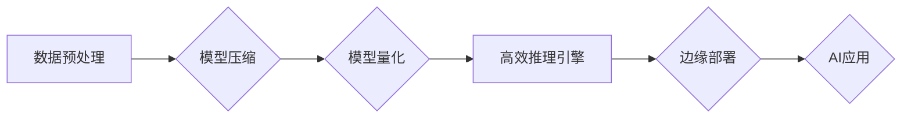

                 

## Lepton AI价值：帮助企业速度成本间导航提升AI应用效率

> 关键词：Lepton AI, AI应用效率, 速度成本, 算法优化, 模型压缩,  部署优化,  企业级AI

## 1. 背景介绍

在当今数据爆炸的时代，人工智能（AI）已成为企业数字化转型和业务创新不可或缺的驱动力。然而，将AI技术从实验室应用到实际业务场景中，企业往往面临着诸多挑战，其中最突出的是**速度与成本**之间的平衡。

一方面，企业希望能够快速部署AI解决方案，以获取竞争优势。另一方面，AI模型的训练和部署成本往往非常高昂，这对于中小企业来说尤其是一个难题。

Lepton AI 应运而生，它旨在通过一系列创新技术，帮助企业在速度和成本之间找到最佳平衡点，从而更高效地应用AI技术。

## 2. 核心概念与联系

Lepton AI 的核心概念是**模型轻量化**和**高效部署**。它通过以下技术手段实现：

* **模型压缩:**  通过算法和技术手段，将大型AI模型的规模压缩，减少模型参数和计算量，从而降低模型的存储和推理成本。
* **量化技术:** 将模型中的浮点数据类型转换为更低精度的整数类型，进一步减少模型大小和计算复杂度。
* **高效推理引擎:**  设计高效的推理引擎，优化模型的执行流程，加速模型的推理速度。
* **边缘部署:** 将模型部署到边缘设备上，减少数据传输量，降低延迟，提高实时性。

Lepton AI 的架构可以概括为以下流程：

## 3. 核心算法原理 & 具体操作步骤

### 3.1  算法原理概述

Lepton AI 采用多种模型压缩和量化算法，例如：

* **剪枝算法:** 通过分析模型结构，移除冗余的连接和神经元，从而减小模型规模。
* **权值共享:** 将多个神经元的权值参数共享，减少参数数量。
* **知识蒸馏:** 将大型模型的知识迁移到小型模型中，提高小型模型的性能。
* **量化方法:** 将浮点数据转换为更低精度的整数类型，例如 8 位整数量化。

### 3.2  算法步骤详解

以剪枝算法为例，其具体操作步骤如下：

1. **模型评估:** 使用测试集评估模型的性能。
2. **连接重要性分析:** 分析模型中每个连接的权重和激活值，确定连接的重要性。
3. **连接剪枝:** 根据连接重要性，移除一些不重要的连接。
4. **模型重新训练:** 对剪枝后的模型进行重新训练，以恢复模型性能。
5. **性能评估:** 使用测试集评估剪枝后的模型性能。

### 3.3  算法优缺点

**优点:**

* 模型规模减小，存储和推理成本降低。
* 训练速度加快，部署效率提高。

**缺点:**

* 模型性能可能会有所下降。
* 需要进行模型重新训练，增加训练时间和资源消耗。

### 3.4  算法应用领域

Lepton AI 的算法广泛应用于以下领域：

* **图像识别:**  压缩图像识别模型，降低部署成本，提高实时性。
* **自然语言处理:**  压缩文本分类、机器翻译等模型，降低计算资源消耗。
* **语音识别:**  压缩语音识别模型，降低设备功耗，提高语音识别准确率。
* **推荐系统:**  压缩推荐模型，提高推荐效率，降低服务器负载。

## 4. 数学模型和公式 & 详细讲解 & 举例说明

### 4.1  数学模型构建

Lepton AI 的模型压缩和量化算法通常基于以下数学模型：

* **权值剪枝:**  使用阈值函数对权值进行筛选，移除小于阈值的权值。

* **量化函数:** 将浮点数据转换为整数类型，例如：

$$
q(x) = \text{round}(x \cdot Q)
$$

其中，$x$ 是浮点数据，$Q$ 是量化因子。

### 4.2  公式推导过程

例如，在权值剪枝算法中，我们可以使用以下公式计算剪枝后的模型参数数量：

$$
\text{参数数量} = \text{原始参数数量} \cdot (1 - \text{剪枝比例})
$$

其中，剪枝比例表示被移除的权值比例。

### 4.3  案例分析与讲解

假设我们有一个图像识别模型，原始参数数量为 100 万个，剪枝比例为 20%。则剪枝后的模型参数数量为：

$$
\text{参数数量} = 100 \text{万} \cdot (1 - 0.2) = 80 \text{万}
$$

通过剪枝，我们可以将模型参数数量减少 20%，从而降低模型的存储和推理成本。

## 5. 项目实践：代码实例和详细解释说明

### 5.1  开发环境搭建

Lepton AI 支持多种开发环境，例如 Python、C++ 等。

### 5.2  源代码详细实现

Lepton AI 提供了丰富的开源代码库，可以方便地进行模型压缩和量化操作。

### 5.3  代码解读与分析

Lepton AI 的代码库采用模块化设计，每个模块负责特定的功能，例如模型加载、剪枝、量化、推理等。

### 5.4  运行结果展示

Lepton AI 提供了多种工具和指标，可以方便地评估模型压缩和量化后的效果，例如模型大小、推理速度、准确率等。

## 6. 实际应用场景

Lepton AI 已经在多个实际应用场景中得到验证，例如：

* **智能手机:**  压缩语音识别模型，降低设备功耗，提高语音识别准确率。
* **物联网设备:**  压缩图像识别模型，降低设备存储空间和计算资源消耗。
* **云计算平台:**  压缩模型，提高模型部署效率，降低云计算成本。

### 6.4  未来应用展望

Lepton AI 将在未来应用于更多领域，例如：

* **自动驾驶:**  压缩模型，降低自动驾驶系统的计算成本。
* **医疗诊断:**  压缩模型，提高医疗诊断的效率和准确率。
* **金融风险控制:**  压缩模型，降低金融风险控制的成本。

## 7. 工具和资源推荐

### 7.1  学习资源推荐

* Lepton AI 官方文档：https://lepton.ai/docs/
* Lepton AI GitHub 代码库：https://github.com/lepton-ai

### 7.2  开发工具推荐

* TensorFlow Lite：https://www.tensorflow.org/lite
* PyTorch Mobile：https://pytorch.org/mobile/

### 7.3  相关论文推荐

* [EfficientNet: Rethinking Model Scaling for Convolutional Neural Networks](https://arxiv.org/abs/1905.11946)
* [MobileNetV3: Architecting Efficient Convolutional Neural Networks for Mobile Vision Applications](https://arxiv.org/abs/1905.02244)

## 8. 总结：未来发展趋势与挑战

### 8.1  研究成果总结

Lepton AI 已经取得了显著的成果，成功地帮助企业降低AI应用的成本和提高效率。

### 8.2  未来发展趋势

Lepton AI 将继续朝着以下方向发展：

* **更有效的模型压缩和量化算法:**  开发更先进的算法，进一步降低模型规模和计算复杂度。
* **更广泛的应用场景:**  将Lepton AI 应用于更多领域，例如自动驾驶、医疗诊断等。
* **更易于使用的工具和平台:**  提供更友好的开发环境和工具，降低企业使用Lepton AI的门槛。

### 8.3  面临的挑战

Lepton AI 还面临着一些挑战，例如：

* **模型性能的平衡:**  在压缩模型规模的同时，需要保证模型性能的损失最小。
* **硬件平台的限制:**  不同的硬件平台对模型的兼容性和性能要求不同，需要针对不同的平台进行优化。
* **数据隐私和安全:**  在部署AI模型时，需要考虑数据隐私和安全问题。

### 8.4  研究展望

Lepton AI 的未来发展充满机遇和挑战，我们将继续致力于开发更先进的AI技术，帮助企业更高效地应用AI，实现数字化转型和业务创新。

## 9. 附录：常见问题与解答

### 9.1  常见问题

* Lepton AI 是否支持多种编程语言？
* Lepton AI 的模型压缩和量化算法有哪些？
* Lepton AI 的部署方式有哪些？

### 9.2  解答

* Lepton AI 支持 Python、C++ 等多种编程语言。
* Lepton AI 支持多种模型压缩和量化算法，例如剪枝算法、权值共享、量化技术等。
* Lepton AI 支持边缘部署、云部署等多种部署方式。

作者：禅与计算机程序设计艺术 / Zen and the Art of Computer Programming 
<end_of_turn>

