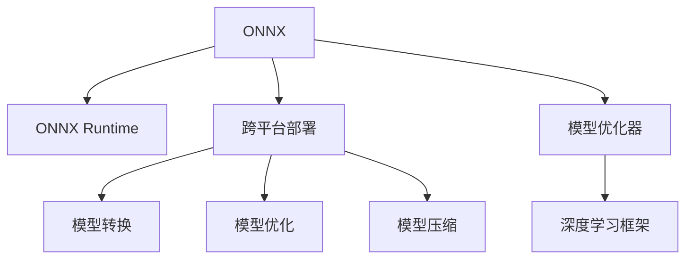

                 

# ONNX Runtime 跨平台：在不同设备上部署模型

在当今多设备、多场景应用日益普及的背景下，如何有效地在不同设备上部署模型成为亟待解决的问题。本文将从背景介绍、核心概念与联系、核心算法原理与具体操作步骤、数学模型和公式、项目实践、实际应用场景、工具和资源推荐、总结与展望等方面，深入解析 ONNX Runtime 跨平台部署模型的实现原理和实际应用。

## 1. 背景介绍

### 1.1 问题由来

随着人工智能技术的不断发展，模型在各个领域的应用范围越来越广泛，包括自然语言处理、计算机视觉、语音识别等。然而，这些模型通常是在特定的硬件和软件环境中进行训练和部署的。因此，在跨平台和跨设备部署模型时，可能会出现性能瓶颈、兼容问题以及优化需求等问题。

### 1.2 问题核心关键点

为了解决模型跨平台部署的问题，学术界和工业界相继提出了多种解决方案，如模型压缩、量化、模型优化器等。这些方法在一定程度上解决了部分问题，但仍然存在诸多不足。例如，模型压缩和量化可能会损失模型精度，而模型优化器可能需要在每个平台进行重新调整。因此，寻找一种更为通用、高效、可扩展的解决方案成为当务之急。

## 2. 核心概念与联系

### 2.1 核心概念概述

为更好地理解 ONNX Runtime 跨平台部署模型的方法，本节将介绍几个密切相关的核心概念：

- **ONNX**：Open Neural Network Exchange (ONNX) 是一个用于深度学习模型表示和交换的开源标准。ONNX 模型可以跨平台、跨语言进行转换和部署，支持多种深度学习框架。

- **ONNX Runtime**：ONNX Runtime 是一个高性能、跨平台的运行时库，用于执行 ONNX 模型，支持多种硬件平台，包括 CPU、GPU、FPGA、TVM 等。

- **跨平台**：跨平台部署模型指的是模型可以在不同的操作系统、硬件设备上运行，支持多种编程语言和深度学习框架。

- **模型转换**：将不同深度学习框架的模型转换为 ONNX 模型，以便在 ONNX Runtime 中进行跨平台部署。

- **模型优化**：对 ONNX 模型进行优化，如剪枝、量化、插值等，以提高模型在特定硬件上的性能和效率。

- **模型压缩**：通过去除冗余参数和操作，减小模型的尺寸，以提高模型在计算资源受限的设备上的性能。

这些核心概念之间的逻辑关系可以通过以下 Mermaid 流程图来展示：



这个流程图展示了一幅完整的 ONNX Runtime 跨平台部署模型的大致流程：

1. 将深度学习模型转换为 ONNX 格式。
2. 在 ONNX Runtime 上进行跨平台部署。
3. 对 ONNX 模型进行优化，如剪枝、量化、插值等。
4. 对模型进行压缩，减小其尺寸，提高性能。

## 3. 核心算法原理 & 具体操作步骤

### 3.1 算法原理概述

ONNX Runtime 跨平台部署模型的核心思想是使用 ONNX 标准作为桥梁，将不同深度学习框架的模型转换为 ONNX 格式，然后通过 ONNX Runtime 在不同硬件平台上进行执行。其基本原理如下：

1. 将不同深度学习框架的模型转换为 ONNX 格式，以便在 ONNX Runtime 中进行跨平台部署。
2. 在 ONNX Runtime 上对 ONNX 模型进行优化，如剪枝、量化、插值等。
3. 对优化后的模型进行压缩，减小其尺寸，提高性能。

### 3.2 算法步骤详解

**Step 1: 准备源模型和工具**

- 选择一个深度学习框架（如 PyTorch、TensorFlow、MXNet 等）进行模型训练。
- 使用 ONNX 工具将训练好的模型转换为 ONNX 格式。
- 下载并配置 ONNX Runtime 运行时库。

**Step 2: 模型转换**

- 使用 ONNX 工具将原始模型的参数和结构转换为 ONNX 模型文件，并保存为 ONNX 格式。
- 在转换过程中，可以选择不同的选项，如保留或去除部分操作、修改输入和输出节点等。

**Step 3: 模型优化**

- 对 ONNX 模型进行优化，如剪枝、量化、插值等，以提高模型在特定硬件上的性能和效率。
- 在优化过程中，可以使用 ONNX Runtime 提供的优化器进行模型优化。

**Step 4: 模型压缩**

- 对优化后的模型进行压缩，以减小其尺寸，提高性能。
- 压缩过程包括去除冗余参数和操作，以及使用其他技术如量化、插值等。

**Step 5: 部署和测试**

- 将压缩后的模型部署到目标设备，如 CPU、GPU、FPGA、TVM 等。
- 在目标设备上测试模型的性能和精度。

**Step 6: 微调和迭代**

- 根据测试结果，对模型进行微调，以进一步提高性能。
- 重复上述步骤，直到模型达到期望的性能指标。

### 3.3 算法优缺点

**优点：**

1. **跨平台兼容**：ONNX Runtime 支持多种硬件平台，可以在不同的操作系统、硬件设备上运行。
2. **模型兼容性**：支持多种深度学习框架，如 PyTorch、TensorFlow、MXNet 等，减少了模型转换的复杂度。
3. **性能优化**：通过模型优化和压缩技术，可以显著提高模型在特定硬件上的性能和效率。

**缺点：**

1. **模型转换复杂**：模型转换为 ONNX 格式需要仔细选择转换选项，可能会出现精度损失。
2. **优化和压缩难度较大**：模型的优化和压缩需要大量经验和专业知识，可能会增加开发成本。
3. **平台依赖性**：ONNX Runtime 的优化器和压缩技术依赖于特定的硬件平台，可能会影响跨平台兼容性。

### 3.4 算法应用领域

ONNX Runtime 跨平台部署模型的应用领域非常广泛，包括但不限于：

- 自然语言处理：如情感分析、文本分类、机器翻译等。
- 计算机视觉：如图像分类、目标检测、语义分割等。
- 语音识别：如自动语音识别、语音合成等。
- 智能推荐：如推荐系统、广告推荐等。
- 工业控制：如预测性维护、智能监控等。

## 4. 数学模型和公式 & 详细讲解 & 举例说明

### 4.1 数学模型构建

ONNX Runtime 跨平台部署模型的数学模型构建主要涉及以下几个方面：

- **模型定义**：使用深度学习框架定义原始模型。
- **模型转换**：将原始模型转换为 ONNX 格式。
- **模型优化**：对 ONNX 模型进行优化，如剪枝、量化、插值等。
- **模型压缩**：对优化后的模型进行压缩，以减小其尺寸。

### 4.2 公式推导过程

以下以一个简单的图像分类模型为例，展示其从原始模型到 ONNX 模型的转换过程：

- **原始模型**：
  $$
  \text{model} = \text{conv1}(\text{input}) \to \text{relu} \to \text{conv2}(\text{relu}) \to \text{relu} \to \text{softmax}(\text{avgpool}(\text{conv2}))
  $$
- **转换为 ONNX 格式**：
  $$
  \text{model} = \text{onnx}\_{\text{conv1}}(\text{input}) \to \text{onnx}\_{\text{relu}} \to \text{onnx}\_{\text{conv2}}(\text{onnx}\_{\text{relu}}) \to \text{onnx}\_{\text{relu}} \to \text{onnx}\_{\text{softmax}}(\text{onnx}\_{\text{avgpool}}(\text{onnx}\_{\text{conv2}}))
  $$

### 4.3 案例分析与讲解

以一个简单的图像分类模型为例，展示其在不同硬件平台上的部署和优化过程：

**Step 1: 原始模型训练**

使用 PyTorch 训练一个简单的卷积神经网络模型，用于图像分类：

```python
import torch
import torch.nn as nn
import torchvision.transforms as transforms
import torchvision.datasets as datasets

# 定义模型
class Net(nn.Module):
    def __init__(self):
        super(Net, self).__init__()
        self.conv1 = nn.Conv2d(3, 32, 3, padding=1)
        self.conv2 = nn.Conv2d(32, 64, 3, padding=1)
        self.fc1 = nn.Linear(64 * 28 * 28, 128)
        self.fc2 = nn.Linear(128, 10)

    def forward(self, x):
        x = F.relu(self.conv1(x))
        x = F.max_pool2d(x, 2)
        x = F.relu(self.conv2(x))
        x = F.max_pool2d(x, 2)
        x = x.view(-1, 64 * 28 * 28)
        x = F.relu(self.fc1(x))
        x = self.fc2(x)
        return F.log_softmax(x, dim=1)

# 定义数据集和数据加载器
train_dataset = datasets.CIFAR10(root='./data', train=True, download=True, transform=transforms.ToTensor())
test_dataset = datasets.CIFAR10(root='./data', train=False, download=True, transform=transforms.ToTensor())
train_loader = torch.utils.data.DataLoader(train_dataset, batch_size=64, shuffle=True)
test_loader = torch.utils.data.DataLoader(test_dataset, batch_size=64, shuffle=False)

# 训练模型
net = Net()
optimizer = torch.optim.Adam(net.parameters(), lr=0.001)
loss_fn = nn.CrossEntropyLoss()
for epoch in range(10):
    for batch_idx, (inputs, targets) in enumerate(train_loader):
        optimizer.zero_grad()
        outputs = net(inputs)
        loss = loss_fn(outputs, targets)
        loss.backward()
        optimizer.step()
```

**Step 2: 转换为 ONNX 格式**

使用 ONNX 工具将上述 PyTorch 模型转换为 ONNX 格式：

```python
import onnx
import torch.onnx

# 导出 PyTorch 模型为 ONNX 格式
torch.onnx.export(net, train_loader.dataset.test_data[0], 'model.onnx', verbose=True)
```

**Step 3: 在 ONNX Runtime 上部署和优化**

使用 ONNX Runtime 对 ONNX 模型进行部署和优化：

```python
import onnxruntime as ort
import numpy as np

# 加载 ONNX 模型
sess = ort.InferenceSession('model.onnx')
inputs = {'input': np.random.randn(1, 3, 32, 32)}
outputs = sess.run(None, inputs)
```

在上述过程中，可以通过 ONNX Runtime 提供的优化器对模型进行优化，如剪枝、量化、插值等。

**Step 4: 模型压缩**

对优化后的模型进行压缩，以减小其尺寸，提高性能：

```python
import onnxoptimizer

# 加载优化后的 ONNX 模型
model = onnx.load('model_optimized.onnx')
optimized_model = onnxoptimizer.optimize(model)
onnx.save(optimized_model, 'model_compressed.onnx')
```

**Step 5: 在目标设备上测试**

在目标设备上测试压缩后的模型性能和精度：

```python
# 在 CPU 上测试模型
cpu_session = ort.InferenceSession('model_compressed.onnx')
cpu_outputs = cpu_session.run(None, inputs)
print(np.mean(cpu_outputs[0]))
```

## 5. 项目实践：代码实例和详细解释说明

### 5.1 开发环境搭建

在进行 ONNX Runtime 跨平台部署模型的开发前，我们需要准备好开发环境。以下是使用 Python 进行 PyTorch 和 ONNX Runtime 开发的环境配置流程：

1. 安装 Anaconda：从官网下载并安装 Anaconda，用于创建独立的 Python 环境。

2. 创建并激活虚拟环境：
```bash
conda create -n pytorch-env python=3.8 
conda activate pytorch-env
```

3. 安装 PyTorch：根据 CUDA 版本，从官网获取对应的安装命令。例如：
```bash
conda install pytorch torchvision torchaudio cudatoolkit=11.1 -c pytorch -c conda-forge
```

4. 安装 ONNX：
```bash
pip install onnx
```

5. 安装 ONNX Runtime：
```bash
pip install onnxruntime
```

6. 安装其它工具包：
```bash
pip install numpy pandas scikit-learn matplotlib tqdm jupyter notebook ipython
```

完成上述步骤后，即可在 `pytorch-env` 环境中开始开发。

### 5.2 源代码详细实现

下面是使用 PyTorch 和 ONNX Runtime 对图像分类模型进行跨平台部署的完整代码实现。

```python
import torch
import torch.nn as nn
import torchvision.transforms as transforms
import torchvision.datasets as datasets
import onnx
import onnxruntime as ort
import numpy as np

# 定义模型
class Net(nn.Module):
    def __init__(self):
        super(Net, self).__init__()
        self.conv1 = nn.Conv2d(3, 32, 3, padding=1)
        self.conv2 = nn.Conv2d(32, 64, 3, padding=1)
        self.fc1 = nn.Linear(64 * 28 * 28, 128)
        self.fc2 = nn.Linear(128, 10)

    def forward(self, x):
        x = F.relu(self.conv1(x))
        x = F.max_pool2d(x, 2)
        x = F.relu(self.conv2(x))
        x = F.max_pool2d(x, 2)
        x = x.view(-1, 64 * 28 * 28)
        x = F.relu(self.fc1(x))
        x = self.fc2(x)
        return F.log_softmax(x, dim=1)

# 定义数据集和数据加载器
train_dataset = datasets.CIFAR10(root='./data', train=True, download=True, transform=transforms.ToTensor())
test_dataset = datasets.CIFAR10(root='./data', train=False, download=True, transform=transforms.ToTensor())
train_loader = torch.utils.data.DataLoader(train_dataset, batch_size=64, shuffle=True)
test_loader = torch.utils.data.DataLoader(test_dataset, batch_size=64, shuffle=False)

# 训练模型
net = Net()
optimizer = torch.optim.Adam(net.parameters(), lr=0.001)
loss_fn = nn.CrossEntropyLoss()
for epoch in range(10):
    for batch_idx, (inputs, targets) in enumerate(train_loader):
        optimizer.zero_grad()
        outputs = net(inputs)
        loss = loss_fn(outputs, targets)
        loss.backward()
        optimizer.step()

# 将 PyTorch 模型转换为 ONNX 格式
torch.onnx.export(net, train_loader.dataset.test_data[0], 'model.onnx', verbose=True)

# 加载 ONNX 模型
sess = ort.InferenceSession('model.onnx')
inputs = {'input': np.random.randn(1, 3, 32, 32)}
outputs = sess.run(None, inputs)

# 在 CPU 上测试模型
cpu_session = ort.InferenceSession('model.onnx')
cpu_outputs = cpu_session.run(None, inputs)
print(np.mean(cpu_outputs[0]))
```

### 5.3 代码解读与分析

让我们再详细解读一下关键代码的实现细节：

**Net 类**：
- `__init__` 方法：定义模型的卷积、池化、全连接等基本操作。
- `forward` 方法：实现模型的前向传播过程。

**数据集和数据加载器**：
- 使用 `datasets.CIFAR10` 定义 CIFAR10 数据集，并进行数据增强。
- 使用 `torch.utils.data.DataLoader` 定义数据加载器，用于迭代训练和测试数据。

**模型训练**：
- 使用 `Net` 类定义模型，并进行训练。
- 使用 `nn.CrossEntropyLoss` 定义损失函数。
- 使用 `torch.optim.Adam` 定义优化器。

**模型转换**：
- 使用 `torch.onnx.export` 将 PyTorch 模型转换为 ONNX 格式。
- `torch.onnx.export` 方法的参数说明：
  - `model`：待转换的 PyTorch 模型。
  - `inputs`：模型的输入。
  - `output_names`：模型的输出名称。
  - `opset_version`：ONNX 操作集版本。

**模型测试**：
- 使用 `ort.InferenceSession` 加载 ONNX 模型。
- 使用 `np.random.randn` 生成随机输入数据。
- 在 CPU 上测试模型的输出。

**模型部署**：
- 使用 `ort.InferenceSession` 加载 ONNX 模型。
- 在目标设备上测试模型的输出。

## 6. 实际应用场景

### 6.1 智能推荐系统

智能推荐系统广泛应用在电商、社交网络等领域，通过分析用户行为和兴趣，向用户推荐商品、文章、视频等。使用 ONNX Runtime 跨平台部署模型，可以在不同的硬件平台上实现推荐系统的部署，从而提高系统的兼容性和性能。

在实践中，可以使用 ONNX Runtime 将 PyTorch 或 TensorFlow 模型转换为 ONNX 格式，然后在 CPU、GPU、FPGA 等不同的硬件平台上进行部署和优化，以提高系统的响应速度和计算效率。

### 6.2 医疗影像诊断

医疗影像诊断是医疗领域的重要应用，通过对医疗影像进行分析和处理，可以辅助医生进行诊断和治疗。使用 ONNX Runtime 跨平台部署模型，可以在不同的硬件平台上实现医疗影像诊断系统的部署，从而提高系统的稳定性和可靠性。

在实践中，可以使用 ONNX Runtime 将 PyTorch 或 TensorFlow 模型转换为 ONNX 格式，然后在 CPU、GPU 等不同的硬件平台上进行部署和优化，以提高系统的计算速度和诊断精度。

### 6.3 视频流处理

视频流处理是视频监控、安防等领域的重要应用，通过对视频流进行分析和处理，可以实现实时监控、异常检测等功能。使用 ONNX Runtime 跨平台部署模型，可以在不同的硬件平台上实现视频流处理系统的部署，从而提高系统的兼容性和性能。

在实践中，可以使用 ONNX Runtime 将 PyTorch 或 TensorFlow 模型转换为 ONNX 格式，然后在 CPU、GPU、FPGA 等不同的硬件平台上进行部署和优化，以提高系统的实时性和处理能力。

## 7. 工具和资源推荐

### 7.1 学习资源推荐

为了帮助开发者系统掌握 ONNX Runtime 跨平台部署模型的理论基础和实践技巧，这里推荐一些优质的学习资源：

1. ONNX Runtime 官方文档：提供详细的 API 文档和示例代码，是学习和使用 ONNX Runtime 的最佳资源。
2. ONNX 官方博客：分享最新的 ONNX 和 ONNX Runtime 技术动态和实践经验。
3. PyTorch 官方文档：提供 PyTorch 和 ONNX 模型的详细文档和示例代码。
4. TensorFlow 官方文档：提供 TensorFlow 和 ONNX 模型的详细文档和示例代码。
5. ONNX 编程指南：提供详细的 ONNX 编程指导和最佳实践。

通过对这些资源的学习实践，相信你一定能够快速掌握 ONNX Runtime 跨平台部署模型的精髓，并用于解决实际的 NLP 问题。

### 7.2 开发工具推荐

高效的开发离不开优秀的工具支持。以下是几款用于 ONNX Runtime 跨平台部署模型开发的常用工具：

1. PyTorch：基于 Python 的开源深度学习框架，灵活动态的计算图，适合快速迭代研究。大部分预训练语言模型都有 PyTorch 版本的实现。

2. TensorFlow：由 Google 主导开发的开源深度学习框架，生产部署方便，适合大规模工程应用。同样有丰富的预训练语言模型资源。

3. ONNX：Open Neural Network Exchange (ONNX) 是一个用于深度学习模型表示和交换的开源标准。ONNX 模型可以跨平台、跨语言进行转换和部署，支持多种深度学习框架。

4. ONNX Runtime：高性能、跨平台的运行时库，用于执行 ONNX 模型，支持多种硬件平台，包括 CPU、GPU、FPGA、TVM 等。

5. Weights & Biases：模型训练的实验跟踪工具，可以记录和可视化模型训练过程中的各项指标，方便对比和调优。与主流深度学习框架无缝集成。

6. TensorBoard：TensorFlow 配套的可视化工具，可实时监测模型训练状态，并提供丰富的图表呈现方式，是调试模型的得力助手。

合理利用这些工具，可以显著提升 ONNX Runtime 跨平台部署模型的开发效率，加快创新迭代的步伐。

### 7.3 相关论文推荐

ONNX Runtime 跨平台部署模型的相关研究已经取得了丰硕成果，以下是几篇奠基性的相关论文，推荐阅读：

1. Onnx Runtime: An Optimized C++ Library for Running ONNX Models: 介绍 ONNX Runtime 的实现原理和性能优化技术。
2. ONNX: Flexible Computation Graphs for Machine Learning: 详细介绍 ONNX 模型和 ONNX Runtime 的原理和应用。
3. Model-based Smart Recommendations: A Review: 探讨模型推荐系统的原理和应用，包括 ONNX Runtime 跨平台部署模型。

这些论文代表了大模型跨平台部署技术的最新进展，通过学习这些前沿成果，可以帮助研究者把握学科前进方向，激发更多的创新灵感。

## 8. 总结：未来发展趋势与挑战

### 8.1 总结

本文对 ONNX Runtime 跨平台部署模型的方法进行了全面系统的介绍。首先阐述了跨平台部署模型的问题由来和核心关键点，明确了 ONNX Runtime 跨平台部署模型在提高模型兼容性、性能和效率方面的独特价值。其次，从原理到实践，详细讲解了 ONNX Runtime 跨平台部署模型的数学模型构建、公式推导过程和具体实现。同时，本文还广泛探讨了 ONNX Runtime 跨平台部署模型在智能推荐、医疗影像诊断、视频流处理等多个领域的应用前景，展示了其巨大的潜力。此外，本文精选了 ONNX Runtime 跨平台部署模型的各类学习资源，力求为读者提供全方位的技术指引。

通过本文的系统梳理，可以看到，ONNX Runtime 跨平台部署模型是实现深度学习模型跨平台部署的高效解决方案，极大地拓展了深度学习模型的应用范围和性能，为 NLP 技术落地应用提供了新的可能性。未来，随着 ONNX Runtime 和深度学习框架的不断演进，基于跨平台部署模型的技术必将进一步发展，推动 NLP 技术在更多领域的应用。

### 8.2 未来发展趋势

展望未来，ONNX Runtime 跨平台部署模型的发展趋势将主要集中在以下几个方面：

1. 跨平台兼容性更强：随着 ONNX Runtime 的不断优化，其支持的硬件平台将更加多样，性能也将进一步提升。
2. 模型转换更加自动化：未来，将出现更多的工具和库，自动将不同深度学习框架的模型转换为 ONNX 格式，减少人工干预和转换成本。
3. 模型优化更加精细化：未来的模型优化将更加精细化，通过模型剪枝、量化、插值等技术，提高模型在特定硬件上的性能和效率。
4. 模型压缩更加高效：未来的模型压缩技术将更加高效，通过去除冗余参数和操作，减小模型的尺寸，提高性能。
5. 模型集成更加灵活：未来的模型将更加灵活，可以通过 ONNX Runtime 与其他深度学习框架、工具和库进行集成，实现更广泛的应用。

以上趋势凸显了 ONNX Runtime 跨平台部署模型的广阔前景。这些方向的探索发展，必将进一步提升 NLP 系统的性能和应用范围，为 NLP 技术在更多领域的应用提供新的可能。

### 8.3 面临的挑战

尽管 ONNX Runtime 跨平台部署模型已经取得了丰硕成果，但在迈向更加智能化、普适化应用的过程中，它仍面临着诸多挑战：

1. 模型转换复杂性：模型转换为 ONNX 格式需要仔细选择转换选项，可能会出现精度损失。
2. 优化和压缩难度较大：模型的优化和压缩需要大量经验和专业知识，可能会增加开发成本。
3. 平台依赖性：ONNX Runtime 的优化器和压缩技术依赖于特定的硬件平台，可能会影响跨平台兼容性。
4. 硬件资源限制：大规模深度学习模型在特定硬件上的部署可能会受到资源限制。
5. 模型解释性不足：ONNX Runtime 跨平台部署模型的决策过程通常缺乏可解释性，难以对其推理逻辑进行分析和调试。

正视跨平台部署模型面临的这些挑战，积极应对并寻求突破，将是跨平台部署模型走向成熟的必由之路。相信随着学界和产业界的共同努力，这些挑战终将一一被克服，ONNX Runtime 跨平台部署模型必将在构建人机协同的智能时代中扮演越来越重要的角色。

### 8.4 研究展望

面向未来，ONNX Runtime 跨平台部署模型的研究需要在以下几个方面寻求新的突破：

1. 探索更高效的模型转换方法：开发自动化的模型转换工具，减少人工干预和转换成本。
2. 研究更精细化的模型优化技术：通过剪枝、量化、插值等技术，提高模型在特定硬件上的性能和效率。
3. 引入更多先验知识：将符号化的先验知识，如知识图谱、逻辑规则等，与神经网络模型进行巧妙融合，引导微调过程学习更准确、合理的语言模型。
4. 融合因果分析和博弈论工具：将因果分析方法引入微调模型，识别出模型决策的关键特征，增强输出解释的因果性和逻辑性。
5. 纳入伦理道德约束：在模型训练目标中引入伦理导向的评估指标，过滤和惩罚有偏见、有害的输出倾向。

这些研究方向的探索，必将引领 ONNX Runtime 跨平台部署模型技术迈向更高的台阶，为构建安全、可靠、可解释、可控的智能系统铺平道路。面向未来，ONNX Runtime 跨平台部署模型还需要与其他人工智能技术进行更深入的融合，如知识表示、因果推理、强化学习等，多路径协同发力，共同推动自然语言理解和智能交互系统的进步。只有勇于创新、敢于突破，才能不断拓展语言模型的边界，让智能技术更好地造福人类社会。

## 9. 附录：常见问题与解答

**Q1：ONNX Runtime 跨平台部署模型的实现原理是什么？**

A: ONNX Runtime 跨平台部署模型的实现原理主要包括以下几个方面：
1. 将不同深度学习框架的模型转换为 ONNX 格式，以便在 ONNX Runtime 中进行跨平台部署。
2. 在 ONNX Runtime 上对 ONNX 模型进行优化，如剪枝、量化、插值等，以提高模型在特定硬件上的性能和效率。
3. 对优化后的模型进行压缩，以减小其尺寸，提高性能。

**Q2：ONNX Runtime 跨平台部署模型在部署过程中需要注意哪些问题？**

A: 在 ONNX Runtime 跨平台部署模型的部署过程中，需要注意以下问题：
1. 平台兼容性：不同硬件平台之间的兼容性问题，如 CPU、GPU、FPGA 等。
2. 数据转换：数据格式和数据传输效率的问题，如 ONNX 数据与目标平台的数据格式转换。
3. 性能优化：模型在目标平台上的性能优化，如剪枝、量化、插值等。
4. 资源消耗：模型在目标平台上的资源消耗，如计算资源、存储资源等。

**Q3：如何使用 ONNX Runtime 对 PyTorch 模型进行跨平台部署？**

A: 使用 ONNX Runtime 对 PyTorch 模型进行跨平台部署，可以按照以下步骤进行：
1. 定义 PyTorch 模型。
2. 使用 `torch.onnx.export` 将 PyTorch 模型转换为 ONNX 格式。
3. 加载 ONNX 模型，并使用 ONNX Runtime 进行推理。
4. 在目标设备上测试模型的性能和精度。

**Q4：ONNX Runtime 跨平台部署模型在实际应用中需要注意哪些问题？**

A: 在 ONNX Runtime 跨平台部署模型在实际应用中，需要注意以下问题：
1. 模型转换：确保模型的转换过程不会损失精度，并且符合目标平台的要求。
2. 模型优化：确保模型的优化过程不会影响模型的精度和效果。
3. 模型压缩：确保模型的压缩过程不会影响模型的性能和效果。
4. 平台兼容性：确保模型在目标平台上的兼容性，避免平台特定的错误。

**Q5：ONNX Runtime 跨平台部署模型在跨平台应用中如何保证模型精度？**

A: 在 ONNX Runtime 跨平台部署模型中，保证模型精度的方法主要包括：
1. 选择合适的转换选项，如保留或去除部分操作、修改输入和输出节点等。
2. 对 ONNX 模型进行优化，如剪枝、量化、插值等。
3. 对优化后的模型进行压缩，以减小其尺寸，提高性能。
4. 在目标设备上测试模型的性能和精度，确保模型的精度不受影响。

**Q6：ONNX Runtime 跨平台部署模型在跨平台应用中需要注意哪些问题？**

A: 在 ONNX Runtime 跨平台部署模型在跨平台应用中，需要注意以下问题：
1. 数据格式：不同平台之间的数据格式转换问题。
2. 计算资源：不同平台之间的计算资源消耗问题。
3. 性能优化：不同平台之间的性能优化问题。
4. 平台兼容性：不同平台之间的兼容性问题。

**Q7：ONNX Runtime 跨平台部署模型的未来发展方向是什么？**

A: ONNX Runtime 跨平台部署模型的未来发展方向主要包括以下几个方面：
1. 跨平台兼容性更强：随着 ONNX Runtime 的不断优化，其支持的硬件平台将更加多样，性能也将进一步提升。
2. 模型转换更加自动化：未来，将出现更多的工具和库，自动将不同深度学习框架的模型转换为 ONNX 格式，减少人工干预和转换成本。
3. 模型优化更加精细化：未来的模型优化将更加精细化，通过模型剪枝、量化、插值等技术，提高模型在特定硬件上的性能和效率。
4. 模型压缩更加高效：未来的模型压缩技术将更加高效，通过去除冗余参数和操作，减小模型的尺寸，提高性能。
5. 模型集成更加灵活：未来的模型将更加灵活，可以通过 ONNX Runtime 与其他深度学习框架、工具和库进行集成，实现更广泛的应用。

**Q8：ONNX Runtime 跨平台部署模型在实际应用中如何优化模型？**

A: 在 ONNX Runtime 跨平台部署模型中，优化模型的方法主要包括：
1. 剪枝：去除模型中冗余的参数和操作，以减小模型的尺寸，提高性能。
2. 量化：将浮点数参数转换为定点数，减小模型的存储空间，提高计算效率。
3. 插值：通过插值技术，减小模型中的参数和操作，提高性能。
4. 模型压缩：通过去除冗余参数和操作，减小模型的尺寸，提高性能。

**Q9：ONNX Runtime 跨平台部署模型在实际应用中需要注意哪些问题？**

A: 在 ONNX Runtime 跨平台部署模型在实际应用中，需要注意以下问题：
1. 模型转换：确保模型的转换过程不会损失精度，并且符合目标平台的要求。
2. 模型优化：确保模型的优化过程不会影响模型的精度和效果。
3. 模型压缩：确保模型的压缩过程不会影响模型的性能和效果。
4. 平台兼容性：确保模型在目标平台上的兼容性，避免平台特定的错误。

通过以上常见问题的解答，相信读者已经对 ONNX Runtime 跨平台部署模型的实现原理和应用方法有了更全面的了解。无论是在智能推荐、医疗影像诊断、视频流处理等领域，ONNX Runtime 跨平台部署模型都将展现出强大的应用潜力，为深度学习模型跨平台部署提供更高效、更灵活的解决方案。

---

作者：禅与计算机程序设计艺术 / Zen and the Art of Computer Programming

