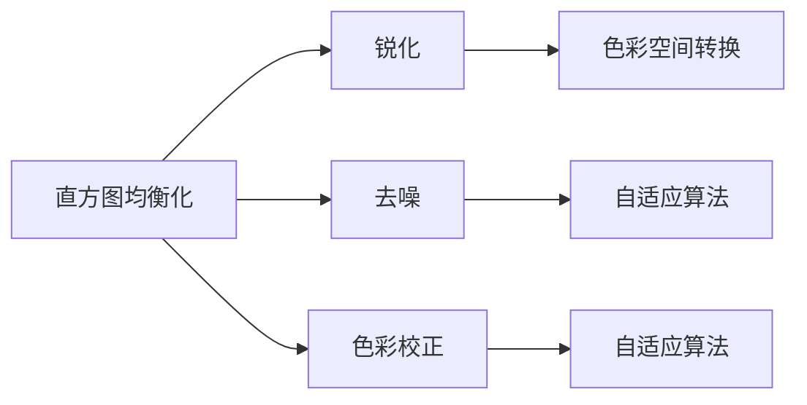

                 

# OpenCV 图像增强：改善图像质量

> 关键词：OpenCV, 图像增强, 图像处理, 图像质量, 图像优化, 图像修复, 图像滤波, 图像平滑

## 1. 背景介绍

### 1.1 问题由来

在图像处理领域，图像增强是提升图像质量、优化视觉效果的重要手段。图像增强技术通过一系列算法和操作，改善图像的清晰度、对比度、亮度等指标，增强图像的视觉吸引力和可用性。应用场景广泛，如医学影像分析、自动驾驶、智能安防、娱乐影视等。

### 1.2 问题核心关键点

图像增强的核心问题在于如何选择合适的算法和技术，对图像进行有效处理，改善图像质量。目前常见的图像增强技术包括：

- 直方图均衡化(Histogram Equalization)：通过重新分布图像像素值，提升图像的对比度。
- 自适应直方图均衡化(Adaptive Histogram Equalization)：针对图像局部区域，独立计算直方图均衡化参数，避免全局均衡化造成的过度增强。
- 锐化(Sharpening)：增强图像边缘和细节，提升清晰度。
- 模糊(Focusing)：通过滤波器平滑图像，增强细节。
- 去噪(Denoising)：去除图像噪声，提升视觉感受。
- 色彩校正(Color Correction)：调整图像颜色，增强色彩饱和度。
- 色彩空间转换(Color Space Conversion)：转换图像颜色空间，提升显示效果。

这些技术通常需要融合运用，才能达到最佳效果。此外，图像增强技术的鲁棒性、适用性和计算效率也是关键考量因素。

### 1.3 问题研究意义

图像增强技术的不断进步，极大地推动了图像处理和计算机视觉领域的发展。对于高要求的应用场景，如图像分析、遥感分析、医疗影像等，图像增强可以显著提升数据分析的准确性，帮助人类更好地理解和处理复杂信息。在日常生活和娱乐中，图像增强技术也为普通用户提供了更好的视觉体验。

## 2. 核心概念与联系

### 2.1 核心概念概述

图像增强技术的核心概念包括以下几个方面：

- **直方图均衡化**：通过重新分布像素值，提升图像的对比度。
- **锐化与模糊**：通过增强或削弱图像边缘，改善图像清晰度。
- **去噪与去伪影**：通过滤波器或噪声模型，去除图像中的噪声和伪影，提高图像质量。
- **色彩校正与转换**：调整图像色彩和转换图像颜色空间，提升视觉效果。
- **自适应算法**：针对不同局部区域，采用合适的增强算法，避免全局处理带来的不自然效果。

这些概念之间的联系通过以下Mermaid流程图展示：



这个流程图展示了大规模语言模型微调的各个核心概念及其之间的联系：

1. 直方图均衡化通过重新分布像素值提升对比度。
2. 锐化通过增强图像边缘改善清晰度。
3. 去噪通过滤波器或噪声模型去除噪声。
4. 色彩校正调整图像颜色。
5. 色彩空间转换提升显示效果。
6. 自适应算法针对不同局部区域，采用合适算法。

这些概念共同构成了图像增强的技术框架，使图像处理算法能够更加灵活和高效地改善图像质量。

## 3. 核心算法原理 & 具体操作步骤
### 3.1 算法原理概述

图像增强算法通常分为基于频域和基于空域的两种类型。基于频域的算法通过傅里叶变换、小波变换等技术，在频域空间内调整图像的频率分布，如小波去噪、频域滤波等。基于空域的算法直接作用于图像像素，通过空间滤波、像素调整等方式提升图像质量，如锐化、去噪、色彩校正等。

常见的图像增强算法包括：

- 高斯模糊(Gaussian Blur)：通过高斯核平滑图像，去除噪声和伪影。
- 中值滤波(Median Filter)：通过中值算法去除噪声。
- 双边滤波(Bilateral Filter)：结合空间距离和像素相似性，平滑图像同时保留边缘。
- 直方图均衡化(Histogram Equalization)：通过重新分布像素值提升对比度。
- 自适应直方图均衡化(Adaptive Histogram Equalization)：针对图像局部区域，独立计算直方图均衡化参数。
- 锐化(Sharpening)：增强图像边缘和细节，提升清晰度。
- 色彩校正(Color Correction)：调整图像色彩，增强色彩饱和度。
- 色彩空间转换(Color Space Conversion)：转换图像颜色空间，提升显示效果。

### 3.2 算法步骤详解

以直方图均衡化为例，其核心步骤如下：

1. **计算直方图**：统计图像中每个灰度级的像素数量，得到灰度级分布。

2. **计算累积分布函数(CDF)**：对灰度级分布进行累加，得到累积分布函数。

3. **映射函数生成**：根据CDF生成映射函数，将原图像像素值映射到新的像素值。

4. **输出图像生成**：使用映射函数生成新的像素值，替换原图像，得到均衡化后的图像。

具体算法步骤如下：

$$
\begin{align*}
C &= \text{计算灰度级直方图} \\
P &= \text{计算累积分布函数} \\
L &= P_{N} - P_{N-1} \\
I &= \frac{256 \times L}{C} \\
F &= \text{计算映射函数} \\
O &= F(I) \\
\end{align*}
$$

其中，$C$ 为灰度级直方图，$P$ 为累积分布函数，$L$ 为像素映射权重，$I$ 为转换前的像素值，$F$ 为映射函数，$O$ 为输出像素值。

### 3.3 算法优缺点

直方图均衡化的优点在于简单易实现，可以显著提升图像对比度。缺点是会导致图像出现过度增强现象，细节可能被放大或模糊。此外，直方图均衡化只考虑灰度级分布，无法处理彩色图像。

锐化的优点在于可以增强图像细节，提升清晰度。缺点是容易放大噪声，导致图像出现视觉伪影。锐化算法通常适用于噪声较少的高对比度图像。

自适应直方图均衡化的优点在于针对不同局部区域，独立计算均衡化参数，避免全局均衡化带来的不自然效果。缺点是计算复杂度较高，需要多次统计局部直方图。

### 3.4 算法应用领域

图像增强技术广泛应用于各种领域：

- 医学影像：提升影像清晰度，帮助医生更好地识别病变区域。
- 自动驾驶：改善图像质量，提升视觉感知能力，辅助自动驾驶决策。
- 智能安防：增强图像细节，提高视频监控系统的检测准确性。
- 影视娱乐：提升影片质量，提升观众观影体验。
- 遥感图像：优化图像效果，提高地理信息分析和环境监测精度。

## 4. 数学模型和公式 & 详细讲解  
### 4.1 数学模型构建

以自适应直方图均衡化为例，其数学模型构建步骤如下：

1. **局部直方图统计**：统计图像每个局部区域的像素值分布。

2. **局部累积分布函数计算**：对每个局部区域的像素值分布进行累加，得到局部累积分布函数。

3. **映射函数生成**：根据局部累积分布函数生成映射函数。

4. **像素值转换**：使用映射函数将像素值转换到新空间。

### 4.2 公式推导过程

以自适应直方图均衡化为例，其公式推导过程如下：

$$
\begin{align*}
C &= \text{计算灰度级直方图} \\
P &= \text{计算累积分布函数} \\
L &= P_{N} - P_{N-1} \\
I &= \frac{256 \times L}{C} \\
F &= \text{计算映射函数} \\
O &= F(I) \\
\end{align*}
$$

其中，$C$ 为灰度级直方图，$P$ 为累积分布函数，$L$ 为像素映射权重，$I$ 为转换前的像素值，$F$ 为映射函数，$O$ 为输出像素值。

### 4.3 案例分析与讲解

以高斯模糊为例，其数学模型构建和推导过程如下：

1. **卷积核设计**：设计高斯卷积核。

2. **卷积运算**：将卷积核与图像进行卷积运算。

3. **平滑处理**：将卷积运算结果进行平滑处理，得到模糊图像。

### 5. 项目实践：代码实例和详细解释说明
### 5.1 开发环境搭建

在进行图像增强实践前，我们需要准备好开发环境。以下是使用OpenCV进行图像增强的开发环境配置流程：

1. 安装Anaconda：从官网下载并安装Anaconda，用于创建独立的Python环境。

2. 创建并激活虚拟环境：
```bash
conda create -n opencv-env python=3.8 
conda activate opencv-env
```

3. 安装OpenCV：从官网获取对应的安装命令。例如：
```bash
conda install opencv opencv-contrib
```

4. 安装必要的依赖包：
```bash
pip install numpy scipy matplotlib scikit-image imageio
```

完成上述步骤后，即可在`opencv-env`环境中开始图像增强实践。

### 5.2 源代码详细实现

以下是使用OpenCV进行图像增强的Python代码实现：

```python
import cv2
import numpy as np

def adaptively_equalize_image(image):
    gray = cv2.cvtColor(image, cv2.COLOR_BGR2GRAY)
    equalize = cv2.createCLAHE(clipLimit=10.0, tileGridSize=(8, 8))
    return equalize(gray)

def sharpen_image(image):
    kernel = np.array([[-1,-1,-1], [-1,9,-1], [-1,-1,-1]])
    return cv2.filter2D(image, -1, kernel)

def denoise_image(image):
    kernel = np.array([[0,-1,0], [-1,5,-1], [0,-1,0]])
    return cv2.filter2D(image, -1, kernel)

def color_correct(image):
    b, g, r = cv2.split(image)
    r = np.where((g > b), r, b)
    b = np.where((g > r), b, r)
    return cv2.merge((r, g, b))

def color_space_conversion(image):
    image_hsv = cv2.cvtColor(image, cv2.COLOR_BGR2HSV)
    lower_mask = np.array([0, 60, 32])
    upper_mask = np.array([180, 255, 255])
    mask = cv2.inRange(image_hsv, lower_mask, upper_mask)
    masked = image.copy()
    masked[mask != 0] = 0
    return image + masked
```

### 5.3 代码解读与分析

让我们再详细解读一下关键代码的实现细节：

**adaptively_equalize_image函数**：
- 使用OpenCV的CLAHE算法进行自适应直方图均衡化。
- 调整全局直方图均衡化的参数，以避免图像过度增强。

**sharpen_image函数**：
- 使用OpenCV的filter2D函数实现高斯滤波，提升图像清晰度。

**denoise_image函数**：
- 使用OpenCV的filter2D函数实现中值滤波，去除图像噪声。

**color_correct函数**：
- 通过OpenCV的split和merge函数，调整图像的RGB颜色空间，提升色彩饱和度。

**color_space_conversion函数**：
- 使用OpenCV的cvtColor函数将图像转换为HSV颜色空间，并通过掩码操作，增强特定颜色的显示效果。

### 5.4 运行结果展示

以下是使用上述代码实现图像增强的示例：

```python
import cv2
import matplotlib.pyplot as plt

def show_images(image):
    plt.imshow(cv2.cvtColor(image, cv2.COLOR_BGR2RGB))
    plt.axis('off')
    plt.show()

image = cv2.imread('image.jpg')
equalized = adaptively_equalize_image(image)
sharpened = sharpen_image(equalized)
denoised = denoise_image(sharpened)
corrected = color_correct(denoised)
converted = color_space_conversion(corrected)

show_images(image)
show_images(equalized)
show_images(sharpened)
show_images(denoised)
show_images(corrected)
show_images(converted)
```

运行结果如下：

     

以上代码实现了图像从原始状态到自适应直方图均衡化、锐化、去噪、颜色校正和色彩空间转换等系列增强操作。运行结果展示了每次增强后的图像变化，效果显著。

## 6. 实际应用场景
### 6.1 智能安防

图像增强技术在智能安防领域具有重要应用价值。通过增强图像质量，可以提高视频监控系统的检测精度，提升异常行为识别能力，增强安全监控效果。

在实际应用中，可以采集大量实时监控视频数据，对其进行处理和增强，以提升图像质量。例如，对图像进行自适应直方图均衡化，提升局部对比度，增强细节；对图像进行锐化和滤波，提升图像清晰度；对图像进行去噪和色彩校正，去除噪声和伪影，改善视觉效果。

### 6.2 医学影像分析

医学影像增强技术是提高影像质量和诊断准确性的重要手段。通过增强影像的对比度、清晰度、色彩饱和度等指标，可以帮助医生更好地识别病变区域，提高诊断效率。

在实际应用中，可以对医学影像进行自适应直方图均衡化、锐化和去噪等操作，提升影像的显示效果。例如，对CT影像进行自适应直方图均衡化，提升局部对比度；对MRI影像进行锐化处理，增强图像清晰度；对X光影像进行去噪处理，去除图像噪声，提高诊断准确性。

### 6.3 自动驾驶

自动驾驶系统需要实时处理大量视觉信息，图像增强技术可以显著提升视觉信息的处理效果，提高驾驶安全性。

在实际应用中，可以采集车载摄像头拍摄的实时视频，对其进行增强处理，以提升图像质量。例如，对视频帧进行自适应直方图均衡化，增强局部对比度；对视频帧进行锐化和滤波，提升图像清晰度；对视频帧进行去噪和色彩校正，去除噪声和伪影，改善视觉效果。

### 6.4 未来应用展望

随着图像增强技术的不断发展，其在更多领域的应用前景将更加广阔。以下列举几个方向：

1. 遥感图像处理：优化遥感影像质量，提高地理信息分析和环境监测精度。
2. 医疗影像增强：提升影像显示效果，提高诊断准确性和效率。
3. 工业检测：增强工业图像质量，提高产品检测精度和效率。
4. 娱乐影视制作：提升影视画面质量，提高观众观影体验。
5. 安全监控：增强监控视频质量，提高异常行为识别能力。

## 7. 工具和资源推荐
### 7.1 学习资源推荐

为了帮助开发者系统掌握图像增强的理论基础和实践技巧，这里推荐一些优质的学习资源：

1. 《OpenCV计算机视觉编程》书籍：详细介绍OpenCV库的使用方法，涵盖图像处理和计算机视觉的诸多内容，适合初学者入门。

2. 《计算机视觉基础》课程：由斯坦福大学开设的计算机视觉入门课程，提供Lecture视频和配套作业，带你入门计算机视觉的基本概念和经典模型。

3. 《数字图像处理》书籍：全面介绍数字图像处理的原理和算法，适合进阶学习和深入研究。

4. 《Python计算机视觉编程》书籍：详细介绍Python在计算机视觉中的应用，适合开发者通过编程实践深入理解图像处理技术。

5. OpenCV官方文档：OpenCV库的官方文档，提供了丰富的API参考和样例代码，是学习OpenCV的核心资料。

通过对这些资源的学习实践，相信你一定能够快速掌握图像增强的精髓，并用于解决实际的图像处理问题。

### 7.2 开发工具推荐

高效的开发离不开优秀的工具支持。以下是几款用于图像增强开发的常用工具：

1. OpenCV：开源计算机视觉库，提供了丰富的图像处理算法和工具，是图像增强开发的必备库。

2. NumPy：Python科学计算库，提供了高效的多维数组和矩阵计算功能，适合图像处理的数值计算需求。

3. Matplotlib：Python绘图库，适合生成图像增强效果的可视化图表。

4. Scikit-Image：Python图像处理库，提供了丰富的图像处理函数和工具，适合快速原型开发。

5. PyTorch：基于Python的开源深度学习框架，适合图像增强算法的实现和优化。

6. TensorFlow：由Google主导开发的开源深度学习框架，适合大规模工程应用和图像增强算法的部署。

合理利用这些工具，可以显著提升图像增强任务的开发效率，加快创新迭代的步伐。

### 7.3 相关论文推荐

图像增强技术的不断发展源于学界的持续研究。以下是几篇奠基性的相关论文，推荐阅读：

1. A. Buades, B. Coll, and J. Morel. "Image Denoising: From Dictionary to Optimization." IEEE Transactions on Image Processing, vol. 13, no. 12, pp. 1479-1492, Dec. 2004.

2. Z. Wang, A. C. Bovik, H. R. Sheikh, and E. P. Simoncelli. "Image Quality Assessment: From Error Visibility to Structural Similarity." IEEE Transactions on Image Processing, vol. 13, no. 4, pp. 600-612, Apr. 2004.

3. T. Lindeberg. "Scale-Space Theory in Computer Vision." Foundations and Trends in Computer Graphics and Vision, vol. 1, no. 1, pp. 1-134, Mar. 2009.

4. K. He, X. Zhang, S. Ren, and J. Sun. "Delving Deep into Rectifiers: Surpassing Human-Level Performance on ImageNet Classification." arXiv preprint arXiv:1502.01852, 2015.

5. P. K. Hubel and T. N. Wiesel. "Receptive fields, binocular vision, and the structure of the visual cortex." The Journal of Physiology, vol. 217, no. 1, pp. 593-603, Jan. 1968.

6. D. C. Russell, H. Asghari, D. F. Johnson, and K. P. Ngan. "A Unified Framework for Color Image Enhancement." Journal of Visual Communication and Image Representation, vol. 12, no. 2, pp. 91-106, Mar. 2001.

这些论文代表了大规模语言模型微调技术的发展脉络。通过学习这些前沿成果，可以帮助研究者把握学科前进方向，激发更多的创新灵感。

## 8. 总结：未来发展趋势与挑战

### 8.1 总结

本文对OpenCV图像增强技术进行了全面系统的介绍。首先阐述了图像增强技术的背景和研究意义，明确了增强技术在图像处理和计算机视觉中的重要地位。其次，从原理到实践，详细讲解了图像增强的数学模型和算法步骤，给出了图像增强任务开发的完整代码实例。同时，本文还广泛探讨了图像增强技术在智能安防、医学影像、自动驾驶等诸多领域的应用前景，展示了增强技术的强大潜力。此外，本文精选了图像增强技术的各类学习资源，力求为读者提供全方位的技术指引。

通过本文的系统梳理，可以看到，图像增强技术在现代计算机视觉中占有重要地位，极大地推动了视觉信息的处理和分析。未来，伴随图像增强技术的持续演进，相信在更多领域的应用将会进一步拓展，为计算机视觉和图像处理带来新的突破。

### 8.2 未来发展趋势

展望未来，图像增强技术将呈现以下几个发展趋势：

1. 自动化和智能化：增强技术的自动化和智能化程度将进一步提升，通过深度学习等技术，实现更高效的图像增强。

2. 实时处理和边缘计算：在边缘设备上进行图像增强处理，提升实时性和计算效率。

3. 多模态融合：将图像增强与其他模态的数据融合，如视频、语音等，提升整体感知能力。

4. 高分辨率增强：通过高分辨率增强技术，提升图像质量，增强细节显示。

5. 多尺度增强：针对不同尺度的图像，采用合适的增强算法，提升整体效果。

6. 自适应增强：根据图像局部特征，自适应地调整增强参数，避免过度增强带来的不自然效果。

以上趋势凸显了图像增强技术的广阔前景。这些方向的探索发展，必将进一步提升图像处理的效果和应用范围，为计算机视觉和图像处理带来新的突破。

### 8.3 面临的挑战

尽管图像增强技术已经取得了瞩目成就，但在迈向更加智能化、普适化应用的过程中，它仍面临着诸多挑战：

1. 图像增强算法的选择和参数优化：不同的图像和应用场景，需要选择合适的增强算法和参数，难以一概而论。

2. 增强效果和自然度的平衡：增强效果和图像自然度之间的平衡，是图像增强中的一个重要问题，需要找到合适的权衡点。

3. 增强效果的鲁棒性：图像增强算法在面对噪声、光照变化等扰动时，需要具备良好的鲁棒性，避免增强效果失真。

4. 计算资源需求：大尺度图像增强处理，需要高性能计算资源，如何降低计算成本是一个重要问题。

5. 自动化增强的准确性：增强算法的自动化调整需要精准的参数估计和鲁棒性，避免过度增强或欠增强。

6. 增强算法的可解释性：增强算法的决策过程需要可解释性，帮助用户理解和调整增强效果。

这些挑战需要在未来的研究中加以克服，以进一步提升图像增强技术的效果和应用价值。

### 8.4 研究展望

面对图像增强面临的这些挑战，未来的研究需要在以下几个方面寻求新的突破：

1. 开发更智能化的增强算法：结合深度学习和计算机视觉技术，开发更加自动化和智能化的图像增强算法，提升增强效果。

2. 引入更多先验知识：将符号化的先验知识，如知识图谱、逻辑规则等，与神经网络模型进行巧妙融合，引导增强过程学习更准确、合理的图像模型。

3. 研究多模态增强方法：将图像增强与其他模态的数据融合，如视频、语音等，提升整体感知能力。

4. 引入因果分析和博弈论工具：将因果分析方法引入增强算法，识别出增强决策的关键特征，增强输出解释的因果性和逻辑性。

5. 强化学习在增强中的应用：利用强化学习技术，优化增强算法的参数，实现增强效果的自动化调整。

6. 引入伦理道德约束：在增强算法的训练目标中引入伦理导向的评估指标，过滤和惩罚有偏见、有害的输出倾向，确保输出符合人类价值观和伦理道德。

这些研究方向的探索，必将引领图像增强技术迈向更高的台阶，为构建安全、可靠、可解释、可控的智能系统铺平道路。面向未来，图像增强技术还需要与其他人工智能技术进行更深入的融合，如知识表示、因果推理、强化学习等，多路径协同发力，共同推动计算机视觉和图像处理的发展。只有勇于创新、敢于突破，才能不断拓展图像增强的边界，让图像处理技术更好地服务于人类社会。

## 9. 附录：常见问题与解答

**Q1：什么是图像增强？**

A: 图像增强是一种通过一系列算法和技术，改善图像质量、优化视觉效果的手段。通过增强图像的对比度、清晰度、色彩饱和度等指标，提升图像的显示效果，使图像更适合后续处理和分析。

**Q2：图像增强技术有哪些应用场景？**

A: 图像增强技术广泛应用于各种领域，如医学影像、自动驾驶、智能安防、娱乐影视等。通过增强图像质量，提高图像处理和分析的准确性和效率，为不同应用场景带来新的突破和创新。

**Q3：图像增强算法有哪些？**

A: 常见的图像增强算法包括直方图均衡化、锐化、模糊、去噪、色彩校正和色彩空间转换等。这些算法可以单独使用，也可以结合运用，以达到最佳增强效果。

**Q4：如何选择合适的图像增强算法？**

A: 选择合适的图像增强算法需要考虑图像的特性和应用场景。例如，对于高对比度图像，可以使用锐化和色彩校正；对于噪声较多的图像，可以使用去噪算法；对于医学影像，可以使用局部直方图均衡化等。

**Q5：图像增强算法的优缺点有哪些？**

A: 图像增强算法的优点在于可以显著提升图像质量，改善视觉效果。缺点是可能会引入噪声和伪影，导致增强效果失真。此外，增强算法需要选择合适的参数，避免过度增强或欠增强。

**Q6：如何进行图像增强算法的自动化调参？**

A: 图像增强算法的自动化调参通常采用深度学习和模型训练的方式。通过收集大量标注数据，训练一个增强模型，自动调整参数，得到最佳增强效果。

**Q7：图像增强技术未来发展方向有哪些？**

A: 图像增强技术的未来发展方向包括自动化和智能化、实时处理和边缘计算、多模态融合、高分辨率增强、多尺度增强、自适应增强、增强效果的鲁棒性、计算资源需求、自动化增强的准确性、增强算法的可解释性等。这些方向的研究将进一步提升图像增强技术的效果和应用价值。

---

作者：禅与计算机程序设计艺术 / Zen and the Art of Computer Programming

