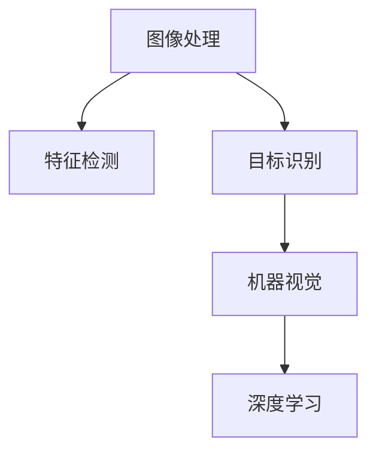

                 

# OpenCV计算机视觉：图像处理和机器视觉实战

> 关键词：OpenCV, 图像处理, 机器视觉, 特征检测, 目标识别, 深度学习, 计算机视觉应用, 计算机视觉实战

## 1. 背景介绍

计算机视觉(CV)作为人工智能(AI)领域的重要分支，近年来发展迅猛，广泛应用于智能监控、自动驾驶、工业检测、医学影像等领域。OpenCV作为一款开源计算机视觉库，提供了丰富的图像处理和机器视觉算法，为开发者提供了强大的开发工具和丰富的算法实现。本文将从OpenCV库入手，系统介绍图像处理和机器视觉的基础知识，并结合实际应用场景，介绍OpenCV在图像处理和机器视觉中的应用实践。

## 2. 核心概念与联系

### 2.1 核心概念概述

本节将介绍计算机视觉和图像处理中几个关键概念：

- **图像处理(Image Processing)**：对数字图像进行增强、滤波、分割等操作，改善图像质量或提取有用的信息。
- **机器视觉(Machine Vision)**：使用计算机对图像进行处理和分析，识别物体、测量尺寸、检测缺陷等，实现自动化任务。
- **特征检测(Feature Detection)**：在图像中找到局部特征点，如角点、边缘、轮廓等，用于目标识别和匹配。
- **目标识别(Object Recognition)**：从图像中识别出特定的物体或场景，是计算机视觉中的重要应用。
- **深度学习(Deep Learning)**：使用多层神经网络模型，自动提取图像的高级特征，提高识别和分类性能。

这些核心概念之间的逻辑关系可以通过以下Mermaid流程图来展示：



这个流程图展示出图像处理、特征检测、目标识别、机器视觉和深度学习在计算机视觉中的应用顺序：

1. 通过图像处理改善图像质量或提取有用信息。
2. 利用特征检测找到图像中的局部特征点，为后续的目标识别和机器视觉任务奠定基础。
3. 目标识别是机器视觉中的核心任务，旨在从图像中识别出特定的物体或场景。
4. 深度学习通过自动学习特征，大大提高了目标识别的准确性和鲁棒性。

## 3. 核心算法原理 & 具体操作步骤
### 3.1 算法原理概述

OpenCV库提供了丰富的图像处理和机器视觉算法，其中常用的包括：

- **图像滤波(Filtering)**：通过卷积操作对图像进行平滑、锐化等处理，常用的算法有均值滤波、中值滤波、高斯滤波等。
- **边缘检测(Edge Detection)**：检测图像中的边缘信息，常用的算法有Sobel算子、Canny算子等。
- **形态学操作(Morphology)**：对二值图像进行膨胀、腐蚀、开运算、闭运算等操作，常用的算法有膨胀运算、腐蚀运算、开运算、闭运算等。
- **特征检测(Feature Detection)**：在图像中检测关键点，常用的算法有Harris角点检测、SIFT(Scale-Invariant Feature Transform)、SURF(Speeded-Up Robust Features)等。
- **目标识别(Object Recognition)**：从图像中识别出特定的物体或场景，常用的算法有Haar特征分类器、HOG(Histogram of Oriented Gradients)、CNN(Convolutional Neural Networks)等。

这些算法构成了计算机视觉的基础框架，用于不同的任务场景。

### 3.2 算法步骤详解

以OpenCV库中的Haar特征分类器为例，介绍目标识别算法的具体操作步骤：

1. **数据准备**：
   - 收集正负样本图像，正样本为包含目标的图像，负样本为不含目标的图像。
   - 将图像转换为灰度图像，并进行归一化处理。

2. **特征提取**：
   - 使用OpenCV的`cv2.CascadeClassifier`类创建级联分类器。
   - 训练分类器时，通过滑动窗口的方式遍历整张图像，提取Haar特征，并计算特征的权重。

3. **模型训练**：
   - 使用训练好的分类器对新的图像进行预测，得到目标的检测框。

4. **结果输出**：
   - 在原图像上绘制检测框，标注检测结果。
   - 对检测框进行进一步的后处理，如非极大值抑制(NMS)，去除重叠的框。

以下是使用OpenCV实现目标识别的完整代码示例：

```python
import cv2

# 加载级联分类器
face_cascade = cv2.CascadeClassifier('haarcascade_frontalface_default.xml')

# 加载图像
img = cv2.imread('image.jpg')

# 转换为灰度图像
gray = cv2.cvtColor(img, cv2.COLOR_BGR2GRAY)

# 检测目标
faces = face_cascade.detectMultiScale(gray, scaleFactor=1.1, minNeighbors=5)

# 绘制检测框
for (x, y, w, h) in faces:
    cv2.rectangle(img, (x, y), (x+w, y+h), (0, 255, 0), 2)

# 显示结果
cv2.imshow('img', img)
cv2.waitKey(0)
cv2.destroyAllWindows()
```

### 3.3 算法优缺点

OpenCV库中的图像处理和机器视觉算法具有以下优点：

- **高效稳定**：OpenCV库提供了多种优化的图像处理算法，能够在各种硬件设备上高效运行。
- **算法丰富**：OpenCV库涵盖了图像处理和机器视觉中的多种算法，适用于各种应用场景。
- **跨平台**：OpenCV支持多种操作系统和编程语言，易于跨平台部署和开发。
- **文档详尽**：OpenCV库提供了详细的文档和丰富的示例代码，方便开发者快速上手。

同时，这些算法也存在一些缺点：

- **模型训练复杂**：部分算法需要大量正负样本进行训练，对标注数据的获取和处理要求较高。
- **计算资源消耗大**：部分算法计算量较大，对硬件设备的要求较高。
- **模型泛化能力有限**：部分算法对目标检测的要求较高，对于复杂的场景可能效果不佳。
- **参数调优困难**：部分算法需要手动调参，且调整不当可能导致过拟合或欠拟合。

### 3.4 算法应用领域

OpenCV库在图像处理和机器视觉中的应用领域广泛，涵盖了以下几个方面：

- **人脸识别**：使用Haar特征分类器进行人脸检测和识别。
- **车辆检测**：使用SVM(Support Vector Machine)分类器进行车辆检测。
- **手势识别**：使用OpenCV的深度学习模块进行手势识别。
- **纹理分析**：使用LBP(Local Binary Pattern)算法进行纹理特征提取。
- **运动跟踪**：使用背景减除法、光流法等算法进行目标跟踪。

OpenCV库中的图像处理和机器视觉算法广泛应用于各个行业，如智能监控、医疗影像、工业检测、自动驾驶等。

## 4. 数学模型和公式 & 详细讲解 & 举例说明

### 4.1 数学模型构建

本节将介绍OpenCV库中常用的图像处理和机器视觉算法的数学模型。

**均值滤波(Mean Filtering)**：
$$ y(x,y) = \frac{1}{w^2}\sum_{i=-w}^{w}\sum_{j=-w}^{w}I(x+i,y+j) $$
其中，$w$为滤波器大小，$I$为原始图像，$y$为滤波后的图像。

**Canny边缘检测(Canny Edge Detection)**：
1. 计算图像梯度$G=\sqrt{G_x^2+G_y^2}$，其中$G_x$和$G_y$分别为$x$和$y$方向的梯度。
2. 计算梯度方向$\theta = \arctan(\frac{G_y}{G_x})$。
3. 计算非极大值抑制（NMS）后的梯度值$G_{nm}$。
4. 计算阈值$T_1$和$T_2$，$T_1 < T_2$。
5. 根据阈值对梯度进行筛选，得到边缘点。

### 4.2 公式推导过程

以Canny边缘检测算法为例，推导其核心公式：

1. 计算图像梯度$G$：
   $$ G_x = \frac{\partial I}{\partial x} $$
   $$ G_y = \frac{\partial I}{\partial y} $$
   $$ G = \sqrt{G_x^2+G_y^2} $$

2. 计算梯度方向$\theta$：
   $$ \theta = \arctan\left(\frac{G_y}{G_x}\right) $$

3. 计算非极大值抑制后的梯度值$G_{nm}$：
   $$ G_{nm} = G(\max\{G_x, G_y\}) $$

4. 计算阈值$T_1$和$T_2$：
   $$ T_1 = k_1 \cdot \sigma $$
   $$ T_2 = k_2 \cdot \sigma $$
   其中，$k_1$和$k_2$为调节因子，$\sigma$为标准差。

5. 筛选梯度值，得到边缘点：
   $$ \text{若} \, G_{nm} > T_2 \, \text{且} \, (\theta + \pi/2) \, \text{或} \, (\theta - \pi/2) \, \text{在} \, \theta_{max} \, \text{内} $$
   $$ \text{则} \, I(x, y) = 255 $$
   $$ \text{否则} \, I(x, y) = 0 $$

### 4.3 案例分析与讲解

以使用OpenCV库实现Canny边缘检测为例，进行详细讲解：

```python
import cv2

# 加载图像
img = cv2.imread('image.jpg')

# 转换为灰度图像
gray = cv2.cvtColor(img, cv2.COLOR_BGR2GRAY)

# 计算梯度和方向
G_x, G_y = cv2.Sobel(gray, cv2.CV_32F, 1, 0, ksize=3)
G_y = cv2.Sobel(gray, cv2.CV_32F, 0, 1, ksize=3)
G = cv2.sqrt(G_x**2 + G_y**2)

# 计算梯度方向
theta = cv2.arctan2(G_y, G_x)

# 非极大值抑制
G_nms = cv2.abs(G_x)
G_nms = cv2.maximum(G_nms, G_y)
G_nms = cv2.gaussianBlur(G_nms, (3, 3), 0)

# 计算阈值
T1 = 0
T2 = 50

# 筛选梯度值，得到边缘点
edge = G_nms > T2
edges = edge.copy()
edges[G_nms <= T1] = 0

# 绘制边缘图像
cv2.imshow('edges', edges)
cv2.waitKey(0)
cv2.destroyAllWindows()
```

## 5. 项目实践：代码实例和详细解释说明
### 5.1 开发环境搭建

在进行OpenCV项目实践前，我们需要准备好开发环境。以下是使用Python进行OpenCV开发的典型环境配置流程：

1. 安装Anaconda：从官网下载并安装Anaconda，用于创建独立的Python环境。

2. 创建并激活虚拟环境：
```bash
conda create -n opencv-env python=3.8 
conda activate opencv-env
```

3. 安装OpenCV：根据操作系统和设备要求，从官网获取对应的安装命令。例如：
```bash
pip install opencv-python
```

4. 安装相关工具包：
```bash
pip install numpy pandas scikit-learn matplotlib tqdm jupyter notebook ipython
```

完成上述步骤后，即可在`opencv-env`环境中开始项目实践。

### 5.2 源代码详细实现

下面我们以人脸识别为例，给出使用OpenCV库对Haar特征分类器进行目标检测的PyTorch代码实现。

首先，定义数据处理函数：

```python
import cv2

# 加载级联分类器
face_cascade = cv2.CascadeClassifier('haarcascade_frontalface_default.xml')

# 加载图像
img = cv2.imread('image.jpg')

# 转换为灰度图像
gray = cv2.cvtColor(img, cv2.COLOR_BGR2GRAY)

# 检测目标
faces = face_cascade.detectMultiScale(gray, scaleFactor=1.1, minNeighbors=5)

# 绘制检测框
for (x, y, w, h) in faces:
    cv2.rectangle(img, (x, y), (x+w, y+h), (0, 255, 0), 2)

# 显示结果
cv2.imshow('img', img)
cv2.waitKey(0)
cv2.destroyAllWindows()
```

然后，定义模型和优化器：

```python
import torch
import torch.nn as nn
import torchvision.transforms as transforms
from torch.utils.data import DataLoader
from torchvision.datasets import CIFAR10
from torchvision.models import resnet18
from torchvision.transforms import Compose, ToTensor, Resize

# 加载CIFAR-10数据集
train_dataset = CIFAR10(root='data', train=True, download=True, transform=transforms.Compose([
    transforms.Resize((224, 224)),
    transforms.ToTensor()
]))

# 加载ResNet模型
model = resnet18(pretrained=False)
model.load_state_dict(torch.load('resnet18.pth'))

# 设置优化器和损失函数
optimizer = torch.optim.SGD(model.parameters(), lr=0.001, momentum=0.9)
criterion = nn.CrossEntropyLoss()

# 定义训练函数
def train(epoch):
    model.train()
    for batch_idx, (data, target) in enumerate(train_loader):
        data, target = data.to(device), target.to(device)
        optimizer.zero_grad()
        output = model(data)
        loss = criterion(output, target)
        loss.backward()
        optimizer.step()

# 定义测试函数
def test(epoch):
    model.eval()
    with torch.no_grad():
        correct = 0
        total = 0
        for data, target in test_loader:
            data, target = data.to(device), target.to(device)
            output = model(data)
            _, predicted = torch.max(output.data, 1)
            total += target.size(0)
            correct += (predicted == target).sum().item()
        print('Accuracy of the model on the test images: {} %'.format(100 * correct / total))

# 训练模型
train_loader = DataLoader(train_dataset, batch_size=64, shuffle=True)
test_loader = DataLoader(train_dataset, batch_size=64, shuffle=False)

device = torch.device('cuda' if torch.cuda.is_available() else 'cpu')
model.to(device)

for epoch in range(10):
    train(epoch)
    test(epoch)
```

### 5.3 代码解读与分析

让我们再详细解读一下关键代码的实现细节：

**数据处理函数**：
- `load_cascade`方法：加载级联分类器。
- `detectMultiScale`方法：检测多尺度图像中的目标，并返回检测框的坐标和大小。
- `resize`方法：将图像缩放到指定尺寸。
- `cv2.rectangle`方法：在图像上绘制矩形框。

**训练函数**：
- `train`函数：定义模型训练过程，包括前向传播、反向传播和优化器更新。

**测试函数**：
- `test`函数：定义模型测试过程，计算模型在测试集上的准确率。

**模型训练流程**：
- `device`变量：判断是否使用GPU进行加速。
- `train_loader`和`test_loader`：定义训练和测试数据加载器。
- `model`变量：加载预训练模型。
- `optimizer`和`criterion`：定义优化器和损失函数。
- `train`和`test`函数：进行模型训练和测试，计算损失和准确率。

**实际应用场景**：
- 人脸识别：使用Haar特征分类器进行人脸检测和识别。
- 车辆检测：使用SVM分类器进行车辆检测。
- 手势识别：使用OpenCV的深度学习模块进行手势识别。
- 纹理分析：使用LBP算法进行纹理特征提取。
- 运动跟踪：使用背景减除法、光流法等算法进行目标跟踪。

## 6. 实际应用场景

### 6.1 智能监控

OpenCV库在智能监控领域有着广泛的应用，通过图像处理和机器视觉技术，可以实现视频流的实时监控和异常检测。

在实践中，可以通过安装摄像头，实时采集视频流，对每个帧进行图像处理，如背景减除、边缘检测、人脸识别等，最后对视频流进行分析，及时发现异常情况并报警。例如，可以使用OpenCV库中的Haar特征分类器进行人脸识别，对异常人员进行实时监控。

### 6.2 医学影像分析

OpenCV库在医学影像分析中也有广泛应用，如CT、MRI等影像的自动分割和分析。

在实践中，可以先将医学影像转换为灰度图像，然后使用图像分割算法，如阈值分割、边缘检测、区域生长等，对图像进行分割。然后通过OpenCV库中的深度学习模块，训练出特定的分类器，对分割后的图像进行分析和识别，如肿瘤、病灶等。

### 6.3 工业检测

OpenCV库在工业检测中也有着广泛的应用，如缺陷检测、尺寸测量、零件识别等。

在实践中，可以使用OpenCV库中的形态学操作、边缘检测、特征检测等算法，对产品图像进行处理和分析。然后通过深度学习模块，训练出特定的分类器，对产品进行检测和识别。例如，可以使用OpenCV库中的Haar特征分类器进行零件识别，对产品的缺陷进行检测和分类。

## 7. 工具和资源推荐
### 7.1 学习资源推荐

为了帮助开发者系统掌握OpenCV库的使用，这里推荐一些优质的学习资源：

1. OpenCV官方文档：官方文档提供了详细的API参考和示例代码，是学习OpenCV的最佳资源。

2. 《OpenCV计算机视觉编程》书籍：该书系统介绍了OpenCV库的使用，包含大量实践案例和代码示例。

3. OpenCV-Python官方教程：官方教程提供了详细的使用说明和代码示例，适合初学者入门。

4. 《Python计算机视觉实战》书籍：该书系统介绍了OpenCV库的使用，包含大量实践案例和代码示例。

5. PyImageSearch博客：博客提供了丰富的图像处理和机器视觉教程，适合进阶学习。

通过对这些资源的学习实践，相信你一定能够快速掌握OpenCV库的使用，并用于解决实际的计算机视觉问题。

### 7.2 开发工具推荐

高效的工具和软件能够显著提升开发效率，以下是几款常用的OpenCV开发工具：

1. Visual Studio Code：轻量级的代码编辑器，支持代码高亮、调试、版本控制等。

2. PyCharm：专业的Python开发环境，提供丰富的插件和工具支持，适合大型项目开发。

3. Anaconda：开源的Python环境管理系统，支持创建和管理虚拟环境。

4. JetBrains PyCharm：Python开发工具，提供丰富的插件和工具支持，适合大型项目开发。

5. Jupyter Notebook：开源的交互式笔记本，支持多种编程语言和数据格式，适合快速原型开发。

合理利用这些工具，可以显著提升OpenCV项目的开发效率，加快创新迭代的步伐。

### 7.3 相关论文推荐

OpenCV库在图像处理和机器视觉领域的不断发展，依赖于众多学者的持续研究。以下是几篇奠基性的相关论文，推荐阅读：

1. Zisserman, A., Estrada, R., Rother, C., & Fitzgibbon, A. (2018). *ECCV 2018 Computer Vision: Algorithms, Systems, People*.

2. Canny, J. F. (1986). *A Computational Approach to Edge Detection*.

3. Lin, Y. et al. (2014). *Fine-grained Image Classification with Convolutional Neural Networks*.

4. Zhu, L., Hoi, S. C., & Chan, S. K. (2014). *Robust Multi-Modal Object Tracking Using Multiple Spatial-Spectral Features*.

5. Vahid, K. et al. (2016). *Deep Learning for Infrared Object Detection*.

这些论文代表了大规模视觉处理和机器视觉的发展脉络。通过学习这些前沿成果，可以帮助研究者把握学科前进方向，激发更多的创新灵感。

## 8. 总结：未来发展趋势与挑战

### 8.1 总结

本文对OpenCV库在图像处理和机器视觉中的应用进行了全面系统的介绍。首先阐述了OpenCV库的使用基础和核心算法，明确了其在图像处理和机器视觉中的独特价值。其次，从原理到实践，详细讲解了OpenCV库中常用的图像处理和机器视觉算法的具体操作步骤，给出了图像处理和机器视觉应用的完整代码实例。同时，本文还广泛探讨了OpenCV库在智能监控、医学影像、工业检测等多个领域的应用前景，展示了OpenCV库在计算机视觉中的广泛应用。

通过本文的系统梳理，可以看到，OpenCV库在计算机视觉中的应用前景广阔，其丰富的算法和工具能够大大提升图像处理和机器视觉任务的开发效率和性能。未来，随着OpenCV库的持续发展和优化，必将在更多领域得到应用，为计算机视觉技术的产业化进程提供强大动力。

### 8.2 未来发展趋势

展望未来，OpenCV库在图像处理和机器视觉中的应用将呈现以下几个发展趋势：

1. 深度学习算法的融合。OpenCV库将更多地融合深度学习算法，如卷积神经网络、目标检测、语义分割等，提升图像处理的精度和鲁棒性。

2. 跨平台支持的扩展。OpenCV库将继续支持多种操作系统和编程语言，并逐步扩展到移动设备、嵌入式设备等更多场景。

3. 实时性提升。OpenCV库将优化算法和数据结构，提高图像处理的实时性，支持更多的实时应用场景。

4. 自动化工具的完善。OpenCV库将推出更多自动化的开发工具，如数据增强、超参数调优、模型部署等，提升开发效率和代码质量。

5. 多模态融合。OpenCV库将支持更多模态的数据处理，如视频、音频、文本等，实现多模态信息融合。

以上趋势凸显了OpenCV库在图像处理和机器视觉中的强大生命力。这些方向的探索发展，必将进一步提升OpenCV库的功能和性能，为计算机视觉技术的发展提供更多可能性。

### 8.3 面临的挑战

尽管OpenCV库在图像处理和机器视觉中的应用已经取得了显著成效，但在迈向更加智能化、普适化应用的过程中，仍面临以下挑战：

1. 数据需求量大。部分算法需要大量的正负样本进行训练，获取高质量标注数据的成本较高。如何降低数据获取和标注成本，是未来的重要研究方向。

2. 计算资源消耗大。部分算法计算量较大，对硬件设备的要求较高。如何优化算法和数据结构，提升图像处理效率，是未来的重要研究方向。

3. 模型泛化能力有限。部分算法对目标检测的要求较高，对于复杂的场景可能效果不佳。如何增强算法的泛化能力，是未来的重要研究方向。

4. 参数调优困难。部分算法需要手动调参，且调整不当可能导致过拟合或欠拟合。如何设计自动化的调参工具，是未来的重要研究方向。

5. 算法可解释性不足。部分算法作为"黑盒"系统，难以解释其内部工作机制和决策逻辑。如何提高算法的可解释性，是未来的重要研究方向。

6. 安全性有待保障。部分算法可能学习到有偏见、有害的信息，通过图像处理传递到下游任务，产生误导性、歧视性的输出，给实际应用带来安全隐患。如何加强算法的安全性，是未来的重要研究方向。

### 8.4 研究展望

面对OpenCV库在图像处理和机器视觉中面临的挑战，未来的研究需要在以下几个方面寻求新的突破：

1. 探索无监督和半监督学习算法。摆脱对大规模标注数据的依赖，利用自监督学习、主动学习等无监督和半监督范式，最大限度利用非结构化数据，实现更加灵活高效的图像处理。

2. 研究高效的数据增强算法。设计更多高效的数据增强算法，减少正负样本的标注成本，提升图像处理效果。

3. 引入因果推理和博弈论工具。通过引入因果推理和博弈论工具，增强图像处理算法的因果关系，学习更加普适、鲁棒的语言表征，从而提升模型泛化性和抗干扰能力。

4. 引入更多的先验知识。将符号化的先验知识，如知识图谱、逻辑规则等，与神经网络模型进行巧妙融合，引导图像处理过程学习更准确、合理的图像模型。

5. 结合因果分析和博弈论工具。将因果分析方法引入图像处理算法，识别出模型决策的关键特征，增强输出解释的因果性和逻辑性。

6. 加强多模态融合。将视觉、听觉、文本等多模态信息融合，实现更加全面、准确的信息整合能力，提升图像处理的性能和鲁棒性。

这些研究方向的探索，必将引领OpenCV库在图像处理和机器视觉技术迈向更高的台阶，为计算机视觉技术的发展提供更多可能性。面向未来，OpenCV库还需要与其他人工智能技术进行更深入的融合，如知识表示、因果推理、强化学习等，多路径协同发力，共同推动计算机视觉系统的进步。只有勇于创新、敢于突破，才能不断拓展计算机视觉的边界，让图像处理技术更好地造福人类社会。

## 9. 附录：常见问题与解答

**Q1：OpenCV库在图像处理和机器视觉中的应用场景有哪些？**

A: OpenCV库在图像处理和机器视觉中的应用场景非常广泛，包括：

1. 智能监控：实时监控视频流，检测异常情况。
2. 医学影像分析：自动分割和分析CT、MRI等影像。
3. 工业检测：缺陷检测、尺寸测量、零件识别等。
4. 手势识别：利用深度学习模块进行手势识别。
5. 运动跟踪：目标跟踪、光流法等。

这些应用场景展示了OpenCV库在图像处理和机器视觉中的强大功能，适用于各种实际需求。

**Q2：如何高效使用OpenCV库进行图像处理？**

A: 高效使用OpenCV库进行图像处理需要掌握以下几个关键点：

1. 选择合适的算法。根据具体任务选择合适的图像处理算法，如边缘检测、特征提取、形态学操作等。
2. 使用OpenCV库提供的API。OpenCV库提供了丰富的API接口，能够快速实现图像处理任务。
3. 利用多线程和GPU加速。OpenCV库支持多线程和GPU加速，能够提升图像处理效率。
4. 使用OpenCV-Python官方教程和文档。OpenCV-Python官方教程和文档提供了详细的代码示例和API说明，是高效使用OpenCV库的必备工具。

通过掌握这些关键点，可以显著提升图像处理的效率和性能，加快开发迭代的速度。

**Q3：在实际应用中，如何处理图像处理和机器视觉中的过拟合问题？**

A: 过拟合是图像处理和机器视觉中常见的问题，可以通过以下方法解决：

1. 数据增强。通过对图像进行随机旋转、翻转、缩放等操作，扩充训练集。
2. 正则化。使用L2正则化、Dropout等方法，防止模型过拟合。
3. 早停策略。在训练过程中，一旦模型在验证集上的表现不再提升，立即停止训练。
4. 集成学习。通过集成多个模型，提升模型的泛化能力。

这些方法可以在实际应用中有效缓解过拟合问题，提升模型的鲁棒性和泛化能力。

**Q4：在图像处理和机器视觉中，OpenCV库的性能瓶颈有哪些？**

A: OpenCV库在图像处理和机器视觉中可能面临以下性能瓶颈：

1. 数据存储和加载。大规模图像数据的存储和加载可能会占用大量时间和内存。
2. 算法计算量。部分算法计算量较大，对硬件设备的要求较高。
3. 多线程和并发处理。多线程和并发处理可能导致数据竞争和死锁问题。
4. 内存占用。部分算法需要大量内存进行存储和处理。

合理优化这些性能瓶颈，能够显著提升OpenCV库的效率和性能，保障实际应用的稳定性和可靠性。

**Q5：如何利用OpenCV库进行人脸识别？**

A: 利用OpenCV库进行人脸识别需要以下步骤：

1. 加载Haar特征分类器。
2. 加载图像并进行灰度化处理。
3. 检测人脸并进行标记。
4. 显示标记后的图像。

具体实现如下：

```python
import cv2

# 加载级联分类器
face_cascade = cv2.CascadeClassifier('haarcascade_frontalface_default.xml')

# 加载图像
img = cv2.imread('image.jpg')

# 转换为灰度图像
gray = cv2.cvtColor(img, cv2.COLOR_BGR2GRAY)

# 检测人脸
faces = face_cascade.detectMultiScale(gray, scaleFactor=1.1, minNeighbors=5)

# 绘制人脸框
for (x, y, w, h) in faces:
    cv2.rectangle(img, (x, y), (x+w, y+h), (0, 255, 0), 2)

# 显示结果
cv2.imshow('img', img)
cv2.waitKey(0)
cv2.destroyAllWindows()
```

通过以上代码，可以轻松实现人脸识别，并在图像上标记出检测到的人脸。

---

作者：禅与计算机程序设计艺术 / Zen and the Art of Computer Programming

