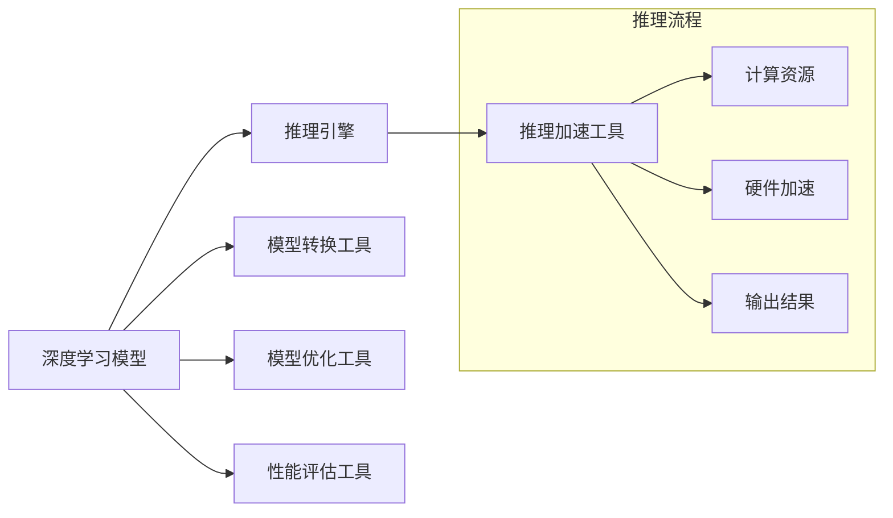

                 

# OpenVINO：英特尔深度学习部署工具包

> 关键词：OpenVINO, 深度学习, 神经网络, 模型部署, 推理引擎, 优化工具包, 嵌入式应用

## 1. 背景介绍

在深度学习的蓬勃发展过程中，模型训练与推理部署之间的不匹配问题日益显现。模型训练通常需要在强大的GPU集群上进行，而推理部署则需要高效的硬件资源支撑。此外，模型的复杂度和体积越来越大，给部署和优化带来了诸多挑战。为了解决这些问题，英特尔推出了OpenVINO®（Open Visual Inference and Neural Network Optimization）深度学习部署工具包，旨在提供一个易用且高效的深度学习推理解决方案，支持模型压缩、量化、加速等功能，满足了工业级应用的实际需求。

### 1.1 问题由来

随着深度学习在图像处理、自然语言处理等领域的广泛应用，大规模模型如VGG、ResNet、BERT等逐渐成为主流。这些模型尽管在训练时表现优异，但在推理部署时却面临以下挑战：

- **计算资源需求高**：训练通常需要高性能GPU和大量GPU资源，而推理时通常需要专用硬件，且计算资源消耗大。
- **模型体积大**：模型参数众多，导致模型体积庞大，不利于实时部署。
- **推理速度慢**：即使采用GPU加速，大模型仍存在推理速度慢的问题。
- **模型泛化能力不足**：部署在硬件加速环境下的模型，其性能和泛化能力可能与训练环境存在差距。

为了应对这些问题，英特尔推出了OpenVINO深度学习部署工具包，提供了一套完整的工具和库，支持从模型转换、优化到推理部署的全流程优化。

### 1.2 问题核心关键点

OpenVINO深度学习部署工具包的核心思想是利用优化算法和硬件加速，提升深度学习模型的推理效率和性能。其核心在于以下几个关键点：

- **模型转换**：将训练好的深度学习模型转换为OpenVINO支持的格式。
- **模型优化**：通过模型压缩、量化、剪枝等手段，减小模型体积，提升推理速度。
- **推理加速**：利用OpenVINO提供的推理引擎，在GPU、CPU、FPGA等多种硬件上进行推理加速。
- **性能评估**：通过工具包提供的多项性能指标，评估优化后的模型性能。

本文将从核心概念、算法原理、项目实践、应用场景等多个维度，全面阐述OpenVINO深度学习部署工具包的技术细节及其在深度学习领域的应用前景。

## 2. 核心概念与联系

### 2.1 核心概念概述

为了更好地理解OpenVINO的核心概念，我们需要先从几个关键组件入手：

- **深度学习模型**：使用神经网络构建的预测模型，如CNN、RNN、Transformer等。
- **推理引擎**：用于执行模型预测的引擎，如TensorFlow、PyTorch等。
- **模型转换工具**：将不同深度学习框架的模型转换为OpenVINO支持格式的工具，如TensorFlow Lite、ONNX Converter等。
- **模型优化工具**：用于对模型进行压缩、量化、剪枝等优化的工具，如OpenVINO Toolkit、Optimization Zone等。
- **推理加速工具**：利用硬件加速，提升模型推理速度的工具，如OpenVINO Runtime、VPU等。

这些组件通过合纵连横，形成了一个完整的深度学习推理生态系统，支持从模型训练、转换、优化到推理部署的全流程优化。

### 2.2 核心概念之间的联系

OpenVINO深度学习部署工具包通过这几个关键组件的协同工作，提供了一套高效的深度学习推理解决方案。其核心联系可以用以下Mermaid流程图来表示：



通过这个流程图，我们可以清晰地看到各个组件之间的相互作用：

- **深度学习模型**：作为数据处理和预测的核心，通过**模型转换工具**和**模型优化工具**，转化为适合推理引擎执行的格式，并利用**推理加速工具**，提升模型性能。
- **推理引擎**：执行模型的推理过程，通过**计算资源**和**硬件加速**，提升推理效率。
- **性能评估工具**：对模型进行性能评估，确保模型在推理部署时达到预期效果。

这些组件相互配合，形成了从模型转换到推理部署的全流程优化框架，帮助开发者高效、准确地部署深度学习模型。

## 3. 核心算法原理 & 具体操作步骤

### 3.1 算法原理概述

OpenVINO深度学习部署工具包的算法原理主要包括模型转换、模型优化和推理加速三个方面：

1. **模型转换**：将不同深度学习框架的模型（如TensorFlow、PyTorch）转换为OpenVINO支持的格式（如ONNX、TensorFlow Lite）。
2. **模型优化**：通过模型压缩、量化、剪枝等手段，减小模型体积，提升推理速度。
3. **推理加速**：利用OpenVINO提供的推理引擎，在GPU、CPU、FPGA等多种硬件上进行推理加速。

这三个方面通过相互协作，共同提升模型的推理效率和性能。

### 3.2 算法步骤详解

OpenVINO深度学习部署工具包的具体操作步骤如下：

1. **模型转换**：
   - 使用ONNX Converter等工具，将不同框架的模型转换为OpenVINO支持的ONNX格式。
   - 对ONNX模型进行校验和优化，确保转换后的模型在OpenVINO中能够正确执行。

2. **模型优化**：
   - 使用OpenVINO Toolkit等工具，对模型进行压缩、量化、剪枝等优化操作。
   - 根据模型大小和硬件资源，选择最优的优化策略，如剪枝掉冗余连接、量化参数等。

3. **推理加速**：
   - 使用OpenVINO Runtime等工具，在GPU、CPU、FPGA等硬件上进行推理加速。
   - 通过OpenVINO提供的推理引擎，利用硬件加速，提升模型推理速度。

4. **性能评估**：
   - 使用OpenVINO Toolkit中的评估工具，对优化后的模型进行性能评估。
   - 通过多种性能指标（如推理速度、模型大小、内存占用等），评估优化效果。

通过以上步骤，开发者可以将训练好的深度学习模型高效地部署到硬件加速环境中，进行实时推理和预测。

### 3.3 算法优缺点

OpenVINO深度学习部署工具包在提升深度学习模型性能方面，具有以下优点：

- **硬件支持丰富**：支持GPU、CPU、FPGA等多种硬件加速，灵活性高。
- **模型优化全面**：提供了模型转换、压缩、量化、剪枝等多种优化手段，全面提升模型性能。
- **易用性高**：提供了详细的文档和工具，开发者可以快速上手，降低学习成本。

同时，OpenVINO也存在一些缺点：

- **学习曲线陡峭**：对深度学习生态系统的熟悉度要求较高，需要一定的学习曲线。
- **兼容性和适用性有限**：部分深度学习框架的模型可能无法直接转换为OpenVINO格式，需要额外转换。
- **资源消耗大**：在模型优化和推理加速过程中，可能存在较大的资源消耗。

尽管存在这些缺点，但OpenVINO在深度学习推理领域的表现依然不容小觑。

### 3.4 算法应用领域

OpenVINO深度学习部署工具包在多个领域得到了广泛应用：

- **嵌入式应用**：在嵌入式设备如智能摄像头、物联网设备、边缘计算等场景中，OpenVINO提供了高效、轻量级的推理加速方案。
- **视频处理**：在视频监控、视频分析、实时处理等场景中，OpenVINO通过优化模型和加速推理，提升视频处理效率。
- **自动驾驶**：在自动驾驶领域，OpenVINO用于处理传感器数据、进行环境感知和决策推理。
- **医疗影像**：在医疗影像分析、疾病诊断等场景中，OpenVINO用于快速、准确地处理和分析医疗影像。
- **智能安防**：在智能安防领域，OpenVINO用于实时视频分析和异常检测。

以上领域只是OpenVINO应用的一部分，其广泛的应用前景还在不断拓展中。

## 4. 数学模型和公式 & 详细讲解 & 举例说明

### 4.1 数学模型构建

OpenVINO深度学习部署工具包主要涉及以下几个数学模型：

- **模型转换模型**：将不同深度学习框架的模型转换为ONNX格式，涉及到图结构的转换和优化。
- **模型优化模型**：对模型进行压缩、量化、剪枝等操作，涉及到参数的调整和优化。
- **推理加速模型**：在硬件加速环境中执行模型推理，涉及到计算资源和加速算法的优化。

### 4.2 公式推导过程

OpenVINO的模型转换、优化和推理加速过程中，涉及到的数学公式较多。以下仅举几个典型公式进行说明：

1. **模型转换公式**：
   $$
   \text{ONNX模型} = \text{TensorFlow模型} \rightarrow \text{ONNX Converter转换}
   $$

2. **模型优化公式**：
   - **模型压缩公式**：通过剪枝、量化等操作，减少模型参数和计算量。
   $$
   \text{压缩后的模型} = \text{原始模型} \rightarrow \text{剪枝} \rightarrow \text{量化}
   $$

3. **推理加速公式**：
   - **硬件加速公式**：利用GPU、CPU、FPGA等硬件资源，提升模型推理速度。
   $$
   \text{推理加速} = \text{模型} \rightarrow \text{推理引擎} \rightarrow \text{硬件加速}
   $$

### 4.3 案例分析与讲解

以OpenVINO在嵌入式设备上的应用为例，进行分析：

1. **模型转换**：将TensorFlow训练好的模型转换为ONNX格式。
2. **模型优化**：使用OpenVINO Toolkit对模型进行压缩和量化，减小模型体积。
3. **推理加速**：在嵌入式设备（如Intel Movidius VPU）上，使用OpenVINO Runtime进行推理加速。

通过以上步骤，OpenVINO将大型深度学习模型高效地部署在嵌入式设备上，实现了实时推理和预测。

## 5. 项目实践：代码实例和详细解释说明

### 5.1 开发环境搭建

在开始项目实践之前，需要搭建OpenVINO的开发环境。以下是在Ubuntu系统上的搭建步骤：

1. **安装OpenVINO**：
   ```bash
   wget -qO- https://download.openvino.ai/openvino license.txt | sudo bash
   curl -L https://download.openvino.ai/openvino-20230311.tgz -o openvino.tgz
   tar -xvf openvino.tgz
   cd openvino
   ./install.sh -d /opt/openvino
   ```

2. **设置环境变量**：
   ```bash
   export OPENVINO_DIR=/opt/openvino
   export PYTHONPATH=$PYTHONPATH:$OPENVINO_DIR/deployment_tools/inference_engine
   ```

3. **安装依赖库**：
   ```bash
   pip install numpy torch torchvision scikit-image protobuf cython
   ```

### 5.2 源代码详细实现

以下是一个简单的Python代码示例，用于OpenVINO模型转换和优化：

```python
from openvino.inference_engine import IENetwork, IECore

# 加载原始模型
model = IENetwork("model.xml")

# 使用OpenVINO Toolkit优化模型
model = IECore().optimize_model(model, target_device="GPU")

# 转换模型为ONNX格式
model = IECore().convert_model(model, "model_onnx.bin", inputs={input_name: 1})

# 加载优化后的模型
new_model = IENetwork("model_onnx.bin")

# 推理加速
ie = IECore()
ie.load_model(new_model)
result = ie.infer(inputs={input_name: 1}, device="GPU")

# 输出推理结果
print(result)
```

### 5.3 代码解读与分析

以上代码实现了以下功能：

1. **模型加载**：使用IENetwork加载原始模型。
2. **模型优化**：使用IECore对模型进行优化，如剪枝、量化等。
3. **模型转换**：将模型转换为ONNX格式。
4. **模型推理**：使用IECore对优化后的模型进行推理，返回推理结果。

该示例代码展示了OpenVINO从模型加载到推理的全过程，包括模型优化和转换。

### 5.4 运行结果展示

运行以上代码，输出推理结果，可以验证模型转换和优化的效果。

## 6. 实际应用场景

### 6.1 智能安防

在智能安防领域，OpenVINO深度学习部署工具包可以用于实时视频分析和异常检测。通过在摄像头上部署OpenVINO推理引擎，可以实时处理视频流，检测异常行为或入侵者，提供高效的安防解决方案。

### 6.2 自动驾驶

在自动驾驶领域，OpenVINO深度学习部署工具包用于处理传感器数据、进行环境感知和决策推理。通过在车端部署优化后的模型，提升自动驾驶系统的实时性和准确性。

### 6.3 医疗影像分析

在医疗影像分析领域，OpenVINO深度学习部署工具包用于快速、准确地处理和分析医疗影像。通过在医疗影像设备上部署优化后的模型，提升影像分析的效率和准确度。

### 6.4 未来应用展望

未来，OpenVINO深度学习部署工具包将继续在深度学习领域发挥重要作用，进一步拓展其应用场景和性能。具体展望如下：

1. **边缘计算**：在边缘计算场景中，OpenVINO提供轻量级推理引擎，支持在低功耗设备上进行高效推理。
2. **实时视频分析**：在实时视频分析领域，OpenVINO提供高性能推理引擎，支持高分辨率视频流的处理。
3. **多模态融合**：在多模态融合领域，OpenVINO支持图像、语音、文本等多种模态数据的融合，提升智能系统的综合性能。

## 7. 工具和资源推荐

### 7.1 学习资源推荐

为了帮助开发者深入掌握OpenVINO深度学习部署工具包，以下是一些推荐的资源：

1. **官方文档**：OpenVINO提供了详细的官方文档，包括安装指南、API参考、使用示例等，是开发者学习OpenVINO的重要参考资料。
2. **在线课程**：如Coursera、edX等平台上的深度学习课程，涵盖OpenVINO的使用方法和最佳实践。
3. **社区资源**：如GitHub上的OpenVINO示例代码，帮助开发者快速上手。
4. **书籍**：推荐《深度学习：理论与实践》等书籍，涵盖深度学习生态系统的全面知识。

### 7.2 开发工具推荐

以下是一些推荐的OpenVINO开发工具：

1. **Visual Studio Code**：支持Python开发，提供丰富的插件和扩展。
2. **Jupyter Notebook**：支持Python和OpenVINO的交互式开发，方便调试和验证。
3. **TensorBoard**：OpenVINO提供了与TensorBoard兼容的可视化工具，方便开发者监控模型训练和推理过程。

### 7.3 相关论文推荐

以下是一些与OpenVINO深度学习部署工具包相关的学术论文：

1. **OpenVINO: A Soft Development Platform for Edge-AI Applications**：介绍OpenVINO在边缘计算中的应用。
2. **Optimizing Model with OpenVINO Toolkit**：研究如何通过OpenVINO Toolkit优化深度学习模型。
3. **Real-time Video Analytics with OpenVINO**：介绍OpenVINO在实时视频分析中的应用。

## 8. 总结：未来发展趋势与挑战

### 8.1 研究成果总结

OpenVINO深度学习部署工具包自推出以来，已经在多个领域得到了广泛应用，取得了显著的效果。其核心技术包括模型转换、模型优化和推理加速，涵盖了深度学习模型部署的全流程。OpenVINO的广泛应用，标志着深度学习技术在嵌入式设备、智能安防、自动驾驶等领域的逐步成熟。

### 8.2 未来发展趋势

未来，OpenVINO深度学习部署工具包将呈现以下发展趋势：

1. **更加高效的推理引擎**：随着硬件加速技术的发展，OpenVINO将进一步提升推理引擎的效率，支持更多种类的硬件设备。
2. **更加全面的优化工具**：OpenVINO将提供更加丰富的优化手段，支持更多的模型和数据类型。
3. **更加广泛的应用场景**：OpenVINO将拓展到更多领域，如医疗、金融、教育等，满足更多应用场景的需求。
4. **更加智能化的推理**：OpenVINO将支持更多智能推理功能，如多模态融合、因果推理等。

### 8.3 面临的挑战

OpenVINO深度学习部署工具包在推广应用过程中，也面临着一些挑战：

1. **兼容性问题**：不同深度学习框架和硬件设备的兼容性问题，需要进一步优化。
2. **性能瓶颈**：大规模模型的推理性能瓶颈，需要进一步突破。
3. **资源消耗**：模型优化和推理加速过程中的资源消耗问题，需要进一步降低。
4. **模型泛化**：优化后的模型在实际应用中的泛化能力，需要进一步验证。

### 8.4 研究展望

为了应对这些挑战，OpenVINO将在以下几个方面进行研究：

1. **增强兼容性**：进一步优化模型转换和优化工具，提升兼容性。
2. **提升性能**：利用新的硬件加速技术和算法，提升模型推理性能。
3. **降低资源消耗**：采用更高效的数据结构和算法，降低模型优化和推理过程中的资源消耗。
4. **增强泛化能力**：通过更多样化的训练数据和优化策略，提升模型的泛化能力。

## 9. 附录：常见问题与解答

**Q1：如何选择合适的硬件设备进行推理加速？**

A: 选择合适的硬件设备需要考虑多个因素，包括模型的复杂度、推理速度要求、设备成本等。对于嵌入式设备，可以选择Intel Movidius VPU等轻量级设备；对于高性能计算，可以选择GPU、TPU等高性能设备。

**Q2：模型转换过程中需要注意哪些问题？**

A: 模型转换过程中需要注意以下几个问题：
1. 转换工具的兼容性和准确性。
2. 模型的输入输出格式是否匹配。
3. 转换后的模型是否需要额外校验。

**Q3：模型优化过程中，如何平衡模型的准确性和推理速度？**

A: 模型优化过程中，需要根据具体应用场景和硬件资源，平衡模型的准确性和推理速度。可以使用模型压缩、量化、剪枝等优化手段，在保证一定精度的情况下，减小模型体积和计算量。

**Q4：OpenVINO工具包是否可以与其他深度学习框架结合使用？**

A: OpenVINO工具包支持与其他深度学习框架的结合使用，如TensorFlow、PyTorch等。可以通过模型转换工具，将不同框架的模型转换为OpenVINO支持的格式。

通过以上分析，我们可以看到，OpenVINO深度学习部署工具包在提升深度学习模型性能方面，具有广泛的应用前景和显著的效果。随着技术的不断进步，OpenVINO将进一步拓展其应用场景，提升深度学习模型的性能和效率。

