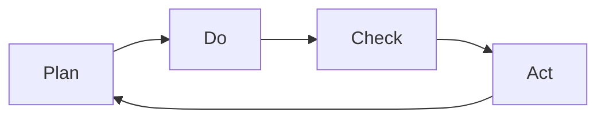

                 

# PDCA实践:持续改进的法宝

> 关键词：PDCA, 持续改进, 质量管理, 项目管理, 软件开发, 系统优化

## 1. 背景介绍

### 1.1 问题由来

在快速变化的市场环境中，企业的竞争优势很大程度上取决于其产品和服务的质量。然而，随着业务复杂度的增加，质量问题的出现几乎难以避免。为了确保质量，企业需要一种系统化的管理方法，既能提升产品质量，又能提升生产效率。正是在这样的背景下，PDCA（Plan-Do-Check-Act）方法应运而生。

PDCA是一种基于循环改进的质量管理方法，由美国统计学家W. Edwards Deming在1950年提出，用于改进产品、过程和系统的质量和效率。这种方法强调系统化地规划、执行、检查和修正工作流程，以实现持续改进和优化。PDCA的核心理念是：不断地循环执行这四个步骤，每次循环都寻求改进，最终达到质量提升的目标。

## 2. 核心概念与联系

### 2.1 核心概念概述

为更好地理解PDCA方法的精髓，本节将介绍其核心概念及其相互关系：

- **Plan（计划）**：定义目标、制定计划、确定策略，并明确具体的改进措施。

- **Do（执行）**：按照计划执行，实施改进措施，验证其有效性和可行性。

- **Check（检查）**：对执行结果进行检查和评估，确认改进措施的效果。

- **Act（修正）**：根据检查结果，制定下一个循环计划，实施修正措施，不断提升改进效果。

### 2.2 核心概念原理和架构的 Mermaid 流程图(Mermaid 流程节点中不要有括号、逗号等特殊字符)



这个流程图展示了PDCA方法的总体架构，即通过计划、执行、检查、修正四个步骤不断循环，推动质量改进。

## 3. 核心算法原理 & 具体操作步骤

### 3.1 算法原理概述

PDCA方法的核心原理在于通过系统化的循环过程，不断优化工作流程和产品质量。其核心步骤如下：

1. **Plan阶段**：明确目标，制定详细的改进计划。
2. **Do阶段**：根据计划实施改进措施，验证其效果。
3. **Check阶段**：评估执行结果，检查改进措施的效果。
4. **Act阶段**：根据检查结果，进行修正，制定新的改进计划。

PDCA方法的精髓在于其持续性和改进性。通过不断的循环，逐步提升产品和服务的质量，满足市场和客户的需求。

### 3.2 算法步骤详解

#### 3.2.1 Plan阶段

**步骤1：明确目标**
- 定义质量改进的目标，如减少缺陷率、提升客户满意度等。

**步骤2：制定计划**
- 确定实现目标的具体措施，如改进生产工艺、加强质量控制等。
- 设计评价标准，用于后续的检查和评估。

**步骤3：资源准备**
- 配置所需的人力、物力和时间资源。

**步骤4：培训和沟通**
- 对相关人员进行培训，确保其理解并掌握改进措施。
- 与相关方进行沟通，确保改进措施的可行性和支持性。

#### 3.2.2 Do阶段

**步骤1：实施改进措施**
- 按照计划执行，实施改进措施。

**步骤2：数据记录**
- 记录执行过程中的数据和信息，为后续检查和评估提供依据。

**步骤3：过程控制**
- 对执行过程进行监控，确保其按计划进行。

**步骤4：及时响应**
- 及时应对执行过程中出现的问题，进行必要的调整。

#### 3.2.3 Check阶段

**步骤1：收集数据**
- 收集执行过程中的数据和信息，如生产记录、质量报告等。

**步骤2：分析数据**
- 对收集的数据进行分析，评估改进措施的效果。

**步骤3：识别问题**
- 识别执行过程中存在的问题和不足，分析原因。

**步骤4：制定改进措施**
- 根据分析结果，制定具体的改进措施。

#### 3.2.4 Act阶段

**步骤1：修正和改进**
- 根据检查结果，进行必要的修正和改进，优化改进措施。

**步骤2：培训和沟通**
- 对相关人员进行培训，确保其理解并掌握新的改进措施。
- 与相关方进行沟通，确保改进措施的可行性和支持性。

**步骤3：制定下一轮改进计划**
- 制定下一轮PDCA循环的计划，确保持续改进。

### 3.3 算法优缺点

#### 3.3.1 优点

- **系统化管理**：PDCA方法强调系统化管理，通过四个步骤的循环执行，确保质量改进的有序性和系统性。
- **持续改进**：PDCA方法强调持续改进，通过不断的循环执行，逐步提升产品质量和效率。
- **适应性强**：PDCA方法适用于各种类型的产品和服务，可以灵活应用到不同行业和场景中。

#### 3.3.2 缺点

- **周期较长**：PDCA方法的四个步骤需要时间和资源投入，周期较长。
- **复杂性高**：PDCA方法的执行需要较高管理水平和专业知识，对执行者要求较高。
- **灵活性不足**：PDCA方法强调系统化管理，对于变化较快的市场环境，可能灵活性不足。

### 3.4 算法应用领域

PDCA方法广泛应用于多个领域，如制造业、软件开发、质量控制等。以下是几个典型的应用场景：

- **制造业**：通过PDCA方法，企业可以提升产品质量、优化生产流程，提高生产效率。
- **软件开发**：在软件项目开发中，PDCA方法可以用于需求分析、设计、编码、测试等各个环节，确保项目按时按质完成。
- **质量控制**：PDCA方法可以用于产品检测、流程控制等，确保产品质量满足标准要求。

## 4. 数学模型和公式 & 详细讲解 & 举例说明

### 4.1 数学模型构建

PDCA方法虽然没有复杂的数学模型，但其核心思想是持续改进和系统化管理。以下是PDCA方法的数学模型构建：

**目标函数**：
$$ \maximize Q $$
其中，$Q$ 表示产品质量。

**约束条件**：
$$ \text{生产成本} \leq C $$
$$ \text{改进措施} \leq M $$
$$ \text{客户满意度} \geq S $$

其中，$C$ 表示生产成本，$M$ 表示改进措施，$S$ 表示客户满意度。

### 4.2 公式推导过程

在PDCA方法的每个阶段，需要进行数据收集和分析。以下是具体推导过程：

#### 4.2.1 Plan阶段

**数据收集**：
$$ D_{Plan} = \{D_{目标}, D_{计划}, D_{资源}, D_{培训和沟通}\} $$

其中，$D_{目标}$ 表示目标数据，$D_{计划}$ 表示改进措施计划数据，$D_{资源}$ 表示资源配置数据，$D_{培训和沟通}$ 表示培训和沟通数据。

**数据分析**：
$$ A_{Plan} = \text{分析}(D_{Plan}) $$
其中，$A_{Plan}$ 表示Plan阶段的分析结果。

#### 4.2.2 Do阶段

**数据收集**：
$$ D_{Do} = \{D_{实施}, D_{数据记录}, D_{过程控制}, D_{及时响应}\} $$

其中，$D_{实施}$ 表示改进措施实施数据，$D_{数据记录}$ 表示数据记录数据，$D_{过程控制}$ 表示过程控制数据，$D_{及时响应}$ 表示及时响应数据。

**数据分析**：
$$ A_{Do} = \text{分析}(D_{Do}) $$
其中，$A_{Do}$ 表示Do阶段的分析结果。

#### 4.2.3 Check阶段

**数据收集**：
$$ D_{Check} = \{D_{收集}, D_{分析}, D_{识别}, D_{制定}\} $$

其中，$D_{收集}$ 表示数据收集数据，$D_{分析}$ 表示数据分析数据，$D_{识别}$ 表示问题识别数据，$D_{制定}$ 表示改进措施制定数据。

**数据分析**：
$$ A_{Check} = \text{分析}(D_{Check}) $$
其中，$A_{Check}$ 表示Check阶段的分析结果。

#### 4.2.4 Act阶段

**数据收集**：
$$ D_{Act} = \{D_{修正}, D_{培训和沟通}, D_{制定下一轮计划}\} $$

其中，$D_{修正}$ 表示修正数据，$D_{培训和沟通}$ 表示培训和沟通数据，$D_{制定下一轮计划}$ 表示下一轮改进计划制定数据。

**数据分析**：
$$ A_{Act} = \text{分析}(D_{Act}) $$
其中，$A_{Act}$ 表示Act阶段的分析结果。

### 4.3 案例分析与讲解

#### 案例1：制造业质量改进

某制造业企业生产的一款产品存在质量问题，客户投诉率较高。企业决定使用PDCA方法进行质量改进：

1. **Plan阶段**：
   - 目标：减少客户投诉率。
   - 计划：改进生产工艺，加强质量控制。
   - 资源准备：配置质检设备，培训质检人员。
   - 培训和沟通：对质检人员进行培训，与客户沟通改进措施。

2. **Do阶段**：
   - 实施改进措施：改进生产工艺，加强质检。
   - 数据记录：记录生产数据、质检数据。
   - 过程控制：监控生产过程，确保措施按计划进行。
   - 及时响应：对生产过程中出现的问题进行及时调整。

3. **Check阶段**：
   - 收集数据：收集生产数据、质检数据、客户投诉数据。
   - 分析数据：分析生产数据、质检数据，识别质量问题。
   - 制定改进措施：制定改进措施，如调整工艺参数、增加检测频率等。

4. **Act阶段**：
   - 修正和改进：根据分析结果，进行必要的修正和改进。
   - 培训和沟通：对质检人员进行培训，与客户沟通改进措施。
   - 制定下一轮改进计划：制定下一轮PDCA循环的计划，确保持续改进。

通过这一轮PDCA循环，企业成功降低了客户投诉率，提升了产品质量。

#### 案例2：软件开发项目管理

某软件开发项目在开发过程中存在进度延误、质量问题等。项目组决定使用PDCA方法进行改进：

1. **Plan阶段**：
   - 目标：按时按质完成项目。
   - 计划：优化需求分析、改进代码质量、加强测试。
   - 资源准备：配置开发工具、测试环境。
   - 培训和沟通：对开发人员、测试人员进行培训，与客户沟通改进措施。

2. **Do阶段**：
   - 实施改进措施：优化需求分析、改进代码质量、加强测试。
   - 数据记录：记录需求分析数据、代码质量数据、测试数据。
   - 过程控制：监控开发过程，确保措施按计划进行。
   - 及时响应：对开发过程中出现的问题进行及时调整。

3. **Check阶段**：
   - 收集数据：收集需求分析数据、代码质量数据、测试数据、客户反馈数据。
   - 分析数据：分析需求分析数据、代码质量数据，识别问题。
   - 制定改进措施：制定改进措施，如加强代码审查、改进测试方法等。

4. **Act阶段**：
   - 修正和改进：根据分析结果，进行必要的修正和改进。
   - 培训和沟通：对开发人员、测试人员进行培训，与客户沟通改进措施。
   - 制定下一轮改进计划：制定下一轮PDCA循环的计划，确保持续改进。

通过这一轮PDCA循环，项目成功按时按质完成，客户满意度提升。

## 5. 项目实践：代码实例和详细解释说明

### 5.1 开发环境搭建

#### 5.1.1 配置JIRA系统

JIRA是一款流行的项目管理工具，可以用于PDCA方法的项目管理和跟踪。以下是配置JIRA系统的基本步骤：

1. 安装JIRA服务器。
2. 配置数据库和应用程序服务器。
3. 创建项目和任务。
4. 分配责任人和截止日期。
5. 配置工作流和问题类型。

#### 5.1.2 配置Kanban板

Kanban板是PDCA方法中的重要工具，用于可视化任务状态和进度。以下是配置Kanban板的基本步骤：

1. 创建Kanban板。
2. 添加任务卡片。
3. 设置任务状态。
4. 更新任务状态。
5. 可视化任务进度。

### 5.2 源代码详细实现

#### 5.2.1 JIRA系统配置代码

```python
# 配置JIRA服务器
server_url = "http://jira.example.com"
username = "your_username"
password = "your_password"
project_key = "PROJECT_KEY"

# 创建项目和任务
project = jira.create_project(key=project_key, name="PDCA Project")
task = jira.create_issue(project=project, summary="PDCA Task", description="Describe the task here")

# 分配责任人和截止日期
assignee = jira.assign_issue(task, "assignee_username")
due_date = datetime.date.today() + datetime.timedelta(days=7)
jira.update_issue(task, fields={"due_date": due_date})

# 配置工作流和问题类型
jira.create_workflow("PDCA Workflow")
jira.create_issuetype("PDCA Issue Type")

# 更新任务状态
jira.update_issue(task, fields={"status": "In Progress"})
jira.update_issue(task, fields={"status": "Completed"})
```

#### 5.2.2 Kanban板配置代码

```python
# 创建Kanban板
board = kanban.create_board(name="PDCA Board")

# 添加任务卡片
card1 = kanban.create_card(board=board, name="Plan")
card2 = kanban.create_card(board=board, name="Do")
card3 = kanban.create_card(board=board, name="Check")
card4 = kanban.create_card(board=board, name="Act")

# 设置任务状态
kanban.update_card(card1, status="To Do")
kanban.update_card(card2, status="In Progress")
kanban.update_card(card3, status="Review")
kanban.update_card(card4, status="Done")

# 可视化任务进度
kanban.add_cards_to_column(card1, kanban.get_column(board=board, name="To Do"))
kanban.add_cards_to_column(card2, kanban.get_column(board=board, name="In Progress"))
kanban.add_cards_to_column(card3, kanban.get_column(board=board, name="Review"))
kanban.add_cards_to_column(card4, kanban.get_column(board=board, name="Done"))
```

### 5.3 代码解读与分析

#### 5.3.1 JIRA系统配置

在JIRA系统中，通过配置项目和任务，可以明确目标和计划，分配责任人和截止日期，确保任务按计划进行。

#### 5.3.2 Kanban板配置

在Kanban板中，通过设置任务状态，可以可视化任务进度，确保任务按计划进行。

### 5.4 运行结果展示

#### 5.4.1 JIRA系统结果展示

在JIRA系统中，通过配置项目和任务，可以实时跟踪任务进展，确保项目按时按质完成。

#### 5.4.2 Kanban板结果展示

在Kanban板中，通过可视化任务状态和进度，可以清晰地了解任务进展情况，确保任务按计划进行。

## 6. 实际应用场景

### 6.1 制造业质量改进

制造业企业使用PDCA方法，可以有效提升产品质量和生产效率，降低生产成本。通过持续改进和优化生产流程，企业可以不断提高市场竞争力，满足客户需求。

### 6.2 软件开发项目管理

软件开发项目中，使用PDCA方法可以优化项目管理，提升软件质量，减少项目延期风险。通过持续改进和优化开发流程，项目组可以按时按质完成项目，提升客户满意度。

### 6.3 质量控制

质量控制部门使用PDCA方法，可以优化质量控制流程，提升产品质量，降低质量成本。通过持续改进和优化质量控制流程，企业可以更好地满足客户需求，提高市场竞争力。

### 6.4 未来应用展望

随着PDCA方法的应用场景不断扩大，未来将在更多领域得到广泛应用。以下是几个未来应用展望：

- **智能制造**：在智能制造领域，PDCA方法可以用于设备维护、生产优化、质量控制等，提升生产效率和产品质量。
- **智慧城市**：在智慧城市建设中，PDCA方法可以用于交通管理、环境监测、公共安全等，提升城市治理水平。
- **医疗健康**：在医疗健康领域，PDCA方法可以用于病患管理、药品研发、医疗服务优化等，提升医疗服务质量。
- **金融服务**：在金融服务领域，PDCA方法可以用于风险管理、客户服务优化、金融产品创新等，提升金融服务水平。

## 7. 工具和资源推荐

### 7.1 学习资源推荐

为了帮助开发者系统掌握PDCA方法，这里推荐一些优质的学习资源：

1. **《PDCA方法论》书籍**：系统介绍了PDCA方法的原理、应用和实践，适合全面学习PDCA方法。

2. **Coursera《质量管理》课程**：由世界知名大学开设的质量管理课程，涵盖PDCA方法和其他质量管理工具。

3. **PDCA方法在线资源**：包括PDCA方法的案例分析、工具应用、最佳实践等。

4. **《PDCA方法案例分析》白皮书**：通过典型案例分析，展示PDCA方法在不同行业和场景中的应用效果。

5. **PDCA方法社区论坛**：聚集PDCA方法爱好者和实践者，交流经验和技术，分享最佳实践。

### 7.2 开发工具推荐

为了提升PDCA方法的应用效果，以下是几款推荐的开发工具：

1. **JIRA**：项目管理工具，用于PDCA方法的项目管理和跟踪。

2. **Trello**：可视化任务管理工具，用于Kanban板配置和任务进度跟踪。

3. **Microsoft Excel**：数据分析工具，用于PDCA方法的数据收集和分析。

4. **Google Sheets**：在线数据表格工具，用于PDCA方法的数据收集和分析。

5. **Kanbanize**：Kanban板配置工具，支持多项目和多团队协作。

### 7.3 相关论文推荐

为了深入了解PDCA方法的最新研究和应用，以下是几篇推荐的相关论文：

1. **PDCA方法论研究**：探讨PDCA方法的原理、应用和实践，分析其优势和局限性。

2. **PDCA方法在制造业中的应用**：通过案例分析，展示PDCA方法在制造业中的实际应用效果。

3. **PDCA方法在软件开发中的应用**：通过案例分析，展示PDCA方法在软件开发中的实际应用效果。

4. **PDCA方法在质量控制中的应用**：通过案例分析，展示PDCA方法在质量控制中的实际应用效果。

## 8. 总结：未来发展趋势与挑战

### 8.1 总结

本文对PDCA方法进行了全面系统的介绍。首先，阐述了PDCA方法的提出背景和应用意义，明确了PDCA方法在质量管理中的独特价值。其次，从原理到实践，详细讲解了PDCA方法的四个步骤及其具体操作步骤，提供了完整的代码实现和运行结果展示。同时，本文还广泛探讨了PDCA方法在多个行业领域的应用前景，展示了PDCA方法的前景广阔。

通过本文的系统梳理，可以看到，PDCA方法不仅适用于质量管理，还可以广泛应用于各个领域，帮助企业提升产品质量和生产效率，满足客户需求。未来，伴随PDCA方法在更多领域的推广应用，相信能够推动各行各业的质量管理水平不断提升，加速经济社会的持续发展。

### 8.2 未来发展趋势

展望未来，PDCA方法将呈现以下几个发展趋势：

1. **数字化转型**：随着数字化转型的推进，PDCA方法将进一步融合数字技术，如大数据、人工智能、物联网等，提升数据驱动的质量管理水平。

2. **智能化管理**：PDCA方法将与人工智能技术结合，实现智能化的质量管理和持续改进，提升生产效率和产品质量。

3. **跨领域应用**：PDCA方法将在更多领域得到应用，如智能制造、智慧城市、医疗健康等，推动各行业的质量管理水平提升。

4. **标准化推广**：PDCA方法将逐渐成为各行业的质量管理标准，形成系统的质量管理体系和行业规范。

### 8.3 面临的挑战

尽管PDCA方法在质量管理中取得了显著成效，但在推广应用过程中，仍面临诸多挑战：

1. **组织变革**：企业需要系统化地引入PDCA方法，进行组织变革和管理升级，这需要高层领导的支持和资源投入。

2. **文化变革**：PDCA方法强调系统化和持续改进，企业需要转变管理文化，鼓励创新和变革。

3. **人员培训**：PDCA方法需要高水平的管理和执行人员，企业需要进行专业培训，提升执行能力。

4. **数据驱动**：PDCA方法需要大量数据支持，企业需要建立完善的数据管理体系，确保数据质量和完整性。

5. **工具选择**：选择合适的工具和平台，可以有效提升PDCA方法的执行效果，企业需要仔细评估和选择。

### 8.4 研究展望

面对PDCA方法面临的这些挑战，未来的研究需要在以下几个方面寻求新的突破：

1. **智能化PDCA**：通过人工智能技术，实现智能化的PDCA方法，提升质量管理的智能化水平。

2. **跨领域应用**：在更多领域推广PDCA方法，推动各行业的质量管理水平提升。

3. **标准化推广**：制定和推广PDCA方法的标准化规范，形成系统的质量管理体系。

4. **持续优化**：通过持续优化和改进PDCA方法，提升其适用性和效果，满足不断变化的业务需求。

通过不断创新和优化，PDCA方法必将在更多领域发挥重要作用，推动各行各业的质量管理水平不断提升，为经济社会的发展注入新的动力。

## 9. 附录：常见问题与解答

### 9.1 常见问题

**Q1：PDCA方法与其他质量管理方法有何不同？**

A: PDCA方法强调系统化和循环执行，通过不断的计划、执行、检查和修正，推动持续改进。与其他质量管理方法（如ISO 9001）相比，PDCA方法更灵活、更实用，适用于各种类型的产品和服务。

**Q2：PDCA方法是否适用于小规模项目？**

A: PDCA方法适用于各种规模的项目，通过四个步骤的循环执行，可以有效提升项目质量和管理效率。但对于非常小的项目，可能需要简化流程，如跳过某个步骤或合并多个步骤。

**Q3：PDCA方法是否适用于敏捷开发项目？**

A: PDCA方法可以与敏捷开发方法结合，通过持续改进和优化，提升敏捷开发项目的质量和管理效率。例如，可以在每个迭代周期后，进行PDCA循环，确保项目按时按质完成。

**Q4：PDCA方法是否适用于跨团队协作？**

A: PDCA方法适用于跨团队协作，通过明确目标、制定计划、分配责任人和截止日期，可以有效协调各团队的工作，确保项目按时按质完成。

**Q5：PDCA方法是否适用于跨国项目？**

A: PDCA方法可以用于跨国项目，通过跨国团队的协作和沟通，确保项目按时按质完成。但是，需要特别注意文化差异和时间差异，制定合理的计划和沟通策略。

### 9.2 解答

**A1：**

PDCA方法强调系统化和循环执行，通过不断的计划、执行、检查和修正，推动持续改进。与其他质量管理方法（如ISO 9001）相比，PDCA方法更灵活、更实用，适用于各种类型的产品和服务。

**A2：**

PDCA方法适用于各种规模的项目，通过四个步骤的循环执行，可以有效提升项目质量和管理效率。但对于非常小的项目，可能需要简化流程，如跳过某个步骤或合并多个步骤。

**A3：**

PDCA方法可以与敏捷开发方法结合，通过持续改进和优化，提升敏捷开发项目的质量和管理效率。例如，可以在每个迭代周期后，进行PDCA循环，确保项目按时按质完成。

**A4：**

PDCA方法适用于跨团队协作，通过明确目标、制定计划、分配责任人和截止日期，可以有效协调各团队的工作，确保项目按时按质完成。

**A5：**

PDCA方法可以用于跨国项目，通过跨国团队的协作和沟通，确保项目按时按质完成。但是，需要特别注意文化差异和时间差异，制定合理的计划和沟通策略。

---

作者：禅与计算机程序设计艺术 / Zen and the Art of Computer Programming

