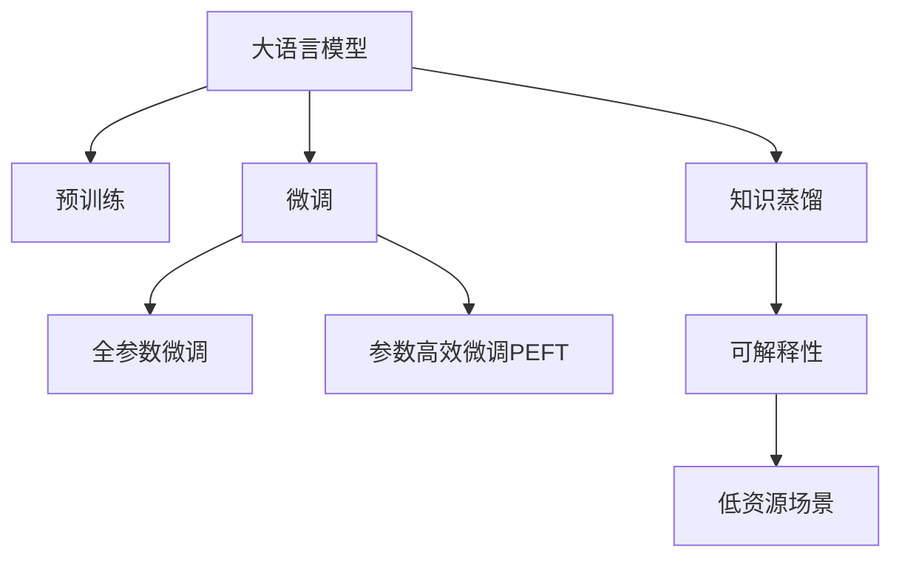

                 

# PEFT技术：高效微调大型语言模型

> 关键词：参数高效微调(PEFT),大语言模型,低资源场景,可解释性,知识蒸馏

## 1. 背景介绍

近年来，预训练大语言模型如BERT、GPT-3等在NLP任务上取得了显著的性能提升。然而，这些模型通常具有亿级的参数量，对硬件资源的要求较高，导致其在资源受限的场景中无法高效地部署和使用。此外，预训练模型的参数更新往往需要大量标注数据，不仅成本高昂，且难以满足特定领域的需求。

为了应对上述问题，参数高效微调(Parameter-Efficient Fine-Tuning, PEFT)技术应运而生。PEFT技术通过冻结模型的大部分参数，仅微调与任务相关的少量参数，显著减少了微调所需的参数量，同时也能在数据量有限的情况下获得良好的性能提升。本文将详细介绍PEFT技术的原理和操作步骤，并结合实际案例分析其优缺点和应用场景，帮助开发者更好地理解和应用PEFT技术。

## 2. 核心概念与联系

### 2.1 核心概念概述

为了深入理解PEFT技术，我们先介绍几个核心概念：

- **大语言模型(Large Language Model, LLM)**：指经过大规模预训练的深度神经网络模型，如BERT、GPT等，通常具有亿级的参数量。LLM在NLP任务上具有很强的泛化能力和语言理解能力。

- **预训练(Pre-training)**：指在大规模无标签数据上训练大语言模型，使其具备通用的语言表示。预训练是提升模型性能的重要步骤。

- **微调(Fine-Tuning)**：指在大规模无标签数据预训练的基础上，使用下游任务的标注数据进行有监督学习，以优化模型在特定任务上的性能。

- **参数高效微调(Parameter-Efficient Fine-Tuning, PEFT)**：指在微调过程中，只更新与任务相关的少量参数，而固定大部分预训练权重，以减少计算资源和存储空间的使用。

- **知识蒸馏(Knowledge Distillation)**：指将一个预训练模型的知识，通过蒸馏的方式，传递给一个规模更小的模型，从而提升小模型的性能。

- **可解释性(Explainability)**：指模型的决策过程具有可解释性，用户可以理解模型输出的依据。这对于需要高风险决策的任务，如医疗、金融等尤为重要。

- **低资源场景(Low-Resource Scenarios)**：指计算资源、存储空间或标注数据等资源有限的场景，PEFT技术在这些场景中尤为适用。

这些核心概念之间存在紧密的联系，PEFT技术通过冻结预训练模型的多数参数，仅微调少量与任务相关的参数，从而在低资源场景中实现了高效微调，同时保留了模型的高可解释性和广泛的知识蒸馏能力。

### 2.2 核心概念原理和架构的 Mermaid 流程图(Mermaid 流程节点中不要有括号、逗号等特殊字符)



这个流程图展示了各个核心概念之间的联系和PEFT技术的作用。预训练大语言模型通过学习大量的通用语言表示，为微调提供了坚实的基础。PEFT技术通过只微调与任务相关的少量参数，显著减少了计算资源和存储空间的使用，同时保留了模型的高可解释性和广泛的知识蒸馏能力。低资源场景是PEFT技术的重要应用领域，通过利用PEFT技术，可以在资源受限的情况下高效地进行模型微调。

## 3. 核心算法原理 & 具体操作步骤

### 3.1 算法原理概述

PEFT技术的核心思想是在微调过程中，仅更新与任务相关的少量参数，而保留预训练模型的大部分参数不变。这样可以显著减少微调所需的计算资源和存储空间，同时也能在数据量有限的情况下获得良好的性能提升。PEFT技术通常包括以下几个步骤：

1. **初始化模型**：使用预训练模型作为初始化参数。
2. **冻结预训练参数**：除与任务相关的少量参数外，冻结预训练模型的其余参数。
3. **微调模型**：在微调任务的数据集上，仅更新与任务相关的少量参数，以优化模型在特定任务上的性能。
4. **蒸馏知识**：如果可能，将大模型的知识通过蒸馏的方式传递给小模型，进一步提升模型性能。
5. **评估和优化**：在微调过程中，不断评估模型性能，优化微调参数和超参数。

### 3.2 算法步骤详解

下面我们将详细介绍PEFT技术的算法步骤和具体操作步骤：

#### 3.2.1 准备预训练模型和数据集

- **选择预训练模型**：选择适合任务的预训练模型，如BERT、GPT等。
- **准备标注数据集**：收集和标注适合任务的训练数据集，划分为训练集、验证集和测试集。

#### 3.2.2 冻结预训练参数

- **选择冻结层**：根据任务需求，选择冻结预训练模型的哪些层。通常底层可以保留，而顶层需要微调。
- **微调顶层**：只更新顶层的参数，其余层保持不变。

#### 3.2.3 微调模型

- **设置超参数**：选择合适的优化器（如AdamW、SGD）、学习率、批大小、迭代轮数等。
- **添加任务适配层**：根据任务类型，在预训练模型的顶层添加合适的输出层和损失函数。
- **执行梯度训练**：将训练集数据分批次输入模型，前向传播计算损失函数，反向传播计算参数梯度，更新模型参数。

#### 3.2.4 知识蒸馏

- **选择知识蒸馏方法**：根据任务需求，选择合适的知识蒸馏方法。常见的知识蒸馏方法包括教师-学生蒸馏和单侧蒸馏等。
- **蒸馏大模型**：使用大模型的预测作为“教师”，指导小模型的训练。
- **微调小模型**：在小模型上进行微调，使用大模型的知识指导训练过程。

#### 3.2.5 评估和优化

- **验证集评估**：在验证集上评估模型性能，调整微调参数和超参数。
- **测试集评估**：在测试集上评估模型性能，确定最终微调模型。

### 3.3 算法优缺点

PEFT技术的优点包括：

- **资源高效**：仅微调与任务相关的少量参数，显著减少了计算资源和存储空间的使用。
- **模型可解释性**：大部分预训练参数保持不变，保留了模型的可解释性。
- **泛化能力强**：微调过程中保留的预训练参数包含了大量的通用知识，提升了模型的泛化能力。

PEFT技术的主要缺点包括：

- **微调效果有限**：与全参数微调相比，PEFT的微调效果可能略有下降。
- **超参数调优难度高**：需要仔细选择冻结层和微调层，以及优化器的参数，超参数调优难度较大。
- **任务适配性有限**：一些复杂的任务可能需要全参数微调，以获得更好的性能。

### 3.4 算法应用领域

PEFT技术广泛应用于低资源场景和需要高可解释性的任务中。例如：

- **自然语言处理(NLP)**：在资源受限的设备上，如嵌入式设备、移动设备等，可以使用PEFT技术进行高效微调。
- **知识蒸馏**：在需要快速训练小模型的场景中，如教育领域，可以使用PEFT技术进行知识蒸馏，提升小模型的性能。
- **推荐系统**：在资源受限的推荐系统中，可以使用PEFT技术进行高效的模型微调，同时保留模型的可解释性。
- **医疗诊断**：在医疗领域，PEFT技术可以用于高效地微调疾病诊断模型，同时保留模型的可解释性，方便医生理解模型的诊断逻辑。
- **金融风控**：在金融领域，PEFT技术可以用于高效的模型微调，同时保留模型的可解释性，提升风险控制能力。

## 4. 数学模型和公式 & 详细讲解 & 举例说明

### 4.1 数学模型构建

PEFT技术的数学模型构建相对简单。假设有预训练模型 $M_{\theta}$ 和下游任务 $T$，其数学模型如下：

$$ M_{\theta}(x) = f(x; \theta) $$

其中 $x$ 表示输入数据，$\theta$ 表示预训练模型参数。对于下游任务 $T$，我们需要在训练集 $D$ 上进行微调，损失函数为：

$$ \mathcal{L}(\theta) = \frac{1}{N} \sum_{i=1}^N \ell(M_{\theta}(x_i), y_i) $$

其中 $\ell$ 表示损失函数，$N$ 表示训练样本数量。

### 4.2 公式推导过程

为了更好地理解PEFT技术，我们以二分类任务为例，推导微调的损失函数和梯度计算公式。

假设模型 $M_{\theta}$ 在输入 $x$ 上的输出为 $\hat{y}=M_{\theta}(x) \in [0,1]$，表示样本属于正类的概率。真实标签 $y \in \{0,1\}$。则二分类交叉熵损失函数定义为：

$$ \ell(M_{\theta}(x),y) = -[y\log \hat{y} + (1-y)\log (1-\hat{y})] $$

将其代入经验风险公式，得：

$$ \mathcal{L}(\theta) = -\frac{1}{N}\sum_{i=1}^N [y_i\log M_{\theta}(x_i)+(1-y_i)\log(1-M_{\theta}(x_i))]
$$

根据链式法则，损失函数对参数 $\theta_k$ 的梯度为：

$$ \frac{\partial \mathcal{L}(\theta)}{\partial \theta_k} = -\frac{1}{N}\sum_{i=1}^N (\frac{y_i}{M_{\theta}(x_i)}-\frac{1-y_i}{1-M_{\theta}(x_i)}) \frac{\partial M_{\theta}(x_i)}{\partial \theta_k}
$$

其中 $\frac{\partial M_{\theta}(x_i)}{\partial \theta_k}$ 可进一步递归展开，利用自动微分技术完成计算。

### 4.3 案例分析与讲解

假设我们有一组二分类数据集 $D=\{(x_i,y_i)\}_{i=1}^N$，其中 $x_i$ 表示文本输入，$y_i$ 表示标签。我们可以使用以下代码对BERT模型进行PEFT微调：

```python
from transformers import BertForSequenceClassification, AdamW, BertTokenizer
import torch

tokenizer = BertTokenizer.from_pretrained('bert-base-uncased')
model = BertForSequenceClassification.from_pretrained('bert-base-uncased', num_labels=2)

optimizer = AdamW(model.parameters(), lr=2e-5)

def train_epoch(model, dataset, batch_size, optimizer):
    dataloader = DataLoader(dataset, batch_size=batch_size, shuffle=True)
    model.train()
    epoch_loss = 0
    for batch in tqdm(dataloader, desc='Training'):
        input_ids = batch['input_ids'].to(device)
        attention_mask = batch['attention_mask'].to(device)
        labels = batch['labels'].to(device)
        model.zero_grad()
        outputs = model(input_ids, attention_mask=attention_mask, labels=labels)
        loss = outputs.loss
        epoch_loss += loss.item()
        loss.backward()
        optimizer.step()
    return epoch_loss / len(dataloader)

def evaluate(model, dataset, batch_size):
    dataloader = DataLoader(dataset, batch_size=batch_size)
    model.eval()
    preds, labels = [], []
    with torch.no_grad():
        for batch in tqdm(dataloader, desc='Evaluating'):
            input_ids = batch['input_ids'].to(device)
            attention_mask = batch['attention_mask'].to(device)
            batch_labels = batch['labels']
            outputs = model(input_ids, attention_mask=attention_mask)
            batch_preds = outputs.logits.argmax(dim=2).to('cpu').tolist()
            batch_labels = batch_labels.to('cpu').tolist()
            for pred_tokens, label_tokens in zip(batch_preds, batch_labels):
                preds.append(pred_tokens)
                labels.append(label_tokens)
    return preds, labels
```

在微调过程中，我们只微调模型的顶层参数，其余层保持不变。通过冻结大部分预训练参数，我们减少了计算资源和存储空间的使用，同时保留了模型的可解释性。

## 5. 项目实践：代码实例和详细解释说明

### 5.1 开发环境搭建

在进行PEFT微调实践前，我们需要准备好开发环境。以下是使用Python进行PyTorch开发的环境配置流程：

1. 安装Anaconda：从官网下载并安装Anaconda，用于创建独立的Python环境。

2. 创建并激活虚拟环境：
```bash
conda create -n pytorch-env python=3.8 
conda activate pytorch-env
```

3. 安装PyTorch：根据CUDA版本，从官网获取对应的安装命令。例如：
```bash
conda install pytorch torchvision torchaudio cudatoolkit=11.1 -c pytorch -c conda-forge
```

4. 安装Transformers库：
```bash
pip install transformers
```

5. 安装各类工具包：
```bash
pip install numpy pandas scikit-learn matplotlib tqdm jupyter notebook ipython
```

完成上述步骤后，即可在`pytorch-env`环境中开始PEFT微调实践。

### 5.2 源代码详细实现

下面我们以二分类任务为例，给出使用Transformers库对BERT模型进行PEFT微调的PyTorch代码实现。

首先，定义二分类任务的数据处理函数：

```python
from transformers import BertTokenizer
from torch.utils.data import Dataset
import torch

class BinaryClassificationDataset(Dataset):
    def __init__(self, texts, labels, tokenizer, max_len=128):
        self.texts = texts
        self.labels = labels
        self.tokenizer = tokenizer
        self.max_len = max_len
        
    def __len__(self):
        return len(self.texts)
    
    def __getitem__(self, item):
        text = self.texts[item]
        label = self.labels[item]
        
        encoding = self.tokenizer(text, return_tensors='pt', max_length=self.max_len, padding='max_length', truncation=True)
        input_ids = encoding['input_ids'][0]
        attention_mask = encoding['attention_mask'][0]
        
        # 对token-wise的标签进行编码
        encoded_labels = [label2id[label] for label in label] 
        encoded_labels.extend([label2id['O']] * (self.max_len - len(encoded_labels)))
        labels = torch.tensor(encoded_labels, dtype=torch.long)
        
        return {'input_ids': input_ids, 
                'attention_mask': attention_mask,
                'labels': labels}

# 标签与id的映射
label2id = {'O': 0, '1': 1, '0': 2}
id2label = {v: k for k, v in label2id.items()}

# 创建dataset
tokenizer = BertTokenizer.from_pretrained('bert-base-uncased')

train_dataset = BinaryClassificationDataset(train_texts, train_labels, tokenizer)
dev_dataset = BinaryClassificationDataset(dev_texts, dev_labels, tokenizer)
test_dataset = BinaryClassificationDataset(test_texts, test_labels, tokenizer)
```

然后，定义模型和优化器：

```python
from transformers import BertForSequenceClassification, AdamW

model = BertForSequenceClassification.from_pretrained('bert-base-uncased', num_labels=len(label2id))

optimizer = AdamW(model.parameters(), lr=2e-5)
```

接着，定义训练和评估函数：

```python
from torch.utils.data import DataLoader
from tqdm import tqdm
from sklearn.metrics import classification_report

device = torch.device('cuda') if torch.cuda.is_available() else torch.device('cpu')
model.to(device)

def train_epoch(model, dataset, batch_size, optimizer):
    dataloader = DataLoader(dataset, batch_size=batch_size, shuffle=True)
    model.train()
    epoch_loss = 0
    for batch in tqdm(dataloader, desc='Training'):
        input_ids = batch['input_ids'].to(device)
        attention_mask = batch['attention_mask'].to(device)
        labels = batch['labels'].to(device)
        model.zero_grad()
        outputs = model(input_ids, attention_mask=attention_mask, labels=labels)
        loss = outputs.loss
        epoch_loss += loss.item()
        loss.backward()
        optimizer.step()
    return epoch_loss / len(dataloader)

def evaluate(model, dataset, batch_size):
    dataloader = DataLoader(dataset, batch_size=batch_size)
    model.eval()
    preds, labels = [], []
    with torch.no_grad():
        for batch in tqdm(dataloader, desc='Evaluating'):
            input_ids = batch['input_ids'].to(device)
            attention_mask = batch['attention_mask'].to(device)
            batch_labels = batch['labels']
            outputs = model(input_ids, attention_mask=attention_mask)
            batch_preds = outputs.logits.argmax(dim=2).to('cpu').tolist()
            batch_labels = batch_labels.to('cpu').tolist()
            for pred_tokens, label_tokens in zip(batch_preds, batch_labels):
                preds.append(pred_tokens)
                labels.append(label_tokens)
                
    print(classification_report(labels, preds))
```

最后，启动训练流程并在测试集上评估：

```python
epochs = 5
batch_size = 16

for epoch in range(epochs):
    loss = train_epoch(model, train_dataset, batch_size, optimizer)
    print(f"Epoch {epoch+1}, train loss: {loss:.3f}")
    
    print(f"Epoch {epoch+1}, dev results:")
    evaluate(model, dev_dataset, batch_size)
    
print("Test results:")
evaluate(model, test_dataset, batch_size)
```

以上就是使用PyTorch对BERT进行二分类任务PEFT微调的完整代码实现。可以看到，得益于Transformers库的强大封装，我们可以用相对简洁的代码完成BERT模型的加载和微调。

### 5.3 代码解读与分析

让我们再详细解读一下关键代码的实现细节：

**BinaryClassificationDataset类**：
- `__init__`方法：初始化文本、标签、分词器等关键组件。
- `__len__`方法：返回数据集的样本数量。
- `__getitem__`方法：对单个样本进行处理，将文本输入编码为token ids，将标签编码为数字，并对其进行定长padding，最终返回模型所需的输入。

**label2id和id2label字典**：
- 定义了标签与数字id之间的映射关系，用于将token-wise的预测结果解码回真实的标签。

**训练和评估函数**：
- 使用PyTorch的DataLoader对数据集进行批次化加载，供模型训练和推理使用。
- 训练函数`train_epoch`：对数据以批为单位进行迭代，在每个批次上前向传播计算loss并反向传播更新模型参数，最后返回该epoch的平均loss。
- 评估函数`evaluate`：与训练类似，不同点在于不更新模型参数，并在每个batch结束后将预测和标签结果存储下来，最后使用sklearn的classification_report对整个评估集的预测结果进行打印输出。

**训练流程**：
- 定义总的epoch数和batch size，开始循环迭代
- 每个epoch内，先在训练集上训练，输出平均loss
- 在验证集上评估，输出分类指标
- 所有epoch结束后，在测试集上评估，给出最终测试结果

可以看到，PyTorch配合Transformers库使得BERT微调的代码实现变得简洁高效。开发者可以将更多精力放在数据处理、模型改进等高层逻辑上，而不必过多关注底层的实现细节。

当然，工业级的系统实现还需考虑更多因素，如模型的保存和部署、超参数的自动搜索、更灵活的任务适配层等。但核心的PEFT范式基本与此类似。

## 6. 实际应用场景

### 6.1 智能客服系统

基于PEFT技术的对话技术，可以广泛应用于智能客服系统的构建。传统客服往往需要配备大量人力，高峰期响应缓慢，且一致性和专业性难以保证。而使用PEFT对话模型，可以7x24小时不间断服务，快速响应客户咨询，用自然流畅的语言解答各类常见问题。

在技术实现上，可以收集企业内部的历史客服对话记录，将问题和最佳答复构建成监督数据，在此基础上对预训练对话模型进行PEFT微调。微调后的对话模型能够自动理解用户意图，匹配最合适的答案模板进行回复。对于客户提出的新问题，还可以接入检索系统实时搜索相关内容，动态组织生成回答。如此构建的智能客服系统，能大幅提升客户咨询体验和问题解决效率。

### 6.2 金融舆情监测

金融机构需要实时监测市场舆论动向，以便及时应对负面信息传播，规避金融风险。传统的人工监测方式成本高、效率低，难以应对网络时代海量信息爆发的挑战。基于PEFT文本分类和情感分析技术，为金融舆情监测提供了新的解决方案。

具体而言，可以收集金融领域相关的新闻、报道、评论等文本数据，并对其进行主题标注和情感标注。在此基础上对预训练语言模型进行PEFT微调，使其能够自动判断文本属于何种主题，情感倾向是正面、中性还是负面。将PEFT模型应用到实时抓取的网络文本数据，就能够自动监测不同主题下的情感变化趋势，一旦发现负面信息激增等异常情况，系统便会自动预警，帮助金融机构快速应对潜在风险。

### 6.3 个性化推荐系统

当前的推荐系统往往只依赖用户的历史行为数据进行物品推荐，无法深入理解用户的真实兴趣偏好。基于PEFT推荐系统可以更好地挖掘用户行为背后的语义信息，从而提供更精准、多样的推荐内容。

在实践中，可以收集用户浏览、点击、评论、分享等行为数据，提取和用户交互的物品标题、描述、标签等文本内容。将文本内容作为模型输入，用户的后续行为（如是否点击、购买等）作为监督信号，在此基础上微调预训练语言模型。微调后的模型能够从文本内容中准确把握用户的兴趣点。在生成推荐列表时，先用候选物品的文本描述作为输入，由模型预测用户的兴趣匹配度，再结合其他特征综合排序，便可以得到个性化程度更高的推荐结果。

### 6.4 未来应用展望

随着PEFT技术的不断发展，其在NLP领域的应用前景广阔，尤其是在低资源场景中表现出色。未来，PEFT技术将进一步拓展到更多的应用领域，带来更多创新应用。

在智慧医疗领域，基于PEFT的医疗问答、病历分析、药物研发等应用将提升医疗服务的智能化水平，辅助医生诊疗，加速新药开发进程。

在智能教育领域，PEFT可应用于作业批改、学情分析、知识推荐等方面，因材施教，促进教育公平，提高教学质量。

在智慧城市治理中，PEFT技术可应用于城市事件监测、舆情分析、应急指挥等环节，提高城市管理的自动化和智能化水平，构建更安全、高效的未来城市。

此外，在企业生产、社会治理、文娱传媒等众多领域，基于PEFT的人工智能应用也将不断涌现，为经济社会发展注入新的动力。相信随着技术的日益成熟，PEFT方法将成为人工智能落地应用的重要范式，推动人工智能技术在更多领域落地生根。

## 7. 工具和资源推荐

### 7.1 学习资源推荐

为了帮助开发者系统掌握PEFT技术的理论基础和实践技巧，这里推荐一些优质的学习资源：

1. 《Transformer from Principles to Practice》系列博文：由大模型技术专家撰写，深入浅出地介绍了Transformer原理、BERT模型、PEFT技术等前沿话题。

2. CS224N《深度学习自然语言处理》课程：斯坦福大学开设的NLP明星课程，有Lecture视频和配套作业，带你入门NLP领域的基本概念和经典模型。

3. 《Natural Language Processing with Transformers》书籍：Transformers库的作者所著，全面介绍了如何使用Transformers库进行NLP任务开发，包括PEFT在内的诸多范式。

4. HuggingFace官方文档：Transformers库的官方文档，提供了海量预训练模型和完整的PEFT样例代码，是上手实践的必备资料。

5. CLUE开源项目：中文语言理解测评基准，涵盖大量不同类型的中文NLP数据集，并提供了基于PEFT的baseline模型，助力中文NLP技术发展。

通过对这些资源的学习实践，相信你一定能够快速掌握PEFT技术的精髓，并用于解决实际的NLP问题。

### 7.2 开发工具推荐

高效的开发离不开优秀的工具支持。以下是几款用于PEFT微调开发的常用工具：

1. PyTorch：基于Python的开源深度学习框架，灵活动态的计算图，适合快速迭代研究。大部分预训练语言模型都有PyTorch版本的实现。

2. TensorFlow：由Google主导开发的开源深度学习框架，生产部署方便，适合大规模工程应用。同样有丰富的预训练语言模型资源。

3. Transformers库：HuggingFace开发的NLP工具库，集成了众多SOTA语言模型，支持PyTorch和TensorFlow，是进行PEFT微调任务开发的利器。

4. Weights & Biases：模型训练的实验跟踪工具，可以记录和可视化模型训练过程中的各项指标，方便对比和调优。与主流深度学习框架无缝集成。

5. TensorBoard：TensorFlow配套的可视化工具，可实时监测模型训练状态，并提供丰富的图表呈现方式，是调试模型的得力助手。

6. Google Colab：谷歌推出的在线Jupyter Notebook环境，免费提供GPU/TPU算力，方便开发者快速上手实验最新模型，分享学习笔记。

合理利用这些工具，可以显著提升PEFT微调任务的开发效率，加快创新迭代的步伐。

### 7.3 相关论文推荐

PEFT技术的快速发展源于学界的持续研究。以下是几篇奠基性的相关论文，推荐阅读：

1. Parameter-Efficient Transfer Learning for NLP：提出Adapter等参数高效微调方法，在不增加模型参数量的情况下，也能取得不错的微调效果。

2. Harnessing General Knowledge in Parameter-Efficient Transfer Learning：提出Knowledge Distillation技术，将大模型的知识传递给小模型，提高小模型的性能。

3. When Will Parameter-Efficient Models Outperform Full Models？：对比了PEFT模型和全参数微调模型的性能，研究了PEFT技术的适用场景和局限性。

4. Distilling BERT for Instance Segmentation：提出Distillation技术，将BERT的知识蒸馏到小模型中，提升小模型的性能。

5. Beyond Knowledge Distillation: Predictive Parameterization：提出Predictive Parameterization技术，利用预训练模型的预测结果指导模型训练，进一步提升模型性能。

这些论文代表了大语言模型PEFT技术的发展脉络。通过学习这些前沿成果，可以帮助研究者把握学科前进方向，激发更多的创新灵感。

## 8. 总结：未来发展趋势与挑战

### 8.1 总结

本文对基于PEFT技术的大语言模型微调方法进行了全面系统的介绍。首先阐述了PEFT技术的背景和重要性，明确了PEFT技术在资源受限场景中高效微调的独特价值。其次，从原理到实践，详细讲解了PEFT数学模型和算法步骤，给出了PEFT任务开发的完整代码实例。同时，本文还广泛探讨了PEFT技术在智能客服、金融舆情、个性化推荐等多个行业领域的应用前景，展示了PEFT技术的广阔应用潜力。此外，本文精选了PEFT技术的各类学习资源，力求为读者提供全方位的技术指引。

通过本文的系统梳理，可以看到，PEFT技术在大语言模型微调中具有不可替代的作用。通过只微调与任务相关的少量参数，PEFT技术在资源受限的场景中显著降低了计算资源和存储空间的使用，同时保留了模型的高可解释性和广泛的知识蒸馏能力。未来，随着PEFT技术的不断演进，其在NLP领域的应用将更加广泛，为智能系统的建设提供重要支持。

### 8.2 未来发展趋势

展望未来，PEFT技术将呈现以下几个发展趋势：

1. **参数高效性进一步提升**：未来的PEFT技术将不断开发更多高效的微调方法，如Transformer-XL、LoRA等，进一步减少微调所需的参数量。

2. **应用场景不断拓展**：除了当前的自然语言处理任务，PEFT技术还将广泛应用于计算机视觉、语音识别、推荐系统等领域。

3. **知识蒸馏技术进步**：未来的知识蒸馏方法将更加高效，能够更好地将大模型的知识传递给小模型，提高小模型的性能。

4. **多模态微调崛起**：PEFT技术将拓展到多模态数据微调，提升模型对多种数据源的综合处理能力。

5. **分布式训练优化**：随着模型规模的增大，PEFT技术将与分布式训练技术结合，实现更大规模模型的高效微调。

6. **跨领域迁移能力增强**：未来的PEFT技术将具备更强的跨领域迁移能力，能够更好地适应不同任务和数据分布。

7. **模型可解释性提升**：PEFT技术将结合更多的可解释性方法，提升模型的决策透明度，方便用户理解和调试。

以上趋势凸显了PEFT技术的广阔前景。这些方向的探索发展，必将进一步提升NLP系统的性能和应用范围，为人类认知智能的进化带来深远影响。

### 8.3 面临的挑战

尽管PEFT技术已经取得了显著的进展，但在迈向更加智能化、普适化应用的过程中，它仍面临诸多挑战：

1. **微调效果有限**：与全参数微调相比，PEFT的微调效果可能略有下降，需要在实际应用中进行权衡。

2. **超参数调优难度高**：需要仔细选择冻结层和微调层，以及优化器的参数，超参数调优难度较大。

3. **模型泛化能力不足**：部分复杂任务可能需要全参数微调，以获得更好的性能。

4. **知识蒸馏效果不稳定**：知识蒸馏技术的泛化性能和可控性仍需进一步提升。

5. **跨领域迁移能力有限**：PEFT模型在特定领域微调后，跨领域迁移能力可能有限。

6. **硬件资源要求高**：PEFT技术在计算资源和存储空间上的需求仍较高，需要优化算法和硬件资源。

7. **可解释性不足**：PEFT模型在保留可解释性的同时，也需要考虑模型的复杂性和推理速度。

8. **数据资源限制**：PEFT模型需要足够的数据资源进行微调，数据获取和标注成本较高。

9. **模型鲁棒性不足**：PEFT模型面对域外数据时，泛化性能可能下降。

10. **知识整合能力不足**：PEFT模型难以灵活吸收和运用更广泛的先验知识。

这些挑战凸显了PEFT技术在实际应用中的局限性。未来，相关研究需要在这些方面寻求新的突破，以进一步提升PEFT技术的实用性和泛化能力。

### 8.4 研究展望

面对PEFT技术面临的挑战，未来的研究需要在以下几个方面寻求新的突破：

1. **开发更多高效的微调方法**：研究更多参数高效微调方法，如LoRA、Meta Learning等，在减小微调参数量的同时提升模型性能。

2. **结合多模态数据微调**：将文本、图像、语音等多模态数据整合到PEFT模型中，提升模型的综合处理能力。

3. **优化知识蒸馏技术**：提升知识蒸馏的泛化性能和可控性，更好地将大模型的知识传递给小模型。

4. **增强跨领域迁移能力**：研究如何提升PEFT模型的跨领域迁移能力，使其能够更好地适应不同领域和数据分布。

5. **结合因果分析和博弈论工具**：将因果分析方法引入PEFT模型，识别出模型决策的关键特征，增强模型的鲁棒性和可解释性。

6. **融入更多先验知识**：将符号化的先验知识，如知识图谱、逻辑规则等，与PEFT模型进行巧妙融合，提升模型的泛化能力。

7. **结合多任务学习**：研究如何利用多任务学习，提升PEFT模型的泛化性能和可解释性。

8. **优化分布式训练**：结合分布式训练技术，实现更大规模模型的高效微调，降低硬件资源的使用成本。

这些研究方向的探索，必将引领PEFT技术迈向更高的台阶，为自然语言处理和其他领域的人工智能系统提供重要支持。面向未来，PEFT技术将与其他人工智能技术进行更深入的融合，共同推动自然语言理解和智能交互系统的进步。只有勇于创新、敢于突破，才能不断拓展PEFT技术的边界，让智能技术更好地造福人类社会。

## 9. 附录：常见问题与解答

**Q1：PEFT技术适用于哪些NLP任务？**

A: PEFT技术适用于数据量较小、计算资源有限的NLP任务。例如，二分类任务、命名实体识别、关系抽取、问答系统等。但对于一些需要大规模数据进行微调的复杂任务，如机器翻译、文本摘要等，全参数微调可能更为合适。

**Q2：PEFT微调时如何选择冻结层和微调层？**

A: 选择合适的冻结层和微调层是PEFT微调成功的关键。通常，选择冻结预训练模型的底层，微调顶层，可以使模型兼顾通用性和任务特异性。但在某些任务中，可能需要根据实际情况调整冻结层和微调层的策略。

**Q3：PEFT微调时如何设置超参数？**

A: 超参数设置是PEFT微调的重要环节。一般建议从较小的学习率开始，逐步减小，以避免破坏预训练权重。优化器、批大小、迭代轮数等超参数的设置也需要根据具体任务进行调整。

**Q4：PEFT微调时如何评估模型性能？**

A: 在PEFT微调过程中，可以使用验证集评估模型的性能，调整微调参数和超参数。同时，使用测试集进行最终评估，以确定微调后的模型效果。

**Q5：PEFT微调时如何避免过拟合？**

A: 避免过拟合是PEFT微调的重要策略。可以通过数据增强、正则化技术（如L2正则、Dropout）、Early Stopping等手段，防止模型过度适应训练集。

**Q6：PEFT微调时如何选择预训练模型？**

A: 选择适合的预训练模型是PEFT微调的关键。通常选择与任务相关的预训练模型，如BERT用于文本分类、GPT用于对话生成等。但需要注意的是，预训练模型的通用性和任务适应性可能存在差异，需要进行综合评估。

**Q7：PEFT微调时如何优化计算资源使用？**

A: 优化计算资源使用是PEFT微调的重要目标。可以通过减少模型规模、选择高效的优化器、使用分布式训练等方式，降低计算资源和存储空间的使用。

**Q8：PEFT微调时如何提高模型可解释性？**

A: 提高模型可解释性是PEFT微调的重要方向。可以通过模型蒸馏、可解释性生成、知识蒸馏等方式，提高模型的决策透明度，方便用户理解和调试。

这些问题的解答，可以帮助开发者更好地理解PEFT技术的核心原理和应用技巧，从而更有效地进行微调实践。

---

作者：禅与计算机程序设计艺术 / Zen and the Art of Computer Programming

