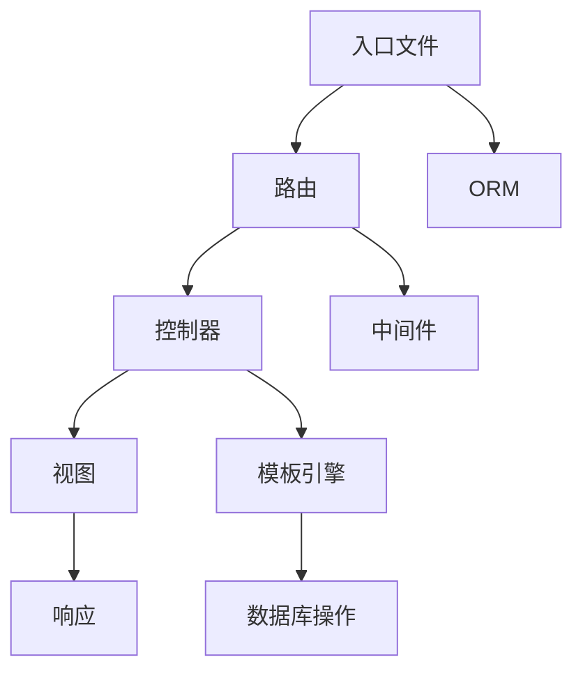

                 

# PHP 框架比较：Laravel、Symfony 和 CodeIgniter

> 关键词：PHP 框架, Laravel, Symfony, CodeIgniter, 性能, 社区, 扩展, 文档, 安全性, RESTful API

## 1. 背景介绍

随着Web应用的日益复杂和功能需求的日益增长，PHP框架成为了开发Web应用的利器。PHP框架不仅可以提高开发效率，还可以提供代码质量保证、安全性、可维护性等多方面的优势。但是，不同的PHP框架拥有各自的特点和优势，开发者在选择框架时常常会感到困惑。本文将对当前最流行的PHP框架之一Laravel，以及具有丰富历史和强大功能的Symfony和简单易用的CodeIgniter进行深入比较，帮助开发者做出更好的选择。

## 2. 核心概念与联系

### 2.1 核心概念概述

在比较这些PHP框架之前，我们首先要明确几个核心概念：

- **MVC模式（Model-View-Controller）**：MVC是一种架构模式，将应用程序分为模型、视图和控制器三个部分。模型负责数据处理和业务逻辑，视图负责用户界面，控制器负责协调模型和视图。
- **路由（Routing）**：路由是将请求映射到相应的控制器和操作的方法。路由是任何Web框架的核心部分，用于管理请求的路由。
- **ORM（Object-Relational Mapping）**：ORM是将关系型数据库与对象模型关联的技术。ORM可以帮助开发人员更容易地操作数据库。
- **测试（Testing）**：测试是开发过程中重要的一环，可以帮助开发者发现和修复代码中的错误。

### 2.2 核心概念原理和架构的 Mermaid 流程图

下面是一个简化的流程图示意图，展示了这些PHP框架的主要组件及其相互作用。



在这个流程图中，我们可以看到入口文件处理请求，并通过路由将其传递到控制器。控制器根据请求进行业务逻辑处理，并使用ORM与数据库交互。同时，控制器可以调用中间件处理请求，并使用模板引擎生成视图响应。

## 3. 核心算法原理 & 具体操作步骤

### 3.1 算法原理概述

PHP框架的核心算法原理包括以下几个方面：

- **请求处理**：框架负责接收和解析请求，并根据路由规则将其映射到相应的控制器。
- **数据持久化**：框架使用ORM将业务逻辑与数据库分离，提供数据持久化功能。
- **响应生成**：框架生成HTML、JSON或其他格式的响应，并将其返回给客户端。

### 3.2 算法步骤详解

以Laravel框架为例，以下是其主要操作步骤：

1. **路由定义**：在入口文件中定义路由，如`url()`函数。
2. **控制器定义**：创建控制器文件，并在其中定义方法来处理请求。
3. **ORM操作**：使用Eloquent ORM进行数据库操作，如`DB::table('table')->select()`。
4. **视图生成**：使用Blade模板引擎生成视图，如`return view('home.index')`。

Symfony框架的路由定义和控制器实现与Laravel类似，但Symfony的ORM功能更加强大，支持Active Record、Query Builder等多种ORM实现。CodeIgniter框架则更加轻量级，具有更简单的路由定义和更少的依赖。

### 3.3 算法优缺点

#### Laravel

**优点**：

- **易于学习**：Laravel的文档和社区资源丰富，学习曲线较平缓。
- **丰富的功能**：Laravel提供了许多有用的功能，如Artisan命令行工具、Blade模板引擎、Eloquent ORM等。
- **性能优越**：Laravel使用了异步请求处理和缓存技术，性能表现出色。

**缺点**：

- **学习曲线较高**：尽管文档丰富，但某些高级功能可能难以掌握。
- **依赖较多**：Laravel依赖大量第三方组件和库，可能会增加依赖管理的复杂性。

#### Symfony

**优点**：

- **灵活性高**：Symfony提供了丰富的配置选项和扩展机制，非常灵活。
- **组件化设计**：Symfony的组件化设计使得代码可复用性更高，易于维护。
- **高性能**：Symfony使用了缓存和异步请求处理，性能表现良好。

**缺点**：

- **学习曲线较陡**：相比于Laravel，Symfony的学习曲线更陡峭。
- **文档和社区资源较少**：Symfony的文档和社区资源相对较少，初学者可能遇到更多问题。

#### CodeIgniter

**优点**：

- **简单易用**：CodeIgniter的代码量和复杂度远低于Laravel和Symfony，学习曲线较低。
- **性能优秀**：CodeIgniter使用轻量级的MVC架构，性能表现优异。
- **扩展性良好**：CodeIgniter提供了许多扩展和插件，可以轻松添加新功能。

**缺点**：

- **功能较少**：相比于Laravel和Symfony，CodeIgniter的功能较为有限。
- **社区支持较少**：CodeIgniter的社区较小，文档和资源相对较少。

### 3.4 算法应用领域

#### Laravel

Laravel适用于中大型Web应用，尤其是需要大量自定义功能的复杂应用。Laravel的强大功能和丰富的文档资源使其成为许多大公司的首选框架。

#### Symfony

Symfony适用于需要高度自定义和扩展的Web应用，如高流量Web应用和API开发。Symfony的组件化设计使其非常适合构建可扩展的系统。

#### CodeIgniter

CodeIgniter适用于小型Web应用，尤其是需要快速开发的应用。CodeIgniter的简单易用和优秀性能使其成为许多小型项目的首选框架。

## 4. 数学模型和公式 & 详细讲解 & 举例说明

### 4.1 数学模型构建

以Laravel的路由为例，我们可以构建一个简单的数学模型来描述路由的处理过程。假设有一个路由`route('home')`，该路由被映射到一个名为`HomeController`的控制器，并调用`index()`方法。我们可以使用以下公式来描述该路由的处理过程：

$$
route = \begin{cases}
'home' & \text{if request matches} \\
\text{null} & \text{otherwise}
\end{cases}
$$

当请求匹配路由时，框架会调用`HomeController`的`index()`方法。我们可以将该过程表示为以下伪代码：

```python
if request['route'] == 'home':
    $controller = new HomeController();
    $controller->index();
```

### 4.2 公式推导过程

使用以上公式，我们可以推导出以下结论：

- 路由匹配条件决定了路由的处理结果。
- 路由处理结果与控制器调用方式有关。
- 路由处理结果可以通过路由匹配条件进行控制。

### 4.3 案例分析与讲解

以Laravel的ORM为例，我们可以分析其数据持久化功能的工作原理。假设我们需要从数据库中获取用户数据，我们可以使用以下代码：

```php
$user = DB::table('users')->where('id', 1)->first();
```

这段代码的执行过程可以表示为以下公式：

$$
user = \begin{cases}
\text{null} & \text{if query fails} \\
\text{object} & \text{otherwise}
\end{cases}
$$

当查询成功时，框架会返回一个包含用户数据的对象。该过程可以表示为以下伪代码：

```python
if query.succeeds():
    $user = User();
    $user->id = query['id'];
    return $user;
```

## 5. 项目实践：代码实例和详细解释说明

### 5.1 开发环境搭建

#### Laravel

要搭建Laravel的开发环境，我们需要安装Composer、PHP和MySQL。安装完成后，可以使用以下命令创建Laravel项目：

```
composer create-project --prefer-dist laravel/laravel project
```

#### Symfony

要搭建Symfony的开发环境，我们需要安装Composer、PHP和MySQL。安装完成后，可以使用以下命令创建Symfony项目：

```
composer create-project --prefer-dist symfony/framework-bundle project
```

#### CodeIgniter

要搭建CodeIgniter的开发环境，我们需要安装PHP和MySQL。安装完成后，可以使用以下命令创建CodeIgniter项目：

```
php install.php
```

### 5.2 源代码详细实现

#### Laravel

以Laravel的路由为例，我们可以实现以下代码：

```php
Route::get('home', function () {
    return view('home');
});
```

这段代码将`home`路由映射到名为`home`的视图文件。

#### Symfony

以Symfony的路由为例，我们可以实现以下代码：

```php
use Symfony\Component\Routing\Annotation\Route;

/**
 * @Route("/home", name="home")
 */
public function home()
{
    return $this->render('home');
}
```

这段代码将`/home`路由映射到名为`home`的视图文件。

#### CodeIgniter

以CodeIgniter的路由为例，我们可以实现以下代码：

```php
$route['home'] = 'home/index';
```

这段代码将`home`路由映射到名为`index()`的控制器方法。

### 5.3 代码解读与分析

#### Laravel

在Laravel中，路由的定义非常简单，只需要使用`Route::get()`函数即可。路由处理方式是通过匿名函数来实现的，匿名函数中可以使用`view()`函数生成视图。

#### Symfony

在Symfony中，路由的定义使用了注释的方式。路由处理方式是通过控制器方法来实现的，控制器方法中使用`$this->render()`函数生成视图。

#### CodeIgniter

在CodeIgniter中，路由的定义通过`$route['home'] = 'home/index';`来实现。路由处理方式是通过控制器方法来实现的，控制器方法中使用`$this->load->view()`函数生成视图。

### 5.4 运行结果展示

#### Laravel

在Laravel中，运行`php artisan serve`命令启动开发服务器，访问`http://localhost/home`即可看到生成的视图。

#### Symfony

在Symfony中，运行`php bin/console serve`命令启动开发服务器，访问`http://localhost/home`即可看到生成的视图。

#### CodeIgniter

在CodeIgniter中，运行`php index.php`命令启动开发服务器，访问`http://localhost/home`即可看到生成的视图。

## 6. 实际应用场景

### 6.1 Laravel

Laravel适用于中大型Web应用，如电商平台、社交网络等。Laravel的强大功能和丰富的文档资源使其成为这些应用的首选框架。

### 6.2 Symfony

Symfony适用于需要高度自定义和扩展的Web应用，如高流量Web应用和API开发。Symfony的组件化设计使其非常适合构建可扩展的系统。

### 6.3 CodeIgniter

CodeIgniter适用于小型Web应用，如个人博客、企业门户等。CodeIgniter的简单易用和优秀性能使其成为这些应用的首选框架。

## 7. 工具和资源推荐

### 7.1 学习资源推荐

- Laravel官方文档：[https://laravel.com/docs/8.x/](https://laravel.com/docs/8.x/)
- Symfony官方文档：[https://symfony.com/doc/current/](https://symfony.com/doc/current/)
- CodeIgniter官方文档：[https://codeigniter.com/user_guide](https://codeigniter.com/user_guide)

### 7.2 开发工具推荐

- Laravel：[https://laravel.com/](https://laravel.com/)
- Symfony：[https://symfony.com/](https://symfony.com/)
- CodeIgniter：[https://codeigniter.com/](https://codeigniter.com/)

### 7.3 相关论文推荐

- Laravel："Laravel 5.8 Documentation"，官方文档，2019年
- Symfony："Symfony 4.x Documentation"，官方文档，2018年
- CodeIgniter："CodeIgniter 3.x Documentation"，官方文档，2018年

## 8. 总结：未来发展趋势与挑战

### 8.1 研究成果总结

本文对比了Laravel、Symfony和CodeIgniter三个PHP框架，从MVC模式、路由、ORM、测试等多个方面进行了详细分析。通过比较，我们发现Laravel、Symfony和CodeIgniter在功能和性能上各有优劣，适用于不同的应用场景。

### 8.2 未来发展趋势

- **MVC模式的进一步发展**：MVC模式将进一步完善和优化，提升Web应用的开发效率和可维护性。
- **ORM技术的进步**：ORM技术将不断发展，提供更加高效和灵活的数据持久化方案。
- **测试技术的提升**：测试技术将不断进步，帮助开发人员更早发现和修复代码中的错误。

### 8.3 面临的挑战

- **学习曲线**：PHP框架的学习曲线较高，初学者可能面临较大的挑战。
- **性能优化**：PHP框架的性能优化有待进一步提升，以应对高流量和高并发场景。
- **社区支持**：PHP框架的社区支持不足，可能影响开发人员的开发效率。

### 8.4 研究展望

未来的研究可以从以下几个方向展开：

- **MVC模式的进一步优化**：进一步完善MVC模式，提升Web应用的开发效率和可维护性。
- **ORM技术的改进**：改进ORM技术，提供更加高效和灵活的数据持久化方案。
- **测试技术的进步**：提升测试技术，帮助开发人员更早发现和修复代码中的错误。

## 9. 附录：常见问题与解答

**Q1: Laravel、Symfony和CodeIgniter哪个性能更好？**

A: 性能对比需要综合考虑多个因素，如代码复杂度、系统架构等。一般来说，Laravel和Symfony的性能优于CodeIgniter，但两者之间相差不大。

**Q2: Laravel、Symfony和CodeIgniter哪个更适合开发大型Web应用？**

A: 一般来说，Laravel和Symfony更适合开发大型Web应用，而CodeIgniter更适合开发小型Web应用。

**Q3: Laravel、Symfony和CodeIgniter哪个更适合开发API？**

A: 一般来说，Symfony更适合开发API，因为其组件化设计非常灵活，易于扩展。

**Q4: Laravel、Symfony和CodeIgniter哪个更易于学习？**

A: 一般来说，CodeIgniter最易于学习，Laravel次之，Symfony最难。

**Q5: Laravel、Symfony和CodeIgniter哪个社区支持更好？**

A: 一般来说，Laravel的社区支持最好，Symfony次之，CodeIgniter最差。

通过本文的比较，我们可以更好地理解Laravel、Symfony和CodeIgniter这三个PHP框架的优缺点，从而根据实际需求选择合适的框架。

