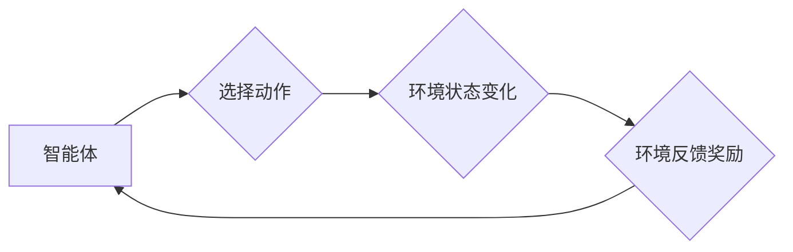

                 

## RL 在游戏和机器人中的应用

> 关键词：强化学习、游戏AI、机器人控制、深度强化学习、Q学习、策略梯度、环境建模、奖励函数设计

## 1. 背景介绍

强化学习 (Reinforcement Learning, RL) 作为机器学习的一个重要分支，近年来在人工智能领域取得了显著进展，并在游戏和机器人领域展现出巨大的应用潜力。 

强化学习的核心思想是通过**试错学习**，让智能体在与环境的交互中不断学习最优的行为策略。智能体通过与环境的互动，获得**奖励**或**惩罚**，并根据这些反馈调整自己的行为，最终达到最大化累积奖励的目标。

### 1.1 游戏领域应用

在游戏领域，强化学习被广泛应用于游戏AI的开发，例如：

* **游戏策略优化:** 利用强化学习算法，可以训练AI代理在游戏中学习最优的策略，从而提高游戏水平，甚至超越人类玩家。AlphaGo、AlphaStar等著名案例便是强化学习在游戏领域的成功应用。
* **游戏关卡设计:** 强化学习可以帮助游戏开发者设计更具挑战性和趣味性的游戏关卡。通过训练AI代理在不同关卡中进行游戏，可以分析玩家行为模式，并根据这些模式调整关卡难度和设计元素。
* **游戏内容生成:** 强化学习可以用于生成游戏内容，例如游戏场景、人物对话、任务目标等。通过训练AI模型，可以生成符合特定游戏风格和主题的内容，丰富游戏体验。

### 1.2 机器人领域应用

在机器人领域，强化学习被用于训练机器人完成各种复杂的任务，例如：

* **机器人控制:** 强化学习可以训练机器人学习最优的运动控制策略，使其能够在复杂环境中自主导航、避障、抓取物体等。
* **机器人决策:** 强化学习可以帮助机器人学习决策策略，使其能够在面对复杂情况时做出最优选择。例如，在物流机器人领域，强化学习可以训练机器人学习最优的路径规划策略，提高工作效率。
* **机器人适应性:** 强化学习可以使机器人具有更强的适应性，使其能够在不断变化的环境中学习和调整行为。例如，在医疗机器人领域，强化学习可以训练机器人学习不同的手术操作，并根据患者情况进行调整。

## 2. 核心概念与联系

强化学习的核心概念包括：

* **智能体 (Agent):** 与环境交互并做出决策的实体。
* **环境 (Environment):** 智能体所处的外部世界，会根据智能体的动作产生状态变化和奖励信号。
* **状态 (State):** 环境在特定时刻的描述。
* **动作 (Action):** 智能体可以采取的行动，会改变环境的状态。
* **奖励 (Reward):** 环境对智能体动作的反馈，可以是正向奖励或负向惩罚。
* **策略 (Policy):** 智能体根据当前状态选择动作的规则。

强化学习的目标是训练智能体学习一个最优策略，使得在与环境交互的过程中，智能体能够最大化累积的奖励。

**Mermaid 流程图**



## 3. 核心算法原理 & 具体操作步骤

### 3.1 算法原理概述

强化学习算法的核心是通过**试错学习**，不断更新智能体的策略，使其能够在与环境交互的过程中获得最大化的奖励。常见的强化学习算法包括：

* **Q学习:** 是一种基于价值函数的强化学习算法，通过学习状态-动作对的价值函数，选择最优动作。
* **策略梯度:** 是一种基于策略的强化学习算法，通过梯度上升算法直接优化策略参数，使其能够最大化奖励。
* **深度强化学习:** 将深度神经网络与强化学习算法结合，能够学习更复杂的策略，并应用于更复杂的场景。

### 3.2 算法步骤详解

以Q学习为例，其具体操作步骤如下：

1. **初始化Q表:** 创建一个Q表，用于存储每个状态-动作对的价值函数估计。
2. **环境交互:** 智能体与环境交互，观察当前状态，并根据策略选择动作。
3. **获得奖励:** 环境根据智能体的动作产生状态变化，并给予相应的奖励信号。
4. **更新Q值:** 根据Bellman方程更新Q表中的Q值，使得Q值更接近真实价值函数。
5. **重复步骤2-4:** 重复以上步骤，直到智能体学习到最优策略。

### 3.3 算法优缺点

**Q学习:**

* **优点:** 算法简单易懂，易于实现。
* **缺点:** 对于高维状态空间，Q表会变得非常庞大，难以存储和更新。

**策略梯度:**

* **优点:** 可以处理高维状态空间，并能够学习更复杂的策略。
* **缺点:** 训练过程比较复杂，需要对策略参数进行梯度更新。

**深度强化学习:**

* **优点:** 可以学习更复杂的策略，并应用于更复杂的场景。
* **缺点:** 训练过程需要大量数据和计算资源，并且容易陷入局部最优。

### 3.4 算法应用领域

强化学习算法广泛应用于以下领域:

* **游戏AI:** 训练游戏AI代理学习最优策略，提高游戏水平。
* **机器人控制:** 训练机器人学习最优的运动控制策略，使其能够在复杂环境中自主导航、避障、抓取物体等。
* **推荐系统:** 训练推荐系统学习用户偏好，并推荐更符合用户需求的内容。
* **金融交易:** 训练交易策略，自动进行股票交易。
* **医疗诊断:** 训练医疗诊断系统，辅助医生进行疾病诊断。

## 4. 数学模型和公式 & 详细讲解 & 举例说明

### 4.1 数学模型构建

强化学习的数学模型主要包括以下几个方面:

* **状态空间:**  表示环境所有可能的状态集合，用符号S表示。
* **动作空间:** 表示智能体可以采取的所有动作集合，用符号A表示。
* **状态转移概率:** 表示从一个状态到另一个状态的概率，用符号$P(s'|s,a)$表示，其中s是当前状态，a是采取的动作，$s'$是下一个状态。
* **奖励函数:** 表示环境对智能体动作的反馈，用符号$R(s,a)$表示，其中s是当前状态，a是采取的动作。
* **价值函数:** 表示智能体在特定状态下采取特定动作的长期奖励期望，用符号$V(s)$或$Q(s,a)$表示。

### 4.2 公式推导过程

**Bellman方程:**

Bellman方程是强化学习的核心公式，用于更新价值函数。

$$
V(s) = \max_a \sum_{s'} P(s'|s,a) [R(s,a) + \gamma V(s')]
$$

其中:

* $V(s)$ 是状态s的价值函数。
* $a$ 是智能体在状态s可以采取的动作。
* $P(s'|s,a)$ 是从状态s采取动作a到状态$s'$的概率。
* $R(s,a)$ 是在状态s采取动作a获得的奖励。
* $\gamma$ 是折扣因子，控制未来奖励的权重。

**Q学习更新公式:**

$$
Q(s,a) = Q(s,a) + \alpha [R(s,a) + \gamma \max_{a'} Q(s',a') - Q(s,a)]
$$

其中:

* $Q(s,a)$ 是状态s采取动作a的价值函数。
* $\alpha$ 是学习率，控制学习速度。

### 4.3 案例分析与讲解

**AlphaGo案例:**

AlphaGo是DeepMind公司开发的基于深度强化学习的围棋AI，它通过与自己进行数百万局围棋的自我博弈，学习到最优的策略，最终战胜了世界冠军李世石。

AlphaGo使用了深度神经网络来构建价值函数和策略网络，并通过强化学习算法进行训练。它在训练过程中使用了Monte Carlo树搜索算法来模拟未来的游戏状态，并根据模拟结果更新价值函数和策略网络。

## 5. 项目实践：代码实例和详细解释说明

### 5.1 开发环境搭建

* Python 3.x
* TensorFlow 或 PyTorch 深度学习框架
* OpenAI Gym 游戏环境

### 5.2 源代码详细实现

以下是一个简单的Q学习代码示例，用于训练一个智能体在OpenAI Gym的CartPole环境中保持平衡:

```python
import gym
import numpy as np
import tensorflow as tf

# 定义环境
env = gym.make('CartPole-v1')

# 定义Q表
num_states = env.observation_space.shape[0]
num_actions = env.action_space.n
Q_table = np.zeros((num_states, num_actions))

# 定义学习参数
learning_rate = 0.1
discount_factor = 0.99

# 训练循环
for episode in range(1000):
    state = env.reset()
    done = False
    total_reward = 0

    while not done:
        # 选择动作
        action = np.argmax(Q_table[state])

        # 执行动作
        next_state, reward, done, _ = env.step(action)

        # 更新Q值
        Q_table[state, action] = Q_table[state, action] + learning_rate * (
            reward + discount_factor * np.max(Q_table[next_state]) - Q_table[state, action]
        )

        # 更新状态
        state = next_state

        # 更新总奖励
        total_reward += reward

    print(f"Episode: {episode}, Total Reward: {total_reward}")

# 测试
state = env.reset()
while True:
    action = np.argmax(Q_table[state])
    state, reward, done, _ = env.step(action)
    env.render()
    if done:
        break
```

### 5.3 代码解读与分析

* **环境定义:** 使用OpenAI Gym库定义CartPole环境。
* **Q表初始化:** 创建一个Q表，用于存储每个状态-动作对的价值函数。
* **学习参数设置:** 设置学习率和折扣因子。
* **训练循环:** 训练智能体在环境中进行交互，更新Q表中的Q值。
* **动作选择:** 根据当前状态选择动作，选择Q值最大的动作。
* **环境交互:** 执行动作，获得下一个状态、奖励和是否结束游戏的信息。
* **Q值更新:** 使用Bellman方程更新Q表中的Q值。
* **测试:** 使用训练好的Q表测试智能体在环境中的表现。

### 5.4 运行结果展示

运行代码后，智能体将在CartPole环境中学习保持平衡，最终能够长时间保持平衡。

## 6. 实际应用场景

### 6.1 游戏AI

* **游戏策略优化:** 强化学习可以训练AI代理学习最优的策略，提高游戏水平，例如AlphaGo、AlphaStar等案例。
* **游戏内容生成:** 强化学习可以用于生成游戏内容，例如游戏场景、人物对话、任务目标等，丰富游戏体验。

### 6.2 机器人控制

* **机器人导航:** 强化学习可以训练机器人学习最优的导航策略，使其能够在复杂环境中自主导航。
* **机器人抓取:** 强化学习可以训练机器人学习最优的抓取策略，使其能够准确地抓取目标物体。
* **机器人协作:** 强化学习可以训练多个机器人协作完成复杂任务，例如组装、搬运等。

### 6.3 其他领域

* **推荐系统:** 强化学习可以训练推荐系统学习用户偏好，并推荐更符合用户需求的内容。
* **金融交易:** 强化学习可以训练交易策略，自动进行股票交易。
* **医疗诊断:** 强化学习可以训练医疗诊断系统，辅助医生进行疾病诊断。

### 6.4 未来应用展望

随着强化学习算法的不断发展，其应用场景将会更加广泛，例如:

* **自动驾驶:** 强化学习可以训练自动驾驶系统学习最优的驾驶策略，提高安全性。
* **个性化教育:** 强化学习可以训练个性化教育系统，根据学生的学习情况提供定制化的学习内容和教学方法。
* **科学研究:** 强化学习可以用于加速科学研究，例如药物发现、材料设计等。

## 7. 工具和资源推荐

### 7.1 学习资源推荐

* **书籍:**
    * Reinforcement Learning: An Introduction by Richard S. Sutton and Andrew G. Barto
    * Deep Reinforcement Learning Hands-On by Maxim Lapan
* **在线课程:**
    * Deep Reinforcement Learning Specialization by DeepLearning.AI
    * Reinforcement Learning by David Silver (University of DeepMind)
* **博客和网站:**
    * OpenAI Blog
    * DeepMind Blog
    * Towards Data Science

### 7.2 开发工具推荐

* **Python:** 强化学习开发的主要编程语言。
* **TensorFlow:** 深度学习框架，支持强化学习算法的实现。
* **PyTorch:** 深度学习框架，支持强化学习算法的实现。
* **OpenAI Gym:** 强化学习环境库，提供各种标准的强化学习环境。

### 7.3 相关论文推荐

* **Deep Reinforcement Learning with Double Q-learning**
* **Asynchronous Methods for Deep Reinforcement Learning**
* **Proximal Policy Optimization Algorithms**

## 8. 总结：未来发展趋势与挑战

### 8.1 研究成果总结

近年来，强化学习取得了显著进展，在游戏、机器人控制、推荐系统等领域取得了成功应用。深度强化学习算法的出现，使得强化学习能够处理更复杂的任务，并取得更优的性能。

### 8.2 未来发展趋势

* **更强大的算法:** 研究更强大的强化学习算法，例如能够处理更大规模、更复杂环境的任务。
* **更有效的训练方法:** 研究更有效的训练方法，例如减少训练时间和数据需求。
* **更广泛的应用:** 将强化学习应用到更多领域，例如自动驾驶、个性化教育、科学研究等。

### 8.3 面临的挑战

* **样本效率:** 强化学习算法通常需要大量的训练数据，这在现实应用中可能难以实现。
* **可解释性:** 强化学习模型的决策过程往往难以解释，这在一些安全关键应用中可能是一个问题。
* **安全性和鲁棒性:** 强化学习模型在面对未知情况时可能表现出不稳定性，需要提高其安全性和鲁棒性。

### 8.4 研究展望

未来，强化学习研究将继续朝着更强大、更有效、更安全的方向发展，并将在更多领域发挥重要作用。


## 9. 附录：常见问题与解答

**Q1: 强化学习和监督学习有什么区别？**

**A1:** 强化学习和监督学习都是机器学习的范式，但它们的区别在于数据类型和学习目标。监督学习使用标记数据来训练模型，目标是预测输入数据对应的输出标签。而强化学习使用奖励信号来训练模型，目标是学习一个最优的策略，使得在与环境交互的过程中获得最大化的累积奖励。

**Q2: 强化学习的应用场景有哪些？**

**A2:** 强化学习的应用场景非常广泛，包括游戏AI、机器人控制、推荐系统、金融交易、医疗诊断等。

**Q3: 如何选择合适的强化学习算法？**

**A3:** 选择合适的强化学习算法取决于具体的应用场景和任务需求。例如，对于离散动作空间的任务，Q学习是一个不错的选择。而对于连续动作空间的任务，策略梯度算法可能更合适。

**Q4: 强化学习的训练过程需要多长时间？**

**A4:** 强化学习的训练时间取决于多种因素，例如环境复杂度、算法选择、训练数据量等。一般来说，训练时间可能从几分钟到几周不等。

**Q5: 强化学习的未来发展趋势是什么？**

**A5:** 强化学习的未来发展趋势包括：

* 研究更强大的算法
* 研究更有效的训练方法
* 将强化学习应用到更多领域


作者：禅与计算机程序设计艺术 / Zen and the Art of Computer Programming<end_of_turn>

