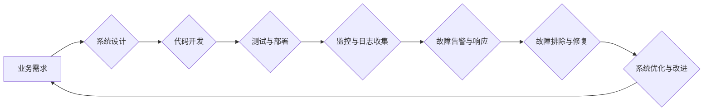

                 

## SRE（站点可靠性工程）：确保大规模系统的可靠性

> 关键词：站点可靠性工程 (SRE)、系统可靠性、DevOps、监控、故障排除、自动化、容错设计、容量规划、性能优化

### 1. 背景介绍

随着互联网的蓬勃发展，网站和应用程序的规模不断扩大，用户对服务可用性和性能的要求也越来越高。传统的IT运维模式难以应对大规模系统带来的复杂性和挑战。为了解决这些问题，站点可靠性工程 (SRE)应运而生。

SRE是一种将软件工程的最佳实践应用于IT运维的理念，旨在通过自动化、监控和持续改进，提高系统的可靠性、可用性和性能。SRE的核心目标是将系统故障的发生率降至最低，并确保在发生故障时能够快速恢复服务。

### 2. 核心概念与联系

SRE的核心概念包括：

* **可靠性 (Reliability):** 系统能够持续稳定地提供服务的能力。
* **可用性 (Availability):** 系统在特定时间段内能够被用户访问和使用的概率。
* **性能 (Performance):** 系统处理请求的速度和效率。
* **可观测性 (Observability):** 能够深入了解系统内部状态的能力。
* **自动化 (Automation):** 通过自动化脚本和工具，减少人工干预，提高效率和准确性。

SRE将这些概念有机地结合在一起，形成一个完整的系统可靠性保障体系。

**Mermaid 流程图**



### 3. 核心算法原理 & 具体操作步骤

SRE的核心算法原理主要体现在以下几个方面：

* **容错设计 (Fault Tolerance):** 通过冗余、备份和故障转移机制，确保系统在发生故障时能够继续运行。
* **容量规划 (Capacity Planning):** 通过分析系统负载和趋势，预先规划系统资源，避免系统过载或性能下降。
* **性能优化 (Performance Optimization):** 通过代码优化、数据库优化和网络优化等手段，提高系统性能。

**3.1 算法原理概述**

* **容错设计:** 容错设计旨在使系统能够抵御单个组件或节点的故障，并确保系统整体的可用性。常见的容错设计模式包括冗余、备份、故障转移和循环冗余校验 (CRC)。

* **容量规划:** 容量规划的目标是确保系统能够满足当前和未来的业务需求。通过分析系统负载、用户增长趋势和业务规则，可以预测未来的资源需求，并提前进行资源扩容。

* **性能优化:** 性能优化旨在提高系统处理请求的速度和效率。可以通过代码优化、数据库优化、网络优化等手段来实现。

**3.2 算法步骤详解**

* **容错设计:**
    1. 识别系统中的关键组件和节点。
    2. 为关键组件和节点设计冗余机制，例如部署多个实例或使用备份机制。
    3. 设计故障转移机制，确保在发生故障时能够快速切换到备用组件或节点。

* **容量规划:**
    1. 收集系统负载数据，包括CPU使用率、内存使用率、网络流量等。
    2. 分析负载趋势，预测未来的资源需求。
    3. 根据预测结果，进行资源扩容或调整系统架构。

* **性能优化:**
    1. 分析系统性能瓶颈，例如代码执行效率、数据库查询速度、网络传输延迟等。
    2. 根据瓶颈分析结果，进行代码优化、数据库优化或网络优化。
    3. 测试优化后的性能，并进行持续改进。

**3.3 算法优缺点**

* **容错设计:**
    * 优点: 提高系统可靠性和可用性。
    * 缺点: 增加了系统复杂性和成本。

* **容量规划:**
    * 优点: 避免系统过载和性能下降。
    * 缺点: 需要准确预测未来资源需求，否则可能导致资源浪费或不足。

* **性能优化:**
    * 优点: 提高系统处理速度和效率。
    * 缺点: 需要专业知识和经验，优化过程可能比较复杂。

**3.4 算法应用领域**

* **容错设计:** 应用于所有需要高可靠性的系统，例如金融系统、医疗系统、航空系统等。
* **容量规划:** 应用于所有需要根据业务需求动态调整资源的系统，例如电商平台、社交媒体平台等。
* **性能优化:** 应用于所有需要提高处理速度和效率的系统，例如游戏服务器、视频流媒体平台等。

### 4. 数学模型和公式 & 详细讲解 & 举例说明

SRE中常用的数学模型和公式主要用于系统可靠性、可用性和性能的分析和预测。

**4.1 数学模型构建**

* **可靠性模型:** 常见的可靠性模型包括指数分布、威布尔分布和泊松分布。这些模型可以用来描述系统组件的故障率和修复时间。

* **可用性模型:** 可用性模型通常基于可靠性模型，并考虑系统冗余和故障转移机制。

* **性能模型:** 性能模型可以用来预测系统在不同负载条件下的性能指标，例如响应时间、吞吐量和延迟。

**4.2 公式推导过程**

* **可靠性:** 系统可靠性 $R(t)$ 可以表示为所有组件可靠性的乘积：

$$R(t) = \prod_{i=1}^{n} R_i(t)$$

其中 $R_i(t)$ 是第 $i$ 个组件在时间 $t$ 的可靠性。

* **可用性:** 系统可用性 $A(t)$ 可以表示为系统在时间 $t$ 内处于可用状态的概率：

$$A(t) = 1 - \int_{0}^{t} F(t) dt$$

其中 $F(t)$ 是系统故障率函数。

* **性能:** 系统性能指标可以通过数学模型和仿真分析来预测。例如，响应时间可以表示为请求处理时间和网络传输时间的总和。

**4.3 案例分析与讲解**

* **可靠性:** 假设一个系统由两个组件组成，每个组件的可靠性函数分别为 $R_1(t) = e^{-0.1t}$ 和 $R_2(t) = e^{-0.2t}$。则系统的可靠性函数为：

$$R(t) = R_1(t) \cdot R_2(t) = e^{-0.3t}$$

* **可用性:** 假设一个系统具有冗余机制，当一个组件发生故障时，另一个组件可以接替其工作。如果系统的故障率为 $F(t) = 0.01t$，则系统的可用性为：

$$A(t) = 1 - \int_{0}^{t} 0.01t dt = 1 - 0.005t^2$$

### 5. 项目实践：代码实例和详细解释说明

SRE的实践需要结合具体的业务场景和系统架构，并使用自动化工具和脚本来实现。以下是一个简单的代码实例，演示了如何使用Python脚本监控系统CPU使用率。

**5.1 开发环境搭建**

* Python 3.x 环境
* `requests` 库
* `matplotlib` 库

**5.2 源代码详细实现**

```python
import requests
import matplotlib.pyplot as plt

def get_cpu_usage():
    """获取系统CPU使用率"""
    url = 'http://localhost:8080/api/cpu'
    response = requests.get(url)
    return response.json()['cpu_usage']

if __name__ == '__main__':
    cpu_usages = []
    for i in range(10):
        cpu_usage = get_cpu_usage()
        cpu_usages.append(cpu_usage)
    plt.plot(cpu_usages)
    plt.xlabel('时间')
    plt.ylabel('CPU使用率')
    plt.title('系统CPU使用率监控')
    plt.show()
```

**5.3 代码解读与分析**

* 该脚本首先定义了一个 `get_cpu_usage()` 函数，用于获取系统CPU使用率。
* 函数使用 `requests` 库发送HTTP请求到指定URL，获取CPU使用率数据。
* 主程序循环获取CPU使用率数据，并使用 `matplotlib` 库绘制图表。

**5.4 运行结果展示**

运行该脚本后，将显示一个图表，展示系统CPU使用率随时间的变化趋势。

### 6. 实际应用场景

SRE在各种行业和领域都有广泛的应用场景，例如：

* **互联网公司:** 确保网站和应用程序的高可用性和性能，例如Google、Facebook、Amazon等。
* **金融机构:** 保证金融系统的可靠性和安全性，例如银行、证券公司等。
* **医疗机构:** 确保医疗设备和系统的高可靠性和安全性，例如医院、诊所等。

**6.4 未来应用展望**

随着云计算、人工智能和物联网技术的快速发展，SRE将面临新的挑战和机遇。未来，SRE将更加注重：

* **自动化:** 利用人工智能和机器学习技术，实现更高级的自动化运维。
* **可观测性:** 通过更深入的系统监控和分析，提高对系统状态的了解。
* **安全:** 将安全因素纳入SRE的各个环节，确保系统安全可靠。

### 7. 工具和资源推荐

**7.1 学习资源推荐**

* **书籍:**
    * 《SRE：确保大规模系统的可靠性》
    * 《The Site Reliability Workbook》
* **在线课程:**
    * Google Cloud Platform SRE课程
    * Udemy SRE课程

**7.2 开发工具推荐**

* **监控工具:** Prometheus, Grafana, Datadog
* **自动化工具:** Ansible, Puppet, Chef
* **配置管理工具:** Kubernetes, Docker

**7.3 相关论文推荐**

* **论文:**
    * "Building a Site Reliability Engineering Culture"
    * "The Site Reliability Engineering Handbook"

### 8. 总结：未来发展趋势与挑战

SRE已经成为现代IT运维的重要组成部分，它帮助企业提高系统可靠性、可用性和性能。未来，SRE将继续发展和演进，并面临新的挑战和机遇。

**8.1 研究成果总结**

SRE的研究成果主要体现在以下几个方面:

* **可靠性模型和算法:** 发展了多种可靠性模型和算法，能够更准确地预测系统故障率和修复时间。
* **自动化工具和技术:** 开发了多种自动化工具和技术，能够提高运维效率和准确性。
* **可观测性技术:** 推进了可观测性技术的应用，能够更深入地了解系统内部状态。

**8.2 未来发展趋势**

* **人工智能和机器学习:** 将人工智能和机器学习技术应用于SRE，实现更智能的运维自动化。
* **云原生SRE:** 针对云原生架构，开发新的SRE工具和实践。
* **安全SRE:** 将安全因素纳入SRE的各个环节，确保系统安全可靠。

**8.3 面临的挑战**

* **人才短缺:** SRE需要具备软件工程、系统运维和安全等多方面的知识和技能，人才短缺是一个普遍的挑战。
* **技术复杂性:** 随着系统架构的复杂化，SRE面临着越来越高的技术挑战。
* **文化转变:** SRE需要企业内部进行文化转变，将运维视为软件工程的一部分。

**8.4 研究展望**

未来SRE的研究方向将集中在以下几个方面:

* **更智能的自动化:** 利用人工智能和机器学习技术，实现更智能的运维自动化。
* **更深入的可观测性:** 开发更强大的可观测性工具和技术，能够更深入地了解系统内部状态。
* **更安全的SRE:** 将安全因素纳入SRE的各个环节，确保系统安全可靠。


### 9. 附录：常见问题与解答

**9.1 什么是SRE？**

SRE (站点可靠性工程) 是一种将软件工程的最佳实践应用于IT运维的理念，旨在通过自动化、监控和持续改进，提高系统的可靠性、可用性和性能。

**9.2 SRE与DevOps有什么区别？**

SRE和DevOps都是旨在提高软件开发和运维效率的理念，但两者侧重点有所不同。DevOps侧重于开发和运维团队之间的协作和沟通，而SRE则更侧重于提高系统可靠性和可用性。

**9.3 如何学习SRE？**

可以通过阅读书籍、参加在线课程、学习开源工具和参与开源项目来学习SRE。

**9.4 SRE有哪些常用的工具？**

SRE常用的工具包括监控工具 (Prometheus, Grafana, Datadog)、自动化工具 (Ansible, Puppet, Chef) 和配置管理工具 (Kubernetes, Docker)。

**9.5 SRE的未来发展趋势是什么？**

SRE的未来发展趋势包括人工智能和机器学习的应用、云原生SRE的兴起和安全SRE的重视。


作者：禅与计算机程序设计艺术 / Zen and the Art of Computer Programming 
<end_of_turn>

