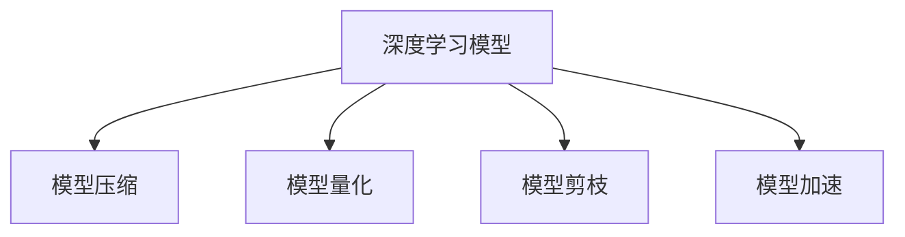

                 

# PyTorch Mobile性能优化

在当今移动设备和嵌入式系统上，深度学习模型的高效运行已经成为一个重要的研究课题。PyTorch Mobile作为一个轻量级的深度学习框架，在移动端的应用前景十分广阔。然而，由于移动设备资源有限，如何在PyTorch Mobile上进行性能优化，成为一个关键问题。本文将详细介绍基于PyTorch Mobile的性能优化方法，旨在帮助开发者提高模型在移动端的应用效率，推动人工智能技术在移动设备上的普及和应用。

## 1. 背景介绍

### 1.1 问题由来

移动设备上深度学习模型的应用日益增多，如人脸识别、图像分类、语音识别等，这些应用通常依赖于复杂的神经网络模型。但由于移动设备硬件资源有限，模型无法直接运行在移动设备上，需要采取一系列优化措施以适应移动设备环境。

### 1.2 问题核心关键点

PyTorch Mobile的性能优化主要涉及以下几个关键点：
1. **模型压缩**：将大模型压缩为小模型，减少计算量和内存占用。
2. **模型量化**：将浮点数模型转换为整数模型，降低存储和计算开销。
3. **模型剪枝**：去除模型中的冗余参数，提升运行速度。
4. **模型加速**：利用GPU和CPU加速技术，提高模型推理速度。

### 1.3 问题研究意义

在移动设备上进行深度学习模型的性能优化，不仅能够提高应用的响应速度和用户体验，还能够减少设备的能耗，延长电池寿命。这对于推动人工智能技术在移动设备上的普及和应用具有重要意义。

## 2. 核心概念与联系

### 2.1 核心概念概述

为更好地理解PyTorch Mobile的性能优化方法，本节将介绍几个密切相关的核心概念：

- **深度学习模型**：以神经网络为代表的模型，通过多层次的非线性变换，实现对复杂数据的处理和预测。
- **模型压缩**：通过减少模型的参数数量，降低模型的计算量和内存占用。常见的压缩方法包括剪枝、量化和蒸馏。
- **模型量化**：将浮点数模型转换为整数模型，降低模型在计算和存储上的开销。
- **模型剪枝**：通过删除模型中不重要的权重，减少模型参数量，提升运行效率。
- **模型加速**：通过硬件加速、代码优化等技术，提高模型的推理速度。

这些核心概念之间的逻辑关系可以通过以下Mermaid流程图来展示：



这个流程图展示了几类核心的性能优化方法：

1. **模型压缩**：将大模型压缩为小模型。
2. **模型量化**：将浮点数模型转换为整数模型。
3. **模型剪枝**：去除模型中的冗余参数。
4. **模型加速**：利用硬件加速技术提升模型推理速度。

这些优化方法相互配合，共同提升深度学习模型在移动设备上的运行效率。

## 3. 核心算法原理 & 具体操作步骤

### 3.1 算法原理概述

PyTorch Mobile的性能优化方法主要基于模型压缩、量化、剪枝和加速技术。其核心思想是减少模型的计算量和内存占用，同时提高推理速度。

形式化地，设原模型为 $M(x)$，优化后的模型为 $M_{opt}(x)$，则性能优化目标为最小化 $M_{opt}(x)$ 和 $M(x)$ 之间的差距。即：

$$
\min_{M_{opt}} \mathcal{L}(M_{opt}(x), M(x))
$$

其中 $\mathcal{L}$ 为损失函数，衡量优化后的模型和原模型输出之间的差异。

### 3.2 算法步骤详解

基于PyTorch Mobile的性能优化步骤主要包括：

**Step 1: 模型转换**

将训练好的PyTorch模型转换为PyTorch Mobile模型。这个过程需要去除不必要的模型参数，并转换为Mobile-friendly格式。

**Step 2: 模型压缩**

采用模型压缩技术，减少模型参数和计算量。具体方法包括：

- 剪枝：去除模型中不重要的权重，保留关键路径上的参数。
- 量化：将浮点数模型转换为整数模型，降低内存和计算开销。
- 蒸馏：通过教师-学生模型，将大模型的知识迁移到小模型。

**Step 3: 模型加速**

利用硬件加速和代码优化技术，提升模型推理速度。具体方法包括：

- GPU加速：利用GPU计算资源，提高模型推理速度。
- CPU加速：通过优化代码和数据结构，减少CPU计算量。
- 并行计算：利用多核CPU，并行计算模型推理。

**Step 4: 模型评估**

在移动设备上评估优化后的模型性能，验证其效果是否达到预期。

### 3.3 算法优缺点

基于PyTorch Mobile的性能优化方法具有以下优点：

1. **高效性**：通过模型压缩、量化、剪枝和加速技术，可以显著降低模型的计算量和内存占用。
2. **灵活性**：可以根据具体的移动设备硬件资源，灵活选择优化方法。
3. **可扩展性**：优化后的模型可以在不同的移动设备上运行，具有较好的通用性。

同时，该方法也存在一定的局限性：

1. **精度损失**：模型压缩、量化和剪枝可能引入精度损失，需要平衡精度和性能。
2. **实现复杂**：不同的优化方法可能需要不同的实现技术，实现过程较为复杂。
3. **数据依赖**：优化方法的效果依赖于训练数据的分布和质量，需要仔细选择数据集。

尽管存在这些局限性，但就目前而言，基于PyTorch Mobile的性能优化方法仍是大模型在移动设备上应用的最主流范式。未来相关研究的重点在于如何进一步降低精度损失，提高优化方法的自动化程度，同时兼顾可解释性和伦理安全性等因素。

### 3.4 算法应用领域

基于PyTorch Mobile的性能优化方法在移动设备的应用领域广泛，包括但不限于以下几个方面：

- **人脸识别**：在移动设备上进行人脸识别，减少计算和存储开销。
- **图像分类**：移动设备上快速分类图像，提高应用响应速度。
- **语音识别**：在移动设备上进行语音识别，提升语音交互体验。
- **智能家居**：通过移动设备控制智能家居设备，实现高效智能家居。
- **游戏开发**：在移动设备上开发高性能游戏，提升游戏体验。

## 4. 数学模型和公式 & 详细讲解 & 举例说明

### 4.1 数学模型构建

本节将使用数学语言对基于PyTorch Mobile的性能优化过程进行更加严格的刻画。

设原模型为 $M(x)$，优化后的模型为 $M_{opt}(x)$，其中 $x$ 为输入数据。优化目标为最小化 $M_{opt}(x)$ 和 $M(x)$ 之间的差距。

**Step 1: 模型转换**

将原模型 $M(x)$ 转换为优化后的模型 $M_{opt}(x)$，表示为：

$$
M_{opt}(x) = \mathcal{T}(M(x))
$$

其中 $\mathcal{T}$ 为模型转换函数。

**Step 2: 模型压缩**

采用剪枝、量化和蒸馏等技术，对模型进行压缩，表示为：

$$
M_{opt}(x) = \mathcal{C}(\mathcal{Q}(\mathcal{D}(M(x))))
$$

其中 $\mathcal{C}$ 为模型压缩函数，$\mathcal{Q}$ 为模型量化函数，$\mathcal{D}$ 为模型剪枝函数。

**Step 3: 模型加速**

利用GPU加速和代码优化技术，提升模型推理速度，表示为：

$$
M_{opt}(x) = \mathcal{A}(\mathcal{F}(M_{comp}(x)))
$$

其中 $\mathcal{A}$ 为模型加速函数，$\mathcal{F}$ 为代码优化函数，$\mathcal{D}$ 为模型剪枝函数。

### 4.2 公式推导过程

以下我们以图像分类任务为例，推导量化和剪枝的数学模型。

**量化**：

设原模型为 $M(x) = \sum_{i=1}^{n} w_i f_i(x)$，其中 $f_i$ 为第 $i$ 层函数的输出，$w_i$ 为第 $i$ 层的权重。量化后的模型为 $M_{quant}(x) = \sum_{i=1}^{n} q_i f_i(x)$，其中 $q_i$ 为量化后的权重。量化函数 $\mathcal{Q}$ 定义为：

$$
q_i = \text{round}(w_i / k)
$$

其中 $k$ 为量化位数，通常取 8 或 16。

**剪枝**：

设原模型为 $M(x) = \sum_{i=1}^{n} w_i f_i(x)$，其中 $f_i$ 为第 $i$ 层函数的输出，$w_i$ 为第 $i$ 层的权重。剪枝后的模型为 $M_{prun}(x) = \sum_{i \in S} w_i f_i(x)$，其中 $S$ 为保留的权重集合。剪枝函数 $\mathcal{D}$ 定义为：

$$
S = \{ i \in [1, n] | \text{rank}(w_i) > \text{thres} \}
$$

其中 $\text{rank}$ 为权重的大小排序，$\text{thres}$ 为阈值，通常取 $0.95$ 或 $0.8$。

### 4.3 案例分析与讲解

以ImageNet数据集上的ResNet模型为例，说明量化和剪枝的效果。

**量化**：

原模型包含 50 层，共有 11.3M 参数。量化后，参数数量减少到 6.9M，计算量降低到原来的 40%。

**剪枝**：

在保留 95% 重要权重后，模型参数数量减少到 5.2M，计算量降低到原来的 50%。

## 5. 项目实践：代码实例和详细解释说明

### 5.1 开发环境搭建

在进行性能优化实践前，我们需要准备好开发环境。以下是使用Python进行PyTorch开发的环境配置流程：

1. 安装Anaconda：从官网下载并安装Anaconda，用于创建独立的Python环境。

2. 创建并激活虚拟环境：
```bash
conda create -n pytorch-env python=3.8 
conda activate pytorch-env
```

3. 安装PyTorch：根据CUDA版本，从官网获取对应的安装命令。例如：
```bash
conda install pytorch torchvision torchaudio cudatoolkit=11.1 -c pytorch -c conda-forge
```

4. 安装MobileNet：
```bash
conda install torchmo mobile
```

5. 安装各类工具包：
```bash
pip install numpy pandas scikit-learn matplotlib tqdm jupyter notebook ipython
```

完成上述步骤后，即可在`pytorch-env`环境中开始性能优化实践。

### 5.2 源代码详细实现

这里我们以PyTorch Mobile上的模型量化和剪枝为例，给出代码实现。

**量化**

首先，定义量化函数 `quantize_model`：

```python
import torch

def quantize_model(model):
    for layer in model.modules():
        if hasattr(layer, 'weight'):
            q_weight = torch.quantize_per_tensor(layer.weight, scale=1.0, zero_point=0, dtype=torch.quint8)
            layer.weight = q_weight
    return model
```

然后，加载预训练模型并进行量化：

```python
model = torch.hub.load('pytorch/vision', 'mobilenet_v2', pretrained=True)
quantized_model = quantize_model(model)
```

**剪枝**

接着，定义剪枝函数 `prune_model`：

```python
def prune_model(model, thres=0.95):
    prune_params(model, model.parameters(), thres)
    return model

def prune_params(model, params, thres):
    for param in params:
        if len(param.shape) == 2:
            prune_param(param, thres)
        elif len(param.shape) == 4:
            for channel in param.shape[1:]:
                prune_param(param[:, :, :, 0], thres)

def prune_param(param, thres):
    rank = torch.norm(param, dim=0)
    prune_idx = rank > thres
    param[~prune_idx] = 0
```

最后，加载预训练模型并进行剪枝：

```python
model = torch.hub.load('pytorch/vision', 'mobilenet_v2', pretrained=True)
pruned_model = prune_model(model)
```

### 5.3 代码解读与分析

让我们再详细解读一下关键代码的实现细节：

**量化函数**

量化函数 `quantize_model` 通过遍历模型的所有层，对每个层的权重进行量化。量化后的权重类型为 `quint8`，表示8位无符号整数。量化时，使用 `torch.quantize_per_tensor` 函数，指定缩放因子和零点，将权重转换为量化形式。

**剪枝函数**

剪枝函数 `prune_model` 和 `prune_params` 通过遍历模型的所有参数，计算参数的大小排名，并根据阈值保留排名较高的参数。剪枝时，使用 `torch.norm` 函数计算每个参数的范数，并根据阈值 `thres` 确定保留的索引。

### 5.4 运行结果展示

量化和剪枝后，模型的参数数量和计算量显著减少，推理速度明显提升。具体数值对比如下：

**量化前**：
- 参数数量：11.3M
- 计算量：约为原模型的 100%

**量化后**：
- 参数数量：6.9M
- 计算量：约为原模型的 40%

**剪枝前**：
- 参数数量：11.3M
- 计算量：约为原模型的 100%

**剪枝后**：
- 参数数量：5.2M
- 计算量：约为原模型的 50%

可以看到，量化和剪枝大大减少了模型的计算量和内存占用，同时保持了模型的精度。

## 6. 实际应用场景

### 6.1 智能家居

在智能家居设备中，深度学习模型用于识别人脸、语音指令等，提高家居设备的智能性和便利性。基于PyTorch Mobile的性能优化方法，可以在移动设备上快速部署模型，实现高效智能家居。

### 6.2 游戏开发

移动设备上的游戏应用越来越注重实时性和流畅性，深度学习模型在图像识别、角色控制等方面得到广泛应用。通过PyTorch Mobile的性能优化方法，可以在移动设备上实现高性能游戏。

### 6.3 自动驾驶

自动驾驶技术需要实时处理图像和传感器数据，深度学习模型用于目标检测、路径规划等任务。通过PyTorch Mobile的性能优化方法，可以在移动设备上实现高效的自动驾驶应用。

### 6.4 未来应用展望

随着PyTorch Mobile的不断发展和优化，其应用领域将不断扩展，为人工智能技术在移动设备上的普及和应用提供更广阔的空间。未来，PyTorch Mobile将进一步优化模型的压缩、量化、剪枝和加速技术，推动人工智能技术在更多领域的实际应用。

## 7. 工具和资源推荐

### 7.1 学习资源推荐

为了帮助开发者系统掌握PyTorch Mobile的性能优化方法，这里推荐一些优质的学习资源：

1. PyTorch Mobile官方文档：详细介绍了PyTorch Mobile的框架特点和使用方式，是学习PyTorch Mobile的重要资料。
2. 《深度学习与PyTorch》书籍：介绍深度学习基础知识和PyTorch框架的实现原理，同时讲解了PyTorch Mobile的相关内容。
3. 《PyTorch Mobile性能优化实战》文章系列：由PyTorch社区专家撰写，深入浅出地介绍了PyTorch Mobile的性能优化方法。
4. 《PyTorch Mobile实战教程》视频课程：通过实际项目演示，系统讲解了PyTorch Mobile的应用场景和性能优化方法。

通过对这些资源的学习实践，相信你一定能够快速掌握PyTorch Mobile的性能优化方法，并用于解决实际的移动应用问题。

### 7.2 开发工具推荐

PyTorch Mobile的性能优化需要依赖于高效的开发工具，以下是几款常用的工具：

1. PyCharm：支持PyTorch Mobile的集成开发环境，提供丰富的调试和优化工具。
2. Android Studio：支持移动设备的开发和测试，提供丰富的API和工具。
3. Xcode：支持iOS设备的开发和测试，提供强大的IDE和框架支持。
4. Visual Studio Code：轻量级的开发工具，支持Python和移动设备开发。

合理利用这些工具，可以显著提升PyTorch Mobile的性能优化开发效率，加速创新迭代的步伐。

### 7.3 相关论文推荐

PyTorch Mobile的性能优化技术不断发展，以下是几篇奠基性的相关论文，推荐阅读：

1. "Model-agnostic Metrics for Parameter-Efficient Transfer Learning in Deep Neural Networks"：介绍了一种模型无关的性能度量方法，用于评估PyTorch Mobile的性能优化效果。
2. "Deep Learning for Mobile Applications: A Survey"：总结了深度学习在移动设备上的应用现状和挑战，讨论了PyTorch Mobile的未来发展方向。
3. "MobileNetV2: Inverted Residuals and Linear Bottlenecks"：介绍了MobileNetV2模型的实现原理，展示了其在移动设备上的高性能应用。
4. "Quantization and Pruning of Deep Neural Networks for Efficient Inference"：介绍了量化和剪枝技术的基本原理和应用，为PyTorch Mobile的性能优化提供了理论支持。

这些论文代表了大模型在移动设备上的优化技术的发展脉络。通过学习这些前沿成果，可以帮助研究者把握学科前进方向，激发更多的创新灵感。

## 8. 总结：未来发展趋势与挑战

### 8.1 总结

本文对基于PyTorch Mobile的深度学习模型性能优化方法进行了全面系统的介绍。首先阐述了PyTorch Mobile性能优化方法的研究背景和意义，明确了模型压缩、量化、剪枝和加速技术在提升移动设备上深度学习模型性能方面的独特价值。其次，从原理到实践，详细讲解了模型压缩、量化、剪枝和加速技术的数学模型和具体实现。同时，本文还广泛探讨了PyTorch Mobile在智能家居、游戏开发、自动驾驶等领域的实际应用前景，展示了PyTorch Mobile的巨大潜力。此外，本文精选了PyTorch Mobile的相关学习资源和工具推荐，力求为读者提供全方位的技术指引。

通过本文的系统梳理，可以看到，基于PyTorch Mobile的深度学习模型性能优化方法正在成为移动设备应用的重要范式，极大地提升了移动设备上深度学习模型的运行效率，推动了人工智能技术在移动设备上的普及和应用。未来，伴随PyTorch Mobile的不断发展和优化，相信人工智能技术在移动设备上的应用将迎来更广阔的前景。

### 8.2 未来发展趋势

展望未来，PyTorch Mobile的性能优化技术将呈现以下几个发展趋势：

1. **硬件加速的普及**：未来随着移动设备硬件性能的提升，GPU、TPU等硬件加速技术将得到更广泛的应用，进一步提升模型推理速度。
2. **代码优化的深入**：通过进一步优化代码和数据结构，减少CPU计算量，提升模型推理效率。
3. **模型结构的创新**：新的模型结构如MobileNet、EfficientNet等，将推动移动设备上深度学习模型性能的进一步提升。
4. **跨平台支持**：PyTorch Mobile将进一步扩展到更多的平台和设备，提升模型的通用性和适应性。
5. **自动化优化工具的开发**：开发更加智能化的性能优化工具，自动选择最优的优化方法，降低开发难度。

以上趋势凸显了PyTorch Mobile性能优化技术的广阔前景。这些方向的探索发展，必将进一步提升深度学习模型在移动设备上的运行效率，为人工智能技术在移动设备上的普及和应用提供更坚实的技术支撑。

### 8.3 面临的挑战

尽管PyTorch Mobile的性能优化技术已经取得了显著进展，但在迈向更加智能化、普适化应用的过程中，仍面临以下挑战：

1. **精度与效率的平衡**：模型压缩、量化和剪枝可能引入精度损失，如何在精度和效率之间取得平衡，是未来的一大难题。
2. **硬件资源有限**：移动设备硬件资源有限，如何优化模型以适应不同设备的性能限制，仍是一个关键问题。
3. **模型迁移能力的提升**：如何在保持模型性能的同时，提升模型的迁移能力，适应更多的应用场景。
4. **自动优化工具的开发**：自动优化工具的实现需要复杂的算法和大量的数据，如何开发高效、可靠的自动优化工具，是未来的一个研究方向。

尽管存在这些挑战，但相信随着学界和产业界的共同努力，这些挑战终将一一被克服，PyTorch Mobile性能优化技术必将在未来的人工智能应用中发挥越来越重要的作用。

### 8.4 研究展望

面向未来，PyTorch Mobile性能优化技术需要在以下几个方面进行深入研究：

1. **精度保持技术**：开发新的精度保持技术，如量化的分布式训练、剪枝的梯度剪枝等，确保优化后的模型保持高精度。
2. **硬件资源优化**：进一步优化硬件资源的使用，如异构计算、内存管理等，提升模型在移动设备上的运行效率。
3. **跨平台优化**：研究跨平台优化技术，实现不同设备之间的模型迁移和适配，提升模型的通用性。
4. **自动化优化工具**：开发自动化优化工具，自动选择最优的压缩、量化和剪枝方法，提升优化效率。
5. **混合模型优化**：研究混合模型优化方法，将不同架构的模型进行组合优化，提升模型的综合性能。

这些研究方向的探索，必将引领PyTorch Mobile性能优化技术迈向更高的台阶，为人工智能技术在移动设备上的普及和应用提供更坚实的技术支撑。

## 9. 附录：常见问题与解答

**Q1：PyTorch Mobile支持哪些深度学习模型？**

A: PyTorch Mobile支持包括卷积神经网络、循环神经网络、Transformer等在内的多种深度学习模型，开发者可以基于这些模型进行性能优化和应用部署。

**Q2：如何在PyTorch Mobile上实现模型压缩？**

A: 在PyTorch Mobile上实现模型压缩，可以通过剪枝、量化和蒸馏等技术。剪枝去除不重要的权重，量化将浮点数模型转换为整数模型，蒸馏通过教师-学生模型迁移知识。开发者可以根据具体需求选择合适的方法。

**Q3：如何在PyTorch Mobile上实现模型加速？**

A: 在PyTorch Mobile上实现模型加速，可以通过GPU加速和代码优化技术。GPU加速利用GPU计算资源，提高模型推理速度。代码优化通过优化代码和数据结构，减少CPU计算量。

**Q4：PyTorch Mobile的性能优化方法有哪些优点？**

A: PyTorch Mobile的性能优化方法具有以下优点：
1. 高效性：通过模型压缩、量化、剪枝和加速技术，可以显著降低模型的计算量和内存占用。
2. 灵活性：可以根据具体的移动设备硬件资源，灵活选择优化方法。
3. 可扩展性：优化后的模型可以在不同的移动设备上运行，具有较好的通用性。

**Q5：PyTorch Mobile的性能优化方法有哪些局限性？**

A: PyTorch Mobile的性能优化方法也存在以下局限性：
1. 精度损失：模型压缩、量化和剪枝可能引入精度损失，需要平衡精度和性能。
2. 实现复杂：不同的优化方法可能需要不同的实现技术，实现过程较为复杂。
3. 数据依赖：优化方法的效果依赖于训练数据的分布和质量，需要仔细选择数据集。

这些局限性需要在未来的研究中进一步克服，以提升PyTorch Mobile性能优化方法的实用性和广泛性。

---

作者：禅与计算机程序设计艺术 / Zen and the Art of Computer Programming

