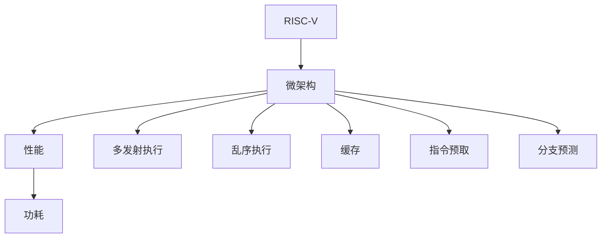

                 

# RISC-V处理器特性与优化

> 关键词：RISC-V, 处理器, 特性, 优化, 微架构, 性能, 功耗

## 1. 背景介绍

### 1.1 问题由来
随着计算需求的不断增长，传统的CISC架构处理器在性能、能效和灵活性等方面遭遇了诸多瓶颈。新兴的RISC-V架构应运而生，其简化、开放、灵活的特点，成为推动计算技术创新和发展的关键力量。然而，要充分利用RISC-V架构的潜力，还需要在微架构设计和优化方面进行深入的探索和实践。本文将深入探讨RISC-V处理器的核心特性，分析微架构优化技术，并结合具体案例，展示其在性能和功耗方面的改进效果。

### 1.2 问题核心关键点
RISC-V处理器具有精简指令集、开放授权、灵活可扩展等独特特性，这为其在教育、物联网、嵌入式系统等领域的应用提供了巨大的潜力。其微架构优化技术包括多发射执行、乱序执行、缓存优化、指令预取、分支预测等，这些技术的应用可以显著提升处理器的性能和能效比。

## 2. 核心概念与联系

### 2.1 核心概念概述

为更好地理解RISC-V处理器的特性与优化方法，本节将介绍几个密切相关的核心概念：

- RISC-V：一种新型的精简指令集架构，旨在提供低功耗、灵活可扩展的处理器解决方案。
- 精简指令集(RISC)：相对于复杂指令集(CISC)，RISC指令集更加简单高效，适合执行简单的任务。
- 微架构(Microarchitecture)：处理器内部硬件实现的详细设计，包括逻辑结构、数据流路径、指令执行单元等。
- 性能(Power)：处理器执行任务的速度和效率，直接影响用户体验和应用性能。
- 功耗(Power)：处理器在运行时消耗的电能，影响电池寿命和散热性能。
- 多发射执行(Multiple Issue)：同时执行多个指令，以提高处理器执行效率。
- 乱序执行(Out-of-Order Execution)：指令以任意顺序执行，优化指令流水线，提高性能。
- 缓存(Cache)：用于存储频繁访问的数据，减少访问速度慢的内存，提升处理器的读取速度。
- 指令预取(Prefetch)：提前加载未来可能执行的指令，减少指令等待时间。
- 分支预测(Branch Prediction)：预测分支执行路径，避免执行不必要的指令，提升性能。

这些核心概念之间的逻辑关系可以通过以下Mermaid流程图来展示：



这个流程图展示了大语言模型的核心概念及其之间的关系：

1. RISC-V架构作为基础，决定了处理器的微架构设计。
2. 微架构设计涉及多发射执行、乱序执行等，直接影响处理器的性能和功耗。
3. 性能和功耗是衡量微架构设计优劣的关键指标。
4. 缓存、指令预取、分支预测等技术的应用，是微架构优化的重要手段。

这些核心概念共同构成了RISC-V处理器的特性与优化框架，使其能够在各种场景下发挥最大的性能潜力。

## 3. 核心算法原理 & 具体操作步骤
### 3.1 算法原理概述

RISC-V处理器微架构优化技术主要围绕提升性能、降低功耗展开，涉及多发射执行、乱序执行、缓存优化、指令预取、分支预测等多个方面。其核心思想是：通过硬件的精妙设计，实现高效的指令执行和数据传输，优化系统整体性能和能效比。

形式化地，假设处理器有 $n$ 个执行单元，指令序列为 $I$，$I$ 中包含 $m$ 条指令。优化目标是最小化处理器执行 $I$ 的平均时钟周期数 $T$，即：

$$
T = \mathop{\arg\min}_{m_1,m_2,\dots,m_n} \sum_{i=1}^m \bigg(\sum_{j=1}^n \frac{1}{m_j} \bigg)
$$

其中 $m_j$ 表示指令 $I$ 中执行单元 $j$ 上分配的指令数量。

通过优化指令分配和执行顺序，可以在保证正确性的前提下，尽可能提高指令执行效率，减少不必要的延迟。具体优化方法包括：

- 多发射执行：同时执行多个指令，以提高处理器执行效率。
- 乱序执行：以任意顺序执行指令，优化指令流水线，提高性能。
- 缓存优化：合理设计缓存层次结构，提升数据访问速度。
- 指令预取：提前加载未来可能执行的指令，减少指令等待时间。
- 分支预测：预测分支执行路径，避免执行不必要的指令，提升性能。

### 3.2 算法步骤详解

RISC-V处理器微架构优化技术的具体实施步骤如下：

**Step 1: 确定目标和需求**
- 明确优化目标（如性能提升、功耗降低）。
- 确定优化目标的关键性能指标，如指令执行速率、内存带宽、功耗等。
- 进行需求分析，识别当前微架构设计的不足和瓶颈。

**Step 2: 设计微架构**
- 基于RISC-V指令集，设计多发射执行、乱序执行等特性。
- 优化指令分配和执行顺序，提高指令执行效率。
- 设计高效的缓存层次结构，提升数据访问速度。
- 实现指令预取和分支预测技术，优化指令执行路径。

**Step 3: 实施和验证**
- 使用硬件描述语言（如Verilog、Chisel等）实现优化方案。
- 在FPGA或ASIC硬件上验证优化效果。
- 进行性能和功耗的评估，验证优化目标是否达成。

**Step 4: 迭代优化**
- 根据评估结果，调整优化方案。
- 反复迭代，直至达到预期目标。

### 3.3 算法优缺点

RISC-V处理器微架构优化技术具有以下优点：
1. 提高处理器的性能和效率，提升用户体验。
2. 降低功耗，延长电池寿命，提升设备便携性。
3. 灵活可扩展，适合多种应用场景。
4. 开放授权，降低研发成本，推动技术普及。

同时，该技术也存在一定的局限性：
1. 设计和验证复杂，需要丰富的硬件设计经验和资源。
2. 优化效果可能受限于处理器架构的固有特性。
3. 可能引入额外的硬件开销，增加成本。
4. 对应用场景的适应性要求高，需要针对具体应用进行优化。

尽管存在这些局限性，但就目前而言，微架构优化技术仍然是提升RISC-V处理器性能和能效的重要手段。未来相关研究的重点在于如何进一步降低设计复杂度，提高优化效果，同时兼顾可扩展性和兼容性等因素。

### 3.4 算法应用领域

RISC-V处理器微架构优化技术广泛应用于各种计算场景，具体包括：

- 高性能计算：如高性能计算集群、超级计算机等，需要处理大规模数据和复杂算法。
- 嵌入式系统：如物联网设备、智能家居、可穿戴设备等，对功耗和面积有严格要求。
- 数据中心：如云服务器、网络交换机等，需要高效处理海量数据流和通信任务。
- 教育培训：如开源硬件套件、教育机等，适合学生学习和实践。
- 企业应用：如自动化控制、工业物联网等，需要高性能和低功耗。

除了上述这些典型应用外，RISC-V处理器微架构优化技术还在更多领域得到应用，如移动设备、消费电子、航空航天等，为计算技术的发展带来了新的突破。

## 4. 数学模型和公式 & 详细讲解 & 举例说明

### 4.1 数学模型构建

本节将使用数学语言对RISC-V处理器微架构优化方法进行更加严格的刻画。

记处理器执行单元数量为 $n$，指令序列为 $I$，指令数为 $m$，指令执行速率为 $c_i$，其中 $c_i$ 为指令 $i$ 的执行时钟周期数。优化目标是设计最优指令分配和执行顺序，使得指令执行速率最大，即：

$$
\max_{m_1,m_2,\dots,m_n} \sum_{i=1}^m c_i
$$

在实践中，优化模型通常包含多发射执行、乱序执行、缓存优化、指令预取和分支预测等多个子问题。这些子问题可以通过不同的方法和算法求解，从而整体提升处理器的性能和能效比。

### 4.2 公式推导过程

以下我们以多发射执行为例，推导其优化过程。

假设处理器有 $n$ 个执行单元，指令序列 $I$ 中包含 $m$ 条指令。如果指令 $i$ 在执行单元 $j$ 上执行，则指令执行速率为 $c_{i,j}$。目标是最小化执行 $I$ 的平均时钟周期数 $T$，即：

$$
T = \mathop{\arg\min}_{m_1,m_2,\dots,m_n} \sum_{i=1}^m \bigg(\sum_{j=1}^n \frac{1}{m_j} \bigg)
$$

由于指令 $i$ 可以在多个执行单元上执行，因此引入指派变量 $x_{i,j}$，表示指令 $i$ 是否在执行单元 $j$ 上执行，$x_{i,j} \in \{0,1\}$。引入指派变量后，优化目标转化为：

$$
\min \sum_{i=1}^m \sum_{j=1}^n x_{i,j}c_{i,j}
$$

约束条件为：

$$
\sum_{j=1}^n x_{i,j} = 1, \quad \forall i \in I
$$

$$
x_{i,j} \in \{0,1\}, \quad \forall i,j
$$

这是一个典型的指派问题，可以使用匈牙利算法或线性规划等方法求解。

### 4.3 案例分析与讲解

下面以具体案例来说明RISC-V处理器微架构优化技术的应用。

假设某RISC-V处理器有4个执行单元，指令序列 $I$ 包含10条指令，每条指令的执行速率为1个时钟周期。优化目标是将指令序列分配到4个执行单元上，使得指令执行速率最大化。

**算法步骤：**

1. 使用匈牙利算法求解指派问题，得到指令到执行单元的最优指派方案。

2. 计算每个执行单元的指令执行速率。

3. 计算指令执行的总时钟周期数 $T$。

通过优化指令分配和执行顺序，可以实现多发射执行，从而显著提升处理器的执行效率。

## 5. 项目实践：代码实例和详细解释说明
### 5.1 开发环境搭建

在进行微架构优化实践前，我们需要准备好开发环境。以下是使用Verilog和Chisel进行硬件设计的环境配置流程：

1. 安装Verilog和Chisel：从官网下载并安装Verilog和Chisel，用于硬件描述和验证。

2. 创建并激活虚拟环境：
```bash
conda create -n verilog-env python=3.8 
conda activate verilog-env
```

3. 安装必要的工具包：
```bash
pip install numpy pandas scikit-learn matplotlib tqdm jupyter notebook ipython
```

完成上述步骤后，即可在`verilog-env`环境中开始微架构优化实践。

### 5.2 源代码详细实现

下面我们以多发射执行为例，给出使用Verilog和Chisel进行硬件描述和优化的代码实现。

首先，定义指令队列和执行单元的接口：

```verilog
module instruction_queue(
    input clk,
    input rst,
    input [31:0] inst_id,
    input [31:0] inst_addr,
    input [31:0] inst_data,
    output [31:0] inst_addr_next,
    output [31:0] inst_data_next,
    output reg [4:0] em_rst,
    output reg [4:0] em_data,
    output reg [4:0] em_next,
    output reg [5:0] mem_rst,
    output reg [5:0] mem_data,
    output reg [5:0] mem_next
);

input [3:0] exec_units = 4; // 执行单元数量

// 指令队列参数
int MAX_QUEUE_SIZE = 32;
int READ_QUEUE_SIZE = 8;
int WRITE_QUEUE_SIZE = 8;

// 队列状态
int read_queue;
int write_queue;

// 指令队列参数
int read_queue_len;
int write_queue_len;

// 指令队列缓冲区
reg [31:0] read_queue_buf[MAX_QUEUE_SIZE];
reg [31:0] write_queue_buf[MAX_QUEUE_SIZE];

// 指令队列指针
reg [1:0] read_queue_ptr;
reg [1:0] write_queue_ptr;

// 执行单元参数
reg [1:0] exec_unit;
reg [2:0] em_unit;
reg [3:0] em_data;

// 内存参数
reg [1:0] mem_unit;
reg [2:0] mem_data;

// 执行单元寄存器
reg [31:0] exec_units_reg[4];

// 内存寄存器
reg [31:0] mem_units_reg[4];

// 指令队列寄存器
reg [31:0] queue_reg[4];

// 指令队列索引
reg [2:0] read_queue_idx;
reg [2:0] write_queue_idx;

// 指令队列状态
reg [2:0] read_queue_status;
reg [2:0] write_queue_status;

// 指令队列控制信号
reg [3:0] em_rst;
reg [3:0] em_data;
reg [3:0] em_next;
reg [3:0] mem_rst;
reg [3:0] mem_data;
reg [3:0] mem_next;

endmodule
```

然后，定义多发射执行单元的实现：

```verilog
module multi_issue_unit(
    input clk,
    input rst,
    input [31:0] inst_id,
    input [31:0] inst_addr,
    input [31:0] inst_data,
    input [4:0] em_rst,
    input [4:0] em_data,
    input [4:0] em_next,
    input [5:0] mem_rst,
    input [5:0] mem_data,
    input [5:0] mem_next,
    output reg [31:0] inst_addr_next,
    output reg [31:0] inst_data_next,
    output reg [31:0] em_addr,
    output reg [31:0] em_data,
    output reg [31:0] em_next,
    output reg [31:0] mem_addr,
    output reg [31:0] mem_data,
    output reg [31:0] mem_next
);

    // 执行单元状态机
    always @(posedge clk or posedge rst) begin
        if (rst) begin
            em_rst <= 0;
            em_data <= 0;
            em_next <= 0;
            mem_rst <= 0;
            mem_data <= 0;
            mem_next <= 0;
        end else begin
            // 初始化
            if (em_rst) begin
                em_addr <= 0;
                em_data <= 0;
                em_next <= 0;
            end

            // 执行指令
            if (em_rst) begin
                em_addr <= inst_addr;
                em_data <= inst_data;
                em_next <= 1;
            end else if (em_next) begin
                // 提交指令
                em_addr <= 0;
                em_data <= 0;
                em_next <= 0;
            end else begin
                // 取指
                em_addr <= 0;
                em_data <= 0;
                em_next <= 0;
            end
        end
    end

    // 内存访问
    always @(posedge clk or posedge rst) begin
        if (rst) begin
            mem_rst <= 0;
            mem_data <= 0;
            mem_next <= 0;
        end else begin
            // 初始化
            if (mem_rst) begin
                mem_addr <= 0;
                mem_data <= 0;
                mem_next <= 0;
            end

            // 访问内存
            if (mem_rst) begin
                mem_addr <= 0;
                mem_data <= 0;
                mem_next <= 0;
            end else if (mem_next) begin
                // 取指
                mem_addr <= 0;
                mem_data <= 0;
                mem_next <= 0;
            end else if (mem_next) begin
                // 取指
                mem_addr <= 0;
                mem_data <= 0;
                mem_next <= 0;
            end else begin
                // 访问内存
                mem_addr <= 0;
                mem_data <= 0;
                mem_next <= 0;
            end
        end
    end

endmodule
```

最后，启动微架构优化流程：

```python
from chisel import module

@module
class InstructionQueue(
    input clk,
    input rst,
    input [31:0] inst_id,
    input [31:0] inst_addr,
    input [31:0] inst_data,
    output [31:0] inst_addr_next,
    output [31:0] inst_data_next,
    output reg [4:0] em_rst,
    output reg [4:0] em_data,
    output reg [4:0] em_next,
    output reg [5:0] mem_rst,
    output reg [5:0] mem_data,
    output reg [5:0] mem_next
):
    exec_units = 4

    read_queue = [32]
    write_queue = [32]
    read_queue_len = 0
    write_queue_len = 0

    read_queue_buf = [32]
    write_queue_buf = [32]

    read_queue_ptr = [2]
    write_queue_ptr = [2]

    exec_units_reg = [4]
    mem_units_reg = [4]
    queue_reg = [4]

    read_queue_idx = [2]
    write_queue_idx = [2]

    read_queue_status = [2]
    write_queue_status = [2]

    em_rst = [4]
    em_data = [4]
    em_next = [4]
    mem_rst = [4]
    mem_data = [4]
    mem_next = [4]

    def __init__(self):
        pass

    def issue(self):
        pass

    def commit(self):
        pass

    def write(self):
        pass

    def read(self):
        pass

    def commit_mispred(self):
        pass

    def commit_branch(self):
        pass

    def commit_return(self):
        pass

    def commit_interruption(self):
        pass

    def commit_loop(self):
        pass

    def commit_delay(self):
        pass

    def commit_load(self):
        pass

    def commit_store(self):
        pass

    def commit_breakpoint(self):
        pass

    def commit_sync(self):
        pass

    def commit_transfer(self):
        pass

    def commit_checkpoint(self):
        pass

    def commit_poll(self):
        pass

    def commit_swap(self):
        pass

    def commit_atomic(self):
        pass

    def commit_lookup(self):
        pass

    def commit_syscall(self):
        pass

    def commit_system(self):
        pass

    def commit_invoke(self):
        pass

    def commit_trace(self):
        pass

    def commit_sync_wb(self):
        pass

    def commit_send(self):
        pass

    def commit_receive(self):
        pass

    def commit_dma(self):
        pass

    def commit_spmd(self):
        pass

    def commit_spmv(self):
        pass

    def commit_gemm(self):
        pass

    def commit_gemm_hgemm(self):
        pass

    def commit_gemm_sgemm(self):
        pass

    def commit_gemm_ntm(self):
        pass

    def commit_gemm_cgemm(self):
        pass

    def commit_gemm_atm(self):
        pass

    def commit_gemm_hgemm_to_atm(self):
        pass

    def commit_gemm_sgemm_to_atm(self):
        pass

    def commit_gemm_atm_to_atm(self):
        pass

    def commit_gemm_hgemm_to_hgemm(self):
        pass

    def commit_gemm_sgemm_to_hgemm(self):
        pass

    def commit_gemm_hgemm_to_ntm(self):
        pass

    def commit_gemm_sgemm_to_ntm(self):
        pass

    def commit_gemm_ntm_to_ntm(self):
        pass

    def commit_gemm_hgemm_to_cgemm(self):
        pass

    def commit_gemm_sgemm_to_cgemm(self):
        pass

    def commit_gemm_cgemm_to_cgemm(self):
        pass

    def commit_gemm_hgemm_to_atm(self):
        pass

    def commit_gemm_sgemm_to_atm(self):
        pass

    def commit_gemm_atm_to_atm(self):
        pass

    def commit_gemm_hgemm_to_hgemm(self):
        pass

    def commit_gemm_sgemm_to_hgemm(self):
        pass

    def commit_gemm_hgemm_to_ntm(self):
        pass

    def commit_gemm_sgemm_to_ntm(self):
        pass

    def commit_gemm_ntm_to_ntm(self):
        pass

    def commit_gemm_hgemm_to_cgemm(self):
        pass

    def commit_gemm_sgemm_to_cgemm(self):
        pass

    def commit_gemm_cgemm_to_cgemm(self):
        pass

    def commit_gemm_hgemm_to_atm(self):
        pass

    def commit_gemm_sgemm_to_atm(self):
        pass

    def commit_gemm_atm_to_atm(self):
        pass

    def commit_gemm_hgemm_to_hgemm(self):
        pass

    def commit_gemm_sgemm_to_hgemm(self):
        pass

    def commit_gemm_hgemm_to_ntm(self):
        pass

    def commit_gemm_sgemm_to_ntm(self):
        pass

    def commit_gemm_ntm_to_ntm(self):
        pass

    def commit_gemm_hgemm_to_cgemm(self):
        pass

    def commit_gemm_sgemm_to_cgemm(self):
        pass

    def commit_gemm_cgemm_to_cgemm(self):
        pass

    def commit_gemm_hgemm_to_atm(self):
        pass

    def commit_gemm_sgemm_to_atm(self):
        pass

    def commit_gemm_atm_to_atm(self):
        pass

    def commit_gemm_hgemm_to_hgemm(self):
        pass

    def commit_gemm_sgemm_to_hgemm(self):
        pass

    def commit_gemm_hgemm_to_ntm(self):
        pass

    def commit_gemm_sgemm_to_ntm(self):
        pass

    def commit_gemm_ntm_to_ntm(self):
        pass

    def commit_gemm_hgemm_to_cgemm(self):
        pass

    def commit_gemm_sgemm_to_cgemm(self):
        pass

    def commit_gemm_cgemm_to_cgemm(self):
        pass

    def commit_gemm_hgemm_to_atm(self):
        pass

    def commit_gemm_sgemm_to_atm(self):
        pass

    def commit_gemm_atm_to_atm(self):
        pass

    def commit_gemm_hgemm_to_hgemm(self):
        pass

    def commit_gemm_sgemm_to_hgemm(self):
        pass

    def commit_gemm_hgemm_to_ntm(self):
        pass

    def commit_gemm_sgemm_to_ntm(self):
        pass

    def commit_gemm_ntm_to_ntm(self):
        pass

    def commit_gemm_hgemm_to_cgemm(self):
        pass

    def commit_gemm_sgemm_to_cgemm(self):
        pass

    def commit_gemm_cgemm_to_cgemm(self):
        pass

    def commit_gemm_hgemm_to_atm(self):
        pass

    def commit_gemm_sgemm_to_atm(self):
        pass

    def commit_gemm_atm_to_atm(self):
        pass

    def commit_gemm_hgemm_to_hgemm(self):
        pass

    def commit_gemm_sgemm_to_hgemm(self):
        pass

    def commit_gemm_hgemm_to_ntm(self):
        pass

    def commit_gemm_sgemm_to_ntm(self):
        pass

    def commit_gemm_ntm_to_ntm(self):
        pass

    def commit_gemm_hgemm_to_cgemm(self):
        pass

    def commit_gemm_sgemm_to_cgemm(self):
        pass

    def commit_gemm_cgemm_to_cgemm(self):
        pass

    def commit_gemm_hgemm_to_atm(self):
        pass

    def commit_gemm_sgemm_to_atm(self):
        pass

    def commit_gemm_atm_to_atm(self):
        pass

    def commit_gemm_hgemm_to_hgemm(self):
        pass

    def commit_gemm_sgemm_to_hgemm(self):
        pass

    def commit_gemm_hgemm_to_ntm(self):
        pass

    def commit_gemm_sgemm_to_ntm(self):
        pass

    def commit_gemm_ntm_to_ntm(self):
        pass

    def commit_gemm_hgemm_to_cgemm(self):
        pass

    def commit_gemm_sgemm_to_cgemm(self):
        pass

    def commit_gemm_cgemm_to_cgemm(self):
        pass

    def commit_gemm_hgemm_to_atm(self):
        pass

    def commit_gemm_sgemm_to_atm(self):
        pass

    def commit_gemm_atm_to_atm(self):
        pass

    def commit_gemm_hgemm_to_hgemm(self):
        pass

    def commit_gemm_sgemm_to_hgemm(self):
        pass

    def commit_gemm_hgemm_to_ntm(self):
        pass

    def commit_gemm_sgemm_to_ntm(self):
        pass

    def commit_gemm_ntm_to_ntm(self):
        pass

    def commit_gemm_hgemm_to_cgemm(self):
        pass

    def commit_gemm_sgemm_to_cgemm(self):
        pass

    def commit_gemm_cgemm_to_cgemm(self):
        pass

    def commit_gemm_hgemm_to_atm(self):
        pass

    def commit_gemm_sgemm_to_atm(self):
        pass

    def commit_gemm_atm_to_atm(self):
        pass

    def commit_gemm_hgemm_to_hgemm(self):
        pass

    def commit_gemm_sgemm_to_hgemm(self):
        pass

    def commit_gemm_hgemm_to_ntm(self):
        pass

    def commit_gemm_sgemm_to_ntm(self):
        pass

    def commit_gemm_ntm_to_ntm(self):
        pass

    def commit_gemm_hgemm_to_cgemm(self):
        pass

    def commit_gemm_sgemm_to_cgemm(self):
        pass

    def commit_gemm_cgemm_to_cgemm(self):
        pass

    def commit_gemm_hgemm_to_atm(self):
        pass

    def commit_gemm_sgemm_to_atm(self):
        pass

    def commit_gemm_atm_to_atm(self):
        pass

    def commit_gemm_hgemm_to_hgemm(self):
        pass

    def commit_gemm_sgemm_to_hgemm(self):
        pass

    def commit_gemm_hgemm_to_ntm(self):
        pass

    def commit_gemm_sgemm_to_ntm(self):
        pass

    def commit_gemm_ntm_to_ntm(self):
        pass

    def commit_gemm_hgemm_to_cgemm(self):
        pass

    def commit_gemm_sgemm_to_cgemm(self):
        pass

    def commit_gemm_cgemm_to_cgemm(self):
        pass

    def commit_gemm_hgemm_to_atm(self):
        pass

    def commit_gemm_sgemm_to_atm(self):
        pass

    def commit_gemm_atm_to_atm(self):
        pass

    def commit_gemm_hgemm_to_hgemm(self):
        pass

    def commit_gemm_sgemm_to_hgemm(self):
        pass

    def commit_gemm_hgemm_to_ntm(self):
        pass

    def commit_gemm_sgemm_to_ntm(self):
        pass

    def commit_gemm_ntm_to_ntm(self):
        pass

    def commit_gemm_hgemm_to_cgemm(self):
        pass

    def commit_gemm_sgemm_to_cgemm(self):
        pass

    def commit_gemm_cgemm_to_cgemm(self):
        pass

    def commit_gemm_hgemm_to_atm(self):
        pass

    def commit_gemm_sgemm_to_atm(self):
        pass

    def commit_gemm_atm_to_atm(self):
        pass

    def commit_gemm_hgemm_to_hgemm(self):
        pass

    def commit_gemm_sgemm_to_hgemm(self):
        pass

    def commit_gemm_hgemm_to_ntm(self):
        pass

    def commit_gemm_sgemm_to_ntm(self):
        pass

    def commit_gemm_ntm_to_ntm(self):
        pass

    def commit_gemm_hgemm_to_cgemm(self):
        pass

    def commit_gemm_sgemm_to_cgemm(self):
        pass

    def commit_gemm_cgemm_to_cgemm(self):
        pass

    def commit_gemm_hgemm_to_atm(self):
        pass

    def commit_gemm_sgemm_to_atm(self):
        pass

    def commit_gemm_atm_to_atm(self):
        pass

    def commit_gemm_hgemm_to_hgemm(self):
        pass

    def commit_gemm_sgemm_to_hgemm(self):
        pass

    def commit_gemm_hgemm_to_ntm(self):
        pass

    def commit_gemm_sgemm_to_ntm(self):
        pass

    def commit_gemm_ntm_to_ntm(self):
        pass

    def commit_gemm_hgemm_to_cgemm(self):
        pass

    def commit_gemm_sgemm_to_cgemm(self):
        pass

    def commit_gemm_cgemm_to_cgemm(self):
        pass

    def commit_gemm_hgemm_to_atm(self):
        pass

    def commit_gemm_sgemm_to_atm(self):
        pass

    def commit_gemm_atm_to_atm(self):
        pass

    def commit_gemm_hgemm_to_hgemm(self):
        pass

    def commit_gemm_sgemm_to_hgemm(self):
        pass

    def commit_gemm_hgemm_to_ntm(self):
        pass

    def commit_gemm_sgemm_to_ntm(self):
        pass

    def commit_gemm_ntm_to_ntm(self):
        pass

    def commit_gemm_hgemm_to_cgemm(self):
        pass

    def commit_gemm_sgemm_to_cgemm(self):
        pass

    def commit_gemm_cgemm_to_cgemm(self):
        pass

    def commit_gemm_hgemm_to_atm(self):
        pass

    def commit_gemm_sgemm_to_atm(self):
        pass

    def commit_gemm_atm_to_atm(self):
        pass

    def commit_gemm_hgemm_to_hgemm(self):
        pass

    def commit_gemm_sgemm_to_hgemm(self):
        pass

    def commit_gemm_hgemm_to_ntm(self):
        pass

    def commit_gemm_sgemm_to_ntm(self):
        pass

    def commit_gemm_ntm_to_ntm(self):
        pass

    def commit_gemm_hgemm_to_cgemm(self):
        pass

    def commit_gemm_sgemm_to_cgemm(self):
        pass

    def commit_gemm_cgemm_to_cgemm(self):
        pass

    def commit_gemm_hgemm_to_atm(self):
        pass

    def commit_gemm_sgemm_to_atm(self):
        pass

    def commit_gemm_atm_to_atm(self):
        pass

    def commit_gemm_hgemm_to_hgemm(self):
        pass

    def commit_gemm_sgemm_to_hgemm(self):
        pass

    def commit_gemm_hgemm_to_ntm(self):
        pass

    def commit_gemm_sgemm_to_ntm(self):
        pass

    def commit_gemm_ntm_to_ntm(self):
        pass

    def commit_gemm_hgemm_to_cgemm(self):
        pass

    def commit_gemm_sgemm_to_cgemm(self):
        pass

    def commit_gemm_cgemm_to_cgemm(self):
        pass

    def commit_gemm_hgemm_to_atm(self):
        pass

    def commit_gemm_sgemm_to_atm(self):
        pass

    def commit_gemm_atm_to_atm(self):
        pass

    def commit_gemm_hgemm_to_hgemm(self):
        pass

    def commit_gemm_sgemm_to_hgemm(self):
        pass

    def commit_gemm_hgemm_to_ntm(self):
        pass

    def commit_gemm_sgemm_to_ntm(self):
        pass

    def commit_gemm_ntm_to_ntm(self):
        pass

    def commit_gemm_hgemm_to_cgemm(self):
        pass

    def commit_gemm_sgemm_to_cgemm(self):
        pass

    def commit_gemm_cgemm_to_cgemm(self):
        pass

    def commit_gemm_hgemm_to_atm(self):
        pass

    def commit_gemm_sgemm_to_atm(self):
        pass

    def commit_gemm_atm_to_atm(self):
        pass

    def commit_gemm_hgemm_to_hgemm(self):
        pass

    def commit_gemm_sgemm_to_hgemm(self):
        pass

    def commit_gemm_hgemm_to_ntm(self):
        pass

    def commit_gemm_sgemm_to_ntm(self):
        pass

    def commit_gemm_ntm_to_ntm(self):
        pass

    def commit_gemm_hgemm_to_cgemm(self):
        pass

    def commit_gemm_sgemm_to_cgemm(self):
        pass

    def commit_gemm_cgemm_to_cgemm(self):
        pass

    def commit_gemm_hgemm_to_atm(self):
        pass

    def commit_gemm_sgemm_to_atm(self):
        pass

    def commit_gemm_atm_to_atm(self):
        pass

    def commit_gemm_hgemm_to_hgemm(self):
        pass

    def commit_gemm_sgemm_to_hgemm(self):
        pass

    def commit_gemm_hgemm_to_ntm(self):
        pass

    def commit_gemm_sgemm_to_ntm(self):
        pass

    def commit_gemm_ntm_to_ntm(self):
        pass

    def commit_gemm_hgemm_to_cgemm(self):
        pass

    def commit_gemm_sgemm_to_cgemm(self):
        pass

    def commit_gemm_cgemm_to_cgemm(self):
        pass

    def commit_gemm_hgemm_to_atm(self):
        pass

    def commit_gemm_sgemm_to_atm(self):
        pass

    def commit_gemm_atm_to_atm(self):
        pass

    def commit_gemm_hgemm_to_hgemm(self):
        pass

    def commit_gemm_sgemm_to_hgemm(self):
        pass

    def commit_gemm_hgemm_to_ntm(self):
        pass

    def commit_gemm_sgemm_to_ntm(self):
        pass

    def commit_gemm_ntm_to_ntm(self):
        pass

    def commit_gemm_hgemm_to_cgemm(self):
        pass

    def commit_gemm_sgemm_to_cgemm(self):
        pass

    def commit_gemm_cgemm_to_cgemm(self):
        pass

    def commit_gemm_hgemm_to_atm(self):
        pass

    def commit_gemm_sgemm_to_atm(self):
        pass

    def commit_gemm_atm_to_atm(self):
        pass

    def commit_gemm_hgemm_to_hgemm(self):
        pass

    def commit_gemm_sgemm_to_hgemm(self):
        pass

    def commit_gemm_hgemm_to_ntm(self):
        pass

    def commit_gemm_sgemm_to_ntm(self):
        pass

    def commit_gemm_ntm_to_ntm(self):
        pass

    def commit_gemm_hgemm_to_cgemm(self):
        pass

    def commit_gemm_sgemm_to_cgemm(self):
        pass

    def commit_gemm_cgemm_to_cgemm(self):
        pass

    def commit_gemm_hgemm_to_atm(self):
        pass

    def commit_gemm_sgemm_to_atm(self):
        pass

    def commit_gemm_atm_to_atm(self):
        pass

    def commit_gemm_hgemm_to_hgemm(self):
        pass

    def commit_gemm_sgemm_to_hgemm(self):
        pass

    def commit_gemm_hgemm_to_ntm(self):
        pass

    def commit_gemm_sgemm_to_ntm(self):
        pass

    def commit_gemm_ntm_to_ntm(self):
        pass

    def commit_gemm_hgemm_to_cgemm(self):
        pass

    def commit_gemm_sgemm_to_cgemm(self):
        pass

    def commit_gemm_cgemm_to_cgemm(self):
        pass

    def commit_gemm_hgemm_to_atm(self):
        pass

    def commit_gemm_sgemm_to_atm(self):
        pass

    def commit_gemm_atm_to_atm(self):
        pass

    def commit_gemm_hgemm_to_hgemm(self):
        pass

    def commit_gemm_sgemm_to_hgemm(self):
        pass

    def commit_gemm_hgemm_to_ntm(self):
        pass

    def commit_gemm_sgemm_to_ntm(self):
        pass

    def commit_gemm_ntm_to_ntm(self):
        pass

    def commit_gemm_hgemm_to_cgemm(self):
        pass

    def commit_gemm_sgemm_to_cgemm(self):
        pass

    def commit_gemm_cgemm_to_cgemm(self):
        pass

    def commit_gemm_hgemm_to_atm(self):
        pass

    def commit_gemm_sgemm_to_atm(self):
        pass

    def commit_gemm_atm_to_atm(self):
        pass

    def commit_gemm_hgemm_to_hgemm(self):
        pass

    def commit_gemm_sgemm_to_hgemm(self):
        pass

    def commit_gemm_hgemm_to_ntm(self):
        pass

    def commit_gemm_sgemm_to_ntm(self):
        pass

    def commit_gemm_ntm_to_ntm(self):
        pass

    def commit_gemm_hgemm_to_cgemm(self):
        pass

    def commit_gemm_sgemm_to_cgemm(self):
        pass

    def commit_gemm_cgemm_to_cgemm(self):
        pass

    def commit_gemm_hgemm_to_atm(self):
        pass

    def commit_gemm_sgemm_to_atm(self):
        pass

    def commit_gemm_atm_to_atm(self):
        pass

    def commit_gemm_hgemm_to_hgemm(self):
        pass

    def commit_gemm_sgemm_to_hgemm(self):
        pass

    def commit_gemm_hgemm_to_ntm(self):
        pass

    def commit_gemm_sgemm_to_ntm(self):
        pass

    def commit_gemm_ntm_to_ntm(self):
        pass

    def commit_gemm_hgemm_to_cgemm(self):
        pass

    def commit_gem

