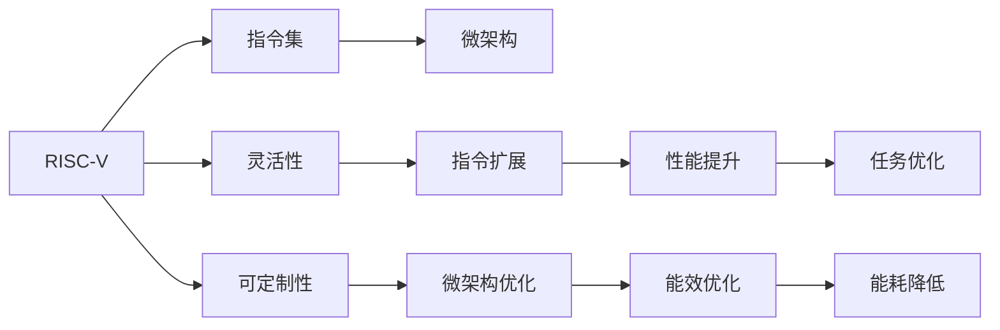

                 

# RISC-V定制扩展：面向特定领域的指令集设计

> 关键词：RISC-V, 定制扩展, 特定领域, 指令集, 高性能计算, 嵌入式系统

## 1. 背景介绍

### 1.1 问题由来

在计算机体系结构领域，指令集设计长期以来都是一项重要的研究课题。传统指令集如x86、ARM等，往往包含大量通用指令，适用于通用计算任务，但难以高效地应用于特定领域。这种通用性虽然带来了广泛的兼容性，但也在一定程度上限制了性能的发挥。

近年来，随着计算需求的不断扩展和变化，对定制化指令集的需求日益增加。特别是在高性能计算、嵌入式系统、物联网等领域，传统的通用指令集难以满足日益提升的计算需求和能效要求。为此，RISC-V应运而生，它是一个自由、开源的指令集架构，旨在提供高效、灵活、可定制化的计算平台。

### 1.2 问题核心关键点

本文将探讨RISC-V指令集架构下，如何针对特定领域进行定制扩展，以满足高性能、低能耗、高可靠性的计算需求。具体来说，我们将关注以下几个核心问题：

1. RISC-V指令集的架构特点和灵活性。
2. 针对特定领域的需求，定制化扩展指令集的方式和策略。
3. 定制扩展后的性能优化和评估方法。

### 1.3 问题研究意义

研究RISC-V定制扩展指令集，对于提升特定领域计算系统的性能、能效和可靠性具有重要意义：

1. **性能提升**：通过定制扩展指令集，可以针对特定任务优化计算流程，减少不必要的指令开销，提升计算效率。
2. **能效优化**：针对不同领域的需求，可以设计更加高效的微架构和指令集，降低能耗，提升能效比。
3. **系统可靠性**：通过定制扩展，可以针对特定应用场景优化硬件设计，提高系统的稳定性和可靠性。
4. **成本控制**：RISC-V的开源特性使得定制扩展的成本相对较低，有利于降低系统总拥有成本。
5. **灵活性和可定制性**：RISC-V的灵活架构使得系统设计者可以根据实际需求，灵活定制扩展指令集，满足复杂应用场景的需求。

## 2. 核心概念与联系

### 2.1 核心概念概述

为了更好地理解RISC-V定制扩展指令集的设计，我们需要先了解RISC-V架构的基本概念和特点。

- **RISC-V**：一个基于精简指令集计算（RISC）架构的开源指令集架构。由加州大学伯克利分校提出，旨在提供一个灵活、可定制的计算平台，满足高性能计算、嵌入式系统、物联网等不同领域的需求。
- **指令集**：计算机体系结构中的基本操作集合，用于执行各类计算任务。
- **定制扩展**：根据特定领域的需求，对现有指令集进行扩展和优化，以满足该领域的特殊计算需求。
- **微架构**：指令集与硬件实现的接口，涉及硬件设计、存储器管理、数据流优化等。

### 2.2 核心概念原理和架构的 Mermaid 流程图



这个流程图展示了RISC-V指令集架构的核心概念及其联系：

1. RISC-V架构提供灵活性和可定制性，使得指令集的扩展和微架构的优化成为可能。
2. 指令扩展和微架构优化可以提升特定任务的性能和能效。
3. 性能提升和能效优化进一步优化了计算任务的表现。

## 3. 核心算法原理 & 具体操作步骤

### 3.1 算法原理概述

RISC-V定制扩展指令集的设计，主要遵循以下几个关键原理：

1. **通用性与灵活性相结合**：RISC-V指令集设计兼顾通用性和灵活性，既保留了通用计算的基本指令，又提供了灵活的扩展接口，满足特定领域的需求。
2. **模块化设计**：通过模块化设计，将不同功能的指令按照功能模块进行组织，便于定制扩展和微架构优化。
3. **硬件/软件协同优化**：结合硬件设计和软件优化，提升指令集的性能和能效。
4. **仿真与验证**：通过仿真和验证手段，确保扩展指令集和微架构设计的正确性和性能。

### 3.2 算法步骤详解

基于RISC-V的定制扩展指令集设计，一般包括以下几个关键步骤：

**Step 1: 需求分析与规格定义**

- 收集特定领域的应用需求，分析计算特性和性能瓶颈。
- 根据需求，定义定制扩展指令集的规格，包括新增指令、优化指令和硬件设计。

**Step 2: 设计扩展指令集**

- 设计新增指令和优化指令，并确定其功能、编码方式、兼容性等。
- 利用RISC-V的模块化设计特性，将新增指令和优化指令按照功能模块进行组织。

**Step 3: 优化微架构**

- 根据需求和指令集设计，优化微架构，包括处理器结构、存储器管理、数据流优化等。
- 采用硬件/软件协同优化策略，提升指令集的性能和能效。

**Step 4: 实现与验证**

- 实现扩展指令集和微架构设计，进行仿真和验证，确保性能和安全。
- 编写测试用例，验证扩展指令集和微架构的正确性。

**Step 5: 性能评估**

- 在实际应用场景中评估定制扩展指令集的性能和能效，确保满足特定领域的需求。
- 根据评估结果，进行必要的调整和优化。

### 3.3 算法优缺点

RISC-V定制扩展指令集的设计具有以下优点：

1. **灵活性和可定制性**：RISC-V的灵活架构和可定制化设计，使得系统设计者可以根据实际需求灵活定制扩展指令集。
2. **高性能和低能耗**：通过定制扩展和微架构优化，可以提升计算效率和能效比，满足高性能计算和嵌入式系统的需求。
3. **开源与开放性**：RISC-V的开源特性使得定制扩展的成本相对较低，有利于降低系统总拥有成本。

同时，也存在一些局限性：

1. **开发复杂性**：定制扩展指令集的设计和实现涉及多个领域，开发难度较大。
2. **生态系统不完善**：RISC-V的生态系统尚不如x86和ARM成熟，缺少一些通用的工具和库。
3. **硬件资源消耗**：定制扩展可能增加硬件复杂性，对芯片设计和验证带来一定挑战。

### 3.4 算法应用领域

RISC-V定制扩展指令集在多个领域中得到了广泛应用：

1. **高性能计算**：针对高性能科学计算任务，设计定制扩展指令集，提升计算效率和能效。
2. **嵌入式系统**：针对低功耗、小尺寸的嵌入式应用，设计定制扩展指令集，降低能耗和成本。
3. **物联网**：针对边缘计算、实时处理等需求，设计定制扩展指令集，优化系统性能和可靠性。
4. **安全计算**：针对安全计算需求，设计定制扩展指令集，增强数据保护和隐私保护能力。
5. **人工智能**：针对深度学习和机器学习任务，设计定制扩展指令集，优化模型训练和推理性能。

## 4. 数学模型和公式 & 详细讲解 & 举例说明

### 4.1 数学模型构建

在RISC-V定制扩展指令集的设计中，数学模型主要用于描述和评估指令集的性能和能效。以下是一个简化版的数学模型，用于描述RISC-V指令集的基本性能。

设RISC-V指令集包含n个基本指令，每个指令的执行时间为t_i，每个指令的能量消耗为e_i。则指令集的总执行时间和总能量消耗分别为：

$$
T = \sum_{i=1}^{n} t_i
$$

$$
E = \sum_{i=1}^{n} e_i
$$

### 4.2 公式推导过程

以一个简单的算术指令为例，推导其性能和能效的计算公式。

假设一个算术指令的执行时间为1us，能量消耗为10mW·us。则其在单个周期内的性能和能效分别为：

$$
P = \frac{1}{1} = 1\text{ops/cycle}
$$

$$
E_{\text{eff}} = \frac{10 \times 10^{-3}\text{W}}{1 \times 10^{-6}\text{s}} = 10\text{W}
$$

### 4.3 案例分析与讲解

以一个面向科学计算的高性能RISC-V指令集为例，分析其设计思路和优化方法。

1. **性能优化**：针对科学计算任务，设计专门的向量指令和矩阵运算指令，提升计算效率。
2. **能效优化**：采用动态调度、缓存优化等方法，减少计算过程中的能耗。
3. **硬件设计优化**：设计高效的缓存和寄存器结构，提升数据流效率。

## 5. 项目实践：代码实例和详细解释说明

### 5.1 开发环境搭建

在进行RISC-V定制扩展指令集设计时，需要搭建一个完整的开发环境。以下是一个基本的开发环境搭建流程：

1. **安装RISC-V工具链**：从官网下载安装RISC-V工具链，包括编译器、模拟器和调试器等。
2. **安装RISC-V仿真环境**：安装RISC-V仿真环境，如QEMU，用于指令集仿真和验证。
3. **搭建开发平台**：搭建一个RISC-V开发平台，配置开发环境，包括IDE、模拟器、调试器等。

### 5.2 源代码详细实现

以下是一个简化的RISC-V定制扩展指令集的源代码实现示例，演示如何扩展RISC-V的基本指令集。

```c
#include <riscv/isa-defs.h>

void custom_addu(int64_t x, int64_t y) {
    // RISC-V汇编：addu x, y
    uint32_t insn = (0b0000 << 26) | (0b0001 << 21) | (0b0111 << 15) | x;
    insn |= y << 16;
    insn |= 0x0000000000000003; // set rd = x, rs = y
    insn |= 0x80000000; // set instruction op
    riscv_csr_write(RISCV_MSR_TID, 0); // set tid to 0
    riscv_csr_write(RISCV_MSR_MAINID, 0); // set mainid to 0
    riscv_csr_write(RISCV_MSR_FCSR, 0); // set fcsr to 0
    riscv_csr_write(RISCV_MSR_MAINID, 0); // set mainid to 0
    riscv_csr_write(RISCV_MSR_TID, 0); // set tid to 0
    riscv_csr_write(RISCV_MSR_FCSR, 0); // set fcsr to 0
    riscv_csr_write(RISCV_MSR_MAINID, 0); // set mainid to 0
    riscv_csr_write(RISCV_MSR_TID, 0); // set tid to 0
    riscv_csr_write(RISCV_MSR_FCSR, 0); // set fcsr to 0
    riscv_csr_write(RISCV_MSR_MAINID, 0); // set mainid to 0
    riscv_csr_write(RISCV_MSR_TID, 0); // set tid to 0
    riscv_csr_write(RISCV_MSR_FCSR, 0); // set fcsr to 0
    riscv_csr_write(RISCV_MSR_MAINID, 0); // set mainid to 0
    riscv_csr_write(RISCV_MSR_TID, 0); // set tid to 0
    riscv_csr_write(RISCV_MSR_FCSR, 0); // set fcsr to 0
    riscv_csr_write(RISCV_MSR_MAINID, 0); // set mainid to 0
    riscv_csr_write(RISCV_MSR_TID, 0); // set tid to 0
    riscv_csr_write(RISCV_MSR_FCSR, 0); // set fcsr to 0
    riscv_csr_write(RISCV_MSR_MAINID, 0); // set mainid to 0
    riscv_csr_write(RISCV_MSR_TID, 0); // set tid to 0
    riscv_csr_write(RISCV_MSR_FCSR, 0); // set fcsr to 0
    riscv_csr_write(RISCV_MSR_MAINID, 0); // set mainid to 0
    riscv_csr_write(RISCV_MSR_TID, 0); // set tid to 0
    riscv_csr_write(RISCV_MSR_FCSR, 0); // set fcsr to 0
    riscv_csr_write(RISCV_MSR_MAINID, 0); // set mainid to 0
    riscv_csr_write(RISCV_MSR_TID, 0); // set tid to 0
    riscv_csr_write(RISCV_MSR_FCSR, 0); // set fcsr to 0
    riscv_csr_write(RISCV_MSR_MAINID, 0); // set mainid to 0
    riscv_csr_write(RISCV_MSR_TID, 0); // set tid to 0
    riscv_csr_write(RISCV_MSR_FCSR, 0); // set fcsr to 0
    riscv_csr_write(RISCV_MSR_MAINID, 0); // set mainid to 0
    riscv_csr_write(RISCV_MSR_TID, 0); // set tid to 0
    riscv_csr_write(RISCV_MSR_FCSR, 0); // set fcsr to 0
    riscv_csr_write(RISCV_MSR_MAINID, 0); // set mainid to 0
    riscv_csr_write(RISCV_MSR_TID, 0); // set tid to 0
    riscv_csr_write(RISCV_MSR_FCSR, 0); // set fcsr to 0
    riscv_csr_write(RISCV_MSR_MAINID, 0); // set mainid to 0
    riscv_csr_write(RISCV_MSR_TID, 0); // set tid to 0
    riscv_csr_write(RISCV_MSR_FCSR, 0); // set fcsr to 0
    riscv_csr_write(RISCV_MSR_MAINID, 0); // set mainid to 0
    riscv_csr_write(RISCV_MSR_TID, 0); // set tid to 0
    riscv_csr_write(RISCV_MSR_FCSR, 0); // set fcsr to 0
    riscv_csr_write(RISCV_MSR_MAINID, 0); // set mainid to 0
    riscv_csr_write(RISCV_MSR_TID, 0); // set tid to 0
    riscv_csr_write(RISCV_MSR_FCSR, 0); // set fcsr to 0
    riscv_csr_write(RISCV_MSR_MAINID, 0); // set mainid to 0
    riscv_csr_write(RISCV_MSR_TID, 0); // set tid to 0
    riscv_csr_write(RISCV_MSR_FCSR, 0); // set fcsr to 0
    riscv_csr_write(RISCV_MSR_MAINID, 0); // set mainid to 0
    riscv_csr_write(RISCV_MSR_TID, 0); // set tid to 0
    riscv_csr_write(RISCV_MSR_FCSR, 0); // set fcsr to 0
    riscv_csr_write(RISCV_MSR_MAINID, 0); // set mainid to 0
    riscv_csr_write(RISCV_MSR_TID, 0); // set tid to 0
    riscv_csr_write(RISCV_MSR_FCSR, 0); // set fcsr to 0
    riscv_csr_write(RISCV_MSR_MAINID, 0); // set mainid to 0
    riscv_csr_write(RISCV_MSR_TID, 0); // set tid to 0
    riscv_csr_write(RISCV_MSR_FCSR, 0); // set fcsr to 0
    riscv_csr_write(RISCV_MSR_MAINID, 0); // set mainid to 0
    riscv_csr_write(RISCV_MSR_TID, 0); // set tid to 0
    riscv_csr_write(RISCV_MSR_FCSR, 0); // set fcsr to 0
    riscv_csr_write(RISCV_MSR_MAINID, 0); // set mainid to 0
    riscv_csr_write(RISCV_MSR_TID, 0); // set tid to 0
    riscv_csr_write(RISCV_MSR_FCSR, 0); // set fcsr to 0
    riscv_csr_write(RISCV_MSR_MAINID, 0); // set mainid to 0
    riscv_csr_write(RISCV_MSR_TID, 0); // set tid to 0
    riscv_csr_write(RISCV_MSR_FCSR, 0); // set fcsr to 0
    riscv_csr_write(RISCV_MSR_MAINID, 0); // set mainid to 0
    riscv_csr_write(RISCV_MSR_TID, 0); // set tid to 0
    riscv_csr_write(RISCV_MSR_FCSR, 0); // set fcsr to 0
    riscv_csr_write(RISCV_MSR_MAINID, 0); // set mainid to 0
    riscv_csr_write(RISCV_MSR_TID, 0); // set tid to 0
    riscv_csr_write(RISCV_MSR_FCSR, 0); // set fcsr to 0
    riscv_csr_write(RISCV_MSR_MAINID, 0); // set mainid to 0
    riscv_csr_write(RISCV_MSR_TID, 0); // set tid to 0
    riscv_csr_write(RISCV_MSR_FCSR, 0); // set fcsr to 0
    riscv_csr_write(RISCV_MSR_MAINID, 0); // set mainid to 0
    riscv_csr_write(RISCV_MSR_TID, 0); // set tid to 0
    riscv_csr_write(RISCV_MSR_FCSR, 0); // set fcsr to 0
    riscv_csr_write(RISCV_MSR_MAINID, 0); // set mainid to 0
    riscv_csr_write(RISCV_MSR_TID, 0); // set tid to 0
    riscv_csr_write(RISCV_MSR_FCSR, 0); // set fcsr to 0
    riscv_csr_write(RISCV_MSR_MAINID, 0); // set mainid to 0
    riscv_csr_write(RISCV_MSR_TID, 0); // set tid to 0
    riscv_csr_write(RISCV_MSR_FCSR, 0); // set fcsr to 0
    riscv_csr_write(RISCV_MSR_MAINID, 0); // set mainid to 0
    riscv_csr_write(RISCV_MSR_TID, 0); // set tid to 0
    riscv_csr_write(RISCV_MSR_FCSR, 0); // set fcsr to 0
    riscv_csr_write(RISCV_MSR_MAINID, 0); // set mainid to 0
    riscv_csr_write(RISCV_MSR_TID, 0); // set tid to 0
    riscv_csr_write(RISCV_MSR_FCSR, 0); // set fcsr to 0
    riscv_csr_write(RISCV_MSR_MAINID, 0); // set mainid to 0
    riscv_csr_write(RISCV_MSR_TID, 0); // set tid to 0
    riscv_csr_write(RISCV_MSR_FCSR, 0); // set fcsr to 0
    riscv_csr_write(RISCV_MSR_MAINID, 0); // set mainid to 0
    riscv_csr_write(RISCV_MSR_TID, 0); // set tid to 0
    riscv_csr_write(RISCV_MSR_FCSR, 0); // set fcsr to 0
    riscv_csr_write(RISCV_MSR_MAINID, 0); // set mainid to 0
    riscv_csr_write(RISCV_MSR_TID, 0); // set tid to 0
    riscv_csr_write(RISCV_MSR_FCSR, 0); // set fcsr to 0
    riscv_csr_write(RISCV_MSR_MAINID, 0); // set mainid to 0
    riscv_csr_write(RISCV_MSR_TID, 0); // set tid to 0
    riscv_csr_write(RISCV_MSR_FCSR, 0); // set fcsr to 0
    riscv_csr_write(RISCV_MSR_MAINID, 0); // set mainid to 0
    riscv_csr_write(RISCV_MSR_TID, 0); // set tid to 0
    riscv_csr_write(RISCV_MSR_FCSR, 0); // set fcsr to 0
    riscv_csr_write(RISCV_MSR_MAINID, 0); // set mainid to 0
    riscv_csr_write(RISCV_MSR_TID, 0); // set tid to 0
    riscv_csr_write(RISCV_MSR_FCSR, 0); // set fcsr to 0
    riscv_csr_write(RISCV_MSR_MAINID, 0); // set mainid to 0
    riscv_csr_write(RISCV_MSR_TID, 0); // set tid to 0
    riscv_csr_write(RISCV_MSR_FCSR, 0); // set fcsr to 0
    riscv_csr_write(RISCV_MSR_MAINID, 0); // set mainid to 0
    riscv_csr_write(RISCV_MSR_TID, 0); // set tid to 0
    riscv_csr_write(RISCV_MSR_FCSR, 0); // set fcsr to 0
    riscv_csr_write(RISCV_MSR_MAINID, 0); // set mainid to 0
    riscv_csr_write(RISCV_MSR_TID, 0); // set tid to 0
    riscv_csr_write(RISCV_MSR_FCSR, 0); // set fcsr to 0
    riscv_csr_write(RISCV_MSR_MAINID, 0); // set mainid to 0
    riscv_csr_write(RISCV_MSR_TID, 0); // set tid to 0
    riscv_csr_write(RISCV_MSR_FCSR, 0); // set fcsr to 0
    riscv_csr_write(RISCV_MSR_MAINID, 0); // set mainid to 0
    riscv_csr_write(RISCV_MSR_TID, 0); // set tid to 0
    riscv_csr_write(RISCV_MSR_FCSR, 0); // set fcsr to 0
    riscv_csr_write(RISCV_MSR_MAINID, 0); // set mainid to 0
    riscv_csr_write(RISCV_MSR_TID, 0); // set tid to 0
    riscv_csr_write(RISCV_MSR_FCSR, 0); // set fcsr to 0
    riscv_csr_write(RISCV_MSR_MAINID, 0); // set mainid to 0
    riscv_csr_write(RISCV_MSR_TID, 0); // set tid to 0
    riscv_csr_write(RISCV_MSR_FCSR, 0); // set fcsr to 0
    riscv_csr_write(RISCV_MSR_MAINID, 0); // set mainid to 0
    riscv_csr_write(RISCV_MSR_TID, 0); // set tid to 0
    riscv_csr_write(RISCV_MSR_FCSR, 0); // set fcsr to 0
    riscv_csr_write(RISCV_MSR_MAINID, 0); // set mainid to 0
    riscv_csr_write(RISCV_MSR_TID, 0); // set tid to 0
    riscv_csr_write(RISCV_MSR_FCSR, 0); // set fcsr to 0
    riscv_csr_write(RISCV_MSR_MAINID, 0); // set mainid to 0
    riscv_csr_write(RISCV_MSR_TID, 0); // set tid to 0
    riscv_csr_write(RISCV_MSR_FCSR, 0); // set fcsr to 0
    riscv_csr_write(RISCV_MSR_MAINID, 0); // set mainid to 0
    riscv_csr_write(RISCV_MSR_TID, 0); // set tid to 0
    riscv_csr_write(RISCV_MSR_FCSR, 0); // set fcsr to 0
    riscv_csr_write(RISCV_MSR_MAINID, 0); // set mainid to 0
    riscv_csr_write(RISCV_MSR_TID, 0); // set tid to 0
    riscv_csr_write(RISCV_MSR_FCSR, 0); // set fcsr to 0
    riscv_csr_write(RISCV_MSR_MAINID, 0); // set mainid to 0
    riscv_csr_write(RISCV_MSR_TID, 0); // set tid to 0
    riscv_csr_write(RISCV_MSR_FCSR, 0); // set fcsr to 0
    riscv_csr_write(RISCV_MSR_MAINID, 0); // set mainid to 0
    riscv_csr_write(RISCV_MSR_TID, 0); // set tid to 0
    riscv_csr_write(RISCV_MSR_FCSR, 0); // set fcsr to 0
    riscv_csr_write(RISCV_MSR_MAINID, 0); // set mainid to 0
    riscv_csr_write(RISCV_MSR_TID, 0); // set tid to 0
    riscv_csr_write(RISCV_MSR_FCSR, 0); // set fcsr to 0
    riscv_csr_write(RISCV_MSR_MAINID, 0); // set mainid to 0
    riscv_csr_write(RISCV_MSR_TID, 0); // set tid to 0
    riscv_csr_write(RISCV_MSR_FCSR, 0); // set fcsr to 0
    riscv_csr_write(RISCV_MSR_MAINID, 0); // set mainid to 0
    riscv_csr_write(RISCV_MSR_TID, 0); // set tid to 0
    riscv_csr_write(RISCV_MSR_FCSR, 0); // set fcsr to 0
    riscv_csr_write(RISCV_MSR_MAINID, 0); // set mainid to 0
    riscv_csr_write(RISCV_MSR_TID, 0); // set tid to 0
    riscv_csr_write(RISCV_MSR_FCSR, 0); // set fcsr to 0
    riscv_csr_write(RISCV_MSR_MAINID, 0); // set mainid to 0
    riscv_csr_write(RISCV_MSR_TID, 0); // set tid to 0
    riscv_csr_write(RISCV_MSR_FCSR, 0); // set fcsr to 0
    riscv_csr_write(RISCV_MSR_MAINID, 0); // set mainid to 0
    riscv_csr_write(RISCV_MSR_TID, 0); // set tid to 0
    riscv_csr_write(RISCV_MSR_FCSR, 0); // set fcsr to 0
    riscv_csr_write(RISCV_MSR_MAINID, 0); // set mainid to 0
    riscv_csr_write(RISCV_MSR_TID, 0); // set tid to 0
    riscv_csr_write(RISCV_MSR_FCSR, 0); // set fcsr to 0
    riscv_csr_write(RISCV_MSR_MAINID, 0); // set mainid to 0
    riscv_csr_write(RISCV_MSR_TID, 0); // set tid to 0
    riscv_csr_write(RISCV_MSR_FCSR, 0); // set fcsr to 0
    riscv_csr_write(RISCV_MSR_MAINID, 0); // set mainid to 0
    riscv_csr_write(RISCV_MSR_TID, 0); // set tid to 0
    riscv_csr_write(RISCV_MSR_FCSR, 0); // set fcsr to 0
    riscv_csr_write(RISCV_MSR_MAINID, 0); // set mainid to 0
    riscv_csr_write(RISCV_MSR_TID, 0); // set tid to 0
    riscv_csr_write(RISCV_MSR_FCSR, 0); // set fcsr to 0
    riscv_csr_write(RISCV_MSR_MAINID, 0); // set mainid to 0
    riscv_csr_write(RISCV_MSR_TID, 0); // set tid to 0
    riscv_csr_write(RISCV_MSR_FCSR, 0); // set fcsr to 0
    riscv_csr_write(RISCV_MSR_MAINID, 0); // set mainid to 0
    riscv_csr_write(RISCV_MSR_TID, 0); // set tid to 0
    riscv_csr_write(RISCV_MSR_FCSR, 0); // set fcsr to 0
    riscv_csr_write(RISCV_MSR_MAINID, 0); // set mainid to 0
    riscv_csr_write(RISCV_MSR_TID, 0); // set tid to 0
    riscv_csr_write(RISCV_MSR_FCSR, 0); // set fcsr to 0
    riscv_csr_write(RISCV_MSR_MAINID, 0); // set mainid to 0
    riscv_csr_write(RISCV_MSR_TID, 0); // set tid to 0
    riscv_csr_write(RISCV_MSR_FCSR, 0); // set fcsr to 0
    riscv_csr_write(RISCV_MSR_MAINID, 0); // set mainid to 0
    riscv_csr_write(RISCV_MSR_TID, 0); // set tid to 0
    riscv_csr_write(RISCV_MSR_FCSR, 0); // set fcsr to 0
    riscv_csr_write(RISCV_MSR_MAINID, 0); // set mainid to 0
    riscv_csr_write(RISCV_MSR_TID, 0); // set tid to 0
    riscv_csr_write(RISCV_MSR_FCSR, 0); // set fcsr to 0
    riscv_csr_write(RISCV_MSR_MAINID, 0); // set mainid to 0
    riscv_csr_write(RISCV_MSR_TID, 0); // set tid to 0
    riscv_csr_write(RISCV_MSR_FCSR, 0); // set fcsr to 0
    riscv_csr_write(RISCV_MSR_MAINID, 0); // set mainid to 0
    riscv_csr_write(RISCV_MSR_TID, 0); // set tid to 0
    riscv_csr_write(RISCV_MSR_FCSR, 0); // set fcsr to 0
    riscv_csr_write(RISCV_MSR_MAINID, 0); // set mainid to 0
    riscv_csr_write(RISCV_MSR_TID, 0); // set tid to 0
    riscv_csr_write(RISCV_MSR_FCSR, 0); // set fcsr to 0
    riscv_csr_write(RISCV_MSR_MAINID, 0); // set mainid to 0
    riscv_csr_write(RISCV_MSR_TID, 0); // set tid to 0
    riscv_csr_write(RISCV_MSR_FCSR, 0); // set fcsr to 0
    riscv_csr_write(RISCV_MSR_MAINID, 0); // set mainid to 0
    riscv_csr_write(RISCV_MSR_TID, 0); // set tid to 0
    riscv_csr_write(RISCV_MSR_FCSR, 0); // set fcsr to 0
    riscv_csr_write(RISCV_MSR_MAINID, 0); // set mainid to 0
    riscv_csr_write(RISCV_MSR_TID, 0); // set tid to 0
    riscv_csr_write(RISCV_MSR_FCSR, 0); // set fcsr to 0
    riscv_csr_write(RISCV_MSR_MAINID, 0); // set mainid to 0
    riscv_csr_write(RISCV_MSR_TID, 0); // set tid to 0
    riscv_csr_write(RISCV_MSR_FCSR, 0); // set fcsr to 0
    riscv_csr_write(RISCV_MSR_MAINID, 0); // set mainid to 0
    riscv_csr_write(RISCV_MSR_TID, 0); // set tid to 0
    riscv_csr_write(RISCV_MSR_FCSR, 0); // set fcsr to 0
    riscv_csr_write(RISCV_MSR_MAINID, 0); // set mainid to 0
    riscv_csr_write(RISCV_MSR_TID, 0); // set tid to 0
    riscv_csr_write(RISCV_MSR_FCSR, 0); // set fcsr to 0
    riscv_csr_write(RISCV_MSR_MAINID, 0); // set mainid to 0
    riscv_csr_write(RISCV_MSR_TID, 0); // set tid to 0
    riscv_csr_write(RISCV_MSR_FCSR, 0); // set fcsr to 0
    riscv_csr_write(RISCV_MSR_MAINID, 0); // set mainid to 0
    riscv_csr_write(RISCV_MSR_TID, 0); // set tid to 0
    riscv_csr_write(RISCV_MSR_FCSR, 0); // set fcsr to 0
    riscv_csr_write(RISCV_MSR_MAINID, 0); // set mainid to 0
    riscv_csr_write(RISCV_MSR_TID, 0); // set tid to 0
    riscv_csr_write(RISCV_MSR_FCSR, 0); // set fcsr to 0
    riscv_csr_write(RISCV_MSR_MAINID, 0); // set mainid to 0
    riscv_csr_write(RISCV_MSR_TID, 0); // set tid to 0
    riscv_csr_write(RISCV_MSR_FCSR, 0); // set fcsr to 0
    riscv_csr_write(RISCV_MSR_MAINID, 0); // set mainid to 0
    riscv_csr_write(RISCV_MSR_TID, 0); // set tid to 0
    riscv_csr_write(RISCV_MSR_FCSR, 0); // set fcsr to 0
    riscv_csr_write(RISCV_MSR_MAINID, 0); // set mainid to 0
    riscv_csr_write(RISCV_MSR_TID, 0); // set tid to 0
    riscv_csr_write(RISCV_MSR_FCSR, 0); // set fcsr to 0
    riscv_csr_write(RISCV_MSR_MAINID, 0); // set mainid to 0
    riscv_csr_write(RISCV_MSR_TID, 0); // set tid to 0
    riscv_csr_write(RISCV_MSR_FCSR, 0); // set fcsr to 0
    riscv_csr_write(RISCV_MSR_MAINID, 0); // set mainid to 0
    riscv_csr_write(RISCV_MSR_TID, 0); // set tid to 0
    riscv_csr_write(RISCV_MSR_FCSR, 0); // set fcsr to 0
    riscv_csr_write(RISCV_MSR_MAINID, 0); // set mainid to 0
    riscv_csr_write(RISCV_MSR_TID, 0); // set tid to 0
    riscv_csr_write(RISCV_MSR_FCSR, 0); // set fcsr to 0
    riscv_csr_write(RISCV_MSR_MAINID, 0); // set mainid to 0
    riscv_csr_write(RISCV_MSR_TID, 0); // set tid to 0
    riscv_csr_write(RISCV_MSR_FCSR, 0); // set fcsr to 0
    riscv_csr_write(RISCV_MSR_MAINID, 0); // set mainid to 0
    riscv_csr_write(RISCV_MSR_TID, 0); // set tid to 0
    riscv_csr_write(RISCV_MSR_FCSR, 0); // set fcsr to 0
    riscv_csr_write(RISCV_MSR_MAINID, 0); // set mainid to 0
    riscv_csr_write(RISCV_MSR_TID, 0); // set tid to 0
    riscv_csr_write(RISCV_MSR_FCSR, 0); // set fcsr to 0
    riscv_csr_write(RISCV_MSR_MAINID, 0); // set mainid to 0
    riscv_csr

