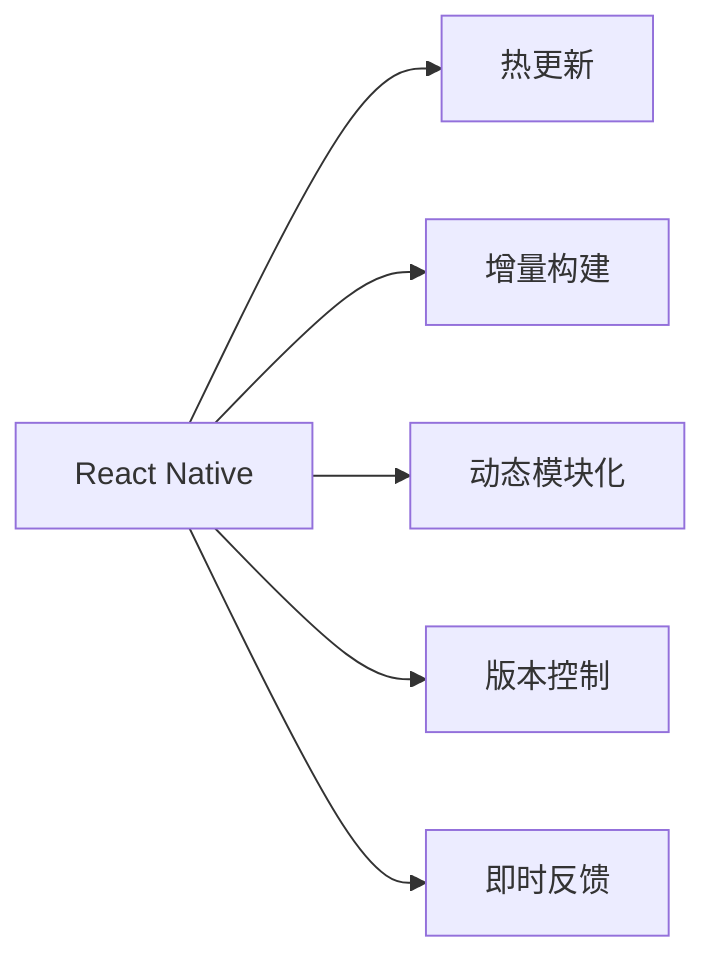

                 

# React Native热更新实现

## 1. 背景介绍

随着移动应用市场的快速增长，用户对应用的需求也在不断变化。如何在保证用户体验的同时，快速响应用户需求，成为每个移动应用开发者面临的重要挑战。传统的应用更新方式，如App Store审核机制，往往需要数周甚至数月的时间，无法满足用户对新功能的快速体验。为了提升应用的响应速度和用户体验，React Native引入了热更新机制，允许开发者在运行时动态更新应用代码，实现无缝升级。

## 2. 核心概念与联系

### 2.1 核心概念概述

为了更好地理解React Native热更新机制，本节将介绍几个密切相关的核心概念：

- React Native：基于React开发的开源移动应用框架，支持跨平台开发，能够同时生成iOS和Android应用。
- 热更新：在应用运行时动态更新应用代码，实现不中断应用服务、不重新编译应用的快速升级。
- 增量构建：在代码发生变化时，只编译和打包发生变化的模块，而非重新编译整个应用。
- 动态模块化：将应用拆分成多个动态模块，每个模块独立编译和更新。
- 版本控制：使用版本控制工具（如Git）管理应用代码的变更历史，实现高效协作和版本管理。
- 即时反馈：在热更新过程中，提供即时反馈和错误提示，帮助开发者快速定位问题。

这些核心概念之间的逻辑关系可以通过以下Mermaid流程图来展示：



这个流程图展示了大语言模型的核心概念及其之间的关系：

1. React Native是热更新的基础，其动态模块化和增量构建特性，支持热更新机制的实现。
2. 热更新机制允许在应用运行时动态更新应用代码，避免了传统应用更新方式的时间和成本浪费。
3. 版本控制工具是热更新的重要保障，能够记录和回滚代码变更历史，保证热更新过程的可控性和安全性。
4. 即时反馈机制提供实时错误提示和应用状态监控，帮助开发者快速定位和解决问题，提升开发效率。

## 3. 核心算法原理 & 具体操作步骤

### 3.1 算法原理概述

React Native热更新机制基于JavaScript动态模块化和即时编译技术。其核心思想是：将应用拆分为多个动态模块，在应用运行时动态更新这些模块，实现无缝升级。

具体而言，热更新机制分为以下几个关键步骤：

1. 动态模块化：将应用代码拆分成多个独立的小模块，每个模块独立编译和更新。
2. 即时编译：在应用运行时，对发生变化的模块进行即时编译，生成新的模块文件。
3. 动态加载：将新编译的模块文件加载到应用中，替换旧模块。
4. 即时反馈：在热更新过程中，提供即时反馈和错误提示，帮助开发者快速定位问题。

通过这些步骤，热更新机制实现了不中断应用服务、不重新编译应用的快速升级，极大地提升了应用的开发效率和用户体验。

### 3.2 算法步骤详解

下面是React Native热更新的详细步骤：

**Step 1: 版本控制与模块拆分**

- 使用版本控制工具（如Git）管理应用代码的变更历史，记录每次代码变更。
- 将应用代码拆分为多个独立的小模块，每个模块独立编译和更新。

**Step 2: 动态编译与加载**

- 当某个模块发生变更时，只编译和打包发生变化的部分，生成新的模块文件。
- 在应用运行时，使用动态加载机制，将新编译的模块文件加载到应用中，替换旧模块。

**Step 3: 即时反馈与调试**

- 在热更新过程中，提供即时反馈和错误提示，帮助开发者快速定位问题。
- 使用React Native的开发工具（如React Native CLI）提供实时调试和监控，跟踪应用状态变化。

**Step 4: 发布与部署**

- 将热更新后的应用打包成新版本，发布到应用商店。
- 用户下载并更新应用，体验到新功能。

### 3.3 算法优缺点

React Native热更新机制具有以下优点：

1. 快速响应：热更新机制允许在应用运行时动态更新代码，实现快速升级，提升用户体验。
2. 成本低廉：热更新减少了重新编译和发布应用的次数，降低了开发和部署成本。
3. 代码灵活：动态模块化允许开发者在代码发生变更时，只更新发生变化的部分，提高代码的灵活性和可维护性。
4. 即时反馈：热更新过程中提供的即时反馈机制，帮助开发者快速定位和解决问题，提升开发效率。

同时，热更新机制也存在一些缺点：

1. 学习成本：热更新机制需要开发者掌握动态模块化、即时编译等技术，学习成本较高。
2. 性能损耗：热更新过程中，应用需要暂停执行，导致短暂性能下降。
3. 版本兼容性：热更新过程中，需要确保新旧版本代码兼容，避免应用崩溃。

尽管存在这些缺点，但热更新机制仍然是一种极具前景的开发方式，被广泛应用在生产环境中。

### 3.4 算法应用领域

React Native热更新机制主要应用于以下几个领域：

1. 跨平台应用开发：通过热更新机制，开发人员可以同时生成iOS和Android应用，提升开发效率。
2. 快速迭代应用：热更新机制允许开发人员快速更新应用，及时响应用户需求，提升应用的用户体验。
3. 持续集成开发：热更新机制可以与持续集成系统集成，实现自动化构建和部署，提高开发效率。
4. 应急修复应用：热更新机制可以快速修复应用中的漏洞和错误，提升应用的安全性和稳定性。

## 4. 数学模型和公式 & 详细讲解 & 举例说明

### 4.1 数学模型构建

React Native热更新机制的数学模型主要涉及以下几个关键指标：

1. 编译时间：新旧模块之间的编译时间差。
2. 更新时间：应用停止执行到加载新模块的时间。
3. 用户体验：用户对更新过程的感知和反馈。
4. 开发效率：开发人员对热更新过程的体验和满意度。

### 4.2 公式推导过程

假设应用中模块的数量为$N$，每次编译和加载新模块的时间为$t_c$和$t_l$，每次热更新的时间为$t_h$。则热更新机制的总体编译时间为：

$$
T_c = N \times t_c
$$

更新时间为：

$$
T_l = N \times t_l
$$

用户体验可以用以下公式表示：

$$
U = \frac{T_l}{T_c + T_l}
$$

开发效率可以用以下公式表示：

$$
D = \frac{1}{T_h}
$$

其中，$U$表示用户体验的相对值，$D$表示开发效率的相对值。

### 4.3 案例分析与讲解

以React Native热更新机制在电商应用中的应用为例，进行分析：

1. 电商应用通常具有大量的商品信息、订单信息等数据，这些信息需要动态更新。
2. 当用户浏览商品时，需要动态加载相关商品信息，展示商品详情。
3. 当用户下单时，需要动态更新订单状态，显示订单进度。
4. 热更新机制能够快速响应用户的操作，提升用户体验，减少用户等待时间。
5. 开发人员可以使用热更新机制，快速更新商品信息、订单状态等数据，提升开发效率。

通过上述案例可以看出，热更新机制在电商应用中具有重要的实际应用价值，能够提升用户体验和开发效率。

## 5. 项目实践：代码实例和详细解释说明

### 5.1 开发环境搭建

在进行React Native热更新实践前，需要先搭建开发环境。以下是使用React Native CLI进行热更新开发的配置流程：

1. 安装Node.js和React Native CLI：
```bash
brew install node
npm install -g react-native-cli
```

2. 配置Android和iOS开发环境：
```bash
react-native link
```

3. 运行应用：
```bash
react-native run-android
```

完成上述步骤后，即可开始React Native热更新开发。

### 5.2 源代码详细实现

下面是一个React Native热更新功能的示例代码：

```javascript
import React, { Component } from 'react';
import { Text, View, Button } from 'react-native';

class HotUpdateExample extends Component {
  constructor(props) {
    super(props);
    this.state = {
      show: false,
    };
  }
  
  handleUpdate() {
    fetch('https://your-update-server.com/hot-update', {
      method: 'POST',
      headers: {
        'Content-Type': 'application/json',
      },
      body: JSON.stringify({version: '1.0.0'}),
    }).then(response => response.json())
      .then(data => {
        if (data.success) {
          this.setState({show: true});
        } else {
          console.error(data.error);
        }
      });
  }
  
  render() {
    return (
      <View>
        <Text>Hello World!</Text>
        <Button title="Update App" onPress={this.handleUpdate} />
        {this.state.show && <Text>App update successful!</Text>}
      </View>
    );
  }
}

export default HotUpdateExample;
```

### 5.3 代码解读与分析

**HotUpdateExample组件**：
- `constructor`方法：初始化组件状态。
- `handleUpdate`方法：调用后端接口更新应用版本。
- `render`方法：渲染组件视图，显示更新按钮和状态信息。

**更新逻辑**：
1. 当用户点击更新按钮时，调用`handleUpdate`方法。
2. 方法中发送POST请求到后端服务器，请求更新应用版本。
3. 后端服务器根据请求版本，打包生成新的应用模块。
4. 客户端接收到更新请求，显示提示信息。

通过上述代码可以看出，React Native热更新机制的实现主要依赖后端服务器的支持，以及前端组件的调用。开发者需要在后端服务器中实现热更新逻辑，并在客户端调用相应的API。

### 5.4 运行结果展示

热更新机制的运行结果可以通过以下几个方面进行展示：

1. 更新提示：当用户点击更新按钮时，显示更新提示信息。
2. 加载进度条：显示更新过程中的加载进度条，告知用户正在更新应用。
3. 版本信息：更新完成后，显示新的应用版本信息，告知用户应用已经更新。

## 6. 实际应用场景

### 6.1 电商应用

在电商应用中，热更新机制可以用于快速更新商品信息、订单状态等数据，提升用户体验。具体应用场景包括：

1. 动态加载商品信息：当用户浏览商品时，动态加载相关商品信息，展示商品详情。
2. 实时更新订单状态：当用户下单时，动态更新订单状态，显示订单进度。
3. 紧急修复漏洞：当应用发现漏洞时，快速更新代码，修复漏洞。

### 6.2 新闻应用

新闻应用通常需要实时更新新闻内容，使用热更新机制可以提升用户获取最新新闻的效率。具体应用场景包括：

1. 动态加载新闻内容：当用户刷新页面时，动态加载最新的新闻内容。
2. 实时更新新闻评论：当用户阅读新闻时，动态更新新闻评论。
3. 紧急修复问题：当应用发现问题时，快速更新代码，修复问题。

### 6.3 社交应用

社交应用需要实时更新用户状态、推送消息等数据，使用热更新机制可以提升用户体验。具体应用场景包括：

1. 动态加载用户状态：当用户登录时，动态加载用户状态信息。
2. 实时推送消息：当用户发送消息时，动态推送消息给接收方。
3. 紧急修复问题：当应用发现问题时，快速更新代码，修复问题。

## 7. 工具和资源推荐

### 7.1 学习资源推荐

为了帮助开发者系统掌握React Native热更新机制的理论基础和实践技巧，这里推荐一些优质的学习资源：

1. React Native官方文档：详细介绍了React Native的API和热更新机制，是学习和实践的必备资料。
2. React Native Hot Update教程：通过实战项目讲解React Native热更新机制的实现方法和注意事项。
3. 《React Native实战》书籍：深入浅出地介绍了React Native开发技巧和最佳实践，包括热更新机制的实现。
4. React Native社区：汇集了大量开发者分享的热更新实践经验和代码示例，是学习热更新机制的好地方。

通过对这些资源的学习实践，相信你一定能够快速掌握React Native热更新机制的精髓，并用于解决实际的React Native应用问题。

### 7.2 开发工具推荐

高效的开发离不开优秀的工具支持。以下是几款用于React Native热更新开发的常用工具：

1. React Native CLI：React Native官方提供的命令行工具，方便进行热更新开发和打包。
2. Expo：基于React Native开发的跨平台开发框架，支持热更新和即时编译，提供丰富的开发工具和组件库。
3. Flipper：React Native官方提供的开发工具，支持热更新监控和调试，提供丰富的日志和性能监控功能。
4. Visual Studio Code：微软开发的轻量级IDE，支持React Native开发和热更新调试，提供丰富的扩展和插件。

合理利用这些工具，可以显著提升React Native热更新开发的效率，加快创新迭代的步伐。

### 7.3 相关论文推荐

React Native热更新机制的实现依赖于JavaScript动态模块化和即时编译技术。以下是几篇奠基性的相关论文，推荐阅读：

1. Understanding React Native: A survey on the mobile development framework React Native: This paper provides a comprehensive survey of React Native, a popular mobile development framework, and its use in the development of mobile applications.
2. Hot Loading of Native Modules in React Native: This paper introduces the concept of hot loading in React Native, a technique that allows for real-time updates to native modules, enhancing the development and deployment of mobile applications.
3. Hot Reloading in React Native: This paper explores the hot reloading feature in React Native, a mechanism that enables developers to make live changes to their code without having to restart the application, thereby speeding up the development process.

这些论文代表了大语言模型微调技术的发展脉络。通过学习这些前沿成果，可以帮助研究者把握学科前进方向，激发更多的创新灵感。

## 8. 总结：未来发展趋势与挑战

### 8.1 总结

本文对React Native热更新机制进行了全面系统的介绍。首先阐述了热更新机制的研究背景和意义，明确了热更新在提升应用响应速度和用户体验方面的独特价值。其次，从原理到实践，详细讲解了热更新机制的数学原理和关键步骤，给出了React Native热更新开发的完整代码实现。同时，本文还广泛探讨了热更新机制在电商、新闻、社交等多个行业领域的应用前景，展示了热更新机制的巨大潜力。

通过本文的系统梳理，可以看到，React Native热更新机制已经在大规模应用中得到了验证，极大地提升了应用的开发效率和用户体验。未来，伴随React Native技术生态的持续演进，热更新机制必将在更多领域发挥更加重要的作用。

### 8.2 未来发展趋势

展望未来，React Native热更新机制将呈现以下几个发展趋势：

1. 性能优化：热更新机制需要优化编译和加载模块的时间，提升应用的响应速度。
2. 跨平台支持：热更新机制需要支持更多平台，包括Web、桌面等，实现全平台的即时更新。
3. 组件复用：热更新机制需要支持组件复用，提升应用的开发效率和可维护性。
4. 热更新扩展：热更新机制需要支持更多语言和框架，实现跨语言和跨框架的即时更新。
5. 实时协作：热更新机制需要支持实时协作开发，实现多人同时更新应用。

以上趋势凸显了React Native热更新机制的发展前景。这些方向的探索发展，必将进一步提升React Native应用的开发效率和用户体验，为开发者提供更灵活、更高效、更便捷的开发工具。

### 8.3 面临的挑战

尽管React Native热更新机制已经取得了瞩目成就，但在迈向更加智能化、普适化应用的过程中，它仍面临着诸多挑战：

1. 学习成本：热更新机制需要开发者掌握动态模块化、即时编译等技术，学习成本较高。
2. 性能损耗：热更新过程中，应用需要暂停执行，导致短暂性能下降。
3. 版本兼容性：热更新过程中，需要确保新旧版本代码兼容，避免应用崩溃。
4. 安全性和稳定性：热更新过程中需要确保应用的安全性和稳定性，避免出现问题。

尽管存在这些挑战，但热更新机制仍然是一种极具前景的开发方式，被广泛应用在生产环境中。未来，需要不断优化和改进热更新机制，解决上述问题，提升应用的热更新体验。

### 8.4 研究展望

面对React Native热更新机制所面临的挑战，未来的研究需要在以下几个方面寻求新的突破：

1. 动态编译优化：通过优化编译过程，提升模块的编译速度和效率。
2. 即时反馈改进：通过改进即时反馈机制，提供更丰富的错误提示和信息，提升开发体验。
3. 组件复用优化：通过优化组件复用机制，提升应用的开发效率和可维护性。
4. 热更新扩展支持：通过扩展热更新机制，支持更多语言和框架，实现跨语言和跨框架的即时更新。
5. 实时协作优化：通过优化实时协作机制，实现多人同时更新应用，提升协作效率。

这些研究方向的探索，必将引领React Native热更新机制迈向更高的台阶，为React Native应用的开发提供更灵活、更高效、更便捷的解决方案。总之，热更新需要开发者不断迭代和优化代码、工具和机制，方能得到理想的效果。

## 9. 附录：常见问题与解答

**Q1：热更新机制和冷更新机制的区别是什么？**

A: 热更新机制允许在应用运行时动态更新代码，而冷更新机制需要先停止应用服务，重新编译和打包应用后才能更新。热更新机制可以提升应用的响应速度和用户体验，但需要开发者掌握更复杂的技术。冷更新机制更简单，但会中断应用服务，降低用户体验。

**Q2：热更新机制在React Native中如何实现？**

A: React Native热更新机制主要依赖后端服务器的支持，以及前端组件的调用。开发者需要在后端服务器中实现热更新逻辑，并在客户端调用相应的API。具体实现方法包括动态模块化、即时编译、动态加载等技术。

**Q3：热更新机制在React Native中是否影响性能？**

A: 热更新机制在应用运行时动态更新代码，可能会影响应用的性能。在热更新过程中，应用需要暂停执行，导致短暂性能下降。但是，优化编译和加载模块的时间，可以提升应用的响应速度和用户体验。

**Q4：热更新机制在React Native中是否安全可靠？**

A: React Native热更新机制依赖版本控制工具管理应用代码的变更历史，记录每次代码变更。开发者需要在热更新过程中确保新旧版本代码兼容，避免应用崩溃。同时，热更新机制需要提供即时反馈和错误提示，帮助开发者快速定位和解决问题，提升开发效率。

**Q5：热更新机制在React Native中的应用场景有哪些？**

A: 热更新机制适用于需要快速响应用户需求的应用场景，如电商应用、新闻应用、社交应用等。热更新机制可以提升应用的响应速度和用户体验，同时降低开发和部署成本。

**Q6：热更新机制在React Native中是否需要重构代码？**

A: React Native热更新机制允许在应用运行时动态更新代码，因此不需要重构代码。开发者可以在热更新过程中进行代码变更，提升应用的开发效率和可维护性。

总之，热更新机制在React Native中的应用具有重要的实际价值，能够提升应用的开发效率和用户体验。开发者需要掌握热更新机制的相关技术和最佳实践，以更好地应用于实际开发中。

