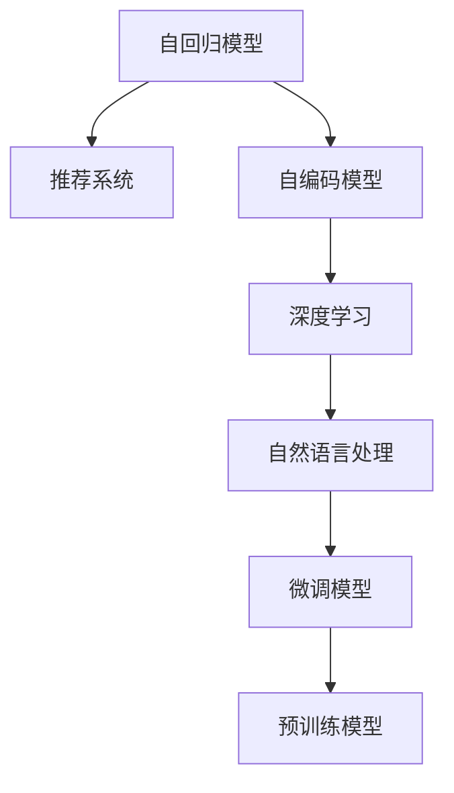

                 

# Recommendation as Language Processing的新范式

> 关键词：推荐系统,语言模型,自回归模型,自编码模型,预训练模型,微调模型,深度学习,自然语言处理,NLP

## 1. 背景介绍

### 1.1 问题由来
推荐系统是当今互联网时代广泛应用的个性化信息服务技术，其核心目标是利用用户的历史行为数据，预测其未来可能感兴趣的商品或内容，从而实现个性化推荐。传统的推荐系统主要基于协同过滤、内容推荐等方法，虽然已经在电商、新闻、社交网络等领域取得了显著效果，但随着数据量和复杂度的增加，其效率和准确性受到了挑战。近年来，深度学习技术在推荐系统中的应用日趋广泛，尤其是基于自回归语言模型的推荐系统，逐步成为推荐领域的新范式。

语言模型作为推荐系统的核心组件，不仅能够从用户的历史行为中挖掘出隐含的偏好，还能够从文本数据中提取更丰富的语义信息，进一步提升推荐的准确性。特别是自回归模型，通过引入上下文信息，能够更准确地预测用户对商品或内容的评价。然而，传统的自回归模型在处理大规模数据时，存在计算复杂度高、训练时间长等缺点。因此，研究新的推荐算法范式，提高推荐系统的效率和准确性，成为当前推荐系统研究的重要方向。

### 1.2 问题核心关键点
本节将详细探讨推荐系统中的语言模型应用，包括自回归模型和自编码模型在推荐系统中的架构设计、训练优化和模型评估，并分析其优缺点，以及在不同应用场景中的具体表现。

## 2. 核心概念与联系

### 2.1 核心概念概述

为更好地理解推荐系统中的语言模型应用，本节将介绍几个关键概念：

- 自回归模型(Autoregressive Model)：指模型在预测下一个样本时，会依赖之前的所有样本，可以理解为模型对时间序列数据的预测。
- 自编码模型(Autocoding Model)：指模型在编码和解码过程中，只依赖输入和输出，而不需要考虑中间层的中间变量。自编码模型通常用于特征提取和数据降维。
- 预训练模型(Pre-trained Model)：指在大量无标签数据上进行训练，学习通用的特征表示，可以在下游任务上进行微调。
- 微调模型(Fine-tuned Model)：指在预训练模型的基础上，使用下游任务的少量标注数据进行有监督学习，优化模型在该任务上的性能。
- 深度学习(Deep Learning)：指利用多层次神经网络进行复杂模式的学习和表示。
- 自然语言处理(NLP)：指利用计算机处理和理解人类语言的技术，包括文本分类、情感分析、机器翻译等任务。

这些核心概念之间的逻辑关系可以通过以下Mermaid流程图来展示：



这个流程图展示了大语言模型的核心概念及其之间的关系：

1. 自回归模型通过引入上下文信息，提高推荐准确性。
2. 自编码模型用于特征提取，提升数据处理效率。
3. 深度学习通过多层次网络，学习复杂模式。
4. 自然语言处理用于提取文本中的语义信息。
5. 微调模型通过在预训练模型的基础上进行有监督学习，提升下游任务的性能。
6. 预训练模型提供通用的特征表示，减少下游任务的数据需求。

这些概念共同构成了推荐系统中的语言模型应用框架，使其能够高效地处理大规模数据，提升推荐系统的精度和效率。

## 3. 核心算法原理 & 具体操作步骤

### 3.1 算法原理概述

基于语言模型的推荐系统，其核心思想是通过语言模型学习用户与商品或内容之间的语义关联，进而预测用户对未交互商品或内容的兴趣。语言模型可以通过自回归模型或自编码模型进行设计，其中自回归模型能够更好地利用上下文信息，提升推荐精度；而自编码模型则主要用于特征提取，提高推荐系统的数据处理效率。

语言模型推荐系统的基本流程如下：

1. 收集用户的历史行为数据和商品或内容的描述信息。
2. 使用自回归模型或自编码模型，学习用户行为与商品或内容之间的语义关联。
3. 利用学习到的语义关联，对未交互商品或内容进行兴趣预测，生成推荐列表。

### 3.2 算法步骤详解

#### 3.2.1 数据准备

推荐系统的核心数据包括用户行为数据和商品或内容描述信息。用户行为数据包括用户的浏览、点击、购买等行为记录，通常以时间序列形式表示。商品或内容的描述信息可以是文本、图像、视频等，用于提取文本特征或建立用户与商品或内容的语义关联。

推荐系统的数据预处理包括数据清洗、缺失值处理、特征提取等步骤。数据清洗主要是去除噪声数据和异常数据，提高数据的准确性和可靠性。缺失值处理可以采用插值法、均值填补等方法，填补缺失值。特征提取则可以通过文本分词、图像特征提取等技术，将原始数据转换为模型可以处理的向量形式。

#### 3.2.2 模型构建

推荐系统的语言模型可以通过自回归模型或自编码模型进行构建。自回归模型通常用于序列预测，例如通过RNN、LSTM等模型对用户行为序列进行建模，提取时间序列中的隐含信息。自编码模型则用于特征提取和降维，例如使用CBOW、Skip-gram等模型对商品或内容描述进行编码，提取语义特征。

#### 3.2.3 训练优化

语言模型推荐系统的训练优化主要包括以下几个方面：

- 损失函数设计：常用的损失函数包括交叉熵损失、均方误差损失等，用于衡量模型预测结果与真实标签之间的差异。
- 优化算法选择：常用的优化算法包括SGD、Adam等，用于更新模型参数。
- 正则化技术：常用的正则化技术包括L2正则、Dropout等，用于防止模型过拟合。
- 数据增强：通过数据增强技术，如数据回译、样本增强等，扩充训练集，提高模型泛化能力。

#### 3.2.4 模型评估

推荐系统的模型评估主要包括以下几个指标：

- 准确率：预测结果与真实标签匹配的比例。
- 召回率：预测结果中包含真实标签的比例。
- F1-score：准确率和召回率的调和平均数，综合评估模型的性能。
- AUC-ROC：ROC曲线下的面积，用于评估模型的分类能力。

### 3.3 算法优缺点

基于语言模型的推荐系统具有以下优点：

- 能够利用文本信息，提取更深层次的语义特征，提升推荐精度。
- 适用于文本描述丰富的商品或内容，如书籍、电影、音乐等。
- 可以处理大规模数据，提高推荐系统的效率。
- 能够动态更新推荐模型，适应用户兴趣的变化。

同时，该方法也存在一定的局限性：

- 对文本数据的依赖较强，需要保证文本质量。
- 需要大量标注数据进行微调，数据获取成本较高。
- 模型复杂度高，计算资源需求较大。
- 对长尾商品的推荐效果可能不如基于协同过滤的推荐系统。

### 3.4 算法应用领域

基于语言模型的推荐系统已经广泛应用于多个领域，例如：

- 电商推荐：通过用户的历史购买和浏览记录，推荐用户可能感兴趣的商品。
- 内容推荐：通过用户的历史观看和阅读记录，推荐用户可能感兴趣的电影、文章、视频等。
- 社交网络推荐：通过用户的历史互动记录，推荐用户可能感兴趣的朋友或内容。
- 音乐推荐：通过用户的历史听歌记录，推荐用户可能喜欢的歌曲或音乐风格。

除了上述这些经典领域外，语言模型推荐系统还被创新性地应用到更多场景中，如个性化营销、广告推荐、舆情分析等，为推荐技术带来了全新的突破。

## 4. 数学模型和公式 & 详细讲解 & 举例说明

### 4.1 数学模型构建

本节将使用数学语言对语言模型推荐系统进行更加严格的刻画。

假设用户行为数据为 $U=\{u_i\}_{i=1}^N$，其中 $u_i=(x_i,y_i)$，$x_i$ 为用户行为记录，$y_i$ 为真实标签。商品或内容的描述信息为 $C=\{c_j\}_{j=1}^M$，其中 $c_j$ 为商品或内容的描述文本。

语言模型推荐系统的目标是通过学习用户行为数据和商品或内容描述信息，预测用户对未交互商品或内容的兴趣，生成推荐列表。设推荐模型为 $M_{\theta}$，其中 $\theta$ 为模型参数。

定义模型 $M_{\theta}$ 在用户行为数据 $U$ 和商品或内容描述信息 $C$ 上的损失函数为 $\mathcal{L}(\theta)$，用于衡量模型预测结果与真实标签之间的差异。设推荐列表为 $\mathcal{R}=\{r_k\}_{k=1}^K$，其中 $r_k$ 为推荐商品或内容的描述信息。推荐系统的目标是最小化损失函数，即：

$$
\theta^* = \mathop{\arg\min}_{\theta} \mathcal{L}(\theta)
$$

### 4.2 公式推导过程

以自回归模型为例，假设用户行为数据为序列 $U=\{u_1,u_2,\dots,u_T\}$，其中 $u_t=(x_t,y_t)$。定义自回归模型 $M_{\theta}$ 为 $M_{\theta}(u_t|u_{<t})$，其中 $u_{<t}=\{u_1,u_2,\dots,u_{t-1}\}$ 为用户行为序列的前 $t-1$ 个数据。自回归模型的目标是最小化预测序列与真实序列之间的交叉熵损失，即：

$$
\mathcal{L}(\theta) = -\frac{1}{T}\sum_{t=1}^T \sum_{y \in \mathcal{Y}} p_{\theta}(y|u_{<t})\log M_{\theta}(y|u_{<t})
$$

其中 $\mathcal{Y}$ 为用户行为的可能取值集合。自回归模型的目标是最小化预测序列与真实序列之间的交叉熵损失。

### 4.3 案例分析与讲解

以电商推荐为例，假设用户的历史购买记录为 $U=\{(x_1, y_1), (x_2, y_2), \dots, (x_T, y_T)\}$，其中 $x_i$ 为用户购买的商品描述，$y_i$ 为用户对商品购买的评价。电商平台希望通过学习用户历史购买行为和商品描述信息，预测用户对未购买商品 $c_j$ 的购买兴趣，生成推荐列表。

设电商平台有 $M$ 种商品，其中商品 $j$ 的描述信息为 $c_j$。电商平台可以选择自回归模型或自编码模型对用户历史购买记录和商品描述信息进行建模。设模型参数为 $\theta$，则推荐模型的目标是最小化损失函数 $\mathcal{L}(\theta)$，即：

$$
\mathcal{L}(\theta) = -\frac{1}{N}\sum_{i=1}^N \sum_{j=1}^M p_{\theta}(y_j|c_j, U) \log M_{\theta}(y_j|c_j, U)
$$

其中 $p_{\theta}(y_j|c_j, U)$ 为用户对商品 $j$ 的购买兴趣概率，$M_{\theta}(y_j|c_j, U)$ 为推荐模型对商品 $j$ 的购买兴趣预测。

## 5. 项目实践：代码实例和详细解释说明

### 5.1 开发环境搭建

在进行推荐系统开发前，我们需要准备好开发环境。以下是使用Python进行PyTorch开发的环境配置流程：

1. 安装Anaconda：从官网下载并安装Anaconda，用于创建独立的Python环境。

2. 创建并激活虚拟环境：
```bash
conda create -n recsys python=3.8 
conda activate recsys
```

3. 安装PyTorch：根据CUDA版本，从官网获取对应的安装命令。例如：
```bash
conda install pytorch torchvision torchaudio cudatoolkit=11.1 -c pytorch -c conda-forge
```

4. 安装TensorBoard：
```bash
pip install tensorboard
```

5. 安装各类工具包：
```bash
pip install numpy pandas scikit-learn matplotlib tqdm jupyter notebook ipython
```

完成上述步骤后，即可在`recsys`环境中开始推荐系统开发。

### 5.2 源代码详细实现

这里我们以基于自回归模型的电商推荐系统为例，给出使用PyTorch进行推荐系统开发的PyTorch代码实现。

首先，定义推荐系统的数据处理函数：

```python
from transformers import BertTokenizer, BertModel
from torch.utils.data import Dataset
import torch

class RecommendationDataset(Dataset):
    def __init__(self, items, descriptions, user_history, tokenizer):
        self.items = items
        self.descriptions = descriptions
        self.user_history = user_history
        self.tokenizer = tokenizer
        
    def __len__(self):
        return len(self.items)
    
    def __getitem__(self, item):
        item_id = self.items[item]
        description = self.descriptions[item]
        user_history = self.user_history[item]
        
        # Tokenize the description and user history
        encoded_description = self.tokenizer(description, return_tensors='pt', padding=True)
        encoded_user_history = [self.tokenizer(user_history, return_tensors='pt', padding=True).input_ids]
        encoded_user_history = torch.stack(encoded_user_history, dim=0)
        
        # Convert the item ID to a tensor
        item_id_tensor = torch.tensor([item_id], dtype=torch.long)
        
        return {
            'encoded_description': encoded_description,
            'encoded_user_history': encoded_user_history,
            'item_id': item_id_tensor
        }
```

然后，定义模型和优化器：

```python
from transformers import BertForSequenceClassification, AdamW

model = BertForSequenceClassification.from_pretrained('bert-base-cased', num_labels=1)
optimizer = AdamW(model.parameters(), lr=2e-5)
```

接着，定义训练和评估函数：

```python
from torch.utils.data import DataLoader
from tqdm import tqdm

device = torch.device('cuda') if torch.cuda.is_available() else torch.device('cpu')
model.to(device)

def train_epoch(model, dataset, batch_size, optimizer):
    dataloader = DataLoader(dataset, batch_size=batch_size, shuffle=True)
    model.train()
    epoch_loss = 0
    for batch in tqdm(dataloader, desc='Training'):
        description = batch['encoded_description'].to(device)
        user_history = batch['encoded_user_history'].to(device)
        item_id = batch['item_id'].to(device)
        model.zero_grad()
        outputs = model(description, user_history)
        loss = outputs.loss
        epoch_loss += loss.item()
        loss.backward()
        optimizer.step()
    return epoch_loss / len(dataloader)

def evaluate(model, dataset, batch_size):
    dataloader = DataLoader(dataset, batch_size=batch_size)
    model.eval()
    preds, labels = [], []
    with torch.no_grad():
        for batch in tqdm(dataloader, desc='Evaluating'):
            description = batch['encoded_description'].to(device)
            user_history = batch['encoded_user_history'].to(device)
            batch_labels = batch['item_id'].to(device)
            outputs = model(description, user_history)
            batch_preds = outputs.logits.argmax(dim=1).to('cpu').tolist()
            batch_labels = batch_labels.to('cpu').tolist()
            for pred, label in zip(batch_preds, batch_labels):
                preds.append(pred)
                labels.append(label)
                
    print(classification_report(labels, preds))
```

最后，启动训练流程并在测试集上评估：

```python
epochs = 5
batch_size = 16

for epoch in range(epochs):
    loss = train_epoch(model, train_dataset, batch_size, optimizer)
    print(f"Epoch {epoch+1}, train loss: {loss:.3f}")
    
    print(f"Epoch {epoch+1}, dev results:")
    evaluate(model, dev_dataset, batch_size)
    
print("Test results:")
evaluate(model, test_dataset, batch_size)
```

以上就是使用PyTorch对电商推荐系统进行开发的完整代码实现。可以看到，得益于Transformer库的强大封装，我们可以用相对简洁的代码完成推荐模型的加载和训练。

### 5.3 代码解读与分析

让我们再详细解读一下关键代码的实现细节：

**RecommendationDataset类**：
- `__init__`方法：初始化商品ID、商品描述、用户历史行为等关键组件，以及分词器。
- `__len__`方法：返回数据集的样本数量。
- `__getitem__`方法：对单个样本进行处理，将商品描述和用户历史行为输入转换为模型所需的token ids，并将商品ID转换为tensor。

**BertForSequenceClassification模型**：
- 使用BertForSequenceClassification模型进行序列分类，其中 `num_labels=1` 表示单标签分类任务。

**训练和评估函数**：
- 使用PyTorch的DataLoader对数据集进行批次化加载，供模型训练和推理使用。
- 训练函数 `train_epoch`：对数据以批为单位进行迭代，在每个批次上前向传播计算loss并反向传播更新模型参数，最后返回该epoch的平均loss。
- 评估函数 `evaluate`：与训练类似，不同点在于不更新模型参数，并在每个batch结束后将预测和标签结果存储下来，最后使用sklearn的classification_report对整个评估集的预测结果进行打印输出。

**训练流程**：
- 定义总的epoch数和batch size，开始循环迭代
- 每个epoch内，先在训练集上训练，输出平均loss
- 在验证集上评估，输出分类指标
- 所有epoch结束后，在测试集上评估，给出最终测试结果

可以看到，PyTorch配合Transformer库使得电商推荐系统的代码实现变得简洁高效。开发者可以将更多精力放在数据处理、模型改进等高层逻辑上，而不必过多关注底层的实现细节。

当然，工业级的系统实现还需考虑更多因素，如模型的保存和部署、超参数的自动搜索、更灵活的任务适配层等。但核心的推荐范式基本与此类似。

## 6. 实际应用场景

### 6.1 电商推荐

基于语言模型的电商推荐系统可以广泛应用于电商平台，帮助用户发现感兴趣的商品，提高用户的购物体验。

在技术实现上，可以收集用户的历史购买记录和商品描述信息，将商品描述和用户历史行为作为训练数据，对预训练语言模型进行微调。微调后的推荐模型能够根据用户的历史购买行为和商品描述，预测用户对未购买商品的可能兴趣，生成推荐列表。

### 6.2 内容推荐

基于语言模型的内容推荐系统可以应用于视频网站、新闻平台、音乐平台等，帮助用户发现感兴趣的内容。

在技术实现上，可以收集用户的历史观看记录和视频描述信息，将视频描述和用户历史观看记录作为训练数据，对预训练语言模型进行微调。微调后的推荐模型能够根据用户的历史观看记录和视频描述，预测用户对未观看视频的兴趣，生成推荐列表。

### 6.3 社交网络推荐

基于语言模型的社交网络推荐系统可以应用于社交平台，帮助用户发现感兴趣的朋友或内容。

在技术实现上，可以收集用户的历史互动记录和内容描述信息，将内容描述和用户历史互动记录作为训练数据，对预训练语言模型进行微调。微调后的推荐模型能够根据用户的历史互动记录和内容描述，预测用户对未互动内容或朋友的兴趣，生成推荐列表。

### 6.4 音乐推荐

基于语言模型的音乐推荐系统可以应用于音乐平台，帮助用户发现感兴趣的音乐。

在技术实现上，可以收集用户的历史听歌记录和音乐描述信息，将音乐描述和用户历史听歌记录作为训练数据，对预训练语言模型进行微调。微调后的推荐模型能够根据用户的历史听歌记录和音乐描述，预测用户对未听歌音乐的可能兴趣，生成推荐列表。

## 7. 工具和资源推荐

### 7.1 学习资源推荐

为了帮助开发者系统掌握基于语言模型的推荐系统，这里推荐一些优质的学习资源：

1. 《推荐系统: 算法与实践》系列博文：由大模型技术专家撰写，深入浅出地介绍了推荐系统的原理、算法和实践技巧。

2. CS246《推荐系统》课程：斯坦福大学开设的推荐系统课程，有Lecture视频和配套作业，带你入门推荐系统的基本概念和经典模型。

3. 《推荐系统》书籍：该书由知名专家编写，全面介绍了推荐系统的理论基础和实际应用，涵盖从协同过滤到深度学习等各个方面的内容。

4. KDD Cup数据集：KDD Cup推荐系统比赛的数据集，包含丰富的推荐系统训练和评估数据，适合进行实际应用开发。

5. Yelp推荐系统竞赛：Yelp推荐系统竞赛数据集，包含电商推荐系统的典型数据，适合进行微调模型和优化算法的实验和优化。

通过对这些资源的学习实践，相信你一定能够快速掌握基于语言模型的推荐系统的精髓，并用于解决实际的推荐问题。

### 7.2 开发工具推荐

高效的开发离不开优秀的工具支持。以下是几款用于推荐系统开发的常用工具：

1. PyTorch：基于Python的开源深度学习框架，灵活动态的计算图，适合快速迭代研究。大部分推荐系统都使用PyTorch进行开发。

2. TensorFlow：由Google主导开发的开源深度学习框架，生产部署方便，适合大规模工程应用。大部分推荐系统也使用TensorFlow进行开发。

3. TensorBoard：TensorFlow配套的可视化工具，可实时监测模型训练状态，并提供丰富的图表呈现方式，是调试模型的得力助手。

4. Weights & Biases：模型训练的实验跟踪工具，可以记录和可视化模型训练过程中的各项指标，方便对比和调优。

5. Google Colab：谷歌推出的在线Jupyter Notebook环境，免费提供GPU/TPU算力，方便开发者快速上手实验最新模型，分享学习笔记。

合理利用这些工具，可以显著提升推荐系统开发效率，加快创新迭代的步伐。

### 7.3 相关论文推荐

基于语言模型的推荐系统研究源于学界的持续研究。以下是几篇奠基性的相关论文，推荐阅读：

1. "A Neural Collaborative Filtering Approach"：提出基于深度学习的协同过滤算法，奠定了基于神经网络的推荐系统基础。

2. "Word Embeddings and Deep Learning"：提出Word2Vec等词向量模型，为基于语言模型的推荐系统提供了语义信息。

3. "Neural Recommendation Systems"：总结了基于深度学习的推荐系统的最新进展，涵盖从自回归模型到自编码模型等各类算法。

4. "Adversarial Feature Augmentation for Recommendation"：提出对抗特征增强技术，提高了推荐系统的鲁棒性和泛化能力。

5. "Adaptive Exploitation-Exploration in Recommendation Systems"：提出自适应推荐算法，平衡了推荐系统的探索性和利用性。

这些论文代表了大语言模型推荐系统的研究方向。通过学习这些前沿成果，可以帮助研究者把握学科前进方向，激发更多的创新灵感。

## 8. 总结：未来发展趋势与挑战

### 8.1 总结

本文对基于语言模型的推荐系统进行了全面系统的介绍。首先阐述了推荐系统的背景和核心技术，明确了语言模型在推荐系统中的重要地位和应用价值。其次，从原理到实践，详细讲解了语言模型推荐系统的数学模型和关键步骤，给出了推荐系统开发的完整代码实例。同时，本文还广泛探讨了语言模型推荐系统在电商、内容、社交、音乐等多个领域的应用前景，展示了语言模型推荐系统的广泛适用性和强大潜力。此外，本文精选了推荐系统的各类学习资源，力求为开发者提供全方位的技术指引。

通过本文的系统梳理，可以看到，基于语言模型的推荐系统正在成为推荐系统研究的重要范式，极大地拓展了推荐系统的应用边界，催生了更多的落地场景。受益于大规模语料的预训练和深度学习技术的发展，语言模型推荐系统能够更好地处理大规模数据，提升推荐系统的精度和效率。未来，伴随预训练语言模型和推荐系统的不断演进，相信推荐技术必将进入更加智能化、个性化、多样化的新阶段。

### 8.2 未来发展趋势

展望未来，推荐系统中的语言模型应用将呈现以下几个发展趋势：

1. 数据驱动与知识驱动并重：推荐系统将越来越多地引入外部知识库、规则库等专家知识，辅助语言模型进行推荐决策。知识驱动的推荐系统能够更好地理解和解释推荐结果。

2. 多模态融合：推荐系统将逐步融合视觉、音频等多模态信息，提高推荐系统的感知能力和理解能力。例如，通过视频描述和用户历史观看记录，生成视频推荐列表。

3. 自适应推荐：推荐系统将能够根据用户行为和环境变化，动态调整推荐策略，提高推荐系统的灵活性和个性化。例如，根据用户当天的情绪状态，调整推荐列表。

4. 冷启动问题解决：推荐系统将能够更好地处理新用户或新商品的冷启动问题，避免新用户或新商品长期被忽略。例如，通过双向自回归模型，同时考虑商品和用户的先验知识。

5. 鲁棒性增强：推荐系统将逐步引入对抗学习、鲁棒性训练等技术，提高推荐系统的鲁棒性和泛化能力。例如，通过对抗样本训练，提高推荐系统的鲁棒性和安全性。

6. 高效计算：推荐系统将引入分布式计算、模型压缩等技术，提高推荐系统的计算效率和资源利用率。例如，通过分布式训练和模型压缩，提高推荐系统的计算效率。

以上趋势凸显了推荐系统中的语言模型应用的发展方向。这些方向的探索发展，必将进一步提升推荐系统的性能和用户体验，为推荐系统带来新的突破。

### 8.3 面临的挑战

尽管基于语言模型的推荐系统已经取得了显著成就，但在迈向更加智能化、普适化应用的过程中，它仍面临诸多挑战：

1. 数据稀疏性：推荐系统中的数据往往存在稀疏性，难以充分挖掘用户和商品之间的隐含关系。如何有效地利用小样本数据进行推荐，仍是一个重要问题。

2. 实时性问题：推荐系统需要实时处理用户行为数据，并动态更新推荐结果。如何在保证实时性的同时，提高推荐系统的准确性和效率，仍是一个挑战。

3. 安全性问题：推荐系统中的语言模型可能会学习到有害信息或偏见，导致推荐结果有害或歧视。如何保障推荐系统的安全性，仍是一个重要问题。

4. 可解释性问题：推荐系统中的语言模型通常是一个"黑盒"系统，难以解释其内部工作机制和决策逻辑。如何提高推荐系统的可解释性，仍是一个挑战。

5. 隐私保护问题：推荐系统中的用户数据往往包含敏感信息，如何保护用户隐私，防止数据滥用，仍是一个重要问题。

6. 计算资源问题：推荐系统中的语言模型通常需要大量的计算资源进行训练和推理，如何提高推荐系统的计算效率，仍是一个挑战。

正视推荐系统中的语言模型应用面临的这些挑战，积极应对并寻求突破，将是大语言模型推荐系统走向成熟的必由之路。相信随着学界和产业界的共同努力，这些挑战终将一一被克服，推荐系统必将在构建智慧社会的进程中发挥更大的作用。

### 8.4 研究展望

面向未来，推荐系统中的语言模型应用需要在以下几个方向进行深入研究：

1. 混合推荐方法：结合协同过滤和深度学习等推荐方法，充分发挥二者的优势，提高推荐系统的综合性能。例如，结合用户行为数据和商品描述信息，进行混合推荐。

2. 基于图模型的推荐系统：引入图神经网络等技术，对用户和商品进行建模，提高推荐系统的解释性和鲁棒性。例如，通过图神经网络对用户和商品进行建模，生成推荐列表。

3. 主动学习推荐系统：引入主动学习技术，提高推荐系统对未标注数据的利用效率。例如，通过主动学习技术，提高推荐系统的数据覆盖率。

4. 多任务学习推荐系统：引入多任务学习技术，提高推荐系统的泛化能力和泛化能力。例如，同时优化多个推荐任务，提高推荐系统的整体性能。

5. 强化学习推荐系统：引入强化学习技术，优化推荐策略，提高推荐系统的个性化和用户满意度。例如，通过强化学习技术，优化推荐策略，提高推荐系统的用户满意度。

这些研究方向将推动推荐系统中的语言模型应用进入更加智能化、个性化、多样化的新阶段，为推荐系统带来新的突破。面向未来，推荐系统中的语言模型应用需要不断探索新的技术和方法，方能实现更加高效、安全、可解释、可控的推荐服务。

## 9. 附录：常见问题与解答

**Q1：基于语言模型的推荐系统是否适用于所有推荐任务？**

A: 基于语言模型的推荐系统在大多数推荐任务上都能取得不错的效果，特别是对于数据量较小的任务。但对于一些特定领域的任务，如医学、法律等，仅仅依靠通用语料预训练的模型可能难以很好地适应。此时需要在特定领域语料上进一步预训练，再进行微调，才能获得理想效果。此外，对于一些需要时效性、个性化很强的任务，如对话推荐、实时推荐等，语言模型推荐系统也需要针对性的改进优化。

**Q2：语言模型推荐系统中的损失函数设计有哪些常见类型？**

A: 语言模型推荐系统中的损失函数设计有多种常见类型，包括：

1. 交叉熵损失：适用于分类任务，衡量模型预测结果与真实标签之间的差异。

2. 均方误差损失：适用于回归任务，衡量模型预测结果与真实标签之间的差异。

3. 多目标损失：适用于多任务推荐系统，同时优化多个推荐任务。

4. 对抗损失：适用于鲁棒性推荐系统，提高推荐系统的鲁棒性和安全性。

5. 混合损失：适用于混合推荐系统，综合考虑不同推荐任务的性能。

选择合适的损失函数需要根据具体的推荐任务和数据特点进行灵活选择。

**Q3：语言模型推荐系统中如何缓解数据稀疏性问题？**

A: 语言模型推荐系统中常见的缓解数据稀疏性问题的方法包括：

1. 矩阵分解：通过矩阵分解技术，将用户行为数据和商品描述信息进行低维嵌入，提高数据稀疏性。

2. 神经网络降维：通过神经网络降维技术，对用户行为数据和商品描述信息进行降维，提高数据覆盖率。

3. 深度学习推荐系统：通过深度学习推荐系统，利用隐层特征，提高数据稀疏性的利用效率。

4. 多模态推荐系统：通过融合视觉、音频等多模态信息，提高推荐系统的数据覆盖率。

这些方法可以综合使用，提升推荐系统的数据覆盖率和推荐效果。

**Q4：语言模型推荐系统中如何提高实时性问题？**

A: 语言模型推荐系统中常见的提高实时性的方法包括：

1. 分布式计算：通过分布式计算技术，提高推荐系统的计算效率。例如，通过分布式训练和模型推理，提高推荐系统的实时性。

2. 模型压缩：通过模型压缩技术，减少推荐系统的计算量和资源消耗。例如，通过剪枝、量化等技术，减小模型规模。

3. 数据缓存：通过数据缓存技术，提高推荐系统的响应速度。例如，将推荐结果缓存到本地或分布式存储中，提高推荐系统的响应速度。

4. 模型优化：通过模型优化技术，提高推荐系统的推理速度。例如，通过剪枝、量化、混合精度训练等技术，提高推荐系统的推理速度。

这些方法可以综合使用，提升推荐系统的实时性和响应速度。

**Q5：语言模型推荐系统中如何提高安全性问题？**

A: 语言模型推荐系统中常见的提高安全性的方法包括：

1. 数据脱敏：通过数据脱敏技术，保护用户隐私，防止数据滥用。例如，通过模糊化、去标识化等技术，保护用户隐私。

2. 对抗样本训练：通过对抗样本训练技术，提高推荐系统的鲁棒性和安全性。例如，通过对抗样本训练，提高推荐系统的鲁棒性和安全性。

3. 隐私保护算法：通过隐私保护算法，保护用户隐私，防止数据滥用。例如，通过差分隐私、同态加密等技术，保护用户隐私。

4. 监控与审计：通过监控与审计技术，防止推荐系统的恶意行为。例如，通过异常检测、日志审计等技术，防止推荐系统的恶意行为。

这些方法可以综合使用，提升推荐系统的安全性和鲁棒性。

**Q6：语言模型推荐系统中如何提高可解释性问题？**

A: 语言模型推荐系统中常见的提高可解释性的方法包括：

1. 可解释模型：使用可解释性模型，提高推荐系统的可解释性。例如，使用决策树、线性回归等可解释性模型，提高推荐系统的可解释性。

2. 特征可视化：通过特征可视化技术，提高推荐系统的可解释性。例如，通过特征可视化技术，展示推荐系统的特征重要性。

3. 规则建模：通过规则建模技术，提高推荐系统的可解释性。例如，通过规则建模技术，生成推荐系统的决策规则。

4. 解释性算法：使用解释性算法，提高推荐系统的可解释性。例如，使用LIME、SHAP等解释性算法，提高推荐系统的可解释性。

这些方法可以综合使用，提高推荐系统的可解释性和透明度。

综上所述，本文对基于语言模型的推荐系统进行了全面系统的介绍，深入探讨了其核心技术、数学模型、代码实现和实际应用场景，并分析了其优缺点和发展趋势。通过本文的系统梳理，可以更深入地理解基于语言模型的推荐系统，为其应用开发提供指导。

作者：禅与计算机程序设计艺术 / Zen and the Art of Computer Programming

