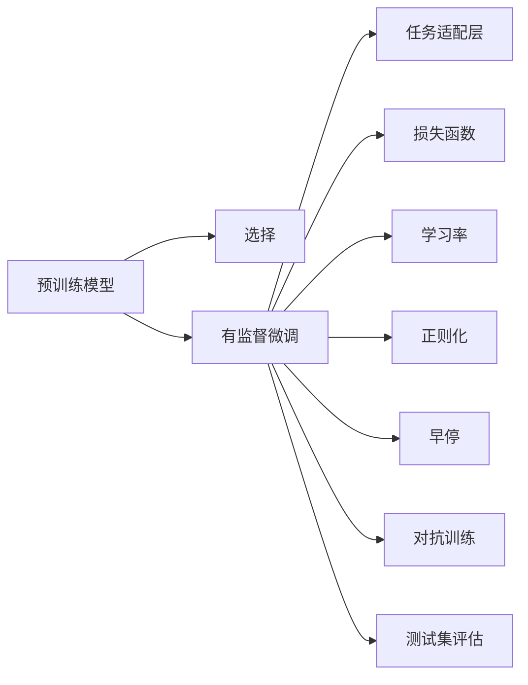

                 

# SFT：有监督的微调技术

> 关键词：SFT，有监督的微调，预训练，迁移学习，自然语言处理(NLP)

## 1. 背景介绍

### 1.1 问题由来
近年来，深度学习技术在自然语言处理(Natural Language Processing, NLP)领域取得了显著进展。大规模预训练语言模型如BERT、GPT等，在无监督预训练基础上通过有监督微调(Fine-tuning)，已经在情感分析、文本分类、问答系统、机器翻译等多个任务上取得了优异的表现。然而，这些预训练模型仍面临一些挑战：

1. **泛化能力不足**：尽管预训练模型在大规模数据上表现出色，但在特定领域或特定任务上可能性能不佳。
2. **成本高**：预训练和微调过程需要大量的计算资源和时间。
3. **过拟合问题**：微调过程中模型可能会过拟合少量标注数据。
4. **模型可解释性差**：微调后的模型通常被视为"黑盒"，难以解释其内部工作机制。

为解决这些问题，有监督的微调(Supervised Fine-tuning, SFT)技术应运而生。SFT利用预训练模型的知识，通过有监督数据进行微调，既提升了模型性能，又降低了标注成本，同时增强了模型的可解释性。

### 1.2 问题核心关键点
SFT的核心思想是：在预训练模型的基础上，通过少量有标注数据对模型进行微调，使其适应特定的下游任务。SFT的具体步骤包括：

- 选择合适的预训练模型作为初始化参数。
- 准备下游任务的标注数据集。
- 设计任务适配层，构建损失函数。
- 使用小学习率进行梯度下降，更新模型参数。
- 在验证集上进行早期停止，防止过拟合。
- 在测试集上评估微调后的模型性能。

通过SFT，大模型能够快速适应新的任务，并取得比从头训练更好的性能，同时保持了预训练模型的广泛知识。

### 1.3 问题研究意义
SFT技术的研发具有重要意义：

1. **降低开发成本**：SFT可以减少从头训练模型的需求，大幅降低数据标注和计算资源投入。
2. **提升模型性能**：通过微调，模型能够更好地适应特定任务，提升模型在实际应用中的效果。
3. **加速开发进程**：SFT使得模型开发周期缩短，加快技术迭代速度。
4. **推动NLP技术应用**：SFT技术能够使NLP技术更广泛地应用于各行各业，促进技术落地。
5. **技术创新**：SFT推动了对预训练和微调技术的深入研究，催生了提示学习、少样本学习等新研究方向。

## 2. 核心概念与联系

### 2.1 核心概念概述

SFT技术的核心概念包括：

- **预训练模型(Pre-trained Model)**：通过大规模无标签数据预训练得到的语言模型，如BERT、GPT等。
- **有监督微调(Supervised Fine-tuning)**：在预训练模型的基础上，通过有监督数据进行微调，使其适应特定的下游任务。
- **迁移学习(Transfer Learning)**：将预训练模型在其他任务上学习到的知识，迁移到新的任务上，减少新任务的学习负担。
- **学习率(Learning Rate)**：控制模型参数更新的速度，一般需要根据任务和数据规模调整。
- **正则化(Regularization)**：防止模型过拟合，包括L2正则、Dropout等。
- **早停(Early Stopping)**：在验证集上监测模型性能，防止过拟合。
- **对抗训练(Adversarial Training)**：加入对抗样本，提高模型的鲁棒性。

这些概念之间存在密切联系，共同构成了SFT的原理和实践框架。

### 2.2 核心概念原理和架构的 Mermaid 流程图



## 3. 核心算法原理 & 具体操作步骤

### 3.1 算法原理概述

SFT的原理是将预训练模型作为初始化参数，通过下游任务的标注数据进行微调，使得模型能够更好地适应特定任务。其核心公式如下：

$$
\theta^* = \mathop{\arg\min}_{\theta} \mathcal{L}(\theta, D)
$$

其中 $\theta$ 是模型参数，$D$ 是下游任务的标注数据集，$\mathcal{L}$ 是损失函数，通常采用交叉熵损失。

### 3.2 算法步骤详解

SFT的具体步骤包括：

1. **准备数据集**：收集并清洗下游任务的标注数据集，划分为训练集、验证集和测试集。

2. **初始化预训练模型**：选择一个预训练模型作为初始化参数。

3. **设计任务适配层**：根据任务类型，设计适当的输出层和损失函数。

4. **设置微调超参数**：包括学习率、批大小、迭代轮数等，选择合适的优化算法。

5. **执行梯度训练**：将训练集数据分批次输入模型，计算损失函数，更新模型参数。

6. **监测性能**：在验证集上定期监测模型性能，防止过拟合。

7. **测试和部署**：在测试集上评估微调后的模型性能，并部署到实际应用中。

### 3.3 算法优缺点

SFT的优点包括：

- **高效性**：可以利用预训练模型的知识，快速适应新任务。
- **普适性**：适用于各种NLP任务，设计简单的任务适配层即可。
- **鲁棒性**：通过正则化等技术，防止过拟合。
- **可解释性**：微调后的模型通常更容易解释和调试。

缺点包括：

- **依赖标注数据**：微调效果依赖于标注数据的质量和数量。
- **迁移能力有限**：对于目标任务与预训练数据分布差异较大的情况，微调效果可能不佳。
- **可能保留预训练模型的偏见**：预训练模型的偏见可能通过微调传递到下游任务。

### 3.4 算法应用领域

SFT技术已经在多个NLP任务上得到了广泛应用，包括：

- **文本分类**：如情感分析、主题分类等。
- **命名实体识别**：识别文本中的人名、地名、机构名等特定实体。
- **关系抽取**：从文本中抽取实体之间的语义关系。
- **问答系统**：对自然语言问题给出答案。
- **机器翻译**：将源语言文本翻译成目标语言。
- **文本摘要**：将长文本压缩成简短摘要。
- **对话系统**：使机器能够与人自然对话。

## 4. 数学模型和公式 & 详细讲解 & 举例说明

### 4.1 数学模型构建

假设预训练模型为 $M_{\theta}$，下游任务为 $T$，标注数据集为 $D=\{(x_i, y_i)\}_{i=1}^N$，其中 $x_i$ 为输入，$y_i$ 为输出。SFT的目标是最小化损失函数 $\mathcal{L}(\theta, D)$，其定义为：

$$
\mathcal{L}(\theta, D) = \frac{1}{N} \sum_{i=1}^N \ell(M_{\theta}(x_i), y_i)
$$

其中 $\ell$ 为损失函数，通常采用交叉熵损失。

### 4.2 公式推导过程

以二分类任务为例，推导交叉熵损失函数及其梯度的计算公式。

假设模型 $M_{\theta}$ 在输入 $x$ 上的输出为 $\hat{y}=M_{\theta}(x) \in [0,1]$，表示样本属于正类的概率。真实标签 $y \in \{0,1\}$。则二分类交叉熵损失函数定义为：

$$
\ell(M_{\theta}(x),y) = -[y\log \hat{y} + (1-y)\log (1-\hat{y})]
$$

将其代入经验风险公式，得：

$$
\mathcal{L}(\theta) = -\frac{1}{N}\sum_{i=1}^N [y_i\log M_{\theta}(x_i)+(1-y_i)\log(1-M_{\theta}(x_i))]
$$

根据链式法则，损失函数对参数 $\theta_k$ 的梯度为：

$$
\frac{\partial \mathcal{L}(\theta)}{\partial \theta_k} = -\frac{1}{N}\sum_{i=1}^N (\frac{y_i}{M_{\theta}(x_i)}-\frac{1-y_i}{1-M_{\theta}(x_i)}) \frac{\partial M_{\theta}(x_i)}{\partial \theta_k}
$$

其中 $\frac{\partial M_{\theta}(x_i)}{\partial \theta_k}$ 可进一步递归展开，利用自动微分技术完成计算。

### 4.3 案例分析与讲解

以情感分类任务为例，假设训练集为 $\{(x_1, y_1), (x_2, y_2), \ldots, (x_n, y_n)\}$，其中 $x_i$ 为输入文本，$y_i \in \{0,1\}$ 表示情感极性。

1. **数据预处理**：将文本转化为模型的输入格式，如token ids、注意力掩码等。
2. **模型初始化**：选择预训练模型BERT作为初始化参数。
3. **设计输出层**：添加线性分类器和交叉熵损失函数。
4. **优化器选择**：使用Adam优化器，学习率为 $2 \times 10^{-5}$。
5. **训练过程**：将训练集数据分批次输入模型，计算损失函数，更新模型参数。
6. **早停策略**：在验证集上监测模型性能，当性能不再提升时停止训练。
7. **测试集评估**：在测试集上评估模型性能，输出分类指标。

## 5. 项目实践：代码实例和详细解释说明

### 5.1 开发环境搭建

进行SFT实践前，需要准备好开发环境。以下是使用Python进行PyTorch开发的环境配置流程：

1. 安装Anaconda：从官网下载并安装Anaconda，用于创建独立的Python环境。

2. 创建并激活虚拟环境：
```bash
conda create -n pytorch-env python=3.8 
conda activate pytorch-env
```

3. 安装PyTorch：根据CUDA版本，从官网获取对应的安装命令。例如：
```bash
conda install pytorch torchvision torchaudio cudatoolkit=11.1 -c pytorch -c conda-forge
```

4. 安装Transformers库：
```bash
pip install transformers
```

5. 安装各类工具包：
```bash
pip install numpy pandas scikit-learn matplotlib tqdm jupyter notebook ipython
```

完成上述步骤后，即可在`pytorch-env`环境中开始SFT实践。

### 5.2 源代码详细实现

以下是使用PyTorch进行SFT实践的完整代码实现，包括数据准备、模型初始化、任务适配层设计、训练和评估过程。

```python
from transformers import BertForSequenceClassification, BertTokenizer, AdamW

# 定义数据集类
class NERDataset(Dataset):
    def __init__(self, texts, tags, tokenizer, max_len=128):
        self.texts = texts
        self.tags = tags
        self.tokenizer = tokenizer
        self.max_len = max_len
        
    def __len__(self):
        return len(self.texts)
    
    def __getitem__(self, item):
        text = self.texts[item]
        tags = self.tags[item]
        
        encoding = self.tokenizer(text, return_tensors='pt', max_length=self.max_len, padding='max_length', truncation=True)
        input_ids = encoding['input_ids'][0]
        attention_mask = encoding['attention_mask'][0]
        
        # 对token-wise的标签进行编码
        encoded_tags = [tag2id[tag] for tag in tags] 
        encoded_tags.extend([tag2id['O']] * (self.max_len - len(encoded_tags)))
        labels = torch.tensor(encoded_tags, dtype=torch.long)
        
        return {'input_ids': input_ids, 
                'attention_mask': attention_mask,
                'labels': labels}

# 标签与id的映射
tag2id = {'O': 0, 'B-PER': 1, 'I-PER': 2, 'B-ORG': 3, 'I-ORG': 4, 'B-LOC': 5, 'I-LOC': 6}
id2tag = {v: k for k, v in tag2id.items()}

# 创建dataset
tokenizer = BertTokenizer.from_pretrained('bert-base-cased')

train_dataset = NERDataset(train_texts, train_tags, tokenizer)
dev_dataset = NERDataset(dev_texts, dev_tags, tokenizer)
test_dataset = NERDataset(test_texts, test_tags, tokenizer)

# 定义模型和优化器
model = BertForSequenceClassification.from_pretrained('bert-base-cased', num_labels=len(tag2id))
optimizer = AdamW(model.parameters(), lr=2e-5)

# 定义训练和评估函数
device = torch.device('cuda') if torch.cuda.is_available() else torch.device('cpu')
model.to(device)

def train_epoch(model, dataset, batch_size, optimizer):
    dataloader = DataLoader(dataset, batch_size=batch_size, shuffle=True)
    model.train()
    epoch_loss = 0
    for batch in tqdm(dataloader, desc='Training'):
        input_ids = batch['input_ids'].to(device)
        attention_mask = batch['attention_mask'].to(device)
        labels = batch['labels'].to(device)
        model.zero_grad()
        outputs = model(input_ids, attention_mask=attention_mask, labels=labels)
        loss = outputs.loss
        epoch_loss += loss.item()
        loss.backward()
        optimizer.step()
    return epoch_loss / len(dataloader)

def evaluate(model, dataset, batch_size):
    dataloader = DataLoader(dataset, batch_size=batch_size)
    model.eval()
    preds, labels = [], []
    with torch.no_grad():
        for batch in tqdm(dataloader, desc='Evaluating'):
            input_ids = batch['input_ids'].to(device)
            attention_mask = batch['attention_mask'].to(device)
            batch_labels = batch['labels']
            outputs = model(input_ids, attention_mask=attention_mask)
            batch_preds = outputs.logits.argmax(dim=2).to('cpu').tolist()
            batch_labels = batch_labels.to('cpu').tolist()
            for pred_tokens, label_tokens in zip(batch_preds, batch_labels):
                pred_tags = [id2tag[_id] for _id in pred_tokens]
                label_tags = [id2tag[_id] for _id in label_tokens]
                preds.append(pred_tags[:len(label_tags)])
                labels.append(label_tags)
                
    print(classification_report(labels, preds))
```

### 5.3 代码解读与分析

**NERDataset类**：
- `__init__`方法：初始化文本、标签、分词器等关键组件。
- `__len__`方法：返回数据集的样本数量。
- `__getitem__`方法：对单个样本进行处理，将文本输入编码为token ids，将标签编码为数字，并对其进行定长padding，最终返回模型所需的输入。

**tag2id和id2tag字典**：
- 定义了标签与数字id之间的映射关系，用于将token-wise的预测结果解码回真实的标签。

**训练和评估函数**：
- 使用PyTorch的DataLoader对数据集进行批次化加载，供模型训练和推理使用。
- 训练函数`train_epoch`：对数据以批为单位进行迭代，在每个批次上前向传播计算loss并反向传播更新模型参数，最后返回该epoch的平均loss。
- 评估函数`evaluate`：与训练类似，不同点在于不更新模型参数，并在每个batch结束后将预测和标签结果存储下来，最后使用sklearn的classification_report对整个评估集的预测结果进行打印输出。

**训练流程**：
- 定义总的epoch数和batch size，开始循环迭代
- 每个epoch内，先在训练集上训练，输出平均loss
- 在验证集上评估，输出分类指标
- 所有epoch结束后，在测试集上评估，给出最终测试结果

## 6. 实际应用场景

### 6.1 智能客服系统

SFT技术可以广泛应用于智能客服系统的构建。传统客服往往需要配备大量人力，高峰期响应缓慢，且一致性和专业性难以保证。而使用SFT后的对话模型，可以7x24小时不间断服务，快速响应客户咨询，用自然流畅的语言解答各类常见问题。

在技术实现上，可以收集企业内部的历史客服对话记录，将问题和最佳答复构建成监督数据，在此基础上对预训练对话模型进行微调。微调后的对话模型能够自动理解用户意图，匹配最合适的答案模板进行回复。对于客户提出的新问题，还可以接入检索系统实时搜索相关内容，动态组织生成回答。如此构建的智能客服系统，能大幅提升客户咨询体验和问题解决效率。

### 6.2 金融舆情监测

金融机构需要实时监测市场舆论动向，以便及时应对负面信息传播，规避金融风险。传统的人工监测方式成本高、效率低，难以应对网络时代海量信息爆发的挑战。SFT的文本分类和情感分析技术，为金融舆情监测提供了新的解决方案。

具体而言，可以收集金融领域相关的新闻、报道、评论等文本数据，并对其进行主题标注和情感标注。在此基础上对预训练语言模型进行微调，使其能够自动判断文本属于何种主题，情感倾向是正面、中性还是负面。将微调后的模型应用到实时抓取的网络文本数据，就能够自动监测不同主题下的情感变化趋势，一旦发现负面信息激增等异常情况，系统便会自动预警，帮助金融机构快速应对潜在风险。

### 6.3 个性化推荐系统

当前的推荐系统往往只依赖用户的历史行为数据进行物品推荐，无法深入理解用户的真实兴趣偏好。SFT的个性化推荐系统可以更好地挖掘用户行为背后的语义信息，从而提供更精准、多样的推荐内容。

在实践中，可以收集用户浏览、点击、评论、分享等行为数据，提取和用户交互的物品标题、描述、标签等文本内容。将文本内容作为模型输入，用户的后续行为（如是否点击、购买等）作为监督信号，在此基础上微调预训练语言模型。微调后的模型能够从文本内容中准确把握用户的兴趣点。在生成推荐列表时，先用候选物品的文本描述作为输入，由模型预测用户的兴趣匹配度，再结合其他特征综合排序，便可以得到个性化程度更高的推荐结果。

## 7. 工具和资源推荐

### 7.1 学习资源推荐

为了帮助开发者系统掌握SFT的理论基础和实践技巧，这里推荐一些优质的学习资源：

1. 《Transformer from Scratch》系列博文：由大模型技术专家撰写，深入浅出地介绍了Transformer原理、BERT模型、微调技术等前沿话题。

2. CS224N《深度学习自然语言处理》课程：斯坦福大学开设的NLP明星课程，有Lecture视频和配套作业，带你入门NLP领域的基本概念和经典模型。

3. 《Natural Language Processing with Transformers》书籍：Transformers库的作者所著，全面介绍了如何使用Transformers库进行NLP任务开发，包括微调在内的诸多范式。

4. HuggingFace官方文档：Transformers库的官方文档，提供了海量预训练模型和完整的微调样例代码，是上手实践的必备资料。

5. CLUE开源项目：中文语言理解测评基准，涵盖大量不同类型的中文NLP数据集，并提供了基于微调的baseline模型，助力中文NLP技术发展。

通过对这些资源的学习实践，相信你一定能够快速掌握SFT的精髓，并用于解决实际的NLP问题。

### 7.2 开发工具推荐

高效的开发离不开优秀的工具支持。以下是几款用于SFT开发的常用工具：

1. PyTorch：基于Python的开源深度学习框架，灵活动态的计算图，适合快速迭代研究。大部分预训练语言模型都有PyTorch版本的实现。

2. TensorFlow：由Google主导开发的开源深度学习框架，生产部署方便，适合大规模工程应用。同样有丰富的预训练语言模型资源。

3. Transformers库：HuggingFace开发的NLP工具库，集成了众多SOTA语言模型，支持PyTorch和TensorFlow，是进行SFT任务开发的利器。

4. Weights & Biases：模型训练的实验跟踪工具，可以记录和可视化模型训练过程中的各项指标，方便对比和调优。与主流深度学习框架无缝集成。

5. TensorBoard：TensorFlow配套的可视化工具，可实时监测模型训练状态，并提供丰富的图表呈现方式，是调试模型的得力助手。

6. Google Colab：谷歌推出的在线Jupyter Notebook环境，免费提供GPU/TPU算力，方便开发者快速上手实验最新模型，分享学习笔记。

合理利用这些工具，可以显著提升SFT任务的开发效率，加快创新迭代的步伐。

### 7.3 相关论文推荐

SFT技术的研发源于学界的持续研究。以下是几篇奠基性的相关论文，推荐阅读：

1. Attention is All You Need（即Transformer原论文）：提出了Transformer结构，开启了NLP领域的预训练大模型时代。

2. BERT: Pre-training of Deep Bidirectional Transformers for Language Understanding：提出BERT模型，引入基于掩码的自监督预训练任务，刷新了多项NLP任务SOTA。

3. Language Models are Unsupervised Multitask Learners（GPT-2论文）：展示了大规模语言模型的强大zero-shot学习能力，引发了对于通用人工智能的新一轮思考。

4. Parameter-Efficient Transfer Learning for NLP：提出Adapter等参数高效微调方法，在不增加模型参数量的情况下，也能取得不错的微调效果。

5. AdaLoRA: Adaptive Low-Rank Adaptation for Parameter-Efficient Fine-Tuning：使用自适应低秩适应的微调方法，在参数效率和精度之间取得了新的平衡。

6. Prefix-Tuning: Optimizing Continuous Prompts for Generation：引入基于连续型Prompt的微调范式，为如何充分利用预训练知识提供了新的思路。

这些论文代表了大模型微调技术的发展脉络。通过学习这些前沿成果，可以帮助研究者把握学科前进方向，激发更多的创新灵感。

## 8. 总结：未来发展趋势与挑战

### 8.1 总结

本文对SFT技术进行了全面系统的介绍。首先阐述了SFT技术的背景和意义，明确了SFT在微调大模型过程中不可或缺的作用。其次，从原理到实践，详细讲解了SFT的数学原理和关键步骤，给出了SFT任务开发的完整代码实例。同时，本文还广泛探讨了SFT技术在智能客服、金融舆情、个性化推荐等多个行业领域的应用前景，展示了SFT技术的巨大潜力。此外，本文精选了SFT技术的各类学习资源，力求为读者提供全方位的技术指引。

通过本文的系统梳理，可以看到，SFT技术在大模型微调中占据重要地位，能够高效、灵活地适应新任务，提升模型性能。未来，伴随SFT技术的进一步发展，NLP技术将在更多领域得到应用，为人工智能落地应用提供更强大的支持。

### 8.2 未来发展趋势

展望未来，SFT技术将呈现以下几个发展趋势：

1. **参数高效微调**：开发更多参数高效的微调方法，如AdaLoRA、Prefix等，在固定大部分预训练参数的情况下，只更新极少量的任务相关参数。

2. **多模态微调**：将视觉、语音等多模态信息与文本信息进行融合，增强模型的综合感知能力。

3. **持续学习**：SFT模型能够持续从新数据中学习，同时保持已学习的知识，避免灾难性遗忘。

4. **无监督和半监督学习**：探索更多无监督和半监督的微调方法，如自监督预训练、主动学习等，降低微调对标注数据的依赖。

5. **对抗训练和鲁棒性提升**：引入对抗训练等技术，提高模型的鲁棒性和泛化能力。

6. **知识库融合**：将符号化的先验知识，如知识图谱、逻辑规则等，与神经网络模型进行融合，提升模型的知识整合能力。

以上趋势凸显了SFT技术的广阔前景。这些方向的探索发展，将进一步提升SFT模型的性能和应用范围，为人工智能技术带来新的突破。

### 8.3 面临的挑战

尽管SFT技术已经取得了显著成效，但在实现全面落地应用的过程中，仍面临诸多挑战：

1. **数据标注成本高**：对于长尾应用场景，难以获得充足的高质量标注数据，成为制约SFT性能提升的瓶颈。

2. **模型泛化能力不足**：SFT模型面对域外数据时，泛化性能可能不佳。

3. **推理效率问题**：大模型推理速度慢，内存占用大，效率问题亟待解决。

4. **模型可解释性差**：微调后的模型通常难以解释，难以提供可信的输出依据。

5. **模型安全性问题**：SFT模型可能学习到有害信息，带来潜在的安全隐患。

6. **跨领域迁移能力有限**：SFT模型在目标任务与预训练数据分布差异较大的情况下，性能可能受限。

正视这些挑战，积极应对并寻求突破，将是大模型微调走向成熟的必由之路。相信随着学界和产业界的共同努力，这些挑战终将一一被克服，SFT技术必将在构建人机协同的智能时代中扮演越来越重要的角色。

### 8.4 研究展望

面对SFT面临的挑战，未来的研究需要在以下几个方面寻求新的突破：

1. **无监督和半监督学习**：探索更多无监督和半监督的微调方法，降低微调对标注数据的依赖。

2. **多模态融合**：将视觉、语音等多模态信息与文本信息进行融合，增强模型的综合感知能力。

3. **知识库融合**：将符号化的先验知识，如知识图谱、逻辑规则等，与神经网络模型进行融合，提升模型的知识整合能力。

4. **对抗训练和鲁棒性提升**：引入对抗训练等技术，提高模型的鲁棒性和泛化能力。

5. **模型压缩与优化**：通过模型压缩、稀疏化等方法，提升SFT模型的推理效率。

6. **可解释性增强**：开发可解释性更强的SFT模型，提升模型的透明度和可信度。

这些研究方向的探索，将引领SFT技术迈向更高的台阶，为构建安全、可靠、可解释、可控的智能系统铺平道路。面向未来，SFT技术还需要与其他人工智能技术进行更深入的融合，如知识表示、因果推理、强化学习等，多路径协同发力，共同推动自然语言理解和智能交互系统的进步。只有勇于创新、敢于突破，才能不断拓展语言模型的边界，让智能技术更好地造福人类社会。

## 9. 附录：常见问题与解答

**Q1：SFT是否适用于所有NLP任务？**

A: SFT在大多数NLP任务上都能取得不错的效果，特别是对于数据量较小的任务。但对于一些特定领域的任务，如医学、法律等，仅仅依靠通用语料预训练的模型可能难以很好地适应。此时需要在特定领域语料上进一步预训练，再进行微调，才能获得理想效果。此外，对于一些需要时效性、个性化很强的任务，如对话、推荐等，SFT方法也需要针对性的改进优化。

**Q2：如何选择合适的学习率？**

A: SFT的学习率一般要比预训练时小1-2个数量级，如果使用过大的学习率，容易破坏预训练权重，导致过拟合。一般建议从1e-5开始调参，逐步减小学习率，直至收敛。也可以使用warmup策略，在开始阶段使用较小的学习率，再逐渐过渡到预设值。需要注意的是，不同的优化器(如AdamW、Adafactor等)以及不同的学习率调度策略，可能需要设置不同的学习率阈值。

**Q3：SFT在微调过程中如何缓解过拟合问题？**

A: 过拟合是SFT面临的主要挑战，尤其是在标注数据不足的情况下。常见的缓解策略包括：
1. 数据增强：通过回译、近义替换等方式扩充训练集
2. 正则化：使用L2正则、Dropout、Early Stopping等防止过拟合
3. 对抗训练：引入对抗样本，提高模型鲁棒性
4. 参数高效微调：只调整少量参数(如Adapter、Prefix等)，减小过拟合风险
5. 多模型集成：训练多个SFT模型，取平均输出，抑制过拟合

这些策略往往需要根据具体任务和数据特点进行灵活组合。只有在数据、模型、训练、推理等各环节进行全面优化，才能最大限度地发挥SFT的威力。

**Q4：SFT在实际部署时需要注意哪些问题？**

A: 将SFT模型转化为实际应用，还需要考虑以下因素：
1. 模型裁剪：去除不必要的层和参数，减小模型尺寸，加快推理速度
2. 量化加速：将浮点模型转为定点模型，压缩存储空间，提高计算效率
3. 服务化封装：将模型封装为标准化服务接口，便于集成调用
4. 弹性伸缩：根据请求流量动态调整资源配置，平衡服务质量和成本
5. 监控告警：实时采集系统指标，设置异常告警阈值，确保服务稳定性
6. 安全防护：采用访问鉴权、数据脱敏等措施，保障数据和模型安全

SFT技术能够使NLP应用变得更加高效、灵活，但如何将强大的性能转化为稳定、高效、安全的业务价值，还需要工程实践的不断打磨。唯有从数据、算法、工程、业务等多个维度协同发力，才能真正实现人工智能技术在垂直行业的规模化落地。

总之，SFT需要开发者根据具体任务，不断迭代和优化模型、数据和算法，方能得到理想的效果。

---

作者：禅与计算机程序设计艺术 / Zen and the Art of Computer Programming

