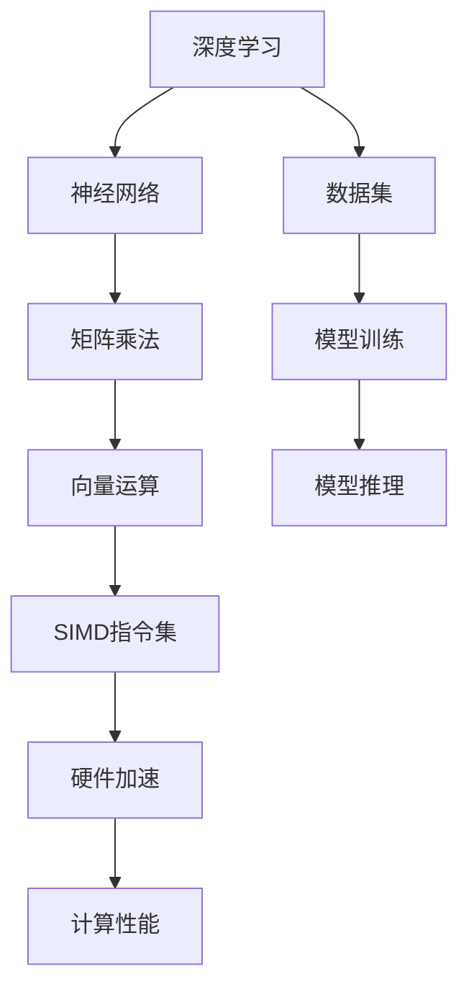

                 

# SIMD指令集：AI硬件加速的底层魔法

> 关键词：SIMD指令集, 向量运算, 矩阵乘法, 深度学习, 神经网络, 硬件加速, 计算性能, 并行计算

## 1. 背景介绍

### 1.1 问题由来
随着人工智能（AI）技术的迅猛发展，深度学习模型的复杂度不断提升，计算需求激增，传统的通用CPU在处理密集计算时，性能瓶颈愈发明显。与此同时，AI硬件加速技术日渐成熟，各类AI专用芯片应运而生，如GPU、TPU、FPGA等。这些芯片在设计之初，即考虑了深度学习算法的高效实现，拥有卓越的计算性能和能效比。

**问：为什么使用AI硬件加速？**
答：由于深度学习模型往往包含大量的矩阵运算、向量运算等，通用CPU在这类计算上存在效率低下的问题，而AI硬件加速器通常设计有专用的计算单元，能够有效提升计算性能，缩短模型训练和推理的耗时，并大幅降低能耗。

## 2. 核心概念与联系

### 2.1 核心概念概述

为更好地理解SIMD指令集及其在AI硬件加速中的应用，本节将介绍几个关键概念：

- **SIMD指令集(Single Instruction Multiple Data)**：一种并行计算指令集，能够在单个时钟周期内同时处理多个数据元素，从而提高计算效率。

- **向量运算(Vector Operations)**：以向量为操作对象的一种数学计算，与标量运算相对，常用于机器学习中大规模矩阵运算和特征处理。

- **矩阵乘法(Matrix Multiplication)**：多维数组之间的乘法运算，深度学习中卷积、循环神经网络（RNN）、全连接网络（FCN）等核心操作均涉及矩阵乘法。

- **深度学习(Deep Learning)**：一种基于神经网络的机器学习技术，广泛用于图像识别、自然语言处理、语音识别等领域。

- **神经网络(Neural Network)**：由大量神经元（节点）组成的计算网络，通过学习大量数据集的模式，实现复杂模式识别和预测。

- **硬件加速(Hardware Acceleration)**：利用专门的硬件计算单元，实现比通用CPU更高的计算效率和能效比。

- **计算性能(Computational Performance)**：衡量计算任务完成速度的指标，常以每秒执行的指令数（IPS）或每秒执行的浮点数（FLOPS）来表示。

- **并行计算(Parallel Computing)**：通过多个计算单元同时执行相同或不同的计算任务，实现计算效率的提升。

这些概念之间通过以下Mermaid流程图相互联系：



该图展示了大规模机器学习任务中各核心概念的相互关系：

1. 深度学习模型基于神经网络进行构建。
2. 神经网络中的核心操作包括矩阵乘法和向量运算。
3. 使用SIMD指令集进行向量运算，提升计算效率。
4. 将SIMD指令集应用到硬件加速器上，进一步提高计算性能。
5. 计算性能通过模型训练和推理任务进行量化评估。

## 3. 核心算法原理 & 具体操作步骤

### 3.1 算法原理概述

深度学习模型中，许多操作如矩阵乘法、卷积、激活函数等，本质上是向量或矩阵之间的计算。这些计算可以通过并行化处理，显著提升性能。为此，现代硬件加速器设计了专门的SIMD指令集，可以在单个时钟周期内同时处理多个数据元素，从而提高并行计算的效率。

以矩阵乘法为例，假设$A$和$B$是两个矩阵，其中$A$为$m \times k$，$B$为$k \times n$，则矩阵乘法$C=A \times B$计算的输出矩阵$C$为$m \times n$。在传统CPU上，需要进行$m \times n$次标量乘法，而使用SIMD指令集，则可以在单个指令周期内同时处理多个元素，从而极大提升计算速度。

### 3.2 算法步骤详解

具体地，向量运算和矩阵乘法的操作流程如下：

1. **数据准备**：将输入的矩阵数据按列或行方向划分为若干子矩阵，每个子矩阵的大小与SIMD指令集支持的向量长度一致。

2. **向量运算**：使用SIMD指令集中的向量乘法指令，对子矩阵中的元素进行向量级运算，生成中间结果。

3. **累加和归一**：将向量级运算的结果进行累加和归一操作，得到最终输出矩阵。

4. **存储和传输**：将计算结果存储到内存中，并通过高速接口传输到计算单元或其他模块。

**问：如何使用SIMD指令集进行矩阵乘法？**
答：在硬件设计上，SIMD指令集通常包含多个向量乘法器，能够在同一时钟周期内对多个元素进行乘法运算。在软件层面，编译器将矩阵乘法操作编译成SIMD指令，硬件直接并行处理多个元素，从而提高计算速度。

### 3.3 算法优缺点

使用SIMD指令集进行AI硬件加速有以下优点：

1. **高并行性**：SIMD指令集能够在单个时钟周期内同时处理多个数据元素，显著提升计算效率。
2. **高性能**：硬件加速器通过优化SIMD指令集，能够实现比通用CPU更高的计算性能和能效比。
3. **灵活性**：SIMD指令集支持多种数据类型和计算操作，适应广泛的应用场景。
4. **可扩展性**：随着硬件技术的发展，SIMD指令集的可扩展性非常强，能够满足未来计算需求的增长。

同时，SIMD指令集也存在以下缺点：

1. **资源消耗高**：为了实现高并行性，SIMD指令集需要设计更多的硬件资源和电路，增加了芯片的设计和生产成本。
2. **设计复杂度**：SIMD指令集的设计和优化需要极高的硬件设计水平，难度较大。
3. **编程复杂性**：SIMD指令集的并行化操作要求程序员具备较强的向量编程能力，编写和优化算法需要较高的时间和技能投入。
4. **硬件复杂性**：SIMD指令集需要在硬件层面进行优化，不同架构的芯片需要定制化的设计和编译工具。

### 3.4 算法应用领域

SIMD指令集在AI硬件加速中的应用非常广泛，主要包括以下几个领域：

1. **深度学习模型训练**：如卷积神经网络（CNN）、循环神经网络（RNN）、全连接网络（FCN）等，其中卷积、矩阵乘法、激活函数等核心操作均可以通过SIMD指令集进行高效计算。

2. **计算机视觉**：图像识别、目标检测、图像分割等任务中，大量图像数据的处理和分析需要高效并行计算，SIMD指令集提供了强有力的支持。

3. **自然语言处理**：语言模型的构建、文本向量化、词嵌入等操作，SIMD指令集也能显著提升计算效率。

4. **语音识别**：音频信号的频谱分析、特征提取等操作，SIMD指令集同样能提供高效的计算支持。

5. **推荐系统**：基于深度学习模型的推荐算法，需要处理大规模用户行为数据，SIMD指令集能够提升矩阵运算和特征处理的效率。

6. **物联网**：传感器数据处理、边缘计算等任务中，SIMD指令集同样具有重要的应用价值。

此外，在科学研究、生物信息学、天气预测等领域，SIMD指令集同样有广泛的潜在应用。

## 4. 数学模型和公式 & 详细讲解 & 举例说明

### 4.1 数学模型构建

在深度学习中，矩阵乘法和向量运算是最基本的操作之一。以矩阵乘法为例，假设输入矩阵$A$和$B$大小分别为$m \times k$和$k \times n$，则矩阵乘积$C=A \times B$大小为$m \times n$。设$A$的元素为$a_{ij}$，$B$的元素为$b_{ij}$，则$C$的元素$c_{ij}$计算公式为：

$$
c_{ij}=\sum_{k=1}^{k}a_{ik}b_{kj}
$$

使用SIMD指令集进行矩阵乘法时，需要按列方向将$A$和$B$分割成若干子矩阵，每个子矩阵的大小与SIMD指令集支持的向量长度一致。

### 4.2 公式推导过程

以4D矩阵乘法为例，设$A$和$B$大小分别为$m \times k \times s \times p$和$k \times n \times p \times q$，则矩阵乘积$C$大小为$m \times n \times s \times q$。

假设使用SIMD指令集处理$A$和$B$的每个子矩阵，每个子矩阵大小为$n \times p$，则计算公式可以分解为：

$$
c_{ijrs}=\sum_{c=1}^{p}a_{ics}b_{csj}
$$

在硬件实现时，SIMD指令集会通过并行计算多个子矩阵，每个向量乘法器处理$m \times n$个元素，从而提升计算速度。

### 4.3 案例分析与讲解

以下是一个使用SIMD指令集进行矩阵乘法的伪代码实现：

```c
for (r = 0; r < s; r++) {
    for (j = 0; j < n; j++) {
        for (i = 0; i < m; i++) {
            for (k = 0; k < p; k++) {
                c[i][j][r][k] += a[i][k][r][s] * b[k][j][s][k];
            }
        }
    }
}
```

该代码使用4层嵌套循环，分别处理矩阵$A$和$B$的每个元素，计算矩阵$C$。为了实现并行计算，可以使用SIMD指令集中的向量乘法器，将多个元素同时进行计算，从而提升计算效率。

## 5. 项目实践：代码实例和详细解释说明

### 5.1 开发环境搭建

使用SIMD指令集进行AI硬件加速的开发，需要配置以下开发环境：

1. **编程语言**：使用C/C++或Fortran语言编写，这些语言对硬件控制和向量编程支持良好。
2. **开发工具**：安装Visual Studio、GCC或Clang编译器，以及相关的调试工具和性能分析工具。
3. **硬件平台**：选择支持SIMD指令集的硬件平台，如NVIDIA GPU、Intel Xeon Phi、IBM Power8等。

### 5.2 源代码详细实现

以下是一个使用SIMD指令集进行矩阵乘法的示例代码：

```c
#include <stdio.h>
#include <immintrin.h>

void matrix_multiply(int m, int n, int s, int p, float a[], float b[], float c[]) {
    for (int r = 0; r < s; r++) {
        for (int j = 0; j < n; j++) {
            for (int i = 0; i < m; i++) {
                __m256 sum = _mm256_setzero_ps();
                for (int k = 0; k < p; k++) {
                    __m256 a_vector = _mm256_load_ps(&a[i][k][r][s]);
                    __m256 b_vector = _mm256_load_ps(&b[k][j][s][k]);
                    sum = _mm256_fmadd_ps(a_vector, b_vector, sum);
                }
                __m256 c_vector = _mm256_add_ps(sum, _mm256_load_ps(&c[i][j][r][0]));
                _mm256_store_ps(&c[i][j][r][0], c_vector);
            }
        }
    }
}
```

该代码使用SIMD指令集中的`_mm256_setzero_ps`和`_mm256_load_ps`函数，将矩阵$A$和$B$加载到向量中，使用`_mm256_fmadd_ps`函数进行向量级乘法，最终将结果存回矩阵$C$中。

### 5.3 代码解读与分析

在上述代码中，`__m256`是AVX2指令集支持的256位向量类型，`_mm256_load_ps`和`_mm256_store_ps`函数用于加载和存储向量。通过这些函数，代码能够在单个指令周期内同时处理多个浮点数，从而提高计算效率。

## 6. 实际应用场景

### 6.1 深度学习模型训练

在深度学习模型训练中，矩阵乘法和向量运算是最常见的计算操作。使用SIMD指令集可以显著提升这些操作的计算效率，加速模型训练过程。

以卷积神经网络（CNN）为例，其核心操作是卷积运算。假设输入特征图大小为$w \times h \times c$，卷积核大小为$s \times s$，输出特征图大小为$m \times n$。则卷积运算计算公式为：

$$
C_{ij}=\sum_{r=0}^{s-1}\sum_{c=0}^{c-1}A_{r+(i-1)s+c,j+(j-1)s+c}*B_{r,c}
$$

使用SIMD指令集可以并行处理多个卷积核，从而提升计算速度。

### 6.2 图像处理

在图像处理中，大量图像数据的处理和分析需要高效并行计算。使用SIMD指令集可以显著提升图像滤波、边缘检测、特征提取等操作的计算效率。

### 6.3 信号处理

在信号处理中，音频信号的频谱分析、滤波等操作也需要高效并行计算。使用SIMD指令集可以提升信号处理的计算速度。

### 6.4 未来应用展望

随着AI硬件加速技术的不断发展，SIMD指令集的应用将更加广泛。未来，SIMD指令集将在更多领域得到应用，为传统行业带来变革性影响。

在智慧医疗领域，基于SIMD指令集的图像处理、特征提取等技术，可以提升医疗影像诊断的准确性和效率。

在智能制造领域，使用SIMD指令集进行大规模数据分析和特征提取，可以实现智能制造、智能检测等功能。

在自动驾驶领域，基于SIMD指令集的图像处理和特征提取，可以提升自动驾驶系统的感知和决策能力。

此外，在科学研究、生物信息学、天气预测等领域，SIMD指令集同样有广泛的潜在应用。

## 7. 工具和资源推荐

### 7.1 学习资源推荐

为了帮助开发者系统掌握SIMD指令集及其在AI硬件加速中的应用，这里推荐一些优质的学习资源：

1. **《CUDA并行编程》**：由NVIDIA开发的并行计算编程指南，涵盖了GPU硬件架构、CUDA语言和并行计算技巧等。

2. **《GPU加速深度学习》**：由DeepMind工程师编写的深度学习实战指南，介绍了如何在GPU上进行高效的深度学习计算。

3. **《Xeon Phi并行编程》**：由英特尔开发的多核并行计算编程指南，介绍了在Xeon Phi平台上的并行计算编程技巧。

4. **《Power8并行编程》**：由IBM工程师编写的Power8平台编程指南，介绍了在Power8平台上的并行计算编程技巧。

5. **在线课程和教程**：如Coursera、Udacity等平台提供的并行计算和深度学习课程，系统讲解了SIMD指令集在硬件加速中的应用。

通过这些资源的学习实践，相信你一定能够快速掌握SIMD指令集的精髓，并用于解决实际的AI硬件加速问题。

### 7.2 开发工具推荐

高效的软件开发离不开优秀的工具支持。以下是几款用于SIMD指令集开发的常用工具：

1. **编译器**：如GCC、Clang等，支持SIMD指令集的编译，能够生成高效的机器码。
2. **调试工具**：如GDB、LLVM等，能够帮助开发者定位代码中的性能瓶颈，进行优化。
3. **性能分析工具**：如Valgrind、Perf等，能够实时监测程序的性能，帮助开发者优化算法和数据结构。

合理利用这些工具，可以显著提升SIMD指令集开发的效率，加快创新迭代的步伐。

### 7.3 相关论文推荐

SIMD指令集在AI硬件加速中的应用研究始于学界的持续研究。以下是几篇奠基性的相关论文，推荐阅读：

1. **《Accelerated Algorithms for Deep Learning》**：介绍了使用SIMD指令集进行深度学习计算的算法和实现技巧。

2. **《SIMD-Enhanced Matrix Operations for Heterogeneous Manycore Architectures》**：介绍了在多核平台上的SIMD增强矩阵运算算法。

3. **《High-Performance Matrix Computations for Deep Learning》**：介绍了在GPU平台上的高并行性矩阵计算方法。

4. **《Efficient Parallel Computation of Convolutional Neural Networks》**：介绍了在GPU平台上进行卷积神经网络计算的高效算法。

这些论文代表了大规模机器学习任务中SIMD指令集的研究进展，为深度学习硬件加速提供了丰富的理论和实践参考。

## 8. 总结：未来发展趋势与挑战

### 8.1 研究成果总结

通过本文的系统梳理，可以看到，使用SIMD指令集进行AI硬件加速具有广阔的应用前景，能够显著提升深度学习模型的计算效率和性能。

### 8.2 未来发展趋势

展望未来，SIMD指令集在AI硬件加速中的应用将呈现以下几个发展趋势：

1. **更强的并行性**：随着硬件架构和设计技术的不断发展，SIMD指令集的并行性将进一步提升，能够处理更大规模的计算任务。
2. **更高的计算效率**：通过优化SIMD指令集和硬件加速器设计，将实现更高的计算性能和能效比。
3. **更广泛的应用领域**：SIMD指令集将在更多领域得到应用，推动AI技术在各个行业的落地。
4. **更高的可扩展性**：随着硬件技术的发展，SIMD指令集的可扩展性将进一步增强，能够满足未来计算需求的增长。

### 8.3 面临的挑战

尽管使用SIMD指令集进行AI硬件加速取得了显著成效，但在迈向更加智能化、普适化应用的过程中，它仍面临诸多挑战：

1. **编程复杂性**：SIMD指令集的并行化操作要求程序员具备较强的向量编程能力，编写和优化算法需要较高的时间和技能投入。
2. **硬件复杂性**：SIMD指令集需要在硬件层面进行优化，不同架构的芯片需要定制化的设计和编译工具。
3. **资源消耗高**：为了实现高并行性，SIMD指令集需要设计更多的硬件资源和电路，增加了芯片的设计和生产成本。
4. **应用门槛高**：由于SIMD指令集在硬件加速中的广泛应用，其应用门槛较高，需要投入大量资源进行研发和部署。

### 8.4 研究展望

面向未来，在大规模机器学习任务中，SIMD指令集的应用将不断深入。以下的研究方向值得进一步探索：

1. **优化SIMD指令集**：通过硬件架构优化和算法设计，提升SIMD指令集的计算效率和能效比。
2. **多核并行计算**：利用多核平台进行SIMD增强计算，提升计算速度和性能。
3. **混合计算模式**：结合通用CPU和AI硬件加速器，实现混合计算模式，提升计算效率和可扩展性。
4. **跨平台兼容性**：研究跨平台SIMD指令集设计和优化，提升代码的可移植性和兼容性。
5. **可解释性增强**：增强SIMD指令集的计算过程的可解释性，帮助开发者更好地理解和优化算法。

这些研究方向将推动SIMD指令集在AI硬件加速中的进一步应用和发展，为构建更加高效、普适的AI系统铺平道路。

## 9. 附录：常见问题与解答

**Q1：使用SIMD指令集进行AI硬件加速的优势是什么？**

A: 使用SIMD指令集进行AI硬件加速的主要优势包括：

1. **高并行性**：SIMD指令集能够在单个时钟周期内同时处理多个数据元素，显著提升计算效率。
2. **高性能**：硬件加速器通过优化SIMD指令集，能够实现比通用CPU更高的计算性能和能效比。
3. **灵活性**：SIMD指令集支持多种数据类型和计算操作，适应广泛的应用场景。
4. **可扩展性**：随着硬件技术的发展，SIMD指令集的可扩展性非常强，能够满足未来计算需求的增长。

**Q2：使用SIMD指令集进行AI硬件加速需要解决哪些问题？**

A: 使用SIMD指令集进行AI硬件加速需要解决以下问题：

1. **编程复杂性**：SIMD指令集的并行化操作要求程序员具备较强的向量编程能力，编写和优化算法需要较高的时间和技能投入。
2. **硬件复杂性**：SIMD指令集需要在硬件层面进行优化，不同架构的芯片需要定制化的设计和编译工具。
3. **资源消耗高**：为了实现高并行性，SIMD指令集需要设计更多的硬件资源和电路，增加了芯片的设计和生产成本。
4. **应用门槛高**：由于SIMD指令集在硬件加速中的广泛应用，其应用门槛较高，需要投入大量资源进行研发和部署。

**Q3：如何使用SIMD指令集进行高效计算？**

A: 使用SIMD指令集进行高效计算需要遵循以下步骤：

1. **数据准备**：将输入的矩阵数据按列或行方向划分为若干子矩阵，每个子矩阵的大小与SIMD指令集支持的向量长度一致。
2. **向量运算**：使用SIMD指令集中的向量乘法指令，对子矩阵中的元素进行向量级运算，生成中间结果。
3. **累加和归一**：将向量级运算的结果进行累加和归一操作，得到最终输出矩阵。
4. **存储和传输**：将计算结果存储到内存中，并通过高速接口传输到计算单元或其他模块。

**Q4：SIMD指令集的应用有哪些？**

A: SIMD指令集在AI硬件加速中的应用非常广泛，主要包括以下几个领域：

1. **深度学习模型训练**：如卷积神经网络（CNN）、循环神经网络（RNN）、全连接网络（FCN）等，其中卷积、矩阵乘法、激活函数等核心操作均可以通过SIMD指令集进行高效计算。
2. **计算机视觉**：图像识别、目标检测、图像分割等任务中，大量图像数据的处理和分析需要高效并行计算，SIMD指令集提供了强有力的支持。
3. **自然语言处理**：语言模型的构建、文本向量化、词嵌入等操作，SIMD指令集也能显著提升计算效率。
4. **语音识别**：音频信号的频谱分析、特征提取等操作，SIMD指令集同样能提供高效的计算支持。
5. **推荐系统**：基于深度学习模型的推荐算法，需要处理大规模用户行为数据，SIMD指令集能够提升矩阵运算和特征处理的效率。

**Q5：SIMD指令集的优缺点有哪些？**

A: SIMD指令集在AI硬件加速中的应用具有以下优缺点：

优点：

1. **高并行性**：能够在单个时钟周期内同时处理多个数据元素，显著提升计算效率。
2. **高性能**：硬件加速器通过优化SIMD指令集，能够实现比通用CPU更高的计算性能和能效比。
3. **灵活性**：支持多种数据类型和计算操作，适应广泛的应用场景。
4. **可扩展性**：随着硬件技术的发展，SIMD指令集的可扩展性非常强，能够满足未来计算需求的增长。

缺点：

1. **资源消耗高**：需要设计更多的硬件资源和电路，增加了芯片的设计和生产成本。
2. **设计复杂度**：需要极高的硬件设计水平，设计优化难度较大。
3. **编程复杂性**：程序员需要具备较强的向量编程能力，编写和优化算法需要较高的时间和技能投入。
4. **硬件复杂性**：不同架构的芯片需要定制化的设计和编译工具，应用门槛较高。

---

作者：禅与计算机程序设计艺术 / Zen and the Art of Computer Programming

