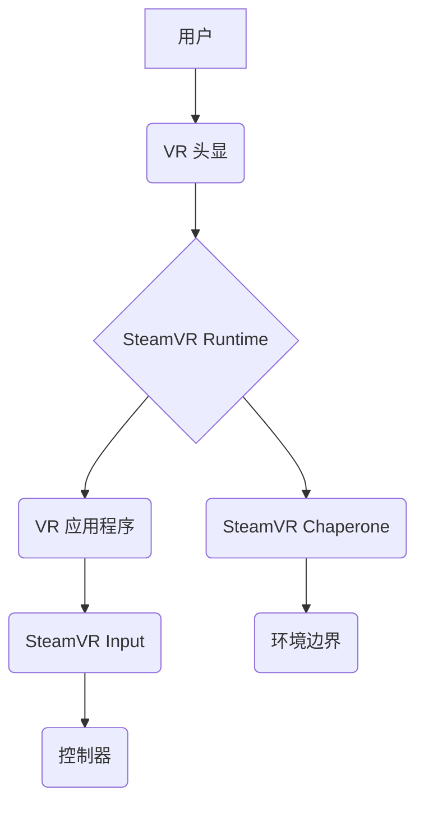

                 

## SteamVR 集成：在 Steam 平台上发布 VR 内容

> 关键词：SteamVR, VR开发, Unity, Unreal Engine, OpenVR,  C# , C++,  VR应用

## 1. 背景介绍

虚拟现实 (VR) 技术近年来发展迅速，为游戏、教育、医疗等领域带来了革命性的改变。Steam 平台作为全球最大的 PC 游戏平台之一，拥有庞大的用户群体和完善的生态系统，为 VR 内容的发布提供了绝佳的舞台。SteamVR 是 Valve 公司开发的 VR 头显和控制器驱动框架，为开发者提供了丰富的 API 和工具，简化了 VR 内容的开发和发布流程。

本文将深入探讨 SteamVR 集成的原理、流程和最佳实践，帮助开发者了解如何将 VR 内容发布到 Steam 平台，并为开发者提供一些有价值的建议和资源。

## 2. 核心概念与联系

SteamVR 构建了一个完整的 VR 生态系统，包括硬件、软件和平台服务。

**2.1 核心概念**

* **OpenVR:** SteamVR 基于 OpenVR 标准，这是一个开放的 VR API，允许开发者使用多种 VR 头显和控制器。
* **SteamVR Runtime:** SteamVR Runtime 是运行在 PC 上的软件，负责管理 VR 头显、控制器和应用程序之间的交互。
* **SteamVR SDK:** SteamVR SDK 提供了丰富的 API 和工具，帮助开发者开发 VR 应用程序。
* **SteamVR Input:** SteamVR Input 提供了一种标准化的方式来映射用户输入到 VR 应用程序中。
* **SteamVR Chaperone:** SteamVR Chaperone 是一个安全功能，可以帮助用户在虚拟环境中避免碰撞到现实世界中的物体。

**2.2 架构图**



## 3. 核心算法原理 & 具体操作步骤

SteamVR 的核心算法主要围绕着 VR 头显和控制器的跟踪、渲染和交互。

### 3.1 算法原理概述

* **跟踪算法:** SteamVR 使用传感器和算法来跟踪 VR 头显和控制器的运动，并将其转换为虚拟空间中的坐标。常用的跟踪算法包括基于视觉的跟踪、基于惯性测量单元 (IMU) 的跟踪和基于超声波的跟踪。
* **渲染算法:** SteamVR 使用 3D 渲染技术将虚拟场景渲染到 VR 头显上。渲染算法需要考虑 VR 头显的视野、分辨率和刷新率等因素。
* **交互算法:** SteamVR 提供了多种交互方式，例如手柄跟踪、手势识别和语音识别。交互算法将用户的输入转换为虚拟空间中的动作。

### 3.2 算法步骤详解

1. **跟踪:** VR 头显和控制器上的传感器不断采集数据，例如位置、姿态和加速度。
2. **数据处理:** SteamVR Runtime 将传感器数据进行处理，并使用跟踪算法计算出 VR 头显和控制器的当前位置和姿态。
3. **渲染:** 根据 VR 头显的视野和位置，SteamVR Runtime 将虚拟场景渲染到 VR 头显上。
4. **交互:** 用户通过 VR 头显和控制器进行交互，例如移动、旋转、抓取和点击。
5. **反馈:** SteamVR Runtime 将用户的交互动作反馈到虚拟场景中，例如移动虚拟角色、旋转虚拟物体或触发虚拟事件。

### 3.3 算法优缺点

* **优点:** 
    * 跟踪精度高，能够提供逼真的 VR 体验。
    * 支持多种 VR 头显和控制器，具有良好的平台兼容性。
    * 提供丰富的 API 和工具，方便开发者开发 VR 应用程序。
* **缺点:** 
    * 跟踪算法可能会受到环境因素的影响，例如光线和遮挡。
    * 渲染算法需要消耗大量的计算资源，可能会导致 VR 体验的卡顿。

### 3.4 算法应用领域

* **游戏:** SteamVR 广泛应用于 VR 游戏开发，例如《Half-Life: Alyx》、《Beat Saber》和《The Walking Dead: Saints & Sinners》。
* **教育:** SteamVR 可以用于创建沉浸式的 VR 教育体验，例如虚拟博物馆、虚拟实验室和虚拟课堂。
* **医疗:** SteamVR 可以用于医疗培训、手术模拟和康复治疗。
* **设计:** SteamVR 可以用于 3D 模型设计、建筑可视化和产品原型制作。

## 4. 数学模型和公式 & 详细讲解 & 举例说明

SteamVR 的核心算法涉及到许多数学模型和公式，例如三维空间变换、投影变换和插值算法。

### 4.1 数学模型构建

* **三维空间变换:** VR 头显和控制器的运动可以用三维空间变换矩阵来表示，例如旋转矩阵和平移矩阵。
* **投影变换:** 虚拟场景需要投影到 VR 头显的屏幕上，可以使用透视投影或正交投影等投影变换来实现。
* **插值算法:** SteamVR 使用插值算法来平滑 VR 头显和控制器的运动轨迹，提高 VR 体验的流畅度。

### 4.2 公式推导过程

* **旋转矩阵:** 旋转矩阵可以用来表示物体在三维空间中的旋转。例如，绕 x 轴旋转角度 $\theta$ 的旋转矩阵为：

$$
R_x(\theta) = \begin{bmatrix}
1 & 0 & 0 \\
0 & \cos\theta & -\sin\theta \\
0 & \sin\theta & \cos\theta
\end{bmatrix}
$$

* **平移矩阵:** 平移矩阵可以用来表示物体在三维空间中的平移。例如，沿 x 轴平移距离 $t$ 的平移矩阵为：

$$
T_x(t) = \begin{bmatrix}
1 & 0 & 0 & t \\
0 & 1 & 0 & 0 \\
0 & 0 & 1 & 0 \\
0 & 0 & 0 & 1
\end{bmatrix}
$$

### 4.3 案例分析与讲解

假设一个 VR 游戏中的虚拟角色需要绕着玩家旋转 90 度。可以使用旋转矩阵来实现这个效果。

首先，需要确定旋转轴和旋转角度。在这个例子中，旋转轴是 y 轴，旋转角度是 90 度。

然后，可以使用公式 $R_y(90^\circ)$ 计算出绕 y 轴旋转 90 度的旋转矩阵：

$$
R_y(90^\circ) = \begin{bmatrix}
\cos(90^\circ) & 0 & -\sin(90^\circ) \\
0 & 1 & 0 \\
\sin(90^\circ) & 0 & \cos(90^\circ)
\end{bmatrix} = \begin{bmatrix}
0 & 0 & -1 \\
0 & 1 & 0 \\
1 & 0 & 0
\end{bmatrix}
$$

最后，将虚拟角色的坐标矩阵与旋转矩阵相乘，就可以得到旋转后的虚拟角色坐标。

## 5. 项目实践：代码实例和详细解释说明

以下是一个使用 Unity 引擎开发 VR 应用程序的简单代码实例，演示了如何使用 SteamVR SDK 跟踪 VR 头显和控制器的运动。

### 5.1 开发环境搭建

* 安装 Unity 引擎
* 安装 SteamVR SDK
* 安装支持 VR 的头显和控制器

### 5.2 源代码详细实现

```csharp
using UnityEngine;
using Valve.VR;

public class VRController : MonoBehaviour
{
    private SteamVR_TrackedObject trackedObject;

    void Start()
    {
        trackedObject = GetComponent<SteamVR_TrackedObject>();
    }

    void Update()
    {
        var device = SteamVR_Controller.Input((int)trackedObject.index);

        // 获取控制器的位置和旋转
        Vector3 position = device.m_trackedObject.transform.position;
        Quaternion rotation = device.m_trackedObject.transform.rotation;

        // 打印控制器的位置和旋转
        Debug.Log("Controller Position: " + position);
        Debug.Log("Controller Rotation: " + rotation);
    }
}
```

### 5.3 代码解读与分析

* `SteamVR_TrackedObject`:  这是一个 Unity 中的组件，用于跟踪 VR 头显和控制器的运动。
* `SteamVR_Controller.Input()`:  这是一个方法，用于获取指定索引的 VR 控制器的输入数据。
* `m_trackedObject`:  这是一个属性，用于获取 VR 控制器的跟踪对象。
* `transform.position` 和 `transform.rotation`:  这两个属性用于获取 VR 控制器的当前位置和旋转。
* `Debug.Log()`:  这是一个方法，用于打印调试信息。

### 5.4 运行结果展示

运行代码后，控制台将会打印出 VR 控制器的实时位置和旋转信息。

## 6. 实际应用场景

SteamVR 的应用场景非常广泛，以下是一些具体的例子：

* **游戏:** 

    * **动作游戏:** SteamVR 可以为动作游戏提供更加沉浸式的体验，例如《Half-Life: Alyx》中的射击和格斗。
    * **冒险游戏:** SteamVR 可以为冒险游戏提供更加逼真的环境和互动体验，例如《The Walking Dead: Saints & Sinners》中的生存和探索。
    * **益智游戏:** SteamVR 可以为益智游戏提供更加有趣的挑战和互动方式，例如《Beat Saber》中的节奏音乐游戏。

* **教育:** 

    * **虚拟博物馆:** SteamVR 可以创建虚拟博物馆，让用户身临其境地探索历史文物和艺术作品。
    * **虚拟实验室:** SteamVR 可以创建虚拟实验室，让用户进行科学实验和探索。
    * **虚拟课堂:** SteamVR 可以创建虚拟课堂，让用户进行互动式学习和体验。

* **医疗:** 

    * **手术模拟:** SteamVR 可以用于模拟手术，帮助医学生和医生进行练习和培训。
    * **康复治疗:** SteamVR 可以用于康复治疗，帮助患者恢复运动能力和认知功能。
    * **疼痛管理:** SteamVR 可以用于疼痛管理，帮助患者转移注意力和缓解疼痛。

* **设计:** 

    * **3D 模型设计:** SteamVR 可以用于 3D 模型设计，让设计师更加直观地查看和修改模型。
    * **建筑可视化:** SteamVR 可以用于建筑可视化，让建筑师和客户更加直观地了解建筑设计。
    * **产品原型制作:** SteamVR 可以用于产品原型制作，让工程师和设计师更加快速地验证产品设计。

### 6.4 未来应用展望

随着 VR 技术的不断发展，SteamVR 的应用场景将会更加广泛，例如：

* **元宇宙:** SteamVR 可以成为元宇宙平台的重要组成部分，为用户提供更加沉浸式的虚拟体验。
* **远程协作:** SteamVR 可以用于远程协作，让用户身临其境地进行会议、培训和设计。
* **虚拟社交:** SteamVR 可以用于虚拟社交，让用户在虚拟世界中与朋友和家人互动。

## 7. 工具和资源推荐

### 7.1 学习资源推荐

* **SteamVR 文档:** https://developer.valvesoftware.com/wiki/SteamVR
* **Unity VR 开发教程:** https://learn.unity.com/tutorial/vr-introduction
* **Unreal Engine VR 开发教程:** https://docs.unrealengine.com/5.0/en-US/virtual-reality/

### 7.2 开发工具推荐

* **Unity 引擎:** https://unity.com/
* **Unreal Engine:** https://www.unrealengine.com/
* **SteamVR SDK:** https://developer.valvesoftware.com/wiki/SteamVR

### 7.3 相关论文推荐

* **SteamVR: A Platform for Virtual Reality Development:** https://dl.acm.org/doi/10.1145/3025451.3025469
* **OpenVR: An Open Standard for Virtual Reality:** https://dl.acm.org/doi/10.1145/3025451.3025468

## 8. 总结：未来发展趋势与挑战

### 8.1 研究成果总结

SteamVR 作为一款成熟的 VR 平台，为开发者提供了丰富的工具和资源，推动了 VR 技术的发展和应用。

### 8.2 未来发展趋势

* **更逼真的 VR 体验:** 未来 VR 技术将会更加逼真，例如更高的分辨率、更低的延迟和更自然的交互方式。
* **更广泛的应用场景:** VR 技术将会应用于更多领域，例如教育、医疗、设计和娱乐。
* **更易于使用的开发工具:** 未来 VR 开发工具将会更加易于使用，降低开发门槛，吸引更多开发者加入 VR 开发领域。

### 8.3 面临的挑战

* **硬件成本:** VR 头显和控制器仍然比较昂贵，限制了 VR 技术的普及。
* **内容匮乏:** 目前 VR 内容仍然比较匮乏，缺乏吸引用户的优质内容。
* **技术难题:** VR 技术还面临着一些技术难题，例如跟踪精度、渲染效率和交互体验。

### 8.4 研究展望

未来研究方向包括：

* **降低 VR 硬件成本:** 研究更低成本的 VR 头显和控制器技术。
* **开发更多优质 VR 内容:** 鼓励开发者开发更多吸引用户的 VR 内容。
* **解决 VR 技术难题:** 研究提高 VR 跟踪精度、渲染效率和交互体验的技术。


## 9. 附录：常见问题与解答

* **Q: 如何设置 SteamVR 的跟踪区域？**

    A: 在 SteamVR 设置中，可以设置 VR 头显和控制器的跟踪区域。

* **Q: 如何调试 SteamVR 应用程序？**

    A: SteamVR 提供了调试工具，可以帮助开发者调试 VR 应用程序。

* **Q: 如何发布 SteamVR 应用程序到 Steam 平台？**

    A: 开发者需要注册 Steamworks 账号，并按照 Steam 平台的发布流程发布 VR 应用程序。


作者：禅与计算机程序设计艺术 / Zen and the Art of Computer Programming 
<end_of_turn>

