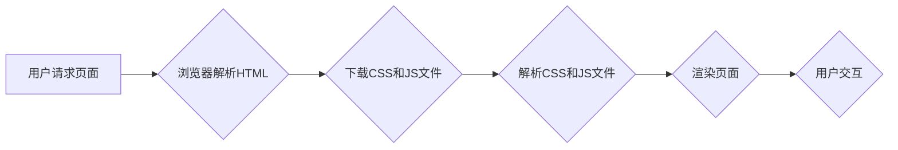

                 

## Web前端性能优化最佳实践

> 关键词：前端性能、优化策略、代码压缩、缓存机制、网络请求、渲染优化、性能测试、 Lighthouse

## 1. 背景介绍

在当今以移动互联网为主导的时代，用户对网站访问速度的期望越来越高。页面加载速度直接影响着用户体验，进而影响着网站的转化率和用户留存率。因此，前端性能优化已成为网站建设和运营中不可或缺的一部分。

前端性能优化是指通过一系列的技术手段，提高网站在用户浏览器中的加载速度、响应速度和流畅度。它涵盖了代码压缩、图片优化、缓存机制、网络请求优化、渲染优化等多个方面。

## 2. 核心概念与联系

前端性能优化的核心概念包括：

* **首屏渲染时间 (First Contentful Paint, FCP):** 用户首次看到页面内容的时间。
* **完全渲染时间 (Largest Contentful Paint, LCP):** 页面中最大的内容元素完全渲染的时间。
* **交互时间 (Interactive):** 用户可以与页面交互的时间。
* **时间到头 (Time to Interactive, TTI):** 页面响应用户输入的时间。

这些指标可以用来衡量网站的性能表现。

**Mermaid 流程图:**



## 3. 核心算法原理 & 具体操作步骤

### 3.1  算法原理概述

前端性能优化的核心算法原理主要包括：

* **代码压缩:** 减少代码体积，提高下载速度。
* **图片优化:** 压缩图片大小，减少网络传输数据量。
* **缓存机制:** 存储静态资源，减少重复下载。
* **网络请求优化:** 减少网络请求次数，提高页面加载速度。
* **渲染优化:** 优化页面渲染流程，提高页面流畅度。

### 3.2  算法步骤详解

**代码压缩:**

1. 使用代码压缩工具，例如 UglifyJS 和 Closure Compiler，压缩 JavaScript 代码。
2. 使用 CSS 压缩工具，例如 CSSNano 和 CleanCSS，压缩 CSS 代码。
3. 删除代码中的空格、换行符和注释，减少代码体积。

**图片优化:**

1. 使用图片压缩工具，例如 TinyPNG 和 ImageOptim，压缩图片大小。
2. 选择合适的图片格式，例如 WebP 格式，提高图片压缩率。
3. 使用图片懒加载技术，延迟加载非关键图片，提高首屏渲染速度。

**缓存机制:**

1. 使用浏览器缓存机制，存储静态资源，减少重复下载。
2. 使用 CDN 服务，将静态资源部署到全球多个节点，提高资源访问速度。
3. 使用服务端缓存机制，存储动态内容，减少数据库查询次数。

**网络请求优化:**

1. 使用异步请求技术，例如 AJAX，减少页面阻塞。
2. 使用资源合并技术，将多个资源合并成一个文件，减少网络请求次数。
3. 使用预加载技术，提前加载关键资源，提高页面加载速度。

**渲染优化:**

1. 使用 CSS 优化技术，例如 CSS 媒体查询和 CSS 渐进式渲染，提高页面渲染速度。
2. 使用 JavaScript 优化技术，例如 DOM 操作优化和事件监听优化，提高页面交互流畅度。
3. 使用 Web Workers 技术，将耗时操作移至后台线程，提高页面主线程的响应速度。

### 3.3  算法优缺点

**代码压缩:**

* **优点:** 减少代码体积，提高下载速度。
* **缺点:** 压缩后的代码可能难以阅读和调试。

**图片优化:**

* **优点:** 压缩图片大小，减少网络传输数据量。
* **缺点:** 压缩后的图片质量可能下降。

**缓存机制:**

* **优点:** 存储静态资源，减少重复下载。
* **缺点:** 需要维护缓存策略，避免缓存过时。

**网络请求优化:**

* **优点:** 减少网络请求次数，提高页面加载速度。
* **缺点:** 需要了解网络请求机制，才能有效优化。

**渲染优化:**

* **优点:** 提高页面渲染速度和交互流畅度。
* **缺点:** 需要深入了解浏览器渲染机制，才能有效优化。

### 3.4  算法应用领域

前端性能优化算法广泛应用于：

* **网站建设:** 提高网站加载速度和用户体验。
* **移动应用开发:** 提高移动应用的启动速度和流畅度。
* **游戏开发:** 提高游戏帧率和画面流畅度。
* **视频直播:** 提高视频直播的流畅度和延迟。

## 4. 数学模型和公式 & 详细讲解 & 举例说明

### 4.1  数学模型构建

前端性能优化的数学模型可以用来衡量网站的性能表现，例如：

* **页面加载时间 (T):**  $T = T_d + T_p + T_r$

其中：

* $T_d$: 下载时间
* $T_p$: 解析时间
* $T_r$: 渲染时间

* **带宽利用率 (B):** $B = \frac{T_d}{T_{max}}$

其中：

* $T_{max}$: 最大允许下载时间

### 4.2  公式推导过程

页面加载时间公式的推导过程如下：

1. 页面加载时间等于下载时间、解析时间和渲染时间的总和。
2. 下载时间取决于网络速度和资源大小。
3. 解析时间取决于资源类型和浏览器性能。
4. 渲染时间取决于页面复杂度和浏览器性能。

### 4.3  案例分析与讲解

假设一个网站的下载时间为 2 秒，解析时间为 1 秒，渲染时间为 3 秒。则该网站的页面加载时间为：

$T = 2 + 1 + 3 = 6$ 秒

如果该网站的最大允许下载时间为 5 秒，则该网站的带宽利用率为：

$B = \frac{2}{5} = 0.4$

## 5. 项目实践：代码实例和详细解释说明

### 5.1  开发环境搭建

* Node.js 和 npm

### 5.2  源代码详细实现

```javascript
// 代码压缩示例
const uglify = require('uglify-js');

const code = `
function add(a, b) {
  return a + b;
}
`;

const minifiedCode = uglify.minify(code).code;

console.log(minifiedCode);

// 图片优化示例
const sharp = require('sharp');

sharp('image.jpg')
  .resize(500, 300)
  .jpeg({ quality: 70 })
  .toFile('optimized_image.jpg');
```

### 5.3  代码解读与分析

* 代码压缩示例：使用 uglify-js 库压缩 JavaScript 代码，减少代码体积。
* 图片优化示例：使用 sharp 库压缩图片大小，并设置 JPEG 质量为 70%。

### 5.4  运行结果展示

* 代码压缩后，代码体积将显著减少。
* 图片压缩后，图片大小将减小，文件大小将更小。

## 6. 实际应用场景

前端性能优化技术广泛应用于各种场景，例如：

* **电商网站:** 提高商品展示速度和用户体验，提高转化率。
* **新闻网站:** 提高新闻加载速度和用户粘性，提高阅读量。
* **博客网站:** 提高文章加载速度和用户体验，提高用户留存率。
* **游戏网站:** 提高游戏加载速度和流畅度，提高用户参与度。

### 6.4  未来应用展望

随着移动互联网的普及和用户对网站体验要求的不断提高，前端性能优化技术将更加重要。未来，前端性能优化技术将朝着以下方向发展：

* **更智能的性能分析工具:** 自动识别性能瓶颈，提供更精准的优化建议。
* **更有效的性能优化算法:** 提高页面加载速度和交互流畅度。
* **更全面的性能指标体系:** 涵盖用户体验、资源利用率、安全性和可访问性等多个方面。

## 7. 工具和资源推荐

### 7.1  学习资源推荐

* **Google Developers:** https://developers.google.com/web/fundamentals/performance/
* **Mozilla Developer Network (MDN):** https://developer.mozilla.org/en-US/docs/Web/Performance
* **Web.dev:** https://web.dev/

### 7.2  开发工具推荐

* **Lighthouse:** https://developers.google.com/web/tools/lighthouse
* **PageSpeed Insights:** https://developers.google.com/speed/pagespeed/insights/
* **Chrome DevTools:** https://developer.chrome.com/docs/devtools/

### 7.3  相关论文推荐

* **"Improving Web Performance"** by Google Developers
* **"Web Performance Optimization: A Survey"** by ACM Digital Library

## 8. 总结：未来发展趋势与挑战

### 8.1  研究成果总结

前端性能优化技术已经取得了显著的成果，例如：

* **代码压缩技术:** 显著减少了代码体积，提高了下载速度。
* **图片优化技术:** 显著减小了图片大小，减少了网络传输数据量。
* **缓存机制:** 提高了静态资源的访问速度。
* **网络请求优化技术:** 减少了网络请求次数，提高了页面加载速度。

### 8.2  未来发展趋势

前端性能优化技术将朝着以下方向发展：

* **更智能的性能分析工具:** 自动识别性能瓶颈，提供更精准的优化建议。
* **更有效的性能优化算法:** 提高页面加载速度和交互流畅度。
* **更全面的性能指标体系:** 涵盖用户体验、资源利用率、安全性和可访问性等多个方面。

### 8.3  面临的挑战

前端性能优化技术也面临着一些挑战：

* **浏览器兼容性:** 不同浏览器对性能优化的支持程度不同。
* **网络环境复杂:** 网络环境复杂，难以保证页面加载速度的稳定性。
* **用户设备差异:** 用户设备差异大，难以满足所有用户的性能需求。

### 8.4  研究展望

未来，需要继续研究以下问题：

* 如何开发更智能、更全面的性能分析工具。
* 如何开发更有效的性能优化算法，适应不同的浏览器和网络环境。
* 如何平衡性能优化和用户体验，满足不同用户的需求。

## 9. 附录：常见问题与解答

**常见问题:**

* 如何判断网站的性能表现？
* 如何进行前端性能优化？
* 哪些工具可以帮助进行前端性能优化？

**解答:**

* 可以使用 Lighthouse、PageSpeed Insights 等工具来判断网站的性能表现。
* 前端性能优化包括代码压缩、图片优化、缓存机制、网络请求优化、渲染优化等多个方面。
* Lighthouse、PageSpeed Insights、Chrome DevTools 等工具可以帮助进行前端性能优化。


作者：禅与计算机程序设计艺术 / Zen and the Art of Computer Programming 
<end_of_turn>

