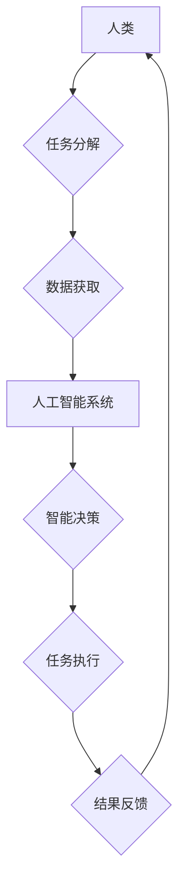

                 

## 人机协作新篇章：共创智能未来新时代

> 关键词： 人机协作、人工智能、协同智能、智能未来、算法、机器学习、深度学习、自然语言处理、计算机视觉

### 1. 背景介绍

人工智能（AI）技术的飞速发展，正在深刻地改变着人类社会各领域。从自动驾驶到医疗诊断，从个性化教育到金融风控，AI技术的应用场景日益广泛。然而，当前的AI技术仍然面临着一些挑战，例如数据依赖性、算法黑盒化、泛化能力不足等。

人机协作，即人类与人工智能系统共同完成任务，被认为是解决这些挑战，并推动AI技术更进一步发展的关键。人机协作能够充分发挥人类的创造力、批判性思维和情感智能，同时利用AI技术的计算能力、数据处理能力和自动化能力，实现协同增效。

### 2. 核心概念与联系

**2.1 人机协作的本质**

人机协作的核心在于将人类和人工智能系统有机地结合起来，形成一个高效、灵活、智能的协作体系。

* **人类优势:** 创造力、批判性思维、情感智能、复杂问题解决能力、灵活适应能力
* **人工智能优势:** 计算能力、数据处理能力、自动化能力、精准度、速度

**2.2 人机协作模式**

人机协作模式多种多样，常见的有：

* **监督式协作:** 人工智能系统在人类的指导下完成任务，人类提供决策和反馈。
* **自主式协作:** 人工智能系统能够独立完成任务，但仍需定期与人类进行沟通和汇报。
* **协同式协作:** 人类和人工智能系统共同参与任务，并根据任务需要进行分工合作。

**2.3 人机协作架构**



### 3. 核心算法原理 & 具体操作步骤

**3.1 算法原理概述**

人机协作的核心算法通常涉及以下几个方面：

* **自然语言处理 (NLP):** 理解和生成人类语言，实现人机自然交互。
* **机器学习 (ML):** 从数据中学习模式和规律，提高人工智能系统的智能决策能力。
* **深度学习 (DL):** 利用多层神经网络，模拟人类大脑的学习机制，实现更复杂的智能任务。
* **计算机视觉 (CV):** 理解和处理图像和视频数据，实现人工智能系统的视觉感知能力。

**3.2 算法步骤详解**

以监督式人机协作为例，算法步骤如下：

1. **任务分解:** 人类将复杂任务分解成多个子任务，并为每个子任务分配相应的责任。
2. **数据获取:** 人工智能系统从数据库、传感器等数据源获取相关数据，并进行预处理。
3. **模型训练:** 人工智能系统利用机器学习算法，从训练数据中学习模型参数，提高模型的预测精度。
4. **智能决策:** 人工智能系统根据输入数据和模型参数，进行智能决策，并输出结果。
5. **结果反馈:** 人工智能系统将决策结果反馈给人类，人类根据结果进行评估和调整。

**3.3 算法优缺点**

* **优点:** 能够提高效率、准确性和安全性，并释放人类的创造力和智力。
* **缺点:** 需要大量的数据和计算资源，算法的解释性和可控性仍有待提高。

**3.4 算法应用领域**

* **医疗诊断:** 人工智能系统辅助医生诊断疾病，提高诊断准确率。
* **金融风控:** 人工智能系统识别金融风险，降低金融损失。
* **自动驾驶:** 人工智能系统控制车辆行驶，实现自动驾驶。
* **个性化教育:** 人工智能系统根据学生的学习情况，提供个性化的学习方案。

### 4. 数学模型和公式 & 详细讲解 & 举例说明

**4.1 数学模型构建**

人机协作的数学模型通常基于概率论、统计学和优化理论。

* **概率论:** 用于描述人类和人工智能系统决策的随机性。
* **统计学:** 用于分析数据，并建立模型参数之间的关系。
* **优化理论:** 用于寻找最优的协作策略，最大化协作效率。

**4.2 公式推导过程**

例如，在监督式人机协作中，可以利用贝叶斯公式推导人类和人工智能系统对任务结果的置信度。

$$P(H|D) = \frac{P(D|H)P(H)}{P(D)}$$

其中：

* $P(H|D)$: 人类在观察到数据 $D$ 后对任务结果 $H$ 的置信度。
* $P(D|H)$: 观察到数据 $D$ 的概率，假设任务结果为 $H$。
* $P(H)$: 任务结果 $H$ 的先验概率。
* $P(D)$: 观察到数据 $D$ 的概率。

**4.3 案例分析与讲解**

假设人类和人工智能系统共同完成一个图像识别任务。人类提供图像的语义信息，人工智能系统利用深度学习模型识别图像中的物体。

根据贝叶斯公式，人类和人工智能系统可以根据各自的置信度，共同判断图像中物体的类别。

### 5. 项目实践：代码实例和详细解释说明

**5.1 开发环境搭建**

* 操作系统: Ubuntu 20.04
* Python 版本: 3.8
* 必要的库: TensorFlow, PyTorch, OpenCV, NLTK

**5.2 源代码详细实现**

```python
# 人机协作图像识别示例代码

import tensorflow as tf
from PIL import Image
import numpy as np

# 加载预训练的图像识别模型
model = tf.keras.applications.ResNet50(weights='imagenet')

# 定义图像预处理函数
def preprocess_image(image_path):
    image = Image.open(image_path)
    image = image.resize((224, 224))
    image = np.array(image) / 255.0
    image = np.expand_dims(image, axis=0)
    return image

# 获取人类提供的图像语义信息
human_input = input("请输入图像的语义信息: ")

# 预处理图像
image_path = "image.jpg"
image = preprocess_image(image_path)

# 利用人工智能模型进行图像识别
predictions = model.predict(image)
predicted_class = tf.keras.applications.resnet50.decode_predictions(predictions, top=1)[0][0]

# 将人工智能模型的识别结果与人类提供的语义信息进行融合
# ...

# 输出最终的识别结果
print("最终识别结果:", predicted_class)
```

**5.3 代码解读与分析**

* 代码首先加载预训练的图像识别模型 ResNet50。
* 定义了图像预处理函数，将图像调整到模型输入的尺寸，并进行归一化处理。
* 获取人类提供的图像语义信息，并将其与人工智能模型的识别结果进行融合。
* 输出最终的识别结果。

**5.4 运行结果展示**

运行代码后，程序会输出图像的识别结果，并根据人类提供的语义信息进行调整。

### 6. 实际应用场景

**6.1 医疗诊断辅助系统**

人机协作可以帮助医生更快、更准确地诊断疾病。例如，人工智能系统可以分析患者的影像数据，并提供初步诊断结果，医生可以根据人工智能系统的建议，进行进一步的检查和诊断。

**6.2 金融风险控制系统**

人机协作可以帮助金融机构识别和控制金融风险。例如，人工智能系统可以分析客户的交易数据，并识别潜在的欺诈行为，人类专家可以根据人工智能系统的提示，进行进一步的调查和处理。

**6.3 自动驾驶系统**

人机协作可以提高自动驾驶系统的安全性。例如，人工智能系统可以控制车辆行驶，但仍需人类驾驶员进行监督和干预，以应对突发情况。

**6.4 个性化教育系统**

人机协作可以提供个性化的学习方案。例如，人工智能系统可以根据学生的学习情况，提供个性化的学习内容和练习题，人类教师可以根据学生的学习进度，进行个性化的指导和辅导。

**6.5 未来应用展望**

人机协作的应用场景将更加广泛，例如：

* **机器人协作:** 人类和机器人共同完成复杂的任务，例如制造、物流、服务等。
* **虚拟现实协作:** 人类在虚拟现实环境中与人工智能系统协作，例如游戏、培训、设计等。
* **跨文化协作:** 人类和人工智能系统跨越语言和文化障碍，进行高效的协作。

### 7. 工具和资源推荐

**7.1 学习资源推荐**

* **书籍:**
    * 人机协作：未来工作与人工智能的融合
    * 人工智能：一种现代方法
* **在线课程:**
    * Coursera: 人工智能
    * edX: 人工智能导论
* **开源项目:**
    * TensorFlow
    * PyTorch
    * OpenAI Gym

**7.2 开发工具推荐**

* **编程语言:** Python
* **机器学习框架:** TensorFlow, PyTorch
* **自然语言处理库:** NLTK, spaCy
* **计算机视觉库:** OpenCV

**7.3 相关论文推荐**

* 人机协作中的信任和解释性
* 人工智能与人类协作的未来
* 人机协作中的公平性和伦理问题

### 8. 总结：未来发展趋势与挑战

**8.1 研究成果总结**

人机协作领域取得了显著的进展，例如：

* 人工智能系统的智能决策能力不断提高。
* 人机交互方式更加自然和便捷。
* 人机协作的应用场景不断扩展。

**8.2 未来发展趋势**

* **更智能的人工智能系统:** 利用更先进的算法和模型，提高人工智能系统的智能决策能力和泛化能力。
* **更自然的人机交互:** 利用自然语言处理、计算机视觉等技术，实现更自然、更便捷的人机交互。
* **更广泛的应用场景:** 人机协作将应用于更多领域，例如医疗、教育、金融、制造等。

**8.3 面临的挑战**

* **算法解释性和可控性:** 人工智能系统的决策过程仍然难以解释和控制，这可能会导致信任问题和伦理问题。
* **数据安全和隐私保护:** 人机协作需要大量的数据，如何确保数据的安全和隐私保护是一个重要的挑战。
* **社会影响:** 人机协作可能会导致就业结构的变化，需要制定相应的政策和措施，应对社会影响。

**8.4 研究展望**

未来研究将重点关注以下几个方面:

* **开发更安全、更可靠的人工智能系统:** 提高人工智能系统的解释性和可控性，并制定相应的安全和伦理规范。
* **探索更有效的协作策略:** 研究不同类型的人机协作模式，并开发更有效的协作策略。
* **研究人机协作的社会影响:** 评估人机协作对社会的影响，并制定相应的政策和措施，应对挑战。

### 9. 附录：常见问题与解答

**9.1 如何选择合适的协作模式?**

选择合适的协作模式取决于任务的性质、人类和人工智能系统的能力、以及协作环境等因素。

**9.2 如何确保人机协作的安全性?**

确保人机协作的安全性需要从多个方面考虑，例如：

* 开发安全可靠的人工智能系统。
* 制定相应的安全和伦理规范。
* 加强数据安全和隐私保护。

**9.3 人机协作会取代人类工作吗?**

人机协作不会完全取代人类工作，而是会改变工作方式，提高工作效率。人类仍然需要发挥创造力、批判性思维和情感智能等优势，与人工智能系统协同工作。


作者：禅与计算机程序设计艺术 / Zen and the Art of Computer Programming 
<end_of_turn>

