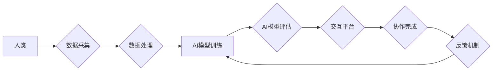

                 

## 人类-AI协作：增强人类潜能与AI能力的融合与协同

> 关键词：人工智能、协作、人类潜能、AI能力、融合、协同、算法、数学模型、应用场景

### 1. 背景介绍

人工智能（AI）技术近年来发展迅速，已渗透到各个领域，深刻地改变着人类的生活方式和工作模式。从自动驾驶、语音识别到医疗诊断、金融分析，AI的应用场景日益广泛，其强大的计算能力和数据处理能力为人类社会带来了前所未有的机遇。然而，AI技术也面临着一些挑战，例如数据偏差、算法透明度和伦理问题。

人类-AI协作作为一种新的工作模式，旨在充分发挥人类和AI各自的优势，实现互补和协同，从而提升整体工作效率和解决复杂问题的能力。人类拥有创造力、批判性思维和情感智能等独特优势，而AI擅长处理大量数据、识别模式和执行重复性任务。通过将人类和AI的优势结合起来，可以构建一个更加高效、智能和创新的工作环境。

### 2. 核心概念与联系

**2.1 人类-AI协作的本质**

人类-AI协作的核心在于将人类和AI视为合作伙伴，共同完成任务。这种合作关系并非简单的“人控制机器”，而是建立在相互理解、信任和协同的基础上。

**2.2 协作模式**

人类-AI协作可以采用多种模式，例如：

* **监督式协作:** 人类提供指导和反馈，AI根据反馈进行学习和改进。
* **增强式协作:** AI辅助人类完成任务，提供建议和支持，提高人类的工作效率。
* **自主式协作:** 人类和AI共同制定目标和策略，并根据情况进行调整，实现协同决策和行动。

**2.3 协作架构**

人类-AI协作的架构通常包括以下几个关键组件：

* **数据采集和处理:** 收集和处理人类和AI所需的数据，为协作提供基础信息。
* **模型训练和评估:** 训练AI模型，并评估其性能，确保模型能够有效地支持人类工作。
* **交互平台:** 提供人类和AI交互的平台，例如语音、文本、图形等，实现高效的沟通和协作。
* **反馈机制:** 收集人类对AI的反馈，并将其用于模型改进，不断提升协作效率和效果。

**Mermaid 流程图**



### 3. 核心算法原理 & 具体操作步骤

**3.1 算法原理概述**

人类-AI协作的核心算法通常基于机器学习、深度学习和自然语言处理等技术。这些算法能够帮助AI模型学习人类的行为模式、理解人类的意图和需求，并提供相应的支持和建议。

**3.2 算法步骤详解**

1. **数据收集和预处理:** 收集人类和AI相关的各种数据，例如文本、图像、音频等，并进行预处理，例如清洗、转换和特征提取。
2. **模型选择和训练:** 选择合适的机器学习算法，例如监督学习、强化学习或生成对抗网络，并根据收集的数据进行模型训练。
3. **模型评估和优化:** 评估模型的性能，例如准确率、召回率和F1-score，并根据评估结果进行模型优化，例如调整超参数或增加训练数据。
4. **部署和应用:** 将训练好的模型部署到实际应用场景中，例如聊天机器人、智能助手或协作平台。
5. **持续学习和改进:** 收集用户反馈和数据，并将其用于模型的持续学习和改进，不断提升协作效率和效果。

**3.3 算法优缺点**

* **优点:**
    * 能够有效地利用人类和AI的优势，实现互补和协同。
    * 能够提高工作效率、解决复杂问题和促进创新。
    * 能够提供个性化和定制化的服务，满足不同用户的需求。
* **缺点:**
    * 需要大量的训练数据和计算资源。
    * 算法的透明度和可解释性仍然是一个挑战。
    * 存在伦理和安全问题，需要谨慎考虑和解决。

**3.4 算法应用领域**

* **医疗保健:** AI辅助医生诊断疾病、制定治疗方案和提供个性化医疗服务。
* **教育:** AI提供个性化学习辅导、自动批改作业和评估学生学习进度。
* **金融:** AI辅助金融分析师进行风险评估、预测市场趋势和提供投资建议。
* **制造业:** AI优化生产流程、预测设备故障和提高生产效率。
* **客服:** AI提供智能客服，自动回答客户问题和解决常见问题。

### 4. 数学模型和公式 & 详细讲解 & 举例说明

**4.1 数学模型构建**

人类-AI协作可以抽象为一个博弈模型，其中人类和AI是参与者，目标是共同完成任务并获得最大收益。

**4.2 公式推导过程**

假设人类和AI的收益函数分别为 $U_h(a,b)$ 和 $U_a(a,b)$，其中 $a$ 表示人类的行动，$b$ 表示AI的行动。则博弈模型的目标是找到一个 Nash 均衡点，即满足以下条件：

* $U_h(a^*,b^*) \ge U_h(a,b^*)$ 对于所有 $a$
* $U_a(a^*,b^*) \ge U_a(a^*,b)$ 对于所有 $b$

其中 $(a^*,b^*)$ 是 Nash 均衡点。

**4.3 案例分析与讲解**

例如，在自动驾驶场景中，人类驾驶员和AI系统可以视为博弈中的参与者。人类驾驶员的目标是安全到达目的地，而AI系统的目标是优化行驶路线和避免碰撞。通过构建一个博弈模型，可以分析人类驾驶员和AI系统的交互行为，并找到一个 Nash 均衡点，使得双方都能获得最大收益。

### 5. 项目实践：代码实例和详细解释说明

**5.1 开发环境搭建**

* 操作系统: Ubuntu 20.04
* Python 版本: 3.8
* 必要的库: TensorFlow, PyTorch, scikit-learn

**5.2 源代码详细实现**

```python
# 这是一个简单的机器学习模型示例，用于预测用户对产品的评价

import pandas as pd
from sklearn.model_selection import train_test_split
from sklearn.linear_model import LogisticRegression
from sklearn.metrics import accuracy_score

# 加载数据
data = pd.read_csv('product_reviews.csv')

# 提取特征和目标变量
features = data[['price', 'quality', 'service']]
target = data['rating']

# 将数据划分为训练集和测试集
X_train, X_test, y_train, y_test = train_test_split(features, target, test_size=0.2, random_state=42)

# 创建逻辑回归模型
model = LogisticRegression()

# 训练模型
model.fit(X_train, y_train)

# 对测试集进行预测
y_pred = model.predict(X_test)

# 计算模型准确率
accuracy = accuracy_score(y_test, y_pred)
print(f'模型准确率: {accuracy}')
```

**5.3 代码解读与分析**

这段代码演示了一个简单的机器学习模型，用于预测用户对产品的评价。

1. 首先，加载数据并提取特征和目标变量。
2. 然后，将数据划分为训练集和测试集。
3. 接着，创建逻辑回归模型并训练模型。
4. 最后，对测试集进行预测并计算模型准确率。

**5.4 运行结果展示**

运行该代码后，会输出模型的准确率。

### 6. 实际应用场景

**6.1 智能客服**

AI可以帮助企业构建智能客服系统，自动回答客户常见问题，提供24/7的在线服务，提高客户满意度和服务效率。

**6.2 个性化推荐**

AI可以分析用户的行为数据和偏好，提供个性化的商品、服务和内容推荐，提升用户体验和转化率。

**6.3 自动化办公**

AI可以自动化许多重复性办公任务，例如数据录入、文档处理和邮件回复，解放人力资源，提高工作效率。

**6.4 医疗诊断辅助**

AI可以辅助医生进行疾病诊断，分析患者的影像数据和病历信息，提供诊断建议和辅助治疗方案。

**6.5 未来应用展望**

随着AI技术的不断发展，人类-AI协作将在更多领域得到应用，例如：

* **教育:** AI可以提供个性化学习辅导、自动批改作业和评估学生学习进度。
* **金融:** AI可以辅助金融分析师进行风险评估、预测市场趋势和提供投资建议。
* **制造业:** AI可以优化生产流程、预测设备故障和提高生产效率。
* **交通运输:** AI可以辅助驾驶员进行安全驾驶、优化交通流量和提高交通效率。

### 7. 工具和资源推荐

**7.1 学习资源推荐**

* **在线课程:** Coursera, edX, Udacity
* **书籍:**
    * 《深度学习》
    * 《人工智能：一种现代方法》
    * 《机器学习实战》
* **开源项目:** TensorFlow, PyTorch, scikit-learn

**7.2 开发工具推荐**

* **编程语言:** Python
* **机器学习框架:** TensorFlow, PyTorch
* **数据处理工具:** Pandas, NumPy
* **可视化工具:** Matplotlib, Seaborn

**7.3 相关论文推荐**

* **《Attention Is All You Need》**
* **《BERT: Pre-training of Deep Bidirectional Transformers for Language Understanding》**
* **《Generative Adversarial Networks》**

### 8. 总结：未来发展趋势与挑战

**8.1 研究成果总结**

近年来，人类-AI协作取得了显著进展，在多个领域取得了成功应用。AI技术不断发展，算法模型更加复杂和智能，能够更好地理解和响应人类需求。

**8.2 未来发展趋势**

* **更强的泛化能力:** AI模型将能够更好地适应不同的场景和任务，无需大量的数据进行重新训练。
* **更强的解释性和透明度:** AI模型的决策过程将更加透明可解释，帮助人类更好地理解AI的思考方式。
* **更强的协作性和交互性:** AI系统将能够更加自然地与人类进行交互，实现更有效的协作。

**8.3 面临的挑战**

* **数据安全和隐私保护:** AI模型的训练和应用需要大量数据，如何确保数据安全和隐私保护是一个重要挑战。
* **算法偏见和公平性:** AI模型可能存在算法偏见，导致不公平的结果，需要采取措施解决这个问题。
* **伦理和社会影响:** AI技术的快速发展可能带来一些伦理和社会问题，需要进行深入的思考和讨论。

**8.4 研究展望**

未来，人类-AI协作将继续朝着更智能、更安全、更可持续的方向发展。需要加强基础研究，探索更先进的算法模型和技术架构，并制定相应的政策和规范，引导AI技术健康发展，造福人类社会。

### 9. 附录：常见问题与解答

**9.1 如何选择合适的AI模型？**

选择合适的AI模型取决于具体的应用场景和数据特点。需要考虑模型的类型、参数设置、训练数据量等因素。

**9.2 如何解决AI模型的偏见问题？**

可以采用以下方法解决AI模型的偏见问题：

* 使用更加多样化的训练数据。
* 对训练数据进行预处理，去除潜在的偏见。
* 使用公平性评估指标，评估模型的公平性。

**9.3 如何确保AI模型的安全性和可靠性？**

可以采用以下方法确保AI模型的安全性和可靠性：

* 对模型进行严格的测试和评估。
* 使用安全性和可靠性高的硬件平台。
* 建立完善的监控和报警机制。


作者：禅与计算机程序设计艺术 / Zen and the Art of Computer Programming 
<end_of_turn>

