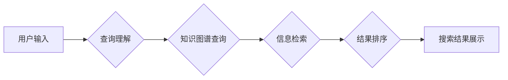

                 

## 从回答问题到激发探索：AI搜索的演变

> 关键词：人工智能、搜索引擎、自然语言处理、深度学习、Transformer、信息检索、知识图谱、用户体验

### 1. 背景介绍

传统的搜索引擎以关键词匹配为核心，在信息爆炸的时代，面对海量数据和复杂查询需求，其局限性日益凸显。用户不再仅仅寻求简单的答案，而是渴望更深入、更全面的信息探索。人工智能技术的飞速发展为搜索引擎带来了革命性的变革，AI搜索引擎应运而生，其目标不仅仅是回答问题，更重要的是激发用户的探索兴趣，引导用户深入理解信息，最终实现更智能、更人性化的搜索体验。

### 2. 核心概念与联系

AI搜索的核心概念包括自然语言处理（NLP）、深度学习、Transformer模型、知识图谱等。

**2.1 自然语言处理 (NLP)**

NLP是人工智能领域的重要分支，致力于使计算机能够理解、处理和生成人类语言。在AI搜索中，NLP技术用于理解用户的自然语言查询，将其转换为机器可理解的格式，并对搜索结果进行语义分析，提高搜索结果的准确性和相关性。

**2.2 深度学习**

深度学习是机器学习的一种高级形式，它利用多层神经网络模拟人类大脑的学习过程，能够从海量数据中学习复杂的模式和关系。深度学习在AI搜索中应用于各种任务，例如：

* **文本表示学习:** 将文本转换为向量表示，以便机器能够理解文本的语义。
* **查询理解:** 理解用户的查询意图，识别关键词、实体和关系。
* **排序优化:** 根据用户的查询和历史行为，对搜索结果进行排序，提供更相关的结果。

**2.3 Transformer模型**

Transformer模型是一种基于深度学习的序列到序列模型，它能够处理长距离依赖关系，并具有强大的文本理解能力。BERT、GPT、T5等都是基于Transformer模型的著名AI模型，在AI搜索中被广泛应用于查询理解、文本生成和信息检索等任务。

**2.4 知识图谱**

知识图谱是一种结构化的知识表示形式，它将实体和关系以图的形式表示，能够捕捉知识之间的复杂关系。在AI搜索中，知识图谱可以帮助搜索引擎理解用户的查询意图，并提供更丰富的、更准确的信息。

**2.5 AI搜索架构**



### 3. 核心算法原理 & 具体操作步骤

**3.1 算法原理概述**

AI搜索的核心算法原理包括：

* **文本表示学习:** 利用深度学习模型将文本转换为向量表示，以便机器能够理解文本的语义。
* **查询理解:** 利用自然语言处理技术理解用户的查询意图，识别关键词、实体和关系。
* **信息检索:** 利用机器学习算法从海量数据中检索出与用户查询相关的文档。
* **结果排序:** 根据用户的查询和历史行为，对搜索结果进行排序，提供更相关的结果。

**3.2 算法步骤详解**

1. **用户输入:** 用户输入自然语言查询。
2. **预处理:** 对用户输入进行预处理，例如去除停用词、分词、词干提取等。
3. **文本表示学习:** 利用深度学习模型将预处理后的文本转换为向量表示。
4. **查询理解:** 利用自然语言处理技术理解用户的查询意图，识别关键词、实体和关系。
5. **信息检索:** 利用机器学习算法从海量数据中检索出与用户查询相关的文档。
6. **结果排序:** 根据用户的查询和历史行为，对搜索结果进行排序，提供更相关的结果。
7. **结果展示:** 将排序后的搜索结果展示给用户。

**3.3 算法优缺点**

**优点:**

* **更准确的搜索结果:** AI搜索引擎能够理解用户的查询意图，并提供更相关的搜索结果。
* **更丰富的搜索体验:** AI搜索引擎能够提供多种类型的搜索结果，例如文本、图片、视频等。
* **个性化搜索:** AI搜索引擎能够根据用户的历史行为和偏好，提供个性化的搜索结果。

**缺点:**

* **数据依赖:** AI搜索引擎需要大量的训练数据才能有效工作。
* **算法复杂:** AI搜索引擎的算法比较复杂，需要专业的技术人员进行开发和维护。
* **伦理问题:** AI搜索引擎可能会存在一些伦理问题，例如数据隐私、算法偏见等。

**3.4 算法应用领域**

AI搜索技术广泛应用于各个领域，例如：

* **搜索引擎:** Google、百度等搜索引擎已经开始使用AI技术来改进搜索结果。
* **电商平台:** 淘宝、京东等电商平台利用AI搜索技术来推荐商品，提高用户购物体验。
* **医疗保健:** AI搜索技术可以帮助医生快速查找相关医疗信息，提高诊断效率。
* **教育:** AI搜索技术可以帮助学生查找学习资料，提高学习效率。

### 4. 数学模型和公式 & 详细讲解 & 举例说明

**4.1 数学模型构建**

在AI搜索中，常用的数学模型包括：

* **词袋模型 (Bag-of-Words):** 将文本表示为词频向量，忽略词序信息。
* **TF-IDF:** 衡量词在文档和语料库中的重要性。
* **Word2Vec:** 利用神经网络学习词的语义向量表示。
* **BERT:** 基于Transformer模型的预训练语言模型，能够捕捉文本的上下文信息。

**4.2 公式推导过程**

**TF-IDF 公式:**

$$TF-IDF(t, d) = TF(t, d) \times IDF(t)$$

其中：

* $TF(t, d)$ 是词 $t$ 在文档 $d$ 中的词频。
* $IDF(t)$ 是词 $t$ 在语料库中逆向文档频率。

**4.3 案例分析与讲解**

假设我们有一个语料库包含以下文档：

* 文档 1: “苹果是水果，香蕉也是水果。”
* 文档 2: “苹果是一种甜美的水果，香蕉则比较酸。”

我们想要计算词 “苹果” 在文档 1 中的 TF-IDF 值。

* $TF(苹果, 文档 1) = 1$ (词 “苹果” 在文档 1 中出现 1 次)
* $IDF(苹果) = log(总文档数 / 包含 “苹果” 的文档数) = log(2 / 1) = 0.301$

因此，词 “苹果” 在文档 1 中的 TF-IDF 值为：

$$TF-IDF(苹果, 文档 1) = 1 \times 0.301 = 0.301$$

### 5. 项目实践：代码实例和详细解释说明

**5.1 开发环境搭建**

* Python 3.7+
* TensorFlow 2.0+
* PyTorch 1.0+
* NLTK
* SpaCy

**5.2 源代码详细实现**

```python
import nltk
from nltk.corpus import stopwords
from sklearn.feature_extraction.text import TfidfVectorizer

# 下载停用词列表
nltk.download('stopwords')

# 定义预处理函数
def preprocess_text(text):
    # 转换为小写
    text = text.lower()
    # 去除停用词
    stop_words = set(stopwords.words('english'))
    words = [word for word in text.split() if word not in stop_words]
    # 返回处理后的文本
    return ' '.join(words)

# 定义训练数据
documents = [
    "This is the first document.",
    "This document is the second document.",
    "And this is the third one.",
    "Is this the first document?"
]

# 预处理文本
processed_documents = [preprocess_text(doc) for doc in documents]

# 使用 TF-IDF 向量化
vectorizer = TfidfVectorizer()
tfidf_matrix = vectorizer.fit_transform(processed_documents)

# 打印 TF-IDF 矩阵
print(tfidf_matrix.toarray())
```

**5.3 代码解读与分析**

* 该代码首先定义了预处理函数，用于将文本转换为小写并去除停用词。
* 然后，定义了训练数据，并使用预处理函数对文本进行预处理。
* 使用 TF-IDF 向量化器将预处理后的文本转换为 TF-IDF 矩阵。
* 最后，打印 TF-IDF 矩阵。

**5.4 运行结果展示**

运行该代码后，会输出一个 TF-IDF 矩阵，其中每个元素代表一个词在某个文档中的 TF-IDF 值。

### 6. 实际应用场景

**6.1 搜索引擎优化 (SEO)**

AI搜索技术可以帮助网站优化其内容，提高在搜索引擎中的排名。例如，AI可以分析用户的搜索查询，并识别出网站内容中缺少的关键信息，从而帮助网站优化其内容以满足用户的搜索需求。

**6.2 个性化推荐**

AI搜索技术可以根据用户的搜索历史和偏好，提供个性化的搜索结果和推荐。例如，电商平台可以利用 AI 搜索技术推荐用户可能感兴趣的商品，提高用户的购物体验。

**6.3 智能客服**

AI搜索技术可以用于构建智能客服系统，帮助用户快速找到所需的信息。例如，用户可以通过自然语言与智能客服对话，并获得相关问题的答案。

**6.4 科学研究**

AI搜索技术可以帮助科学家快速查找相关文献和数据，加速科研进度。例如，AI可以分析大量的科研论文，并识别出潜在的研究方向。

**6.5 未来应用展望**

AI搜索技术的发展前景广阔，未来可能会在以下方面得到进一步应用：

* **更深入的理解用户意图:** AI搜索引擎将能够更深入地理解用户的查询意图，并提供更精准、更全面的搜索结果。
* **个性化搜索体验:** AI搜索引擎将能够根据用户的个性化需求，提供更加个性化的搜索体验。
* **跨语言搜索:** AI搜索引擎将能够支持跨语言搜索，帮助用户更方便地获取来自不同语言的信息。
* **多模态搜索:** AI搜索引擎将能够支持多模态搜索，例如文本、图像、音频等，帮助用户更全面地获取信息。

### 7. 工具和资源推荐

**7.1 学习资源推荐**

* **斯坦福大学 NLP课程:** https://web.stanford.edu/class/cs224n/
* **DeepLearning.AI 自然语言处理课程:** https://www.deeplearning.ai/courses/natural-language-processing-specialization/
* **Hugging Face Transformers库文档:** https://huggingface.co/docs/transformers/index

**7.2 开发工具推荐**

* **TensorFlow:** https://www.tensorflow.org/
* **PyTorch:** https://pytorch.org/
* **SpaCy:** https://spacy.io/

**7.3 相关论文推荐**

* **BERT: Pre-training of Deep Bidirectional Transformers for Language Understanding:** https://arxiv.org/abs/1810.04805
* **Attention Is All You Need:** https://arxiv.org/abs/1706.03762
* **T5: Text-to-Text Transfer Transformer:** https://arxiv.org/abs/1910.10683

### 8. 总结：未来发展趋势与挑战

**8.1 研究成果总结**

AI搜索技术取得了显著的进展，例如：

* **深度学习模型的突破:** BERT、GPT等预训练语言模型的出现，大幅提升了AI搜索的准确性和理解能力。
* **知识图谱的应用:** 知识图谱的整合，使得AI搜索能够提供更丰富的、更结构化的信息。
* **多模态搜索的探索:** AI搜索开始探索多模态搜索，例如文本、图像、音频等，为用户提供更全面的信息体验。

**8.2 未来发展趋势**

* **更深入的理解用户意图:** AI搜索引擎将更加深入地理解用户的查询意图，并提供更精准、更个性化的搜索结果。
* **跨语言搜索的普及:** AI搜索引擎将支持更多语言，实现跨语言搜索，打破语言障碍。
* **个性化搜索体验的增强:** AI搜索引擎将根据用户的个性化需求，提供更加个性化的搜索体验，例如推荐、过滤、摘要等。
* **多模态搜索的融合:** AI搜索引擎将融合文本、图像、音频等多种模态信息，为用户提供更丰富的搜索体验。

**8.3 面临的挑战**

* **数据隐私和安全:** AI搜索引擎需要大量用户数据进行训练和优化，如何保护用户数据隐私和安全是一个重要的挑战。
* **算法偏见:** AI搜索引擎的算法可能会存在偏见，导致搜索结果不公平或不准确。如何解决算法偏见是一个重要的研究方向。
* **可解释性:** AI搜索引擎的决策过程往往是复杂的，难以解释，如何提高AI搜索引擎的可解释性是一个重要的挑战。

**8.4 研究展望**

未来，AI搜索技术将继续朝着更智能、更人性化、更安全的方向发展。研究者将继续探索新的算法、模型和技术，以解决AI搜索面临的挑战，并为用户提供更优质的搜索体验。

### 9. 附录：常见问题与解答

**9.1 如何评估AI搜索引擎的性能？**

常用的评估指标包括：

* **准确率:** 搜索结果中与用户查询相关的文档比例。
* **召回率:** 搜索引擎能够检索出所有相关文档的比例。
* **F1-score:** 准确率和召回率的 harmonic mean。
* **用户满意度:** 用户对搜索结果的评价。

**9.2 如何解决AI搜索引擎的算法偏见问题？**

* 使用更公平的训练数据。
* 开发算法去偏见的方法。
* 对搜索结果进行人工审核和修正。

**9.3 如何提高AI搜索引擎的可解释性？**

* 使用可解释的机器学习模型。
* 开发可视化工具，帮助用户理解AI搜索引擎的决策过程。
* 提供搜索结果的解释性信息。


作者：禅与计算机程序设计艺术 / Zen and the Art of Computer Programming<end_of_turn>

