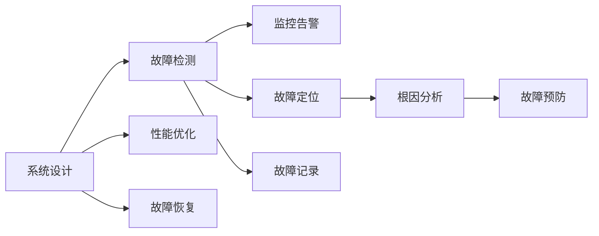

                 

# SRE（站点可靠性工程）：确保大规模系统的可靠性

> 关键词：站点可靠性工程(SRE)、分布式系统、系统设计、故障检测、性能优化、故障恢复、监控告警、微服务架构、DevOps文化、故障管理工具

## 1. 背景介绍

随着云计算、微服务架构的普及，企业IT系统变得越来越复杂，同时也面临着更高的可用性和性能要求。站点可靠性工程(Site Reliability Engineering, SRE)作为DevOps文化的重要组成部分，负责保障大规模系统的稳定运行。SRE工程师不仅需要具备深厚的系统架构和运维经验，还需要具备强韧的心理素质和高效的沟通能力，以应对系统故障带来的压力。本文将从SRE的基本概念、核心技术、实际应用场景等多个维度，全面阐述如何确保大规模系统的可靠性。

## 2. 核心概念与联系

### 2.1 核心概念概述

SRE，即站点可靠性工程，是一种旨在通过工程手段提升系统可靠性的专业实践。它涵盖系统设计、故障检测、性能优化、故障恢复、监控告警等多个领域，旨在构建一个可持续、可维护、高可用性的大规模系统。

SRE的核心在于系统设计和故障管理：
- **系统设计**：在架构层面进行冗余、分片、负载均衡、熔断、限流等设计，确保系统在不同负载和故障情况下的稳定性。
- **故障管理**：建立从故障检测、故障定位、故障恢复到根因分析的闭环流程，确保故障快速响应、及时修复。

### 2.2 核心概念原理和架构的 Mermaid 流程图



该图展示了SRE的核心流程和架构：

- **系统设计**(A)：通过架构设计，保证系统的健壮性和鲁棒性。
- **故障检测**(B)：通过监控告警(E)和故障定位(F)，及时发现系统异常。
- **性能优化**(C)：通过优化性能，保证系统高效运行。
- **故障恢复**(D)：通过自动化流程和回滚策略，快速恢复系统服务。
- **根因分析**(H)：通过定量和定性分析，定位故障根本原因。

### 2.3 SRE与DevOps的联系

SRE是DevOps文化的重要组成部分，与DevOps有着密切的联系：
- **DevOps**：一种以文化为核心，以CI/CD管道和基础设施即代码为手段的IT实践，旨在缩短从开发到运维的反馈周期，提升交付速度和质量。
- **SRE**：在DevOps基础上，进一步强调系统可靠性和运维效率，通过系统设计和故障管理，保障系统的稳定性和可用性。

DevOps关注的是如何自动化、持续集成和持续交付软件，而SRE则在此基础上，通过工程化手段，保障软件在生产环境中的可靠性和可用性。两者相辅相成，共同推动软件的快速迭代和高质量交付。

## 3. 核心算法原理 & 具体操作步骤

### 3.1 算法原理概述

SRE的原理主要基于系统设计和故障管理：
- **系统设计**：通过架构设计，实现系统的冗余、分片、负载均衡等，确保系统在各种负载和故障情况下的稳定性。
- **故障管理**：通过故障检测、故障定位、故障恢复和根因分析等流程，及时发现、定位和修复系统故障，保障系统的高可用性。

### 3.2 算法步骤详解

SRE的核心算法步骤主要包括以下几个关键环节：

**Step 1: 系统设计**

- **冗余设计**：在关键组件(如数据库、缓存、消息队列)上进行数据冗余存储，防止单点故障导致系统宕机。
- **分片设计**：对系统数据进行分片存储，均衡负载，提高查询和访问速度。
- **负载均衡**：使用负载均衡算法，动态分配请求到不同的节点上，避免单点过载。
- **熔断设计**：在故障时自动降级，防止雪崩效应导致系统全面崩溃。
- **限流设计**：对系统流量进行限制，防止恶意攻击和高并发请求压垮系统。

**Step 2: 故障检测**

- **监控告警**：通过实时监控系统指标(如CPU利用率、内存占用、网络流量等)，及时发现系统异常。
- **告警规则**：根据业务需求，设置告警规则，自动触发告警通知。
- **告警响应**：建立告警响应机制，根据告警级别和紧急程度，快速响应和处理。

**Step 3: 故障定位**

- **日志分析**：收集系统日志，通过日志分析工具(如ELK Stack、Splunk等)进行事件关联和异常定位。
- **分布式追踪**：使用分布式追踪系统(如Jaeger、Zipkin等)，实时追踪请求在各服务间的流转路径。
- **性能监控**：使用性能监控工具(如Prometheus、Grafana等)，实时监控系统性能指标。

**Step 4: 故障恢复**

- **回滚策略**：在故障发生时，自动回滚到最近的一个稳定版本，确保服务不中断。
- **自动化流程**：通过CI/CD管道，自动部署新的稳定版本，快速恢复服务。
- **状态感知**：使用状态感知机制，实时监控服务的运行状态，及时进行故障恢复。

**Step 5: 根因分析**

- **故障分析**：通过日志、监控数据、分布式追踪等信息，进行故障分析和定位。
- **故障预防**：根据故障分析结果，优化系统设计，改进故障检测和故障恢复机制。
- **反馈迭代**：将故障分析结果反馈给开发团队，进行系统优化和迭代改进。

### 3.3 算法优缺点

**优点**：
- **系统健壮性**：通过冗余、分片、负载均衡等设计，系统能够承受更高的负载和更频繁的故障。
- **故障快速定位**：通过日志分析、分布式追踪、性能监控等手段，能够快速定位故障原因。
- **故障快速恢复**：通过回滚策略、自动化流程、状态感知等机制，能够快速恢复服务，保障系统高可用性。
- **持续改进**：通过故障分析和故障预防，不断优化系统设计和运维流程，提升系统可靠性。

**缺点**：
- **设计复杂性**：冗余、分片等设计虽然提升了系统的可靠性，但也增加了系统复杂性，需要精心设计和维护。
- **监控告警噪音**：监控告警系统的设置需要精细调整，避免过高的噪音导致团队疲于奔命。
- **故障恢复代价**：在故障恢复过程中，可能需要进行回滚、部署等操作，这会影响系统的正常运行。
- **故障管理成本**：故障分析、故障预防等需要投入大量的人力和资源，成本较高。

### 3.4 算法应用领域

SRE技术广泛应用于各种大规模系统的设计和运维，包括但不限于以下领域：

- **云计算平台**：如AWS、Google Cloud、阿里云等，负责云基础设施的可靠性设计和故障管理。
- **金融服务**：如股票交易、支付系统等，对高并发、高可用性要求极高，需要精细的系统设计和故障管理。
- **电子商务**：如Amazon、阿里巴巴、京东等，需要处理海量的用户请求，确保系统的稳定性和可用性。
- **社交媒体**：如Twitter、Facebook、微信等，需要处理海量用户上传的数据和请求，保证系统的可靠性和用户体验。
- **物联网**：如IoT平台、智能家居等，需要处理海量的传感器数据和设备连接，确保系统的稳定性和数据安全。

以上应用场景展示了SRE技术在多个领域的重要性和广泛应用。通过系统设计和故障管理，SRE技术能够保障系统在高并发、高可用性要求下的稳定性和可靠性。

## 4. 数学模型和公式 & 详细讲解 & 举例说明

### 4.1 数学模型构建

SRE中的数学模型主要围绕系统性能和故障检测展开：
- **系统性能模型**：用于描述系统的响应时间、吞吐量、错误率等性能指标，通常采用A/B测试、负载测试等方法进行评估。
- **故障检测模型**：用于描述系统故障的检测算法，通常采用阈值告警、异常检测等方法进行实现。

### 4.2 公式推导过程

以下以异常检测算法为例，介绍其推导过程。

假设系统有 $N$ 个节点，每个节点的运行状态为 $S_i$，其中 $S_i \in \{0, 1\}$，$0$ 表示正常状态，$1$ 表示异常状态。设每个节点在单位时间内的正常状态概率为 $p$，异常状态概率为 $q$，则系统整体的正常状态概率 $p_{\text{sys}}$ 和异常状态概率 $q_{\text{sys}}$ 可以表示为：

$$
p_{\text{sys}} = (1-q)^N \\
q_{\text{sys}} = 1 - p_{\text{sys}}
$$

假设每个节点的正常状态和异常状态是相互独立的，则系统在单位时间内的异常状态概率 $q_{\text{sys}}$ 可以通过贝叶斯公式计算：

$$
q_{\text{sys}} = (1-q)^N \times \sum_{k=1}^{N} \binom{N}{k} p^k q^{N-k}
$$

其中，$\binom{N}{k}$ 为组合数，表示从 $N$ 个节点中选择 $k$ 个节点处于异常状态的组合方式。

**案例分析与讲解**：

在电商平台的订单处理系统中，设订单处理延迟时间 $d_i$ 符合正态分布 $N(0, \sigma^2)$，每个订单处理节点在单位时间内的异常状态概率 $q$ 为 $0.01$，正常状态概率 $p$ 为 $0.99$。系统由 100 个节点组成，每个节点的处理时间 $d_i$ 相互独立。

设系统在单位时间内的平均延迟时间为 $d_{\text{avg}}$，则 $d_{\text{avg}} = 0$。设系统在单位时间内的异常延迟概率 $q_{\text{delay}}$ 为 $0.1$，则 $q_{\text{delay}} = q^N \sum_{k=1}^{N} \binom{N}{k} p^k q^{N-k}$。

通过计算，可以得出系统在单位时间内的异常延迟概率 $q_{\text{delay}}$，从而进行故障检测和告警。

### 4.3 案例分析与讲解

在金融交易系统中，设每个交易请求的响应时间 $t_i$ 符合指数分布 $E(\lambda)$，每个交易节点在单位时间内的异常状态概率 $q$ 为 $0.01$，正常状态概率 $p$ 为 $0.99$。系统由 100 个节点组成，每个节点的响应时间 $t_i$ 相互独立。

设系统在单位时间内的平均响应时间为 $t_{\text{avg}}$，则 $t_{\text{avg}} = \frac{1}{\lambda}$。设系统在单位时间内的异常响应概率 $q_{\text{response}}$ 为 $0.1$，则 $q_{\text{response}} = q^N \sum_{k=1}^{N} \binom{N}{k} p^k q^{N-k}$。

通过计算，可以得出系统在单位时间内的异常响应概率 $q_{\text{response}}$，从而进行故障检测和告警。

## 5. 项目实践：代码实例和详细解释说明

### 5.1 开发环境搭建

SRE技术的开发环境搭建主要依赖于云计算平台和运维工具：

1. **云计算平台**：选择AWS、Google Cloud、阿里云等云平台，搭建虚拟实例和容器化环境。
2. **运维工具**：安装Prometheus、Grafana、ELK Stack、Jaeger等监控、告警、日志、追踪工具。
3. **自动化工具**：安装Jenkins、GitLab CI/CD等自动化部署工具。

### 5.2 源代码详细实现

以下以使用Prometheus进行系统监控告警的Python代码实现为例：

```python
import prometheus_client

# 注册Prometheus收集器
prometheus_client.register.collectors()

# 设置监控指标
metric = prometheus_client.GaugeMetricFamily(
    'name', 
    'System Load', 
    ['node', 'metric'])
metric.add_metric(['node1', 'cpu_load'], 0.8)
metric.add_metric(['node2', 'cpu_load'], 0.6)

# 发布监控数据
prometheus_client.collectors.CollectorRegistry().register(metric)
prometheus_client.CollectorRegistry().fire()
```

以上代码定义了一个名为 `System Load` 的Gauge指标，用于监控两个节点的CPU负载。通过设置不同的 `node` 和 `metric` 值，可以监控不同节点和不同指标的数据。

### 5.3 代码解读与分析

**代码解读**：

- **导入Prometheus客户端库**：使用 `prometheus_client` 库注册收集器和设置监控指标。
- **定义监控指标**：使用 `GaugeMetricFamily` 定义一个名为 `System Load` 的指标，用于监控两个节点的CPU负载。
- **添加监控数据**：通过 `add_metric` 方法添加两个节点的CPU负载数据，分别为0.8和0.6。
- **注册和发布监控数据**：使用 `register` 方法将监控指标注册到 `CollectorRegistry`，并通过 `fire` 方法发布监控数据到Prometheus。

**代码分析**：

- **配置文件**：在 `prometheus.yml` 配置文件中，需要指定监控指标、告警规则、数据存储等参数。
- **告警规则**：通过配置告警规则，可以设置CPU负载超过一定阈值时的告警策略，如告警时间、告警方式等。
- **数据存储**：通过配置 `Storage` 模块，可以将监控数据存储到本地或远程数据库中，方便后续分析和告警。

### 5.4 运行结果展示

通过以上代码，可以监控两个节点的CPU负载，并在超过一定阈值时触发告警。在Prometheus中配置好告警规则后，即可通过告警规则进行告警通知，确保系统故障能够及时被发现和处理。

## 6. 实际应用场景

### 6.1 金融服务

金融服务对系统的高可用性和稳定性要求极高。SRE技术可以通过以下方式，确保金融服务的可靠运行：

- **系统设计**：在关键组件上引入冗余和熔断设计，防止单点故障导致系统宕机。
- **故障检测**：使用监控工具实时监控系统指标，及时发现异常。
- **故障定位**：通过日志分析和分布式追踪，快速定位故障原因。
- **故障恢复**：通过回滚策略和自动化流程，快速恢复服务。
- **根因分析**：通过定量和定性分析，改进系统设计，提升系统可靠性。

### 6.2 电子商务

电子商务平台需要处理海量的用户请求，保障系统的稳定性和用户体验。SRE技术可以通过以下方式，确保电子商务平台的可靠运行：

- **系统设计**：在架构设计中引入负载均衡和限流机制，防止系统过载。
- **故障检测**：通过监控工具实时监控系统性能，及时发现异常。
- **故障定位**：通过日志分析和分布式追踪，快速定位故障原因。
- **故障恢复**：通过回滚策略和自动化流程，快速恢复服务。
- **根因分析**：通过定量和定性分析，改进系统设计，提升系统可靠性。

### 6.3 物联网

物联网平台需要处理海量的传感器数据和设备连接，确保系统的稳定性和数据安全。SRE技术可以通过以下方式，确保物联网平台的可靠运行：

- **系统设计**：在架构设计中引入冗余和分片设计，确保系统在高并发情况下的稳定性。
- **故障检测**：通过监控工具实时监控系统指标，及时发现异常。
- **故障定位**：通过日志分析和分布式追踪，快速定位故障原因。
- **故障恢复**：通过回滚策略和自动化流程，快速恢复服务。
- **根因分析**：通过定量和定性分析，改进系统设计，提升系统可靠性。

## 7. 工具和资源推荐

### 7.1 学习资源推荐

1. **《SRE: The Book》**：Holger Anton-Garde和Sascha Gaume合著的SRE权威书籍，系统介绍了SRE的基本概念、核心技术和最佳实践。
2. **《Site Reliability Engineering: How Google Runs Production Systems》**：Google SRE团队合著的SRE实践指南，介绍了Google如何在大规模系统中实现高可用性。
3. **《DevOps 实践指南》**：Danielle Kummer和Joao Horta编译的DevOps实践指南，介绍了DevOps文化的核心原则和最佳实践。
4. **《The Phoenix Project》**：Gene Kim、Patrick Debois和Gene Wurster合著的IT运维小说，通过故事的形式展示了SRE的实际应用。
5. **《SRE Salon》**：GitLab举办的技术讲座，邀请SRE专家分享最佳实践和前沿技术。

### 7.2 开发工具推荐

1. **Prometheus**：开源监控系统，用于实时监控系统指标，发现异常和告警。
2. **Grafana**：开源可视化工具，用于展示和分析监控数据。
3. **ELK Stack**：开源日志分析和搜索平台，用于日志收集、分析和可视化。
4. **Jaeger**：开源分布式追踪系统，用于追踪请求在各服务间的流转路径。
5. **Jenkins**：开源CI/CD工具，用于自动化部署和持续集成。
6. **GitLab CI/CD**：开源持续集成工具，支持代码审查、自动化测试和部署。

### 7.3 相关论文推荐

1. **《Site Reliability Engineering: How Google Runs Production Systems》**：Google SRE团队合著的SRE实践指南，介绍了Google如何在大规模系统中实现高可用性。
2. **《Mastering Site Reliability Engineering: How Google Runs Production Systems》**：Wesley Chun合著的SRE技术书籍，深入探讨了SRE的原理和实践。
3. **《Large-Scale System Monitoring and Fault Diagnosis》**：Holger Anton-Garde和Sascha Gaume合著的论文，介绍了大规模系统监控和故障诊断的方法。
4. **《Designing Distributed Systems》**：Kent Beck和Eric Freeman合著的经典书籍，介绍了分布式系统的设计和运维。

## 8. 总结：未来发展趋势与挑战

### 8.1 研究成果总结

SRE技术在保障大规模系统可靠性和可用性方面发挥了重要作用，通过系统设计和故障管理，确保系统在各种负载和故障情况下的稳定性。SRE技术在金融服务、电子商务、物联网等诸多领域得到了广泛应用，成为保障系统高可用性的重要手段。

### 8.2 未来发展趋势

1. **微服务架构**：随着微服务架构的普及，SRE技术将更加聚焦于服务间的通信和协调，提升系统整体可靠性。
2. **人工智能**：将人工智能技术引入SRE，通过预测性运维和自动化故障处理，进一步提升系统可靠性。
3. **云计算**：随着云计算的普及，SRE技术将更多地应用于云平台的安全和稳定管理。
4. **DevOps文化**：SRE与DevOps文化的融合将更加深入，推动软件交付速度和质量的提升。

### 8.3 面临的挑战

1. **系统复杂性**：大规模系统的复杂性带来了设计、运维的挑战，需要更多的工具和经验支持。
2. **监控告警噪音**：监控告警系统的配置和调整需要精细管理，避免噪音影响团队效率。
3. **故障恢复代价**：在故障恢复过程中，可能需要进行回滚、部署等操作，影响系统的正常运行。
4. **故障管理成本**：故障分析、故障预防等需要投入大量的人力和资源，成本较高。

### 8.4 研究展望

1. **实时监控和预测**：通过引入人工智能和大数据分析技术，实现实时监控和预测性运维。
2. **自动化故障处理**：通过自动化流程和机器学习算法，实现自动化故障处理和恢复。
3. **分布式系统管理**：在分布式系统中，通过智能路由和负载均衡，提升系统的稳定性和可靠性。
4. **持续改进**：通过数据驱动的优化和迭代改进，不断提升系统的性能和可靠性。

## 9. 附录：常见问题与解答

**Q1：SRE与DevOps的区别是什么？**

A: SRE是DevOps文化的重要组成部分，主要关注系统的稳定性和可靠性。DevOps更注重软件的持续交付和持续集成，包括自动化测试、部署、监控等环节。

**Q2：如何进行系统设计？**

A: 系统设计需要考虑冗余、分片、负载均衡、熔断、限流等设计，确保系统在不同负载和故障情况下的稳定性。

**Q3：如何优化系统性能？**

A: 通过负载均衡、分布式缓存、异步处理等手段，优化系统性能，提升系统的响应时间和吞吐量。

**Q4：如何进行故障检测？**

A: 通过监控工具实时监控系统指标，及时发现异常。同时，设置告警规则，自动触发告警通知。

**Q5：如何进行故障定位和恢复？**

A: 通过日志分析、分布式追踪、性能监控等手段，快速定位故障原因。通过回滚策略和自动化流程，快速恢复服务。

**Q6：如何进行故障预防和根因分析？**

A: 通过故障分析和故障预防，改进系统设计，优化故障检测和故障恢复机制。通过定量和定性分析，定位故障根本原因。

**Q7：如何保障系统高可用性？**

A: 通过系统设计和故障管理，确保系统在各种负载和故障情况下的稳定性。通过自动化流程和机器学习算法，提升系统的故障检测和恢复能力。

---

作者：禅与计算机程序设计艺术 / Zen and the Art of Computer Programming

