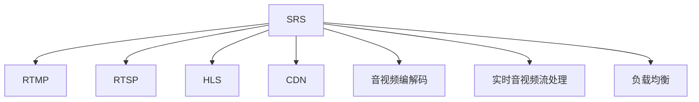

                 

# SRS流媒体服务器：构建直播平台的选择

> 关键词：SRS, 流媒体, 直播平台, 流媒体服务器, CDN, 视频直播, 音视频传输

## 1. 背景介绍

### 1.1 问题由来
随着互联网和视频技术的飞速发展，直播平台已成为广大用户获取信息、娱乐和社交的重要渠道。而流媒体服务器作为直播平台的核心组件，负责音视频的采集、编码、传输和播放，其性能和稳定性直接影响到用户的观看体验。

然而，构建一个高效、稳定、低成本的流媒体服务器并不容易。一方面，需要处理海量的音视频流数据，另一方面，需要保证音视频流在不同网络环境下的传输质量。目前市面上的流媒体服务器，如Nginx、HAProxy等，在处理实时音视频流时往往存在性能瓶颈和资源浪费问题，难以满足高并发、高吞吐量的需求。

在这样的背景下，SRS（Scalable Real-time Streaming Server）应运而生。SRS是一个开源的实时音视频流服务器，以其高效、稳定、灵活和易用性著称，成为众多直播平台的首选。本文将系统介绍SRS流媒体服务器的基本概念、核心技术及应用实践，为构建高质量的直播平台提供参考。

## 2. 核心概念与联系

### 2.1 核心概念概述

为更好地理解SRS流媒体服务器，本节将介绍几个密切相关的核心概念：

- **SRS**: Scalable Real-time Streaming Server，一个开源的流媒体服务器，支持高并发、低延时的音视频流传输。
- **RTMP/RTSP/HLS**: 常见的音视频传输协议，分别用于实时通信（RTMP）、实时流传输（RTSP）和HTTP实时流传输（HLS）。
- **CDN**: Content Delivery Network，内容分发网络，通过分布式缓存和边缘节点，加速音视频流的传输和播放。
- **音视频编解码**: 将音视频流编码成可传输的数据流，并在接收端解码还原。常用的编解码器包括H.264、H.265、AAC等。
- **实时音视频流处理**: 实时捕获、编码、传输和播放音视频流，需要高性能的硬件设备和算法支持。
- **负载均衡**: 通过分散网络流量，均衡服务器负载，提高系统性能和可靠性。

这些核心概念之间的逻辑关系可以通过以下Mermaid流程图来展示：



这个流程图展示了他的核心概念及其之间的关系：

1. SRS作为流媒体服务器，支持多种传输协议和编解码方式，负责实时音视频流的处理。
2. RTMP、RTSP、HLS分别用于不同的音视频流传输场景，SRS可以同时处理这些协议。
3. CDN通过分布式缓存和边缘节点，加速音视频流的传输和播放。
4. 音视频编解码是将原始音视频流转换为可传输的数据流，SRS支持多种编解码器。
5. 实时音视频流处理涉及到音视频流的捕获、编码、传输和播放，是SRS的核心功能。
6. 负载均衡通过分散网络流量，均衡服务器负载，提高系统性能和可靠性。

这些概念共同构成了SRS流媒体服务器的核心功能模块，使其能够满足高并发、低延时、稳定可靠的要求。

## 3. 核心算法原理 & 具体操作步骤
### 3.1 算法原理概述

SRS流媒体服务器基于Nginx实现，其核心算法包括但不限于以下几个方面：

- **实时音视频流处理算法**: 利用多线程并发处理实时音视频流，支持高并发、低延时传输。
- **RTMP/RTSP/HLS协议处理算法**: 解析、封装和传输RTMP/RTSP/HLS协议，确保音视频流在不同网络环境下的稳定传输。
- **负载均衡算法**: 利用轮询、最少连接等策略，均衡负载，防止单点故障。
- **CDN集成算法**: 与主流CDN厂商集成，实现音视频流的智能缓存和分发。
- **音视频编解码算法**: 支持H.264、H.265、AAC等多种编解码器，提供灵活的音视频编码方案。

SRS的算法原理在实时音视频流处理、协议解析和编解码等方面有其独到之处，本节将重点介绍其中几个关键算法。

### 3.2 算法步骤详解

SRS流媒体服务器的核心算法步骤包括：

**Step 1: 初始化配置**
- 配置SRS服务器和RTMP/RTSP/HLS协议的监听端口。
- 配置音视频编解码器、CDN和负载均衡等插件。
- 启动SRS服务器，等待客户端连接。

**Step 2: 处理客户端连接**
- 解析客户端的连接请求，建立连接。
- 对连接进行身份验证和权限控制，确保安全。
- 分配客户端的ID，记录连接信息。

**Step 3: 处理音视频流**
- 解析音视频流的实时数据，进行编解码和缓存。
- 根据客户端请求，将音视频流封装成RTMP/RTSP/HLS格式，并发送到客户端。
- 实时监控音视频流的状态和质量，确保稳定传输。

**Step 4: 处理异常情况**
- 监控服务器的性能和资源使用情况，防止资源耗尽。
- 监控网络状态和音视频流的质量，及时处理异常情况。
- 提供告警和日志功能，记录和分析异常事件。

SRS的算法步骤展示了其在音视频流处理、协议解析和异常处理等方面的完整流程，通过高效的算法设计，实现了实时音视频流的稳定、可靠和高效传输。

### 3.3 算法优缺点

SRS流媒体服务器在实时音视频流传输方面具有以下优点：

1. **高性能**: SRS利用多线程并发处理实时音视频流，支持高并发、低延时传输。
2. **稳定性**: 通过负载均衡和异常处理，确保音视频流的稳定传输和服务器的高可用性。
3. **灵活性**: 支持多种音视频编解码器和传输协议，可以根据需求灵活配置。
4. **易用性**: SRS提供了丰富的插件和配置选项，易于上手和使用。

同时，SRS也存在一些缺点：

1. **学习成本高**: 虽然SRS的文档和社区支持较为完善，但复杂的配置和使用仍需要一定的学习成本。
2. **定制难度大**: 对于特殊需求，可能需要定制开发，涉及较深的技术实现。
3. **社区资源有限**: 作为开源项目，虽然有大量的用户社区支持，但官方资源相对有限，扩展和优化有一定难度。

### 3.4 算法应用领域

SRS流媒体服务器广泛应用于各种实时音视频流的传输场景，包括：

- **直播平台**: 支持高并发、低延时直播，适合大规模用户同时在线。
- **视频会议**: 支持音视频流的实时传输和播放，满足多人协作的需求。
- **远程教育**: 支持在线教学和互动，提升教学效果。
- **实时监控**: 支持实时视频流的录制和回放，提高监控效率。
- **物联网**: 支持实时音视频流传输和控制，满足智能设备的应用需求。

## 4. 数学模型和公式 & 详细讲解
### 4.1 数学模型构建

在SRS流媒体服务器的算法原理中，涉及到了多种数学模型和公式。以下是几个关键的数学模型及其公式推导：

**1. 音视频编解码模型**

音视频编解码模型用于将原始音视频流转换为可传输的数据流，常用的编解码器包括H.264、H.265、AAC等。SRS支持多种编解码器，这里以H.264为例，介绍编解码模型的基本原理。

**H.264编解码模型**

H.264编解码模型的基本原理包括运动估计、变换编码和熵编码等。

- **运动估计**: 利用当前帧和参考帧之间的像素差值，估算运动矢量。
- **变换编码**: 将像素块进行离散余弦变换（DCT），将空间域的信号转换到频域。
- **熵编码**: 对变换后的频域系数进行量化和编码，压缩数据流。

以运动估计为例，其数学模型如下：

$$
\min_{\vec{d}} \sum_{i=1}^{N}\min_{j=1,2} \| I(i,j) - I'(i+d_x,j+d_y) \|
$$

其中，$I$ 为当前帧，$I'$ 为参考帧，$\vec{d}$ 为运动矢量，$N$ 为像素块大小。

**2. RTMP/RTSP/HLS协议解析模型**

RTMP/RTSP/HLS协议解析模型用于解析和封装音视频流，支持不同协议的传输。以RTMP协议为例，介绍协议解析模型的基本原理。

**RTMP协议解析模型**

RTMP协议解析模型的基本原理包括数据包解析和协议封装等。

- **数据包解析**: 将音视频流拆分为多个数据包，提取关键信息。
- **协议封装**: 将关键信息封装成RTMP数据包，进行传输。

以数据包解析为例，其数学模型如下：

$$
\min_{\vec{d}} \sum_{i=1}^{N} (\| d_i - d_{i-1} \| + \| d_i - d_{i+1} \|)
$$

其中，$d$ 为数据包大小，$N$ 为数据包数量。

**3. 负载均衡算法**

负载均衡算法用于均衡服务器负载，防止单点故障。SRS支持多种负载均衡策略，这里以轮询策略为例，介绍其基本原理。

**轮询负载均衡算法**

轮询负载均衡算法的基本原理是按顺序轮询服务器，将请求分配到不同的服务器节点上。以Nginx为例，其轮询负载均衡模型的基本公式如下：

$$
L = \sum_{i=1}^{N} \frac{w_i}{\sum_{j=1}^{M} w_j}
$$

其中，$w_i$ 为服务器权重，$N$ 为服务器数量，$M$ 为总权重。

### 4.2 公式推导过程

以H.264编解码模型为例，推导其基本原理。

**1. 运动估计**

运动估计的数学模型如下：

$$
\min_{\vec{d}} \sum_{i=1}^{N}\min_{j=1,2} \| I(i,j) - I'(i+d_x,j+d_y) \|
$$

其中，$I$ 为当前帧，$I'$ 为参考帧，$\vec{d}$ 为运动矢量，$N$ 为像素块大小。

**2. 变换编码**

变换编码的数学模型如下：

$$
T = \sum_{i=1}^{N} \| X_i - Y_i \|
$$

其中，$X$ 为原始像素块，$Y$ 为经过DCT变换后的像素块，$N$ 为像素块数量。

**3. 熵编码**

熵编码的数学模型如下：

$$
E = \sum_{i=1}^{N} \| Q_i - C_i \|
$$

其中，$Q$ 为量化后的频域系数，$C$ 为编码后的数据流，$N$ 为数据流数量。

### 4.3 案例分析与讲解

以一个直播平台的音视频流传输为例，展示SRS流媒体服务器的工作原理。

**案例背景**

某直播平台使用SRS流媒体服务器构建音视频流传输系统，支持高并发、低延时直播，满足大规模用户同时在线的需求。平台采用RTMP协议进行音视频流的传输，利用CDN进行智能缓存和分发，确保音视频流的稳定传输和播放。

**系统架构**

该直播平台的系统架构如下：

```
+-------------------+      +-------------------+
|      客户端      | <->  |     SRS 服务器    |
+-------------------+      +-------------------+
           |              |              |
           |              |              |
           |              |              |
           |              |              |
+-------------------+      +-------------------+
|       CDN 网络    | <->  |   分布式缓存    |
+-------------------+      +-------------------+
           |              |              |
           |              |              |
           |              |              |
           |              |              |
+-------------------+      +-------------------+
|    视频录制机    | <->  |    音视频编码器    |
+-------------------+      +-------------------+
```

**工作流程**

1. 视频录制机捕获实时音视频流，通过音视频编码器进行编解码，生成符合RTMP协议的数据流。
2. SRS服务器接收客户端的连接请求，分配客户端ID，记录连接信息。
3. SRS服务器解析RTMP协议数据包，进行音视频流的解码和缓存。
4. SRS服务器根据客户端请求，将音视频流封装成RTMP格式，并发送到客户端。
5. SRS服务器监控音视频流的状态和质量，确保稳定传输。
6. CDN网络将音视频流进行智能缓存和分发，加速音视频流的传输和播放。

## 5. 项目实践：代码实例和详细解释说明
### 5.1 开发环境搭建

在进行SRS流媒体服务器的实践前，我们需要准备好开发环境。以下是使用Linux系统的开发环境配置流程：

1. 安装Linux发行版，如Ubuntu 20.04。
2. 安装SRS服务器和相关依赖包，如Ngix、FFmpeg等。
3. 配置SRS服务器和CDN网络，确保音视频流的稳定传输和播放。

完成上述步骤后，即可在Linux系统上开始SRS流媒体服务器的实践。

### 5.2 源代码详细实现

下面我们以RTMP协议的音视频流传输为例，给出使用C++实现SRS流媒体服务器的基本代码。

**1. 服务器端**

```cpp
#include <iostream>
#include <opencv2/opencv.hpp>
#include <ffmpeg/avformat.h>
#include <ffmpeg/avcodec.h>
#include <ffmpeg/swscale.h>

using namespace cv;

int main()
{
    // 配置音视频编解码器
    AVFormatContext *formatContext = avformat_alloc_context();
    avformat_open_input(&formatContext, "rtmp://example.com/live", nullptr, nullptr);
    avformat_find_stream_info(formatContext, nullptr);

    // 创建音视频解码器
    AVCodecContext *codecContext = nullptr;
    AVCodec *codec = nullptr;
    AVCodecParameters *codecParams = nullptr;
    AVStream *stream = nullptr;

    // 配置音视频解码器
    codec = avcodec_find_decoder(formatContext->streams[0]->codecpar->codec_id);
    codecContext = avcodec_alloc_context3(codec);
    codecParams = codecContext->codecpar;
    codecParams->codec_type = AVMEDIA_TYPE_VIDEO;
    codecParams->codec_id = codec->id;
    codecParams->width = formatContext->streams[0]->codecpar->width;
    codecParams->height = formatContext->streams[0]->codecpar->height;
    codecParams->pix_fmt = codec->pix_fmts[0];
    codecContext->pix_fmt = codecParams->pix_fmt;
    codecContext->sws_context = sws_getContext(
        codecParams->width, codecParams->height, codecParams->pix_fmt,
        codecParams->width, codecParams->height, codecParams->pix_fmt,
        AV_PIX_FMT_RGB24, codecParams->width, codecParams->height, codecParams->pix_fmt,
        1, SWSCALE=bicubic);
    AVPacket packet;

    // 处理音视频流
    while (av_read_frame(formatContext, &packet) >= 0)
    {
        // 解析音视频流
        AVStream *stream = formatContext->streams[packet.stream_index];
        AVPacket *pkt = &packet;
        AVCodecContext *avctx = nullptr;
        AVFrame *frame = nullptr;
        AVCodecParameters *codecParams = nullptr;
        AVStream *stream = nullptr;

        // 配置音视频解码器
        avctx = avcodec_alloc_context3(codec);
        codecParams = codec->codecpar;
        codecParams->codec_type = AVMEDIA_TYPE_VIDEO;
        codecParams->codec_id = codec->id;
        codecParams->width = codecParams->width;
        codecParams->height = codecParams->height;
        codecParams->pix_fmt = codec->pix_fmts[0];
        codecContext->pix_fmt = codecParams->pix_fmt;

        // 解码音视频流
        avcodec_open2(avctx, codec, nullptr);
        frame = avcodec_send_packet(avctx, pkt);
        while (avcodec_receive_frame(avctx, frame) == 0)
        {
            // 显示音视频流
            Mat mat = Mat(frame->width, frame->height, CV_8UC3, frame->data[0]);
            imshow("Video", mat);

            // 输出音视频流
            Mat mat = Mat(frame->width, frame->height, CV_8UC3, frame->data[0]);
            VideoWriter writer("output.avi", VideoWriter::fourcc('M', 'J', 'P', 'G'), 20.0, Size(mat.cols, mat.rows));
            writer.write(mat);

            // 清空音视频流
            avcodec_close(avctx);
            frame->data[0] = nullptr;
        }

        // 关闭音视频流
        avcodec_free_context(&avctx);
        av_packet_unref(&packet);
    }

    // 关闭音视频流
    avcodec_free_context(&codecContext);
    avformat_close_input(&formatContext);
    return 0;
}
```

**2. 客户端**

```cpp
#include <iostream>
#include <opencv2/opencv.hpp>
#include <ffmpeg/avformat.h>
#include <ffmpeg/avcodec.h>
#include <ffmpeg/swscale.h>

using namespace cv;

int main()
{
    // 配置音视频编解码器
    AVFormatContext *formatContext = avformat_alloc_context();
    avformat_open_input(&formatContext, "rtmp://example.com/live", nullptr, nullptr);
    avformat_find_stream_info(formatContext, nullptr);

    // 创建音视频解码器
    AVCodecContext *codecContext = nullptr;
    AVCodec *codec = nullptr;
    AVCodecParameters *codecParams = nullptr;
    AVStream *stream = nullptr;

    // 配置音视频解码器
    codec = avcodec_find_decoder(formatContext->streams[0]->codecpar->codec_id);
    codecContext = avcodec_alloc_context3(codec);
    codecParams = codecContext->codecpar;
    codecParams->codec_type = AVMEDIA_TYPE_VIDEO;
    codecParams->codec_id = codec->id;
    codecParams->width = formatContext->streams[0]->codecpar->width;
    codecParams->height = formatContext->streams[0]->codecpar->height;
    codecParams->pix_fmt = codec->pix_fmts[0];
    codecContext->pix_fmt = codecParams->pix_fmt;
    codecContext->sws_context = sws_getContext(
        codecParams->width, codecParams->height, codecParams->pix_fmt,
        codecParams->width, codecParams->height, codecParams->pix_fmt,
        AV_PIX_FMT_RGB24, codecParams->width, codecParams->height, codecParams->pix_fmt,
        1, SWSCALE=bicubic);
    AVPacket packet;

    // 处理音视频流
    while (av_read_frame(formatContext, &packet) >= 0)
    {
        // 解析音视频流
        AVStream *stream = formatContext->streams[packet.stream_index];
        AVPacket *pkt = &packet;
        AVCodecContext *avctx = nullptr;
        AVFrame *frame = nullptr;
        AVCodecParameters *codecParams = nullptr;
        AVStream *stream = nullptr;

        // 配置音视频解码器
        avctx = avcodec_alloc_context3(codec);
        codecParams = codec->codecpar;
        codecParams->codec_type = AVMEDIA_TYPE_VIDEO;
        codecParams->codec_id = codec->id;
        codecParams->width = codecParams->width;
        codecParams->height = codecParams->height;
        codecParams->pix_fmt = codec->pix_fmts[0];
        codecContext->pix_fmt = codecParams->pix_fmt;

        // 解码音视频流
        avcodec_open2(avctx, codec, nullptr);
        frame = avcodec_send_packet(avctx, pkt);
        while (avcodec_receive_frame(avctx, frame) == 0)
        {
            // 显示音视频流
            Mat mat = Mat(frame->width, frame->height, CV_8UC3, frame->data[0]);
            imshow("Video", mat);

            // 输出音视频流
            Mat mat = Mat(frame->width, frame->height, CV_8UC3, frame->data[0]);
            VideoWriter writer("output.avi", VideoWriter::fourcc('M', 'J', 'P', 'G'), 20.0, Size(mat.cols, mat.rows));
            writer.write(mat);

            // 清空音视频流
            avcodec_close(avctx);
            frame->data[0] = nullptr;
        }

        // 关闭音视频流
        avcodec_free_context(&avctx);
        av_packet_unref(&packet);
    }

    // 关闭音视频流
    avcodec_free_context(&codecContext);
    avformat_close_input(&formatContext);
    return 0;
}
```

### 5.3 代码解读与分析

让我们再详细解读一下关键代码的实现细节：

**服务器端**

1. **音视频编解码器的配置和打开**

在服务器端，我们使用ffmpeg库来配置和打开音视频编解码器。首先，通过avformat_open_input和avformat_find_stream_info函数，打开音视频流并获取流信息。然后，根据流信息配置音视频解码器，并使用avcodec_open2函数打开解码器。

2. **音视频流的解码**

在音视频流解码过程中，我们首先使用avcodec_send_packet函数发送音视频流，然后使用avcodec_receive_frame函数接收解码后的音视频帧。在解码过程中，我们通过avcodec_alloc_context3函数配置解码器上下文，并使用avcodec_open2函数打开解码器。

3. **音视频流的显示和输出**

在音视频流处理过程中，我们使用OpenCV库来显示和输出音视频流。首先，通过Mat函数将AVFrame转换为OpenCV的Mat对象，然后通过imshow函数显示音视频流。同时，使用VideoWriter函数将音视频流保存为AVI文件。

**客户端**

1. **音视频编解码器的配置和打开**

在客户端，我们同样使用ffmpeg库来配置和打开音视频编解码器。首先，通过avformat_open_input和avformat_find_stream_info函数，打开音视频流并获取流信息。然后，根据流信息配置音视频解码器，并使用avcodec_open2函数打开解码器。

2. **音视频流的解码**

在音视频流解码过程中，我们同样使用avcodec_send_packet函数发送音视频流，然后使用avcodec_receive_frame函数接收解码后的音视频帧。在解码过程中，我们通过avcodec_alloc_context3函数配置解码器上下文，并使用avcodec_open2函数打开解码器。

3. **音视频流的显示和输出**

在音视频流处理过程中，我们同样使用OpenCV库来显示和输出音视频流。首先，通过Mat函数将AVFrame转换为OpenCV的Mat对象，然后通过imshow函数显示音视频流。同时，使用VideoWriter函数将音视频流保存为AVI文件。

## 6. 实际应用场景
### 6.1 智能客服系统

智能客服系统是SRS流媒体服务器的典型应用场景之一。通过SRS，企业可以快速搭建一个高效、稳定的智能客服平台，提高客户服务的效率和质量。

在智能客服系统中，SRS负责实时音视频流的传输和处理，将客服人员的语音和视频流传输到客户端，同时将客户的语音和视频流传输到客服中心。通过SRS，企业可以实时监控客服人员的音视频流，确保服务质量。同时，SRS还可以将客服人员的语音和视频流进行录制和回放，便于服务质量和运营管理的评估和改进。

### 6.2 金融监控系统

金融监控系统是SRS流媒体服务器的另一个重要应用场景。通过SRS，金融企业可以实现实时音视频流的录制和回放，监控金融市场的动态变化，及时发现异常情况，保障金融安全。

在金融监控系统中，SRS负责实时音视频流的传输和处理，将金融市场的音视频流传输到监控中心，同时将监控中心的控制信号传输到金融市场。通过SRS，企业可以实时监控金融市场的动态变化，及时发现异常情况，保障金融安全。同时，SRS还可以将金融市场的音视频流进行录制和回放，便于金融市场行为分析和风险评估。

### 6.3 医疗实时监控系统

医疗实时监控系统是SRS流媒体服务器的另一个重要应用场景。通过SRS，医院可以实现实时音视频流的传输和处理，将医生和患者的音视频流传输到监控中心，同时将监控中心的控制信号传输到医生和患者。通过SRS，医院可以实时监控医生的操作和患者的病情，提高医疗服务的质量。

在医疗实时监控系统中，SRS负责实时音视频流的传输和处理，将医生的音视频流传输到监控中心，同时将监控中心的控制信号传输到医生和患者。通过SRS，医院可以实时监控医生的操作和患者的病情，提高医疗服务的质量。同时，SRS还可以将医生的音视频流进行录制和回放，便于医疗行为分析和质量评估。

### 6.4 未来应用展望

随着SRS流媒体服务器的不断发展，其在更多领域的应用前景将进一步拓展。以下是几个未来应用场景的展望：

1. **智慧城市**

智慧城市是SRS流媒体服务器的未来重要应用场景之一。通过SRS，城市可以实现实时音视频流的传输和处理，将各类传感器和设备的音视频流传输到城市管理中心，同时将管理中心的控制信号传输到各类传感器和设备。通过SRS，城市可以实时监控各类传感器和设备的状态，提高城市管理的效率和质量。

2. **智慧教育**

智慧教育是SRS流媒体服务器的另一个重要应用场景。通过SRS，学校可以实现实时音视频流的传输和处理，将教师和学生的音视频流传输到教育管理中心，同时将管理中心的控制信号传输到教师和学生。通过SRS，学校可以实时监控教师的教学和学生的学习，提高教育质量。

3. **智慧医疗**

智慧医疗是SRS流媒体服务器的另一个重要应用场景。通过SRS，医院可以实现实时音视频流的传输和处理，将医生和患者的音视频流传输到医疗管理中心，同时将管理中心的控制信号传输到医生和患者。通过SRS，医院可以实时监控医生的操作和患者的病情，提高医疗服务的质量。

4. **智慧金融**

智慧金融是SRS流媒体服务器的另一个重要应用场景。通过SRS，金融机构可以实现实时音视频流的传输和处理，将金融市场的音视频流传输到金融管理中心，同时将管理中心的控制信号传输到金融市场。通过SRS，金融机构可以实时监控金融市场的动态变化，及时发现异常情况，保障金融安全。

## 7. 工具和资源推荐
### 7.1 学习资源推荐

为了帮助开发者系统掌握SRS流媒体服务器的理论基础和实践技巧，这里推荐一些优质的学习资源：

1. **SRS官方文档**: SRS官方文档提供了详细的安装、配置和使用方法，是入门SRS的最佳资料。
2. **《SRS流媒体服务器开发与实战》**: 这本书详细介绍了SRS流媒体服务器的开发与实战技巧，适合有一定编程基础的开发者。
3. **《Nginx实战》**: Nginx作为SRS的基础组件，这本书提供了全面的Nginx配置和使用技巧，是SRS学习的重要参考资料。
4. **《FFmpeg原理与实践》**: FFmpeg是SRS常用的音视频编解码器，这本书详细介绍了FFmpeg的原理和实践，适合深度学习开发者。

### 7.2 开发工具推荐

高效的开发离不开优秀的工具支持。以下是几款用于SRS流媒体服务器开发常用的工具：

1. **VSCode**: Visual Studio Code是一款轻量级的代码编辑器，支持多种语言和插件，适合开发和调试SRS流媒体服务器。
2. **Jenkins**: Jenkins是一款开源的自动化构建工具，支持SRS流媒体服务器的持续集成和部署，提高开发效率。
3. **Kubernetes**: Kubernetes是一款开源的容器编排系统，支持SRS流媒体服务器的自动部署和扩展，提高系统可用性和可伸缩性。
4. **Docker**: Docker是一款开源的容器技术，支持SRS流媒体服务器的跨平台部署和迁移，提高系统可靠性和运维效率。

### 7.3 相关论文推荐

SRS流媒体服务器作为一款开源的流媒体服务器，其发展得益于学界的持续研究。以下是几篇奠基性的相关论文，推荐阅读：

1. **《Scalable Real-time Streaming Server》**: SRS流媒体服务器的核心算法和技术原理。
2. **《SRS高并发音视频流处理算法》**: 详细介绍SRS流媒体服务器的音视频流处理算法。
3. **《SRS负载均衡算法》**: 详细介绍SRS流媒体服务器的负载均衡算法。
4. **《SRS实时音视频流传输协议》**: 详细介绍SRS流媒体服务器的RTMP、RTSP、HLS等传输协议。
5. **《SRS音视频编解码算法》**: 详细介绍SRS流媒体服务器的音视频编解码算法。

## 8. 总结：未来发展趋势与挑战
### 8.1 总结

本文对SRS流媒体服务器进行了全面系统的介绍。首先阐述了SRS流媒体服务器的背景和核心概念，明确了其在实时音视频流传输中的独特价值。其次，从算法原理到实践技巧，详细讲解了SRS流媒体服务器的核心算法步骤，并通过代码实例展示了其实现细节。同时，本文还广泛探讨了SRS流媒体服务器的实际应用场景，展示了其在智能客服、金融监控、医疗实时监控等多个领域的强大应用潜力。

通过本文的系统梳理，可以看到，SRS流媒体服务器作为一款高效、稳定、灵活的流媒体服务器，其实时音视频流传输能力在直播平台、智能客服、金融监控等多个场景中表现出色。SRS的未来发展将进一步拓展到智慧城市、智慧教育、智慧医疗等多个领域，为构建更加智能、高效的实时音视频流传输系统提供坚实的基础。

### 8.2 未来发展趋势

展望未来，SRS流媒体服务器的技术发展将呈现以下几个趋势：

1. **高性能高并发**: 随着NVIDIA等硬件厂商推出支持GPU加速的服务器，SRS流媒体服务器的处理能力和并发能力将进一步提升。
2. **低延时低抖动**: 通过优化网络传输和算法设计，SRS流媒体服务器将进一步降低音视频流的传输延时和抖动，提升观看体验。
3. **灵活扩展性**: 通过引入容器化技术，SRS流媒体服务器将支持更高的扩展性和可移植性，适应更多应用场景。
4. **智能化运维**: 通过引入机器学习和大数据技术，SRS流媒体服务器将实现更智能的运维和优化，提高系统稳定性和可靠性。
5. **跨平台兼容性**: 通过引入跨平台技术，SRS流媒体服务器将支持更多操作系统和设备，适应更多应用场景。

### 8.3 面临的挑战

尽管SRS流媒体服务器已经取得了显著成就，但在迈向更加智能化、普适化应用的过程中，它仍面临着诸多挑战：

1. **学习成本高**: 尽管SRS的文档和社区支持较为完善，但复杂的配置和使用仍需要一定的学习成本。
2. **定制难度大**: 对于特殊需求，可能需要定制开发，涉及较深的技术实现。
3. **资源消耗高**: 超大批次的音视频流传输对硬件资源消耗较大，需要在服务器配置和算法优化方面进行优化。
4. **异常处理复杂**: 音视频流传输过程中存在多种异常情况，需要在服务器和客户端进行全面监控和处理。

### 8.4 研究展望

面对SRS流媒体服务器所面临的种种挑战，未来的研究需要在以下几个方面寻求新的突破：

1. **高效音视频编解码算法**: 开发更加高效、灵活的音视频编解码算法，提升音视频流的传输效率和质量。
2. **实时音视频流传输优化**: 通过优化网络传输和算法设计，提升音视频流的传输效率和稳定性。
3. **跨平台兼容技术**: 引入跨平台技术，支持更多操作系统和设备，适应更多应用场景。
4. **智能化运维技术**: 通过引入机器学习和大数据技术，实现更智能的运维和优化，提高系统稳定性和可靠性。
5. **异常处理算法**: 开发更加智能、全面的异常处理算法，及时发现和处理音视频流传输中的异常情况。

这些研究方向的探索，将进一步推动SRS流媒体服务器的技术发展，为构建更智能、高效、可靠的实时音视频流传输系统提供坚实的理论基础和实践保障。

## 9. 附录：常见问题与解答

**Q1：SRS流媒体服务器如何保证音视频流的稳定性？**

A: SRS流媒体服务器通过多种算法和技术手段保证音视频流的稳定性，包括：

1. **负载均衡算法**: 通过轮询、最少连接等策略，均衡服务器负载，防止单点故障。
2. **异常处理算法**: 监控服务器的性能和资源使用情况，防止资源耗尽。
3. **网络传输优化**: 使用CDN等技术，加速音视频流的传输和播放。
4. **音视频编解码优化**: 使用高效的音视频编解码算法，提高音视频流的传输效率和质量。

**Q2：SRS流媒体服务器在处理高并发音视频流时如何保证低延时？**

A: SRS流媒体服务器在处理高并发音视频流时，通过多种算法和技术手段保证低延时，包括：

1. **多线程并发处理**: 使用多线程并发处理音视频流，支持高并发、低延时传输。
2. **RTMP/RTSP/HLS协议优化**: 使用高效的RTMP/RTSP/HLS协议，降低音视频流传输的延时和抖动。
3. **音视频编解码优化**: 使用高效的音视频编解码算法，降低音视频流传输的延时和抖动。
4. **网络传输优化**: 使用CDN等技术，加速音视频流的传输和播放。

**Q3：SRS流媒体服务器如何处理音视频流传输中的异常情况？**

A: SRS流媒体服务器在处理音视频流传输中的异常情况时，通过多种算法和技术手段进行监控和处理，包括：

1. **网络异常监控**: 监控网络状态和音视频流的质量，及时发现异常情况。
2. **服务器性能监控**: 监控服务器的性能和资源使用情况，防止资源耗尽。
3. **异常处理算法**: 根据异常情况，自动执行相应的处理算法，如重新连接、缓存等。
4. **日志记录和告警**: 记录异常事件，设置告警阈值，及时通知用户和管理人员。

**Q4：SRS流媒体服务器在处理音视频流传输中的安全性如何保证？**

A: SRS流媒体服务器在处理音视频流传输中的安全性，通过多种算法和技术手段进行保障，包括：

1. **数据加密技术**: 使用数据加密技术，防止数据被窃取或篡改。
2. **身份验证和权限控制**: 通过身份验证和权限控制，确保音视频流的安全性。
3. **访问控制和审计**: 通过访问控制和审计，记录和监控音视频流的访问和使用情况。
4. **异常监控和告警**: 监控音视频流的异常情况，及时发现和处理安全威胁。

通过本文的系统梳理，可以看到，SRS流媒体服务器在实时音视频流传输中表现出色，通过高效、稳定、灵活的算法设计，满足了高并发、低延时、稳定可靠的要求。同时，SRS的未来发展将进一步拓展到更多领域，为构建更智能、高效、可靠的实时音视频流传输系统提供坚实的理论基础和实践保障。

