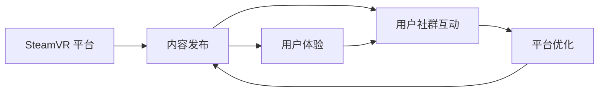

                 

# SteamVR 内容发布策略：在 Steam 平台上推广 VR 体验的建议

> 关键词：SteamVR, 内容发布, VR 体验, 游戏引擎, 社交网络, 平台优化

## 1. 背景介绍

### 1.1 问题由来
随着虚拟现实技术的迅猛发展，VR 游戏市场持续增长，玩家对于高质量 VR 体验的需求也日益增强。SteamVR 作为业界领先的 VR 平台，提供了丰富的游戏资源，吸引了大量用户。然而，如何在如此庞大的平台上，有效推广和发布 VR 内容，仍然是一个巨大的挑战。

### 1.2 问题核心关键点
SteamVR 平台的内容发布策略需要综合考虑多个因素，包括内容质量、用户体验、用户社群互动等。成功的策略应该能够在保证内容质量的前提下，迅速将优质内容推广到目标受众，同时与玩家群体建立紧密的联系，提升用户粘性。

### 1.3 问题研究意义
掌握并实施有效的 SteamVR 内容发布策略，对于提升平台的用户参与度和满意度，增加平台收入，具有重要意义。通过系统的策略设计，可以大幅降低内容推广的难度，减少资源浪费，同时为开发者提供更加明确的方向。

## 2. 核心概念与联系

### 2.1 核心概念概述

为了深入理解如何在 SteamVR 上成功发布 VR 内容，我们需要了解一些核心概念及其之间的联系：

- **SteamVR**：由 Valve 开发的 VR 平台，集成了支持多款 VR 游戏和应用程序的硬件和软件。
- **内容发布**：指将开发好的 VR 游戏或应用，通过 SteamVR 平台发布给用户，并进行有效推广。
- **用户体验**：用户在使用 VR 内容时的整体感受，包括界面设计、操作便捷性、沉浸感等方面。
- **用户社群互动**：用户之间的交流与协作，通过社交网络、论坛、游戏内社区等方式实现。
- **平台优化**：针对 SteamVR 平台特性进行的内容优化，包括性能优化、用户体验改进等。

这些概念之间的关系可以通过以下 Mermaid 流程图来展示：



这个流程图展示了一个从内容发布到用户互动，再到平台优化的循环，其中内容发布是起点，用户体验和用户社群互动是关键节点，而平台优化则是一个持续的优化过程。

## 3. 核心算法原理 & 具体操作步骤
### 3.1 算法原理概述

SteamVR 内容发布策略的核心在于如何通过一系列的算法和步骤，最大化内容对用户的吸引力，同时确保内容的可访问性和可用性。其基本流程可以概括为以下几个关键步骤：

1. **市场调研**：通过分析用户行为和反馈，了解市场需求和用户偏好。
2. **内容制作**：根据市场调研结果，制作高质量的 VR 内容。
3. **内容测试**：在发布前，对内容进行全面的测试和优化，确保用户体验。
4. **发布推广**：通过合适的渠道和策略，将内容推广给目标用户。
5. **反馈迭代**：收集用户反馈，持续改进内容，优化发布策略。

这些步骤并非孤立存在，而是通过循环迭代，不断优化和提升内容发布的效果。

### 3.2 算法步骤详解

以下是对每个步骤的详细说明：

**Step 1: 市场调研**
- **目标用户分析**：识别目标用户群体，了解其年龄、性别、兴趣、使用习惯等信息。
- **市场趋势分析**：分析当前市场的趋势和热门主题，如主题公园、科幻探险、恐怖冒险等。
- **竞品分析**：分析同类型内容的优缺点，找出差异化和创新点。
- **用户反馈收集**：通过问卷调查、社区互动等方式收集用户对类似内容的反馈，了解痛点和需求。

**Step 2: 内容制作**
- **概念设计**：根据市场调研结果，设计内容的主题、情节、角色等。
- **原型开发**：开发内容的原型，确保其基本框架和核心玩法。
- **视觉设计**：设计高质量的视觉元素，如角色模型、场景设计、界面布局等。
- **互动设计**：设计丰富的互动元素，确保内容的多样性和深度。
- **音效和音乐**：添加适当的音效和背景音乐，增强沉浸感。

**Step 3: 内容测试**
- **内部测试**：在开发过程中进行多次内部测试，确保内容的稳定性和可玩性。
- **用户测试**：邀请目标用户进行测试，收集用户反馈，找出问题和改进点。
- **性能优化**：针对测试过程中发现的问题，进行性能优化，确保内容在各种设备上的流畅运行。

**Step 4: 发布推广**
- **选择平台**：选择 SteamVR 平台进行内容发布，确保内容能够最大化覆盖目标用户。
- **定价策略**：根据内容的价值和市场需求，制定合理的定价策略。
- **多渠道推广**：利用 Steam 社区、社交媒体、游戏论坛等渠道进行推广。
- **优惠活动**：推出限时优惠活动，吸引用户下载和使用内容。

**Step 5: 反馈迭代**
- **用户反馈收集**：持续收集用户反馈，了解用户满意度和改进点。
- **内容更新**：根据用户反馈，持续更新和改进内容，提升用户体验。
- **优化推广策略**：根据反馈，优化推广策略，提升内容覆盖率和用户参与度。

### 3.3 算法优缺点

SteamVR 内容发布策略具有以下优点：

1. **提升用户体验**：通过市场调研和内容测试，确保内容的质量和用户体验，吸引更多用户。
2. **多样化推广**：利用多个渠道进行内容推广，增加曝光率，提升用户参与度。
3. **灵活调整**：根据用户反馈，持续优化内容和推广策略，不断提升效果。

同时，该策略也存在一些缺点：

1. **时间和资源投入高**：内容制作和测试需要大量时间和资源，开发周期较长。
2. **成本控制难**：高成本的推广活动可能难以控制，导致投入产出比不佳。
3. **市场变化快**：市场需求和用户偏好变化快，需要不断调整策略以适应变化。

尽管存在这些缺点，但综合来看，SteamVR 内容发布策略在当前的市场环境下，仍然是一种较为科学和有效的方法。

### 3.4 算法应用领域

SteamVR 内容发布策略不仅适用于游戏和应用开发，还可以应用到其他许多领域：

- **教育领域**：开发高质量的 VR 教育内容，如虚拟实验室、历史场景模拟等。
- **医疗领域**：利用 VR 进行手术模拟、心理治疗等，提高培训效果。
- **房地产**：开发虚拟房产展示，提升用户体验和销售效果。
- **旅游业**：设计虚拟旅游体验，让用户在家中也能享受到旅游的乐趣。

这些应用领域都可以在 SteamVR 平台上通过类似的内容发布策略，推广优质 VR 内容，带来新的业务价值。

## 4. 数学模型和公式 & 详细讲解 & 举例说明

### 4.1 数学模型构建

内容发布策略的数学模型可以分解为几个关键部分：

- **市场调研模型**：通过统计分析方法，构建用户行为和市场趋势模型。
- **内容制作模型**：通过设计优化方法，构建内容质量提升模型。
- **用户反馈模型**：通过机器学习模型，构建用户反馈分析模型。

### 4.2 公式推导过程

以用户反馈模型为例，假设有 $N$ 个用户，每个用户对内容有 $M$ 条反馈，每条反馈有一个评分 $r_{ij}$，$i$ 表示用户编号，$j$ 表示反馈编号。

设 $\theta$ 为模型的参数，其中 $\theta$ 包括用户兴趣权重、内容评分权重等。模型公式为：

$$
P(y_i|r_i) = \sigma(\theta^T r_i)
$$

其中 $P(y_i|r_i)$ 表示用户 $i$ 对内容 $j$ 的评分概率，$\sigma$ 为激活函数，$r_i$ 为用户 $i$ 的反馈向量，$\theta$ 为模型参数。

### 4.3 案例分析与讲解

假设某 VR 游戏有 $N=100$ 个用户，每个用户有 $M=20$ 条反馈。通过机器学习模型训练，得到用户对不同内容的评分概率。例如，用户 $i=1$ 对内容 $j=3$ 的评分概率为 $P(y_1|r_1)=0.8$，表示用户 $1$ 对内容 $3$ 非常满意。

## 5. 项目实践：代码实例和详细解释说明
### 5.1 开发环境搭建

SteamVR 内容发布的开发环境主要依赖于Steam 平台和 VR 游戏引擎，以下是一个基本的搭建流程：

1. **Steam 平台注册**：创建 Steam 账户，注册 SteamVR 平台开发者账号。
2. **选择游戏引擎**：选择如 Unity 或 Unreal Engine 等游戏引擎，进行内容开发。
3. **配置开发环境**：搭建虚拟机或安装相应版本的软件，确保开发环境的一致性。
4. **集成 SteamVR SDK**：将 SteamVR SDK 集成到开发环境，进行内容开发和测试。

### 5.2 源代码详细实现

以下是一个简单的 Unity 引擎下开发 VR 游戏的示例：

1. **设置游戏场景**：
```csharp
using UnityEngine;
using UnityEngine.UI;

public class SceneLoader : MonoBehaviour
{
    public GameObject scenePrefab;
    public GameObject transitionCanvas;

    void Start()
    {
        StartCoroutine(LoadScene());
    }

    IEnumerator LoadScene()
    {
        while (!scenePrefab.SetActive(true))
        {
            yield return new WaitForSeconds(0.5f);
        }

        while (transitionCanvas.activeSelf)
        {
            yield return new WaitForSeconds(0.5f);
        }
    }
}
```

2. **实现 VR 交互**：
```csharp
using UnityEngine;
using UnityEngine.UI;
using UnityEngine.EventSystems;

public class VRInteractable : MonoBehaviour, IPointerDownHandler, IPointerUpHandler, IPointerClickHandler
{
    void IPointerDownHandler.OnPointerDown(PointerEventData eventData)
    {
        // 处理点击事件
    }

    void IPointerUpHandler.OnPointerUp(PointerEventData eventData)
    {
        // 处理抬起事件
    }

    void IPointerClickHandler.OnPointerClick(PointerEventData eventData)
    {
        // 处理点击事件
    }
}
```

### 5.3 代码解读与分析

上述代码示例展示了基本的 VR 游戏开发流程：

- **场景加载**：使用 Unity 的异步加载方法，等待场景加载完成，并在加载完成后显示 UI 过渡效果。
- **交互实现**：实现 VR 对象的点击、抬起、点击等交互事件，提升用户互动体验。

## 6. 实际应用场景
### 6.1 游戏体验优化

SteamVR 平台上，优质的内容发布策略可以显著提升游戏体验。例如，一款高自由度的开放世界游戏，可以通过以下策略推广：

1. **市场调研**：分析开放世界游戏市场，了解用户对自由探索、任务系统和物理交互的需求。
2. **内容制作**：设计包含多种游戏机制的开放世界，确保内容的多样性和深度。
3. **内容测试**：在早期测试阶段，邀请用户体验并收集反馈，优化游戏细节。
4. **发布推广**：通过 SteamVR 平台和社交媒体推广，吸引目标用户。
5. **反馈迭代**：收集用户反馈，不断改进游戏内容，优化用户体验。

### 6.2 虚拟场景互动

SteamVR 还可以用于虚拟场景的互动体验。例如，一个虚拟博物馆，可以通过以下策略推广：

1. **市场调研**：分析博物馆类VR内容的市场需求，了解用户对历史知识、互动体验的需求。
2. **内容制作**：设计包含历史展品、虚拟导游、互动问答的虚拟博物馆，提供丰富的互动元素。
3. **内容测试**：邀请用户进行互动体验，收集反馈，优化场景细节。
4. **发布推广**：通过SteamVR平台和游戏论坛推广，吸引历史爱好者和博物馆参观者。
5. **反馈迭代**：根据用户反馈，持续改进虚拟博物馆内容，提升互动体验。

### 6.3 教育内容推广

SteamVR 平台还可以用于教育内容的推广。例如，一个虚拟实验室，可以通过以下策略推广：

1. **市场调研**：分析教育市场，了解教师和学生对虚拟实验室的需求和反馈。
2. **内容制作**：设计包含虚拟实验、教学演示、互动练习的虚拟实验室，提升教学效果。
3. **内容测试**：邀请教师和学生进行使用，收集反馈，优化教学内容。
4. **发布推广**：通过SteamVR平台和教育论坛推广，吸引教师和学生使用。
5. **反馈迭代**：根据用户反馈，持续改进虚拟实验室内容，提升教学效果。

### 6.4 未来应用展望

随着 VR 技术的不断发展，SteamVR 平台的内容发布策略也将不断演进，未来的发展方向可能包括：

1. **跨平台推广**：将VR内容推广到其他平台，如移动设备、PC等，扩大受众范围。
2. **内容动态更新**：利用实时更新技术，持续改进和优化VR内容，提升用户体验。
3. **社交互动增强**：通过社交网络、游戏内社区等途径，增强用户互动，提升用户粘性。
4. **虚拟现实整合**：与其他VR平台和设备整合，提供更丰富的交互体验。

## 7. 工具和资源推荐
### 7.1 学习资源推荐

为了帮助开发者掌握SteamVR内容发布策略，推荐以下学习资源：

1. **SteamVR 官方文档**：提供详细的SDK文档和教程，帮助开发者熟悉SteamVR平台。
2. **Unity 和 Unreal Engine 官方文档**：提供VR游戏开发所需的引擎功能介绍和示例代码。
3. **VR游戏开发课程**：如Udemy、Coursera等平台的VR游戏开发课程，帮助开发者提升开发技能。
4. **VR内容推广案例分析**：如《Beat Saber》等成功案例的分析文章，提供可借鉴的经验。

### 7.2 开发工具推荐

以下是一些常用的SteamVR内容开发工具：

1. **SteamVR SDK**：提供开发所需的SDK和API，帮助开发者实现VR交互。
2. **Unity 和 Unreal Engine**：提供强大的游戏开发引擎，支持丰富的VR功能和工具。
3. **SteamVR Hub**：提供VR内容的集成和管理，方便开发者发布和推广内容。
4. **Hololens 和 Oculus Rift**：提供VR设备支持，帮助开发者在多种设备上进行测试和优化。

### 7.3 相关论文推荐

以下是几篇关于SteamVR内容发布策略的论文，推荐阅读：

1. "SteamVR Content Publishing Strategies: A Comparative Analysis"：通过对比不同内容发布策略的效果，提出改进建议。
2. "User Experience Optimization in SteamVR"：分析用户对VR内容的反馈，提出优化建议。
3. "Social Networking in SteamVR Content"：探讨社交网络在VR内容推广中的作用和策略。

## 8. 总结：未来发展趋势与挑战
### 8.1 研究成果总结

本文详细介绍了SteamVR内容发布策略的关键步骤和具体实现方法，涵盖了市场调研、内容制作、内容测试、发布推广和反馈迭代等环节。通过合理的策略设计，可以显著提升内容推广的效果，优化用户体验，增加用户粘性。

### 8.2 未来发展趋势

SteamVR内容发布策略的未来发展趋势可能包括：

1. **技术进步**：随着VR技术的不断进步，内容质量和用户体验将进一步提升，推广渠道和策略也会随之优化。
2. **多平台推广**：SteamVR将与其他VR平台整合，提供跨平台推广的解决方案，扩大受众范围。
3. **实时动态优化**：利用实时更新和动态优化技术，持续改进内容，提升用户满意度。
4. **社交互动增强**：通过社交网络、游戏内社区等途径，增强用户互动，提升用户粘性。

### 8.3 面临的挑战

尽管SteamVR内容发布策略具有广泛的应用前景，但在实施过程中仍面临以下挑战：

1. **技术壁垒高**：VR内容开发需要掌握复杂的技术，开发难度较大。
2. **成本高**：VR内容开发和推广需要大量资源投入，成本较高。
3. **用户教育**：VR技术尚不完全成熟，需要向用户普及知识，提升认知度。

### 8.4 研究展望

针对这些挑战，未来的研究需要关注以下几个方向：

1. **技术普及**：通过技术教育、社区支持等途径，降低VR内容的开发门槛，吸引更多开发者参与。
2. **成本优化**：利用云计算、订阅制等模式，降低内容开发和推广的固定成本。
3. **用户体验优化**：持续优化内容体验，提升用户满意度，增加用户粘性。

## 9. 附录：常见问题与解答

**Q1：SteamVR 平台如何选择推广渠道？**

A: SteamVR 平台可以通过多种渠道推广内容，如Steam 商店、社交媒体、游戏论坛等。选择渠道时，需要考虑目标用户群体和推广效果，制定合理的推广策略。

**Q2：如何评估 SteamVR 内容的性能？**

A: 评估SteamVR内容性能的关键指标包括用户参与度、留存率、点击率等。通过收集用户数据，分析这些指标，可以了解内容的受欢迎程度和改进点。

**Q3：SteamVR 内容发布策略的局限性是什么？**

A: SteamVR内容发布策略的局限性包括技术壁垒高、成本高和用户教育难度大。这些因素需要开发者在实施过程中进行综合考虑，制定合理的策略。

**Q4：SteamVR 内容发布策略如何提升用户体验？**

A: 提升用户体验的关键在于关注用户需求和反馈，持续改进内容。通过市场调研、内容测试、用户互动等方式，了解用户需求，优化内容设计，提升互动体验。

**Q5：SteamVR 内容发布策略的未来发展方向是什么？**

A: SteamVR内容发布策略的未来发展方向包括技术进步、多平台推广、实时动态优化和社交互动增强。这些方向将推动SteamVR平台的内容生态不断进步，带来新的业务价值。

---

作者：禅与计算机程序设计艺术 / Zen and the Art of Computer Programming

