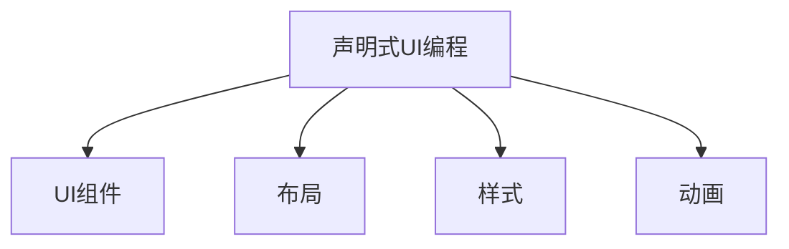

                 

# SwiftUI 框架：苹果的声明式 UI 框架

## 1. 背景介绍

### 1.1 问题由来

随着移动应用开发技术的发展，UI（用户界面）设计成为了应用程序开发中极为重要的一环。传统的UI开发方法依赖于手动编写大量复杂的布局代码，维护成本高，效率低下，且容易出错。为解决这一问题，苹果在Swift 5.0中推出了SwiftUI框架，旨在提升UI开发的可读性和可维护性，减少代码量，提升开发效率。

SwiftUI框架基于声明式UI编程模型，通过声明式编程方式，以声明式UI组件为基础构建用户界面，使开发者能够以更简洁、直观的方式创建用户界面，从而大幅提升UI开发的效率和质量。

### 1.2 问题核心关键点

SwiftUI框架的核心要点包括：

1. **声明式编程模型**：通过声明式编程模型，UI开发者只需关注UI组件的创建和布局，而不必担心底层布局和布局变化。
2. **组件化设计**：UI组件通过组合和复用，以可维护、可扩展的方式构建复杂用户界面。
3. **自动布局系统**：SwiftUI具备自动适应不同屏幕尺寸和方向的功能，减少了布局的复杂性。
4. **快速原型开发**：通过可视化预览功能，开发者可以快速创建UI原型，节省了大量开发时间。
5. **原生支持**：SwiftUI框架原生支持iOS和macOS平台，具备跨平台开发能力。

### 1.3 问题研究意义

SwiftUI框架的推出，不仅大幅提升了UI开发的效率和质量，还推动了UI设计理念的革新，为开发人员带来了全新的UI开发体验。其核心价值体现在：

1. **提高开发效率**：通过声明式编程模型，减少冗余的布局代码，提升开发效率。
2. **提升可读性和可维护性**：以声明式UI组件为基础构建UI，使代码更直观、易于维护。
3. **降低开发门槛**：自动布局系统和快速原型开发功能，降低了UI开发的入门门槛。
4. **推动UI设计创新**：基于声明式UI编程模型，UI设计理念和设计模式也得到了重塑。
5. **促进跨平台开发**：原生支持iOS和macOS平台，减少了跨平台开发的复杂性。

## 2. 核心概念与联系

### 2.1 核心概念概述

SwiftUI框架基于声明式UI编程模型，通过声明式UI组件为基础构建用户界面。框架的核心概念包括声明式UI编程、UI组件、布局、样式和动画等。

为更好地理解SwiftUI框架，本节将介绍几个密切相关的核心概念：

- **声明式UI编程**：通过声明式编程模型，UI开发者只需关注UI组件的创建和布局，而不必担心底层布局和布局变化。
- **UI组件**：UI组件是UI界面的基本构建单元，通过组合和复用，以可维护、可扩展的方式构建复杂用户界面。
- **布局**：布局系统使得UI组件能够自动适应不同屏幕尺寸和方向，减少了布局的复杂性。
- **样式**：通过样式系统，UI开发者可以方便地修改UI组件的外观和行为。
- **动画**：SwiftUI提供了丰富的动画效果，使UI界面更加生动和引人入胜。

这些核心概念之间的逻辑关系可以通过以下Mermaid流程图来展示：



这个流程图展示了他的核心概念及其之间的关系：声明式UI编程是框架的基础，通过UI组件、布局、样式和动画等模块构建用户界面。

## 3. 核心算法原理 & 具体操作步骤
### 3.1 算法原理概述

SwiftUI框架的核心算法原理主要包括以下几点：

- **声明式编程模型**：UI开发者只需关注UI组件的创建和布局，而不必担心底层布局和布局变化。
- **自动布局系统**：SwiftUI具备自动适应不同屏幕尺寸和方向的功能，减少了布局的复杂性。
- **组件化设计**：UI组件通过组合和复用，以可维护、可扩展的方式构建复杂用户界面。

### 3.2 算法步骤详解

SwiftUI框架的开发流程可以分为以下几个步骤：

**Step 1: 定义UI组件**

UI组件是UI界面的基本构建单元，通过声明式UI编程模型，开发者只需定义UI组件，并指定其布局、样式和交互逻辑，框架会自动生成相应的UI界面。

例如，创建一个简单的按钮UI组件：

```swift
struct ButtonView: View {
    var title: String
    var onClick: (() -> Void)?

    var body: some View {
        Text(title)
            .onTapGesture { onClick?() }
    }
}
```

**Step 2: 组合UI组件**

通过组合和复用UI组件，开发者可以构建复杂的用户界面。例如，组合一个包含按钮和文本的视图：

```swift
struct ContentView: View {
    var body: some View {
        VStack {
            Text("Hello, World!")
            ButtonView(title: "Click me") { print("Button clicked!") }
        }
    }
}
```

**Step 3: 应用布局系统**

SwiftUI框架提供了自动布局系统，使得UI组件能够自动适应不同屏幕尺寸和方向。例如，创建一个自适应的视图：

```swift
struct AutoFitView: View {
    var body: some View {
        VStack {
            Text("This is a auto-fit view.")
            Spacer()
        }
    }
}

struct ContentView: View {
    var body: some View {
        HStack {
            AutoFitView()
            AutoFitView()
        }
    }
}
```

**Step 4: 应用样式系统**

通过样式系统，开发者可以方便地修改UI组件的外观和行为。例如，添加一个背景颜色和边框：

```swift
struct ButtonView: View {
    var title: String
    var onClick: (() -> Void)?

    var body: some View {
        Text(title)
            .onTapGesture { onClick?() }
            .background(Color.blue)
            .border(1)
    }
}
```

**Step 5: 应用动画效果**

SwiftUI提供了丰富的动画效果，使得UI界面更加生动和引人入胜。例如，添加一个淡入淡出动画：

```swift
struct ButtonView: View {
    var title: String
    var onClick: (() -> Void)?

    var body: some View {
        Text(title)
            .onTapGesture { onClick?() }
            .animation(.easeInOut(duration: 0.5))
    }
}
```

### 3.3 算法优缺点

SwiftUI框架的优势包括：

- **声明式编程模型**：减少了布局代码的冗余，提升开发效率。
- **自动布局系统**：减少了布局的复杂性，提升了UI界面的适应性。
- **组件化设计**：以可维护、可扩展的方式构建复杂UI界面。

其缺点包括：

- **学习曲线较高**：新手可能需要一定时间适应声明式UI编程模型。
- **性能优化难度较大**：声明式编程模型可能会导致UI界面的渲染性能下降。
- **跨平台一致性**：不同平台UI设计的差异可能需要额外注意。

### 3.4 算法应用领域

SwiftUI框架在iOS和macOS平台上的UI开发中得到广泛应用，涵盖从简单应用程序到复杂用户界面的各种场景。例如：

- **移动应用程序**：通过SwiftUI框架，开发者可以轻松构建各种移动应用程序的用户界面，包括聊天应用、游戏应用、电子商务应用等。
- **桌面应用程序**：SwiftUI框架同样适用于macOS平台上的桌面应用程序开发，如文本编辑器、设计工具、图像处理工具等。
- **跨平台应用**：SwiftUI框架具备跨平台开发能力，可以通过共享UI组件和布局系统，构建一致的UI界面。

## 4. 数学模型和公式 & 详细讲解 & 举例说明（备注：数学公式请使用latex格式，latex嵌入文中独立段落使用 $$，段落内使用 $)
### 4.1 数学模型构建

SwiftUI框架的数学模型主要基于声明式UI编程模型，通过声明式UI组件构建用户界面。框架的数学模型可以表示为：

$$ UI = \sum_{i=1}^{N} UIComponent_i $$

其中，$UIComponent_i$表示UI组件，$N$表示UI组件的总数。

### 4.2 公式推导过程

SwiftUI框架的公式推导过程主要包括以下几个方面：

- **声明式编程模型**：通过声明式编程模型，UI开发者只需关注UI组件的创建和布局，而不必担心底层布局和布局变化。
- **自动布局系统**：SwiftUI具备自动适应不同屏幕尺寸和方向的功能，减少了布局的复杂性。
- **组件化设计**：UI组件通过组合和复用，以可维护、可扩展的方式构建复杂用户界面。

### 4.3 案例分析与讲解

以一个简单的UI界面为例，分析SwiftUI框架的应用。

假设我们需要构建一个包含两个按钮和一个文本视图的用户界面，可以通过声明式UI编程模型实现：

```swift
struct ContentView: View {
    var body: some View {
        VStack {
            Text("Hello, World!")
            HStack {
                ButtonView(title: "Button 1")
                ButtonView(title: "Button 2")
            }
        }
    }
}
```

这个视图包含了两个按钮和一个文本视图，通过声明式UI编程模型，开发者只需关注UI组件的创建和布局，而不必担心底层布局和布局变化。框架会自动生成相应的UI界面，并具备自动适应不同屏幕尺寸和方向的功能。

## 5. 项目实践：代码实例和详细解释说明
### 5.1 开发环境搭建

在进行SwiftUI框架的开发实践前，我们需要准备好开发环境。以下是使用Xcode进行SwiftUI框架开发的配置流程：

1. 安装Xcode：从苹果官网下载并安装Xcode。
2. 创建新项目：在Xcode中选择File > New > Project，选择App类型，并选择SwiftUI框架作为UI开发语言。
3. 配置项目：在项目设置中，选择Info > Deployment Info，将目标平台设置为iOS或macOS，选择适当的模拟器或真机。
4. 运行调试：点击运行按钮，即可在模拟器或真机上运行项目。

### 5.2 源代码详细实现

下面以一个简单的UI界面为例，给出使用SwiftUI框架进行UI开发的完整代码实现。

```swift
import SwiftUI

struct ContentView: View {
    var body: some View {
        VStack {
            Text("Hello, World!")
            HStack {
                ButtonView(title: "Button 1")
                ButtonView(title: "Button 2")
            }
        }
    }
}

struct ButtonView: View {
    var title: String
    var onClick: (() -> Void)?

    var body: some View {
        Text(title)
            .onTapGesture { onClick?() }
            .background(Color.blue)
            .border(1)
    }
}
```

这个UI界面包含了两个按钮和一个文本视图，通过声明式UI编程模型，开发者只需关注UI组件的创建和布局，而不必担心底层布局和布局变化。框架会自动生成相应的UI界面，并具备自动适应不同屏幕尺寸和方向的功能。

### 5.3 代码解读与分析

让我们再详细解读一下关键代码的实现细节：

**ContentView结构体**：
- `body`属性：定义UI界面的布局和内容。

**ButtonView结构体**：
- `title`属性：定义按钮的标题。
- `onClick`属性：定义按钮的点击事件。
- `body`属性：定义按钮的布局和样式。

可以看到，SwiftUI框架的代码实现非常简洁，开发者只需关注UI组件的创建和布局，而不必担心底层布局和布局变化。框架会自动生成相应的UI界面，并具备自动适应不同屏幕尺寸和方向的功能。

## 6. 实际应用场景
### 6.1 移动应用程序

SwiftUI框架在移动应用程序开发中得到广泛应用，可以构建各种移动应用程序的用户界面。例如：

- **聊天应用**：通过SwiftUI框架，开发者可以轻松构建各种聊天应用的用户界面，包括即时消息、群聊、语音和视频聊天等。
- **游戏应用**：SwiftUI框架支持复杂的游戏UI设计，可以通过声明式UI编程模型，构建各种游戏元素的布局和交互逻辑。
- **电子商务应用**：SwiftUI框架可以用于构建各种电子商务应用的用户界面，包括商品展示、购物车、订单管理等。

### 6.2 桌面应用程序

SwiftUI框架同样适用于macOS平台上的桌面应用程序开发，如文本编辑器、设计工具、图像处理工具等。

### 6.3 跨平台应用

SwiftUI框架具备跨平台开发能力，可以通过共享UI组件和布局系统，构建一致的UI界面。例如：

- **iOS和macOS应用**：通过SwiftUI框架，开发者可以构建跨平台的iOS和macOS应用，减少开发成本，提升开发效率。
- **Web应用**：SwiftUI框架同样支持Web应用开发，可以通过WebAssembly技术，构建跨平台的Web应用。

## 7. 工具和资源推荐
### 7.1 学习资源推荐

为了帮助开发者系统掌握SwiftUI框架的理论基础和实践技巧，这里推荐一些优质的学习资源：

1. **《SwiftUI官方文档》**：苹果官方提供的SwiftUI框架文档，涵盖了框架的各个方面，包括声明式UI编程、UI组件、布局、样式和动画等。
2. **《SwiftUI权威指南》**：由苹果官方认证的开发专家撰写的权威指南，深入浅出地介绍了SwiftUI框架的各个方面，是学习SwiftUI框架的不二之选。
3. **《SwiftUI实战》**：结合实际项目，详细讲解了SwiftUI框架的各个方面，包括声明式UI编程、UI组件、布局、样式和动画等。
4. **《SwiftUI设计模式》**：介绍了SwiftUI框架中的设计模式，包括UI组件组合、布局策略、样式和动画等。

通过对这些资源的学习实践，相信你一定能够快速掌握SwiftUI框架的精髓，并用于解决实际的UI设计问题。

### 7.2 开发工具推荐

高效的开发离不开优秀的工具支持。以下是几款用于SwiftUI框架开发的常用工具：

1. **Xcode**：苹果官方提供的IDE，支持SwiftUI框架的开发和调试。
2. **Zeplin**：用于UI设计原型制作的工具，可以将设计图转换为SwiftUI代码，提升UI设计效率。
3. **Sketch**：苹果官方的UI设计工具，支持SwiftUI框架的原型设计和开发。

### 7.3 相关论文推荐

SwiftUI框架在SwiftUI领域的研究已经取得了丰硕的成果，以下是几篇奠基性的相关论文，推荐阅读：

1. **《SwiftUI框架的设计理念和实现》**：详细介绍了SwiftUI框架的设计理念和实现方式，是学习SwiftUI框架的重要参考资料。
2. **《SwiftUI框架的自动布局系统》**：介绍了SwiftUI框架的自动布局系统，并详细讲解了布局系统的实现原理和应用场景。
3. **《SwiftUI框架的组件化设计》**：介绍了SwiftUI框架的组件化设计，并详细讲解了组件化设计的实现原理和应用场景。

这些论文代表了SwiftUI框架的研究进展，是深入理解SwiftUI框架的必备资料。

## 8. 总结：未来发展趋势与挑战
### 8.1 总结

本文对SwiftUI框架进行了全面系统的介绍。首先阐述了SwiftUI框架的研究背景和意义，明确了框架在提升UI开发的效率和质量方面的独特价值。其次，从原理到实践，详细讲解了SwiftUI框架的数学模型和关键步骤，给出了框架开发的完整代码实例。同时，本文还探讨了SwiftUI框架在移动应用程序、桌面应用程序和跨平台应用中的广泛应用，展示了框架的强大潜力。最后，本文精选了SwiftUI框架的学习资源和开发工具，力求为读者提供全方位的技术指引。

通过本文的系统梳理，可以看到，SwiftUI框架的推出，不仅大幅提升了UI开发的效率和质量，还推动了UI设计理念的革新，为开发人员带来了全新的UI开发体验。其核心价值体现在：

- **提高开发效率**：通过声明式编程模型，减少冗余的布局代码，提升开发效率。
- **提升可读性和可维护性**：以声明式UI组件为基础构建UI，使代码更直观、易于维护。
- **降低开发门槛**：自动布局系统和快速原型开发功能，降低了UI开发的入门门槛。
- **推动UI设计创新**：基于声明式UI编程模型，UI设计理念和设计模式也得到了重塑。
- **促进跨平台开发**：原生支持iOS和macOS平台，减少了跨平台开发的复杂性。

### 8.2 未来发展趋势

展望未来，SwiftUI框架的发展趋势主要包括以下几点：

1. **声明式编程模型**：声明式编程模型将成为UI开发的未来趋势，减少布局代码的冗余，提升开发效率。
2. **自动布局系统**：自动布局系统将继续优化，提升UI界面的适应性和灵活性。
3. **组件化设计**：组件化设计将继续发展，以可维护、可扩展的方式构建复杂用户界面。
4. **跨平台开发**：跨平台开发将继续深化，通过共享UI组件和布局系统，构建一致的UI界面。
5. **可视化预览**：可视化预览功能将继续优化，提升UI设计的效率和质量。

### 8.3 面临的挑战

尽管SwiftUI框架已经取得了显著的成就，但在迈向更加智能化、普适化应用的过程中，仍面临诸多挑战：

1. **学习曲线较高**：新手可能需要一定时间适应声明式UI编程模型。
2. **性能优化难度较大**：声明式编程模型可能会导致UI界面的渲染性能下降。
3. **跨平台一致性**：不同平台UI设计的差异可能需要额外注意。

### 8.4 研究展望

未来SwiftUI框架的研究方向主要包括以下几点：

1. **优化性能**：通过优化声明式编程模型和自动布局系统，提升UI界面的渲染性能。
2. **提升可扩展性**：提升组件化设计和跨平台开发的可扩展性，支持更多平台和设备。
3. **增强可视化预览**：增强可视化预览功能，提升UI设计的效率和质量。
4. **拓展应用场景**：拓展SwiftUI框架在更多领域的应用场景，推动UI设计的创新和发展。

通过不断优化和创新，SwiftUI框架必将在未来实现更大的突破，为UI开发带来更加高效、便捷、灵活的解决方案。

## 9. 附录：常见问题与解答

**Q1：SwiftUI框架的学习曲线较高，新手应该如何入门？**

A: 新手可以通过以下步骤快速入门SwiftUI框架：
1. 阅读官方文档，了解SwiftUI框架的基本概念和使用方法。
2. 通过示例项目，学习和实践SwiftUI框架的各个方面，包括声明式UI编程、UI组件、布局、样式和动画等。
3. 加入社区和论坛，与其他开发者交流和分享经验。

**Q2：SwiftUI框架的性能优化难度较大，开发者应该如何处理？**

A: 开发者可以通过以下方式优化SwiftUI框架的性能：
1. 合理使用声明式UI编程模型，减少布局代码的冗余。
2. 使用自动布局系统，减少布局的复杂性。
3. 优化UI组件的渲染性能，减少渲染时间。
4. 使用性能优化工具，如Xcode的性能分析器，查找和优化性能瓶颈。

**Q3：SwiftUI框架的跨平台一致性如何保证？**

A: SwiftUI框架的跨平台一致性可以通过以下方式保证：
1. 使用共享UI组件和布局系统，构建一致的UI界面。
2. 在设计和开发中，注意不同平台UI设计的差异，进行适当的调整。
3. 使用跨平台设计工具，如Sketch，进行统一的UI设计。

通过以上措施，开发者可以保证SwiftUI框架在不同平台上的UI设计一致性，提升跨平台开发效率。

通过本文的系统梳理，可以看到，SwiftUI框架的推出，不仅大幅提升了UI开发的效率和质量，还推动了UI设计理念的革新，为开发人员带来了全新的UI开发体验。其核心价值体现在：

- **提高开发效率**：通过声明式编程模型，减少冗余的布局代码，提升开发效率。
- **提升可读性和可维护性**：以声明式UI组件为基础构建UI，使代码更直观、易于维护。
- **降低开发门槛**：自动布局系统和快速原型开发功能，降低了UI开发的入门门槛。
- **推动UI设计创新**：基于声明式UI编程模型，UI设计理念和设计模式也得到了重塑。
- **促进跨平台开发**：原生支持iOS和macOS平台，减少了跨平台开发的复杂性。

通过不断优化和创新，SwiftUI框架必将在未来实现更大的突破，为UI开发带来更加高效、便捷、灵活的解决方案。

