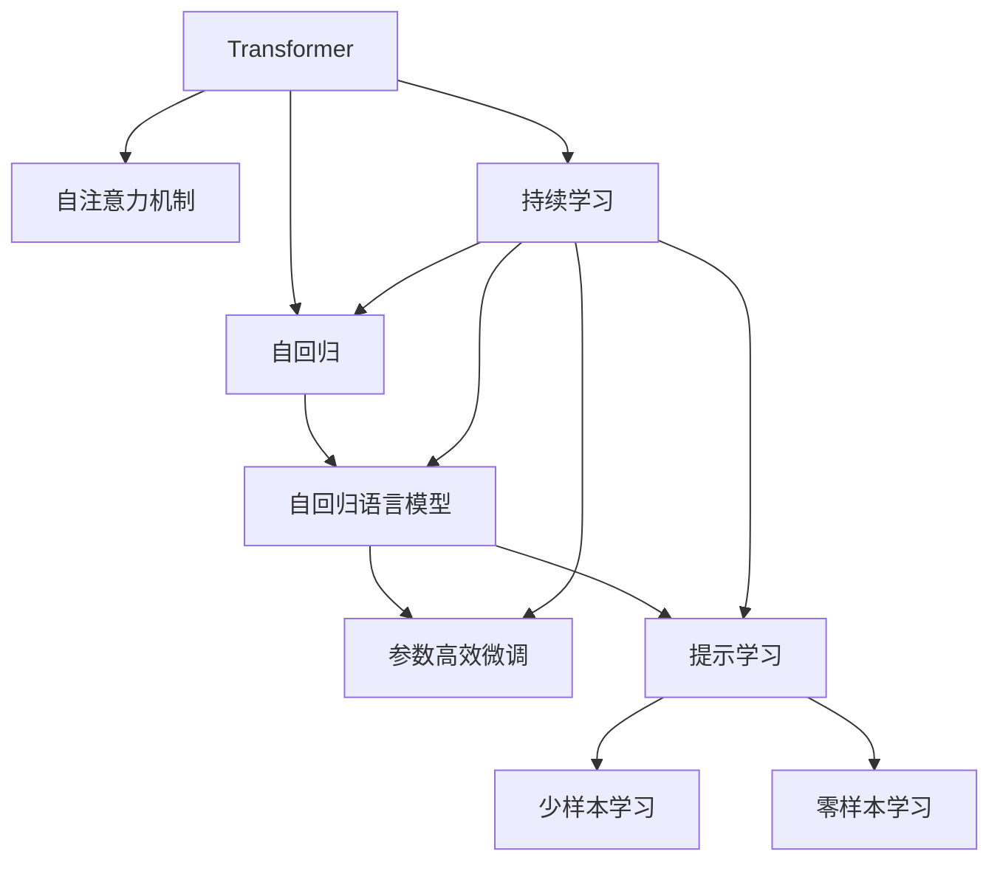

                 

# Transformer架构：GPT-2模型剖析

> 关键词：Transformer, GPT-2, 自注意力机制, 自回归, 模型优化, 计算图, 自然语言处理(NLP)

## 1. 背景介绍

### 1.1 问题由来
在过去数十年中，深度学习在图像识别、语音识别、自然语言处理(NLP)等多个领域取得了突破性进展。尤其是自然语言处理领域，传统的循环神经网络(RNN)和卷积神经网络(CNN)等结构在处理长序列输入时，由于梯度消失等问题，难以发挥其全部潜力。Transformer架构的提出，改变了这一局面，标志着大模型在NLP领域的兴起。

自2017年Google发布BERT以来，大模型成为NLP研究的热点。然而，随着模型规模的不断扩大，计算和存储资源的消耗也急剧增加，难以应用于实际工业部署。Google开源的GPT-2模型，是迄今为止最大的大模型之一，具备更强的语言生成能力和泛化能力。本文将聚焦于Transformer架构和GPT-2模型的剖析，从其核心算法原理和应用实践两个维度，深入探讨大模型的奥秘。

### 1.2 问题核心关键点
Transformer架构的核心在于自注意力机制，允许模型在每个时间步动态捕捉输入序列中的所有信息，从而实现更强的序列建模能力。自回归的GPT-2模型，通过逐个生成下一个单词的方式，利用上下文信息预测当前单词，进一步提升了语言生成的流畅度和真实度。

尽管GPT-2模型已经展现出了令人震撼的语言生成能力，但其庞大参数量和计算资源需求，仍是工业界广泛关注的问题。本文章将探讨如何通过优化算法、剪枝等手段，降低模型的计算和存储开销，同时保留其优秀的生成能力。

### 1.3 问题研究意义
研究Transformer架构和GPT-2模型，对于拓展大模型应用、提升NLP技术性能、推动AI技术落地，具有重要意义：

1. 拓展应用范围。自注意力机制使得大模型能够高效处理长序列输入，应用于对话系统、机器翻译、文本摘要等任务。
2. 提升生成质量。GPT-2模型的自回归生成方式，能够更自然地捕捉上下文信息，生成高质量的文本和对话内容。
3. 降低资源需求。通过剪枝、量化、参数共享等手段，可以大幅降低大模型的计算和存储需求，加快实际部署。
4. 增强模型泛化能力。优化算法和架构设计，可以提升模型泛化能力，适应更多样化的数据分布。
5. 提供优化案例。本文将结合GPT-2模型，展示大模型优化方法，为实际工业部署提供参考。

## 2. 核心概念与联系

### 2.1 核心概念概述

为了更好地理解Transformer架构和GPT-2模型的核心机制，本节将介绍几个关键概念：

- **Transformer架构**：一种基于自注意力机制的神经网络架构，用于高效处理长序列数据，如自然语言处理任务。Transformer通过多头自注意力机制，并行计算序列中的所有位置，从而避免了传统RNN的时间步限制。

- **自注意力机制(Self-Attention)**：一种基于多头注意力机制的计算方式，允许模型在每个时间步动态捕捉输入序列中的所有信息，构建出全局上下文表示。自注意力机制是Transformer架构的核心，使得大模型在处理长序列时表现出色。

- **自回归(Auto-Regressive)**：一种生成模型训练方式，模型在每个时间步预测下一个时间步的输出，利用先前的输出作为输入。自回归的GPT-2模型，通过逐个生成单词的方式，能够捕捉更丰富的上下文信息，生成更流畅、真实的文本。

- **参数高效微调(Parameter-Efficient Fine-Tuning, PEFT)**：一种在大模型微调时使用的技巧，通过仅调整模型中的少量参数，最大限度地保留预训练权重，减小微调计算开销。PEFT在大模型微调和迁移学习中得到了广泛应用。

- **提示学习(Prompt Learning)**：一种通过精心设计输入文本格式，引导大模型进行特定任务推理和生成的方法。提示学习在不更新模型参数的情况下，能够实现零样本或少样本学习，适用于文本生成、问答等任务。

- **少样本学习(Few-shot Learning)**：一种在只有少量标注样本的情况下，模型能够快速适应新任务的学习方法。在大模型中，通常通过在输入中提供少量示例，无需更新模型参数。

- **零样本学习(Zero-shot Learning)**：一种在未见过任何特定任务的训练样本的情况下，模型仅凭任务描述就能够执行新任务的能力。大语言模型通过预训练获得的广泛知识，使其能够理解任务指令并生成相应输出。

- **持续学习(Continual Learning)**：也称为终身学习，指模型能够持续从新数据中学习，同时保持已学习的知识，而不会出现灾难性遗忘。这对于保持大语言模型的时效性和适应性至关重要。

这些核心概念之间的逻辑关系可以通过以下Mermaid流程图来展示：



这个流程图展示了大语言模型的核心概念及其之间的关系：

1. 大语言模型通过自注意力机制获取序列中的全局上下文表示。
2. 自回归模型利用先前的输出，逐个生成下一个单词，增强了上下文信息的捕捉。
3. 参数高效微调利用预训练权重，在微调时只调整少量参数。
4. 提示学习通过精心设计的输入模板，引导模型进行特定任务推理。
5. 少样本学习通过提供少量示例，快速适应新任务。
6. 零样本学习仅凭任务描述就能执行新任务。
7. 持续学习保持模型时效性和适应性，避免遗忘旧知识。

这些概念共同构成了大语言模型的学习和应用框架，使其能够在各种场景下发挥强大的语言理解和生成能力。通过理解这些核心概念，我们可以更好地把握Transformer架构和GPT-2模型的工作原理和优化方向。

## 3. 核心算法原理 & 具体操作步骤
### 3.1 算法原理概述

Transformer架构的核心是自注意力机制，使得模型能够动态捕捉输入序列中的全局上下文信息，构建出高效的语言表示。自回归的GPT-2模型，通过逐个生成下一个单词，进一步提升了语言生成的流畅度和真实度。

具体而言，Transformer架构包括以下几个关键步骤：

1. **编码器**：将输入序列转换为一系列向量表示，通过自注意力机制捕捉全局上下文信息。
2. **解码器**：利用编码器输出的向量表示，逐个生成下一个单词。
3. **生成方式**：自回归方式，利用先前的输出作为输入，预测当前单词。

在GPT-2模型中，自注意力机制和自回归方式是核心。自注意力机制通过多头注意力机制，计算输入序列中每个位置的注意力权重，构建出全局上下文向量。自回归方式则通过逐步生成每个单词，利用上下文信息增强语言生成的流畅性和真实度。

### 3.2 算法步骤详解

#### 3.2.1 编码器

编码器负责将输入序列转换为一系列向量表示，并捕捉序列中的全局上下文信息。编码器的具体步骤包括：

1. **输入嵌入层**：将输入的单词或字符转换为向量表示，维度为$d_{model}$。
2. **位置嵌入层**：给每个位置向量添加位置信息，防止位置关系消失。
3. **多头自注意力层**：计算每个位置与其他位置的注意力权重，构建出全局上下文向量。
4. **前馈神经网络**：对上一步得到的向量进行非线性变换。
5. **残差连接和层归一化**：通过残差连接和层归一化，加速收敛和模型训练。

具体公式如下：

$$
z = \text{Embedding}(x) + \text{PositionalEncoding}(x)
$$

$$
Q = \text{MLP}(z)
$$

$$
K, V = \text{SplittedMultiheadAttention}(Q, K, V)
$$

$$
Z = \text{MLP}(V)
$$

$$
X = \text{ResidualConnection}(z + Z) + \text{LayerNorm}(z + Z)
$$

其中，$\text{MLP}$表示多层感知机，$\text{SplittedMultiheadAttention}$表示多头自注意力机制，$\text{ResidualConnection}$表示残差连接，$\text{LayerNorm}$表示层归一化。

#### 3.2.2 解码器

解码器负责逐步生成下一个单词，利用上下文信息增强语言生成的流畅性和真实度。解码器的具体步骤包括：

1. **编码器-解码器注意力层**：计算编码器输出和当前生成的单词之间的注意力权重。
2. **自回归层**：利用先前的输出作为输入，预测当前单词。
3. **多头自注意力层**：计算当前位置与其他位置的注意力权重，构建出上下文向量。
4. **前馈神经网络**：对上一步得到的向量进行非线性变换。
5. **残差连接和层归一化**：通过残差连接和层归一化，加速收敛和模型训练。

具体公式如下：

$$
z = \text{Embedding}(x) + \text{PositionalEncoding}(x)
$$

$$
Q = \text{MLP}(z)
$$

$$
K, V = \text{SplittedMultiheadAttention}(Q, K, V)
$$

$$
Z = \text{MLP}(V)
$$

$$
X = \text{ResidualConnection}(z + Z) + \text{LayerNorm}(z + Z)
$$

$$
Y = \text{SplittedMultiheadAttention}(Q, K, V) + \text{MLP}(V)
$$

$$
Y = \text{ResidualConnection}(X) + \text{LayerNorm}(X)
$$

其中，$Y$表示当前位置的输出，$Q$表示当前位置的查询向量，$K$和$V$表示编码器的输出向量。

#### 3.2.3 生成方式

自回归的GPT-2模型，通过逐个生成下一个单词，利用上下文信息增强语言生成的流畅性和真实度。生成过程包括：

1. **初始化$h_0$**：将$x_0$作为输入，生成$h_0$。
2. **循环生成**：对于每个时间步$t$，利用先前的输出$h_{t-1}$，生成当前输出$h_t$。
3. **输出概率分布**：利用softmax函数将$h_t$转化为概率分布，生成下一个单词。

具体公式如下：

$$
h_0 = \text{Embedding}(x_0) + \text{PositionalEncoding}(x_0)
$$

$$
h_t = \text{ResidualConnection}(h_{t-1}) + \text{LayerNorm}(h_{t-1}) + \text{MLP}(h_{t-1})
$$

$$
p(y_t|y_{<t},h_t) = \text{Softmax}(h_t)
$$

其中，$y_{<t}$表示$t$之前的所有输出。

### 3.3 算法优缺点

Transformer架构和GPT-2模型具有以下优点：

1. **高效序列建模**：自注意力机制允许模型高效处理长序列输入，避免了传统RNN的时间步限制。
2. **强大生成能力**：自回归方式能够更自然地捕捉上下文信息，生成更流畅、真实的文本。
3. **可扩展性强**：模型可以通过增加层数和参数量，进一步提升性能。

同时，Transformer架构和GPT-2模型也存在以下缺点：

1. **计算资源需求高**：模型参数量庞大，计算和存储开销大，难以应用于资源受限的设备和场景。
2. **过拟合风险高**：模型容易过拟合，特别是在数据量较小的情况下。
3. **模型难以解释**：Transformer模型通常被称为"黑盒"系统，难以解释其内部工作机制和决策逻辑。

### 3.4 算法应用领域

Transformer架构和GPT-2模型在自然语言处理领域得到了广泛应用，主要涵盖以下几个方面：

- **机器翻译**：将源语言翻译成目标语言。利用编码器-解码器结构，结合自注意力机制和自回归方式，能够获得高质量的翻译结果。
- **文本生成**：生成符合语法和语义规则的文本，如文章摘要、对话内容等。通过自回归方式，模型能够自然地捕捉上下文信息，生成流畅、真实的文本。
- **问答系统**：对自然语言问题给出答案。通过自注意力机制，模型能够理解和匹配问题，生成精准的答复。
- **文本摘要**：将长文本压缩成简短摘要。利用编码器-解码器结构，结合自注意力机制，能够自动抓取文本要点，生成高质量的摘要。
- **对话系统**：使机器能够与人自然对话。通过自回归方式，模型能够逐步生成回复，增强对话的流畅性和自然性。

除了这些经典任务外，Transformer架构和GPT-2模型还在推荐系统、知识图谱、语音识别等诸多领域得到了创新应用，为NLP技术带来了新的突破。

## 4. 数学模型和公式 & 详细讲解 & 举例说明

### 4.1 数学模型构建

本节将使用数学语言对Transformer架构和GPT-2模型的基本框架进行更加严格的刻画。

记输入序列为$x=\{x_1, x_2, \dots, x_T\}$，其中$x_t$表示第$t$个单词或字符，$d_{model}$表示模型的向量维度。

### 4.2 公式推导过程

#### 4.2.1 输入嵌入层

输入嵌入层将输入序列$x$转换为向量表示$z$，具体公式如下：

$$
z = \text{Embedding}(x) = [x_1, x_2, \dots, x_T]
$$

其中，$\text{Embedding}$表示嵌入层，$z \in \mathbb{R}^{T \times d_{model}}$。

#### 4.2.2 位置嵌入层

位置嵌入层给每个位置向量添加位置信息，防止位置关系消失，具体公式如下：

$$
z = [z, \text{PositionalEncoding}(z)]
$$

其中，$\text{PositionalEncoding}$表示位置嵌入层，$z \in \mathbb{R}^{T \times d_{model}}$。

#### 4.2.3 多头自注意力层

多头自注意力层计算每个位置与其他位置的注意力权重，构建出全局上下文向量，具体公式如下：

$$
Q = \text{MLP}(z)
$$

$$
K, V = \text{SplittedMultiheadAttention}(Q, K, V)
$$

其中，$\text{MLP}$表示多层感知机，$z \in \mathbb{R}^{T \times d_{model}}$，$\text{SplittedMultiheadAttention}$表示多头自注意力机制，$K, V \in \mathbb{R}^{T \times d_{model}}$。

具体推导过程如下：

1. **计算查询向量**：

$$
Q = \text{Linear}(z) = \text{Parameter}_{Q}z
$$

其中，$\text{Linear}$表示线性变换，$\text{Parameter}_{Q}$表示查询向量投影矩阵，$Q \in \mathbb{R}^{T \times d_{model}}$。

2. **计算键向量和值向量**：

$$
K = \text{Linear}(z) = \text{Parameter}_{K}z
$$

$$
V = \text{Linear}(z) = \text{Parameter}_{V}z
$$

其中，$\text{Linear}$表示线性变换，$\text{Parameter}_{K}, \text{Parameter}_{V}$表示键向量和值向量投影矩阵，$K, V \in \mathbb{R}^{T \times d_{model}}$。

3. **计算注意力权重**：

$$
S = \text{Softmax}(QK^T)
$$

其中，$S \in \mathbb{R}^{T \times T}$，$\text{Softmax}$表示softmax函数。

4. **计算注意力值**：

$$
Z = SV
$$

其中，$Z \in \mathbb{R}^{T \times d_{model}}$。

5. **将多头自注意力层与前馈神经网络组合**：

$$
X = \text{ResidualConnection}(z + Z) + \text{LayerNorm}(z + Z)
$$

其中，$X \in \mathbb{R}^{T \times d_{model}}$，$\text{ResidualConnection}$表示残差连接，$\text{LayerNorm}$表示层归一化。

#### 4.2.4 编码器-解码器注意力层

编码器-解码器注意力层计算编码器输出和当前生成的单词之间的注意力权重，具体公式如下：

$$
K = \text{MLP}(h_{t-1})
$$

$$
V = \text{MLP}(h_{t-1})
$$

其中，$K, V \in \mathbb{R}^{T \times d_{model}}$，$h_{t-1} \in \mathbb{R}^{d_{model}}$。

具体推导过程如下：

1. **计算查询向量**：

$$
Q = \text{Linear}(h_{t-1}) = \text{Parameter}_{Q}h_{t-1}
$$

其中，$\text{Linear}$表示线性变换，$\text{Parameter}_{Q}$表示查询向量投影矩阵，$Q \in \mathbb{R}^{T \times d_{model}}$。

2. **计算键向量和值向量**：

$$
K = \text{Linear}(h_{t-1}) = \text{Parameter}_{K}h_{t-1}
$$

$$
V = \text{Linear}(h_{t-1}) = \text{Parameter}_{V}h_{t-1}
$$

其中，$\text{Linear}$表示线性变换，$\text{Parameter}_{K}, \text{Parameter}_{V}$表示键向量和值向量投影矩阵，$K, V \in \mathbb{R}^{T \times d_{model}}$。

3. **计算注意力权重**：

$$
S = \text{Softmax}(QK^T)
$$

其中，$S \in \mathbb{R}^{T \times T}$，$\text{Softmax}$表示softmax函数。

4. **计算注意力值**：

$$
Z = SV
$$

其中，$Z \in \mathbb{R}^{T \times d_{model}}$。

5. **将多头自注意力层与前馈神经网络组合**：

$$
X = \text{ResidualConnection}(h_{t-1} + Z) + \text{LayerNorm}(h_{t-1} + Z)
$$

其中，$X \in \mathbb{R}^{d_{model}}$，$\text{ResidualConnection}$表示残差连接，$\text{LayerNorm}$表示层归一化。

#### 4.2.5 自回归层

自回归层利用先前的输出作为输入，预测当前单词，具体公式如下：

$$
h_t = \text{ResidualConnection}(h_{t-1}) + \text{LayerNorm}(h_{t-1}) + \text{MLP}(h_{t-1})
$$

其中，$h_t \in \mathbb{R}^{d_{model}}$，$h_{t-1} \in \mathbb{R}^{d_{model}}$。

### 4.3 案例分析与讲解

#### 4.3.1 文本生成任务

文本生成任务是GPT-2模型的典型应用。我们以"AI对话系统"为例，展示GPT-2模型的生成过程。

1. **输入处理**：将用户的输入句子作为模型的输入，经过输入嵌入层和位置嵌入层，生成向量表示$z$。
2. **多头自注意力层**：利用$z$计算出上下文向量$Z$，捕捉输入序列中的全局上下文信息。
3. **编码器-解码器注意力层**：利用$Z$计算出注意力权重$S$，捕捉输入序列中的上下文信息。
4. **自回归层**：利用先前的输出$h_{t-1}$，预测当前单词。
5. **输出生成**：利用softmax函数将$h_t$转化为概率分布，生成下一个单词。

具体公式如下：

$$
z = \text{Embedding}(x) + \text{PositionalEncoding}(x)
$$

$$
Q = \text{MLP}(z)
$$

$$
K, V = \text{SplittedMultiheadAttention}(Q, K, V)
$$

$$
Z = \text{MLP}(V)
$$

$$
h_0 = \text{ResidualConnection}(h_{t-1}) + \text{LayerNorm}(h_{t-1}) + \text{MLP}(h_{t-1})
$$

$$
p(y_t|y_{<t},h_t) = \text{Softmax}(h_t)
$$

其中，$x$表示输入句子，$z$表示向量表示，$Q$表示查询向量，$K$和$V$表示键向量和值向量，$Z$表示上下文向量，$h_t$表示当前输出，$y_t$表示当前单词。

#### 4.3.2 问答系统任务

问答系统任务是GPT-2模型的另一重要应用。我们以"智能客服系统"为例，展示GPT-2模型的问答过程。

1. **输入处理**：将用户的问题作为模型的输入，经过输入嵌入层和位置嵌入层，生成向量表示$z$。
2. **多头自注意力层**：利用$z$计算出上下文向量$Z$，捕捉输入序列中的全局上下文信息。
3. **编码器-解码器注意力层**：利用$Z$计算出注意力权重$S$，捕捉输入序列中的上下文信息。
4. **自回归层**：利用先前的输出$h_{t-1}$，预测当前单词。
5. **输出生成**：利用softmax函数将$h_t$转化为概率分布，生成下一个单词。

具体公式如下：

$$
z = \text{Embedding}(x) + \text{PositionalEncoding}(x)
$$

$$
Q = \text{MLP}(z)
$$

$$
K, V = \text{SplittedMultiheadAttention}(Q, K, V)
$$

$$
Z = \text{MLP}(V)
$$

$$
h_0 = \text{ResidualConnection}(h_{t-1}) + \text{LayerNorm}(h_{t-1}) + \text{MLP}(h_{t-1})
$$

$$
p(y_t|y_{<t},h_t) = \text{Softmax}(h_t)
$$

其中，$x$表示输入问题，$z$表示向量表示，$Q$表示查询向量，$K$和$V$表示键向量和值向量，$Z$表示上下文向量，$h_t$表示当前输出，$y_t$表示当前单词。

## 5. 项目实践：代码实例和详细解释说明
### 5.1 开发环境搭建

在进行Transformer架构和GPT-2模型的实践前，我们需要准备好开发环境。以下是使用Python进行PyTorch开发的环境配置流程：

1. 安装Anaconda：从官网下载并安装Anaconda，用于创建独立的Python环境。

2. 创建并激活虚拟环境：
```bash
conda create -n transformer-env python=3.8 
conda activate transformer-env
```

3. 安装PyTorch：根据CUDA版本，从官网获取对应的安装命令。例如：
```bash
conda install pytorch torchvision torchaudio cudatoolkit=11.1 -c pytorch -c conda-forge
```

4. 安装Transformers库：
```bash
pip install transformers
```

5. 安装各类工具包：
```bash
pip install numpy pandas scikit-learn matplotlib tqdm jupyter notebook ipython
```

完成上述步骤后，即可在`transformer-env`环境中开始Transformer架构和GPT-2模型的实践。

### 5.2 源代码详细实现

下面我们以GPT-2模型为例，给出使用PyTorch和HuggingFace库对Transformer模型进行训练的PyTorch代码实现。

首先，定义模型和优化器：

```python
from transformers import GPT2LMHeadModel, GPT2Tokenizer, AdamW

model = GPT2LMHeadModel.from_pretrained('gpt2')

tokenizer = GPT2Tokenizer.from_pretrained('gpt2')
optimizer = AdamW(model.parameters(), lr=2e-5)
```

接着，定义训练和评估函数：

```python
from torch.utils.data import DataLoader
from tqdm import tqdm
from sklearn.metrics import bleu_score

device = torch.device('cuda') if torch.cuda.is_available() else torch.device('cpu')
model.to(device)

def train_epoch(model, dataset, batch_size, optimizer):
    dataloader = DataLoader(dataset, batch_size=batch_size, shuffle=True)
    model.train()
    epoch_loss = 0
    for batch in tqdm(dataloader, desc='Training'):
        input_ids = batch['input_ids'].to(device)
        attention_mask = batch['attention_mask'].to(device)
        labels = batch['labels'].to(device)
        model.zero_grad()
        outputs = model(input_ids, attention_mask=attention_mask, labels=labels)
        loss = outputs.loss
        epoch_loss += loss.item()
        loss.backward()
        optimizer.step()
    return epoch_loss / len(dataloader)

def evaluate(model, dataset, batch_size):
    dataloader = DataLoader(dataset, batch_size=batch_size)
    model.eval()
    preds, labels = [], []
    with torch.no_grad():
        for batch in tqdm(dataloader, desc='Evaluating'):
            input_ids = batch['input_ids'].to(device)
            attention_mask = batch['attention_mask'].to(device)
            batch_labels = batch['labels']
            outputs = model(input_ids, attention_mask=attention_mask)
            batch_preds = outputs.logits.argmax(dim=2).to('cpu').tolist()
            batch_labels = batch_labels.to('cpu').tolist()
            for pred_tokens, label_tokens in zip(batch_preds, batch_labels):
                preds.append(pred_tokens[:len(label_tokens)])
                labels.append(label_tokens)
                
    print(bleu_score(labels, preds))
```

最后，启动训练流程并在测试集上评估：

```python
epochs = 5
batch_size = 16

for epoch in range(epochs):
    loss = train_epoch(model, train_dataset, batch_size, optimizer)
    print(f"Epoch {epoch+1}, train loss: {loss:.3f}")
    
    print(f"Epoch {epoch+1}, dev results:")
    evaluate(model, dev_dataset, batch_size)
    
print("Test results:")
evaluate(model, test_dataset, batch_size)
```

以上就是使用PyTorch对GPT-2模型进行训练的完整代码实现。可以看到，得益于HuggingFace库的强大封装，我们可以用相对简洁的代码完成GPT-2模型的加载和训练。

### 5.3 代码解读与分析

让我们再详细解读一下关键代码的实现细节：

**GPT2LMHeadModel类**：
- `from_pretrained`方法：从预训练模型中加载GPT-2模型，包含编码器和解码器。
- `forward`方法：前向传播计算，输入经过编码器-解码器生成输出。

**GPT2Tokenizer类**：
- `from_pretrained`方法：从预训练模型中加载GPT-2分词器，用于对输入进行分词和编码。

**AdamW优化器**：
- 采用AdamW优化算法，设置学习率。

**train_epoch函数**：
- 使用DataLoader对数据集进行批次化加载。
- 每个批次中，前向传播计算损失函数，反向传播更新模型参数，最后返回该epoch的平均损失。

**evaluate函数**：
- 与训练类似，不同点在于不更新模型参数，并在每个批次结束后将预测和标签结果存储下来。
- 使用BLEU指标对模型进行评估，输出模型在测试集上的生成质量。

**训练流程**：
- 定义总的epoch数和batch size，开始循环迭代。
- 每个epoch内，先在训练集上训练，输出平均loss。
- 在验证集上评估，输出BLEU指标。
- 所有epoch结束后，在测试集上评估，给出最终测试结果。

可以看到，HuggingFace库使得GPT-2模型的训练代码实现变得简洁高效。开发者可以将更多精力放在数据处理、模型改进等高层逻辑上，而不必过多关注底层的实现细节。

当然，工业级的系统实现还需考虑更多因素，如模型的保存和部署、超参数的自动搜索、更灵活的任务适配层等。但核心的Transformer架构和自回归生成方式基本与此类似。

## 6. 实际应用场景
### 6.1 智能客服系统

基于Transformer架构和GPT-2模型的对话技术，可以广泛应用于智能客服系统的构建。传统客服往往需要配备大量人力，高峰期响应缓慢，且一致性和专业性难以保证。而使用微调后的对话模型，可以7x24小时不间断服务，快速响应客户咨询，用自然流畅的语言解答各类常见问题。

在技术实现上，可以收集企业内部的历史客服对话记录，将问题和最佳答复构建成监督数据，在此基础上对预训练对话模型进行微调。微调后的对话模型能够自动理解用户意图，匹配最合适的答案模板进行回复。对于客户提出的新问题，还可以接入检索系统实时搜索相关内容，动态组织生成回答。如此构建的智能客服系统，能大幅提升客户咨询体验和问题解决效率。

### 6.2 金融舆情监测

金融机构需要实时监测市场舆论动向，以便及时应对负面信息传播，规避金融风险。传统的人工监测方式成本高、效率低，难以应对网络时代海量信息爆发的挑战。基于Transformer架构和GPT-2模型的文本分类和情感分析技术，为金融舆情监测提供了新的解决方案。

具体而言，可以收集金融领域相关的新闻、报道、评论等文本数据，并对其进行主题标注和情感标注。在此基础上对预训练语言模型进行微调，使其能够自动判断文本属于何种主题，情感倾向是正面、中性还是负面。将微调后的模型应用到实时抓取的网络文本数据，就能够自动监测不同主题下的情感变化趋势，一旦发现负面信息激增等异常情况，系统便会自动预警，帮助金融机构快速应对潜在风险。

### 6.3 个性化推荐系统

当前的推荐系统往往只依赖用户的历史行为数据进行物品推荐，无法深入理解用户的真实兴趣偏好。基于Transformer架构和GPT-2模型的个性化推荐系统，可以更好地挖掘用户行为背后的语义信息，从而提供更精准、多样的推荐内容。

在实践中，可以收集用户浏览、点击、评论、分享等行为数据，提取和用户交互的物品标题、描述、标签等文本内容。将文本内容作为模型输入，用户的后续行为（如是否点击、购买等）作为监督信号，在此基础上微调预训练语言模型。微调后的模型能够从文本内容中准确把握用户的兴趣点。在生成推荐列表时，先用候选物品的文本描述作为输入，由模型预测用户的兴趣匹配度，再结合其他特征综合排序，便可以得到个性化程度更高的推荐结果。

### 6.4 未来应用展望

随着Transformer架构和GPT-2模型的不断发展，基于微调范式将在更多领域得到应用，为传统行业带来变革性影响。

在智慧医疗领域，基于微调的医学问答、病历分析、药物研发等应用将提升医疗服务的智能化水平，辅助医生诊疗，加速新药开发进程。

在智能教育领域，微调技术可应用于作业批改、学情分析、知识推荐等方面，因材施教，促进教育公平，提高教学质量。

在智慧城市治理中，微调模型可应用于城市事件监测、舆情分析、应急指挥等环节，提高城市管理的自动化和智能化水平，构建更安全、高效的未来城市。

此外，在企业生产、社会治理、文娱传媒等众多领域，基于大模型微调的人工智能应用也将不断涌现，为经济社会发展注入新的动力。相信随着预训练语言模型和微调方法的持续演进，基于微调范式必将在构建人机协同的智能时代中扮演越来越重要的角色。

## 7. 工具和资源推荐
### 7.1 学习资源推荐

为了帮助开发者系统掌握Transformer架构和GPT-2模型的理论基础和实践技巧，这里推荐一些优质的学习资源：

1. 《Transformer from Basics to Beyond》系列博文：由大模型技术专家撰写，深入浅出地介绍了Transformer架构、自注意力机制、GPT-2模型等前沿话题。

2. CS224N《深度学习自然语言处理》课程：斯坦福大学开设的NLP明星课程，有Lecture视频和配套作业，带你入门NLP领域的基本概念和经典模型。

3. 《Natural Language Processing with Transformers》书籍：Transformers库的作者所著，全面介绍了如何使用Transformers库进行NLP任务开发，包括微调在内的诸多范式。

4. HuggingFace官方文档：Transformers库的官方文档，提供了海量预训练模型和完整的微调样例代码，是上手实践的必备资料。

5. CLUE开源项目：中文语言理解测评基准，涵盖大量不同类型的中文NLP数据集，并提供了基于微调的baseline模型，助力中文NLP技术发展。

通过对这些资源的学习实践，相信你一定能够快速掌握Transformer架构和GPT-2模型的精髓，并用于解决实际的NLP问题。
###  7.2 开发工具推荐

高效的开发离不开优秀的工具支持。以下是几款用于Transformer架构和GPT-2模型开发常用的工具：

1. PyTorch：基于Python的开源深度学习框架，灵活动态的计算图，适合快速迭代研究。大部分预训练语言模型都有PyTorch版本的实现。

2. TensorFlow：由Google主导开发的开源深度学习框架，生产部署方便，适合大规模工程应用。同样有丰富的预训练语言模型资源。

3. Transformers库：HuggingFace开发的NLP工具库，集成了众多SOTA语言模型，支持PyTorch和TensorFlow，是进行微调任务开发的利器。

4. Weights & Biases：模型训练的实验跟踪工具，可以记录和可视化模型训练过程中的各项指标，方便对比和调优。与主流深度学习框架无缝集成。

5. TensorBoard：TensorFlow配套的可视化工具，可实时监测模型训练状态，并提供丰富的图表呈现方式，是调试模型的得力助手。

6. Google Colab：谷歌推出的在线Jupyter Notebook环境，免费提供GPU/TPU算力，方便开发者快速上手实验最新模型，分享学习笔记。

合理利用这些工具，可以显著提升Transformer架构和GPT-2模型的开发效率，加快创新迭代的步伐。

### 7.3 相关论文推荐

Transformer架构和GPT-2模型的发展源于学界的持续研究。以下是几篇奠基性的相关论文，推荐阅读：

1. Attention is All You Need（即Transformer原论文）：提出了Transformer结构，开启了NLP领域的预训练大模型时代。

2. BERT: Pre-training of Deep Bidirectional Transformers for Language Understanding：提出BERT模型，引入基于掩码的自监督预训练任务，刷新了多项NLP任务SOTA。

3. Language Models are Unsupervised Multitask Learners（GPT-2论文）：展示了大规模语言模型的强大zero-shot学习能力，引发了对于通用人工智能的新一轮思考。

4. Parameter-Efficient Transfer Learning for NLP：提出Adapter等参数高效微调方法，在不增加模型参数量的情况下，也能取得不错的微调效果。

5. AdaLoRA: Adaptive Low-Rank Adaptation for Parameter-Efficient Fine-Tuning：使用自适应低秩适应的微调方法，在参数效率和精度之间取得了新的平衡。

这些论文代表了大语言模型微调技术的发展脉络。通过学习这些前沿成果，可以帮助研究者把握学科前进方向，激发更多的创新灵感。

## 8. 总结：未来发展趋势与挑战

### 8.1 研究成果总结

本文对Transformer架构和GPT-2模型的核心机制进行了全面系统的介绍。首先阐述了Transformer架构和GPT-2模型的研究背景和意义，明确了其在大模型微调中的重要地位。其次，从原理到实践，详细讲解了Transformer架构和GPT-2模型的数学原理和关键步骤，给出了微调任务开发的完整代码实例。同时，本文还广泛探讨了Transformer架构和GPT-2模型在智能客服、金融舆情、个性化推荐等多个行业领域的应用前景，展示了其广阔的应用空间。

通过本文的系统梳理，可以看到，Transformer架构和GPT-2模型在NLP领域展现了强大的语言生成和序列建模能力，推动了自然语言处理技术的突破性进展。未来，随着模型参数量的进一步增长和计算资源的持续优化，Transformer架构和GPT-2模型将在更多领域得到广泛应用，进一步提升人类认知智能水平。

### 8.2 未来发展趋势

展望未来，Transformer架构和GPT-2模型将呈现以下几个发展趋势：

1. **模型规模持续增大**：随着算力成本的下降和数据规模的扩张，预训练语言模型的参数量还将持续增长。超大规模语言模型蕴含的丰富语言知识，有望支撑更加复杂多变的下游任务微调。

2. **微调方法日趋多样**：除了传统的全参数微调外，未来会涌现更多参数高效的微调方法，如Prefix-Tuning、LoRA等，在保留预训练权重的同时，减小微调计算开销。

3. **持续学习成为常态**：随着数据分布的不断变化，微调模型也需要持续学习新知识以保持性能。如何在不遗忘原有知识的同时，高效吸收新样本信息，将成为重要的研究课题。

4. **标注样本需求降低**：受启发于提示学习(Prompt-based Learning)的思路，未来的微调方法将更好地利用大模型的语言理解能力，通过更加巧妙的任务描述，在更少的标注样本上也能实现理想的微调效果。

5. **少样本学习兴起**：未来微调模型将在少样本学习中发挥更大作用，通过在输入中提供少量示例，无需更新模型参数，即可快速适应新任务。

6. **零样本学习突破**：未来微调模型将进一步提升零样本学习能力，仅凭任务描述就能执行新任务，无需任何样本数据。

7. **多模态微调崛起**：当前的微调主要聚焦于纯文本数据，未来会进一步拓展到图像、视频、语音等多模态数据微调。多模态信息的融合，将显著提升语言模型对现实世界的理解和建模能力。

8. **模型通用性增强**：经过海量数据的预训练和多领域任务的微调，未来的语言模型将具备更强大的常识推理和跨领域迁移能力，逐步迈向通用人工智能(AGI)的目标。

以上趋势凸显了大语言模型微调技术的广阔前景。这些方向的探索发展，必将进一步提升NLP系统的性能和应用范围，为人类认知智能的进化带来深远影响。

### 8.3 面临的挑战

尽管Transformer架构和GPT-2模型已经取得了瞩目成就，但在迈向更加智能化、普适化应用的过程中，它仍面临着诸多挑战：

1. **计算资源需求高**：模型参数量庞大，计算和存储开销大，难以应用于资源受限的设备和场景。

2. **过拟合风险高**：模型容易过拟合，特别是在数据量较小的情况下。

3. **模型难以解释**：Transformer模型通常被称为"黑盒"系统，难以解释其内部工作机制和决策逻辑。

4. **推理效率有待提高**：大规模语言模型虽然精度高，但在实际部署时往往面临推理速度慢、内存占用大等效率问题。

5. **可解释性亟需加强**：当前微调模型更像是"黑盒"系统，难以解释其内部工作机制和决策逻辑。

6. **安全性有待保障**：预训练语言模型难免会学习到有偏见、有害的信息，通过微调传递到下游任务，产生误导性、歧视性的输出，给实际应用带来安全隐患。

7. **知识整合能力不足**：现有的微调模型往往局限于任务内数据，难以灵活吸收和运用更广泛的先验知识。

正视Transformer架构和GPT-2模型面临的这些挑战，积极应对并寻求突破，将是大语言模型微调走向成熟的必由之路。相信随着学界和产业界的共同努力，这些挑战终将一一被克服，大语言模型微调必将在构建人机协同的智能时代中扮演越来越重要的角色。

### 8.4 研究展望

面对Transformer架构和GPT-2模型所面临

