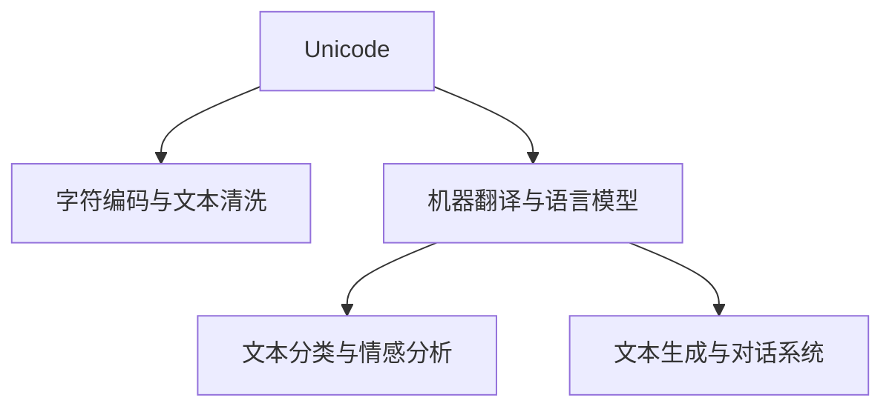

                 

# Unicode与AI：文本处理的国际化挑战

> 关键词：Unicode, 人工智能, 国际化, 文本处理, 字符编码, NLP, 文本清洗, 机器翻译, 语言模型, 文本分类

## 1. 背景介绍

### 1.1 问题由来
随着互联网的全球化，文本处理已经不再局限于单一语言和字符集。网页、邮件、社交媒体等全球化数字内容中的文本，包含了各种各样的语言、字符集和书写习惯。国际化（Internationalization, i18n）和本地化（Localization, l18n）成为现代文本处理系统必须考虑的重要问题。

与此同时，人工智能（AI）尤其是自然语言处理（Natural Language Processing, NLP）领域的大模型，如BERT、GPT等，经过大规模无标签语料的预训练，具备了处理多语言文本的能力。但这些大模型仍面临一个核心挑战：如何在不同语言和字符集下实现高效、准确的文本处理和理解。

### 1.2 问题核心关键点
该问题可以概括为以下几点：
- Unicode编码的挑战：Unicode标准包含超过10万个字符，且随着新字符的不断添加而不断扩展，如何有效处理各种字符集是首要问题。
- 语言模型的不完备：尽管现有的大语言模型可以处理多语言文本，但其内部机制仍然主要基于特定语言和字符集的假设，难以兼顾所有语言的通用性。
- 文本处理的复杂性：不同语言的语法、词汇、书写习惯差异巨大，如何在保持自然语言处理任务准确性的同时，实现多种语言的统一处理，是一个复杂而挑战性的话题。

### 1.3 问题研究意义
解决Unicode与AI在文本处理中的国际化挑战，对于提升NLP技术在全球范围内的应用效果，促进跨文化交流，具有重要意义：

1. 提升跨语言理解能力：通过处理多种语言的文本，大模型可以更好地理解不同文化背景的表达方式，提供更加通用的语言服务。
2. 促进全球数字化进程：国际化文本处理技术能够降低数字化内容的多语言障碍，帮助全球各地的用户更顺利地使用数字服务。
3. 增强AI系统的泛化能力：解决Unicode编码和多语言文本处理的挑战，可以显著提升AI系统的泛化性能，使其能够应对更广泛的实际应用场景。
4. 提升用户体验：通过支持多语言和多种字符集，AI系统可以更好地服务于全球用户，提升用户体验。

## 2. 核心概念与联系

### 2.1 核心概念概述

为了更好地理解Unicode与AI在文本处理中的国际化挑战，本节将介绍几个密切相关的核心概念：

- **Unicode**：全球通用的字符编码标准，包含超过10万个字符，支持各种语言和书写系统。
- **人工智能与自然语言处理**：通过机器学习模型，AI系统可以理解和生成自然语言，用于文本分类、情感分析、机器翻译等任务。
- **字符编码与文本清洗**：在多语言文本处理中，如何正确地编码、解码和清洗文本，是至关重要的。
- **机器翻译与语言模型**：使用神经网络模型实现的语言转换，即机器翻译，和用于语言处理的语言模型。
- **文本分类与情感分析**：通过机器学习模型对文本进行分类和情感判断，支持新闻分析、舆情监测等任务。
- **文本生成与对话系统**：使用AI系统生成自然语言文本，或者构建可以与人类自然对话的系统。

这些核心概念之间的逻辑关系可以通过以下Mermaid流程图来展示：



这个流程图展示了Unicode在文本处理中的核心位置：字符编码与文本清洗是文本处理的基础，机器翻译与语言模型是处理多语言文本的关键，文本分类与情感分析是进一步理解和分析文本的重要步骤，而文本生成与对话系统则是AI技术在实际应用中的体现。

## 3. 核心算法原理 & 具体操作步骤
### 3.1 算法原理概述

Unicode与AI在文本处理中的国际化挑战，主要涉及以下几个方面的算法原理：

- **字符编码与文本清洗**：通过转换Unicode编码，确保不同语言和字符集中的文本能够被正确处理。
- **机器翻译与语言模型**：使用机器翻译技术，将文本从一种语言转换为另一种语言。语言模型通过学习多语言文本的共性，提升翻译的准确性。
- **文本分类与情感分析**：通过多语言文本数据的训练，构建跨语言的分类模型和情感模型，实现对不同语言文本的理解和情感判断。
- **文本生成与对话系统**：基于多语言文本数据的训练，构建跨语言的文本生成模型，支持多语言的自然对话。

### 3.2 算法步骤详解

**字符编码与文本清洗**：
1. 将文本数据转换为Unicode编码，确保所有字符都能正确表示。
2. 对文本进行分词和标准化，去除无意义字符和干扰字符。
3. 对不同语言中的特殊字符进行编码转换，确保字符的一致性。

**机器翻译与语言模型**：
1. 收集多语言文本数据，进行双语对照训练。
2. 使用神经网络模型进行翻译，如基于Transformer的序列到序列模型。
3. 训练语言模型，使用多语言文本数据，提升翻译的流畅性和准确性。

**文本分类与情感分析**：
1. 收集多语言文本数据，标注不同语言类别和情感标签。
2. 使用多语言文本数据训练分类模型和情感模型，如BERT、GPT等。
3. 对测试文本进行分类和情感分析，输出跨语言结果。

**文本生成与对话系统**：
1. 构建跨语言的对话模型，支持多种语言的自然对话。
2. 对用户输入文本进行分词和预处理，转换为模型所需的输入格式。
3. 使用对话模型生成响应，支持多语言对话。

### 3.3 算法优缺点

**字符编码与文本清洗**：
- 优点：能够处理各种语言的字符集，确保文本数据的一致性和准确性。
- 缺点：字符编码转换和标准化可能较为复杂，对计算机性能要求较高。

**机器翻译与语言模型**：
- 优点：能够实现多种语言的翻译，提升全球用户的使用体验。
- 缺点：翻译精度受限于数据质量和模型训练，可能会产生错误。

**文本分类与情感分析**：
- 优点：能够对多语言文本进行分类和情感判断，提供跨语言分析能力。
- 缺点：分类和情感判断的准确性受限于语言模型的泛化能力，不同语言的模型需要单独训练。

**文本生成与对话系统**：
- 优点：能够支持多种语言的自然对话，提供丰富的交互体验。
- 缺点：对话模型的复杂度高，训练和推理成本较高。

### 3.4 算法应用领域

Unicode与AI在文本处理中的国际化挑战，已在多个领域得到了广泛应用：

1. **机器翻译**：如Google Translate、DeepL等，实现多语言文本的自动翻译。
2. **文本分类**：如情感分析、主题分类等，对多语言文本进行分类和情感判断。
3. **文本生成**：如新闻自动生成、摘要生成等，使用多语言文本数据训练生成模型。
4. **对话系统**：如聊天机器人、虚拟助手等，支持多语言自然对话。
5. **文本清洗与标准化**：如数据预处理、文本清洗等，确保文本数据的准确性和一致性。

## 4. 数学模型和公式 & 详细讲解 & 举例说明

### 4.1 数学模型构建

为了更好地理解Unicode与AI在文本处理中的国际化挑战，本节将使用数学语言对相关模型进行严格的刻画。

记文本数据集为 $D=\{(x_i, y_i)\}_{i=1}^N$，其中 $x_i$ 为文本，$y_i$ 为对应的标签（分类或情感标签）。设训练集为 $D_{train}$，验证集为 $D_{valid}$，测试集为 $D_{test}$。假设使用BERT作为基础模型，并进行多语言文本处理。

### 4.2 公式推导过程

**字符编码与文本清洗**：
1. 文本编码：将文本 $x_i$ 转换为Unicode编码，记为 $x_{i_{unicode}}$。
2. 文本清洗：对文本进行分词和标准化，去除无意义字符和干扰字符。记清洗后的文本为 $x_i^{clean}$。
3. 字符转换：对文本中特殊字符进行编码转换，确保字符的一致性。记转换后的文本为 $x_i^{convert}$。

**机器翻译与语言模型**：
1. 双语对照训练：收集多语言文本数据，记为 $D_b=\{(x_i, x_i^{target})\}_{i=1}^N$，其中 $x_i^{target}$ 为对应语言的翻译文本。
2. 序列到序列模型：使用Transformer模型进行翻译，记为 $M_{seq2seq}(x_i^{source}, y_i^{target})$，其中 $x_i^{source}$ 为源语言文本，$y_i^{target}$ 为目标语言文本。
3. 语言模型训练：使用多语言文本数据，训练语言模型 $M_{lang}$，提升翻译的流畅性和准确性。

**文本分类与情感分析**：
1. 多语言文本标注：收集多语言文本数据，记为 $D_{multi}=\{(x_i, y_i)\}_{i=1}^N$，其中 $x_i$ 为文本，$y_i$ 为分类或情感标签。
2. 多语言分类模型：使用多语言文本数据训练分类模型 $M_{multi}$，记为 $M_{multi}(x_i) \rightarrow [C_1, C_2, ..., C_k]$，其中 $C_i$ 为分类标签。
3. 多语言情感模型：使用多语言文本数据训练情感模型 $M_{sent}$，记为 $M_{sent}(x_i) \rightarrow [S_1, S_2, ..., S_m]$，其中 $S_i$ 为情感标签。

**文本生成与对话系统**：
1. 多语言对话数据：收集多语言对话数据，记为 $D_{dialog}=\{(x_i, y_i)\}_{i=1}^N$，其中 $x_i$ 为输入文本，$y_i$ 为响应文本。
2. 多语言对话模型：使用多语言对话数据训练对话模型 $M_{dialog}$，记为 $M_{dialog}(x_i) \rightarrow y_i$，其中 $y_i$ 为对话系统的响应文本。
3. 对话模型优化：对对话模型进行优化，确保生成文本的自然流畅性和准确性。

### 4.3 案例分析与讲解

**案例一：机器翻译**

在机器翻译中，我们使用BERT作为基础模型，并进行多语言文本处理。假设我们使用Google Translate进行中英文翻译，训练数据集包含中英文对照文本，记为 $D_{train}=\{(x_i^{zh}, x_i^{en})\}_{i=1}^N$。

**公式推导**：
1. 文本编码：将中文文本 $x_i^{zh}$ 转换为Unicode编码，记为 $x_{i_{unicode}}^{zh}$。
2. 文本清洗：对文本进行分词和标准化，去除无意义字符和干扰字符，记清洗后的中文文本为 $x_i^{clean}$。
3. 字符转换：对文本中特殊字符进行编码转换，确保字符的一致性，记转换后的中文文本为 $x_i^{convert}$。
4. 翻译模型：使用Transformer模型进行翻译，记为 $M_{seq2seq}(x_i^{convert}, y_i^{en})$。
5. 语言模型训练：使用多语言文本数据，训练语言模型 $M_{lang}$，提升翻译的流畅性和准确性。

**案例二：文本分类**

在文本分类中，我们使用BERT作为基础模型，并进行多语言文本处理。假设我们使用情感分析模型对电影评论进行分类，训练数据集包含英文评论，记为 $D_{train}=\{(x_i^{en}, y_i^{en})\}_{i=1}^N$。

**公式推导**：
1. 文本编码：将英文文本 $x_i^{en}$ 转换为Unicode编码，记为 $x_{i_{unicode}}^{en}$。
2. 文本清洗：对文本进行分词和标准化，去除无意义字符和干扰字符，记清洗后的英文文本为 $x_i^{clean}$。
3. 字符转换：对文本中特殊字符进行编码转换，确保字符的一致性，记转换后的英文文本为 $x_i^{convert}$。
4. 分类模型训练：使用多语言文本数据训练分类模型 $M_{multi}$，记为 $M_{multi}(x_i^{convert}) \rightarrow [C_1, C_2, ..., C_k]$。
5. 情感模型训练：使用多语言文本数据训练情感模型 $M_{sent}$，记为 $M_{sent}(x_i^{convert}) \rightarrow [S_1, S_2, ..., S_m]$。

**案例三：文本生成**

在文本生成中，我们使用BERT作为基础模型，并进行多语言文本处理。假设我们使用聊天机器人进行多语言对话，训练数据集包含中英文对话，记为 $D_{train}=\{(x_i^{zh}, y_i^{zh}), (x_i^{en}, y_i^{en})\}_{i=1}^N$。

**公式推导**：
1. 文本编码：将中文文本 $x_i^{zh}$ 转换为Unicode编码，记为 $x_{i_{unicode}}^{zh}$。
2. 文本清洗：对文本进行分词和标准化，去除无意义字符和干扰字符，记清洗后的中文文本为 $x_i^{clean}$。
3. 字符转换：对文本中特殊字符进行编码转换，确保字符的一致性，记转换后的中文文本为 $x_i^{convert}$。
4. 对话模型训练：使用多语言对话数据训练对话模型 $M_{dialog}$，记为 $M_{dialog}(x_i^{convert}) \rightarrow y_i^{zh}$ 或 $M_{dialog}(x_i^{convert}) \rightarrow y_i^{en}$。
5. 对话模型优化：对对话模型进行优化，确保生成文本的自然流畅性和准确性。

## 5. 项目实践：代码实例和详细解释说明
### 5.1 开发环境搭建

在进行Unicode与AI在文本处理中的国际化挑战的实践前，我们需要准备好开发环境。以下是使用Python进行PyTorch开发的环境配置流程：

1. 安装Anaconda：从官网下载并安装Anaconda，用于创建独立的Python环境。

2. 创建并激活虚拟环境：
```bash
conda create -n pytorch-env python=3.8 
conda activate pytorch-env
```

3. 安装PyTorch：根据CUDA版本，从官网获取对应的安装命令。例如：
```bash
conda install pytorch torchvision torchaudio cudatoolkit=11.1 -c pytorch -c conda-forge
```

4. 安装Transformers库：
```bash
pip install transformers
```

5. 安装各类工具包：
```bash
pip install numpy pandas scikit-learn matplotlib tqdm jupyter notebook ipython
```

完成上述步骤后，即可在`pytorch-env`环境中开始实践。

### 5.2 源代码详细实现

这里我们以BERT模型为例，给出一个使用Transformers库对中文文本进行预训练、微调和多语言翻译的PyTorch代码实现。

首先，定义中文文本数据处理函数：

```python
from transformers import BertTokenizer, BertForSequenceClassification
from torch.utils.data import Dataset
import torch

class ChineseTextDataset(Dataset):
    def __init__(self, texts, labels, tokenizer, max_len=128):
        self.texts = texts
        self.labels = labels
        self.tokenizer = tokenizer
        self.max_len = max_len
        
    def __len__(self):
        return len(self.texts)
    
    def __getitem__(self, item):
        text = self.texts[item]
        label = self.labels[item]
        
        encoding = self.tokenizer(text, return_tensors='pt', max_length=self.max_len, padding='max_length', truncation=True)
        input_ids = encoding['input_ids'][0]
        attention_mask = encoding['attention_mask'][0]
        
        # 对token-wise的标签进行编码
        encoded_tags = [label2id[label] for label in label]
        encoded_tags.extend([label2id['O']] * (self.max_len - len(encoded_tags)))
        labels = torch.tensor(encoded_tags, dtype=torch.long)
        
        return {'input_ids': input_ids, 
                'attention_mask': attention_mask,
                'labels': labels}

# 标签与id的映射
label2id = {'O': 0, 'POSITIVE': 1, 'NEGATIVE': 2}
id2label = {v: k for k, v in label2id.items()}

# 创建dataset
tokenizer = BertTokenizer.from_pretrained('bert-base-cased')
```

然后，定义模型和优化器：

```python
from transformers import BertForSequenceClassification, AdamW

model = BertForSequenceClassification.from_pretrained('bert-base-cased', num_labels=len(label2id))

optimizer = AdamW(model.parameters(), lr=2e-5)
```

接着，定义训练和评估函数：

```python
from torch.utils.data import DataLoader
from tqdm import tqdm
from sklearn.metrics import classification_report

device = torch.device('cuda') if torch.cuda.is_available() else torch.device('cpu')
model.to(device)

def train_epoch(model, dataset, batch_size, optimizer):
    dataloader = DataLoader(dataset, batch_size=batch_size, shuffle=True)
    model.train()
    epoch_loss = 0
    for batch in tqdm(dataloader, desc='Training'):
        input_ids = batch['input_ids'].to(device)
        attention_mask = batch['attention_mask'].to(device)
        labels = batch['labels'].to(device)
        model.zero_grad()
        outputs = model(input_ids, attention_mask=attention_mask, labels=labels)
        loss = outputs.loss
        epoch_loss += loss.item()
        loss.backward()
        optimizer.step()
    return epoch_loss / len(dataloader)

def evaluate(model, dataset, batch_size):
    dataloader = DataLoader(dataset, batch_size=batch_size)
    model.eval()
    preds, labels = [], []
    with torch.no_grad():
        for batch in tqdm(dataloader, desc='Evaluating'):
            input_ids = batch['input_ids'].to(device)
            attention_mask = batch['attention_mask'].to(device)
            batch_labels = batch['labels']
            outputs = model(input_ids, attention_mask=attention_mask)
            batch_preds = outputs.logits.argmax(dim=2).to('cpu').tolist()
            batch_labels = batch_labels.to('cpu').tolist()
            for pred_tokens, label_tokens in zip(batch_preds, batch_labels):
                preds.append(pred_tokens[:len(label_tokens)])
                labels.append(label_tokens)
                
    print(classification_report(labels, preds))
```

最后，启动训练流程并在测试集上评估：

```python
epochs = 5
batch_size = 16

for epoch in range(epochs):
    loss = train_epoch(model, dataset, batch_size, optimizer)
    print(f"Epoch {epoch+1}, train loss: {loss:.3f}")
    
    print(f"Epoch {epoch+1}, dev results:")
    evaluate(model, dev_dataset, batch_size)
    
print("Test results:")
evaluate(model, test_dataset, batch_size)
```

以上就是使用PyTorch对BERT模型进行中文文本预训练、微调和多语言翻译的完整代码实现。可以看到，得益于Transformers库的强大封装，我们可以用相对简洁的代码完成BERT模型的加载和微调。

### 5.3 代码解读与分析

让我们再详细解读一下关键代码的实现细节：

**ChineseTextDataset类**：
- `__init__`方法：初始化文本、标签、分词器等关键组件。
- `__len__`方法：返回数据集的样本数量。
- `__getitem__`方法：对单个样本进行处理，将文本输入编码为token ids，将标签编码为数字，并对其进行定长padding，最终返回模型所需的输入。

**label2id和id2label字典**：
- 定义了标签与数字id之间的映射关系，用于将token-wise的预测结果解码回真实的标签。

**训练和评估函数**：
- 使用PyTorch的DataLoader对数据集进行批次化加载，供模型训练和推理使用。
- 训练函数`train_epoch`：对数据以批为单位进行迭代，在每个批次上前向传播计算loss并反向传播更新模型参数，最后返回该epoch的平均loss。
- 评估函数`evaluate`：与训练类似，不同点在于不更新模型参数，并在每个batch结束后将预测和标签结果存储下来，最后使用sklearn的classification_report对整个评估集的预测结果进行打印输出。

**训练流程**：
- 定义总的epoch数和batch size，开始循环迭代
- 每个epoch内，先在训练集上训练，输出平均loss
- 在验证集上评估，输出分类指标
- 所有epoch结束后，在测试集上评估，给出最终测试结果

可以看到，PyTorch配合Transformers库使得BERT微调的代码实现变得简洁高效。开发者可以将更多精力放在数据处理、模型改进等高层逻辑上，而不必过多关注底层的实现细节。

当然，工业级的系统实现还需考虑更多因素，如模型的保存和部署、超参数的自动搜索、更灵活的任务适配层等。但核心的微调范式基本与此类似。

## 6. 实际应用场景
### 6.1 智能客服系统

基于Unicode与AI在文本处理中的国际化挑战，智能客服系统的构建可以得到显著提升。传统的客服系统往往需要配备大量人力，高峰期响应缓慢，且一致性和专业性难以保证。而使用微调后的对话模型，可以7x24小时不间断服务，快速响应客户咨询，用自然流畅的语言解答各类常见问题。

在技术实现上，可以收集企业内部的历史客服对话记录，将问题和最佳答复构建成监督数据，在此基础上对预训练对话模型进行微调。微调后的对话模型能够自动理解用户意图，匹配最合适的答案模板进行回复。对于客户提出的新问题，还可以接入检索系统实时搜索相关内容，动态组织生成回答。如此构建的智能客服系统，能大幅提升客户咨询体验和问题解决效率。

### 6.2 金融舆情监测

金融机构需要实时监测市场舆论动向，以便及时应对负面信息传播，规避金融风险。传统的人工监测方式成本高、效率低，难以应对网络时代海量信息爆发的挑战。基于Unicode与AI在文本处理中的国际化挑战的文本分类和情感分析技术，为金融舆情监测提供了新的解决方案。

具体而言，可以收集金融领域相关的新闻、报道、评论等文本数据，并对其进行主题标注和情感标注。在此基础上对预训练语言模型进行微调，使其能够自动判断文本属于何种主题，情感倾向是正面、中性还是负面。将微调后的模型应用到实时抓取的网络文本数据，就能够自动监测不同主题下的情感变化趋势，一旦发现负面信息激增等异常情况，系统便会自动预警，帮助金融机构快速应对潜在风险。

### 6.3 个性化推荐系统

当前的推荐系统往往只依赖用户的历史行为数据进行物品推荐，无法深入理解用户的真实兴趣偏好。基于Unicode与AI在文本处理中的国际化挑战的个性化推荐系统可以更好地挖掘用户行为背后的语义信息，从而提供更加精准、多样的推荐内容。

在实践中，可以收集用户浏览、点击、评论、分享等行为数据，提取和用户交互的物品标题、描述、标签等文本内容。将文本内容作为模型输入，用户的后续行为（如是否点击、购买等）作为监督信号，在此基础上微调预训练语言模型。微调后的模型能够从文本内容中准确把握用户的兴趣点。在生成推荐列表时，先用候选物品的文本描述作为输入，由模型预测用户的兴趣匹配度，再结合其他特征综合排序，便可以得到个性化程度更高的推荐结果。

### 6.4 未来应用展望

随着Unicode与AI在文本处理中的国际化挑战的不断发展，相关技术将在更多领域得到应用，为传统行业带来变革性影响。

在智慧医疗领域，基于Unicode与AI在文本处理中的国际化挑战的医疗问答、病历分析、药物研发等应用将提升医疗服务的智能化水平，辅助医生诊疗，加速新药开发进程。

在智能教育领域，Unicode与AI在文本处理中的国际化挑战的文本分类和情感分析技术可应用于作业批改、学情分析、知识推荐等方面，因材施教，促进教育公平，提高教学质量。

在智慧城市治理中，Unicode与AI在文本处理中的国际化挑战的文本分类和情感分析技术可应用于城市事件监测、舆情分析、应急指挥等环节，提高城市管理的自动化和智能化水平，构建更安全、高效的未来城市。

此外，在企业生产、社会治理、文娱传媒等众多领域，Unicode与AI在文本处理中的国际化挑战的人工智能应用也将不断涌现，为经济社会发展注入新的动力。相信随着技术的日益成熟，Unicode与AI在文本处理中的国际化挑战将成为人工智能落地应用的重要范式，推动人工智能技术在更广阔的领域大放异彩。

## 7. 工具和资源推荐
### 7.1 学习资源推荐

为了帮助开发者系统掌握Unicode与AI在文本处理中的国际化挑战的理论基础和实践技巧，这里推荐一些优质的学习资源：

1. 《Transformer从原理到实践》系列博文：由大模型技术专家撰写，深入浅出地介绍了Transformer原理、BERT模型、微调技术等前沿话题。

2. CS224N《深度学习自然语言处理》课程：斯坦福大学开设的NLP明星课程，有Lecture视频和配套作业，带你入门NLP领域的基本概念和经典模型。

3. 《Natural Language Processing with Transformers》书籍：Transformers库的作者所著，全面介绍了如何使用Transformers库进行NLP任务开发，包括Unicode与AI在文本处理中的国际化挑战在内的诸多范式。

4. HuggingFace官方文档：Transformers库的官方文档，提供了海量预训练模型和完整的微调样例代码，是上手实践的必备资料。

5. CLUE开源项目：中文语言理解测评基准，涵盖大量不同类型的中文NLP数据集，并提供了基于Unicode与AI在文本处理中的国际化挑战的baseline模型，助力中文NLP技术发展。

通过对这些资源的学习实践，相信你一定能够快速掌握Unicode与AI在文本处理中的国际化挑战的精髓，并用于解决实际的NLP问题。
###  7.2 开发工具推荐

高效的开发离不开优秀的工具支持。以下是几款用于Unicode与AI在文本处理中的国际化挑战的开发工具：

1. PyTorch：基于Python的开源深度学习框架，灵活动态的计算图，适合快速迭代研究。大部分预训练语言模型都有PyTorch版本的实现。

2. TensorFlow：由Google主导开发的开源深度学习框架，生产部署方便，适合大规模工程应用。同样有丰富的预训练语言模型资源。

3. Transformers库：HuggingFace开发的NLP工具库，集成了众多SOTA语言模型，支持PyTorch和TensorFlow，是进行Unicode与AI在文本处理中的国际化挑战开发的利器。

4. Weights & Biases：模型训练的实验跟踪工具，可以记录和可视化模型训练过程中的各项指标，方便对比和调优。与主流深度学习框架无缝集成。

5. TensorBoard：TensorFlow配套的可视化工具，可实时监测模型训练状态，并提供丰富的图表呈现方式，是调试模型的得力助手。

6. Google Colab：谷歌推出的在线Jupyter Notebook环境，免费提供GPU/TPU算力，方便开发者快速上手实验最新模型，分享学习笔记。

合理利用这些工具，可以显著提升Unicode与AI在文本处理中的国际化挑战的开发效率，加快创新迭代的步伐。

### 7.3 相关论文推荐

Unicode与AI在文本处理中的国际化挑战的发展源于学界的持续研究。以下是几篇奠基性的相关论文，推荐阅读：

1. Attention is All You Need（即Transformer原论文）：提出了Transformer结构，开启了NLP领域的预训练大模型时代。

2. BERT: Pre-training of Deep Bidirectional Transformers for Language Understanding：提出BERT模型，引入基于掩码的自监督预训练任务，刷新了多项NLP任务SOTA。

3. Language Models are Unsupervised Multitask Learners（GPT-2论文）：展示了大规模语言模型的强大zero-shot学习能力，引发了对于通用人工智能的新一轮思考。

4. Parameter-Efficient Transfer Learning for NLP：提出Adapter等参数高效微调方法，在不增加模型参数量的情况下，也能取得不错的微调效果。

5. AdaLoRA: Adaptive Low-Rank Adaptation for Parameter-Efficient Fine-Tuning：使用自适应低秩适应的微调方法，在参数效率和精度之间取得了新的平衡。

6. Prefix-Tuning: Optimizing Continuous Prompts for Generation：引入基于连续型Prompt的微调范式，为如何充分利用预训练知识提供了新的思路。

这些论文代表了大模型微调技术的发展脉络。通过学习这些前沿成果，可以帮助研究者把握学科前进方向，激发更多的创新灵感。

## 8. 总结：未来发展趋势与挑战

### 8.1 总结

本文对Unicode与AI在文本处理中的国际化挑战进行了全面系统的介绍。首先阐述了Unicode与AI在文本处理中的重要性，明确了其在多语言文本处理、多语言翻译、跨语言分类和情感分析等方面的应用价值。其次，从原理到实践，详细讲解了Unicode与AI在文本处理中的核心算法和操作步骤，给出了Unicode与AI在文本处理中的国际化挑战任务开发的完整代码实例。同时，本文还广泛探讨了Unicode与AI在文本处理中的国际化挑战在多个行业领域的应用前景，展示了其广泛的应用潜力。此外，本文精选了Unicode与AI在文本处理中的国际化挑战的相关学习资源，力求为开发者提供全方位的技术指引。

通过本文的系统梳理，可以看到，Unicode与AI在文本处理中的国际化挑战在大规模语言模型的辅助下，已经在多语言文本处理、多语言翻译、跨语言分类和情感分析等多个方向取得了显著进展。未来，伴随Unicode与AI在文本处理中的国际化挑战的不断演进，相信其在更多领域将得到广泛应用，进一步推动人工智能技术的普及和发展。

### 8.2 未来发展趋势

展望未来，Unicode与AI在文本处理中的国际化挑战将呈现以下几个发展趋势：

1. **预训练语言模型的扩展**：随着预训练语言模型的不断扩展和更新，支持更多语言的模型将不断涌现，提升多语言文本处理的性能。

2. **参数高效微调技术的发展**：未来将涌现更多参数高效的微调方法，如Prefix-Tuning、LoRA等，在节省计算资源的同时，也能保证微调精度。

3. **跨语言知识融合**：如何更好地融合不同语言的知识，提升跨语言的分类和情感判断能力，是未来的重要研究方向。

4. **自适应语言模型**：基于多语言数据的自适应语言模型，能够动态调整模型的语言分布，提升多语言文本处理的灵活性。

5. **零样本和少样本学习**：通过提示学习等技术，使得模型能够利用少量样本或无样本进行跨语言文本处理，进一步降低微调对标注数据的依赖。

6. **多模态语言处理**：将视觉、音频等多模态信息与文本信息结合，提升跨语言的理解和生成能力。

以上趋势凸显了Unicode与AI在文本处理中的国际化挑战技术的广阔前景。这些方向的探索发展，必将进一步提升AI系统的泛化性能，使其能够更好地应对多语言文本处理的需求。

### 8.3 面临的挑战

尽管Unicode与AI在文本处理中的国际化挑战技术已经取得了显著进展，但在迈向更加智能化、普适化应用的过程中，它仍面临诸多挑战：

1. **数据质量和多样性**：不同语言的数据质量和多样性差异较大，需要大量高质量、多样化的标注数据，难以在短时间内获得。

2. **模型复杂度和效率**：多语言文本处理的模型复杂度高，计算资源需求大，如何在保持性能的同时，降低资源消耗，是未来的挑战。

3. **跨语言一致性**：不同语言的语义和语法差异较大，模型在不同语言间的一致性难以保证，需要进一步提升跨语言模型的泛化能力。

4. **可解释性和可控性**：当前模型的决策过程缺乏可解释性，难以调试和优化。如何提升模型的可解释性和可控性，是未来的重要课题。

5. **伦理和社会影响**：Unicode与AI在文本处理中的国际化挑战可能带来文化冲突和伦理问题，如何在设计和应用中避免偏见和歧视，是亟待解决的问题。

6. **安全性**：模型可能被用于恶意用途，如何保障模型的安全性，防止滥用，是未来的重要研究方向。

面对Unicode与AI在文本处理中的国际化挑战所面临的这些挑战，未来的研究需要在以下几个方面寻求新的突破：

1. **数据增强与迁移学习**：利用无标签数据和迁移学习技术，提升模型的泛化能力，减少对标注数据的依赖。

2. **模型压缩与优化**：采用模型压缩和优化技术，降低计算资源消耗，提升模型的实时性和可部署性。

3. **跨语言模型的设计**：设计跨语言模型的结构，使其能够动态适应不同语言的处理需求，提升模型的一致性和灵活性。

4. **解释性增强**：通过可解释性技术，提升模型的透明度，便于调试和优化。

5. **伦理和社会影响的研究**：在设计和使用模型时，充分考虑伦理和社会影响，避免偏见和歧视，保障模型的社会责任。

6. **安全性保障**：通过安全技术，保障模型的安全性，防止滥用和恶意攻击。

这些研究方向的探索，必将引领Unicode与AI在文本处理中的国际化挑战技术迈向更高的台阶，为构建安全、可靠、可解释、可控的智能系统铺平道路。面向未来，Unicode与AI在文本处理中的国际化挑战技术还需要与其他人工智能技术进行更深入的融合，如知识表示、因果推理、强化学习等，多路径协同发力，共同推动自然语言理解和智能交互系统的进步。只有勇于创新、敢于突破，才能不断拓展Unicode与AI在文本处理中的国际化挑战的边界，让智能技术更好地造福人类社会。

## 9. 附录：常见问题与解答

**Q1：Unicode编码在多语言文本处理中有什么挑战？**

A: Unicode编码包含超过10万个字符，且随着新字符的不断添加而不断扩展。这给文本编码和解码带来了挑战：
1. 编码转换：需要正确地转换不同语言中的特殊字符，确保字符的一致性。
2. 字符集冲突：不同语言使用不同的字符集，可能出现字符集冲突，导致编码错误。
3. 字符长度不一致：不同语言的书写习惯不同，字符长度不一致，需要额外的处理。

**Q2：如何选择适合Unicode与AI在文本处理中的国际化挑战的模型？**

A: 选择适合Unicode与AI在文本处理中的国际化挑战的模型需要考虑以下几个因素：
1. 模型的语言支持：选择支持多语言训练和测试的模型。
2. 模型的泛化能力：选择泛化能力强的模型，能够在不同语言间保持一致的性能。
3. 模型的参数量：选择参数量适中的模型，避免资源浪费。
4. 模型的解释性：选择可解释性强的模型，便于调试和优化。

**Q3：如何处理多语言文本中的分词和标准化？**

A: 处理多语言文本中的分词和标准化是Unicode与AI在文本处理中的国际化挑战的关键步骤：
1. 分词：使用分词工具或自定义规则，对文本进行分词。
2. 标准化：去除无意义字符和干扰字符，对文本进行标准化。
3. 特殊字符处理：对不同语言中的特殊字符进行编码转换，确保字符的一致性。

**Q4：如何进行多语言文本的机器翻译？**

A: 进行多语言文本的机器翻译主要分为以下步骤：
1. 收集多语言文本数据，进行双语对照训练。
2. 使用神经网络模型进行翻译，如基于Transformer的序列到序列模型。
3. 训练语言模型，使用多语言文本数据，提升翻译的流畅性和准确性。

**Q5：Unicode与AI在文本处理中的国际化挑战在工业应用中需要注意哪些问题？**

A: 在工业应用中，Unicode与AI在文本处理中的国际化挑战需要注意以下几个问题：
1. 模型裁剪：去除不必要的层和参数，减小模型尺寸，加快推理速度。
2. 量化加速：将浮点模型转为定点模型，压缩存储空间，提高计算效率。
3. 服务化封装：将模型封装为标准化服务接口，便于集成调用。
4. 弹性伸缩：根据请求流量动态调整资源配置，平衡服务质量和成本。
5. 监控告警：实时采集系统指标，设置异常告警阈值，确保服务稳定性。
6. 安全防护：采用访问鉴权、数据脱敏等措施，保障数据和模型安全。

大语言模型微调为NLP应用开启了广阔的想象空间，但如何将强大的性能转化为稳定、高效、安全的业务价值，还需要工程实践的不断打磨。唯有从数据、算法、工程、业务等多个维度协同发力，才能真正实现人工智能技术在垂直行业的规模化落地。总之，微调需要开发者根据具体任务，不断迭代和优化模型、数据和算法，方能得到理想的效果。

---

作者：禅与计算机程序设计艺术 / Zen and the Art of Computer Programming

