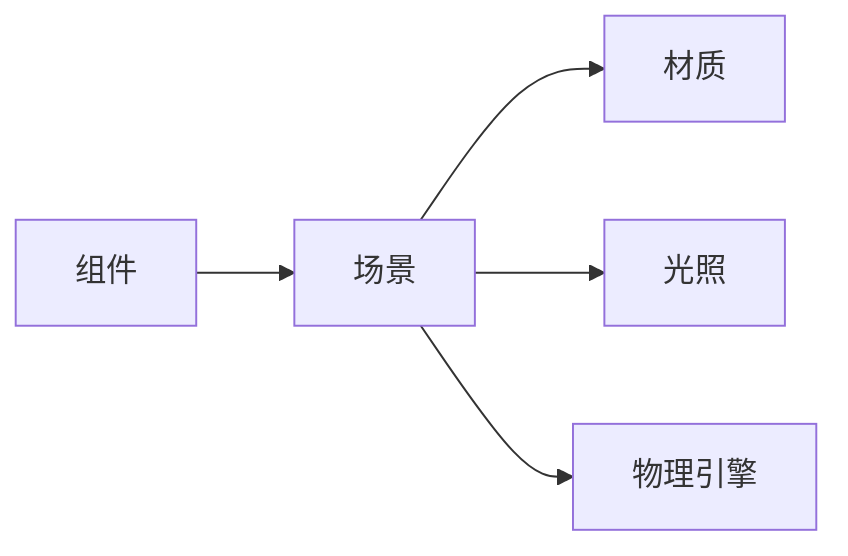
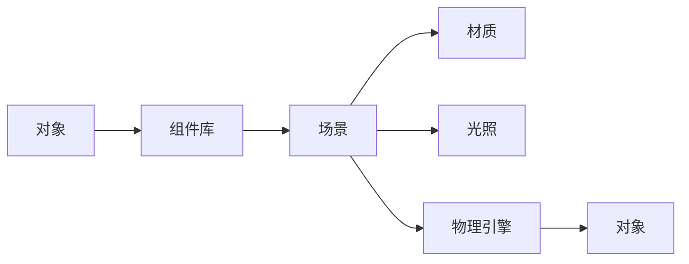

                 

## 1. 背景介绍

随着虚拟现实和增强现实技术的普及，游戏产业正迅速发展，创建真实、沉浸式的游戏世界成为技术研发人员的核心任务。Unity 作为全球领先的游戏引擎，以其强大的功能和灵活的生态系统，为游戏开发者提供了广泛的开发平台。本文旨在介绍 Unity 引擎的开发之旅，探讨如何利用 Unity 引擎创建逼真的世界和沉浸式体验。

## 2. 核心概念与联系

### 2.1 核心概念概述

Unity 是一个跨平台的游戏引擎，支持包括 PC、移动、虚拟现实（VR）和增强现实（AR）在内的多种平台。其核心概念包括：

- **组件（Components）**： Unity 中的组件是可重复使用的代码块，可以应用于不同的对象，实现特定的功能。
- **场景（Scenes）**：场景是 Unity 中的三维空间，包含多个对象，是游戏的核心运行环境。
- **材质（Materials）**：材质定义了对象的外观和光照特性，影响最终的游戏视觉效果。
- **光照（Lighting）**：光照系统模拟真实世界的光照效果，增强游戏的沉浸感。
- **物理引擎（Physics Engine）**：物理引擎模拟物体的运动和交互，为游戏添加真实感。

这些概念通过网络关系图连接起来，构成 Unity 引擎的基本架构：



### 2.2 核心概念原理和架构的 Mermaid 流程图



## 3. 核心算法原理 & 具体操作步骤

### 3.1 算法原理概述

Unity 引擎的核心算法包括但不限于以下几种：

- **物理引擎算法**：基于牛顿力学原理，模拟物体的运动和交互，确保游戏中的物理行为真实可信。
- **渲染算法**：包括光线追踪、光栅化、顶点着色器等，实现逼真的光照和材质效果。
- **图形引擎**：负责渲染场景中的各个对象，提供高性能的图形处理能力。
- **人工智能算法**：用于实现游戏角色的行为、智能体交互等功能，增强游戏的互动性和沉浸感。

这些算法共同构成了 Unity 引擎的强大功能，使得开发者能够创建各种复杂的游戏场景和体验。

### 3.2 算法步骤详解

Unity 引擎的开发过程可以分为以下几个主要步骤：

1. **项目设置**：在 Unity 编辑器中创建新的项目，设置项目的名称、版本、入口脚本等基本信息。

2. **场景设置**：创建场景，放置对象和摄像机，设置场景的光照、材质等属性。

3. **对象创建和编辑**：在场景中创建各种对象，如角色、环境、道具等，并进行细致的编辑。

4. **脚本编写**：编写脚本来控制对象的移动、交互、碰撞检测等功能。

5. **资源管理**：导入和配置资源，如模型、材质、纹理等，优化资源加载和内存使用。

6. **性能优化**：分析性能瓶颈，优化脚本、场景、渲染等各个环节，确保游戏的流畅运行。

7. **测试与发布**：在测试平台上测试游戏，修复问题，最终发布到不同平台。

### 3.3 算法优缺点

Unity 引擎的优点包括：

- 高度灵活：支持多种平台，提供丰富的开发工具和插件。
- 强大的物理引擎：模拟真实物理行为，提升游戏真实感。
- 高性能渲染：支持多种渲染技术和优化策略，实现高质量的视觉效果。

其缺点包括：

- 学习曲线陡峭：新手入门门槛较高，需要掌握大量工具和概念。
- 性能消耗高：大规模场景和复杂特效可能会影响游戏性能。
- 更新和维护成本高：频繁的引擎更新可能带来兼容性问题。

### 3.4 算法应用领域

Unity 引擎广泛应用于各种类型的游戏开发，包括：

- 2D 和 3D 游戏：支持各种类型的游戏，从简单的休闲游戏到复杂的动作和角色扮演游戏。
- 虚拟现实和增强现实：提供虚拟现实和增强现实的支持，实现沉浸式的交互体验。
- 动画和可视化：支持高级动画和可视化技术，实现流畅的动画效果和逼真的视觉效果。
- 跨平台应用：支持跨平台开发，简化在不同平台上的部署和发布过程。

## 4. 数学模型和公式 & 详细讲解 & 举例说明

### 4.1 数学模型构建

Unity 引擎的数学模型主要基于向量、矩阵和几何变换。游戏中的物理行为、光线追踪、物体运动等都可以用数学模型来描述。

以光线的追踪为例，我们可以用射线方程来描述从光源到屏幕上的每个像素点的光线路径：

$$ \vec{r} = \vec{o} + t\vec{d} $$

其中 $\vec{r}$ 表示光线的位置，$\vec{o}$ 表示光线起点，$\vec{d}$ 表示光线的方向，$t$ 表示光线从起点到当前位置沿方向 $\vec{d}$ 前进的距离。

### 4.2 公式推导过程

在 Unity 引擎中，光线追踪的实现基于计算图形学中的射线与几何体求交算法。具体步骤如下：

1. 从光源发出光线，计算光线在每帧的起点和方向。
2. 遍历场景中的每个三角形，计算光线与三角形的交点。
3. 根据交点的位置，计算光线的颜色和强度。
4. 根据光线的颜色和强度，计算屏幕上每个像素点的颜色。

### 4.3 案例分析与讲解

假设我们要实现一个简单的环境光，使游戏中的物体在光照下产生逼真的阴影和反射。我们可以使用 Unity 的 Light 组件来实现：

1. 在场景中添加一个光源，如点光源。
2. 将光源的阴影类型设置为“Shadow Mapping”。
3. 调整光源的阴影距离、阴影角度等参数。
4. 在需要光照的场景中添加物体，并为其添加材质，设置材质的光照属性。
5. 使用 Unity 的光照检测工具，观察场景中的光照效果和阴影效果。

## 5. 项目实践：代码实例和详细解释说明

### 5.1 开发环境搭建

在开始项目之前，需要确保Unity编辑器已正确安装并配置好开发环境。具体步骤如下：

1. 下载Unity编辑器，并进行安装。
2. 创建新的Unity项目，设置项目的基本信息。
3. 导入必要的插件和资源。
4. 配置项目设置，如输入设备、语言等。

### 5.2 源代码详细实现

以下是一个简单的Unity脚本，用于控制角色的移动和碰撞检测：

```csharp
using UnityEngine;

public class CharacterController : MonoBehaviour
{
    public float speed = 5f;
    public float jumpHeight = 2f;

    private Rigidbody rb;

    void Start()
    {
        rb = GetComponent<Rigidbody>();
    }

    void Update()
    {
        float moveHorizontal = Input.GetAxis("Horizontal");
        float moveVertical = Input.GetAxis("Vertical");

        Vector3 move = new Vector3(moveHorizontal, 0f, moveVertical);
        rb.velocity = move * speed;
    }

    void OnCollisionEnter(Collision collision)
    {
        if (collision.gameObject.tag == "Ground")
        {
            rb.velocity.y = jumpHeight;
        }
    }
}
```

### 5.3 代码解读与分析

该脚本用于控制角色的移动和跳跃。具体步骤如下：

1. 脚本通过`@ComponentGetter`方法获取游戏对象的刚体组件。
2. 在`void Update`方法中，根据玩家的输入控制角色的移动方向和速度。
3. 在`void OnCollisionEnter`方法中，检测角色与地面的碰撞，并根据碰撞结果进行跳跃操作。

### 5.4 运行结果展示

运行该脚本后，角色将在场景中移动并响应玩家的输入。通过Unity的可视化调试工具，可以观察角色的运动状态和碰撞效果。

## 6. 实际应用场景

### 6.1 虚拟现实游戏

Unity 引擎的虚拟现实支持使得开发者可以轻松创建沉浸式的VR游戏。例如，通过Unity的VR SDK，可以实现虚拟现实环境中的角色移动、物体交互、环境探索等功能。

### 6.2 增强现实游戏

Unity 引擎的AR支持使得开发者可以在真实世界中叠加虚拟内容，创建增强现实游戏。例如，通过Unity的AR SDK，可以实现AR环境中的物体放置、互动、跟踪等功能。

### 6.3 跨平台游戏

Unity 引擎的跨平台支持使得开发者可以创建可在PC、手机、平板等多种平台上运行的游戏。例如，通过Unity的跨平台SDK，可以实现不同平台之间的游戏互通和资源共享。

### 6.4 未来应用展望

未来，Unity 引擎将继续在以下方面发挥重要作用：

- 更高质量的光影和材质：通过改进光照和材质算法，实现更逼真的视觉效果。
- 更强大的物理引擎：通过优化物理引擎算法，提升游戏中的物理行为真实感。
- 更多的跨平台支持：支持更多平台和设备，实现更广泛的跨平台开发。
- 更智能的AI和行为：通过引入先进的AI算法，增强游戏中的智能体行为和交互。

## 7. 工具和资源推荐

### 7.1 学习资源推荐

以下是一些推荐的学习资源，可以帮助开发者深入了解Unity引擎的开发技术：

1. Unity 官方文档：包含详细的使用指南和API文档，是开发者必备的参考资料。
2. Unity Learn 平台：提供丰富的教程和培训课程，帮助开发者快速上手。
3. Udemy 和 Coursera：提供Unity开发相关的在线课程，适合系统学习。
4. Unity 开发者社区：与全球开发者交流经验，获取最新的技术动态。

### 7.2 开发工具推荐

以下是一些常用的开发工具，可以帮助开发者提高Unity开发效率：

1. Unity Hub：Unity Hub 是一个统一的管理工具，可以管理多个Unity项目，方便切换和发布。
2. Asset Store：Unity 的 Asset Store 是一个资源库，提供各种插件和资源，支持开发者进行快速开发。
3. Visual Studio Code：VS Code 是一个轻量级的代码编辑器，支持Unity开发，提供丰富的插件和扩展。
4. Git：使用 Git 进行版本控制，方便团队协作和代码管理。

### 7.3 相关论文推荐

以下是一些推荐的相关论文，可以帮助开发者深入了解Unity引擎的开发技术：

1. "Unity: A Cross-Platform 3D Engine"（Unity 引擎的跨平台设计）
2. "Lighting and Shadows in Unity 3D"（Unity 引擎中的光线和阴影）
3. "Physics Engine in Unity 3D"（Unity 引擎的物理引擎）
4. "Intelligent Behavior in Unity 3D"（Unity 引擎中的智能行为）

## 8. 总结：未来发展趋势与挑战

### 8.1 研究成果总结

Unity 引擎在游戏开发领域已经取得了显著的成果，支持多种平台和多种类型的游戏开发。通过不断的技术创新和优化，Unity 引擎将继续引领游戏开发的新趋势。

### 8.2 未来发展趋势

未来，Unity 引擎将继续在以下方面进行技术创新和优化：

- 更高的性能：通过改进渲染引擎和物理引擎，提升游戏的高帧率和高画质效果。
- 更智能的AI：通过引入先进的AI算法，增强游戏中的智能体行为和交互。
- 更丰富的资源库：通过扩展 Asset Store，提供更多高质量的资源和插件。
- 更灵活的开发工具：通过开发更强大的开发工具和插件，提升开发效率和体验。

### 8.3 面临的挑战

尽管Unity 引擎在游戏开发领域已经取得了显著的成果，但在技术发展过程中，也面临以下挑战：

- 性能瓶颈：大规模场景和复杂特效可能会影响游戏性能。
- 技术更新：频繁的引擎更新可能带来兼容性问题。
- 用户隐私：开发虚拟现实和增强现实游戏时，需要考虑用户的隐私和数据安全。
- 游戏开发成本：高质量的游戏开发需要大量的时间和资源投入，开发成本较高。

### 8.4 研究展望

未来的研究应在以下几个方面进行突破：

- 提高渲染性能：通过优化渲染算法和硬件加速，提升游戏的渲染性能。
- 增强AI智能：通过引入更先进的AI算法，增强游戏中的智能体行为和交互。
- 简化开发流程：通过开发更强大的开发工具和插件，简化游戏开发流程。
- 保障用户安全：通过优化隐私保护和安全策略，保障用户数据和游戏体验的安全。

## 9. 附录：常见问题与解答

**Q1：Unity 引擎是否支持所有的游戏类型？**

A: Unity 引擎支持多种类型的游戏开发，包括2D和3D游戏、虚拟现实和增强现实游戏等。但不同类型的游戏可能需要不同的开发技术和资源支持。

**Q2：Unity 引擎是否支持跨平台开发？**

A: Unity 引擎支持跨平台开发，可以在PC、手机、平板、VR等多种平台上运行游戏。但不同的平台可能需要不同的优化和调整。

**Q3：Unity 引擎的性能瓶颈在哪里？**

A: Unity 引擎的性能瓶颈主要在渲染和物理模拟方面。大规模场景和复杂特效可能会影响游戏性能，需要进行优化。

**Q4：Unity 引擎如何实现高质量的光影效果？**

A: Unity 引擎通过计算图形学中的光线追踪和光栅化技术实现高质量的光影效果。调整光源属性和光照模型可以增强游戏场景的逼真度。

**Q5：Unity 引擎如何进行AI智能体的行为模拟？**

A: Unity 引擎通过引入先进的AI算法，如行为树、状态机等，实现智能体的行为模拟和交互。开发者可以通过编写脚本来控制智能体的行为。

总之，Unity 引擎通过强大的功能和灵活的生态系统，为游戏开发者提供了广泛的技术支持。通过不断优化和创新，Unity 引擎将继续引领游戏开发的新趋势，为游戏产业带来更多的创新和突破。

