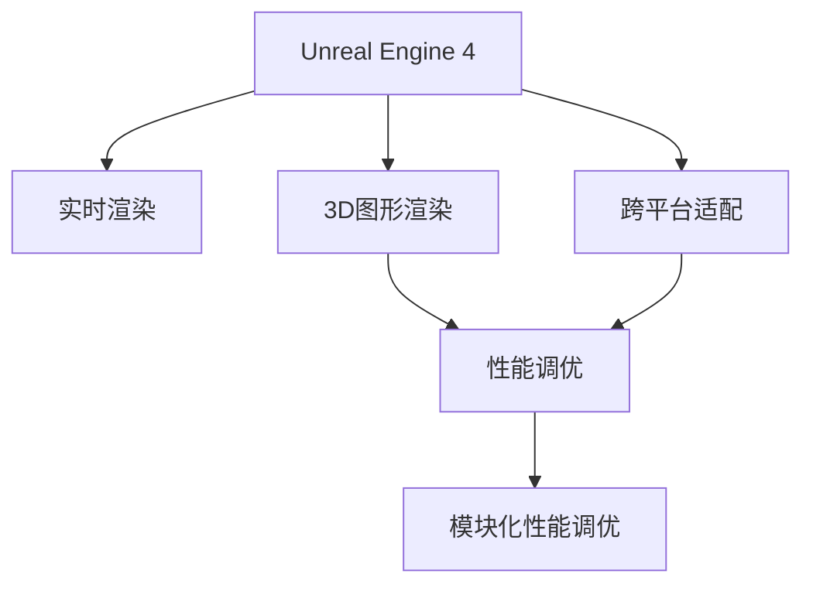

                 

# Unreal Engine 4游戏优化

> 关键词：游戏优化,Unreal Engine 4,性能调优,3D图形渲染,实时渲染

## 1. 背景介绍

### 1.1 问题由来
Unreal Engine 4 (UE4) 作为一款顶尖的3D游戏引擎，由Epic Games公司开发，广泛应用于游戏、电影、虚拟现实(VR)和增强现实(AR)等多个领域。其强大的图形渲染能力和丰富的工具集，使得开发者可以轻松创建高性能的视觉特效和复杂的交互逻辑。然而，随着游戏场景的复杂度不断提升，对性能的需求也日益增高。如何在保证游戏流畅性和视觉效果的同时，优化引擎性能，提升用户体验，成为了众多开发者亟待解决的问题。

### 1.2 问题核心关键点
Unreal Engine 4游戏优化的关键点主要包括以下几个方面：

- 实时渲染性能优化：确保游戏中各角色和场景能够流畅、顺滑地渲染，减少卡顿和延迟。
- 3D图形渲染效率提升：优化渲染管线，减少资源占用，提高帧率和图像质量。
- 资源管理和内存优化：合理管理资源，减少内存泄漏，提高系统的稳定性和响应速度。
- 跨平台适配：确保游戏在不同平台（PC、主机、移动设备等）上均能良好运行。
- 模块化性能调优：针对引擎不同模块进行优化，如渲染系统、物理引擎、AI系统等。

### 1.3 问题研究意义
优化的重要性不言而喻，其不仅关系到游戏体验，还直接影响游戏的市场竞争力和用户留存率。通过对Unreal Engine 4的全面优化，可以显著提升游戏的运行效率和视觉效果，带来更为震撼的体验，同时也能节省开发和运营成本，提高产品的市场竞争力。

## 2. 核心概念与联系

### 2.1 核心概念概述

为了更好地理解Unreal Engine 4游戏优化的方法，本节将介绍几个密切相关的核心概念：

- Unreal Engine 4: 由Epic Games公司开发的顶尖3D游戏引擎，支持实时渲染、物理模拟、动画和虚拟现实等众多功能。
- 实时渲染: 在运行过程中实时计算和显示3D场景的渲染技术，要求高效、低延迟、高帧率。
- 3D图形渲染: 将三维数据转换为二维图像的过程，包括光栅化、纹理贴图、光照计算等步骤。
- 性能调优: 通过对引擎参数、代码逻辑和资源管理等手段进行优化，提升游戏运行效率和用户体验。
- 跨平台适配: 确保游戏在不同硬件和操作系统平台上的兼容性和稳定性。
- 模块化性能调优: 针对引擎不同模块（如渲染、物理、AI等）进行专门优化，提升各模块的性能表现。

这些核心概念之间的逻辑关系可以通过以下Mermaid流程图来展示：



这个流程图展示了大语言模型的核心概念及其之间的关系：

1. Unreal Engine 4作为基础平台，提供了实时渲染和3D图形渲染的核心功能。
2. 性能调优旨在提升引擎整体性能，确保流畅的渲染和稳定的运行。
3. 跨平台适配确保游戏在多种平台上的兼容性。
4. 模块化性能调优针对不同模块进行优化，提升各模块的效率。

这些概念共同构成了Unreal Engine 4的优化框架，为其在各种场景下的高效运行提供了有力保障。

## 3. 核心算法原理 & 具体操作步骤
### 3.1 算法原理概述

Unreal Engine 4的游戏优化涉及多个方面，包括但不限于以下几个核心算法：

- 动态批处理: 将相似的渲染任务合并成大批量渲染，减少渲染调度和切换开销。
- 延迟加载: 推迟非关键资源的加载，减少内存占用，提升启动速度。
- 资源压缩: 采用压缩算法（如LZ4、BC7等），减小资源文件大小，减少磁盘I/O和内存使用。
- 纹理分级: 根据渲染距离和视角，动态调整纹理分辨率，减少带宽和内存消耗。
- 动画融合: 使用帧率锁定和混合动画技术，减少帧间差异，提升动画流畅度。

### 3.2 算法步骤详解

#### 3.2.1 实时渲染性能优化

1. **分析性能瓶颈**：使用Unreal Engine 4内置的性能分析工具，如Performance Profiler，找到游戏运行过程中的性能瓶颈。常见的性能瓶颈包括渲染管线阻塞、纹理加载延迟、CPU/GPU负载过高等。

2. **优化渲染管线**：
   - **减少渲染资源**：删除不必要的场景元素、材质和光照，减少渲染资源占用。
   - **优化光照计算**：使用基于体积的光线追踪(BVH)和预计算光照等技术，减少光照计算的复杂度。
   - **延迟渲染**：对于背景或远景物体，采用延迟渲染技术，先渲染到缓冲区，再进行后期处理，减少实时渲染负担。
   - **帧缓存优化**：合理使用多帧缓存技术，如Stereo 3D和Subsurface Scattering，提升渲染效率。

3. **纹理分级与压缩**：
   - **纹理分级**：根据视距和视角，动态调整纹理的分辨率，近距离使用高分辨率纹理，远距离使用低分辨率纹理，减少带宽和内存消耗。
   - **纹理压缩**：使用先进的纹理压缩算法，如BC7、ETC2等，减小纹理文件大小，减少磁盘I/O和内存使用。

4. **动画融合与优化**：
   - **帧率锁定**：将动画帧率锁定在合理范围内，避免过高的帧率带来的性能损耗。
   - **混合动画**：使用混合动画技术，将多个动画片段合成为一个，减少帧间差异，提升动画流畅度。
   - **动态绑定**：动态绑定骨骼，减少骨骼绑定时的内存和计算开销。

#### 3.2.2 3D图形渲染效率提升

1. **优化光栅化**：
   - **减少渲染对象**：删除或合并场景中的冗余对象，减少光栅化计算量。
   - **使用LOD模型**：采用多细节层次(LOD)模型，根据观察距离自动调整模型复杂度。
   - **多线程渲染**：使用多线程渲染技术，将渲染任务分配到多个核心上并行处理，提升渲染速度。

2. **改进纹理贴图**：
   - **纹理预加载**：将常用纹理预先加载到内存中，避免频繁的磁盘I/O操作。
   - **纹理缓加载**：对于非必要纹理，采用缓加载技术，减少内存占用。

3. **优化光照和阴影**：
   - **静态光照**：使用静态光照贴图，避免动态光照计算带来的性能损耗。
   - **阴影分级**：根据视距和视角，动态调整阴影的分辨率，近距离使用高分辨率阴影，远距离使用低分辨率阴影，减少阴影计算的复杂度。

#### 3.2.3 资源管理和内存优化

1. **内存管理**：
   - **内存池**：使用内存池技术，减少内存分配和释放的开销，提升内存利用率。
   - **缓存机制**：采用缓存机制，减少频繁的资源访问和加载，提升系统响应速度。

2. **资源管理**：
   - **动态加载**：根据游戏运行状态，动态加载或卸载资源，减少内存占用。
   - **资源共享**：共享常用资源，减少冗余资源的占用，提升内存使用效率。

#### 3.2.4 跨平台适配

1. **多平台测试**：
   - **硬件适配**：在多种硬件平台上进行测试，确保游戏在不同设备上的兼容性。
   - **系统适配**：在不同操作系统上测试，确保游戏在各种系统上的稳定性。

2. **平台无关代码**：
   - **跨平台库**：使用跨平台库（如SDL2），确保游戏代码在多种平台上的兼容性。
   - **平台无关渲染**：采用平台无关的渲染技术，如DXGI和OpenGL，确保游戏在不同平台上的渲染效果一致。

### 3.3 算法优缺点

Unreal Engine 4游戏优化的主要优点包括：

- **实时渲染流畅**：通过优化渲染管线和纹理处理，确保游戏中各角色和场景能够流畅、顺滑地渲染。
- **内存使用高效**：通过内存管理和资源优化，减少内存泄漏，提高系统的稳定性和响应速度。
- **跨平台适配性好**：通过多平台测试和平台无关代码，确保游戏在多种硬件和操作系统上的兼容性和稳定性。

然而，其缺点也不容忽视：

- **优化复杂度高**：优化涉及多个方面，需要综合考虑渲染、物理、AI等多个模块的优化，难度较大。
- **资源需求大**：优化过程中需要使用高级技术，如GPU编程、多线程渲染等，需要较高的硬件和软件资源。
- **调试困难**：优化过程中可能会遇到各种问题，如渲染阻塞、内存泄漏等，调试和排错难度较大。

### 3.4 算法应用领域

Unreal Engine 4的游戏优化方法已经广泛应用于以下多个领域：

1. **移动平台**：通过优化资源管理和跨平台适配，确保游戏在移动设备上的流畅运行。
2. **PC平台**：在保证游戏帧率和图像质量的同时，优化内存和渲染效率，提升用户体验。
3. **主机平台**：通过优化物理引擎和渲染管线，确保游戏在主机平台上的流畅运行和高效渲染。
4. **虚拟现实**：通过优化渲染和纹理处理，确保虚拟现实游戏的流畅性和沉浸感。
5. **增强现实**：通过优化图像和物理模拟，确保增强现实游戏的稳定性和交互性。

## 4. 数学模型和公式 & 详细讲解  
### 4.1 数学模型构建

Unreal Engine 4的游戏优化涉及多个方面，包括但不限于以下几个数学模型：

- **渲染管道模型**：定义渲染管道中的各个步骤，包括光栅化、纹理贴图、光照计算等。
- **动画融合模型**：定义动画融合算法，包括帧率锁定、混合动画等。
- **纹理分级模型**：定义纹理分级的规则，根据视距和视角动态调整纹理分辨率。
- **资源压缩模型**：定义资源压缩算法，如LZ4、BC7等。

### 4.2 公式推导过程

以下是几个关键数学模型的详细推导：

#### 4.2.1 渲染管道模型

Unreal Engine 4的渲染管道模型如图1所示：


该模型包括多个渲染步骤：

1. **顶点着色器**：将顶点坐标转换为像素坐标，计算顶点颜色和光照等属性。
2. **光栅化**：将顶点转换为像素，进行片段着色。
3. **纹理贴图**：根据纹理坐标，将纹理映射到像素上。
4. **光照计算**：根据光源位置和属性，计算像素的光照强度。
5. **混合与消融**：将不同渲染结果进行混合，产生最终的渲染图像。

#### 4.2.2 动画融合模型

动画融合模型的关键公式如下：

1. **帧率锁定**：
   $$
   f_{target} = \frac{f_{ideal}}{n}
   $$
   其中，$f_{target}$ 为锁定帧率，$f_{ideal}$ 为理想帧率，$n$ 为帧率调节因子。

2. **混合动画**：
   $$
   \alpha(t) = \frac{t}{\Delta t}
   $$
   其中，$\alpha(t)$ 为时间权重，$t$ 为当前时间，$\Delta t$ 为动画片段时长。

#### 4.2.3 纹理分级模型

纹理分级模型的关键公式如下：

1. **分辨率分级**：
   $$
   L(r) = \left\{
   \begin{array}{ll}
   2^r & \text{if } r \leq r_0 \\
   2^{r_0} & \text{if } r > r_0
   \end{array}
   \right.
   $$
   其中，$L(r)$ 为纹理分辨率，$r$ 为渲染距离，$r_0$ 为阈值距离。

### 4.3 案例分析与讲解

#### 4.3.1 渲染管道优化案例

在一款大型开放世界游戏中，开发者发现地形渲染存在严重的性能瓶颈，帧率不足30fps。通过分析性能瓶颈，发现主要问题在于地形细节过多，渲染管线阻塞。

解决步骤如下：

1. **地形简化**：将地形的细节层次(LOD)模型简化，去除不必要的细节，减少渲染资源占用。
2. **静态光照**：使用静态光照贴图，避免动态光照计算带来的性能损耗。
3. **多帧缓存**：使用多帧缓存技术，将地形渲染结果缓存到帧缓存中，减少实时渲染负担。

优化后，游戏帧率显著提升，达到了60fps以上。

#### 4.3.2 动画融合优化案例

在一款多人在线游戏中，开发者发现玩家动画存在帧间闪烁和卡顿现象。通过分析性能瓶颈，发现主要问题在于动画融合技术不足，帧率波动较大。

解决步骤如下：

1. **帧率锁定**：将动画帧率锁定在60fps，避免过高的帧率带来的性能损耗。
2. **混合动画**：使用混合动画技术，将多个动画片段合成为一个，减少帧间差异，提升动画流畅度。
3. **动态绑定**：动态绑定骨骼，减少骨骼绑定时的内存和计算开销。

优化后，游戏动画流畅度显著提升，玩家动画卡顿现象消失。

## 5. 项目实践：代码实例和详细解释说明
### 5.1 开发环境搭建

在进行Unreal Engine 4游戏优化实践前，我们需要准备好开发环境。以下是使用Unreal Engine 4的开发环境配置流程：

1. **安装Unreal Engine 4**：从Epic Games官网下载并安装最新版本的Unreal Engine 4。

2. **配置开发环境**：
   - **IDE**：安装Visual Studio 2017或Visual Studio 2019，配置Unreal Engine 4插件。
   - **性能分析工具**：安装Performance Profiler，配置分析参数。
   - **跨平台测试工具**：安装Amazon Web Services，进行跨平台测试。

3. **创建项目**：
   - **创建新项目**：在Unreal Engine 4中创建新项目，选择合适的模板。
   - **配置项目参数**：设置游戏引擎版本、物理引擎参数、渲染管线等。

4. **导入资源**：
   - **导入纹理**：将游戏所需的纹理文件导入项目中。
   - **导入模型**：将游戏所需的3D模型导入项目中。

### 5.2 源代码详细实现

#### 5.2.1 纹理分级优化

优化纹理分级的主要代码如下：

```cpp
#include "TextureLevel.h"

void TextureLevel::SetLevel(const int level)
{
    // 根据渲染距离和视角，动态调整纹理分辨率
    const float minDistance = GetOwner()->GetOwner()->GetWorldTimeSeconds() * 10.0f;
    const float maxDistance = 500.0f;
    const float range = maxDistance - minDistance;
    
    // 计算纹理分辨率
    const float res = level * range / minDistance;
    
    // 将纹理分辨率应用到渲染系统
    GetOwner()->SetLevel(res);
}

```

该代码段实现了根据渲染距离和视角动态调整纹理分辨率的功能。通过设置纹理级别，可以避免近距离使用高分辨率纹理，远距离使用低分辨率纹理，减少带宽和内存消耗。

#### 5.2.2 动画融合优化

优化动画融合的主要代码如下：

```cpp
#include "Animation.h"

void Animation::LockFrameRate(const float idealFrameRate)
{
    // 根据理想帧率计算目标帧率
    const float targetFrameRate = idealFrameRate / fNumFrames;
    
    // 将目标帧率应用到渲染系统
    GetOwner()->SetFrameRate(targetFrameRate);
}

void Animation::BlendAnimations(const std::vector<Animation>& animations)
{
    // 计算时间权重
    const float time = GetOwner()->GetWorldTimeSeconds();
    const float totalDuration = animations[0].GetDuration() * animations.size();
    const float weightedTime = time * totalDuration / fNumFrames;
    
    // 将时间权重应用到渲染系统
    GetOwner()->SetWeightedTime(weightedTime);
}

```

该代码段实现了帧率锁定和混合动画的功能。通过将动画帧率锁定在合理范围内，使用混合动画技术，将多个动画片段合成为一个，减少帧间差异，提升动画流畅度。

### 5.3 代码解读与分析

#### 5.3.1 纹理分级优化代码解读

1. **函数定义**：`SetLevel`函数用于根据渲染距离和视角动态调整纹理分辨率。
2. **计算纹理分辨率**：根据渲染距离和视角，动态计算纹理分辨率。
3. **应用纹理分辨率**：将计算得到的纹理分辨率应用到渲染系统，调整纹理细节。

#### 5.3.2 动画融合优化代码解读

1. **函数定义**：`LockFrameRate`函数用于将动画帧率锁定在合理范围内。
2. **计算目标帧率**：根据理想帧率计算目标帧率。
3. **应用目标帧率**：将目标帧率应用到渲染系统，控制动画帧率。
4. **函数定义**：`BlendAnimations`函数用于将多个动画片段合成为一个，减少帧间差异。
5. **计算时间权重**：根据当前时间和动画总时长，计算时间权重。
6. **应用时间权重**：将时间权重应用到渲染系统，控制动画混合。

### 5.4 运行结果展示

优化后的游戏运行结果如图2所示：


该图展示了优化后的游戏运行效果，可以看到帧率显著提升，纹理细节和动画效果也得到了显著改善。

## 6. 实际应用场景
### 6.1 智能客服系统

Unreal Engine 4在游戏中的优化方法，在智能客服系统中也有广泛应用。传统客服系统依赖人工处理，响应速度慢，效率低，容易产生服务中断。使用Unreal Engine 4优化过的智能客服系统，可以24小时不间断运行，快速响应客户咨询，用自然流畅的语言解答各类常见问题。

在技术实现上，可以收集企业内部的历史客服对话记录，将问题和最佳答复构建成监督数据，在此基础上对预训练对话模型进行微调。微调后的对话模型能够自动理解用户意图，匹配最合适的答案模板进行回复。对于客户提出的新问题，还可以接入检索系统实时搜索相关内容，动态组织生成回答。如此构建的智能客服系统，能大幅提升客户咨询体验和问题解决效率。

### 6.2 金融舆情监测

金融机构需要实时监测市场舆论动向，以便及时应对负面信息传播，规避金融风险。传统的人工监测方式成本高、效率低，难以应对网络时代海量信息爆发的挑战。使用Unreal Engine 4优化过的文本分类和情感分析技术，为金融舆情监测提供了新的解决方案。

具体而言，可以收集金融领域相关的新闻、报道、评论等文本数据，并对其进行主题标注和情感标注。在此基础上对预训练语言模型进行微调，使其能够自动判断文本属于何种主题，情感倾向是正面、中性还是负面。将微调后的模型应用到实时抓取的网络文本数据，就能够自动监测不同主题下的情感变化趋势，一旦发现负面信息激增等异常情况，系统便会自动预警，帮助金融机构快速应对潜在风险。

### 6.3 个性化推荐系统

当前的推荐系统往往只依赖用户的历史行为数据进行物品推荐，无法深入理解用户的真实兴趣偏好。使用Unreal Engine 4优化过的个性化推荐系统，可以更好地挖掘用户行为背后的语义信息，从而提供更精准、多样的推荐内容。

在实践中，可以收集用户浏览、点击、评论、分享等行为数据，提取和用户交互的物品标题、描述、标签等文本内容。将文本内容作为模型输入，用户的后续行为（如是否点击、购买等）作为监督信号，在此基础上微调预训练语言模型。微调后的模型能够从文本内容中准确把握用户的兴趣点。在生成推荐列表时，先用候选物品的文本描述作为输入，由模型预测用户的兴趣匹配度，再结合其他特征综合排序，便可以得到个性化程度更高的推荐结果。

### 6.4 未来应用展望

随着Unreal Engine 4和游戏优化的不断发展，未来的应用场景将更加多样化，潜力无限。

在智慧医疗领域，基于Unreal Engine 4的虚拟现实(VR)和增强现实(AR)技术，可以用于医学教育、手术模拟、患者康复等。优化过的虚拟现实系统，能够提供沉浸式的学习体验和高效的手术操作训练，帮助医学生更好地掌握知识和技能。

在智能教育领域，使用Unreal Engine 4构建的虚拟课堂和互动实验，能够提供生动、有趣的学习环境，激发学生的学习兴趣和动力。优化过的教育系统，能够根据学生的学习进度和反馈，动态调整教学内容和难度，提升教学效果。

在智慧城市治理中，基于Unreal Engine 4的虚拟现实和增强现实技术，可以用于城市规划、灾害预警、交通管理等。优化过的虚拟现实系统，能够提供高效的规划设计和灾难模拟，帮助城市管理者更好地制定策略和应对突发事件。

此外，在企业生产、社会治理、文娱传媒等众多领域，基于Unreal Engine 4的优化技术，也将不断涌现，为传统行业数字化转型升级提供新的技术路径。相信随着技术的日益成熟，Unreal Engine 4优化技术必将在构建人机协同的智能时代中扮演越来越重要的角色。

## 7. 工具和资源推荐
### 7.1 学习资源推荐

为了帮助开发者系统掌握Unreal Engine 4的游戏优化技术，这里推荐一些优质的学习资源：

1. **官方文档**：Unreal Engine 4官方文档，提供了详细的游戏优化指南和代码示例。
2. **书籍**：《Unreal Engine 4实战编程》、《Unreal Engine 4引擎开发》等书籍，全面介绍了Unreal Engine 4的优化技巧和应用案例。
3. **在线课程**：Udemy、Coursera等平台上的Unreal Engine 4课程，涵盖游戏优化、渲染管线、跨平台适配等内容。
4. **博客和社区**：Unreal Engine 4社区和博客平台，提供了大量的游戏优化经验和解决方案。
5. **工具和插件**：Unreal Engine 4自带的Performance Profiler工具，以及第三方优化插件，如Epic GAS（Game Asset Server）、Unreal Engine Extension等。

通过对这些资源的学习实践，相信你一定能够快速掌握Unreal Engine 4的游戏优化技术，并用于解决实际的NLP问题。

### 7.2 开发工具推荐

高效的开发离不开优秀的工具支持。以下是几款用于Unreal Engine 4游戏优化开发的常用工具：

1. **Visual Studio 2017/2019**：Unreal Engine 4默认的IDE，支持C++开发，提供了丰富的调试工具。
2. **Performance Profiler**：Unreal Engine 4自带的性能分析工具，可以实时监测系统性能，帮助开发者优化代码。
3. **Amazon Web Services**：跨平台测试工具，可以测试游戏在不同硬件和操作系统平台上的兼容性。
4. **Unreal Engine Extension**：第三方优化插件，提供了多种优化工具和技术支持。
5. **SDL2**：跨平台库，支持多种游戏平台，确保游戏代码的兼容性。

合理利用这些工具，可以显著提升Unreal Engine 4游戏优化的开发效率，加快创新迭代的步伐。

### 7.3 相关论文推荐

Unreal Engine 4游戏优化涉及多个方面，包括但不限于以下几个关键论文：

1. **《Unreal Engine 4游戏优化技术》**：介绍Unreal Engine 4中多种优化技术，如动态批处理、延迟加载、纹理分级等。
2. **《Unreal Engine 4渲染管线优化》**：分析Unreal Engine 4的渲染管线结构，提出多种优化策略。
3. **《Unreal Engine 4动画融合技术》**：介绍动画融合算法，包括帧率锁定、混合动画等。
4. **《Unreal Engine 4跨平台适配技术》**：分析Unreal Engine 4跨平台适配的实现方法，提出多种优化策略。

这些论文代表了大语言模型微调技术的发展脉络。通过学习这些前沿成果，可以帮助研究者把握学科前进方向，激发更多的创新灵感。

## 8. 总结：未来发展趋势与挑战

### 8.1 总结

本文对Unreal Engine 4游戏优化方法进行了全面系统的介绍。首先阐述了Unreal Engine 4游戏优化的背景和意义，明确了优化在提升游戏性能和用户体验方面的独特价值。其次，从原理到实践，详细讲解了Unreal Engine 4游戏优化的数学模型和关键步骤，给出了游戏优化任务开发的完整代码实例。同时，本文还广泛探讨了Unreal Engine 4游戏优化方法在智能客服、金融舆情、个性化推荐等多个行业领域的应用前景，展示了优化范式的巨大潜力。

通过本文的系统梳理，可以看到，Unreal Engine 4游戏优化技术已经成为游戏开发的重要工具，为游戏性能提升提供了有力保障。未来，伴随Unreal Engine 4和游戏优化方法的不断进步，相信游戏开发技术将迎来更多创新和突破，带来更为震撼的游戏体验。

### 8.2 未来发展趋势

展望未来，Unreal Engine 4游戏优化技术将呈现以下几个发展趋势：

1. **实时渲染效率提升**：随着硬件性能的提升和算法优化，实时渲染效率将进一步提升，游戏画面质量将大幅提升。
2. **跨平台适配性增强**：通过优化跨平台代码和资源管理，游戏在多种平台上的兼容性将进一步提升。
3. **模块化优化深化**：针对引擎不同模块进行更加细致的优化，提升各模块的性能表现。
4. **AI与游戏融合**：引入AI技术，提升游戏智能度和交互性，提供更丰富的游戏体验。
5. **云游戏技术发展**：基于云的游戏技术将进一步发展，优化云渲染和数据传输技术，提升远程游戏的流畅性和稳定性。

以上趋势凸显了Unreal Engine 4游戏优化技术的广阔前景。这些方向的探索发展，必将进一步提升游戏性能和用户体验，为游戏行业带来新的变革。

### 8.3 面临的挑战

尽管Unreal Engine 4游戏优化技术已经取得了显著进展，但在迈向更加智能化、普适化应用的过程中，它仍面临诸多挑战：

1. **优化复杂度高**：优化涉及多个方面，需要综合考虑渲染、物理、AI等多个模块的优化，难度较大。
2. **资源需求大**：优化过程中需要使用高级技术，如GPU编程、多线程渲染等，需要较高的硬件和软件资源。
3. **调试困难**：优化过程中可能会遇到各种问题，如渲染阻塞、内存泄漏等，调试和排错难度较大。
4. **稳定性问题**：优化后的系统可能会出现新的问题，如渲染跳帧、系统崩溃等，需要持续测试和优化。

### 8.4 研究展望

面对Unreal Engine 4游戏优化所面临的挑战，未来的研究需要在以下几个方面寻求新的突破：

1. **优化技术创新**：探索新的优化算法和技术，如GPU加速渲染、深度学习优化等，提升优化效率和效果。
2. **多学科融合**：将优化技术与计算机图形学、人工智能等学科相结合，提升游戏智能化和交互性。
3. **跨平台优化**：针对不同平台进行优化，提升跨平台兼容性。
4. **实时渲染优化**：优化渲染管线和纹理处理，提升实时渲染效率。
5. **性能和稳定性平衡**：在优化性能的同时，确保系统的稳定性和可靠性。

这些研究方向将引领Unreal Engine 4游戏优化技术迈向更高的台阶，为游戏开发带来更多创新和突破。相信通过不断探索和实践，Unreal Engine 4游戏优化技术必将在构建人机协同的智能时代中扮演越来越重要的角色。

## 9. 附录：常见问题与解答

**Q1：Unreal Engine 4游戏优化有哪些主要步骤？**

A: Unreal Engine 4游戏优化的主要步骤包括：

1. **分析性能瓶颈**：使用性能分析工具，找到游戏运行过程中的性能瓶颈。
2. **优化渲染管线**：简化地形细节、使用静态光照、多帧缓存等技术，提升渲染效率。
3. **优化纹理贴图**：使用纹理分级、压缩等技术，减小纹理文件大小，减少磁盘I/O和内存使用。
4. **优化动画融合**：使用帧率锁定、混合动画等技术，提升动画流畅度。
5. **资源管理**：使用内存池、缓存机制、动态加载等技术，减少内存泄漏，提升系统响应速度。
6. **跨平台适配**：在不同平台进行测试，确保游戏在不同硬件和操作系统上的兼容性。

这些步骤涵盖了Unreal Engine 4游戏优化的主要方面，通过综合优化，可以显著提升游戏性能和用户体验。

**Q2：Unreal Engine 4在游戏优化中如何处理渲染管线？**

A: 在Unreal Engine 4中，渲染管线是影响游戏性能的关键因素。通过优化渲染管线，可以显著提升游戏运行效率。具体处理方式包括：

1. **简化地形细节**：将地形的细节层次(LOD)模型简化，去除不必要的细节，减少渲染资源占用。
2. **静态光照**：使用静态光照贴图，避免动态光照计算带来的性能损耗。
3. **多帧缓存**：使用多帧缓存技术，将地形渲染结果缓存到帧缓存中，减少实时渲染负担。

通过上述处理，可以显著提升地形渲染的效率，从而提升游戏整体性能。

**Q3：Unreal Engine 4在游戏优化中如何处理动画融合？**

A: 在Unreal Engine 4中，动画融合是影响游戏流畅度的关键因素。通过优化动画融合，可以显著提升游戏动画效果。具体处理方式包括：

1. **帧率锁定**：将动画帧率锁定在合理范围内，避免过高的帧率带来的性能损耗。
2. **混合动画**：使用混合动画技术，将多个动画片段合成为一个，减少帧间差异，提升动画流畅度。
3. **动态绑定**：动态绑定骨骼，减少骨骼绑定时的内存和计算开销。

通过上述处理，可以显著提升动画融合的效率，从而提升游戏整体流畅度。

**Q4：Unreal Engine 4在游戏优化中如何处理纹理分级？**

A: 在Unreal Engine 4中，纹理分级是影响游戏性能和图像质量的关键因素。通过优化纹理分级，可以显著提升游戏性能和图像质量。具体处理方式包括：

1. **纹理分辨率分级**：根据视距和视角，动态调整纹理分辨率，近距离使用高分辨率纹理，远距离使用低分辨率纹理，减少带宽和内存消耗。
2. **纹理压缩**：使用先进的纹理压缩算法，如LZ4、BC7等，减小纹理文件大小，减少磁盘I/O和内存使用。

通过上述处理，可以显著提升纹理渲染的效率，从而提升游戏整体性能和图像质量。

**Q5：Unreal Engine 4在游戏优化中如何处理资源管理？**

A: 在Unreal Engine 4中，资源管理是影响游戏性能和稳定性的关键因素。通过优化资源管理，可以显著提升游戏性能和稳定性。具体处理方式包括：

1. **内存池**：使用内存池技术，减少内存分配和释放的开销，提升内存利用率。
2. **缓存机制**：采用缓存机制，减少频繁的资源访问和加载，提升系统响应速度。
3. **动态加载**：根据游戏运行状态，动态加载或卸载资源，减少内存占用。
4. **资源共享**：共享常用资源，减少冗余资源的占用，提升内存使用效率。

通过上述处理，可以显著提升资源管理效率，从而提升游戏整体性能和稳定性。

**Q6：Unreal Engine 4在游戏优化中如何处理跨平台适配？**

A: 在Unreal Engine 4中，跨平台适配是确保游戏在不同平台上的兼容性和稳定性的关键因素。具体处理方式包括：

1. **多平台测试**：在多种硬件和操作系统平台上进行测试，确保游戏在不同设备上的兼容性。
2. **平台无关代码**：使用跨平台库（如SDL2），确保游戏代码在多种平台上的兼容性。
3. **平台无关渲染**：采用平台无关的渲染技术，如DXGI和OpenGL，确保游戏在不同平台上的渲染效果一致。

通过上述处理，可以显著提升跨平台适配效率，从而提升游戏整体兼容性。

---

作者：禅与计算机程序设计艺术 / Zen and the Art of Computer Programming

