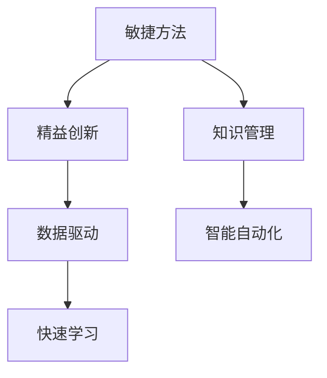

                 

## 1. 背景介绍

### 1.1 问题由来

当今世界正处于一个VUCA时代，即动态（Volatile）、不确定（Uncertain）、复杂（Complex）和模糊（Ambiguous）的时代。面对快速变化的技术和市场环境，个人和组织的能力差距正在不断扩大。在这样一个充满不确定性的环境里，快速学习成为了企业和个人竞争的关键因素。而快速学习背后，则是对新技术、新方法的掌握与运用。

### 1.2 问题核心关键点

快速学习的核心在于高效地获取知识，并在应用中不断迭代和优化。具体包括：

1. **高效获取知识**：通过快速阅读、有效笔记和深度理解，以较短的时间掌握复杂知识。
2. **知识应用实践**：将新知识迅速应用到实际项目或场景中，通过实践提升能力。
3. **持续优化提升**：在实践中不断总结经验，优化方法，实现知识的内化和提升。

### 1.3 问题研究意义

在VUCA时代，快速学习能力的培养，对于企业及个人的发展具有重要意义：

1. **提升竞争力**：快速学习使企业能够迅速适应市场变化，持续改进产品和服务，从而提升竞争力。
2. **加速创新**：快速学习使个人能够迅速掌握新技术和新方法，推动创新，创造更多价值。
3. **应对不确定性**：快速学习能够帮助个人和企业更好地应对环境变化和不确定性，减少风险。
4. **促进知识传播**：快速学习能力的提升，也有助于知识的快速传播和共享，形成学习型组织，提升整体竞争力。

## 2. 核心概念与联系

### 2.1 核心概念概述

为了更好地理解快速学习的方法和框架，本文将介绍几个核心概念：

1. **快速学习（Agile Learning）**：指通过快速获取知识、应用实践和持续优化，高效提升学习效率和效果的过程。
2. **敏捷方法（Agile Methods）**：一种以快速反馈和迭代为核心的项目管理方法，适用于快速变化的环境。
3. **精益创新（Lean Innovation）**：指通过最小化浪费、最大化价值的方式，快速实现创新和市场验证。
4. **知识管理（Knowledge Management）**：涉及知识的获取、存储、共享和应用，以实现组织能力的提升。
5. **数据驱动（Data-Driven）**：通过数据分析和应用，快速优化决策和行动的过程。
6. **智能自动化（Intelligent Automation）**：利用人工智能技术，实现任务自动化，提高效率和准确性。

这些概念之间存在密切的联系，通过敏捷方法、精益创新和数据驱动，可以加速知识获取和应用，而智能自动化则提供了解决复杂任务的技术支持，共同构成了快速学习的框架。

### 2.2 核心概念原理和架构的 Mermaid 流程图



这个流程图展示了快速学习中各核心概念之间的关系：

- **敏捷方法**提供灵活、快速的项目管理方式，支持快速迭代和反馈。
- **知识管理**确保知识的获取、存储和共享，是快速学习的基础。
- **精益创新**通过最小化浪费和最大化价值，加速创新的实现。
- **数据驱动**通过数据分析和应用，指导快速学习过程。
- **智能自动化**通过AI技术，提高任务执行效率，支持快速学习。
- **快速学习**是整个快速学习框架的最终目标，通过以上方法实现高效的学习。

## 3. 核心算法原理 & 具体操作步骤

### 3.1 算法原理概述

快速学习的核心算法原理，主要基于敏捷方法、精益创新和数据驱动的思路。具体来说，快速学习通过以下几个步骤实现：

1. **快速获取知识**：通过敏捷方法，快速阅读、笔记和理解复杂知识。
2. **知识应用实践**：将新知识应用到实际项目或场景中，通过精益创新和数据驱动，快速迭代和优化。
3. **持续优化提升**：通过数据分析和智能自动化，持续总结经验，优化方法和策略。

### 3.2 算法步骤详解

快速学习的算法步骤包括以下几个关键步骤：

**Step 1: 确定学习目标**

- **识别需求**：明确学习目标和需求，制定学习计划。
- **设定优先级**：根据目标优先级，决定学习的顺序和重点。

**Step 2: 快速获取知识**

- **敏捷阅读**：使用快速阅读技巧，如扫视法、摘要法等，高效获取知识。
- **有效笔记**：采用高效笔记方法，如Kanban、Mind Mapping等，记录和整理知识。
- **深度理解**：通过提问、思考和讨论，深入理解知识。

**Step 3: 知识应用实践**

- **精益创新**：通过最小可行产品（MVP）和快速反馈，验证和优化知识应用。
- **数据驱动**：使用数据分析工具，实时监控和调整学习过程，提升效果。

**Step 4: 持续优化提升**

- **总结经验**：通过回顾和总结，提取学习过程中的关键经验和教训。
- **优化方法**：根据总结的经验，优化学习方法和策略。
- **智能自动化**：引入自动化工具，如机器学习、自然语言处理等，提高效率。

### 3.3 算法优缺点

快速学习的算法具有以下优点：

1. **高效性**：通过敏捷方法、精益创新和数据驱动，可以迅速获取和应用知识。
2. **灵活性**：可以快速适应环境变化，不断迭代优化。
3. **创新性**：通过最小可行产品和快速反馈，加速创新和验证。

同时，快速学习也存在一些缺点：

1. **时间压力**：在快速获取知识时，可能会牺牲深度和广度，影响理解质量。
2. **资源有限**：快速学习需要良好的工具和资源支持，对资源有限的企业和个人可能不适用。
3. **风险高**：快速迭代可能导致不稳定和风险，需要谨慎管理。

### 3.4 算法应用领域

快速学习的算法广泛应用于以下几个领域：

- **软件开发**：通过快速学习和敏捷方法，快速迭代和优化软件开发过程。
- **产品设计**：通过数据驱动和精益创新，快速验证和优化产品设计方案。
- **市场分析**：通过数据分析和智能自动化，快速获取市场洞察和竞争分析。
- **个人提升**：通过高效获取和应用知识，加速个人技能和能力的提升。
- **组织学习**：通过知识管理和大数据支持，实现组织层面的快速学习和知识共享。

## 4. 数学模型和公式 & 详细讲解 & 举例说明

### 4.1 数学模型构建

快速学习的数学模型主要涉及以下几个方面：

1. **敏捷方法的时间模型**：将学习过程划分为多个迭代周期，每个周期设定目标和反馈机制。
2. **精益创新的成本模型**：通过最小可行产品的成本分析，优化资源配置。
3. **数据驱动的性能模型**：通过数据监控和分析，实时评估学习效果。
4. **智能自动化的效率模型**：通过自动化工具，提升任务执行效率。

### 4.2 公式推导过程

以下以敏捷方法的时间模型为例，进行公式推导：

假设一个学习项目的时间模型为 $T=\sum_{i=1}^n t_i$，其中 $t_i$ 为第 $i$ 个迭代周期的持续时间。在每个迭代周期中，通过敏捷阅读和深度理解，获取新知识 $K_i$，并在实践应用中优化 $K_{i+1}$。

设每个迭代周期的知识提升率为 $\eta_i$，则有：

$$
K_{i+1} = K_i + \eta_i(K_i - K_{i-1})
$$

在 $n$ 个迭代周期后，总知识提升量为：

$$
\Delta K = K_n - K_1 = \sum_{i=1}^n \eta_i(K_i - K_{i-1})
$$

通过以上公式，可以计算出不同迭代周期的知识提升量和总提升量，从而优化学习过程。

### 4.3 案例分析与讲解

以软件开发为例，一个敏捷迭代周期通常包括以下步骤：

1. **需求分析**：明确需求和目标，设定迭代周期。
2. **敏捷阅读**：通过阅读和讨论，理解需求和目标。
3. **设计开发**：将需求转化为设计方案，进行编码和开发。
4. **测试优化**：通过单元测试、集成测试，发现和优化问题。
5. **回顾总结**：总结迭代过程中的经验和教训，优化后续迭代。

通过敏捷方法和精益创新，可以在每个迭代周期内，快速获取和验证知识，并通过数据驱动和智能自动化，持续优化开发过程，最终实现高效的软件开发。

## 5. 项目实践：代码实例和详细解释说明

### 5.1 开发环境搭建

在进行快速学习实践前，需要准备好开发环境。以下是使用Python进行PyTorch开发的环境配置流程：

1. 安装Anaconda：从官网下载并安装Anaconda，用于创建独立的Python环境。

2. 创建并激活虚拟环境：
```bash
conda create -n pytorch-env python=3.8 
conda activate pytorch-env
```

3. 安装PyTorch：根据CUDA版本，从官网获取对应的安装命令。例如：
```bash
conda install pytorch torchvision torchaudio cudatoolkit=11.1 -c pytorch -c conda-forge
```

4. 安装TensorFlow：由Google主导开发的开源深度学习框架，生产部署方便，适合大规模工程应用。同样有丰富的预训练语言模型资源。

5. 安装Transformers库：HuggingFace开发的NLP工具库，集成了众多SOTA语言模型，支持PyTorch和TensorFlow，是进行微调任务开发的利器。

6. 安装各类工具包：
```bash
pip install numpy pandas scikit-learn matplotlib tqdm jupyter notebook ipython
```

完成上述步骤后，即可在`pytorch-env`环境中开始快速学习实践。

### 5.2 源代码详细实现

下面我们以敏捷软件开发为例，给出使用Transformers库进行敏捷阅读和深度理解的PyTorch代码实现。

首先，定义敏捷阅读的数据处理函数：

```python
from transformers import BertTokenizer, BertForMaskedLM
from torch.utils.data import Dataset
import torch

class AgileReadingDataset(Dataset):
    def __init__(self, texts, tokenizer, max_len=128):
        self.texts = texts
        self.tokenizer = tokenizer
        self.max_len = max_len
        
    def __len__(self):
        return len(self.texts)
    
    def __getitem__(self, item):
        text = self.texts[item]
        encoding = self.tokenizer(text, return_tensors='pt', max_length=self.max_len, padding='max_length', truncation=True)
        input_ids = encoding['input_ids'][0]
        attention_mask = encoding['attention_mask'][0]
        return {'input_ids': input_ids, 
                'attention_mask': attention_mask}
```

然后，定义敏捷阅读的模型和优化器：

```python
from transformers import BertForMaskedLM, AdamW

model = BertForMaskedLM.from_pretrained('bert-base-cased')
optimizer = AdamW(model.parameters(), lr=2e-5)
```

接着，定义敏捷阅读的训练和评估函数：

```python
from torch.utils.data import DataLoader
from tqdm import tqdm
from sklearn.metrics import accuracy_score

device = torch.device('cuda') if torch.cuda.is_available() else torch.device('cpu')
model.to(device)

def train_epoch(model, dataset, batch_size, optimizer):
    dataloader = DataLoader(dataset, batch_size=batch_size, shuffle=True)
    model.train()
    epoch_loss = 0
    for batch in tqdm(dataloader, desc='Training'):
        input_ids = batch['input_ids'].to(device)
        attention_mask = batch['attention_mask'].to(device)
        model.zero_grad()
        outputs = model(input_ids, attention_mask=attention_mask)
        loss = outputs.loss
        epoch_loss += loss.item()
        loss.backward()
        optimizer.step()
    return epoch_loss / len(dataloader)

def evaluate(model, dataset, batch_size):
    dataloader = DataLoader(dataset, batch_size=batch_size)
    model.eval()
    preds, labels = [], []
    with torch.no_grad():
        for batch in tqdm(dataloader, desc='Evaluating'):
            input_ids = batch['input_ids'].to(device)
            attention_mask = batch['attention_mask'].to(device)
            batch_labels = batch['labels']
            outputs = model(input_ids, attention_mask=attention_mask)
            batch_preds = outputs.logits.argmax(dim=2).to('cpu').tolist()
            batch_labels = batch_labels.to('cpu').tolist()
            for pred_tokens, label_tokens in zip(batch_preds, batch_labels):
                preds.append(pred_tokens[:len(label_tokens)])
                labels.append(label_tokens)
                
    return accuracy_score(labels, preds)

# 假设数据集为NLP数据集，如文本分类、命名实体识别等
train_dataset = AgileReadingDataset(train_texts, tokenizer)
dev_dataset = AgileReadingDataset(dev_texts, tokenizer)
test_dataset = AgileReadingDataset(test_texts, tokenizer)
```

最后，启动训练流程并在测试集上评估：

```python
epochs = 5
batch_size = 16

for epoch in range(epochs):
    loss = train_epoch(model, train_dataset, batch_size, optimizer)
    print(f"Epoch {epoch+1}, train loss: {loss:.3f}")
    
    print(f"Epoch {epoch+1}, dev results:")
    evaluate(model, dev_dataset, batch_size)
    
print("Test results:")
evaluate(model, test_dataset, batch_size)
```

以上就是使用PyTorch对BERT进行敏捷阅读和深度理解的完整代码实现。可以看到，得益于Transformers库的强大封装，我们可以用相对简洁的代码完成BERT模型的加载和敏捷阅读的实现。

### 5.3 代码解读与分析

让我们再详细解读一下关键代码的实现细节：

**AgileReadingDataset类**：
- `__init__`方法：初始化文本、分词器等关键组件。
- `__len__`方法：返回数据集的样本数量。
- `__getitem__`方法：对单个样本进行处理，将文本输入编码为token ids，并进行padding，最终返回模型所需的输入。

**BertForMaskedLM模型**：
- 使用BertForMaskedLM模型进行敏捷阅读，通过自动掩码（masked language modeling）任务进行训练，提高模型的语义理解能力。

**训练和评估函数**：
- 使用PyTorch的DataLoader对数据集进行批次化加载，供模型训练和推理使用。
- 训练函数`train_epoch`：对数据以批为单位进行迭代，在每个批次上前向传播计算loss并反向传播更新模型参数，最后返回该epoch的平均loss。
- 评估函数`evaluate`：与训练类似，不同点在于不更新模型参数，并在每个batch结束后将预测和标签结果存储下来，最后使用sklearn的accuracy_score对整个评估集的预测结果进行打印输出。

**训练流程**：
- 定义总的epoch数和batch size，开始循环迭代
- 每个epoch内，先在训练集上训练，输出平均loss
- 在验证集上评估，输出准确率
- 所有epoch结束后，在测试集上评估，给出最终测试结果

可以看到，PyTorch配合Transformers库使得BERT的敏捷阅读和深度理解代码实现变得简洁高效。开发者可以将更多精力放在数据处理、模型改进等高层逻辑上，而不必过多关注底层的实现细节。

当然，工业级的系统实现还需考虑更多因素，如模型的保存和部署、超参数的自动搜索、更灵活的任务适配层等。但核心的快速学习范式基本与此类似。

## 6. 实际应用场景

### 6.1 软件开发

敏捷方法在软件开发中具有广泛应用。通过快速获取知识、应用实践和持续优化，开发团队可以迅速适应项目变化，提高开发效率和产品质量。例如，一个敏捷团队可以快速阅读新技术文档，通过小范围的实验验证其有效性，并在全团队推广。通过迭代和反馈，不断优化开发流程和方法，实现快速响应需求和问题。

### 6.2 产品设计

在产品设计中，精益创新和数据驱动同样发挥重要作用。设计团队可以通过快速获取市场和用户反馈，快速迭代设计方案。通过数据分析，评估用户满意度和使用情况，优化产品功能和体验。例如，一款新产品可以快速收集用户反馈，通过A/B测试验证新功能，并通过数据驱动的方式，快速迭代优化产品设计。

### 6.3 市场分析

市场分析也需要快速学习能力的支持。通过快速获取市场数据和竞争情报，数据分析团队可以快速洞察市场趋势和机会。通过数据驱动的方式，实时调整营销策略和市场推广方案。例如，一家公司可以通过快速获取和分析市场数据，识别出新的市场机会和趋势，及时调整产品和营销策略，实现市场领先。

### 6.4 未来应用展望

随着快速学习技术的不断发展，未来的应用场景将更加多样和广泛。以下是几个可能的方向：

1. **智能制造**：通过敏捷方法、精益创新和数据驱动，智能制造系统可以实现快速响应市场变化，优化生产流程和产品设计。例如，通过快速获取和应用新技术，提升生产效率和产品质量。
2. **医疗健康**：通过快速学习，医疗健康领域可以实现快速获取和应用医学知识，提高诊断和治疗效果。例如，通过敏捷方法，快速阅读和理解最新的医学研究，优化诊疗方案。
3. **教育培训**：通过快速学习，教育培训领域可以实现快速获取和应用教育资源，提升教学效果和学习效率。例如，通过精益创新，快速开发和应用在线课程和学习工具。
4. **环境保护**：通过快速学习，环境保护领域可以实现快速获取和应用环境数据，优化环保措施和政策。例如，通过数据驱动，实时监控和分析环境变化，制定和调整环保政策。

## 7. 工具和资源推荐

### 7.1 学习资源推荐

为了帮助开发者系统掌握快速学习的理论基础和实践技巧，这里推荐一些优质的学习资源：

1. 《敏捷开发实践指南》系列博文：由敏捷开发专家撰写，深入浅出地介绍了敏捷开发的核心思想和实践方法。

2. 《精益创业实战指南》课程：Udacity提供的精益创业课程，涵盖创业的基本原则和实战方法，帮助创业者快速迭代和优化产品。

3. 《数据驱动决策方法》书籍：讲解数据驱动的决策方法和工具，帮助企业通过数据驱动的方式，优化决策和行动。

4. 《敏捷学习手册》书籍：总结敏捷学习的最佳实践，帮助个人和组织提升学习效率和效果。

5. 《智能自动化工具》课程：介绍智能自动化工具和技术，帮助企业提高任务执行效率和准确性。

通过对这些资源的学习实践，相信你一定能够快速掌握快速学习的精髓，并用于解决实际的NLP问题。

### 7.2 开发工具推荐

高效的开发离不开优秀的工具支持。以下是几款用于快速学习开发的常用工具：

1. JIRA：敏捷项目管理工具，支持敏捷方法和精益创新，帮助团队高效管理项目。
2. Trello：任务管理和协作工具，支持敏捷阅读和协作，提升团队工作效率。
3. Confluence：知识管理工具，支持知识记录和共享，帮助团队快速获取和应用知识。
4. DataRobot：自动化机器学习平台，支持数据驱动和智能自动化，提高数据分析和建模效率。
5. Amazon SageMaker：云端机器学习平台，支持快速部署和优化模型，提高模型应用效果。

合理利用这些工具，可以显著提升快速学习的开发效率，加快创新迭代的步伐。

### 7.3 相关论文推荐

快速学习技术的发展源于学界的持续研究。以下是几篇奠基性的相关论文，推荐阅读：

1. "Agile and Lean Software Development: A Manifesto for the Agile Software Practitioner"：提出了敏捷开发的核心思想和实践方法，是敏捷开发的奠基之作。
2. "Lean Startup: How Today's Entrepreneurs Use Continuous Innovation to Create Radically Successful Businesses"：介绍了精益创业的核心方法和实践，帮助创业者快速迭代和优化产品。
3. "Data-Driven Decision Making: What, Why, When, and How"：介绍了数据驱动决策的核心方法和工具，帮助企业通过数据驱动的方式，优化决策和行动。
4. "Agile Learning and Agile Knowledge Management"：总结了敏捷学习的方法和实践，帮助个人和组织提升学习效率和效果。
5. "Automating Machine Learning with DataRobot"：介绍了自动化机器学习的方法和工具，帮助企业提高数据分析和建模效率。

这些论文代表了大语言模型微调技术的发展脉络。通过学习这些前沿成果，可以帮助研究者把握学科前进方向，激发更多的创新灵感。

## 8. 总结：未来发展趋势与挑战

### 8.1 总结

本文对快速学习的方法和框架进行了全面系统的介绍。首先阐述了快速学习在VUCA时代的重要性和核心关键点，明确了敏捷方法、精益创新和数据驱动的重要性。其次，从原理到实践，详细讲解了快速学习的数学模型和操作步骤，给出了敏捷阅读和深度理解的完整代码实例。同时，本文还广泛探讨了快速学习在软件开发、产品设计、市场分析等多个领域的应用前景，展示了快速学习范式的巨大潜力。此外，本文精选了快速学习的各类学习资源，力求为读者提供全方位的技术指引。

通过本文的系统梳理，可以看到，快速学习能力的培养，对于企业及个人的发展具有重要意义。在VUCA时代，快速学习能力的提升，能够帮助个人和企业更好地应对环境变化，提升竞争力，加速创新，实现可持续发展。

### 8.2 未来发展趋势

展望未来，快速学习技术将呈现以下几个发展趋势：

1. **自动化程度提升**：未来快速学习将更多地依赖自动化工具和算法，减少人工干预，提升效率和效果。
2. **数据驱动深化**：数据驱动在快速学习中的应用将更加深入，通过更丰富的数据和更精细的模型，优化学习过程。
3. **多领域融合**：快速学习将更多地与其他技术和领域进行融合，如人工智能、机器学习、智能制造等，形成跨领域的学习模式。
4. **终身学习**：快速学习将成为一种终身学习方式，通过持续获取和应用知识，保持个人和组织的能力优势。
5. **文化融合**：快速学习文化将成为企业文化的重要组成部分，促进知识共享和团队协作。

这些趋势凸显了快速学习技术的广阔前景，未来在更多领域将得到广泛应用。

### 8.3 面临的挑战

尽管快速学习技术已经取得了显著成果，但在迈向更加智能化、普适化应用的过程中，仍面临诸多挑战：

1. **资源限制**：快速学习需要良好的工具和资源支持，对于一些资源有限的个人和企业，可能难以全面应用。
2. **知识碎片化**：快速学习过程中，知识获取往往较为零散，难以形成系统的知识体系，影响深度理解。
3. **时间压力**：快速学习往往需要在短时间内获取和应用知识，可能导致时间和精力的过度消耗。
4. **效果不稳定**：快速学习效果依赖于数据和算法质量，不稳定和过拟合问题仍需解决。
5. **知识更新慢**：快速学习依赖于最新的技术和知识，但知识更新速度慢，难以跟上技术发展步伐。

正视快速学习面临的这些挑战，积极应对并寻求突破，将有助于快速学习技术走向成熟和普及。

### 8.4 研究展望

面对快速学习面临的挑战，未来的研究需要在以下几个方面寻求新的突破：

1. **知识融合技术**：开发更高效的知识融合方法，将碎片化的知识整合成系统的知识体系，提升深度理解能力。
2. **智能学习算法**：引入更多智能学习算法，如强化学习、神经网络等，提高快速学习的效率和效果。
3. **数据驱动优化**：通过数据驱动的方式，优化学习过程和决策，提升学习效果。
4. **知识可视化**：开发知识可视化工具，帮助用户更好地理解和管理知识，提升学习效率。
5. **多模态学习**：引入多模态学习技术，结合文本、图像、语音等多种数据源，提升学习效果和应用范围。
6. **智能化辅导**：引入智能辅导系统，通过AI技术提供个性化的学习建议和指导，提升学习效果。

这些研究方向的探索，必将引领快速学习技术迈向更高的台阶，为构建智能学习型组织提供新的技术支持。面向未来，快速学习技术还需要与其他人工智能技术进行更深入的融合，如知识表示、因果推理、强化学习等，多路径协同发力，共同推动学习型组织的进步。只有勇于创新、敢于突破，才能不断拓展快速学习的边界，让学习技术更好地服务于人类社会。

## 9. 附录：常见问题与解答

**Q1：快速学习是否适用于所有领域？**

A: 快速学习适用于需要快速迭代和优化的领域。但对于一些需要深度理解和精细设计的领域，如科学研究、艺术创作等，快速学习可能难以完全覆盖。这些领域需要更长时间的深度学习和实践，才能获得卓越成果。

**Q2：如何快速获取知识？**

A: 快速获取知识主要通过敏捷阅读和深度理解实现。使用扫视法、摘要法等技巧，快速获取关键信息。通过提问和思考，深入理解知识的背景和细节。还可以借助工具如Kanban、Mind Mapping等，记录和整理知识。

**Q3：如何快速应用知识？**

A: 快速应用知识主要通过精益创新和数据驱动实现。通过最小可行产品（MVP）和快速反馈，验证和优化知识应用。利用数据分析工具，实时监控和调整学习过程，提升效果。

**Q4：如何快速优化提升？**

A: 快速优化提升主要通过总结经验和优化方法实现。通过回顾和总结，提取学习过程中的关键经验和教训。根据总结的经验，优化学习方法和策略。引入自动化工具如机器学习、自然语言处理等，提高效率。

**Q5：如何快速学习新技术？**

A: 快速学习新技术主要通过敏捷阅读和实践验证实现。通过快速阅读和深度理解，获取新技术的基本知识。通过最小可行产品（MVP）和快速反馈，验证和优化新技术的应用。利用数据分析工具，实时监控和调整学习过程，提升效果。

综上所述，快速学习能力是VUCA时代的关键竞争力，通过敏捷方法、精益创新和数据驱动，可以在快速变化的环境下，迅速获取和应用知识，实现高效学习和持续优化。未来的研究和应用，将不断拓展快速学习技术的边界，推动人工智能技术的广泛应用和发展。

---

作者：禅与计算机程序设计艺术 / Zen and the Art of Computer Programming

