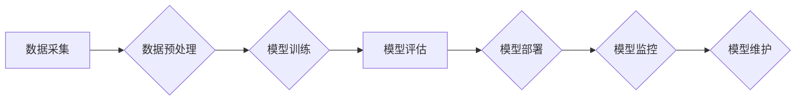

                 

## 从实验室到生产环境：Lepton AI的AI落地之路

> 关键词：人工智能落地、机器学习、深度学习、模型部署、生产环境、可扩展性、效率优化、监控与维护

## 1. 背景介绍

人工智能（AI）技术近年来取得了飞速发展，从实验室的理论研究逐渐走向现实世界的应用。然而，将AI模型从实验室成功部署到生产环境，并使其能够稳定、高效地运行，仍然是一个巨大的挑战。Lepton AI 作为一家致力于AI落地解决方案的科技公司，深知这一挑战，并通过多年的实践积累，形成了独特的AI落地之路。本文将详细介绍Lepton AI 的AI落地经验，分享其核心概念、算法原理、项目实践以及未来展望，希望能为其他企业和开发者提供借鉴和启发。

## 2. 核心概念与联系

Lepton AI 的AI落地之路的核心概念是“端到端解决方案”。从数据采集、预处理、模型训练、部署到监控与维护，Lepton AI 提供了一套完整的解决方案，确保AI模型的整个生命周期都能得到有效管理和优化。

**2.1 AI落地流程图**

**2.2 核心概念解析**

* **数据采集:** 这是AI模型训练的基础，Lepton AI 帮助客户收集、清洗和整合来自各种来源的数据，确保数据质量和丰富度。
* **数据预处理:**  数据预处理是将原始数据转化为模型可理解的格式，Lepton AI 提供多种数据预处理技术，例如数据清洗、特征工程、数据归一化等。
* **模型训练:**  Lepton AI 拥有丰富的机器学习和深度学习算法库，可以根据客户需求选择合适的算法进行模型训练，并提供模型调优和性能评估服务。
* **模型部署:**  Lepton AI 支持多种模型部署方式，包括云端部署、边缘部署和混合部署，可以根据客户的业务场景和需求选择最合适的部署方案。
* **模型监控:**  Lepton AI 提供模型监控平台，可以实时监控模型的性能指标，并及时发现模型漂移或异常情况。
* **模型维护:**  Lepton AI 提供模型维护服务，包括模型更新、模型复训和模型优化等，确保模型能够长期稳定运行。

## 3. 核心算法原理 & 具体操作步骤

Lepton AI 在AI落地过程中，广泛应用了多种机器学习和深度学习算法，例如：

* **线性回归:** 用于预测连续数值型变量。
* **逻辑回归:** 用于分类问题，预测离散型变量。
* **决策树:** 用于分类和回归问题，通过树状结构进行决策。
* **支持向量机:** 用于分类和回归问题，通过寻找最佳分割超平面进行分类。
* **神经网络:** 用于复杂模式识别和预测，例如图像识别、自然语言处理等。

**3.1 算法原理概述**

Lepton AI 的核心算法原理是基于数据驱动和模型学习。通过训练模型，让其从海量数据中学习规律，并能够对新的数据进行预测或分类。

**3.2 算法步骤详解**

Lepton AI 的AI落地流程通常包括以下步骤：

1. **数据收集和预处理:** 收集相关数据，并进行清洗、转换、特征工程等预处理操作。
2. **模型选择:** 根据业务需求和数据特点，选择合适的机器学习或深度学习算法。
3. **模型训练:** 使用训练数据训练模型，并通过交叉验证等方法评估模型性能。
4. **模型调优:** 通过调整模型参数，优化模型性能。
5. **模型部署:** 将训练好的模型部署到生产环境中，使其能够对实时数据进行预测或分类。
6. **模型监控和维护:**  持续监控模型性能，并根据需要进行模型更新、复训和优化。

**3.3 算法优缺点**

不同的算法具有不同的优缺点，Lepton AI 会根据具体情况选择最合适的算法。例如，线性回归算法简单易懂，但对于复杂的数据关系难以建模；神经网络算法能够学习复杂模式，但训练时间长，参数量大。

**3.4 算法应用领域**

Lepton AI 的AI算法应用于多个领域，例如：

* **金融领域:** 欺诈检测、风险评估、信用评分等。
* **医疗领域:** 疾病诊断、药物研发、医疗影像分析等。
* **制造业:** 质量控制、设备故障预测、生产优化等。
* **零售业:** 商品推荐、客户画像、库存预测等。

## 4. 数学模型和公式 & 详细讲解 & 举例说明

**4.1 数学模型构建**

Lepton AI 的AI模型通常基于数学模型构建，例如线性回归模型的数学表达式为：

$$y = w_0 + w_1x_1 + w_2x_2 + ... + w_nx_n$$

其中：

* $y$ 是预测值
* $w_0, w_1, w_2, ..., w_n$ 是模型参数
* $x_1, x_2, ..., x_n$ 是输入特征

**4.2 公式推导过程**

Lepton AI 的工程师会根据具体算法和业务需求，推导相应的数学公式，并利用数学工具进行模型优化和性能评估。例如，在训练神经网络模型时，会使用梯度下降算法来更新模型参数，使其能够最小化预测误差。

**4.3 案例分析与讲解**

以图像识别为例，Lepton AI 使用卷积神经网络（CNN）模型进行图像分类。CNN 模型通过多个卷积层和池化层来提取图像特征，并最终通过全连接层进行分类。

## 5. 项目实践：代码实例和详细解释说明

**5.1 开发环境搭建**

Lepton AI 支持多种开发环境，例如Python、TensorFlow、PyTorch等。

**5.2 源代码详细实现**

Lepton AI 的工程师会根据具体项目需求，编写相应的源代码，并进行代码测试和优化。

**5.3 代码解读与分析**

Lepton AI 会提供详细的代码注释和文档，帮助开发者理解代码逻辑和功能。

**5.4 运行结果展示**

Lepton AI 会展示模型的训练结果和预测结果，并进行性能评估和分析。

## 6. 实际应用场景

Lepton AI 的AI解决方案已应用于多个实际场景，例如：

* **智能客服:** 利用自然语言处理技术，为客户提供智能化的客服服务。
* **精准营销:**  根据客户画像和行为数据，进行精准的营销推广。
* **自动驾驶:** 利用计算机视觉和深度学习技术，实现自动驾驶功能。

**6.4 未来应用展望**

Lepton AI 将继续探索AI技术的应用场景，并开发更智能、更便捷的AI解决方案。

## 7. 工具和资源推荐

**7.1 学习资源推荐**

* **在线课程:** Coursera、edX、Udacity等平台提供丰富的AI课程。
* **书籍:** 《深度学习》、《机器学习实战》等书籍是AI学习的经典教材。
* **开源项目:** TensorFlow、PyTorch等开源项目提供了丰富的AI工具和代码示例。

**7.2 开发工具推荐**

* **Python:**  Python 是AI开发的常用语言，拥有丰富的AI库和工具。
* **Jupyter Notebook:** Jupyter Notebook 是交互式编程环境，方便进行AI模型开发和测试。
* **云平台:** AWS、Azure、GCP等云平台提供丰富的AI服务和工具。

**7.3 相关论文推荐**

* **《ImageNet Classification with Deep Convolutional Neural Networks》**
* **《Attention Is All You Need》**
* **《BERT: Pre-training of Deep Bidirectional Transformers for Language Understanding》**

## 8. 总结：未来发展趋势与挑战

**8.1 研究成果总结**

Lepton AI 在AI落地领域取得了显著成果，积累了丰富的经验和技术沉淀。

**8.2 未来发展趋势**

* **模型自动化:**  利用自动化技术，简化模型训练和部署流程。
* **边缘计算:** 将AI模型部署到边缘设备，实现更低延迟和更高效率的AI应用。
* **联邦学习:**  在不共享原始数据的情况下，实现模型训练和更新，保护数据隐私。

**8.3 面临的挑战**

* **数据质量:**  AI模型的性能依赖于数据质量，如何获取高质量的数据仍然是一个挑战。
* **模型解释性:**  许多AI模型是黑盒模型，难以解释其决策过程，这限制了AI技术的应用场景。
* **伦理问题:**  AI技术的应用可能带来伦理问题，例如算法偏见、数据隐私等，需要引起重视和解决。

**8.4 研究展望**

Lepton AI 将继续致力于AI技术的研发和应用，并积极探索AI技术的未来发展方向。

## 9. 附录：常见问题与解答

Lepton AI 将提供常见问题解答，帮助客户解决AI落地过程中遇到的问题。

作者：禅与计算机程序设计艺术 / Zen and the Art of Computer Programming 
<end_of_turn>

