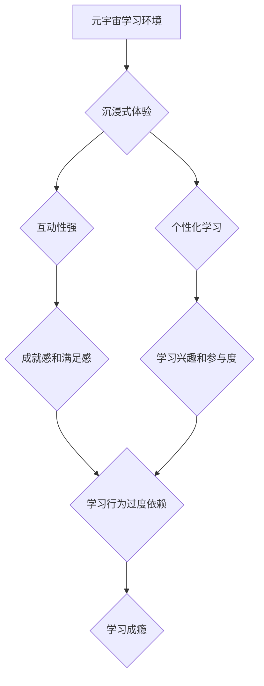

                 

## 元宇宙学习成瘾:数字教育时代的新型心理问题

> 关键词：元宇宙、学习成瘾、数字教育、心理健康、虚拟现实、增强现实、游戏化学习、认知偏差、社会影响

## 1. 背景介绍

元宇宙概念的兴起，为教育领域带来了前所未有的机遇和挑战。虚拟现实 (VR) 和增强现实 (AR) 技术的快速发展，使得沉浸式学习体验成为现实，元宇宙学习平台也应运而生。这些平台利用游戏化元素、社交互动和个性化学习路径，吸引着越来越多的学生参与。然而，元宇宙学习的沉浸性和互动性也可能带来新的心理问题，其中学习成瘾最为突出。

学习成瘾是指对学习行为过度依赖，难以控制，并对个人生活、社交关系和心理健康造成负面影响。传统学习环境中，学习成瘾的风险相对较低，因为学习行为通常受到时间、空间和社会规范的限制。而元宇宙学习环境则打破了这些限制，学生可以随时随地沉浸在虚拟世界中学习，更容易陷入过度学习的陷阱。

## 2. 核心概念与联系

### 2.1 元宇宙学习

元宇宙学习是指利用元宇宙技术构建的虚拟学习环境，其特点包括：

* **沉浸式体验:** VR/AR 技术提供沉浸式的学习体验，使学生能够身临其境地参与学习活动。
* **互动性强:** 元宇宙学习平台支持多种互动形式，例如角色扮演、协作项目和虚拟实验，增强学生的学习兴趣和参与度。
* **个性化学习:** 元宇宙学习平台可以根据学生的学习进度、兴趣和能力提供个性化的学习路径和内容，提高学习效率。
* **社交互动:** 元宇宙学习平台提供虚拟社交空间，学生可以与其他学生和老师互动交流，促进学习和社交发展。

### 2.2 学习成瘾

学习成瘾是一种心理健康问题，其特征包括：

* **过度追求学习:** 即使在感到疲劳或压力的情况下，也难以控制学习行为。
* **对学习的依赖:** 学习行为成为生活中最重要的活动，无法正常进行其他活动。
* **对学习的焦虑:** 担心无法完成学习任务，或担心学习成绩下降。
* **对学习的逃避:** 当学习任务过于困难时，会选择逃避或拖延。

### 2.3 元宇宙学习与学习成瘾的联系

元宇宙学习环境的沉浸式体验、互动性强和个性化学习等特点，可能增加学生学习成瘾的风险。

* **沉浸式体验:** 元宇宙学习平台提供沉浸式的学习体验，学生更容易被虚拟世界吸引，难以从学习中抽离。
* **互动性强:** 元宇宙学习平台支持多种互动形式，学生更容易获得成就感和满足感，从而加剧学习成瘾。
* **个性化学习:** 元宇宙学习平台可以根据学生的学习进度和兴趣提供个性化的学习路径，学生更容易沉浸在学习中，难以控制学习时间。

**元宇宙学习与学习成瘾的联系流程图:**



## 3. 核心算法原理 & 具体操作步骤

### 3.1 算法原理概述

学习成瘾的识别和预防需要结合多种算法和技术，例如：

* **机器学习算法:** 可以分析学生的学习行为数据，识别学习成瘾的潜在风险因素。
* **自然语言处理算法:** 可以分析学生的文本数据，例如学习日志、聊天记录等，识别学习成瘾相关的语言特征。
* **行为分析算法:** 可以分析学生的学习行为模式，识别学习成瘾的典型行为特征。

### 3.2 算法步骤详解

**以机器学习算法为例，识别学习成瘾的具体步骤如下:**

1. **数据收集:** 收集学生的学习行为数据，例如学习时间、学习内容、学习进度、学习成绩等。
2. **数据预处理:** 对收集到的数据进行清洗、转换和特征提取，以便于机器学习算法的训练和使用。
3. **模型训练:** 使用机器学习算法对预处理后的数据进行训练，建立学习成瘾预测模型。
4. **模型评估:** 使用测试数据对训练好的模型进行评估，评估模型的准确性和有效性。
5. **模型部署:** 将训练好的模型部署到元宇宙学习平台，实时监测学生的学习行为，识别学习成瘾的风险。

### 3.3 算法优缺点

**机器学习算法识别学习成瘾的优点:**

* **准确性高:** 机器学习算法可以识别学习成瘾的复杂模式，提高识别准确率。
* **自动化程度高:** 机器学习算法可以自动识别学习成瘾的风险，无需人工干预。
* **可扩展性强:** 机器学习算法可以处理海量数据，适用于大规模的元宇宙学习平台。

**机器学习算法识别学习成瘾的缺点:**

* **数据依赖性强:** 机器学习算法需要大量的数据进行训练，否则识别准确率会降低。
* **解释性弱:** 机器学习算法的决策过程难以解释，难以理解模型是如何识别学习成瘾的。
* **伦理风险:** 机器学习算法可能会存在偏见和歧视，需要谨慎使用。

### 3.4 算法应用领域

学习成瘾识别和预防算法可以应用于以下领域:

* **元宇宙学习平台:** 识别学生学习成瘾的风险，提供个性化的干预措施。
* **教育管理系统:** 帮助教育管理者了解学生的学习行为，制定有效的学习策略。
* **心理健康服务:** 为学生提供学习成瘾的评估和治疗服务。

## 4. 数学模型和公式 & 详细讲解 & 举例说明

### 4.1 数学模型构建

学习成瘾的数学模型可以基于行为经济学和心理学理论，构建一个描述学习行为和成瘾风险的模型。例如，可以构建一个基于马尔可夫链的模型，描述学生在元宇宙学习环境中不同状态之间的转换，以及每个状态的持续时间和概率。

### 4.2 公式推导过程

假设学生在元宇宙学习环境中存在以下状态:

* **学习状态:** 学生专注于学习，沉浸在虚拟世界中。
* **休息状态:** 学生离开虚拟世界，进行休息或其他活动。
* **成瘾状态:** 学生对学习行为过度依赖，难以控制，对生活其他方面造成负面影响。

可以构建一个马尔可夫链模型，描述学生在不同状态之间的转换概率:

* $P(学习状态 \rightarrow 学习状态)$: 学生在学习状态下继续学习的概率。
* $P(学习状态 \rightarrow 休息状态)$: 学生在学习状态下休息的概率。
* $P(学习状态 \rightarrow 成瘾状态)$: 学生在学习状态下发展成瘾的概率。
* $P(休息状态 \rightarrow 学习状态)$: 学生在休息状态下返回学习的概率。
* $P(休息状态 \rightarrow 休息状态)$: 学生在休息状态下继续休息的概率。
* $P(休息状态 \rightarrow 成瘾状态)$: 学生在休息状态下发展成瘾的概率。
* $P(成瘾状态 \rightarrow 学习状态)$: 学生在成瘾状态下继续学习的概率。
* $P(成瘾状态 \rightarrow 休息状态)$: 学生在成瘾状态下休息的概率。
* $P(成瘾状态 \rightarrow 成瘾状态)$: 学生在成瘾状态下继续成瘾的概率。

### 4.3 案例分析与讲解

通过收集学生的学习行为数据，可以估计每个状态之间的转换概率。例如，如果学生在学习状态下持续学习的时间较长，则 $P(学习状态 \rightarrow 学习状态)$ 的值会较高。如果学生在学习状态下休息的频率较高，则 $P(学习状态 \rightarrow 休息状态)$ 的值会较高。

通过分析这些概率，可以判断学生是否处于学习成瘾的风险状态。如果学生在学习状态下持续时间过长，且 $P(学习状态 \rightarrow 成瘾状态)$ 的值较高，则表明学生可能处于学习成瘾的风险状态。

## 5. 项目实践：代码实例和详细解释说明

### 5.1 开发环境搭建

* **操作系统:** Windows/macOS/Linux
* **编程语言:** Python
* **机器学习库:** scikit-learn
* **数据处理库:** pandas
* **可视化库:** matplotlib

### 5.2 源代码详细实现

```python
import pandas as pd
from sklearn.model_selection import train_test_split
from sklearn.linear_model import LogisticRegression
from sklearn.metrics import accuracy_score

# 加载学习行为数据
data = pd.read_csv('learning_behavior_data.csv')

# 选择特征变量和目标变量
features = ['学习时间', '学习次数', '学习成绩', '休息时间']
target = '学习成瘾'

# 将数据划分为训练集和测试集
X_train, X_test, y_train, y_test = train_test_split(data[features], data[target], test_size=0.2)

# 创建逻辑回归模型
model = LogisticRegression()

# 训练模型
model.fit(X_train, y_train)

# 预测测试集结果
y_pred = model.predict(X_test)

# 计算模型准确率
accuracy = accuracy_score(y_test, y_pred)
print('模型准确率:', accuracy)
```

### 5.3 代码解读与分析

这段代码实现了学习成瘾预测模型的训练和评估。

1. **数据加载:** 使用 pandas 库加载学习行为数据。
2. **特征选择:** 选择与学习成瘾相关的特征变量，例如学习时间、学习次数、学习成绩和休息时间。
3. **数据分割:** 使用 train_test_split 函数将数据划分为训练集和测试集。
4. **模型创建:** 使用 LogisticRegression 类创建逻辑回归模型。
5. **模型训练:** 使用 fit 函数训练模型，将训练数据用于模型参数的学习。
6. **模型预测:** 使用 predict 函数对测试数据进行预测，得到学习成瘾的预测结果。
7. **模型评估:** 使用 accuracy_score 函数计算模型的准确率，评估模型的性能。

### 5.4 运行结果展示

运行这段代码后，会输出模型的准确率。如果模型的准确率较高，则表明模型能够有效识别学习成瘾的风险。

## 6. 实际应用场景

### 6.1 元宇宙学习平台

元宇宙学习平台可以利用学习成瘾识别算法，为学生提供个性化的干预措施。例如，如果平台检测到学生处于学习成瘾的风险状态，可以提醒学生休息，或者提供一些放松和减压的活动。

### 6.2 教育管理系统

教育管理系统可以利用学习成瘾识别算法，帮助教育管理者了解学生的学习行为，制定有效的学习策略。例如，如果管理者发现一些学生处于学习成瘾的风险状态，可以针对这些学生提供额外的支持和帮助。

### 6.3 心理健康服务

心理健康服务机构可以利用学习成瘾识别算法，为学生提供学习成瘾的评估和治疗服务。例如，心理咨询师可以使用算法分析学生的学习行为数据，识别学习成瘾的症状，并制定相应的治疗方案。

### 6.4 未来应用展望

随着元宇宙技术的不断发展，学习成瘾识别和预防算法将发挥越来越重要的作用。未来，这些算法可以应用于更广泛的领域，例如：

* **游戏设计:** 识别游戏成瘾的风险，为玩家提供健康的游戏体验。
* **社交媒体平台:** 识别社交媒体成瘾的风险，帮助用户控制社交媒体的使用时间。
* **健康管理:** 识别健康行为成瘾的风险，帮助用户养成健康的生活习惯。

## 7. 工具和资源推荐

### 7.1 学习资源推荐

* **元宇宙学习平台:** 
    * Mozilla Hubs
    * Spatial
    * Engage
* **学习成瘾研究文献:**
    * "The Psychology of Learning and Motivation" by Robert M. Gagné
    * "Addiction: A Very Short Introduction" by Michael A. Bloomfield
* **机器学习教程:**
    * scikit-learn 官方文档: https://scikit-learn.org/stable/documentation.html
    * Andrew Ng 的机器学习课程: https://www.coursera.org/learn/machine-learning

### 7.2 开发工具推荐

* **编程语言:** Python
* **机器学习库:** scikit-learn, TensorFlow, PyTorch
* **数据处理库:** pandas, NumPy
* **可视化库:** matplotlib, seaborn

### 7.3 相关论文推荐

* "The Impact of Virtual Reality on Learning and Motivation" by Slater, M. (2016)
* "Learning Addiction: A Review of the Literature" by Griffiths, M. D. (2005)
* "Machine Learning for Predicting Learning Outcomes" by Romero, C., & Ventura, S. (2010)

## 8. 总结：未来发展趋势与挑战

### 8.1 研究成果总结

元宇宙学习环境为教育领域带来了新的机遇和挑战，学习成瘾识别和预防算法是应对元宇宙学习环境中新兴心理问题的关键技术。

### 8.2 未来发展趋势

未来，学习成瘾识别和预防算法将朝着以下方向发展:

* **更精准的识别:** 利用更先进的机器学习算法和数据分析技术，提高学习成瘾的识别准确率。
* **更个性化的干预:** 根据学生的个体差异，提供个性化的干预措施，帮助学生克服学习成瘾。
* **更全面的预防:** 从元宇宙学习平台的设计和开发阶段，就考虑学习成瘾的预防问题，设计更健康和安全的学习环境。

### 8.3 面临的挑战

学习成瘾识别和预防算法也面临着一些挑战:

* **数据隐私:** 学习行为数据包含学生的个人信息，需要妥善保护学生的隐私安全。
* **算法偏见:** 机器学习算法可能会存在偏见和歧视，需要不断改进算法模型，避免算法带来的不公平现象。
* **伦理问题:** 学习成瘾识别和预防算法的应用需要考虑伦理问题，例如算法的透明度、可解释性和责任归属。

### 8.4 研究展望

未来，需要加强学习成瘾识别和预防算法的研究，探索更有效的识别和干预方法，为元宇宙学习环境提供更健康和安全的学习体验。

## 9. 附录：常见问题与解答

### 9.1 如何识别学习成瘾的风险?

学习成瘾的风险可以通过以下方式识别:

* **过度追求学习:** 即使感到疲劳或压力，也难以控制学习行为。
* **对学习的依赖:** 学习行为成为生活中最重要的活动，无法正常进行其他活动。
* **对学习的焦虑:** 担心无法完成学习任务，或担心学习成绩下降。
* **对学习的逃避:** 当学习任务过于困难时，会选择逃避或拖延。

### 9.2 如何预防学习成瘾?

预防学习成瘾可以通过以下方式实现:

* **合理安排学习时间:** 制定合理的学习计划，避免过度学习。
* **保持充足的休息:** 确保充足的睡眠和休息时间，避免学习疲劳。
* **发展其他兴趣爱好:** 培养其他兴趣爱好，避免过度依赖学习。
* **寻求帮助:** 如果发现自己或身边的人存在学习成瘾的风险，及时寻求专业人士的帮助。

### 9.3 元宇宙学习环境对学习成瘾有什么影响?

元宇宙学习环境的沉浸式体验、互动性强和个性化学习等特点，可能增加学生学习成瘾的风险。

### 9.4 如何应对元宇宙学习环境中的学习成瘾问题?

应对元宇宙学习环境中的学习成瘾问题，需要多方共同努力:

* **元宇宙学习平台:** 设计更健康和安全的学习环境，提供学习成瘾的预防措施。
* **教育管理者:** 了解学生学习行为，及时发现学习成瘾的风险，提供必要的帮助。
* **家长:** 关注孩子的学习情况，帮助孩子合理安排学习时间，培养孩子的其他兴趣爱好。
* **学生:** 了解学习成瘾的风险，合理安排学习时间，保持充足的休息，发展其他兴趣爱好。


作者：禅与计算机程序设计艺术 / Zen and the Art of Computer Programming<end_of_turn>

