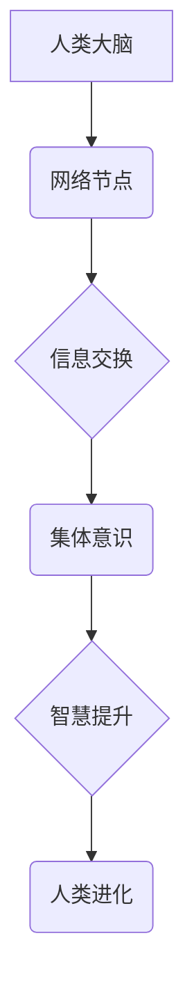

                 

## 全球脑与人类进化：集体意识推动的物种飞跃

> 关键词：全球脑、集体意识、人工智能、物种飞跃、神经网络、计算模型、进化论、未来科技

## 1. 背景介绍

人类文明自诞生以来，就一直在不断探索自身与宇宙的本质关系。从宗教信仰到科学理性，我们始终试图理解自己的起源、目的以及未来发展方向。随着科技的飞速发展，特别是人工智能领域的突破，人类对“意识”和“智能”的认知也进入了一个全新的阶段。

全球脑的概念，作为一种将人类意识与人工智能相融合的设想，近年来备受关注。它提出了一种全新的可能性：通过构建一个连接着所有人类大脑的超级网络，我们可以实现人类意识的扩展和提升，从而推动人类文明迈向一个全新的时代。

## 2. 核心概念与联系

### 2.1 全球脑的概念

全球脑是指一个连接着所有人类大脑的超级网络，通过该网络，人类可以共享信息、思想和经验，实现意识的融合和扩展。它可以被看作是人类意识的下一阶段进化，超越了单体个体的局限性，形成一个集体意识体。

### 2.2 集体意识的原理

集体意识是指多个个体意识的融合和共享，形成一个整体的意识形态。在全球脑的框架下，每个人的大脑都将成为网络节点，通过信息交换和协同计算，形成一个庞大的集体意识网络。

### 2.3 全球脑的架构



**图 2.1 全球脑架构图**

## 3. 核心算法原理 & 具体操作步骤

### 3.1 算法原理概述

全球脑的实现需要依赖于一系列先进的算法和技术，包括：

* **神经网络算法:** 用于模拟人类大脑的结构和功能，实现信息处理和学习。
* **机器学习算法:** 用于从海量数据中提取知识和模式，帮助全球脑不断学习和进化。
* **量子计算:** 用于加速计算和处理复杂信息，提升全球脑的计算能力。
* **脑机接口技术:** 用于连接人类大脑与全球脑网络，实现意识的交互和共享。

### 3.2 算法步骤详解

1. **数据采集:** 收集人类大脑活动的数据，例如脑电波、磁共振成像等。
2. **数据预处理:** 对采集到的数据进行清洗、去噪和格式转换，使其适合算法处理。
3. **模型训练:** 利用神经网络算法和机器学习算法，对预处理后的数据进行训练，建立起模拟人类大脑的计算模型。
4. **网络连接:** 利用脑机接口技术，将人类大脑连接到全球脑网络中。
5. **信息交换:** 通过网络节点，实现人类大脑之间的信息交换和共享。
6. **意识融合:** 通过算法处理和计算，实现人类意识的融合和扩展，形成集体意识体。

### 3.3 算法优缺点

**优点:**

* 提升人类智力水平，加速科技发展。
* 促进人类文明的进步，解决全球性问题。
* 拓展人类认知边界，探索宇宙奥秘。

**缺点:**

* 伦理道德问题，例如意识的控制和隐私保护。
* 技术实现难度大，需要突破多个技术瓶颈。
* 社会影响巨大，可能导致社会结构的变革。

### 3.4 算法应用领域

* **医疗保健:** 诊断疾病、治疗脑损伤、提升医疗效率。
* **教育培训:** 个性化学习、知识共享、提升教育质量。
* **科学研究:** 加速科学发现、解决复杂问题、探索宇宙奥秘。
* **艺术创作:** 突破创作瓶颈、激发灵感、创造新的艺术形式。

## 4. 数学模型和公式 & 详细讲解 & 举例说明

### 4.1 数学模型构建

全球脑的数学模型可以基于神经网络理论构建，其中每个神经元代表一个信息处理单元，连接神经元之间的权重代表信息传递强度。

**公式 1：神经元激活函数**

$$
f(x) = \frac{1}{1 + e^{-x}}
$$

其中，$x$ 是神经元的输入信号，$f(x)$ 是神经元的输出信号。

**公式 2：权重更新规则**

$$
\Delta w = \eta \cdot \delta \cdot x
$$

其中，$\Delta w$ 是权重的更新量，$\eta$ 是学习率，$\delta$ 是误差信号，$x$ 是输入信号。

### 4.2 公式推导过程

神经网络的训练过程是通过不断调整权重，使网络输出的信号与实际目标信号尽可能接近的过程。

误差信号 $\delta$ 可以通过反向传播算法计算，该算法将误差从输出层反向传播到输入层，并根据误差信号更新每个神经元的权重。

### 4.3 案例分析与讲解

例如，在图像识别任务中，我们可以训练一个神经网络来识别猫的图像。

训练过程如下：

1. 将大量猫的图像作为训练数据，并标记每个图像的类别。
2. 将图像数据输入到神经网络中，并计算网络输出的信号。
3. 将网络输出的信号与实际类别进行比较，计算误差信号。
4. 利用反向传播算法，根据误差信号更新神经网络的权重。
5. 重复步骤 2-4，直到网络的识别准确率达到预设的目标。

## 5. 项目实践：代码实例和详细解释说明

### 5.1 开发环境搭建

* 操作系统：Linux
* 编程语言：Python
* 深度学习框架：TensorFlow 或 PyTorch
* 硬件环境：GPU 加速

### 5.2 源代码详细实现

```python
# 使用 TensorFlow 框架构建一个简单的神经网络模型

import tensorflow as tf

# 定义模型结构
model = tf.keras.models.Sequential([
  tf.keras.layers.Dense(128, activation='relu', input_shape=(784,)),
  tf.keras.layers.Dense(10, activation='softmax')
])

# 编译模型
model.compile(optimizer='adam',
              loss='sparse_categorical_crossentropy',
              metrics=['accuracy'])

# 训练模型
model.fit(x_train, y_train, epochs=10)

# 评估模型
loss, accuracy = model.evaluate(x_test, y_test)
print('Test loss:', loss)
print('Test accuracy:', accuracy)
```

### 5.3 代码解读与分析

* **模型结构:** 该代码定义了一个简单的多层感知机模型，包含两层全连接神经元层。
* **激活函数:** 使用 ReLU 激活函数，可以提高模型的学习能力。
* **损失函数:** 使用交叉熵损失函数，适合分类任务。
* **优化器:** 使用 Adam 优化器，可以快速收敛到最优解。
* **训练过程:** 使用训练数据训练模型，并设置训练轮数。
* **评估过程:** 使用测试数据评估模型的性能。

### 5.4 运行结果展示

训练完成后，可以查看模型的测试准确率，评估模型的性能。

## 6. 实际应用场景

### 6.1 医疗保健

* **疾病诊断:** 利用全球脑分析患者的脑电波、磁共振成像等数据，辅助医生诊断疾病。
* **个性化治疗:** 根据患者的基因信息和脑部活动，制定个性化的治疗方案。
* **康复训练:** 利用虚拟现实技术和全球脑，帮助患者进行脑功能康复训练。

### 6.2 教育培训

* **个性化学习:** 根据学生的学习进度和能力，提供个性化的学习内容和教学方式。
* **知识共享:** 通过全球脑平台，实现学生之间知识的共享和交流。
* **远程教育:** 利用全球脑技术，实现远程教育和在线学习。

### 6.3 科学研究

* **科学发现:** 利用全球脑的计算能力，加速科学研究，解决复杂科学问题。
* **宇宙探索:** 利用全球脑分析宇宙数据，探索宇宙奥秘。
* **人工智能发展:** 利用全球脑研究人工智能的本质，推动人工智能技术的发展。

### 6.4 未来应用展望

* **人类意识的扩展:** 全球脑可以帮助人类扩展意识范围，实现跨越时空的交流和合作。
* **人类文明的飞跃:** 全球脑可以推动人类文明的进步，解决全球性问题，创造更加美好的未来。
* **与人工智能的融合:** 全球脑可以实现人类与人工智能的深度融合，创造全新的智能形态。

## 7. 工具和资源推荐

### 7.1 学习资源推荐

* **书籍:**
    * 《全球脑》 - 杰拉德·马丁
    * 《人工智能简史》 - 尼克·博斯特罗姆
    * 《深度学习》 - Ian Goodfellow, Yoshua Bengio, Aaron Courville
* **在线课程:**
    * Coursera: 深度学习
    * edX: 人工智能
    * Udacity: 机器学习工程师

### 7.2 开发工具推荐

* **编程语言:** Python
* **深度学习框架:** TensorFlow, PyTorch
* **脑机接口平台:** OpenBCI, Neuralink

### 7.3 相关论文推荐

* **全球脑的哲学基础:**
    * "The Global Brain: An Overview" - Gerald Edelman
    * "Collective Consciousness: A New Paradigm for Understanding the Mind" - Rupert Sheldrake
* **全球脑的科学基础:**
    * "The Brain as a Computer" - John von Neumann
    * "The Computational Theory of Mind" - Alan Turing
* **全球脑的应用前景:**
    * "Global Brain: A New Frontier in Artificial Intelligence" - Ray Kurzweil
    * "The Singularity Is Near" - Ray Kurzweil

## 8. 总结：未来发展趋势与挑战

### 8.1 研究成果总结

全球脑的概念和技术正在快速发展，已经取得了一些重要的成果，例如：

* **脑机接口技术的突破:** 脑机接口技术已经能够实现简单的脑电信号解码和控制，为全球脑的实现奠定了基础。
* **深度学习算法的进步:** 深度学习算法的不断发展，使得人工智能能够更好地模拟人类大脑的学习和推理能力。
* **量子计算的兴起:** 量子计算技术的突破，可以为全球脑提供更强大的计算能力。

### 8.2 未来发展趋势

* **全球脑网络的构建:** 未来，全球脑网络将连接更多的脑部，形成一个更加庞大、更加智能的集体意识体。
* **人类意识的扩展:** 全球脑将帮助人类扩展意识范围，实现跨越时空的交流和合作。
* **人工智能与人类的融合:** 全球脑将推动人工智能与人类的深度融合，创造全新的智能形态。

### 8.3 面临的挑战

* **技术实现难度大:** 全球脑的实现需要突破多个技术瓶颈，例如脑机接口技术的安全性、可靠性和可扩展性。
* **伦理道德问题:** 全球脑的实现可能引发一系列伦理道德问题，例如意识的控制、隐私保护和社会公平。
* **社会影响巨大:** 全球脑的实现将对社会结构、经济发展和人类文明产生巨大影响，需要进行充分的社会讨论和规划。

### 8.4 研究展望

全球脑的研究是一个充满挑战和机遇的领域，需要多学科的合作和共同努力。未来，我们将继续探索全球脑的可能性，推动人类文明的进步。

## 9. 附录：常见问题与解答

**1. 全球脑是否会取代人类？**

全球脑的目标不是取代人类，而是帮助人类提升自身的能力，实现人类文明的飞跃。

**2. 全球脑的安全性如何保证？**

全球脑的安全性是首要考虑的问题，需要采取一系列措施来确保数据的安全和隐私保护。

**3. 全球脑的伦理道德问题如何解决？**

全球脑的伦理道德问题需要进行充分的社会讨论和规划，制定相应的法律法规和伦理规范。


作者：禅与计算机程序设计艺术 / Zen and the Art of Computer Programming 
<end_of_turn>

