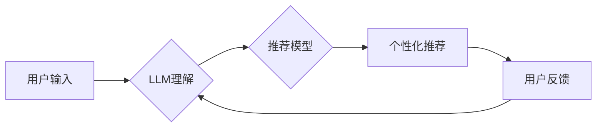

                 

## 利用LLM提升推荐系统的时效性推荐能力

> 关键词：LLM,推荐系统,时效性,个性化推荐,自然语言处理,机器学习,深度学习

## 1. 背景介绍

推荐系统是互联网时代的重要组成部分，它通过分析用户行为和偏好，为用户提供个性化的商品、内容或服务建议。传统的推荐系统主要依赖于协同过滤、内容过滤和基于知识的推荐算法，这些算法通常需要大量历史数据进行训练，并且难以捕捉用户动态变化的兴趣和需求。

随着大规模语言模型（LLM）的快速发展，LLM展现出强大的文本理解和生成能力，为推荐系统的时效性推荐能力带来了新的机遇。LLM可以理解用户自然语言表达，捕捉用户隐含的意图和需求，并根据上下文生成个性化的推荐内容。

## 2. 核心概念与联系

### 2.1  推荐系统

推荐系统旨在根据用户的历史行为、偏好和上下文信息，预测用户对特定物品的兴趣，并提供个性化的推荐。

### 2.2  大规模语言模型（LLM）

LLM是一种基于深度学习的强大人工智能模型，能够理解和生成人类语言。它通过训练海量文本数据，学习语言的语法、语义和上下文关系，从而具备强大的文本理解、生成、翻译、问答等能力。

### 2.3  时效性推荐

时效性推荐是指能够及时响应用户动态变化的兴趣和需求，提供最新、最相关的推荐内容。

**LLM与推荐系统的融合**

LLM可以帮助推荐系统提升时效性推荐能力，主要通过以下方式：

* **理解用户意图:** LLM可以理解用户自然语言表达，例如用户评论、搜索词、聊天记录等，从而捕捉用户隐含的兴趣和需求。
* **生成个性化推荐:** LLM可以根据用户兴趣和上下文信息，生成个性化的推荐内容，例如推荐商品描述、新闻标题、视频摘要等。
* **实时更新推荐:** LLM可以实时学习用户行为和趋势变化，动态更新推荐模型，提供更准确、更时效的推荐。

**架构图**



## 3. 核心算法原理 & 具体操作步骤

### 3.1  算法原理概述

LLM可以用于推荐系统中的多个环节，例如用户画像构建、推荐内容生成、推荐排序等。

* **用户画像构建:** LLM可以分析用户的文本数据，例如用户评论、社交媒体帖子等，构建用户的兴趣、偏好、价值观等多维度的画像。
* **推荐内容生成:** LLM可以根据用户的兴趣和上下文信息，生成个性化的推荐内容，例如推荐商品描述、新闻标题、视频摘要等。
* **推荐排序:** LLM可以学习用户对不同推荐内容的偏好，并根据用户的历史行为和上下文信息，对推荐内容进行排序，提供更精准的推荐结果。

### 3.2  算法步骤详解

以LLM辅助的推荐内容生成为例，具体步骤如下：

1. **用户输入:** 用户提出推荐请求，例如“推荐一些最近上映的科幻电影”。
2. **LLM理解:** LLM分析用户的输入文本，识别用户的意图，例如用户想看科幻电影，并了解用户的上下文信息，例如用户的年龄、性别、观看历史等。
3. **内容检索:** 根据用户的意图和上下文信息，从数据库中检索相关电影信息，例如电影标题、海报、剧情简介等。
4. **内容生成:** LLM根据检索到的电影信息，生成个性化的推荐内容，例如“推荐一部最近上映的科幻电影《星际穿越》，讲述了人类为了寻找新的家园，乘坐飞船穿越星际的故事”。
5. **推荐展示:** 推荐系统将生成的推荐内容展示给用户。

### 3.3  算法优缺点

**优点:**

* **个性化推荐:** LLM可以理解用户的自然语言表达，生成更个性化的推荐内容。
* **时效性提升:** LLM可以实时学习用户行为和趋势变化，动态更新推荐模型，提供更时效的推荐。
* **内容丰富:** LLM可以生成多种类型的推荐内容，例如文本、图片、视频等。

**缺点:**

* **数据依赖:** LLM需要大量文本数据进行训练，数据质量和数量直接影响推荐效果。
* **计算资源:** LLM训练和推理需要大量的计算资源，部署成本较高。
* **解释性:** LLM的决策过程较为复杂，难以解释推荐结果背后的逻辑。

### 3.4  算法应用领域

LLM辅助的推荐系统可以应用于各种领域，例如：

* **电商推荐:** 推荐商品、优惠券、促销活动等。
* **内容推荐:** 推荐新闻、视频、音乐、书籍等。
* **社交推荐:** 推荐好友、群组、活动等。
* **教育推荐:** 推荐课程、学习资源、辅导老师等。

## 4. 数学模型和公式 & 详细讲解 & 举例说明

### 4.1  数学模型构建

LLM推荐系统通常基于深度学习模型，例如Transformer模型。Transformer模型通过自注意力机制学习文本序列之间的关系，并利用多层编码器-解码器结构生成推荐内容。

### 4.2  公式推导过程

Transformer模型的核心是自注意力机制，其计算公式如下：

$$
Attention(Q, K, V) = \frac{exp(Q \cdot K^T / \sqrt{d_k})}{exp(Q \cdot K^T / \sqrt{d_k})} \cdot V
$$

其中：

* $Q$：查询矩阵
* $K$：键矩阵
* $V$：值矩阵
* $d_k$：键向量的维度

自注意力机制可以计算每个词与其他词之间的相关性，并根据相关性权重生成上下文信息。

### 4.3  案例分析与讲解

假设用户输入“推荐一部最近上映的科幻电影”，LLM会将这句话转换为词向量，并通过自注意力机制计算每个词与其他词之间的相关性。例如，“科幻”和“电影”之间的相关性较高，LLM会根据这个关系，从数据库中检索相关科幻电影信息，并生成个性化的推荐内容。

## 5. 项目实践：代码实例和详细解释说明

### 5.1  开发环境搭建

推荐系统开发环境通常包括以下组件：

* **编程语言:** Python
* **深度学习框架:** TensorFlow、PyTorch
* **数据库:** MySQL、MongoDB
* **云平台:** AWS、Azure、GCP

### 5.2  源代码详细实现

以下是一个使用LLM辅助推荐系统的简单代码示例，使用Python和Transformers库：

```python
from transformers import AutoModelForSeq2SeqLM, AutoTokenizer

# 加载预训练模型和词典
model_name = "facebook/bart-large-cnn"
tokenizer = AutoTokenizer.from_pretrained(model_name)
model = AutoModelForSeq2SeqLM.from_pretrained(model_name)

# 用户输入
user_input = "推荐一部最近上映的科幻电影"

# Token化用户输入
input_ids = tokenizer.encode(user_input, return_tensors="pt")

# 生成推荐内容
output = model.generate(input_ids)

# 解码推荐内容
recommendation = tokenizer.decode(output[0], skip_special_tokens=True)

# 打印推荐内容
print(recommendation)
```

### 5.3  代码解读与分析

* 代码首先加载预训练的LLM模型和词典。
* 然后，将用户的输入文本进行Token化，转换为模型可以理解的格式。
* 使用LLM模型生成推荐内容。
* 最后，将生成的推荐内容解码，转换为可读文本格式。

### 5.4  运行结果展示

运行上述代码，可能会得到以下推荐结果：

```
推荐一部最近上映的科幻电影《星际穿越》，讲述了人类为了寻找新的家园，乘坐飞船穿越星际的故事。
```

## 6. 实际应用场景

LLM辅助的推荐系统已经在多个领域得到实际应用，例如：

* **Netflix:** 使用LLM生成个性化的电影和电视剧推荐。
* **Amazon:** 使用LLM推荐商品、优惠券和促销活动。
* **Spotify:** 使用LLM推荐音乐和播客。

### 6.4  未来应用展望

未来，LLM辅助的推荐系统将更加智能化、个性化和时效性。例如：

* **多模态推荐:** 将文本、图像、视频等多种模态信息融合，提供更丰富的推荐内容。
* **实时交互推荐:** 基于用户的实时交互行为，动态更新推荐内容，提供更精准的推荐。
* **个性化解释:** 为推荐结果提供个性化的解释，帮助用户理解推荐背后的逻辑。

## 7. 工具和资源推荐

### 7.1  学习资源推荐

* **论文:**

    * Vaswani, A., Shazeer, N., Parmar, N., Uszkoreit, J., Jones, L., Gomez, A. N., ... & Polosukhin, I. (2017). Attention is all you need. In Advances in neural information processing systems (pp. 5998-6008).
    * Devlin, J., Chang, M. W., Lee, K., & Toutanova, K. (2018). Bert: Pre-training of deep bidirectional transformers for language understanding. arXiv preprint arXiv:1810.04805.

* **在线课程:**

    * deeplearning.ai: 自然语言处理课程
    * fast.ai: 深度学习课程

### 7.2  开发工具推荐

* **Transformers库:** https://huggingface.co/transformers/
* **TensorFlow:** https://www.tensorflow.org/
* **PyTorch:** https://pytorch.org/

### 7.3  相关论文推荐

* **LLM在推荐系统中的应用:**

    * https://arxiv.org/abs/2203.09174
    * https://arxiv.org/abs/2106.08979

## 8. 总结：未来发展趋势与挑战

### 8.1  研究成果总结

LLM辅助的推荐系统在提升推荐时效性和个性化方面取得了显著成果，为用户提供更精准、更相关的推荐内容。

### 8.2  未来发展趋势

未来，LLM辅助的推荐系统将朝着以下方向发展：

* **多模态融合:** 将文本、图像、视频等多种模态信息融合，提供更丰富的推荐内容。
* **实时交互:** 基于用户的实时交互行为，动态更新推荐内容，提供更精准的推荐。
* **个性化解释:** 为推荐结果提供个性化的解释，帮助用户理解推荐背后的逻辑。

### 8.3  面临的挑战

LLM辅助的推荐系统也面临一些挑战：

* **数据隐私:** LLM训练需要大量用户数据，如何保护用户隐私是一个重要问题。
* **模型可解释性:** LLM的决策过程较为复杂，难以解释推荐结果背后的逻辑，这可能会导致用户信任不足。
* **计算资源:** LLM训练和推理需要大量的计算资源，部署成本较高。

### 8.4  研究展望

未来，需要进一步研究LLM辅助推荐系统的算法、模型和应用，解决数据隐私、模型可解释性和计算资源等挑战，推动LLM辅助推荐系统的健康发展。

## 9. 附录：常见问题与解答

* **Q1: LLM辅助的推荐系统与传统推荐系统相比有什么优势？**

* **A1:** LLM辅助的推荐系统可以更好地理解用户的自然语言表达，生成更个性化的推荐内容，并根据用户的实时行为动态更新推荐模型，提升推荐的时效性。

* **Q2: 如何选择合适的LLM模型？**

* **A2:** 选择合适的LLM模型需要根据具体的应用场景和数据特点进行选择。例如，对于电影推荐，可以考虑使用预训练在电影评论数据上训练的LLM模型。

* **Q3: 如何解决LLM辅助推荐系统的计算资源问题？**

* **A3:** 可以采用模型压缩、模型并行等技术来降低LLM模型的计算资源需求。


作者：禅与计算机程序设计艺术 / Zen and the Art of Computer Programming 
<end_of_turn>

