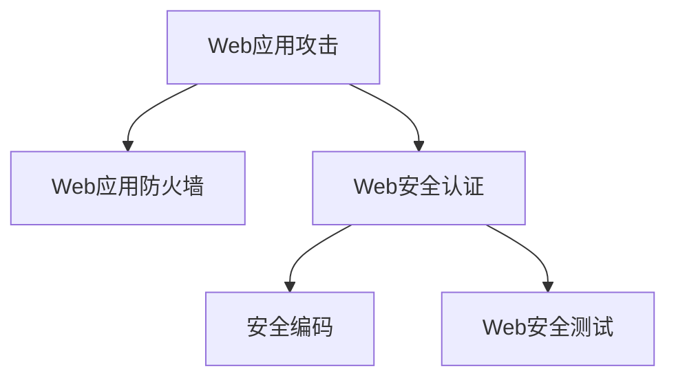

                 

# Web 安全策略：保护网站和应用程序

## 1. 背景介绍

随着互联网的普及和信息技术的不断发展，Web应用已经成为人们获取信息、进行交流、进行交易的重要平台。然而，Web应用的广泛使用也带来了前所未有的安全风险，如SQL注入、跨站脚本攻击(XSS)、跨站请求伪造(CSRF)、点击劫持、SSL/TLS证书劫持等。攻击者通过这些手段可以窃取用户数据、篡改用户行为、破坏网站正常运营，甚至实施勒索、诈骗等高级网络犯罪活动。因此，如何有效保护Web应用的安全，确保Web数据的安全性和完整性，已成为Web开发者面临的重要挑战。

## 2. 核心概念与联系

### 2.1 核心概念概述

为更好地理解Web安全策略，本节将介绍几个密切相关的核心概念：

- **Web应用攻击**：指通过Web应用系统存在的漏洞进行攻击的行为，包括SQL注入、XSS、CSRF等。
- **Web应用防火墙(WAF)**：一种防护Web应用的安全设备，能够检测、拦截和防御攻击行为，保护Web应用的正常运行。
- **Web安全认证**：指在Web应用中实施的身份验证和授权机制，确保只有合法用户才能访问和操作Web资源。
- **安全编码**：指在编写Web应用代码时，采取一系列预防措施，避免常见的安全漏洞。
- **Web安全测试**：指在Web应用上线前，通过模拟攻击行为，评估Web应用的安全性，发现和修复潜在漏洞。

这些核心概念之间的逻辑关系可以通过以下Mermaid流程图来展示：



这个流程图展示了几大核心概念之间的联系：

1. Web应用攻击是引发Web安全问题的主要原因。
2. Web应用防火墙（WAF）是阻止攻击的第一道防线。
3. Web安全认证确保只有合法用户才能访问系统。
4. 安全编码是避免漏洞的有效手段。
5. Web安全测试能够及时发现和修复漏洞。

这些概念共同构成了Web安全的核心框架，帮助Web开发者提升应用安全性。

## 3. 核心算法原理 & 具体操作步骤

### 3.1 算法原理概述

Web安全策略的核心思想是通过技术手段保护Web应用的安全，主要包括网络防护、身份验证、授权控制、安全编码和测试等。其核心算法原理可概括为以下几个方面：

- **网络防护**：使用Web应用防火墙（WAF）等技术，对Web流量进行过滤和控制，防止恶意流量进入系统。
- **身份验证**：使用OAuth、OpenID Connect等标准协议，实现用户身份的认证和验证。
- **授权控制**：基于角色的访问控制(RBAC)模型，控制用户对Web资源的访问权限。
- **安全编码**：采用安全编程语言和框架，避免常见漏洞如SQL注入、XSS等。
- **测试与修复**：利用自动化测试工具和安全扫描器，发现和修复Web应用中的漏洞。

### 3.2 算法步骤详解

Web安全策略的具体实施流程可以分为以下几个步骤：

1. **网络防护**：安装和配置Web应用防火墙（WAF），定义规则库，检测并拦截恶意流量。
2. **身份验证**：实现用户身份验证机制，如密码验证、多因素认证等，确保用户身份的真实性。
3. **授权控制**：根据用户身份和角色，分配访问权限，确保用户只能访问其权限范围内的资源。
4. **安全编码**：编写安全的代码，避免常见漏洞，如SQL注入、XSS、CSRF等。
5. **测试与修复**：定期进行安全测试，如黑盒测试、白盒测试、代码审计等，发现和修复漏洞。

### 3.3 算法优缺点

Web安全策略具有以下优点：

- **主动防御**：通过网络防护、身份验证、授权控制等技术手段，主动防范攻击行为，保护Web应用安全。
- **多层次防护**：结合多种防护措施，形成多层次的安全防护体系，提高Web应用的安全性。
- **可扩展性**：随着Web应用的发展和变化，安全策略可以灵活调整，适应新的安全需求。

同时，该方法也存在一定的局限性：

- **依赖技术**：Web安全策略的实施需要依赖多种技术手段，如WAF、安全编程语言、自动化测试工具等，技术复杂度较高。
- **资源消耗**：网络防护、身份验证等措施可能会带来一定的资源消耗，影响Web应用的性能。
- **管理复杂**：多层次的安全策略需要管理多个系统，增加了管理复杂度，需要专业的安全团队支持。
- **非侵入性**：Web安全策略主要依赖技术手段，无法从根本上改变Web应用的设计和架构，存在被绕过的风险。

### 3.4 算法应用领域

Web安全策略在多个领域得到了广泛应用，包括但不限于：

- **Web应用防护**：保护Web应用免受SQL注入、XSS、CSRF等攻击。
- **电子商务平台**：确保用户账户和交易数据的安全性，防止欺诈和盗用。
- **在线教育平台**：保护学生信息和教师授课内容的隐私性，防止数据泄露和篡改。
- **在线医疗平台**：保护患者病历和医生信息的安全，防止数据泄漏和恶意攻击。
- **金融服务平台**：保护用户账户和交易数据的安全，防止欺诈和诈骗。
- **政府服务网站**：确保政务信息的安全，防止数据泄漏和非法访问。

## 4. 数学模型和公式 & 详细讲解 & 举例说明

### 4.1 数学模型构建

Web安全策略的数学模型主要涉及以下几个方面：

- **网络防护模型**：使用统计模型或规则引擎，对Web流量进行分类和检测。
- **身份验证模型**：基于哈希算法、数字证书等技术，实现用户身份的认证和验证。
- **授权控制模型**：基于角色模型，计算用户对资源的访问权限。
- **安全编码模型**：使用静态分析、动态分析等技术，检测代码中的漏洞。
- **测试与修复模型**：基于漏洞检测结果，生成修复建议，进行代码审计。

### 4.2 公式推导过程

这里给出几个关键公式的推导过程：

1. **密码学中的哈希函数**：哈希函数将任意长度的消息转换为固定长度的摘要，确保不可逆且具有抗碰撞性。其数学表达式为：

   $$
   H = H(M)
   $$

   其中 $M$ 为原始消息，$H$ 为哈希值。

2. **数字证书的公钥加密**：数字证书中的公钥加密方法，确保数据的机密性和完整性。其数学表达式为：

   $$
   C = E(M, P) = M \oplus P
   $$

   其中 $C$ 为加密后的密文，$E$ 为加密算法，$M$ 为明文，$P$ 为公钥。

3. **基于角色的访问控制模型**：RBAC模型的数学表达式为：

   $$
   P = R \cap U
   $$

   其中 $P$ 为用户的访问权限，$R$ 为用户角色，$U$ 为用户身份。

### 4.3 案例分析与讲解

以OAuth 2.0协议为例，分析其身份验证机制。OAuth 2.0是一个基于Web的应用程序安全授权协议，允许用户通过第三方应用程序进行身份验证和授权。其核心流程包括：

1. **客户端注册**：客户端向认证服务器注册，获得客户端ID和密钥。
2. **用户授权**：用户通过浏览器访问授权服务器，选择同意或拒绝授权。
3. **生成授权码**：授权服务器生成授权码，并发送给客户端。
4. **换取访问令牌**：客户端使用授权码向认证服务器换取访问令牌。
5. **访问资源**：客户端使用访问令牌访问目标资源。

该协议通过标准化的授权流程，确保了用户身份的真实性和合法性。其核心算法包括数字签名、哈希算法、密钥管理等，有效保护了用户隐私和数据安全。

## 5. 项目实践：代码实例和详细解释说明

### 5.1 开发环境搭建

在进行Web安全策略的开发实践前，我们需要准备好开发环境。以下是使用Python和Flask框架搭建Web应用的流程：

1. **安装Python**：从官网下载并安装Python 3.x版本。
2. **安装Flask**：使用pip安装Flask框架。

```bash
pip install flask
```

3. **安装其他依赖库**：安装必要的依赖库，如SQLAlchemy、WTForms、Flask-Login等。

```bash
pip install sqlalchemy
pip install wtforms
pip install flask-login
```

4. **创建虚拟环境**：创建虚拟环境，确保项目的独立性。

```bash
python -m venv myenv
source myenv/bin/activate
```

完成上述步骤后，即可在虚拟环境中开始Web应用开发。

### 5.2 源代码详细实现

以下是一个简单的Web应用示例，用于演示基本的身份验证和授权控制：

```python
from flask import Flask, request, render_template, redirect, url_for, flash
from flask_login import LoginManager, UserMixin, login_user, login_required, logout_user

app = Flask(__name__)
app.config['SECRET_KEY'] = 'supersecretkey'

# 定义用户模型
class User(UserMixin):
    def __init__(self, user_id, username):
        self.id = user_id
        self.username = username

# 定义用户验证回调函数
@login_manager.user_loader
def load_user(user_id):
    return User(user_id, 'user' + str(user_id))

# 定义登录页面
@app.route('/login', methods=['GET', 'POST'])
def login():
    if request.method == 'POST':
        # 验证用户名和密码
        user_id = request.form.get('user_id')
        password = request.form.get('password')
        if user_id == '123' and password == '123':
            # 用户验证通过，记录用户会话
            user = User(user_id, 'user' + str(user_id))
            login_user(user)
            flash('登录成功！')
            return redirect(url_for('index'))
        else:
            flash('用户名或密码错误！')
    return render_template('login.html')

# 定义主页
@app.route('/')
@login_required
def index():
    return '欢迎来到首页！'

# 定义退出页面
@app.route('/logout')
@login_required
def logout():
    logout_user()
    flash('退出成功！')
    return redirect(url_for('login'))

if __name__ == '__main__':
    login_manager.init_app(app)
    app.run(debug=True)
```

在这个示例中，我们使用了Flask-Login插件，实现了基本的身份验证和授权控制。用户通过登录页面输入用户名和密码，验证通过后进入主页。在主页中，只有已登录的用户才能访问，未登录用户将被重定向到登录页面。退出操作也会记录到会话中，用户退出后重新登录需要重新验证。

### 5.3 代码解读与分析

让我们再详细解读一下关键代码的实现细节：

**app = Flask(__name__)**：创建Flask应用实例。

**app.config['SECRET_KEY'] = 'supersecretkey'**：设置应用密钥，用于会话加密。

**login_manager.init_app(app)**：初始化Flask-Login插件，绑定到应用实例。

**@login_manager.user_loader**：定义用户验证回调函数，用于从数据库中加载用户。

**app.route('/login', methods=['GET', 'POST'])**：定义登录页面的路由。

**request.form.get('user_id')**：从表单中获取用户ID。

**login_user(user)**：记录用户会话，使其能够访问受保护的页面。

**flash('登录成功！')**：展示登录成功的消息。

**redirect(url_for('index'))**：重定向到主页。

**@login_required**：装饰器，用于保护受保护的页面。

**app.run(debug=True)**：启动应用，设置调试模式。

这个示例展示了基本的Web身份验证机制，结合Flask-Login插件，能够实现登录、退出、授权等功能。在实际应用中，还需要根据具体需求进一步扩展和优化。

### 5.4 运行结果展示

运行示例代码，打开浏览器访问`http://localhost:5000/login`，可以看到登录页面。输入用户名和密码后，成功登录即可访问受保护的页面。如果用户名或密码错误，则会提示错误消息。

## 6. 实际应用场景

### 6.1 电子商务平台

电子商务平台是Web应用的典型代表，其安全问题包括用户账户盗用、订单篡改、支付欺诈等。基于Web安全策略，电子商务平台可以采取以下措施：

- **网络防护**：使用Web应用防火墙（WAF），防止SQL注入、XSS、CSRF等攻击。
- **身份验证**：实现多因素认证，确保用户身份的真实性和合法性。
- **授权控制**：控制用户对订单、支付等敏感操作的权限。
- **安全编码**：避免常见的Web安全漏洞，如SQL注入、XSS等。
- **测试与修复**：定期进行安全测试，发现和修复漏洞。

### 6.2 在线教育平台

在线教育平台涉及用户信息和授课内容的隐私保护，其安全问题包括数据泄露、篡改、非法访问等。基于Web安全策略，在线教育平台可以采取以下措施：

- **网络防护**：使用WAF，防止攻击行为。
- **身份验证**：确保教师和学生的身份真实性。
- **授权控制**：控制用户对课程、资料等资源的访问权限。
- **安全编码**：避免SQL注入、XSS等漏洞。
- **测试与修复**：定期进行安全测试，修复漏洞。

### 6.3 在线医疗平台

在线医疗平台涉及患者病历和医生信息的隐私保护，其安全问题包括数据泄露、篡改、非法访问等。基于Web安全策略，在线医疗平台可以采取以下措施：

- **网络防护**：使用WAF，防止攻击行为。
- **身份验证**：确保患者和医生的身份真实性。
- **授权控制**：控制用户对病历、处方等敏感数据的访问权限。
- **安全编码**：避免SQL注入、XSS等漏洞。
- **测试与修复**：定期进行安全测试，修复漏洞。

## 7. 工具和资源推荐

### 7.1 学习资源推荐

为了帮助开发者系统掌握Web安全策略的理论基础和实践技巧，这里推荐一些优质的学习资源：

1. **《Web安全攻防》系列书籍**：系统介绍了Web应用攻击与防御技术，涵盖SQL注入、XSS、CSRF等常见攻击及其防护方法。

2. **OWASP官方指南**：OWASP（开放式Web应用安全项目）提供了丰富的Web安全指南和工具，涵盖安全测试、漏洞分析、防护措施等。

3. **《Web安全入门与实战》课程**：由知名安全专家授课，从基础概念到实战案例，全面讲解Web安全技术。

4. **《Web安全进阶》课程**：深入介绍高级Web安全技术，如DDoS攻击防御、Web应用漏洞挖掘等。

5. **《Web安全实践指南》书籍**：结合实际案例，介绍Web应用的安全开发、测试和防护策略。

通过对这些资源的学习实践，相信你一定能够快速掌握Web安全策略的精髓，并用于解决实际的Web安全问题。

### 7.2 开发工具推荐

高效的开发离不开优秀的工具支持。以下是几款用于Web安全策略开发的常用工具：

1. **Burp Suite**：一款流行的Web应用安全测试工具，包含代理、扫描、破解等功能，支持多种攻击检测和防御措施。

2. **OWASP ZAP**：由OWASP开发的Web应用安全测试工具，支持自动扫描、手动漏洞检测、插件扩展等功能，适合初学者和专业人士使用。

3. **Nmap**：一款网络安全扫描工具，可以扫描目标网络、主机、端口、服务等信息，支持多种操作系统和网络环境。

4. **Wireshark**：一款网络协议分析工具，可以实时捕获和分析网络流量，帮助发现和定位网络问题。

5. **OWASP Dependency-Check**：用于检查Web应用依赖库中的已知漏洞，避免依赖库的安全问题。

6. **SQLMap**：一款SQL注入攻击工具，可以自动检测和利用SQL注入漏洞，支持多种数据库和应用环境。

合理利用这些工具，可以显著提升Web安全策略的开发效率，加快创新迭代的步伐。

### 7.3 相关论文推荐

Web安全策略的研究始于学界的持续探索。以下是几篇奠基性的相关论文，推荐阅读：

1. **《Web应用安全性分析与评估》论文**：探讨了Web应用的安全漏洞检测与修复技术，提出了基于规则和模型的安全分析方法。

2. **《Web安全框架设计》论文**：介绍了Web安全框架的设计原则和实现方法，涵盖身份验证、授权控制、安全编码等方面。

3. **《Web安全模型与方法》论文**：结合安全模型和安全协议，讨论了Web安全的多层次防护机制，提出了基于加密和数字签名的身份验证方法。

4. **《Web应用防火墙技术》论文**：介绍了WAF的工作原理和实现技术，提出了基于规则引擎和机器学习的入侵检测方法。

5. **《Web安全测试方法》论文**：分析了Web安全测试的目标和流程，讨论了黑盒测试、白盒测试、代码审计等方法。

这些论文代表了大规模Web安全策略的研究脉络。通过学习这些前沿成果，可以帮助研究者把握学科前进方向，激发更多的创新灵感。

## 8. 总结：未来发展趋势与挑战

### 8.1 总结

本文对基于Web安全策略的Web应用安全保护方法进行了全面系统的介绍。首先阐述了Web应用攻击的种类和危害，明确了Web安全策略在保护Web应用安全中的重要性。其次，从原理到实践，详细讲解了Web安全策略的数学模型和操作步骤，给出了Web安全策略的代码实例。同时，本文还广泛探讨了Web安全策略在电子商务平台、在线教育平台、在线医疗平台等多个行业领域的应用前景，展示了Web安全策略的广泛适用性。此外，本文精选了Web安全策略的学习资源和开发工具，力求为读者提供全方位的技术指引。

通过本文的系统梳理，可以看到，基于Web安全策略的Web应用安全保护方法，能够有效防范各种Web应用攻击，确保Web应用的安全性。未来，随着Web应用场景的多样化和复杂化，Web安全策略也将不断发展和完善，以应对新的安全挑战。

### 8.2 未来发展趋势

展望未来，Web安全策略将呈现以下几个发展趋势：

1. **人工智能在安全防护中的应用**：利用人工智能技术，如机器学习和深度学习，提高Web安全检测和防御的准确性和效率。

2. **无密码身份验证**：结合生物识别、行为分析等技术，实现无密码的身份验证方式，提高安全性。

3. **区块链技术的应用**：利用区块链的不可篡改性和透明性，增强Web应用的数据安全性和可信性。

4. **多层次防御机制**：结合网络防护、身份验证、授权控制、安全编码等多种防护措施，形成多层次的安全防护体系。

5. **安全性和性能的平衡**：在保证安全性的前提下，优化Web应用的性能和用户体验，实现安全与性能的平衡。

6. **云安全服务**：利用云平台的安全服务和云安全策略，提供集中化的安全防护和监控管理。

7. **自动化安全测试**：结合自动化测试技术和工具，提高安全测试的效率和覆盖面，及时发现和修复安全漏洞。

以上趋势凸显了Web安全策略的广阔前景。这些方向的探索发展，将推动Web应用安全技术的进步，提升Web应用的安全性和可靠性。

### 8.3 面临的挑战

尽管Web安全策略已经取得了瞩目成就，但在迈向更加智能化、普适化应用的过程中，它仍面临着诸多挑战：

1. **技术复杂度**：Web安全策略涉及多种技术手段，技术复杂度较高，需要专业知识和技能支持。

2. **资源消耗**：网络防护、身份验证等措施可能会带来一定的资源消耗，影响Web应用的性能。

3. **管理复杂**：多层次的安全策略需要管理多个系统，增加了管理复杂度，需要专业的安全团队支持。

4. **安全漏洞不断出现**：攻击者不断尝试新的攻击手段，安全策略需要持续更新和改进。

5. **用户教育不足**：用户对安全风险的认知不足，难以配合安全策略，增加安全防护难度。

6. **法律和政策支持不足**：Web安全问题涉及多方面法律和政策问题，需要政府和行业共同努力，提升法律和政策支持力度。

### 8.4 研究展望

面对Web安全策略所面临的种种挑战，未来的研究需要在以下几个方面寻求新的突破：

1. **自动化安全防护**：结合自动化技术，实现Web应用的安全防护自动化，提高防护效率和准确性。

2. **跨领域安全防护**：结合多种安全技术，如密码学、人工智能、区块链等，实现跨领域的安全防护。

3. **用户安全教育**：通过科普教育和培训，提高用户的安全意识和防护能力，协同应对安全风险。

4. **安全策略标准化**：制定统一的安全标准和规范，提升Web安全策略的通用性和互操作性。

5. **安全技术与业务结合**：结合业务场景和安全需求，设计符合业务特点的安全策略，提升安全防护效果。

6. **安全策略持续改进**：持续收集安全事件和漏洞信息，动态更新安全策略，提升安全防护水平。

这些研究方向将推动Web安全策略的不断进步，提升Web应用的安全性和可靠性。相信通过多方共同努力，Web安全策略必将在构建安全的Web应用中发挥越来越重要的作用。

## 9. 附录：常见问题与解答

**Q1：什么是Web应用攻击？**

A: Web应用攻击指通过Web应用系统存在的漏洞进行攻击的行为，包括SQL注入、XSS、CSRF等。攻击者利用这些漏洞可以窃取用户数据、篡改用户行为、破坏网站正常运营。

**Q2：什么是Web应用防火墙？**

A: Web应用防火墙（WAF）是一种防护Web应用的安全设备，能够检测、拦截和防御攻击行为，保护Web应用的正常运行。

**Q3：什么是Web安全认证？**

A: Web安全认证指在Web应用中实施的身份验证和授权机制，确保只有合法用户才能访问和操作Web资源。

**Q4：什么是安全编码？**

A: 安全编码指在编写Web应用代码时，采取一系列预防措施，避免常见的安全漏洞，如SQL注入、XSS等。

**Q5：什么是Web安全测试？**

A: Web安全测试指在Web应用上线前，通过模拟攻击行为，评估Web应用的安全性，发现和修复潜在漏洞。

**Q6：如何降低Web应用的安全风险？**

A: 降低Web应用的安全风险需要从多个方面入手，包括使用Web应用防火墙（WAF）、实现身份验证和授权控制、编写安全代码、进行定期安全测试等。

**Q7：什么是OAuth 2.0协议？**

A: OAuth 2.0是一个基于Web的应用程序安全授权协议，允许用户通过第三方应用程序进行身份验证和授权。其核心流程包括客户端注册、用户授权、生成授权码、换取访问令牌、访问资源等。

作者：禅与计算机程序设计艺术 / Zen and the Art of Computer Programming

