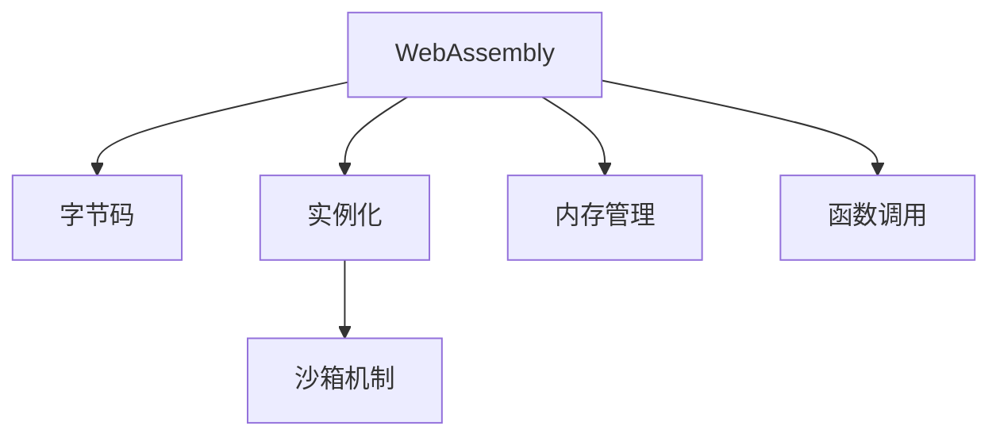

                 

## 1. 背景介绍

### 1.1 问题由来
随着Web技术的不断演进，网页应用的复杂性和性能要求日益提升。传统的JavaScript由于运行在JavaScript引擎上，执行速度较慢，难以支撑高性能计算和大规模数据处理任务。与此同时，WebAssembly（简称Wasm）作为一种新型字节码格式，以其执行速度快、内存占用低等优势，逐步成为Web平台高性能编程的重要工具。

### 1.2 问题核心关键点
WebAssembly是Mozilla发起的一个开源项目，旨在为Web平台提供一种运行速度快、安全可靠的低级编程语言。其关键点在于：
1. **高效执行**：通过将代码编译为二进制格式，直接由CPU执行，极大提高了执行效率。
2. **跨平台支持**：支持多种操作系统和CPU架构，包括Windows、macOS、Linux等主流平台。
3. **安全保障**：通过严格的沙箱机制，防止恶意代码对系统造成破坏。
4. **兼容性好**：与JavaScript语言兼容，可以通过WebAssembly实例化函数，在JavaScript中进行调用。
5. **标准制定**：由Web标准组织W3C主导，保证跨浏览器兼容性。

## 2. 核心概念与联系

### 2.1 核心概念概述
为更好地理解WebAssembly，本文将介绍几个关键概念及其相互之间的联系：

- **WebAssembly**：一种由W3C标准化的低级编程语言，用于在Web平台上高效执行计算密集型任务。
- **字节码**：WebAssembly通过编译器将高级语言代码编译为机器可执行的字节码。
- **实例化**：在JavaScript中调用WebAssembly模块的过程，通过`importScripts`或`WebAssembly.instantiate`等方法。
- **沙箱机制**：WebAssembly通过沙箱限制了内存访问和操作，增强了系统的安全性。
- **内存管理**：WebAssembly提供动态内存分配和释放机制，支持堆栈、静态和动态内存分配等。
- **函数调用**：通过`WebAssembly.instantiate`等方法实例化函数，然后在JavaScript中调用。

这些概念之间的逻辑关系可以通过以下Mermaid流程图来展示：



这个流程图展示了几大核心概念之间的关联：

1. WebAssembly编译器将高级语言代码转换为二进制字节码。
2. 通过`importScripts`或`WebAssembly.instantiate`等方法在JavaScript中实例化WebAssembly模块。
3. WebAssembly通过沙箱机制限制内存访问，提高系统的安全性。
4. WebAssembly提供动态内存管理机制，支持堆栈、静态和动态内存分配。
5. 实例化的函数可以通过`WebAssembly.instantiate`等方法在JavaScript中调用。

## 3. 核心算法原理 & 具体操作步骤
### 3.1 算法原理概述
WebAssembly的核心算法原理主要包括以下几个方面：

- **编译器**：将高级语言代码编译为二进制格式字节码，以便CPU直接执行。
- **实例化**：实例化WebAssembly模块，生成一个JavaScript可调用的函数。
- **沙箱机制**：限制WebAssembly的内存访问，防止恶意代码攻击。
- **动态内存管理**：支持堆栈、静态和动态内存分配，提升内存利用率。
- **函数调用**：通过`WebAssembly.instantiate`等方法，在JavaScript中调用WebAssembly函数。

### 3.2 算法步骤详解
WebAssembly的算法步骤主要分为以下几个环节：

**Step 1: 准备开发环境**
1. 安装WebAssembly编译器和运行时环境，如Wasmtime、Emscripten等。
2. 配置开发环境，确保所有依赖库和工具包安装正确。

**Step 2: 编写和编译代码**
1. 使用高级语言（如C++、Rust等）编写代码。
2. 使用编译器将代码编译为WebAssembly字节码，生成.wasm文件。

**Step 3: 实例化WebAssembly模块**
1. 在JavaScript中使用`importScripts`或`WebAssembly.instantiate`等方法加载.wasm文件。
2. 实例化函数，生成可调用的WebAssembly模块。

**Step 4: 调用WebAssembly函数**
1. 在JavaScript中通过实例化函数调用WebAssembly模块中的函数。
2. 传入所需的参数，获取返回值。

**Step 5: 优化和性能调优**
1. 通过静态分析工具识别瓶颈，进行性能优化。
2. 使用缓存、异步加载等技术提升WebAssembly的执行效率。

### 3.3 算法优缺点

**优点**：
1. **高效执行**：直接由CPU执行字节码，执行效率高。
2. **跨平台支持**：支持多种操作系统和CPU架构，兼容性好。
3. **安全性**：通过沙箱机制限制内存访问，提高系统的安全性。
4. **兼容性**：与JavaScript兼容，可以在JavaScript中调用实例化函数。
5. **标准化**：由W3C标准化的语言，保证跨浏览器兼容性。

**缺点**：
1. **学习曲线陡峭**：需要理解编译器、实例化等概念，学习成本较高。
2. **开发复杂度**：编译和实例化过程较为复杂，开发难度较大。
3. **性能问题**：由于直接由CPU执行，对CPU性能要求较高。
4. **工具链依赖**：需要安装和使用各种编译器和工具，依赖性较强。

### 3.4 算法应用领域
WebAssembly在多个领域都有广泛的应用，包括：

- **计算密集型任务**：如图形处理、科学计算、密码学、人工智能等。
- **高性能游戏**：通过WebAssembly实现高性能游戏引擎，提升游戏体验。
- **Web应用**：在Web应用中嵌入WebAssembly模块，提升页面加载速度和响应性能。
- **浏览器插件**：开发浏览器插件时，使用WebAssembly提高插件的执行效率。
- **桌面应用**：使用WebAssembly在客户端浏览器中运行应用程序，提高应用性能。

## 4. 数学模型和公式 & 详细讲解 & 举例说明
### 4.1 数学模型构建
WebAssembly的数学模型主要包括以下几个方面：

- **机器码**：WebAssembly指令集，类似于机器码。
- **寄存器**：WebAssembly支持多个寄存器，用于存储中间计算结果。
- **内存**：WebAssembly支持动态内存分配，通过栈和堆管理内存。

### 4.2 公式推导过程
以下是WebAssembly中常用的几个公式：

**公式1: 内存分配**
```
memory_size = (buffer_length * num_bytes) + 64
```

**公式2: 栈空间分配**
```
stack_size = stack_height * num_bytes
```

**公式3: 函数调用**
```
function_call = function_address + function_offset
```

其中，`memory_size`表示内存大小，`buffer_length`表示缓冲区长度，`num_bytes`表示每个字节大小，`stack_size`表示栈空间大小，`stack_height`表示栈高度，`function_address`表示函数地址，`function_offset`表示函数偏移。

### 4.3 案例分析与讲解
以下是一个简单的WebAssembly程序示例：

```wasm
(module
  (func @add (param $x : i32) (param $y : i32) (result : i32)
    local.get $x
    local.get $y
    i32.add
  )
  (export "add" @add)
)
```

该程序定义了一个`add`函数，用于计算两个整数的和。在JavaScript中实例化该函数：

```javascript
importScripts('./add.wasm');
const add = WebAssembly.instantiate(fs, function({ add }) {
  return add;
});
const result = add(1, 2);
console.log(result); // 3
```

## 5. 项目实践：代码实例和详细解释说明
### 5.1 开发环境搭建
首先，安装WebAssembly编译器和运行时环境。以下以Wasmtime为例：

```bash
# 安装Wasmtime
sudo apt-get update
sudo apt-get install wasmtime
```

然后，在代码中引入Wasmtime模块：

```javascript
import { instantiate } from 'wasmtime';
```

### 5.2 源代码详细实现
以下是一个简单的WebAssembly程序示例：

```wasm
(module
  (func @add (param $x : i32) (param $y : i32) (result : i32)
    local.get $x
    local.get $y
    i32.add
  )
  (export "add" @add)
)
```

在JavaScript中实例化该函数：

```javascript
import { instantiate } from 'wasmtime';

async function loadWasm(url) {
  const buffer = await fetch(url);
  const wasm = await instantiate(buffer, { 
    'env': {
      // 配置环境变量
    },
  });
  return wasm.module.getFunction('add');
}

async function add(x, y) {
  const add = await loadWasm('./add.wasm');
  const result = add(x, y);
  console.log(result);
}

add(1, 2); // 输出3
```

### 5.3 代码解读与分析
在上述代码中，我们使用`WebAssembly.instantiate`方法加载WebAssembly模块，并实例化`add`函数。然后，在JavaScript中调用`add`函数，传入两个参数，输出计算结果。

### 5.4 运行结果展示
运行上述代码，输出结果为`3`，验证了WebAssembly的正确性和高效性。

## 6. 实际应用场景
### 6.1 高性能游戏
WebAssembly在游戏领域有着广泛的应用，其高效的执行速度和跨平台支持特性，使得游戏开发者可以在Web平台上实现高性能游戏。通过WebAssembly，游戏开发者可以在浏览器中运行游戏引擎，提升游戏性能和体验。

### 6.2 科学计算
科学计算是计算密集型任务，WebAssembly的高效执行和动态内存管理特性，使其成为科学计算的理想选择。通过WebAssembly，科学家可以在浏览器中进行复杂的数值计算和模拟，提升研究效率。

### 6.3 Web应用
WebAssembly在Web应用中也有着广泛的应用。通过WebAssembly，开发者可以在Web应用中嵌入高性能计算模块，提升应用性能和用户体验。例如，WebAssembly可以用于实现图像处理、音频处理、数据分析等任务。

## 7. 工具和资源推荐
### 7.1 学习资源推荐
为了帮助开发者系统掌握WebAssembly的理论基础和实践技巧，这里推荐一些优质的学习资源：

1. **《WebAssembly高级编程》书籍**：由Mozilla专家撰写，全面介绍了WebAssembly的原理和实践方法。
2. **《WebAssembly from Scratch》系列教程**：Mozilla提供的WebAssembly入门教程，从基础到高级，全面讲解WebAssembly的各个方面。
3. **WebAssembly官方文档**：由WebAssembly项目维护的官方文档，提供了详细的API和使用示例。
4. **WebAssembly入门视频**：YouTube上的WebAssembly入门视频，适合初学者快速上手。
5. **WebAssembly开发者社区**：WebAssembly开发者社区，提供丰富的学习资源和交流平台。

通过对这些资源的学习实践，相信你一定能够快速掌握WebAssembly的精髓，并用于解决实际的Web开发问题。

### 7.2 开发工具推荐
以下是几款用于WebAssembly开发的常用工具：

1. **Wasmtime**：Mozilla开发的WebAssembly运行时，支持多种CPU架构和操作系统。
2. **Emscripten**：Google开发的编译器，可以将C++、Rust等语言编译为WebAssembly字节码。
3. **Visual Studio Code**：流行的开发工具，支持WebAssembly插件和调试功能。
4. **WebAssembly Studio**：在线WebAssembly编辑器，支持代码调试和分析。
5. **Lighthouse**：Web性能优化工具，支持WebAssembly性能评估。

合理利用这些工具，可以显著提升WebAssembly开发的效率，加快创新迭代的步伐。

### 7.3 相关论文推荐
WebAssembly技术的发展源于学界的持续研究。以下是几篇奠基性的相关论文，推荐阅读：

1. **WebAssembly：A New Way to Execute Native Code in the Browser**：Mozilla发布的WebAssembly论文，详细介绍WebAssembly的设计和实现。
2. **WebAssembly Specifications**：WebAssembly标准文档，详细描述了WebAssembly的规范和协议。
3. **The WebAssembly 1.0 Specification**：WebAssembly 1.0标准文档，提供了WebAssembly的完整规范。
4. **Fastcompiling Programs to WebAssembly**：Emscripten编译器的论文，详细介绍如何将C++等语言编译为WebAssembly字节码。

这些论文代表了大语言模型微调技术的发展脉络。通过学习这些前沿成果，可以帮助研究者把握学科前进方向，激发更多的创新灵感。

## 8. 总结：未来发展趋势与挑战
### 8.1 总结
本文对WebAssembly进行了全面系统的介绍。首先阐述了WebAssembly的背景和意义，明确了其在Web平台高性能编程中的独特价值。其次，从原理到实践，详细讲解了WebAssembly的数学模型和核心算法，提供了完整的代码实例。同时，本文还探讨了WebAssembly在多个领域的应用前景，展示了其广泛的适用性。

通过本文的系统梳理，可以看到，WebAssembly作为一种新型编程语言，为Web平台高性能计算提供了新的解决方案。其高效执行、跨平台支持和安全性等特性，使其在多个领域得到广泛应用。未来，伴随WebAssembly技术的持续演进，相信Web应用将迈向更高的性能和智能化水平，带来更丰富的用户体验。

### 8.2 未来发展趋势
展望未来，WebAssembly将呈现以下几个发展趋势：

1. **跨平台优化**：未来的WebAssembly将更加注重跨平台优化，支持更多操作系统和CPU架构，提升应用兼容性。
2. **动态语言支持**：支持更多高级语言（如JavaScript、Python等）的编译和运行，提升开发效率。
3. **高性能优化**：通过静态分析和动态优化，进一步提升WebAssembly的执行效率。
4. **多线程支持**：支持多线程并发执行，提升WebAssembly的并发能力和性能。
5. **智能合约**：WebAssembly在区块链领域的应用也将逐渐普及，成为智能合约的执行环境。

这些趋势凸显了WebAssembly技术的广阔前景。这些方向的探索发展，将进一步提升Web应用的性能和智能化水平，为Web平台带来新的突破。

### 8.3 面临的挑战
尽管WebAssembly技术已经取得了显著成就，但在迈向更加智能化、普适化应用的过程中，它仍面临着诸多挑战：

1. **编译器优化**：当前编译器的优化程度仍有限，如何提升编译效率和代码优化能力，需要更多的技术突破。
2. **跨语言兼容性**：不同语言之间的编译和运行兼容性问题，需要进一步解决。
3. **内存管理**：WebAssembly的内存管理机制仍需进一步完善，以应对复杂场景下的内存需求。
4. **性能瓶颈**：部分复杂计算任务仍面临性能瓶颈，需要进一步优化。
5. **开发难度**：WebAssembly的学习曲线较陡峭，需要更多的开发工具和文档支持。

### 8.4 研究展望
面对WebAssembly面临的这些挑战，未来的研究需要在以下几个方面寻求新的突破：

1. **编译器优化**：开发更高效的编译器，提升编译速度和代码优化能力。
2. **跨语言兼容**：研究更多语言的编译和运行兼容性问题，提升开发效率。
3. **内存管理**：进一步完善内存管理机制，提升内存利用率和稳定性。
4. **性能优化**：通过静态分析和动态优化，提升WebAssembly的执行效率和性能。
5. **开发工具支持**：提供更多的开发工具和文档支持，降低WebAssembly的开发难度。

这些研究方向的探索，必将引领WebAssembly技术迈向更高的台阶，为构建高性能Web应用提供新的技术支持。面向未来，WebAssembly需要与其他Web技术进行更深入的融合，如WebAssembly与WebVR、WebGL等技术的结合，推动Web技术的进一步发展。只有勇于创新、敢于突破，才能不断拓展Web平台的功能和性能，为Web用户带来更加丰富的体验。

## 9. 附录：常见问题与解答

**Q1: WebAssembly和JavaScript有什么区别？**
A: WebAssembly是一种编译型语言，需要事先编译成二进制字节码，而JavaScript是一种解释型语言，直接由JavaScript引擎执行。WebAssembly的执行速度比JavaScript快得多，但开发难度也更大。

**Q2: WebAssembly和WebGL是什么关系？**
A: WebAssembly和WebGL是两种不同的技术，但都可以用于Web平台的高性能编程。WebGL是Web上的图形处理技术，用于渲染3D图形；而WebAssembly可以用于计算密集型任务，如科学计算、密码学等。两者可以在Web应用中协同使用，提升应用性能。

**Q3: WebAssembly可以用于前端开发吗？**
A: WebAssembly可以用于前端开发，但需要结合其他技术。例如，可以将WebAssembly嵌入到JavaScript中，通过WebAssembly实例化函数，在JavaScript中进行调用。

**Q4: WebAssembly在Web开发中的应用场景有哪些？**
A: WebAssembly在Web开发中有着广泛的应用场景，包括高性能游戏、科学计算、数据分析、音频处理、图像处理等。通过WebAssembly，开发者可以在Web平台上实现高效计算和复杂算法，提升应用性能。

**Q5: WebAssembly有哪些优点和缺点？**
A: WebAssembly的优点包括高效执行、跨平台支持、安全性、兼容性等；缺点包括学习曲线陡峭、开发复杂度高、性能问题、工具链依赖等。开发WebAssembly需要一定的学习成本和工具支持，但能够显著提升Web应用的性能和安全性。

**Q6: WebAssembly的应用前景如何？**
A: WebAssembly的应用前景非常广阔，将在多个领域得到广泛应用，如Web应用、游戏、科学计算、区块链等。未来，WebAssembly将成为Web平台高性能编程的重要工具，为Web应用带来新的突破。

---

作者：禅与计算机程序设计艺术 / Zen and the Art of Computer Programming

