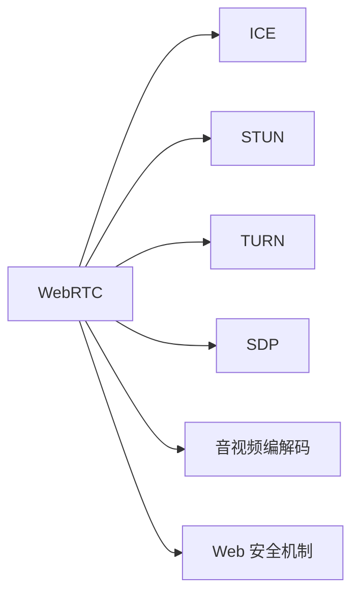

                 

# WebRTC 技术：浏览器中的实时通信

## 1. 背景介绍

在当今数字化时代，实时通信已成为人们日常互动的重要组成部分。无论是社交网络、在线教育、远程办公，还是娱乐应用，实时音视频通话的需求日益增长。然而，传统的 Web 应用在实时通信方面面临着挑战：需要手动配置和协调音视频流传输、容易受网络条件影响、跨浏览器兼容性差等问题。这时，WebRTC 技术应运而生。

### 1.1 问题由来

WebRTC 是一个开源的 Web 标准，用于在 Web 浏览器之间实现点对点( peer-to-peer, P2P) 的音视频通信。它提供了一组 API 和协议，使得 Web 应用能够无需插件就能实时传输音视频流、数据和文件。其核心理念是通过浏览器之间的直接连接，绕过服务器，实现端到端通信，从而降低延迟，提升音视频质量。

WebRTC 最初由 Google 在 2011 年推出，最初为 Google Chrome 浏览器专用，后来逐渐成为 Web 标准，并在各大主流浏览器中实现支持。2015 年，WebRTC 被 IETF 标准化为 RFC 5264 和 RFC 5245。如今，WebRTC 已经成为了 Web 实时通信的事实标准。

### 1.2 问题核心关键点

WebRTC 技术的核心关键点在于以下几个方面：

- **端到端通信**：WebRTC 通过浏览器之间的 P2P 连接，绕过服务器，实现直接的数据传输，从而降低延迟，提升传输效率。
- **实时音视频编解码**：WebRTC 提供一套实时音视频编解码标准，包括VP8、VP9、AAC、Opus等，能够适应不同的网络条件和音视频需求。
- **网络优化**：WebRTC 采用ICE 协议和STUN、TURN 技术，自动建立和优化音视频传输通道，适应复杂的异构网络环境。
- **Web 安全机制**：WebRTC 利用 Web 的安全机制，如TLS 加密和SDP 协议，保障音视频传输的安全性。
- **浏览器兼容性**：WebRTC 的 API 设计简洁，能够在多种主流浏览器中无缝集成，确保跨浏览器兼容性。

这些关键点构成了 WebRTC 技术的核心竞争力，使其在实时通信领域大放异彩。

## 2. 核心概念与联系

### 2.1 核心概念概述

为了更好地理解 WebRTC 技术，本节将介绍几个密切相关的核心概念：

- **WebRTC**：Web 实时通信标准，提供一套 API 和协议，用于在浏览器之间实现实时音视频通信。
- **ICE 协议**：Interactive Connectivity Establishment，用于建立 P2P 音视频通道的网络优化协议。
- **STUN 和 TURN**：Session Traversal Utilities for NAT (STUN)和Traversal Using Relay NAT (TURN)，用于 NAT 穿透和网络优化。
- **SDP**：Session Description Protocol，用于描述音视频会话的媒体信息、参数等。
- **音视频编解码**：WebRTC 支持多种音视频编解码标准，如VP8、VP9、AAC、Opus等，满足不同应用场景的需求。
- **Web 安全机制**：WebRTC 利用 Web 的安全机制，如TLS 加密和HMAC 验证，保障音视频传输的安全性。

这些核心概念之间的逻辑关系可以通过以下 Mermaid 流程图来展示：



这个流程图展示了大语言模型的核心概念及其之间的关系：

1. WebRTC 是整个实时通信系统的核心，提供一套完整的 API 和协议。
2. ICE 协议用于建立和优化音视频通道，实现 P2P 连接。
3. STUN 和 TURN 技术用于 NAT 穿透和网络优化，保障音视频流的畅通。
4. SDP 协议用于描述音视频会话，包括媒体参数、编解码信息等。
5. 音视频编解码标准和 Web 安全机制，是 WebRTC 在音视频处理和传输中的核心技术。

## 3. 核心算法原理 & 具体操作步骤

### 3.1 算法原理概述

WebRTC 的实时音视频通信原理，主要包括客户端之间的 P2P 连接、音视频编解码、网络优化、安全性保障等环节。其核心流程可以分为以下几个步骤：

1. 浏览器之间的发现和连接：通过 STUN 和 TURN 技术，自动发现和连接对端浏览器，建立 P2P 通道。
2. 音视频流的传输和处理：通过 WebRTC 提供的音视频编解码标准，对音视频流进行实时编码和解码，传输到对端浏览器。
3. 网络优化和带宽管理：通过 ICE 协议和 SDP 描述，自动优化音视频传输通道，管理带宽资源。
4. 数据加密和安全性保障：通过 Web 的安全机制，保障音视频传输的安全性。

### 3.2 算法步骤详解

以下是 WebRTC 实时通信的核心步骤详解：

**Step 1: 准备音视频流**

WebRTC 的音视频流传输依赖于浏览器之间的 P2P 连接。首先，浏览器通过 STUN 和 TURN 技术，自动发现和连接对端浏览器，建立音视频通道。这通常包括以下几个步骤：

1. 发送 STUN 请求：浏览器通过 STUN 服务器获取本地网络的端口信息，发现自身的 NAT 类型。
2. 发送 TURN 请求：如果自身为 NAT 隐藏节点，则通过 TURN 服务器进行 NAT 穿透，建立 P2P 通道。
3. 使用 ICE 协议：ICE 协议用于自动发现和连接对端浏览器，建立音视频通道。

**Step 2: 音视频编解码和传输**

音视频流的编解码和传输是 WebRTC 的核心功能。首先，浏览器需要对音视频流进行编码，将其转换为标准格式，如VP8、VP9、AAC、Opus等。然后，通过 ICE 协议建立的数据通道，将编码后的音视频流传输到对端浏览器。

1. 音视频编码：浏览器利用 WebRTC 提供的音视频编解码标准，对音视频流进行实时编码。
2. 音视频传输：通过 ICE 协议建立的数据通道，将编码后的音视频流传输到对端浏览器。

**Step 3: 网络优化**

网络优化是 WebRTC 的重要功能之一。通过 ICE 协议和 SDP 描述，WebRTC 能够自动优化音视频传输通道，管理带宽资源。这通常包括以下几个步骤：

1. ICE 协议：ICE 协议用于自动发现和连接对端浏览器，建立音视频通道。
2. SDP 描述：SDP 描述用于描述音视频会话，包括媒体参数、编解码信息等。
3. 带宽管理：通过 ICE 协议和 SDP 描述，自动优化音视频传输通道，管理带宽资源。

**Step 4: 数据加密和安全性保障**

WebRTC 利用 Web 的安全机制，保障音视频传输的安全性。这通常包括以下几个步骤：

1. TLS 加密：通过 WebRTC 的加密机制，保障音视频传输的安全性。
2. HMAC 验证：通过 WebRTC 的验证机制，保障音视频传输的完整性和真实性。

### 3.3 算法优缺点

WebRTC 技术的优缺点如下：

**优点**：

1. 端到端通信：WebRTC 通过浏览器之间的 P2P 连接，绕过服务器，实现直接的数据传输，从而降低延迟，提升音视频质量。
2. 实时音视频编解码：WebRTC 提供一套实时音视频编解码标准，能够适应不同的网络条件和音视频需求。
3. 网络优化：WebRTC 采用 ICE 协议和 STUN、TURN 技术，自动建立和优化音视频传输通道，适应复杂的异构网络环境。
4. 浏览器兼容性：WebRTC 的 API 设计简洁，能够在多种主流浏览器中无缝集成，确保跨浏览器兼容性。
5. 安全性保障：WebRTC 利用 Web 的安全机制，如 TLS 加密和 HMAC 验证，保障音视频传输的安全性。

**缺点**：

1. 复杂度较高：WebRTC 实现涉及多种协议和标准，对开发者的技术要求较高。
2. 兼容性问题：虽然 WebRTC 已在主流浏览器中实现支持，但在一些老旧浏览器中可能存在兼容性问题。
3. 性能开销：WebRTC 的实时音视频编解码和网络优化功能，带来了一定的性能开销，需要合理配置。
4. 安全性风险：虽然 WebRTC 提供了多种安全性保障机制，但在某些网络环境中，仍然可能存在安全隐患。

尽管存在这些局限性，但 WebRTC 技术的优势使其在实时通信领域大放异彩，成为众多 Web 应用的首选技术。

### 3.4 算法应用领域

WebRTC 技术在实时通信领域具有广泛的应用，包括但不限于以下几个方面：

- **社交网络**：如微信、QQ 等，通过 WebRTC 实现点对点的音视频通话。
- **在线教育**：如Coursera、Udacity等，通过 WebRTC 实现实时的课堂互动。
- **远程办公**：如Zoom、Microsoft Teams 等，通过 WebRTC 实现实时的视频会议。
- **娱乐应用**：如Netflix、YouTube等，通过 WebRTC 实现实时的在线直播和互动。
- **医疗健康**：如远程医疗、健康咨询等，通过 WebRTC 实现实时的远程会诊和沟通。
- **电子商务**：如在线客服、商品直播等，通过 WebRTC 实现实时的客户服务和产品展示。

除了上述这些常见应用外，WebRTC 技术还被创新性地应用到更多场景中，如可控实时视频、协作编辑、实时信息采集等，为实时通信领域带来了新的突破。随着 WebRTC 技术的不断演进，相信其在实时通信领域的应用将越来越广泛，为人们的生活和工作带来更多的便利。

## 4. 数学模型和公式 & 详细讲解

### 4.1 数学模型构建

WebRTC 的音视频传输模型可以表示为：

$$
\begin{aligned}
&\text{音视频编解码器} \to \text{音视频流} \to \text{ICE 协议} \to \text{音视频通道} \\
&\downarrow \\
&\text{WebRTC API} \\
&\downarrow \\
&\text{STUN 和 TURN 技术} \\
&\downarrow \\
&\text{SDP 描述}
\end{aligned}
$$

其中，音视频编解码器负责对音视频流进行实时编码和解码；ICE 协议用于自动发现和连接对端浏览器，建立音视频通道；STUN 和 TURN 技术用于 NAT 穿透和网络优化；SDP 描述用于描述音视频会话。

### 4.2 公式推导过程

以下以音视频编解码为例，详细推导其数学模型。

假设音视频流的数据率为 $R$，采样率为 $f$，比特深度为 $b$，编解码器的压缩比为 $K$，则音视频编解码的数学模型可以表示为：

$$
\begin{aligned}
&\text{原始数据量} = R \times T \\
&\text{编码数据量} = \frac{R}{K} \times T \\
&\text{压缩比} = K = \frac{R}{R/K} = \frac{1}{b \times f} \\
&\text{编码效率} = \frac{R}{R/K} = K \times b \times f
\end{aligned}
$$

其中，$T$ 表示音视频流的持续时间。可以看到，编解码器的压缩比和编码效率直接影响音视频传输的性能和带宽占用。

### 4.3 案例分析与讲解

以下以音视频编解码的压缩比为例，详细讲解其数学模型在实际应用中的计算过程。

假设音视频流的采样率为 16000 Hz，比特深度为 8，编解码器的压缩比为 1/8，则音视频编解码的数学模型可以表示为：

$$
\begin{aligned}
&\text{原始数据量} = 16000 \times T \times 8 \\
&\text{编码数据量} = \frac{16000 \times T}{8} \times 8 \\
&\text{压缩比} = \frac{16000 \times T \times 8}{16000 \times T \times 8/8} = 1/8 \\
&\text{编码效率} = 8 \times 16000 \times T \times 8/16000 \times T = 8
\end{aligned}
$$

可以看到，编解码器的压缩比为 1/8，表示音视频流在编解码过程中，体积缩小了 8 倍，压缩效率为 8。这表明编解码器能够有效地压缩音视频数据，提升网络传输的效率和带宽利用率。

## 5. 项目实践：代码实例和详细解释说明

### 5.1 开发环境搭建

在进行 WebRTC 项目实践前，我们需要准备好开发环境。以下是使用 Python 进行开发的环境配置流程：

1. 安装 Anaconda：从官网下载并安装 Anaconda，用于创建独立的 Python 环境。

2. 创建并激活虚拟环境：
```bash
conda create -n pytorch-env python=3.8 
conda activate pytorch-env
```

3. 安装 PyTorch：根据 CUDA 版本，从官网获取对应的安装命令。例如：
```bash
conda install pytorch torchvision torchaudio cudatoolkit=11.1 -c pytorch -c conda-forge
```

4. 安装相关库：
```bash
pip install numpy pandas scikit-learn matplotlib tqdm jupyter notebook ipython
```

完成上述步骤后，即可在 `pytorch-env` 环境中开始 WebRTC 项目实践。

### 5.2 源代码详细实现

以下是使用 Python 实现 WebRTC 项目的基本代码：

```python
import webrtcvad
import pyaudio
import numpy as np
import time

# 初始化 VAD
vad = webrtcvad.Vad()

# 初始化 PyAudio
audio = pyaudio.PyAudio()

# 定义音频数据处理函数
def process_audio(stream):
    while True:
        data = stream.read(1024)
        if len(data) == 0:
            break
        audio_data = np.frombuffer(data, dtype=np.int16)
        vad.speech(audio_data)
        if vad.is_speech(audio_data):
            print("Detected speech")
```

首先，使用 `webrtcvad` 库初始化 VAD（语音激活检测），用于检测语音片段。然后，使用 `pyaudio` 库初始化 PyAudio，用于处理音频流。接着，定义 `process_audio` 函数，对音频流进行处理，检测语音片段。

在实际项目中，可以使用 WebRTC API 和相关库实现音视频流的传输和处理。具体实现细节可以参考 WebRTC API 文档和相关教程。

### 5.3 代码解读与分析

以下是代码中关键部分的详细解读：

**初始化 VAD**：
```python
vad = webrtcvad.Vad()
```

初始化 VAD 对象，用于检测语音片段。

**初始化 PyAudio**：
```python
audio = pyaudio.PyAudio()
```

初始化 PyAudio 对象，用于处理音频流。

**定义音频数据处理函数**：
```python
def process_audio(stream):
    while True:
        data = stream.read(1024)
        if len(data) == 0:
            break
        audio_data = np.frombuffer(data, dtype=np.int16)
        vad.speech(audio_data)
        if vad.is_speech(audio_data):
            print("Detected speech")
```

定义 `process_audio` 函数，对音频流进行处理。首先，从音频流中读取数据，判断数据长度是否为 0。如果为 0，则退出循环。否则，将音频数据转换为 numpy 数组，并使用 VAD 检测语音片段。如果检测到语音片段，则输出提示信息。

### 5.4 运行结果展示

在实际运行中，可以通过音频流处理函数检测语音片段。例如，使用 Python 脚本执行上述代码，并输入音频数据，可以检测到语音片段并输出提示信息。

## 6. 实际应用场景

### 6.1 智能客服系统

WebRTC 技术在智能客服系统中具有广泛的应用，可以与自然语言处理技术结合，实现自动客服和智能应答。用户可以通过语音或文字与智能客服系统进行交互，系统能够自动理解用户需求并给出解答。这种应用场景可以有效提升客服系统的响应速度和用户满意度。

在技术实现上，可以使用 WebRTC API 和相关库实现音视频流的传输和处理，同时利用自然语言处理技术进行文本分析和语音识别，结合机器学习算法进行智能应答。

### 6.2 在线教育平台

WebRTC 技术在在线教育平台中也有着广泛的应用，可以用于实时的课堂互动和远程教学。学生可以通过浏览器参与课堂互动，与老师进行实时的视频通话和语音交流，提升教学效果和学习体验。

在技术实现上，可以使用 WebRTC API 和相关库实现音视频流的传输和处理，同时利用 WebRTC 的编解码标准和网络优化技术，保障音视频传输的稳定性和实时性。

### 6.3 远程医疗应用

WebRTC 技术在远程医疗应用中也有着广泛的应用，可以用于实时的远程会诊和医疗咨询。医生可以通过浏览器与患者进行实时的视频通话和语音交流，实时传输医疗数据和图像，提升医疗服务的效率和质量。

在技术实现上，可以使用 WebRTC API 和相关库实现音视频流的传输和处理，同时利用 WebRTC 的安全机制保障医疗数据的安全性。

### 6.4 未来应用展望

随着 WebRTC 技术的不断演进，其在实时通信领域的应用将越来越广泛，为人们的生活和工作带来更多的便利。未来，WebRTC 技术将在以下几个方面取得新的突破：

1. **跨平台兼容性**：WebRTC 技术将在更多平台和设备上实现无缝集成，保障跨平台兼容性。
2. **高质量音视频**：WebRTC 技术将不断优化音视频编解码和网络优化算法，提升音视频传输的质量和流畅性。
3. **智能交互**：WebRTC 技术将与自然语言处理、机器学习等技术结合，实现智能交互和自然语言理解。
4. **边缘计算**：WebRTC 技术将在边缘计算环境下实现低延迟、高可靠性的音视频传输，提升用户体验。
5. **隐私保护**：WebRTC 技术将引入隐私保护机制，保障用户数据的安全性和隐私性。

这些方向的探索发展，必将使 WebRTC 技术在实时通信领域迈向更高的台阶，为构建更加智能、高效、安全的实时通信系统提供坚实的技术基础。

## 7. 工具和资源推荐

### 7.1 学习资源推荐

为了帮助开发者系统掌握 WebRTC 技术，以下是一些优质的学习资源：

1. WebRTC 官方文档：提供 WebRTC API 的详细文档和示例代码，是学习 WebRTC 的必备资料。
2. 《WebRTC 实战》书籍：详细介绍了 WebRTC 技术的原理和实现方法，适合深入学习。
3. WebRTC 教程：包括 WebRTC 基础教程、高级教程和实战案例，适合新手入门和进阶学习。
4. WebRTC 在线课程：提供 WebRTC 技术的在线课程和实战项目，适合系统学习。

通过对这些资源的学习实践，相信你一定能够快速掌握 WebRTC 技术的精髓，并用于解决实际的实时通信问题。

### 7.2 开发工具推荐

高效的开发离不开优秀的工具支持。以下是几款用于 WebRTC 项目开发的常用工具：

1. Visual Studio Code：轻量级的代码编辑器，支持 WebRTC 项目的开发和调试。
2. WebRTC API 示例代码：提供 WebRTC API 的官方示例代码，可以快速上手实验。
3. WebRTC 浏览器兼容性测试工具：用于测试 WebRTC 在不同浏览器中的兼容性，确保跨浏览器兼容性。
4. WebRTC 调试工具：提供 WebRTC 项目的调试功能，快速定位和解决实时通信问题。

合理利用这些工具，可以显著提升 WebRTC 项目的开发效率，加快创新迭代的步伐。

### 7.3 相关论文推荐

WebRTC 技术的发展源于学界的持续研究。以下是几篇奠基性的相关论文，推荐阅读：

1. RTP (Real-Time Transport Protocol)：WebRTC 实时传输协议，用于音视频流的传输。
2. SDP (Session Description Protocol)：用于描述音视频会话的标准协议。
3. STUN (Session Traversal Utilities for NAT)：用于 NAT 穿透的标准协议。
4. TURN (Traversal Using Relay NAT)：用于 NAT 穿透的标准协议。
5. ICE (Interactive Connectivity Establishment)：用于建立 P2P 音视频通道的标准协议。

这些论文代表了大语言模型微调技术的发展脉络。通过学习这些前沿成果，可以帮助研究者把握学科前进方向，激发更多的创新灵感。

## 8. 总结：未来发展趋势与挑战

### 8.1 总结

本文对 WebRTC 技术进行了全面系统的介绍。首先阐述了 WebRTC 技术的背景和意义，明确了其在实时通信领域的重要性。其次，从原理到实践，详细讲解了 WebRTC 的数学模型和操作步骤，给出了 WebRTC 项目开发的完整代码实例。同时，本文还广泛探讨了 WebRTC 技术在智能客服、在线教育、远程医疗等多个行业领域的应用前景，展示了 WebRTC 技术的广阔前景。

通过本文的系统梳理，可以看到，WebRTC 技术在实时通信领域大放异彩，成为众多 Web 应用的首选技术。得益于其端到端通信、实时音视频编解码、网络优化、安全性保障等核心能力，WebRTC 技术能够应对复杂的异构网络环境，实现稳定、高效、安全的实时音视频传输。未来，随着 WebRTC 技术的不断演进，其在实时通信领域的应用将越来越广泛，为人们的生活和工作带来更多的便利。

### 8.2 未来发展趋势

展望未来，WebRTC 技术将呈现以下几个发展趋势：

1. **跨平台兼容性**：WebRTC 技术将在更多平台和设备上实现无缝集成，保障跨平台兼容性。
2. **高质量音视频**：WebRTC 技术将不断优化音视频编解码和网络优化算法，提升音视频传输的质量和流畅性。
3. **智能交互**：WebRTC 技术将与自然语言处理、机器学习等技术结合，实现智能交互和自然语言理解。
4. **边缘计算**：WebRTC 技术将在边缘计算环境下实现低延迟、高可靠性的音视频传输，提升用户体验。
5. **隐私保护**：WebRTC 技术将引入隐私保护机制，保障用户数据的安全性和隐私性。

这些趋势凸显了 WebRTC 技术的广阔前景。这些方向的探索发展，必将使 WebRTC 技术在实时通信领域迈向更高的台阶，为构建更加智能、高效、安全的实时通信系统提供坚实的技术基础。

### 8.3 面临的挑战

尽管 WebRTC 技术已经取得了瞩目成就，但在迈向更加智能化、普适化应用的过程中，它仍面临着诸多挑战：

1. **跨浏览器兼容性**：虽然 WebRTC 已在主流浏览器中实现支持，但在一些老旧浏览器中可能存在兼容性问题。如何实现更好的跨浏览器兼容性，将是重要的研究方向。
2. **性能开销**：WebRTC 的实时音视频编解码和网络优化功能，带来了一定的性能开销，需要合理配置。如何优化性能，提升音视频传输的效率，将是重要的优化方向。
3. **安全性风险**：虽然 WebRTC 提供了多种安全性保障机制，但在某些网络环境中，仍然可能存在安全隐患。如何提升安全性，保障音视频传输的安全性，将是重要的研究课题。
4. **用户隐私**：WebRTC 技术在实现实时通信的过程中，涉及用户数据的安全性和隐私性。如何在保障用户体验的同时，保障用户数据的安全性和隐私性，将是重要的研究课题。

### 8.4 研究展望

面对 WebRTC 技术面临的挑战，未来的研究需要在以下几个方面寻求新的突破：

1. **跨浏览器兼容性**：研究 WebRTC 在不同浏览器中的兼容性，提出新的兼容性方案，保障跨浏览器兼容性。
2. **性能优化**：优化 WebRTC 的音视频编解码和网络优化算法，提升音视频传输的效率和流畅性。
3. **安全性提升**：引入更多的安全性保障机制，如加密、验证、认证等，保障音视频传输的安全性。
4. **用户隐私保护**：引入隐私保护机制，保障用户数据的安全性和隐私性。

这些研究方向的探索，必将使 WebRTC 技术在实时通信领域迈向更高的台阶，为构建更加智能、高效、安全的实时通信系统提供坚实的技术基础。

## 9. 附录：常见问题与解答

**Q1：WebRTC 技术是否适用于所有实时通信场景？**

A: WebRTC 技术在大多数实时通信场景中都能取得不错的效果，特别是在音视频传输的稳定性和实时性要求较高的场景中。但对于一些对数据安全和隐私要求较高的场景，如金融、医疗等，还需要结合其他技术，如加密、认证等，才能满足特定的安全需求。

**Q2：WebRTC 技术如何保障音视频传输的安全性？**

A: WebRTC 技术利用 Web 的安全机制，如 TLS 加密和 HMAC 验证，保障音视频传输的安全性。TLS 加密用于保障音视频流的传输安全，HMAC 验证用于保障音视频流的完整性和真实性。

**Q3：WebRTC 技术在性能上有什么优势？**

A: WebRTC 技术的端到端通信和自适应网络优化机制，能够在复杂的网络环境中实现低延迟、高可靠性的音视频传输。同时，WebRTC 的音视频编解码标准和网络优化算法，能够在保持音视频质量的同时，有效管理带宽资源，提升性能。

**Q4：WebRTC 技术在实际应用中如何处理音视频流的编码和解码？**

A: WebRTC 技术使用多种音视频编解码标准，如VP8、VP9、AAC、Opus等，对音视频流进行实时编码和解码。音视频编解码器负责对音视频流进行实时编码和解码，并将编码后的音视频流传输到对端浏览器。

**Q5：WebRTC 技术在实际应用中如何处理音视频流的传输和优化？**

A: WebRTC 技术使用 ICE 协议和 SDP 描述，自动发现和连接对端浏览器，建立音视频通道。同时，WebRTC 采用 ICE 协议和 STUN、TURN 技术，自动建立和优化音视频传输通道，适应复杂的异构网络环境。

---

作者：禅与计算机程序设计艺术 / Zen and the Art of Computer Programming

