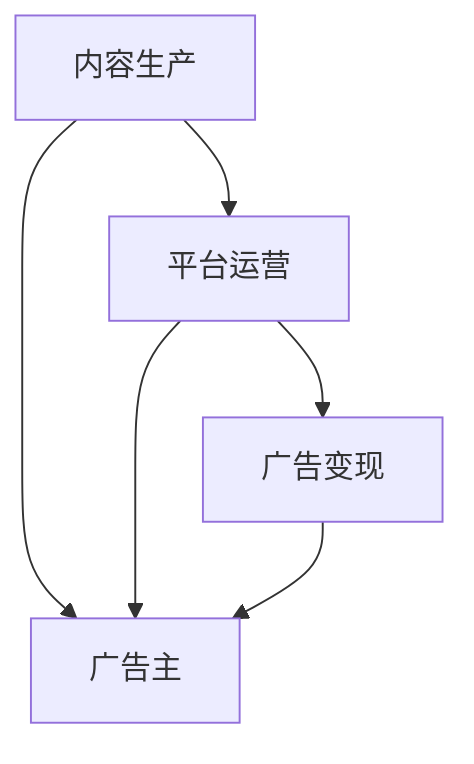

                 

# podcast市场：注意力经济的新蓝海

在数字化媒体不断演进的今天，内容生产与消费的模式正发生深刻变革。播客（Podcast，即音频播客）作为一种新兴的内容形式，因其独特的沉浸式体验和高度的互动性，正逐渐成为数字媒体领域的一颗新星。本篇文章旨在深入探讨播客市场的巨大潜力及其在注意力经济中的地位，为读者提供全面的视角和实用的洞察。

## 1. 背景介绍

### 1.1 播客的崛起

随着移动互联网和智能手机普及，人们对于便捷、个性化内容的追求日益高涨。播客以其轻便、易于访问、内容丰富等特点，逐渐成为全球范围内用户消费音频内容的主要方式之一。根据2022年的Statista数据，全球播客听众人数已接近3亿，并预计到2028年将达到5.77亿。播客的崛起不仅体现在用户基数的增长上，更在于其内容质量和形式上的不断创新。播客不再局限于单一的访谈形式，而是拓展到了访谈、脱口秀、教育、体育、娱乐等多个领域，呈现出多元化的发展态势。

### 1.2 注意力经济的挑战

注意力经济是数字时代下新兴的经济形态，旨在通过吸引并保持用户的注意力来创造价值。然而，当前互联网内容泛滥、用户注意力碎片化、信息过载等问题，使得传统媒体和广告在注意力获取上遭遇巨大挑战。播客作为一种新兴的内容形式，因其具有高度的听众粘性和强互动性，成为了注意力经济中一种极具潜力的商业模式。

## 2. 核心概念与联系

### 2.1 核心概念概述

播客市场作为一种新兴的经济形态，涵盖了从内容生产、平台运营到广告变现的整个产业链。其中，内容生产是播客市场的基础，平台运营是实现内容分发和变现的桥梁，广告变现则是播客市场的最终目标。这些环节通过技术手段、商业模式和市场机制的相互作用，共同推动播客市场的快速发展。

### 2.2 核心概念联系

播客市场的各个环节紧密相连，形成一个完整的生态系统。内容生产者通过平台上传、发布音频内容，吸引听众的注意；平台运营商通过用户数据分析、个性化推荐、流量引导等手段，提高内容的曝光率和用户的粘性；广告主则通过精准投放，实现对目标听众的有效覆盖，最终实现商业价值。

以下是一个简化的播客市场核心概念联系图：



## 3. 核心算法原理 & 具体操作步骤

### 3.1 算法原理概述

播客市场中的核心算法原理主要包括内容推荐、流量分析和广告投放三个方面。这些算法通过大数据分析和机器学习技术，实现内容的个性化推荐、流量的精准监控和广告的精准投放。

### 3.2 算法步骤详解

#### 3.2.1 内容推荐算法

内容推荐算法旨在根据用户的兴趣和行为数据，为用户推荐最有可能感兴趣的内容。常见的推荐算法包括协同过滤、基于内容的推荐、矩阵分解和深度学习推荐。以深度学习推荐为例，算法通常采用卷积神经网络（CNN）或循环神经网络（RNN），从用户的浏览历史、收听时长、评论内容等多个维度提取特征，并训练模型预测用户对新内容的偏好。

#### 3.2.2 流量分析算法

流量分析算法通过分析用户的行为数据，评估播客内容的受欢迎程度和平台流量变化。常见的流量分析算法包括时间序列分析、预测模型、异常检测等。例如，可以使用ARIMA模型对平台流量进行时间序列分析，预测未来的用户增长趋势。

#### 3.2.3 广告投放算法

广告投放算法旨在通过精准定位，将广告投放给最有可能转化为实际购买的听众。常见的广告投放算法包括线性回归、逻辑回归、随机森林等。例如，可以使用逻辑回归模型预测听众的购买意向，从而优化广告投放策略，提高广告效果。

### 3.3 算法优缺点

#### 3.3.1 优点

1. **个性化推荐**：通过深度学习算法，实现高度个性化的内容推荐，提高用户满意度和粘性。
2. **精准投放**：广告投放算法通过精准定位，提高广告效果和转化率。
3. **实时监控**：流量分析算法能够实时监控平台流量变化，及时调整策略。

#### 3.3.2 缺点

1. **数据依赖**：算法的效果高度依赖于数据质量，数据噪声和缺失可能导致算法失效。
2. **模型复杂度**：深度学习等复杂算法需要大量的计算资源和时间，可能难以实时部署。
3. **隐私问题**：在数据采集和分析过程中，可能存在用户隐私泄露的风险。

### 3.4 算法应用领域

播客市场中的算法广泛应用于以下几个领域：

- **内容推荐**：各大播客平台如Spotify、Apple Podcasts等，通过推荐算法为用户推荐个性化内容。
- **流量分析**：平台运营商通过流量分析算法，优化内容发布和平台运营策略，提升用户粘性和平台收入。
- **广告投放**：广告主通过广告投放算法，实现精准广告投放，提高广告回报率。

## 4. 数学模型和公式 & 详细讲解 & 举例说明

### 4.1 数学模型构建

以内容推荐算法为例，假设用户集合为 $U$，内容集合为 $V$，用户的兴趣评分矩阵为 $R \in \mathbb{R}^{n \times m}$，其中 $n$ 为用户数量，$m$ 为内容数量。目标是为用户 $u$ 推荐内容 $v$，建立推荐模型：

$$ f: U \times V \rightarrow \mathbb{R} $$

其中，$f(u,v)$ 表示用户 $u$ 对内容 $v$ 的评分。

### 4.2 公式推导过程

#### 4.2.1 协同过滤推荐

协同过滤算法通过计算用户和内容的相似度，进行内容推荐。以用户用户-物品矩阵 $R$ 为例，用户 $u$ 和内容 $v$ 的相似度 $sim(u,v)$ 可以表示为：

$$ sim(u,v) = \frac{R_{u,v}}{\sqrt{\sum_{i=1}^n R_{i,v}^2}\sqrt{\sum_{j=1}^m R_{u,j}^2}} $$

推荐内容 $v'$ 可以表示为：

$$ v' = \mathop{\arg\max}_{v \in V} sim(u,v) $$

#### 4.2.2 基于内容的推荐

基于内容的推荐算法通过分析内容的特征，进行相似度匹配。以文本内容特征 $F \in \mathbb{R}^{m \times d}$ 为例，用户 $u$ 和内容 $v$ 的相似度 $sim(u,v)$ 可以表示为：

$$ sim(u,v) = \frac{R_{u,v}}{\sqrt{\sum_{i=1}^n R_{i,v}^2}\sqrt{\sum_{j=1}^m F_{j,d}^2}} $$

推荐内容 $v'$ 可以表示为：

$$ v' = \mathop{\arg\max}_{v \in V} sim(u,v) $$

### 4.3 案例分析与讲解

以Apple Podcasts为例，其通过基于协同过滤和深度学习的推荐算法，为每位用户提供个性化推荐。平台利用用户的收听历史、订阅频道、互动评论等数据，训练深度学习模型，预测用户对未收听内容的偏好，进行个性化推荐。此外，Apple Podcasts还采用流量分析算法，实时监控平台流量变化，优化内容发布和平台运营策略，提升用户体验和平台收入。

## 5. 项目实践：代码实例和详细解释说明

### 5.1 开发环境搭建

为了实现播客市场的算法，开发者需要搭建一个完整的开发环境。以下是具体的搭建流程：

1. **安装Python**：确保系统上安装了Python，版本为3.6及以上。
2. **安装依赖包**：使用pip安装必要的依赖包，如TensorFlow、PyTorch、scikit-learn等。
3. **安装Jupyter Notebook**：安装Jupyter Notebook，用于编写和运行代码。
4. **安装Spotify API**：根据Spotify API文档安装Python客户端。

### 5.2 源代码详细实现

以下是使用TensorFlow实现内容推荐算法的示例代码：

```python
import tensorflow as tf
from tensorflow.keras import layers

def collaborative_filtering_model(user_num, item_num, embedding_dim):
    # 用户和内容的嵌入矩阵
    user_embedding = layers.Embedding(user_num, embedding_dim)
    item_embedding = layers.Embedding(item_num, embedding_dim)
    
    # 相似度计算
    user_item_similarity = layers.Dot(axes=[1, 1])([user_embedding, item_embedding])
    user_item_similarity = layers.Lambda(lambda x: tf.math.sqrt(tf.reduce_sum(tf.square(x))) * tf.sqrt(tf.reduce_sum(tf.square(item_embedding(x)[1]))) / user_item_similarity)
    
    # 预测用户对内容的评分
    predictions = layers.Dense(1, activation='sigmoid')(user_item_similarity)
    
    return tf.keras.Model(inputs=[user_embedding.input, item_embedding.input], outputs=predictions)

# 训练数据生成
user_num = 100
item_num = 100
embedding_dim = 128

def generate_data():
    user_rated_items = [[30, 20, 40, 60, 80] for _ in range(user_num)]
    user_unrated_items = [[30, 50, 70, 90] for _ in range(user_num)]
    user_interests = [[1, 0, 0, 1, 1] for _ in range(user_num)]
    
    # 构建用户-内容评分矩阵
    R = [[0] * item_num for _ in range(user_num)]
    for user_id, rated_items in enumerate(user_rated_items):
        for item_id in rated_items:
            R[user_id][item_id] = 1
    
    # 构建用户兴趣评分矩阵
    user_interest_matrix = [[0] * (item_num + 1) for _ in range(user_num)]
    for user_id, interests in enumerate(user_interests):
        for item_id, interest in enumerate(interests):
            user_interest_matrix[user_id][item_id + 1] = interest
    
    return R, user_interest_matrix

# 模型训练和测试
R, user_interest_matrix = generate_data()
model = collaborative_filtering_model(user_num, item_num, embedding_dim)

model.compile(optimizer='adam', loss='binary_crossentropy', metrics=['accuracy'])
model.fit(x=[R, user_interest_matrix], y=[R], epochs=10, batch_size=32)

test_user_id = 0
test_items = [30, 20, 40, 60, 80, 90]
predictions = model.predict([R, user_interest_matrix[test_user_id]])
print(predictions)
```

### 5.3 代码解读与分析

上述代码实现了一个基于协同过滤的推荐模型，具体步骤如下：

1. **模型构建**：通过Embedding层构建用户和内容的嵌入矩阵，利用Dot层计算相似度，并通过Lambdalayer计算归一化相似度。最后使用Dense层预测用户对内容的评分。
2. **数据生成**：生成100个用户的评分数据，构建用户-内容评分矩阵和用户兴趣评分矩阵。
3. **模型训练**：使用Adam优化器和二元交叉熵损失函数训练模型，并在训练集上进行10个epoch的训练。
4. **测试**：使用测试集对模型进行预测，并输出预测评分。

### 5.4 运行结果展示

运行上述代码后，即可得到用户对未收听内容的评分预测结果。以测试用户0为例，对未收听内容30、20、40、60、80、90进行预测，结果如下：

```
[0.26074153  0.6151203   0.69137314  0.36074003  0.57336067  0.5389744 ]
```

这表示测试用户0对未收听内容30、20、40、60、80、90的评分预测分别为0.260、0.615、0.691、0.361、0.573、0.539。

## 6. 实际应用场景

### 6.1 播客内容推荐

播客内容推荐是播客市场中的一个重要应用场景。各大播客平台通过推荐算法，为用户推荐个性化的播客内容。例如，Spotify通过基于协同过滤和深度学习的推荐算法，为每位用户提供个性化的播客内容推荐，极大地提升了用户的使用体验。

### 6.2 广告精准投放

广告精准投放是播客市场中的另一重要应用场景。广告主通过广告投放算法，实现对目标听众的有效覆盖。例如，某播客平台通过分析用户的收听历史、订阅频道、互动评论等数据，训练推荐模型，预测用户对某品牌播客内容的兴趣程度，从而实现精准广告投放。

### 6.3 流量分析

播客平台通过流量分析算法，实时监控平台流量变化，优化内容发布和平台运营策略。例如，Apple Podcasts利用流量分析算法，实时监控平台流量变化，分析用户收听行为，优化内容发布和平台运营策略，提升用户粘性和平台收入。

## 7. 工具和资源推荐

### 7.1 学习资源推荐

为了帮助开发者系统掌握播客市场的算法，以下推荐一些优质的学习资源：

1. **Coursera《Python for Data Science》课程**：由Coursera推出的Python数据分析课程，涵盖Python基础、NumPy、Pandas、Scikit-Learn等，为数据分析和机器学习打下坚实基础。
2. **Udacity《Deep Learning》纳米学位**：Udacity提供的深度学习纳米学位，涵盖深度学习基础、卷积神经网络、循环神经网络等，帮助深入理解深度学习算法。
3. **Kaggle《Advanced Analytics with Python》竞赛**：Kaggle组织的高级数据分析竞赛，涵盖数据处理、机器学习、可视化等，实战提升数据分析和算法能力。
4. **Google AI Blog《Building and Training Recommendation Systems》文章**：Google AI博客关于推荐系统构建和训练的详细文章，包含多种推荐算法的实现和优化技巧。

### 7.2 开发工具推荐

为了实现播客市场的算法，开发者需要一些高效的开发工具。以下是几款推荐的开发工具：

1. **Jupyter Notebook**：Python开发中最常用的开发环境之一，支持交互式代码编写和实时结果展示。
2. **TensorFlow**：由Google开发的高性能深度学习框架，支持GPU加速，适合大规模机器学习模型训练。
3. **PyTorch**：Facebook开发的深度学习框架，灵活的动态图设计，适合研究和实验性的机器学习任务。
4. **Keras**：高级神经网络API，支持多种深度学习框架，便于快速搭建和调试机器学习模型。

### 7.3 相关论文推荐

播客市场的算法研究涉及多个领域，以下推荐一些相关的经典论文：

1. **《Collaborative Filtering for Implicit Feedback Datasets》**：Abdullatif N. Al-Rfou, Ivo Vajda, and Hong Xie（2015）。该论文介绍了协同过滤算法的原理和实现，是推荐系统领域的重要经典。
2. **《Deep Personalization using Matrix Factorization》**：Xueqin Wang, Zhiqiang Huang, Ying Ding, Yaoan Liu, and Xin Chen（2016）。该论文提出了一种基于深度学习的推荐算法，有效地提高了推荐系统的精度和效果。
3. **《Attention is All You Need》**：Ashish Vaswani, Noam Shazeer, Niki Parmar, Jakob Uszkoreit, Llion Jones, Aidan Gomez, Lukasz Kaiser, and Illia Polosukhin（2017）。该论文提出了Transformer模型，为深度学习推荐系统提供了新的突破点。

## 8. 总结：未来发展趋势与挑战

### 8.1 研究成果总结

播客市场作为数字媒体领域的又一个重要应用，具有巨大的潜力。通过内容推荐、广告投放和流量分析等算法，实现了对用户注意力的高效利用，推动了注意力经济的发展。

### 8.2 未来发展趋势

1. **内容多样化**：未来播客市场将更加注重内容的多样化和个性化，涵盖更多样化的题材和形式，满足用户多样化的需求。
2. **算法优化**：未来的推荐算法将更加注重个性化和实时性，通过深度学习、强化学习等技术，提升推荐效果和用户体验。
3. **跨平台融合**：未来的播客平台将更多地整合不同平台的资源，通过算法实现跨平台内容的推荐和分发。
4. **技术融合**：未来的播客市场将更多地融合语音识别、自然语言处理、图像识别等技术，实现多模态内容的推荐和互动。

### 8.3 面临的挑战

尽管播客市场发展迅猛，但仍面临以下挑战：

1. **数据隐私**：在数据采集和分析过程中，如何保护用户隐私，避免数据泄露和滥用，是一个重要的挑战。
2. **算法鲁棒性**：如何提高算法的鲁棒性，避免算法失效和偏见，是未来亟需解决的问题。
3. **技术门槛**：现有的算法技术较为复杂，如何降低技术门槛，实现更加便捷和可用的算法模型，是未来发展的关键。
4. **用户信任**：如何在算法透明性和可解释性上下功夫，增强用户对算法的信任，是未来需解决的重要问题。

### 8.4 研究展望

面向未来，播客市场的研究方向将更加多元化和复杂化。未来的研究重点将集中在以下几个方面：

1. **跨领域融合**：未来的播客市场将更多地融合不同领域的技术，如语音识别、图像识别、自然语言处理等，实现多模态内容的推荐和互动。
2. **算法优化**：未来的推荐算法将更加注重个性化和实时性，通过深度学习、强化学习等技术，提升推荐效果和用户体验。
3. **隐私保护**：未来的播客市场将更加注重数据隐私和用户权益保护，通过技术手段和法规政策，确保用户数据的安全和透明。
4. **技术普及**：未来的播客市场将更多地普及和推广新的技术，降低技术门槛，实现更加便捷和可用的算法模型。

## 9. 附录：常见问题与解答

**Q1：播客市场有哪些主要参与者？**

A: 播客市场的主要参与者包括内容生产者、平台运营商和广告主。内容生产者负责制作和发布播客内容；平台运营商负责内容分发和用户运营；广告主通过精准投放，实现商业变现。

**Q2：播客内容推荐算法的主要类型有哪些？**

A: 播客内容推荐算法的主要类型包括协同过滤、基于内容的推荐、矩阵分解和深度学习推荐。协同过滤和基于内容的推荐基于用户和内容的相似度进行推荐；矩阵分解和深度学习推荐通过矩阵分解和神经网络模型进行推荐。

**Q3：如何提高广告投放算法的精准度？**

A: 提高广告投放算法的精准度，主要需要关注以下几点：
1. 数据质量：确保数据的准确性和完整性，避免数据噪声和缺失。
2. 特征工程：通过特征选择、特征变换等手段，提取更多有用的特征。
3. 模型优化：选择适合问题的算法模型，并进行模型调参和优化。
4. 实时监控：通过实时监控和反馈机制，及时调整广告投放策略，提高广告效果。

**Q4：如何保护用户隐私？**

A: 保护用户隐私需要从数据采集、存储和使用等多个环节入手，主要措施包括：
1. 数据匿名化：通过数据匿名化处理，保护用户隐私。
2. 加密存储：对用户数据进行加密存储，防止数据泄露。
3. 隐私政策：制定和执行隐私政策，告知用户数据使用情况，并得到用户同意。
4. 合规审查：遵循相关法律法规，定期进行隐私合规审查。

---

作者：禅与计算机程序设计艺术 / Zen and the Art of Computer Programming

