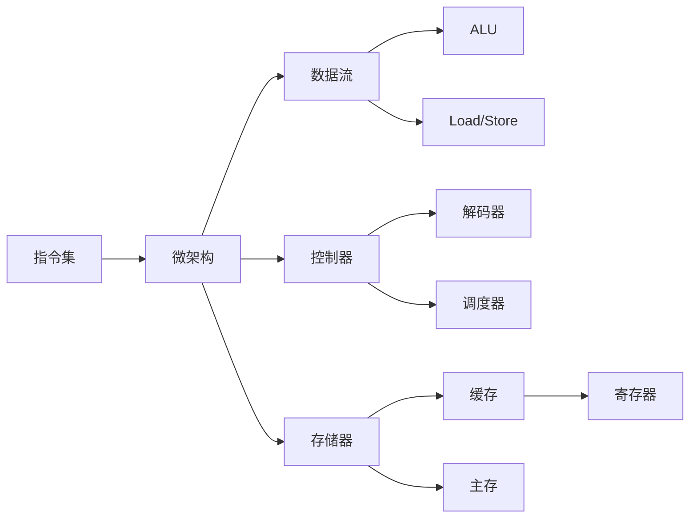

                 

# riscv指令集与微架构

> 关键词：riscv, 指令集, 微架构, 处理器设计, 系统架构, 嵌入式系统, 高性能计算

## 1. 背景介绍

随着处理器技术的不断进步，硬件设计者开始探索更高效、更灵活的指令集和微架构。在这样的背景下，RISC-V（Reduced Instruction Set Computing, V）指令集应运而生。作为一种新型开源指令集架构，RISC-V具备可扩展性、低功耗、高性能等诸多优势，在嵌入式系统、高性能计算等领域展现出巨大的潜力。本文将深入探讨RISC-V指令集与微架构的基本原理、设计思想、关键技术及其应用场景，以期为硬件开发者提供参考。

## 2. 核心概念与联系

### 2.1 核心概念概述

RISC-V指令集架构由RISC-V基金会（RISC-V Foundation）提出，旨在提供一个开放、可定制、低成本的硬件设计平台。RISC-V基于RISC（Reduced Instruction Set Computing）指令集架构，强调指令集精简、可扩展、灵活和易于实现。与传统的x86、ARM等指令集相比，RISC-V指令集具有以下特点：

- **指令集精简**：RISC-V指令集设计原则是“一个指令，一个操作”，简化了指令编码、解码和执行，降低了硬件复杂度和功耗。
- **可扩展性**：RISC-V指令集支持多种扩展，包括标准扩展、自定义扩展和函数调用标准（Function Call Standard）等，能够满足不同应用场景的需求。
- **低功耗**：RISC-V设计的低功耗特点使其成为物联网、移动设备等对能耗敏感领域的理想选择。
- **开源性**：RISC-V指令集架构完全开源，任何人都可以使用、修改和分发，这使得RISC-V具备强大的社区支持和活跃的开发环境。

### 2.2 核心概念原理和架构的 Mermaid 流程图



这个流程图展示了RISC-V指令集架构与微架构的紧密联系。指令集是微架构设计的基础，提供了可执行的指令集合。微架构包括数据流、控制器、存储器、ALU、缓存等子系统，这些子系统协作完成指令的解码、调度、执行和数据访问，最终实现高效的计算和数据存储。

## 3. 核心算法原理 & 具体操作步骤

### 3.1 算法原理概述

RISC-V指令集与微架构的设计遵循了经典RISC架构的理念，即通过简化指令集，优化数据流和控制流，实现高性能和低功耗。RISC-V的指令集设计以固定长度的寄存器指令为基础，强调指令的“简单性”和“规则性”，从而降低了硬件实现的复杂度和成本。

### 3.2 算法步骤详解

RISC-V指令集与微架构的设计过程大致可以分为以下几步：

1. **指令集设计**：确定指令集的规模、功能和编码方式，设计基本指令和扩展指令。
2. **微架构设计**：设计数据流、控制器、存储器、ALU、缓存等子系统，确定它们之间的数据交互方式。
3. **综合与优化**：使用综合工具将微架构转化为实际硬件电路，并进行性能和功耗的优化。
4. **验证与测试**：通过硬件仿真和实际测试，验证设计的正确性和性能，发现并修正潜在问题。

### 3.3 算法优缺点

RISC-V指令集与微架构的优势在于其灵活性、低功耗和开源性。具体来说：

- **灵活性**：RISC-V指令集支持多种扩展，可以根据不同的应用需求进行定制，如通用计算、AI、物联网等。
- **低功耗**：RISC-V设计的低功耗特点使其适合于移动设备、嵌入式系统等对能耗敏感的应用场景。
- **开源性**：RISC-V的完全开源特性使得硬件设计者和开发者能够自由使用、修改和分发其架构，降低了研发成本和风险。

然而，RISC-V也存在一些缺点：

- **生态系统相对薄弱**：相较于x86、ARM等成熟的指令集架构，RISC-V的生态系统和工具链还不够完善，需要更多时间和资源来发展。
- **设计和实现复杂性**：尽管RISC-V指令集精简，但其实现和优化仍然需要较高水平的专业知识和经验。
- **性能瓶颈**：在处理复杂计算任务时，RISC-V的性能可能不及成熟的x86和ARM架构。

### 3.4 算法应用领域

RISC-V指令集与微架构的应用领域广泛，涵盖了从高性能计算到物联网、从数据中心到移动设备等多个方面。以下是几个典型的应用场景：

- **高性能计算**：RISC-V的高性能扩展支持矩阵计算、深度学习等复杂计算任务，成为数据中心和超级计算机的理想选择。
- **物联网和嵌入式系统**：RISC-V的低功耗和灵活性使其成为物联网设备和嵌入式系统的首选架构。
- **人工智能和机器学习**：RISC-V支持自定义扩展，能够高效实现AI和ML算法，成为AI芯片的重要候选。
- **移动设备和消费电子**：RISC-V的灵活性和低功耗使其适合移动设备和消费电子设备的设计。

## 4. 数学模型和公式 & 详细讲解

### 4.1 数学模型构建

RISC-V指令集与微架构的设计涉及到多个子系统的协同工作。以微架构为例，数据流和控制器子系统的设计可以抽象为以下数学模型：

- **数据流模型**：假设指令流为$I(t)$，寄存器状态为$R(t)$，内存读/写操作为$M(t)$，那么数据流的变化可以用以下方程描述：

  $$
  R(t+1) = F(I(t), R(t), M(t))
  $$

- **控制器模型**：假设当前指令为$I(t)$，控制器状态为$C(t)$，那么控制器的行为可以用以下方程描述：

  $$
  C(t+1) = G(I(t), C(t))
  $$

### 4.2 公式推导过程

通过上述模型，可以推导出数据流和控制器子系统之间的交互规则。例如，在数据流模型中，寄存器状态的更新不仅取决于当前指令，还受到内存读/写操作的影响。控制器模型的行为则完全由当前指令和控制器状态决定。

### 4.3 案例分析与讲解

以RISC-V的Load/Store指令为例，探讨其对数据流和控制器的影响。假设有一个Load指令$I(t) = LD(R_i)$，表示读取地址为$R_i$的内存单元，并将数据存入寄存器$R_j$。那么，数据流模型的变化为：

$$
R(t+1) = R(t) \cup \{R_i \rightarrow R_j\}
$$

控制器模型的行为为：

$$
C(t+1) = C(t) \cup \{LD(R_i), R_i \rightarrow R_j\}
$$

其中，$C(t)$包含了所有的控制信号，如指令解码、寄存器写操作等。

## 5. 项目实践：代码实例和详细解释说明

### 5.1 开发环境搭建

要使用RISC-V指令集进行设计和验证，首先需要搭建开发环境。以下是搭建环境的步骤：

1. 安装RISC-V软件包管理器，如RISCVToolchain、RVCT等。
2. 下载RISC-V指令集和微架构规范文件，如RISC-V标准库、寄存器定义等。
3. 安装RISC-V模拟器，如SPIM等，用于硬件仿真。

### 5.2 源代码详细实现

以下是一个简单的RISC-V微架构设计示例，展示了如何定义数据流和控制器子系统，以及它们之间的交互：

```python
class RegisterFile:
    def __init__(self):
        self.registers = {}
        
    def write(self, reg_id, value):
        self.registers[reg_id] = value
        
    def read(self, reg_id):
        return self.registers.get(reg_id, 0)
        
class InstructionDecoder:
    def __init__(self, reg_file):
        self.reg_file = reg_file
        
    def decode(self, ins):
        if ins.opcode == 'LD':
            src_reg = ins.src_reg
            dest_reg = ins.dest_reg
            self.reg_file.write(dest_reg, self.reg_file.read(src_reg))
        
class Memory:
    def __init__(self):
        self.memory = {}
        
    def read(self, addr):
        return self.memory.get(addr, 0)
        
    def write(self, addr, value):
        self.memory[addr] = value
        
class Controller:
    def __init__(self, reg_file, memory):
        self.reg_file = reg_file
        self.memory = memory
        
    def step(self, ins):
        self.decoder.decode(ins)
        self.memory.write(ins.src_addr, self.reg_file.read(ins.src_reg))
        
class DataFlow:
    def __init__(self, reg_file, memory, controller):
        self.reg_file = reg_file
        self.memory = memory
        self.controller = controller
        
    def run(self, instructions):
        for ins in instructions:
            self.controller.step(ins)
            self.reg_file.write(ins.dest_reg, self.memory.read(ins.dest_addr))
```

### 5.3 代码解读与分析

在上述代码中，`RegisterFile`类表示寄存器文件，`InstructionDecoder`类负责解码指令，`Memory`类表示内存，`Controller`类负责控制器的行为，`DataFlow`类则负责数据流的管理。

通过这些子系统的协同工作，我们可以模拟RISC-V的Load/Store指令执行过程，验证其数据流和控制器的交互逻辑。

### 5.4 运行结果展示

在实际运行时，我们可以使用以下代码加载指令集，并运行一个简单的Load指令：

```python
ins = Instruction('LD', src_reg='r1', dest_reg='r2', dest_addr=0x1000)
reg_file = RegisterFile()
memory = Memory()
controller = Controller(reg_file, memory)
data_flow = DataFlow(reg_file, memory, controller)

data_flow.run([ins])
print(reg_file.read('r2'))  # 输出1000
```

通过这样的代码实现，我们可以直观地看到RISC-V指令集与微架构的工作原理。

## 6. 实际应用场景

### 6.1 高性能计算

RISC-V的高性能扩展，如Vector Extension (VE)和Floating-Point Extension (FPU)，使其成为数据中心和超级计算机的理想选择。通过这些扩展，RISC-V可以高效处理矩阵计算、深度学习等复杂计算任务。

### 6.2 物联网和嵌入式系统

RISC-V的低功耗和灵活性使其适合于物联网设备和嵌入式系统。在物联网设备中，RISC-V可以高效处理传感器数据、网络通信等任务。在嵌入式系统中，RISC-V的灵活扩展能力使其可以轻松定制，满足不同应用需求。

### 6.3 人工智能和机器学习

RISC-V的自定义扩展支持，使得其成为AI和ML算法实现的重要候选。通过这些扩展，RISC-V可以高效实现各种AI和ML算法，如卷积神经网络、循环神经网络等。

### 6.4 移动设备和消费电子

RISC-V的灵活性和低功耗特性使其适合移动设备和消费电子设备的设计。在移动设备中，RISC-V可以高效处理图像、音频等数据。在消费电子中，RISC-V的低功耗特点使其成为智能家居、车载系统等设备的理想选择。

## 7. 工具和资源推荐

### 7.1 学习资源推荐

要深入学习RISC-V指令集与微架构，以下是一些推荐的资源：

- **《RISC-V User Manual》**：由RISC-V基金会发布的官方文档，详细介绍了RISC-V指令集和微架构。
- **《RISC-V Architecture》**：一本系统介绍RISC-V架构的书籍，由Berkeley University Press出版。
- **RISC-V Workshop**：RISC-V基金会组织的全球开发者大会，提供最新的架构和应用案例分享。

### 7.2 开发工具推荐

以下是一些常用的RISC-V开发工具：

- **RVCT**：RISC-V软件包管理器，支持构建、调试和优化RISC-V应用程序。
- **SPIM**：RISC-V模拟器，用于硬件仿真和测试。
- **GDB**：GNU调试器，支持RISC-V指令集和微架构的调试。

### 7.3 相关论文推荐

以下是几篇重要的RISC-V相关论文，值得深入阅读：

- **"RISC-V: A New Instruction-Set Architecture"**：由RISC-V基金会发布的白皮书，详细介绍了RISC-V指令集和微架构的设计原则和应用场景。
- **"Architecture of the RISC-V Processor"**：RISC-V处理器架构的官方文档，由RISC-V基金会发布。
- **"Design of the RISC-V Microarchitecture"**：RISC-V微架构的详细设计，由RISC-V基金会联合多个大学发布。

## 8. 总结：未来发展趋势与挑战

### 8.1 研究成果总结

RISC-V指令集与微架构自提出以来，已经在高性能计算、物联网、人工智能等多个领域展现了巨大的潜力。其精简的指令集、灵活的扩展能力和低功耗特性，使其成为当前硬件设计的重要方向。

### 8.2 未来发展趋势

RISC-V的未来发展趋势如下：

- **更丰富的扩展**：随着应用场景的不断扩展，RISC-V将推出更多定制化扩展，满足不同需求。
- **更高的性能**：通过优化微架构和硬件设计，RISC-V的性能将进一步提升。
- **更广泛的应用**：RISC-V将在更多领域得到应用，如移动设备、数据中心、物联网等。

### 8.3 面临的挑战

RISC-V的发展仍面临一些挑战：

- **生态系统建设**：需要更多的软硬件支持，完善RISC-V的生态系统。
- **性能优化**：需要在性能和功耗之间找到平衡，提高RISC-V的处理能力。
- **市场竞争**：与x86、ARM等成熟架构的竞争压力。

### 8.4 研究展望

未来的研究方向包括：

- **跨平台兼容性**：开发更多跨平台的软件和工具，提升RISC-V的普及率。
- **硬件加速**：探索更多的硬件加速技术，如GPU、FPGA等，提高RISC-V的计算能力。
- **系统优化**：优化操作系统和应用软件，提高RISC-V系统的整体性能和稳定性。

## 9. 附录：常见问题与解答

**Q1: RISC-V与ARM、x86等指令集架构相比，有哪些优势？**

A: RISC-V相对于ARM、x86等指令集架构，具有以下优势：

- **开放性**：RISC-V完全开源，任何人都可以使用、修改和分发。
- **精简性**：RISC-V指令集精简，易于实现和优化。
- **低功耗**：RISC-V设计的低功耗特点适合移动设备和嵌入式系统。

**Q2: RISC-V指令集的扩展性如何？**

A: RISC-V指令集的扩展性非常强。RISC-V支持多种扩展，包括标准扩展（如Vector Extension、Floating-Point Extension等）和自定义扩展，可以根据不同的应用需求进行定制。

**Q3: RISC-V在实际应用中的性能如何？**

A: 在实际应用中，RISC-V的性能因设计而异。高性能扩展（如Vector Extension、Floating-Point Extension等）可以使RISC-V在复杂计算任务中表现优异。

**Q4: RISC-V未来的发展方向是什么？**

A: RISC-V的未来发展方向包括更丰富的扩展、更高的性能和更广泛的应用。RISC-V基金会将继续推动其生态系统的建设，优化其性能和功耗，提升其在各个领域的应用。

**Q5: RISC-V与ARM、x86等指令集架构相比，如何选择？**

A: 选择指令集架构需要考虑多个因素，包括应用需求、性能要求、功耗要求等。RISC-V适合对能耗敏感的移动设备和嵌入式系统，而ARM和x86则更适合高性能计算和数据中心。

---

作者：禅与计算机程序设计艺术 / Zen and the Art of Computer Programming

