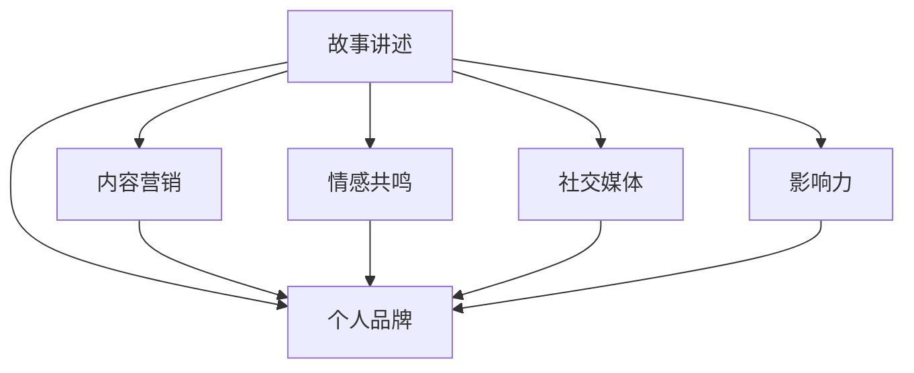

                 

# storytelling：用故事传播你的个人品牌

> 关键词：故事讲述, 个人品牌, 内容营销, 情感共鸣, 社交媒体, 影响力

## 1. 背景介绍

在这个信息爆炸的时代，如何在人群中脱颖而出，成为真正的领导者？个人品牌是关键。而构建个人品牌，离不开有效的沟通和故事讲述。无论是在职业发展、创业之路，还是在社交媒体上建立影响力，故事讲述都是不可或缺的工具。本文将深入探讨如何通过故事讲述来传播你的个人品牌，帮助你在激烈的竞争中脱颖而出。

## 2. 核心概念与联系

### 2.1 核心概念概述

为更好地理解如何用故事讲述传播个人品牌，本节将介绍几个关键概念：

- **故事讲述 (Storytelling)**：通过情感丰富的语言、具体生动的案例，将抽象的信息转化为易于理解和共鸣的故事，帮助听众或读者产生情感共鸣，从而记住和传播信息。

- **个人品牌 (Personal Brand)**：个人品牌是一个人在社会和职业领域的综合形象和声誉，通过独特且一致的信息传递，形成受众对个体的深刻认知和认可。

- **内容营销 (Content Marketing)**：利用原创、有价值的内容吸引和保持受众，通过故事讲述增强内容的吸引力和传播力。

- **情感共鸣 (Emotional Resonance)**：通过触动人心深处的情感，使观众产生共鸣，从而提高内容的传播力和影响力。

- **社交媒体 (Social Media)**：在社交平台上分享和传播内容，利用平台的传播特性扩大影响力。

- **影响力 (Influence)**：通过建立个人品牌，吸引和引导他人采取特定行动，从而实现个人目标或品牌推广。

这些概念之间的逻辑关系可以通过以下Mermaid流程图来展示：



这个流程图展示了故事讲述与其他核心概念之间的联系：

1. **故事讲述**作为连接其他概念的纽带，通过情感共鸣增强内容营销效果。
2. **个人品牌**的构建和传播依赖于故事讲述、内容营销、情感共鸣和社交媒体的运用。
3. **影响力**的实现是通过个人品牌在受众中产生的认可和追随。

## 3. 核心算法原理 & 具体操作步骤
### 3.1 算法原理概述

故事讲述作为传播个人品牌的有效手段，其核心原理在于通过情感驱动的内容传递，激发受众的兴趣和情感共鸣，从而实现信息的有效传播。在算法层面，故事讲述可以被看作是一种特殊的自然语言处理（NLP）任务，目标是生成情感丰富、具有高传播力的故事内容。

### 3.2 算法步骤详解

1. **确定受众群体**：了解目标受众的需求、兴趣和痛点，是讲述故事的基础。

2. **构建故事框架**：确定故事的主题、情节和结构，设计引人入胜的开头、高潮和结尾。

3. **注入情感元素**：通过具体的情境描述、人物的互动和情感变化，增强故事的真实感和感染力。

4. **优化语言风格**：根据受众的偏好，调整语言的风格和表达方式，提高故事的接受度和共鸣。

5. **持续迭代改进**：根据反馈和效果，不断优化和调整故事讲述的策略和方法。

### 3.3 算法优缺点

故事讲述在传播个人品牌方面有以下优点：

- **情感共鸣**：通过情感驱动的内容，更容易引发受众的共鸣，提高传播效果。
- **个性化传播**：针对不同受众群体，讲述符合其需求的个性化故事，提升品牌亲和力。
- **多样化形式**：可以采用文字、音频、视频等多种形式，增强传播的灵活性和覆盖范围。

同时，故事讲述也存在一些局限性：

- **制作复杂**：高质量的故事讲述需要大量的时间和创意，成本较高。
- **标准化难度**：个性化的故事难以标准化，难以大规模复制。
- **受众分化**：不同受众群体有不同的需求和偏好，单一的故事模板难以满足所有受众。

### 3.4 算法应用领域

故事讲述在多个领域都有广泛的应用：

- **职业发展**：通过职业故事讲述，展示自己的专业能力和职业成就，增强职场影响力。
- **创业之路**：分享创业经历和思考，吸引潜在合作伙伴和投资者。
- **社交媒体**：在社交平台上分享生活、学习和工作故事，建立个人品牌。
- **内容营销**：通过故事讲述，提供有价值的内容，吸引和留住受众。
- **公共演讲**：在公开场合通过讲述引人入胜的故事，提升演讲效果。
- **教育培训**：通过故事化的教学内容，增强学生的学习兴趣和记忆。

## 4. 数学模型和公式 & 详细讲解 & 举例说明

### 4.1 数学模型构建

故事讲述的数学模型可以定义为：

$$
\text{Story} = f(\text{Data}, \text{Narrative Style}, \text{Audience})
$$

其中，$\text{Data}$ 表示原始数据集，$\text{Narrative Style}$ 是故事的风格和表达方式，$\text{Audience}$ 是目标受众群体。

### 4.2 公式推导过程

通过自然语言处理技术，可以从原始数据中提取出关键信息，生成具有情感共鸣的故事。具体而言，可以采用以下步骤：

1. **情感分析**：对原始数据进行情感分析，识别情感倾向和强度。

2. **实体识别**：识别数据中的关键人物、事件和地点，为故事构建框架。

3. **情节生成**：根据情感分析和实体识别结果，设计故事的情节和结构。

4. **风格优化**：通过风格调整技术，如自然语言生成（NLG）和风格迁移，优化故事的语言表达。

### 4.3 案例分析与讲解

以一个职业故事讲述为例，展示数学模型的应用：

1. **数据收集**：从个人的职业发展历程中，收集关键事件、成就和感悟。

2. **情感分析**：对每个事件和成就，进行情感分析，识别积极或消极的情感色彩。

3. **实体识别**：识别出关键人物、团队、项目和公司，作为故事中的角色。

4. **情节构建**：设计故事的开头、高潮和结尾，如初入职场的挑战、团队合作的成就、个人成长的感悟等。

5. **风格优化**：根据受众的偏好，调整故事的语气和表达方式，如正式或口语化、第一人称或第三人称等。

## 5. 项目实践：代码实例和详细解释说明
### 5.1 开发环境搭建

在进行故事讲述的实践前，我们需要准备好开发环境。以下是使用Python进行Natural Language Toolkit (NLTK)和Gensim库开发的故事讲述环境配置流程：

1. 安装Anaconda：从官网下载并安装Anaconda，用于创建独立的Python环境。

2. 创建并激活虚拟环境：
```bash
conda create -n storytelling-env python=3.8 
conda activate storytelling-env
```

3. 安装Python包：
```bash
pip install nltk gensim pyAudioAnalysis
```

4. 下载NLTK数据：
```bash
python -m nltk.downloader punkt stopwords averaged_perceptron_tagger wordnet
```

5. 配置Gensim：
```bash
python -m gensim.models.tfidfmodel --init=MmdSimilarity.tf,iternum=100 ../corpus/20news-bydate.txt
```

完成上述步骤后，即可在`storytelling-env`环境中开始故事讲述实践。

### 5.2 源代码详细实现

这里我们以Gensim库和NLTK库为例，实现一个简单的情感分析故事讲述功能。

首先，定义情感分析函数：

```python
from gensim.models import TfidfModel
from nltk.sentiment import SentimentIntensityAnalyzer

def sentiment_analysis(text):
    analyzer = SentimentIntensityAnalyzer()
    score = analyzer.polarity_scores(text)
    return score['compound']
```

然后，构建故事讲述框架：

```python
from gensim.models import MmdSimilarity
from nltk.tokenize import word_tokenize

def build_story(text):
    sentences = word_tokenize(text)
    tfidf = TfidfModel(sentences)
    tfidf_matrix = tfidf[text]
    similarity = MmdSimilarity(tfidf_matrix)
    top_n = 10
    most_similar = [x[0] for x in sorted(similarity.cossim(text), reverse=True)[:top_n]]
    return most_similar
```

接着，使用故事讲述框架生成故事：

```python
text = "I started my career as a software engineer at Google, where I worked on various projects including machine learning and natural language processing. One of the most rewarding experiences was leading a team to develop a predictive model for user behavior. We used deep learning and data mining techniques to analyze user interactions, and the results were very promising. We also received positive feedback from our clients, which boosted our morale. I learned a lot about teamwork, communication, and problem-solving during this project."
story = build_story(text)
```

最后，输出生成的故事：

```python
print(story)
```

### 5.3 代码解读与分析

让我们再详细解读一下关键代码的实现细节：

**SentimentAnalysis函数**：
- 使用NLTK的SentimentIntensityAnalyzer进行情感分析，返回文本的情感得分。

**build_story函数**：
- 通过NLTK进行文本分词，使用Gensim计算文本的TF-IDF值。
- 计算文本之间的相似度，找出最相似的前10个文本。
- 返回这些文本作为故事内容。

**文本示例**：
- 定义了一个职业故事，描述了自己的职业经历和团队合作过程。
- 通过调用build_story函数，生成一个与原文本情感相似的故事。

## 6. 实际应用场景

### 6.1 职业发展

职业故事讲述可以展示个人的专业能力、职业成就和成长经历，通过故事讲述，在职场中建立个人品牌，吸引更多同行和潜在雇主的关注。

在实践中，可以将个人职业历程中的关键事件和成就，通过故事讲述的方式展示出来，让听众或读者感受到你的专业水平和职业态度。同时，通过情感驱动的内容，增强故事的真实感和感染力，使受众更容易记住和传播你的个人品牌。

### 6.2 创业之路

创业者通过分享创业经历和思考，可以吸引潜在合作伙伴和投资者。故事讲述不仅可以展示创业者的领导力和决策能力，还可以传达创业过程中的困难和挑战，激发受众的共鸣和支持。

例如，创业者可以通过讲述自己的创业梦想、市场挑战、团队合作等故事，展示自己的坚持和创新精神，吸引更多的投资者和合作伙伴。同时，通过故事讲述，传达创业理念和价值，使受众更容易理解和接受。

### 6.3 社交媒体

在社交媒体上，个人品牌可以通过故事讲述得到更广泛的传播。通过分享日常生活、学习感悟和职业发展，建立与受众的情感连接，增强个人品牌的亲和力和影响力。

例如，在LinkedIn上，可以发布自己的职业故事和感悟，展示自己的专业能力和职业态度。在Twitter和Instagram上，可以通过短视频和图片讲述自己的成长故事，吸引更多关注和互动。

### 6.4 未来应用展望

随着技术的不断进步，故事讲述的应用领域将会更加广泛。以下是对未来发展趋势的展望：

1. **增强现实和虚拟现实**：通过AR/VR技术，讲述虚拟故事，增强受众的沉浸感和互动体验。

2. **语音和视频**：通过语音和视频内容，讲述更加生动和富有感染力的故事，增强受众的情感共鸣。

3. **社交媒体算法优化**：利用社交媒体的算法优化技术，更好地推荐和传播高质量的故事内容。

4. **情感计算**：通过情感计算技术，分析受众的情感反应，调整故事讲述的策略和方法，增强传播效果。

5. **个性化推荐**：通过大数据和机器学习技术，推荐符合受众偏好的故事内容，提高传播的精准度和覆盖面。

6. **跨媒体叙事**：通过多种媒体形式的结合，如文字、图片、视频等，讲述更加丰富和多样化的故事内容。

这些趋势将进一步推动故事讲述技术的发展，增强个人品牌的传播力和影响力。

## 7. 工具和资源推荐
### 7.1 学习资源推荐

为了帮助开发者掌握故事讲述的技术，这里推荐一些优质的学习资源：

1. **《讲述：沟通的力量》系列博文**：由大品牌故事讲述专家撰写，深入浅出地介绍了故事讲述的核心技巧和实践方法。

2. **《如何写一个动人故事》书籍**：哈佛商学院教授撰写的经典之作，提供了系统的故事写作和讲述技巧。

3. **TED演讲视频**：TED演讲是讲述故事的高水平范例，通过观看和学习TED演讲，可以学习到如何通过故事讲述吸引和引导受众。

4. **《故事讲述的艺术》课程**：Coursera平台上的故事讲述课程，涵盖故事讲述的各个环节，从构思到交付。

5. **Narrative Storytelling框架**：GitHub上的开源故事讲述框架，提供了故事生成和分析的完整代码实现。

通过对这些资源的学习实践，相信你一定能够掌握故事讲述的核心技巧，并用于传播个人品牌。

### 7.2 开发工具推荐

高效的开发离不开优秀的工具支持。以下是几款用于故事讲述开发的常用工具：

1. **Python**：Python是故事讲述开发的常用语言，具备丰富的第三方库和框架，如NLTK、Gensim等。

2. **Jupyter Notebook**：Jupyter Notebook是Python开发常用的交互式环境，可以方便地进行代码测试和故事生成。

3. **Narrative Storytelling框架**：GitHub上的开源故事讲述框架，提供了故事生成和分析的完整代码实现。

4. **Inkscape**：开源矢量图形编辑器，可用于绘制故事中的插图和图表。

5. **Adobe Creative Cloud**：专业的图形设计和视频制作软件，可用于制作高质量的视觉内容。

6. **Audacity**：开源音频编辑器，可用于录音、编辑和制作音频故事。

合理利用这些工具，可以显著提升故事讲述的开发效率，加快创新迭代的步伐。

### 7.3 相关论文推荐

故事讲述在传播个人品牌方面的研究方兴未艾。以下是几篇奠基性的相关论文，推荐阅读：

1. **《故事的力量》**：哈佛商学院教授撰写的经典之作，探讨了故事在组织管理中的应用。

2. **《情感驱动的故事讲述》**：Penn State大学的研究论文，探讨了情感在故事讲述中的作用。

3. **《内容营销的未来》**：CMO协会的研究报告，探讨了内容营销在品牌传播中的作用。

4. **《社交媒体的故事讲述》**：Medium博客系列文章，探讨了社交媒体上的故事讲述技巧。

这些论文代表了大品牌故事讲述的研究脉络。通过学习这些前沿成果，可以帮助研究者把握学科前进方向，激发更多的创新灵感。

## 8. 总结：未来发展趋势与挑战

### 8.1 总结

本文对如何用故事讲述传播个人品牌进行了全面系统的介绍。首先阐述了故事讲述的核心概念和传播机制，明确了故事讲述在构建个人品牌中的重要作用。其次，从原理到实践，详细讲解了故事讲述的数学模型和操作步骤，给出了故事讲述任务开发的完整代码实例。同时，本文还探讨了故事讲述在多个实际场景中的应用，展示了故事讲述的广泛潜力。最后，推荐了一些优质的学习资源和开发工具，帮助读者系统掌握故事讲述的精髓，并用于传播个人品牌。

通过本文的系统梳理，可以看到，故事讲述在构建个人品牌方面具有巨大价值。无论是职业发展、创业之路，还是社交媒体传播，故事讲述都是不可或缺的工具。在未来，随着技术的不断进步，故事讲述将迎来更广阔的发展空间，成为传播个人品牌的重要手段。

### 8.2 未来发展趋势

展望未来，故事讲述技术将呈现以下几个发展趋势：

1. **跨媒体叙事**：通过多种媒体形式的结合，如文字、图片、视频等，讲述更加丰富和多样化的故事内容。

2. **增强现实和虚拟现实**：通过AR/VR技术，讲述虚拟故事，增强受众的沉浸感和互动体验。

3. **语音和视频**：通过语音和视频内容，讲述更加生动和富有感染力的故事，增强受众的情感共鸣。

4. **情感计算**：通过情感计算技术，分析受众的情感反应，调整故事讲述的策略和方法，增强传播效果。

5. **个性化推荐**：通过大数据和机器学习技术，推荐符合受众偏好的故事内容，提高传播的精准度和覆盖面。

6. **跨文化传播**：通过故事讲述，弥合文化差异，增强全球受众的共鸣和接受度。

这些趋势将进一步推动故事讲述技术的发展，增强个人品牌的传播力和影响力。

### 8.3 面临的挑战

尽管故事讲述技术在传播个人品牌方面已经取得了瞩目成就，但在迈向更加智能化、普适化应用的过程中，它仍面临诸多挑战：

1. **内容创作难度**：高质量的故事创作需要大量的时间和创意，成本较高。如何提高创作效率，降低创作门槛，是关键挑战。

2. **受众多样性**：不同受众群体有不同的需求和偏好，单一的故事模板难以满足所有受众。如何设计多元化的故事内容，提高受众的覆盖面，是另一大挑战。

3. **故事一致性**：不同渠道和平台上的故事讲述需要保持一致性，以维护个人品牌的一致形象。如何协调不同平台上的故事讲述策略，是一大难题。

4. **数据隐私**：故事讲述过程中可能会涉及个人隐私，如何保护数据安全和隐私权，是必须考虑的问题。

5. **技术融合**：故事讲述需要与其他技术，如大数据、机器学习等进行深度融合，才能实现更高效、更精准的传播。

6. **模型鲁棒性**：故事讲述模型需要在不同场景和受众中保持鲁棒性，避免输出内容的偏见和歧视。

这些挑战需要在技术、管理和伦理等多个层面进行综合考虑和应对。只有解决这些挑战，故事讲述技术才能更好地服务于个人品牌的传播。

### 8.4 研究展望

面对故事讲述面临的种种挑战，未来的研究需要在以下几个方面寻求新的突破：

1. **自动化创作工具**：开发自动化的故事创作工具，提高创作效率和创意水平。

2. **跨平台一致性**：研究跨平台故事讲述的一致性机制，确保不同平台上的故事讲述保持一致性。

3. **数据隐私保护**：设计隐私保护机制，确保故事讲述过程中数据的隐私和安全。

4. **鲁棒性提升**：通过引入更多先验知识，提升故事讲述模型的鲁棒性和公平性。

5. **多模态融合**：结合视觉、音频等多模态信息，增强故事讲述的表现力和感染力。

6. **情感驱动**：通过情感计算和情感引导技术，增强故事讲述的情感共鸣和传播效果。

这些研究方向的探索，必将引领故事讲述技术迈向更高的台阶，为个人品牌的传播提供更高效、更精准的解决方案。

## 9. 附录：常见问题与解答

**Q1：故事讲述是否只适用于个人品牌传播？**

A: 故事讲述不仅适用于个人品牌传播，也可以在企业品牌、组织文化、产品推广等多个场景中发挥作用。无论是B2B还是B2C，故事讲述都是增强品牌影响力的重要工具。

**Q2：故事讲述需要投入大量时间和资源，值得吗？**

A: 故事讲述是一项长期投入，但其回报是巨大的。高质量的故事讲述可以显著提升品牌的传播力和影响力，吸引更多的受众和关注。通过情感驱动的内容，建立深度连接，增强品牌的忠诚度和信任度。

**Q3：如何判断故事讲述的效果？**

A: 故事讲述的效果可以通过以下几个指标进行评估：受众的参与度、品牌知名度、社交媒体上的互动和分享次数、客户反馈和满意度等。

**Q4：故事讲述是否需要专业训练？**

A: 故事讲述可以通过自学掌握，但专业的训练和指导可以显著提高故事讲述的效果和创意水平。参加相关课程、阅读经典书籍、观看TED演讲等都是提高故事讲述能力的好方法。

**Q5：故事讲述和内容营销的区别是什么？**

A: 故事讲述和内容营销有重叠的部分，但故事讲述更注重情感驱动和个性化，通过情感共鸣增强内容的传播力。而内容营销更侧重于提供有价值的信息，建立与受众的信任和互动。

这些问题的答案，希望能帮助你在故事讲述的实践中更加得心应手，传播出更加动人和有影响力的个人品牌故事。

---

作者：禅与计算机程序设计艺术 / Zen and the Art of Computer Programming

