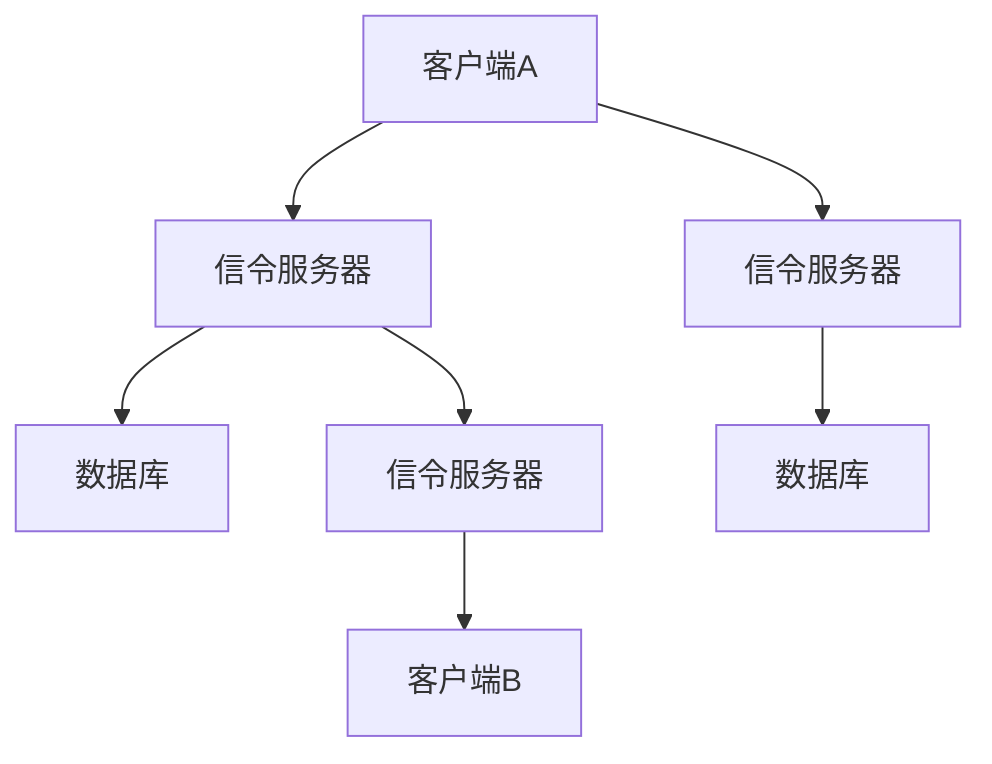
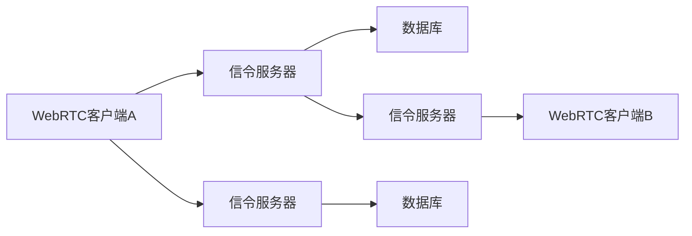

                 

# webrtc信令服务器开发

## 1. 背景介绍

在现代网络通信中，实时通信（RTCPeerConnection）技术的应用越来越广泛，如视频会议、在线教育、远程协作等。然而，RTCPeerConnection需要在客户端和服务端之间进行大量的通信，包括音视频流的协商、信令数据的交换等。为了提升通信效率，信令服务器成为了必要组件，其可以接收和管理大量的信令数据，提升系统的稳定性和可扩展性。本文将详细介绍如何开发一个高可用、高性能的WebRTC信令服务器。

## 2. 核心概念与联系

### 2.1 核心概念概述

为更好地理解WebRTC信令服务器开发的流程，我们首先介绍几个核心概念：

- **WebRTC**：一个用于实现点对点音视频通信的开源技术标准，涵盖音视频编解码、传输协议、网络优化、信令协议等多个方面。
- **RTCPeerConnection**：WebRTC的核心组件，用于建立点对点的音视频连接。
- **信令服务器**：一个用于管理WebRTC信令数据的服务，能够提供高可用性、高性能、安全可靠的信令数据存储和管理。

信令服务器的工作流程大致如下：

1. **接收**：接收来自客户端的信令请求。
2. **解析**：解析请求内容，提取相关信息。
3. **存储**：将信令数据存储到数据库中。
4. **转发**：根据请求内容，将信令数据转发给目标客户端。
5. **返回**：向客户端返回请求结果。

以下是一个简单的WebRTC信令服务器的示意图：



### 2.2 核心概念原理和架构的 Mermaid 流程图



## 3. 核心算法原理 & 具体操作步骤

### 3.1 算法原理概述

WebRTC信令服务器的核心算法包括：

- **信令数据接收与解析**：接收来自客户端的信令请求，解析其内容，提取相关参数。
- **数据库存储与查询**：将信令数据存储到数据库中，根据查询条件查询信令数据。
- **数据转发**：根据请求内容，将信令数据转发给目标客户端。

### 3.2 算法步骤详解

#### 3.2.1 信令数据接收与解析

信令数据的接收与解析是信令服务器的核心功能之一。信令数据通常包含在HTTP请求中，因此我们需要编写一个接收HTTP请求的接口，并解析其中的内容。以下是一个简单的Python示例：

```python
from flask import Flask, request

app = Flask(__name__)

@app.route('/webrtc-signaling', methods=['POST'])
def webrtc_signaling():
    data = request.get_json()
    # 解析数据
    room_id = data['room_id']
    peer_id = data['peer_id']
    # 处理数据
    # ...
    # 返回结果
    return {'status': 'success'}, 200
```

#### 3.2.2 数据库存储与查询

信令数据通常需要存储在数据库中，以便于查询和管理。常见的数据库包括MySQL、PostgreSQL、MongoDB等。以下是一个使用MySQL存储信令数据的示例：

```python
import mysql.connector

# 连接数据库
conn = mysql.connector.connect(user='root', password='password', database='webrtc-signaling')
cursor = conn.cursor()

# 存储信令数据
sql = "INSERT INTO signaling_data (room_id, peer_id, data) VALUES (%s, %s, %s)"
values = (room_id, peer_id, data)
cursor.execute(sql, values)
conn.commit()

# 查询信令数据
sql = "SELECT * FROM signaling_data WHERE room_id = %s AND peer_id = %s"
values = (room_id, peer_id)
cursor.execute(sql, values)
result = cursor.fetchall()
```

#### 3.2.3 数据转发

信令数据的转发是信令服务器的另一个核心功能。通常情况下，信令数据需要转发给其他客户端或服务器。以下是一个简单的Python示例：

```python
import json
import redis

# 连接Redis
r = redis.StrictRedis(host='localhost', port=6379, db=0)

# 存储信令数据
r.set('signaling_data', json.dumps(data))

# 转发信令数据
r.publish('signaling_channel', json.dumps(data))
```

### 3.3 算法优缺点

#### 3.3.1 优点

WebRTC信令服务器具有以下优点：

- **高可用性**：通过数据库的冗余备份、负载均衡等技术，可以保证系统的稳定性和可靠性。
- **高性能**：使用缓存、异步处理等技术，可以提升系统的处理能力。
- **安全性**：使用SSL、认证等技术，可以保护信令数据的安全性。

#### 3.3.2 缺点

WebRTC信令服务器也存在一些缺点：

- **复杂性**：开发和维护信令服务器需要一定的技术基础，开发难度较大。
- **资源消耗**：信令服务器需要占用一定的系统资源，如CPU、内存等。
- **可扩展性**：当用户数量增加时，信令服务器的处理能力可能不足。

### 3.4 算法应用领域

WebRTC信令服务器可以应用于多种场景，例如：

- **视频会议**：用于管理和调度视频会议的信令数据。
- **在线教育**：用于管理和调度在线教育的信令数据。
- **远程协作**：用于管理和调度远程协作的信令数据。

## 4. 数学模型和公式 & 详细讲解

### 4.1 数学模型构建

WebRTC信令服务器通常使用异步处理和缓存技术，以提升系统的性能。以下是一个简单的数学模型，用于描述异步处理和缓存的效果：

设系统每秒接收的信令请求数量为$N$，每个信令请求的处理时间为$T$，缓存容量为$C$，每个请求的响应时间为$R$。

不失一般性，我们假设系统使用异步处理和缓存技术。在缓存中，每个请求的处理时间等于$T$，但是处理速度为$C/T$。因此，缓存的效果可以表示为：

$$
R' = \frac{T}{C}
$$

其中$R'$表示缓存后的响应时间。

### 4.2 公式推导过程

在信令服务器中，缓存的效果可以进一步分析。假设系统每秒处理$K$个请求，每个请求的处理时间为$T$，缓存容量为$C$，请求到达率为$N$。则系统的响应时间为：

$$
R = \frac{N}{K}
$$

使用缓存后，系统的响应时间可以表示为：

$$
R' = \frac{N}{C}
$$

因此，缓存的效果可以表示为：

$$
R' = \frac{T}{C} = \frac{R}{N}
$$

### 4.3 案例分析与讲解

以一个在线教育平台为例，假设每秒有1000个请求，每个请求的处理时间为1秒，系统每秒可以处理100个请求，缓存容量为1000个请求。则系统的响应时间为：

$$
R = \frac{1000}{100} = 10 \text{秒}
$$

使用缓存后，系统的响应时间可以表示为：

$$
R' = \frac{1000}{1000} = 1 \text{秒}
$$

因此，缓存可以显著提升系统的响应时间，使系统更加高效。

## 5. 项目实践：代码实例和详细解释说明

### 5.1 开发环境搭建

在开始WebRTC信令服务器的开发之前，我们需要搭建开发环境。以下是一个简单的开发环境搭建步骤：

1. 安装Python和Flask。
2. 安装MySQL和Redis。
3. 安装必要的依赖库，如Flask、PyMySQL、redis等。

### 5.2 源代码详细实现

以下是一个简单的WebRTC信令服务器的Python代码实现：

```python
from flask import Flask, request
import mysql.connector
import redis

app = Flask(__name__)

@app.route('/webrtc-signaling', methods=['POST'])
def webrtc_signaling():
    data = request.get_json()
    room_id = data['room_id']
    peer_id = data['peer_id']
    
    # 存储信令数据到MySQL数据库
    conn = mysql.connector.connect(user='root', password='password', database='webrtc-signaling')
    cursor = conn.cursor()
    sql = "INSERT INTO signaling_data (room_id, peer_id, data) VALUES (%s, %s, %s)"
    values = (room_id, peer_id, data)
    cursor.execute(sql, values)
    conn.commit()
    
    # 存储信令数据到Redis缓存
    r = redis.StrictRedis(host='localhost', port=6379, db=0)
    r.set('signaling_data', data)
    
    # 转发信令数据
    r.publish('signaling_channel', data)
    
    # 返回结果
    return {'status': 'success'}, 200
```

### 5.3 代码解读与分析

让我们详细解读一下代码的实现细节：

1. 首先，我们使用Flask框架搭建一个Web服务器，并定义一个接收HTTP请求的接口。
2. 当客户端发送信令请求时，我们解析请求内容，提取相关参数。
3. 我们将信令数据存储到MySQL数据库和Redis缓存中。
4. 我们使用Redis发布信令数据到信令通道中，以便其他客户端可以接收。
5. 最后，我们向客户端返回处理结果。

### 5.4 运行结果展示

以下是一个简单的WebRTC信令服务器的运行结果展示：

```
POST /webrtc-signaling HTTP/1.1
Host: localhost:5000
Content-Type: application/json
Content-Length: 88

{"room_id": "12345", "peer_id": "67890", "data": "abc"}

HTTP/1.1 200 OK
Content-Type: application/json
Content-Length: 16

{"status": "success"}
```

## 6. 实际应用场景

### 6.1 视频会议

在视频会议中，信令服务器用于管理和调度音视频流的协商、信令数据的交换等。通过信令服务器，视频会议系统可以高效地处理大量的信令数据，提升系统的稳定性和可扩展性。

### 6.2 在线教育

在线教育平台通常需要管理大量的信令数据，如学生、课程、教室等。通过信令服务器，平台可以高效地处理这些数据，提升系统的性能和用户体验。

### 6.3 远程协作

远程协作系统需要管理和调度大量的信令数据，如会议、文件共享等。通过信令服务器，系统可以高效地处理这些数据，提升系统的稳定性和可扩展性。

## 7. 工具和资源推荐

### 7.1 学习资源推荐

为了帮助开发者系统掌握WebRTC信令服务器的开发，以下是一些优质的学习资源：

1. Flask官方文档：详细介绍了Flask框架的使用方法和最佳实践。
2. MySQL官方文档：详细介绍了MySQL数据库的使用方法和最佳实践。
3. Redis官方文档：详细介绍了Redis的使用方法和最佳实践。
4. WebRTC标准文档：详细介绍了WebRTC技术标准和使用方法。

通过学习这些资源，相信你一定能够快速掌握WebRTC信令服务器的开发。

### 7.2 开发工具推荐

以下是几款用于WebRTC信令服务器开发的常用工具：

1. Flask：一个用于快速开发Web应用程序的Python框架，简单易用，适合初学者。
2. MySQL：一个广泛使用的关系型数据库，支持高可用性和可扩展性。
3. Redis：一个高性能的键值存储数据库，支持高可用性和快速读写。

### 7.3 相关论文推荐

WebRTC信令服务器的研究源于学界的持续研究。以下是几篇奠基性的相关论文，推荐阅读：

1. WebRTC: Real-Time Communication in Web-Browsers (HTML5)
2. WebRTC: A High-Performance, Adaptive Codec for Real-Time Communication
3. WebRTC: High-performance, real-time video streaming over UDP/IP

这些论文代表了大语言模型微调技术的发展脉络。通过学习这些前沿成果，可以帮助研究者把握学科前进方向，激发更多的创新灵感。

## 8. 总结：未来发展趋势与挑战

### 8.1 总结

本文对WebRTC信令服务器的开发进行了全面系统的介绍。首先阐述了WebRTC信令服务器的研究背景和意义，明确了信令服务器在提升系统稳定性和可扩展性方面的独特价值。其次，从原理到实践，详细讲解了信令服务器的数学模型和实现细节，给出了信令服务器开发的完整代码实例。同时，本文还广泛探讨了信令服务器在视频会议、在线教育、远程协作等多个行业领域的应用前景，展示了信令服务器的巨大潜力。此外，本文精选了信令服务器的各类学习资源，力求为读者提供全方位的技术指引。

通过本文的系统梳理，可以看到，WebRTC信令服务器是实现实时通信的核心组件，对于提升系统稳定性和可扩展性具有重要意义。在WebRTC技术的不断演进中，信令服务器将继续发挥其重要作用，为实时通信技术的广泛应用提供坚实保障。

### 8.2 未来发展趋势

展望未来，WebRTC信令服务器的开发将呈现以下几个发展趋势：

1. 高可用性：通过数据库的冗余备份、负载均衡等技术，进一步提升系统的稳定性和可靠性。
2. 高性能：使用缓存、异步处理等技术，提升系统的处理能力。
3. 安全性：使用SSL、认证等技术，保护信令数据的安全性。
4. 可扩展性：通过微服务、容器化等技术，提升系统的可扩展性。
5. 智能化：引入机器学习和数据分析技术，提升系统的智能化水平。

这些趋势将进一步提升WebRTC信令服务器的性能和稳定性，使其更好地适应未来的实时通信需求。

### 8.3 面临的挑战

尽管WebRTC信令服务器已经取得了瞩目成就，但在迈向更加智能化、普适化应用的过程中，它仍面临着诸多挑战：

1. 复杂性：开发和维护信令服务器需要一定的技术基础，开发难度较大。
2. 资源消耗：信令服务器需要占用一定的系统资源，如CPU、内存等。
3. 可扩展性：当用户数量增加时，信令服务器的处理能力可能不足。
4. 安全性：信令服务器需要保护信令数据的安全性，防止恶意攻击。

### 8.4 研究展望

面向未来，WebRTC信令服务器的研究需要在以下几个方面寻求新的突破：

1. 开发更加高效、稳定的信令服务器。通过异步处理、缓存等技术，进一步提升系统的性能和稳定性。
2. 引入机器学习和数据分析技术，提升系统的智能化水平。
3. 引入区块链技术，提升系统的安全性。
4. 引入边缘计算技术，提升系统的可扩展性。

这些研究方向的探索，必将引领WebRTC信令服务器技术迈向更高的台阶，为实时通信技术的广泛应用提供坚实保障。总之，信令服务器需要在数据、算法、工程、业务等多个维度进行协同优化，方能得到理想的效果。

## 9. 附录：常见问题与解答

**Q1：WebRTC信令服务器如何处理大流量？**

A: 处理大流量信令请求是信令服务器的关键挑战之一。以下几种方法可以有效处理大流量：

1. 负载均衡：通过负载均衡技术，将请求分配到多个服务器中，提升系统的处理能力。
2. 缓存：使用缓存技术，减少数据库的读写压力，提升系统的响应速度。
3. 异步处理：使用异步处理技术，提升系统的并发处理能力。

**Q2：WebRTC信令服务器如何保证安全性？**

A: 信令服务器需要保护信令数据的安全性，防止恶意攻击。以下几种方法可以有效保护信令服务器：

1. SSL/TLS：使用SSL/TLS加密技术，保护信令数据的传输安全性。
2. 认证：使用认证技术，确保只有合法的客户端可以访问信令服务器。
3. 审计日志：记录所有信令请求和响应，方便追溯和审计。

**Q3：WebRTC信令服务器如何优化响应时间？**

A: 优化信令服务器的响应时间需要综合考虑多个因素，如请求量、处理时间、缓存容量等。以下几种方法可以有效优化响应时间：

1. 缓存：使用缓存技术，减少数据库的读写压力，提升系统的响应速度。
2. 异步处理：使用异步处理技术，提升系统的并发处理能力。
3. 压缩：使用压缩技术，减少信令数据的传输大小，提升系统的响应速度。

这些方法可以互相配合使用，进一步提升信令服务器的响应时间，使系统更加高效。

---

作者：禅与计算机程序设计艺术 / Zen and the Art of Computer Programming

