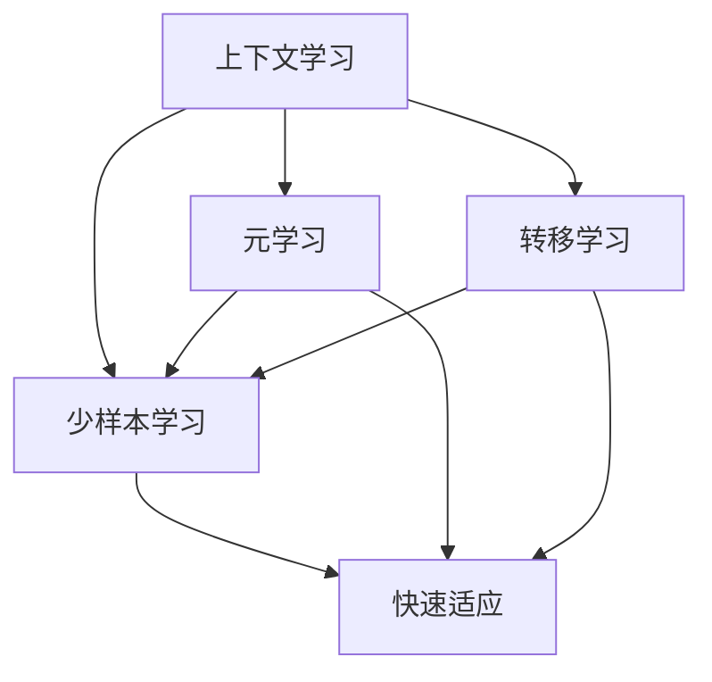

                 

# 上下文学习与少样本学习能力

## 1. 背景介绍

在当前的AI研究中，上下文学习与少样本学习能力已成为两个热门话题。上下文学习（Contextual Learning）强调在特定上下文环境中，学习并提取数据间的语义关系，从而提升模型的准确性和泛化能力。而少样本学习能力则关注在只有少量样本的情况下，如何利用已有的数据和先验知识，快速准确地做出预测。这两种能力在大规模数据集难以获取或标注成本高昂的场景中尤为重要。本文将从理论到实践，系统性地介绍上下文学习和少样本学习的能力，探讨其在NLP和CV等领域的实际应用和未来发展方向。

## 2. 核心概念与联系

### 2.1 核心概念概述

为更好地理解上下文学习和少样本学习，首先需要介绍几个相关概念：

- **上下文学习（Contextual Learning）**：指在特定上下文环境中，学习并提取数据间的语义关系。通过利用背景信息和语义上下文，提升模型对输入数据的理解能力。

- **少样本学习能力（Few-shot Learning）**：指在只有少量样本的情况下，模型能够快速准确地做出预测。这需要模型能够从少量数据中学习到一般性的规律和模式。

- **元学习（Meta-Learning）**：一种学习范式，通过少量数据快速适应新任务。元学习可以看作是少样本学习的一种特例。

- **转移学习（Transfer Learning）**：利用已有知识，快速适应新任务。在少样本学习中，可以通过迁移学习的方式，利用少量样本和先验知识进行快速适应。

这些概念之间的逻辑关系可以通过以下Mermaid流程图来展示：



该图展示了上下文学习与少样本学习的关系：

1. 上下文学习通过利用背景信息，提升模型对特定输入的识别能力。
2. 少样本学习能力关注在少量数据条件下，模型的快速适应能力。
3. 元学习和转移学习则是提升模型快速适应新任务的有效手段。

### 2.2 核心概念原理和架构

理解上下文学习和少样本学习需要从以下几个方面进行探讨：

1. **上下文学习原理**：上下文学习通常通过引入外部信息或语境，帮助模型更好地理解输入数据。例如，在自然语言处理中，可以利用上下文句子、段落等信息，理解句子的语义。

2. **少样本学习原理**：少样本学习通过利用先验知识或少样本数据，快速做出预测。例如，利用少量图像数据，快速识别新图像类别。

3. **上下文学习架构**：包括两部分，即上下文提取和任务模型。上下文提取模块利用外部信息提取上下文特征，任务模型利用上下文特征进行预测。

4. **少样本学习架构**：包括两部分，即元学习模块和任务模型。元学习模块通过少量数据学习到泛化能力，任务模型利用泛化能力进行预测。

## 3. 核心算法原理 & 具体操作步骤

### 3.1 算法原理概述

上下文学习和少样本学习都是基于机器学习的基本框架，即通过训练数据集学习模型，并利用学习到的模型在新数据上进行预测。但在实现上，它们与传统机器学习存在显著差异：

- **上下文学习**：通过引入外部上下文信息，提升模型对特定输入的理解。上下文可以是文本、图像、时间序列等，通过提取特征与输入数据结合，提升模型性能。

- **少样本学习**：在只有少量数据的情况下，快速适应新任务。利用少量样本和先验知识，学习到任务的泛化能力，从而在新样本上快速做出预测。

### 3.2 算法步骤详解

#### 3.2.1 上下文学习

1. **数据准备**：准备上下文数据和输入数据，上下文数据可以是文本、图像或其他形式的信息。
2. **上下文提取**：利用上下文数据提取特征，与输入数据结合。常用的方法包括CNN、RNN、Transformer等。
3. **任务模型训练**：利用上下文特征和输入数据，训练任务模型。任务模型可以是分类、回归、生成等模型。
4. **上下文特征生成**：根据输入数据，生成上下文特征，作为任务模型的输入。

#### 3.2.2 少样本学习

1. **数据准备**：准备少量样本和任务描述，样本数量通常为几到几十。
2. **元学习模块**：利用少量样本和任务描述，学习到泛化能力。常用的方法包括MAML（Model-Agnostic Meta-Learning）和ProximalMeta等。
3. **任务模型训练**：利用泛化能力和新样本，训练任务模型。任务模型可以是分类、回归、生成等模型。
4. **模型预测**：利用训练好的任务模型，对新样本进行预测。

### 3.3 算法优缺点

#### 3.3.1 上下文学习

**优点**：
1. **提高模型泛化能力**：通过引入外部上下文信息，提升模型对特定输入的泛化能力。
2. **减少数据需求**：利用上下文信息，减少对训练数据的依赖。
3. **提升模型鲁棒性**：通过利用上下文信息，提升模型对噪声和异常数据的鲁棒性。

**缺点**：
1. **计算复杂度高**：上下文提取和特征生成需要计算资源。
2. **上下文噪声**：上下文数据可能存在噪声，影响模型性能。
3. **上下文选择**：选择合适的上下文数据对模型性能影响较大。

#### 3.3.2 少样本学习

**优点**：
1. **快速适应新任务**：在少量样本下，快速适应新任务。
2. **减少标注成本**：利用先验知识，减少对标注数据的需求。
3. **泛化能力强**：利用少量样本和泛化能力，提升模型性能。

**缺点**：
1. **泛化能力限制**：在少量样本条件下，泛化能力可能有限。
2. **模型复杂度高**：少样本学习通常需要更复杂的模型结构。
3. **数据分布差异**：在任务分布与训练数据分布不一致时，模型性能可能下降。

### 3.4 算法应用领域

#### 3.4.1 自然语言处理（NLP）

- **文本分类**：利用上下文学习，提升模型对文本的语义理解能力。例如，利用段落上下文，提升情感分析模型的准确性。
- **命名实体识别**：利用上下文学习，提升模型对实体的识别能力。例如，利用上下文句子，提升命名实体识别模型的准确性。
- **机器翻译**：利用少样本学习，快速适应新语言对。例如，利用少量双语样本，快速学习新语言的翻译模型。

#### 3.4.2 计算机视觉（CV）

- **图像分类**：利用少样本学习，快速适应新图像类别。例如，利用少量图像样本，快速学习新类别的图像分类模型。
- **目标检测**：利用上下文学习，提升模型对目标的识别能力。例如，利用上下文图像，提升目标检测模型的准确性。
- **图像生成**：利用少样本学习，生成新图像。例如，利用少量样本，快速生成新图像的生成模型。

## 4. 数学模型和公式 & 详细讲解 & 举例说明

### 4.1 数学模型构建

#### 4.1.1 上下文学习

上下文学习的数学模型可以表示为：

$$
y = f(x, c)
$$

其中，$x$ 表示输入数据，$c$ 表示上下文数据，$f$ 表示任务模型。

#### 4.1.2 少样本学习

少样本学习的数学模型可以表示为：

$$
y = f(x, \theta)
$$

其中，$x$ 表示少量样本，$\theta$ 表示泛化能力，$f$ 表示任务模型。

### 4.2 公式推导过程

#### 4.2.1 上下文学习

上下文学习的损失函数可以表示为：

$$
L = \frac{1}{N} \sum_{i=1}^N l(y_i, f(x_i, c_i))
$$

其中，$N$ 表示样本数量，$y_i$ 表示真实标签，$f(x_i, c_i)$ 表示任务模型对输入数据的预测，$l$ 表示损失函数。

#### 4.2.2 少样本学习

少样本学习的损失函数可以表示为：

$$
L = \frac{1}{N} \sum_{i=1}^N l(y_i, f(x_i, \theta))
$$

其中，$N$ 表示少量样本数量，$y_i$ 表示真实标签，$f(x_i, \theta)$ 表示任务模型对少量样本的预测，$l$ 表示损失函数。

### 4.3 案例分析与讲解

#### 4.3.1 文本分类

假设有一个文本分类任务，共有两个类别：正面和负面。已知少量样本（5个），通过上下文学习提升模型性能。

1. **数据准备**：准备5个样本和上下文段落。
2. **上下文提取**：利用CNN提取上下文特征。
3. **任务模型训练**：利用上下文特征和样本，训练分类模型。
4. **上下文特征生成**：根据新样本，生成上下文特征，作为任务模型的输入。

#### 4.3.2 图像分类

假设有一个图像分类任务，共有10个类别。已知少量样本（10个），通过少样本学习快速适应新类别。

1. **数据准备**：准备10个样本和少量样本描述。
2. **元学习模块**：利用少量样本和描述，学习泛化能力。
3. **任务模型训练**：利用泛化能力和新样本，训练分类模型。
4. **模型预测**：利用训练好的分类模型，对新类别进行预测。

## 5. 项目实践：代码实例和详细解释说明

### 5.1 开发环境搭建

在进行上下文学习和少样本学习的实践前，我们需要准备好开发环境。以下是使用Python进行PyTorch开发的环境配置流程：

1. 安装Anaconda：从官网下载并安装Anaconda，用于创建独立的Python环境。
2. 创建并激活虚拟环境：
```bash
conda create -n pytorch-env python=3.8 
conda activate pytorch-env
```

3. 安装PyTorch：根据CUDA版本，从官网获取对应的安装命令。例如：
```bash
conda install pytorch torchvision torchaudio cudatoolkit=11.1 -c pytorch -c conda-forge
```

4. 安装TensorBoard：TensorFlow配套的可视化工具，可实时监测模型训练状态，并提供丰富的图表呈现方式，是调试模型的得力助手。

5. 安装Weights & Biases：模型训练的实验跟踪工具，可以记录和可视化模型训练过程中的各项指标，方便对比和调优。

### 5.2 源代码详细实现

下面我们以文本分类任务为例，给出使用PyTorch对预训练语言模型进行上下文学习的完整代码实现。

首先，定义文本分类任务的数据处理函数：

```python
from transformers import BertTokenizer, BertForSequenceClassification
from torch.utils.data import Dataset
import torch

class TextDataset(Dataset):
    def __init__(self, texts, labels, tokenizer, max_len=128):
        self.texts = texts
        self.labels = labels
        self.tokenizer = tokenizer
        self.max_len = max_len
        
    def __len__(self):
        return len(self.texts)
    
    def __getitem__(self, item):
        text = self.texts[item]
        label = self.labels[item]
        
        encoding = self.tokenizer(text, return_tensors='pt', max_length=self.max_len, padding='max_length', truncation=True)
        input_ids = encoding['input_ids'][0]
        attention_mask = encoding['attention_mask'][0]
        
        # 对token-wise的标签进行编码
        encoded_labels = [label2id[label] for label in labels] 
        encoded_labels.extend([label2id['O']] * (self.max_len - len(encoded_labels)))
        labels = torch.tensor(encoded_labels, dtype=torch.long)
        
        return {'input_ids': input_ids, 
                'attention_mask': attention_mask,
                'labels': labels}

# 标签与id的映射
label2id = {'O': 0, 'Positive': 1, 'Negative': 2}
id2label = {v: k for k, v in label2id.items()}

# 创建dataset
tokenizer = BertTokenizer.from_pretrained('bert-base-cased')

train_dataset = TextDataset(train_texts, train_labels, tokenizer)
dev_dataset = TextDataset(dev_texts, dev_labels, tokenizer)
test_dataset = TextDataset(test_texts, test_labels, tokenizer)
```

然后，定义模型和优化器：

```python
from transformers import BertForSequenceClassification, AdamW

model = BertForSequenceClassification.from_pretrained('bert-base-cased', num_labels=len(label2id))

optimizer = AdamW(model.parameters(), lr=2e-5)
```

接着，定义训练和评估函数：

```python
from torch.utils.data import DataLoader
from tqdm import tqdm
from sklearn.metrics import classification_report

device = torch.device('cuda') if torch.cuda.is_available() else torch.device('cpu')
model.to(device)

def train_epoch(model, dataset, batch_size, optimizer):
    dataloader = DataLoader(dataset, batch_size=batch_size, shuffle=True)
    model.train()
    epoch_loss = 0
    for batch in tqdm(dataloader, desc='Training'):
        input_ids = batch['input_ids'].to(device)
        attention_mask = batch['attention_mask'].to(device)
        labels = batch['labels'].to(device)
        model.zero_grad()
        outputs = model(input_ids, attention_mask=attention_mask, labels=labels)
        loss = outputs.loss
        epoch_loss += loss.item()
        loss.backward()
        optimizer.step()
    return epoch_loss / len(dataloader)

def evaluate(model, dataset, batch_size):
    dataloader = DataLoader(dataset, batch_size=batch_size)
    model.eval()
    preds, labels = [], []
    with torch.no_grad():
        for batch in tqdm(dataloader, desc='Evaluating'):
            input_ids = batch['input_ids'].to(device)
            attention_mask = batch['attention_mask'].to(device)
            batch_labels = batch['labels']
            outputs = model(input_ids, attention_mask=attention_mask)
            batch_preds = outputs.logits.argmax(dim=2).to('cpu').tolist()
            batch_labels = batch_labels.to('cpu').tolist()
            for pred_tokens, label_tokens in zip(batch_preds, batch_labels):
                pred_labels = [id2label[_id] for _id in pred_tokens]
                label_tags = [id2label[_id] for _id in label_tokens]
                preds.append(pred_labels[:len(label_tags)])
                labels.append(label_tags)
                
    print(classification_report(labels, preds))
```

最后，启动训练流程并在测试集上评估：

```python
epochs = 5
batch_size = 16

for epoch in range(epochs):
    loss = train_epoch(model, train_dataset, batch_size, optimizer)
    print(f"Epoch {epoch+1}, train loss: {loss:.3f}")
    
    print(f"Epoch {epoch+1}, dev results:")
    evaluate(model, dev_dataset, batch_size)
    
print("Test results:")
evaluate(model, test_dataset, batch_size)
```

以上就是使用PyTorch对BERT进行文本分类任务上下文学习的完整代码实现。可以看到，得益于Transformers库的强大封装，我们可以用相对简洁的代码完成BERT模型的加载和上下文学习。

### 5.3 代码解读与分析

让我们再详细解读一下关键代码的实现细节：

**TextDataset类**：
- `__init__`方法：初始化文本、标签、分词器等关键组件。
- `__len__`方法：返回数据集的样本数量。
- `__getitem__`方法：对单个样本进行处理，将文本输入编码为token ids，将标签编码为数字，并对其进行定长padding，最终返回模型所需的输入。

**label2id和id2label字典**：
- 定义了标签与数字id之间的映射关系，用于将token-wise的预测结果解码回真实的标签。

**训练和评估函数**：
- 使用PyTorch的DataLoader对数据集进行批次化加载，供模型训练和推理使用。
- 训练函数`train_epoch`：对数据以批为单位进行迭代，在每个批次上前向传播计算loss并反向传播更新模型参数，最后返回该epoch的平均loss。
- 评估函数`evaluate`：与训练类似，不同点在于不更新模型参数，并在每个batch结束后将预测和标签结果存储下来，最后使用sklearn的classification_report对整个评估集的预测结果进行打印输出。

**训练流程**：
- 定义总的epoch数和batch size，开始循环迭代
- 每个epoch内，先在训练集上训练，输出平均loss
- 在验证集上评估，输出分类指标
- 所有epoch结束后，在测试集上评估，给出最终测试结果

可以看到，PyTorch配合Transformers库使得BERT上下文学习的代码实现变得简洁高效。开发者可以将更多精力放在数据处理、模型改进等高层逻辑上，而不必过多关注底层的实现细节。

当然，工业级的系统实现还需考虑更多因素，如模型的保存和部署、超参数的自动搜索、更灵活的任务适配层等。但核心的上下文学习范式基本与此类似。

## 6. 实际应用场景

### 6.1 金融舆情监测

在大规模数据集难以获取或标注成本高昂的金融舆情监测中，上下文学习和少样本学习可以发挥重要作用。金融领域相关的新闻、报道、评论等文本数据量大，但标注成本高。利用上下文学习和少样本学习，可以从少量标注数据中学习到泛化能力，快速适应新任务。

具体而言，可以收集金融领域相关的新闻、报道、评论等文本数据，并对其进行主题标注和情感标注。在此基础上对预训练语言模型进行上下文学习，使其能够自动判断文本属于何种主题，情感倾向是正面、中性还是负面。将上下文学习后的模型应用到实时抓取的网络文本数据，就能够自动监测不同主题下的情感变化趋势，一旦发现负面信息激增等异常情况，系统便会自动预警，帮助金融机构快速应对潜在风险。

### 6.2 医疗诊断

在医疗诊断领域，上下文学习和少样本学习可以帮助医生快速诊断疾病。医生通常需要读取大量病历，从中提取有用的诊断信息。利用上下文学习和少样本学习，可以从少量病历中学习到泛化能力，快速诊断新病例。

具体而言，可以收集医生对大量病历的诊断记录，并对其进行标注。在此基础上对预训练语言模型进行上下文学习，使其能够自动理解病历中的症状、检验结果等信息。将上下文学习后的模型应用到新的病历数据，就能够快速诊断新病例，辅助医生做出更准确的诊断。

### 6.3 工业故障诊断

在工业领域，上下文学习和少样本学习可以帮助企业快速定位故障。工业设备运行过程中会产生大量日志数据，利用上下文学习和少样本学习，可以从少量故障数据中学习到泛化能力，快速定位新故障。

具体而言，可以收集工业设备的历史故障记录，并对其进行标注。在此基础上对预训练语言模型进行上下文学习，使其能够自动理解设备运行日志中的异常信息。将上下文学习后的模型应用到新的设备日志数据，就能够快速定位新故障，帮助企业提高设备维护效率。

### 6.4 未来应用展望

随着上下文学习和少样本学习技术的不断发展，其在NLP和CV等领域的实际应用将更加广泛，为各行业带来变革性影响。

在智慧医疗领域，基于上下文学习和少样本学习的医疗问答、病历分析、药物研发等应用将提升医疗服务的智能化水平，辅助医生诊疗，加速新药开发进程。

在智能教育领域，利用上下文学习和少样本学习的作业批改、学情分析、知识推荐等应用，因材施教，促进教育公平，提高教学质量。

在智慧城市治理中，利用上下文学习和少样本学习的城市事件监测、舆情分析、应急指挥等应用，提高城市管理的自动化和智能化水平，构建更安全、高效的未来城市。

此外，在企业生产、社会治理、文娱传媒等众多领域，基于上下文学习和少样本学习的人工智能应用也将不断涌现，为经济社会发展注入新的动力。相信随着技术的日益成熟，上下文学习和少样本学习必将在构建人机协同的智能时代中扮演越来越重要的角色。

## 7. 工具和资源推荐

### 7.1 学习资源推荐

为了帮助开发者系统掌握上下文学习和少样本学习的能力，这里推荐一些优质的学习资源：

1. 《Transformers from Scratch》系列博文：由大模型技术专家撰写，深入浅出地介绍了Transformer原理、BERT模型、上下文学习等前沿话题。

2. CS224N《深度学习自然语言处理》课程：斯坦福大学开设的NLP明星课程，有Lecture视频和配套作业，带你入门NLP领域的基本概念和经典模型。

3. 《Natural Language Processing with Transformers》书籍：Transformers库的作者所著，全面介绍了如何使用Transformers库进行NLP任务开发，包括上下文学习和少样本学习在内的诸多范式。

4. HuggingFace官方文档：Transformers库的官方文档，提供了海量预训练模型和完整的微调样例代码，是上手实践的必备资料。

5. CLUE开源项目：中文语言理解测评基准，涵盖大量不同类型的中文NLP数据集，并提供了基于上下文学习和少样本学习的baseline模型，助力中文NLP技术发展。

通过对这些资源的学习实践，相信你一定能够快速掌握上下文学习和少样本学习的精髓，并用于解决实际的NLP问题。

### 7.2 开发工具推荐

高效的开发离不开优秀的工具支持。以下是几款用于上下文学习和少样本学习开发的常用工具：

1. PyTorch：基于Python的开源深度学习框架，灵活动态的计算图，适合快速迭代研究。大部分预训练语言模型都有PyTorch版本的实现。

2. TensorFlow：由Google主导开发的开源深度学习框架，生产部署方便，适合大规模工程应用。同样有丰富的预训练语言模型资源。

3. Transformers库：HuggingFace开发的NLP工具库，集成了众多SOTA语言模型，支持PyTorch和TensorFlow，是进行上下文学习和少样本学习开发的利器。

4. Weights & Biases：模型训练的实验跟踪工具，可以记录和可视化模型训练过程中的各项指标，方便对比和调优。与主流深度学习框架无缝集成。

5. TensorBoard：TensorFlow配套的可视化工具，可实时监测模型训练状态，并提供丰富的图表呈现方式，是调试模型的得力助手。

6. Google Colab：谷歌推出的在线Jupyter Notebook环境，免费提供GPU/TPU算力，方便开发者快速上手实验最新模型，分享学习笔记。

合理利用这些工具，可以显著提升上下文学习和少样本学习的开发效率，加快创新迭代的步伐。

### 7.3 相关论文推荐

上下文学习和少样本学习的发展源于学界的持续研究。以下是几篇奠基性的相关论文，推荐阅读：

1. Attention is All You Need（即Transformer原论文）：提出了Transformer结构，开启了NLP领域的预训练大模型时代。

2. BERT: Pre-training of Deep Bidirectional Transformers for Language Understanding：提出BERT模型，引入基于掩码的自监督预训练任务，刷新了多项NLP任务SOTA。

3. Prototypical Networks for Few-shot Learning：提出原型网络（Prototypical Network），利用少量样本学习到泛化能力，实现了少样本学习的突破。

4. Pseudo-Labeling Based Co-training for Image Few-shot Learning：提出伪标签（Pseudo-Label）方法，通过少样本学习提升图像分类性能。

5. Gated few-shot text classification：提出门控网络（Gated Network），在少样本学习中取得优异效果。

6. Few-shot Text Classification with Pseudo-Labels and Diverse Alignment：提出多视角伪标签（Multi-View Pseudo-Label）方法，进一步提升少样本文本分类性能。

这些论文代表了大规模数据集难以获取或标注成本高昂场景下，上下文学习和少样本学习的研究脉络。通过学习这些前沿成果，可以帮助研究者把握学科前进方向，激发更多的创新灵感。

## 8. 总结：未来发展趋势与挑战

### 8.1 研究成果总结

本文对上下文学习和少样本学习的能力进行了系统性的介绍。首先阐述了上下文学习和少样本学习的背景和意义，明确了其在NLP和CV等领域的实际应用价值。其次，从理论到实践，详细讲解了上下文学习和少样本学习的数学模型、算法步骤、关键技术，给出了代码实例和详细解释说明。同时，本文还广泛探讨了上下文学习和少样本学习在金融舆情监测、医疗诊断、工业故障诊断等领域的实际应用和未来发展方向。

通过本文的系统梳理，可以看到，上下文学习和少样本学习在大规模数据集难以获取或标注成本高昂的场景中，展现了强大的生命力和广阔的应用前景。利用上下文学习和少样本学习，可以大大提升模型的泛化能力和快速适应能力，加速人工智能技术的产业化进程。

### 8.2 未来发展趋势

展望未来，上下文学习和少样本学习技术将呈现以下几个发展趋势：

1. **深度融合**：上下文学习和少样本学习将与大模型预训练、迁移学习等技术进行更深入的融合，形成更加高效、通用的模型。

2. **跨领域应用**：在医疗、金融、工业等多个领域，上下文学习和少样本学习将得到更广泛的应用，提升各行业的智能化水平。

3. **跨模态融合**：在多模态数据融合的场景中，上下文学习和少样本学习将发挥重要作用，提升系统的综合能力。

4. **实时化部署**：通过优化计算图和模型结构，上下文学习和少样本学习将实现更高效的实时化部署。

5. **高精度预测**：通过引入更多先验知识，上下文学习和少样本学习将提升模型的预测精度，减少错误率。

6. **自适应学习**：通过利用元学习、主动学习等技术，上下文学习和少样本学习将实现更灵活的动态学习。

### 8.3 面临的挑战

尽管上下文学习和少样本学习技术已经取得了一定成果，但在迈向更加智能化、普适化应用的过程中，仍面临诸多挑战：

1. **数据分布差异**：在任务分布与训练数据分布不一致时，上下文学习和少样本学习的效果可能下降。

2. **标注成本高昂**：在少样本学习中，获取少量高质量标注数据仍需大量人力物力。

3. **模型复杂度高**：上下文学习和少样本学习通常需要更复杂的模型结构，增加了模型训练和推理的复杂度。

4. **泛化能力受限**：在少量样本条件下，模型的泛化能力可能有限，影响预测精度。

5. **计算资源需求高**：上下文学习和少样本学习通常需要更强的计算资源支持，增加了部署难度。

6. **系统鲁棒性不足**：上下文学习和少样本学习模型对噪声和异常数据的鲁棒性可能不足，影响系统稳定性。

### 8.4 研究展望

面对上下文学习和少样本学习面临的挑战，未来的研究需要在以下几个方面寻求新的突破：

1. **跨模态数据融合**：将文本、图像、语音等多种数据源进行深度融合，提升系统的综合能力。

2. **自适应学习机制**：通过引入元学习、主动学习等技术，实现系统的自适应学习，提升模型的泛化能力。

3. **模型压缩与优化**：通过模型压缩、稀疏化等技术，减少模型的计算资源需求，实现更高效的部署。

4. **鲁棒性增强**：通过引入对抗训练、正则化等技术，增强模型的鲁棒性，提升系统的稳定性。

5. **实时化优化**：通过优化计算图和模型结构，实现上下文学习和少样本学习的实时化部署。

6. **高精度预测**：通过引入更多先验知识，提高上下文学习和少样本学习的预测精度，减少错误率。

这些研究方向的探索，必将引领上下文学习和少样本学习技术迈向更高的台阶，为构建更加智能化、普适化的人工智能系统提供更坚实的技术保障。面向未来，上下文学习和少样本学习技术还需要与其他人工智能技术进行更深入的融合，如知识表示、因果推理、强化学习等，多路径协同发力，共同推动人工智能技术的进步。

## 9. 附录：常见问题与解答

**Q1：上下文学习和少样本学习是否适用于所有NLP和CV任务？**

A: 上下文学习和少样本学习在大多数NLP和CV任务上都能取得不错的效果，特别是对于数据量较小的任务。但对于一些特定领域的任务，如医学、法律等，仅仅依靠通用语料预训练的模型可能难以很好地适应。此时需要在特定领域语料上进一步预训练，再进行上下文学习和少样本学习。此外，对于一些需要时效性、个性化很强的任务，如对话、推荐等，上下文学习和少样本学习方法也需要针对性的改进优化。

**Q2：如何选择合适的上下文和样本数据？**

A: 选择合适的上下文和样本数据对上下文学习和少样本学习的性能影响较大。一般来说，应该选择与任务相关的、标注质量较高的数据作为上下文和样本。在实际应用中，可以通过数据增强、数据清洗等技术进一步提升数据的标注质量和泛化能力。同时，需要注意上下文和样本数据的多样性和覆盖度，以避免模型过拟合或欠拟合。

**Q3：上下文学习和少样本学习在实际应用中应注意哪些问题？**

A: 在实际应用中，上下文学习和少样本学习应注意以下几个问题：

1. **数据质量**：上下文学习和少样本学习对数据的标注质量和泛化能力要求较高，需要确保数据的多样性和覆盖度。

2. **计算资源**：上下文学习和少样本学习通常需要更强的计算资源支持，增加了部署难度。需要优化计算图和模型结构，实现高效的实时化部署。

3. **模型鲁棒性**：上下文学习和少样本学习模型对噪声和异常数据的鲁棒性可能不足，影响系统稳定性。需要引入对抗训练、正则化等技术，增强模型的鲁棒性。

4. **泛化能力**：在少量样本条件下，模型的泛化能力可能有限，影响预测精度。需要引入元学习、主动学习等技术，实现系统的自适应学习。

5. **实时化部署**：上下文学习和少样本学习通常需要更复杂的模型结构，增加了模型训练和推理的复杂度。需要优化计算图和模型结构，实现更高效的实时化部署。

**Q4：上下文学习和少样本学习与迁移学习有何区别？**

A: 上下文学习和少样本学习与迁移学习是密切相关的，但两者有明显区别：

1. **数据规模**：上下文学习和少样本学习主要适用于数据规模较小的情况，而迁移学习适用于大规模数据集的情况。

2. **数据分布**：上下文学习和少样本学习关注在特定上下文或少量数据下的任务泛化能力，而迁移学习关注在多个任务间的知识迁移。

3. **学习目标**：上下文学习和少样本学习的主要目标是利用已有数据和先验知识，快速适应新任务，而迁移学习的主要目标是学习通用的语言表示，应用于多个任务。

这些区别在应用中需要根据具体任务和数据特点进行灵活选择和组合。

