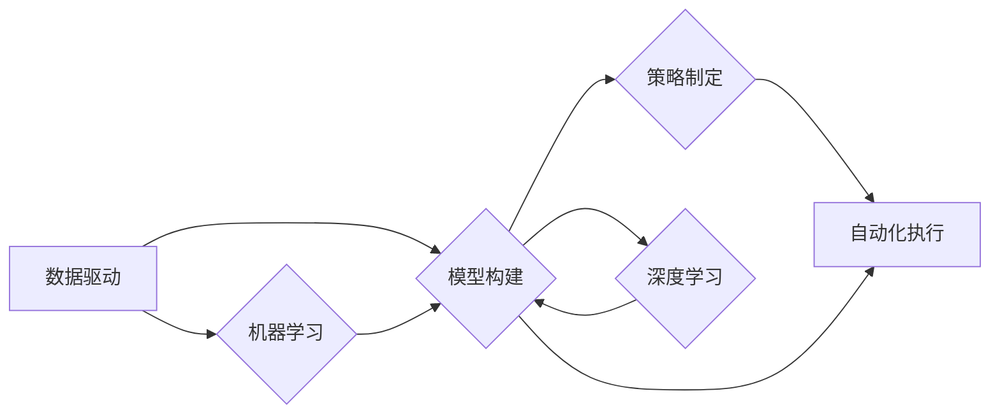

                 

## 利用技术优势进行股市投资

> 关键词：人工智能、机器学习、深度学习、量化交易、股市预测、技术分析、风险管理

## 1. 背景介绍

股市投资一直以来都是一个充满机遇和挑战的领域。传统投资方法往往依赖于经验、直觉和市场分析，而近年来，随着人工智能（AI）技术的快速发展，利用技术优势进行股市投资逐渐成为一种新的趋势。AI算法能够处理海量数据，识别复杂的模式，并做出更精准的预测，为投资者提供更有效的决策支持。

## 2. 核心概念与联系

### 2.1 量化交易

量化交易是一种利用数学模型和计算机程序进行股票交易的投资策略。它通过对历史数据进行分析，建立预测模型，并根据模型输出自动执行交易指令。量化交易的核心概念包括：

* **数据驱动:** 量化交易依赖于大量历史数据，包括股票价格、交易量、市场指标等。
* **模型构建:** 利用统计学、机器学习等方法，构建能够预测股票价格走势的数学模型。
* **策略制定:** 根据模型预测结果，制定交易策略，包括买入、卖出、止损等操作。
* **自动化执行:** 利用计算机程序自动执行交易指令，减少人为因素的影响。

### 2.2 机器学习

机器学习是人工智能领域的一个重要分支，它通过算法训练模型，使模型能够从数据中学习，并对新数据进行预测。在股市投资中，机器学习算法可以用于：

* **股票价格预测:** 利用历史数据训练模型，预测未来股票价格走势。
* **交易信号识别:** 从市场数据中识别潜在的交易信号，例如突破、反转等。
* **风险管理:** 评估投资组合的风险，并制定相应的风险控制策略。

### 2.3 深度学习

深度学习是机器学习的一种高级形式，它利用多层神经网络结构，能够学习更复杂的模式和特征。深度学习算法在股市投资中具有以下优势：

* **更精准的预测:** 深度学习模型能够学习更复杂的非线性关系，从而提高预测精度。
* **处理海量数据:** 深度学习模型能够处理海量数据，并从中提取有价值的信息。
* **自动特征提取:** 深度学习模型能够自动提取特征，无需人工特征工程。

**核心概念与联系流程图**



## 3. 核心算法原理 & 具体操作步骤

### 3.1 算法原理概述

在股市投资中，常用的机器学习算法包括：

* **线性回归:** 用于预测连续变量，例如股票价格。
* **逻辑回归:** 用于预测分类变量，例如股票上涨或下跌。
* **支持向量机 (SVM):** 用于分类和回归问题，能够处理高维数据。
* **决策树:** 用于分类和回归问题，易于理解和解释。
* **随机森林:** 结合多个决策树，提高预测精度。
* **神经网络:** 能够学习更复杂的模式，具有较高的预测精度。

### 3.2 算法步骤详解

以线性回归为例，其具体操作步骤如下：

1. **数据收集:** 收集历史股票价格、交易量、市场指标等数据。
2. **数据预处理:** 清洗数据，处理缺失值，标准化数据。
3. **模型训练:** 利用训练数据训练线性回归模型，找到最佳模型参数。
4. **模型评估:** 利用测试数据评估模型性能，例如R-squared、均方误差等指标。
5. **模型部署:** 将训练好的模型部署到交易系统中，用于预测未来股票价格。

### 3.3 算法优缺点

不同的机器学习算法具有不同的优缺点，需要根据具体应用场景选择合适的算法。

* **线性回归:** 优点：易于理解和实现，计算效率高。缺点：假设数据服从线性关系，对非线性关系的预测能力较弱。
* **逻辑回归:** 优点：适用于分类问题，易于理解和解释。缺点：对复杂分类问题的预测能力较弱。
* **支持向量机 (SVM):** 优点：能够处理高维数据，对非线性关系的预测能力较强。缺点：训练时间较长，参数选择较复杂。
* **决策树:** 优点：易于理解和解释，能够处理非线性关系。缺点：容易过拟合，预测精度较低。
* **随机森林:** 优点：结合多个决策树，提高预测精度，对过拟合问题有较好的抵抗力。缺点：训练时间较长，解释性较差。
* **神经网络:** 优点：能够学习更复杂的模式，具有较高的预测精度。缺点：训练时间较长，参数选择较复杂，解释性较差。

### 3.4 算法应用领域

机器学习算法在股市投资中具有广泛的应用领域，包括：

* **股票价格预测:** 利用历史数据预测未来股票价格走势。
* **交易信号识别:** 从市场数据中识别潜在的交易信号，例如突破、反转等。
* **风险管理:** 评估投资组合的风险，并制定相应的风险控制策略。
* **投资组合优化:** 根据投资目标和风险偏好，优化投资组合配置。
* **市场趋势分析:** 分析市场趋势，识别投资机会。

## 4. 数学模型和公式 & 详细讲解 & 举例说明

### 4.1 数学模型构建

在股市投资中，常用的数学模型包括：

* **ARIMA模型:** 用于预测时间序列数据，例如股票价格。
* **GARCH模型:** 用于预测股票价格波动率。
* **布莱克-舒尔斯模型:** 用于定价期权。

### 4.2 公式推导过程

以ARIMA模型为例，其核心公式如下：

$$
y_t = c + \sum_{i=1}^p \phi_i y_{t-i} + \sum_{j=1}^q \theta_j \epsilon_{t-j} + \epsilon_t
$$

其中：

* $y_t$ 是时间t的股票价格。
* $c$ 是截距项。
* $\phi_i$ 是自回归系数。
* $q$ 是移动平均系数。
* $\epsilon_t$ 是随机误差项。

### 4.3 案例分析与讲解

假设我们想要预测某只股票未来一周的价格走势，可以使用ARIMA模型进行预测。首先，我们需要收集该股票的历史价格数据，并对其进行分析，确定ARIMA模型的参数值（p, d, q）。然后，利用训练好的ARIMA模型，预测未来一周的股票价格。

## 5. 项目实践：代码实例和详细解释说明

### 5.1 开发环境搭建

* Python 3.x
* NumPy
* Pandas
* Scikit-learn
* Matplotlib

### 5.2 源代码详细实现

```python
import pandas as pd
from sklearn.linear_model import LinearRegression
from sklearn.model_selection import train_test_split

# 加载股票价格数据
data = pd.read_csv('stock_price.csv')

# 选择特征和目标变量
features = ['Open', 'High', 'Low', 'Volume']
target = 'Close'

# 将数据分割为训练集和测试集
X_train, X_test, y_train, y_test = train_test_split(data[features], data[target], test_size=0.2)

# 创建线性回归模型
model = LinearRegression()

# 训练模型
model.fit(X_train, y_train)

# 预测测试集数据
y_pred = model.predict(X_test)

# 评估模型性能
print('R-squared:', model.score(X_test, y_test))
```

### 5.3 代码解读与分析

* 首先，我们加载股票价格数据，并选择特征和目标变量。
* 然后，我们将数据分割为训练集和测试集，用于训练和评估模型。
* 接下来，我们创建线性回归模型，并利用训练集数据进行模型训练。
* 训练完成后，我们利用测试集数据进行模型预测，并评估模型性能。

### 5.4 运行结果展示

运行上述代码后，会输出模型的R-squared值，该值表示模型对测试集数据的拟合程度。R-squared值越接近1，表示模型的预测精度越高。

## 6. 实际应用场景

### 6.1 量化交易平台

量化交易平台利用机器学习算法，自动执行交易指令，实现自动化交易。

### 6.2 投资顾问系统

投资顾问系统利用机器学习算法，根据用户的投资目标和风险偏好，提供个性化的投资建议。

### 6.3 风险管理系统

风险管理系统利用机器学习算法，评估投资组合的风险，并制定相应的风险控制策略。

### 6.4 未来应用展望

随着人工智能技术的不断发展，其在股市投资领域的应用将更加广泛和深入，例如：

* **更精准的预测:** 利用更先进的机器学习算法，提高股票价格预测的精度。
* **更个性化的服务:** 利用人工智能技术，提供更加个性化的投资建议和服务。
* **更智能的交易策略:** 利用人工智能技术，开发更智能的交易策略，提高交易效率和收益。

## 7. 工具和资源推荐

### 7.1 学习资源推荐

* **书籍:**
    * 《Python机器学习》
    * 《深度学习》
    * 《量化投资》
* **在线课程:**
    * Coursera
    * edX
    * Udemy

### 7.2 开发工具推荐

* **Python:** 
    * Jupyter Notebook
    * Spyder
* **数据分析工具:**
    * Pandas
    * NumPy
* **机器学习库:**
    * Scikit-learn
    * TensorFlow
    * PyTorch

### 7.3 相关论文推荐

* **深度学习在金融领域的应用:**
    * 《Deep Learning for Financial Modeling》
    * 《Deep Reinforcement Learning for Portfolio Management》
* **量化交易的机器学习方法:**
    * 《Machine Learning for Algorithmic Trading》
    * 《A Survey of Machine Learning Techniques for Financial Time Series Forecasting》

## 8. 总结：未来发展趋势与挑战

### 8.1 研究成果总结

近年来，人工智能技术在股市投资领域取得了显著的成果，例如：

* **更精准的股票价格预测:** 深度学习算法能够学习更复杂的模式，提高预测精度。
* **更智能的交易策略:** 利用机器学习算法，开发更智能的交易策略，提高交易效率和收益。
* **更有效的风险管理:** 利用机器学习算法，评估投资组合的风险，并制定相应的风险控制策略。

### 8.2 未来发展趋势

未来，人工智能技术在股市投资领域的应用将更加广泛和深入，例如：

* **更个性化的投资服务:** 利用人工智能技术，提供更加个性化的投资建议和服务。
* **更复杂的交易策略:** 开发更复杂的交易策略，例如利用自然语言处理技术分析市场情绪。
* **更安全的交易系统:** 利用人工智能技术，提高交易系统的安全性，防止市场操纵和欺诈行为。

### 8.3 面临的挑战

尽管人工智能技术在股市投资领域取得了显著的成果，但仍面临一些挑战，例如：

* **数据质量:** 训练机器学习模型需要大量高质量的数据，而股市数据往往存在噪声和偏差。
* **模型解释性:** 深度学习模型的决策过程往往难以解释，这可能会导致投资者缺乏信任。
* **监管风险:** 随着人工智能技术的应用，监管机构需要制定相应的规则和标准，以确保市场公平性和稳定性。

### 8.4 研究展望

未来，我们需要继续研究以下问题：

* 如何提高机器学习模型的鲁棒性和泛化能力，使其能够应对市场变化和数据噪声。
* 如何提高深度学习模型的解释性，使其决策过程更加透明和可信。
* 如何与监管机构合作，制定相应的规则和标准，确保人工智能技术在股市投资领域的健康发展。

## 9. 附录：常见问题与解答

### 9.1 如何选择合适的机器学习算法？

选择合适的机器学习算法取决于具体的应用场景和数据特征。例如，对于预测连续变量，可以使用线性回归或ARIMA模型；对于分类问题，可以使用逻辑回归或支持向量机。

### 9.2 如何处理股市数据的噪声和偏差？

可以采用以下方法处理股市数据的噪声和偏差：

* 数据清洗：删除异常值和重复数据。
* 数据标准化：将数据转换为标准分布。
* 数据降维：减少数据维度，去除冗余信息。

### 9.3 如何评估机器学习模型的性能？

常用的评估指标包括：

* R-squared：表示模型对训练数据的拟合程度。
* 均方误差：表示模型预测值与真实值的平均平方差。
* 精确率、召回率、F1-score：用于评估分类模型的性能。

### 9.4 如何部署机器学习模型到交易系统？

可以采用以下方法部署机器学习模型到交易系统：

* 使用云平台提供的机器学习服务。
* 开发自己的交易系统，并集成机器学习模型。
* 使用开源的量化交易平台，并配置机器学习模型。


作者：禅与计算机程序设计艺术 / Zen and the Art of Computer Programming 
<end_of_turn>

