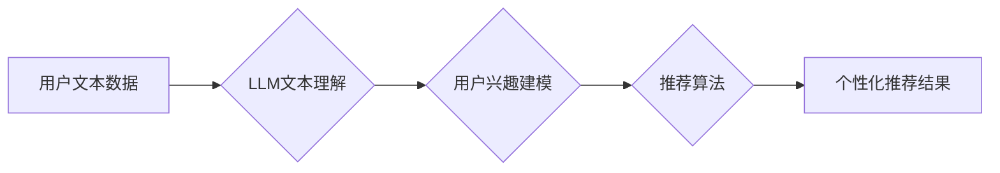

                 

## 基于LLM的推荐系统用户兴趣探索与利用

> 关键词：LLM,推荐系统,用户兴趣,自然语言处理,深度学习,个性化推荐,文本理解

## 1. 背景介绍

推荐系统作为信息过滤和个性化内容呈现的重要工具，在电商、社交媒体、视频平台等领域发挥着至关重要的作用。传统的推荐系统主要依赖于用户行为数据，如点击、购买、评分等，通过协同过滤、内容过滤等算法挖掘用户兴趣偏好。然而，这些方法存在一些局限性：

* **数据稀疏性:** 用户行为数据往往存在稀疏性，难以准确捕捉用户细粒度的兴趣。
* **冷启动问题:** 新用户或新商品缺乏历史数据，难以进行有效的推荐。
* **缺乏解释性:** 传统推荐算法难以解释推荐结果背后的逻辑，用户难以理解推荐依据。

近年来，大语言模型 (LLM) 的快速发展为推荐系统带来了新的机遇。LLM 拥有强大的文本理解和生成能力，能够从用户文本数据中挖掘更深层次的兴趣偏好，并生成更个性化、更具解释性的推荐内容。

## 2. 核心概念与联系

### 2.1  LLM 的优势

LLM 作为一种基于深度学习的自然语言处理模型，拥有以下优势：

* **强大的文本理解能力:** LLM 可以理解复杂的文本语义，捕捉用户意图和需求。
* **丰富的知识储备:** LLM 在预训练阶段学习了海量文本数据，拥有丰富的知识和常识。
* **灵活的文本生成能力:** LLM 可以根据用户需求生成个性化的文本内容，如推荐理由、商品描述等。

### 2.2  推荐系统与 LLM 的结合

将 LLM 与推荐系统相结合，可以实现以下功能：

* **用户兴趣探索:** 通过分析用户的文本数据，如评论、搜索历史、聊天记录等，LLM 可以挖掘用户的兴趣偏好、需求和隐性需求。
* **个性化推荐:** 基于用户兴趣，LLM 可以生成个性化的推荐内容，如商品、文章、视频等。
* **推荐解释:** LLM 可以生成推荐理由，解释推荐结果背后的逻辑，提高用户对推荐的信任度。

### 2.3  架构图



## 3. 核心算法原理 & 具体操作步骤

### 3.1  算法原理概述

基于LLM的推荐系统主要采用以下算法原理：

* **文本嵌入:** 将用户文本数据转换为向量表示，以便于模型理解和处理。
* **兴趣建模:** 利用 LLMs 的文本理解能力，从用户文本数据中挖掘用户的兴趣偏好，构建用户兴趣模型。
* **推荐算法:** 基于用户兴趣模型，采用协同过滤、内容过滤等推荐算法生成个性化推荐结果。

### 3.2  算法步骤详解

1. **数据预处理:** 收集用户文本数据，进行清洗、去噪、分词等预处理操作。
2. **文本嵌入:** 使用预训练的 LLMs 或专门设计的文本嵌入模型，将用户文本数据转换为向量表示。
3. **兴趣建模:** 利用 LLMs 的文本理解能力，从用户文本数据中提取关键词、主题、情感等信息，构建用户兴趣模型。
4. **推荐算法:** 基于用户兴趣模型，采用协同过滤、内容过滤等推荐算法生成个性化推荐结果。
5. **结果评估:** 使用指标如准确率、召回率、NDCG 等评估推荐系统的性能。

### 3.3  算法优缺点

**优点:**

* 能够挖掘用户更深层次的兴趣偏好。
* 能够处理文本数据，克服传统推荐系统数据稀疏性的问题。
* 能够生成更个性化、更具解释性的推荐结果。

**缺点:**

* 需要大量的文本数据进行训练。
* 计算成本较高。
* 模型解释性仍有待提高。

### 3.4  算法应用领域

* **电商推荐:** 基于用户评论、浏览历史等文本数据，推荐个性化的商品。
* **内容推荐:** 基于用户阅读历史、搜索记录等文本数据，推荐个性化的文章、视频等内容。
* **社交推荐:** 基于用户社交关系、兴趣标签等文本数据，推荐个性化的朋友、群组等。

## 4. 数学模型和公式 & 详细讲解 & 举例说明

### 4.1  数学模型构建

基于LLM的推荐系统通常采用以下数学模型：

* **用户兴趣向量:**  用向量 $u_i$ 表示用户 $i$ 的兴趣，其中每个维度代表一个特定的兴趣主题。
* **商品特征向量:** 用向量 $v_j$ 表示商品 $j$ 的特征，其中每个维度代表一个特定的商品属性。
* **相似度计算:** 使用余弦相似度等度量方法计算用户兴趣向量 $u_i$ 和商品特征向量 $v_j$ 之间的相似度，表示用户对商品的兴趣程度。

### 4.2  公式推导过程

**余弦相似度公式:**

$$
\text{sim}(u_i, v_j) = \frac{u_i \cdot v_j}{||u_i|| ||v_j||}
$$

其中:

* $u_i \cdot v_j$ 是用户兴趣向量 $u_i$ 和商品特征向量 $v_j$ 的点积。
* $||u_i||$ 和 $||v_j||$ 分别是用户兴趣向量 $u_i$ 和商品特征向量 $v_j$ 的模长。

### 4.3  案例分析与讲解

假设用户 $A$ 的兴趣向量为 $u_A = [0.8, 0.5, 0.2]$, 商品 $X$ 的特征向量为 $v_X = [0.6, 0.7, 0.3]$. 

则用户 $A$ 对商品 $X$ 的余弦相似度为:

$$
\text{sim}(u_A, v_X) = \frac{0.8 \cdot 0.6 + 0.5 \cdot 0.7 + 0.2 \cdot 0.3}{\sqrt{0.8^2 + 0.5^2 + 0.2^2} \sqrt{0.6^2 + 0.7^2 + 0.3^2}} \approx 0.78
$$

该值表示用户 $A$ 对商品 $X$ 的兴趣程度较高。

## 5. 项目实践：代码实例和详细解释说明

### 5.1  开发环境搭建

* Python 3.7+
* PyTorch 或 TensorFlow
* Transformers 库

### 5.2  源代码详细实现

```python
from transformers import AutoModel, AutoTokenizer

# 加载预训练模型和词典
model_name = "bert-base-uncased"
tokenizer = AutoTokenizer.from_pretrained(model_name)
model = AutoModel.from_pretrained(model_name)

# 用户文本数据
user_text = "我喜欢阅读科幻小说，也喜欢看电影。"

# 文本嵌入
inputs = tokenizer(user_text, return_tensors="pt")
outputs = model(**inputs)
user_embedding = outputs.last_hidden_state[:, 0, :]

# 商品特征向量
product_embedding = # ... (根据商品信息生成特征向量)

# 计算相似度
similarity = torch.cosine_similarity(user_embedding, product_embedding)

# 打印相似度
print(similarity)
```

### 5.3  代码解读与分析

* 使用 Transformers 库加载预训练的 BERT 模型和词典。
* 将用户文本数据转换为模型输入格式。
* 使用模型生成用户文本的嵌入向量。
* 根据商品信息生成商品特征向量。
* 使用余弦相似度计算用户兴趣向量和商品特征向量之间的相似度。
* 打印相似度值，表示用户对商品的兴趣程度。

### 5.4  运行结果展示

运行结果将输出一个相似度值，该值介于 0 到 1 之间，表示用户对商品的兴趣程度。值越大，表示用户对商品的兴趣越高。

## 6. 实际应用场景

### 6.1  电商推荐

基于LLM的推荐系统可以分析用户的商品评论、浏览历史等文本数据，挖掘用户的兴趣偏好，推荐更个性化的商品。例如，可以根据用户的评论内容，推荐与用户评价内容相似的商品。

### 6.2  内容推荐

基于LLM的推荐系统可以分析用户的阅读历史、搜索记录等文本数据，推荐更符合用户兴趣的内容。例如，可以根据用户的阅读历史，推荐与用户阅读内容相关的文章、视频等。

### 6.3  社交推荐

基于LLM的推荐系统可以分析用户的社交关系、兴趣标签等文本数据，推荐更合适的社交伙伴。例如，可以根据用户的兴趣标签，推荐与用户兴趣相似的用户。

### 6.4  未来应用展望

随着LLM技术的不断发展，基于LLM的推荐系统将有更广泛的应用场景，例如：

* **个性化教育推荐:** 根据学生的学习兴趣和能力，推荐个性化的学习资源。
* **医疗健康推荐:** 根据患者的病史和症状，推荐个性化的医疗方案。
* **金融理财推荐:** 根据用户的风险偏好和财务状况，推荐个性化的理财产品。

## 7. 工具和资源推荐

### 7.1  学习资源推荐

* **论文:**
    * "BERT: Pre-training of Deep Bidirectional Transformers for Language Understanding"
    * "XLNet: Generalized Autoregressive Pretraining for Language Understanding"
    * "T5: Text-to-Text Transfer Transformer"
* **博客:**
    * The Illustrated Transformer
    * Jay Alammar's Blog
* **在线课程:**
    * Stanford CS224N: Natural Language Processing with Deep Learning
    * DeepLearning.AI: Natural Language Processing Specialization

### 7.2  开发工具推荐

* **Transformers 库:** https://huggingface.co/transformers/
* **PyTorch:** https://pytorch.org/
* **TensorFlow:** https://www.tensorflow.org/

### 7.3  相关论文推荐

* "Neural Recommendation Systems"
* "Deep Learning for Recommender Systems"
* "A Survey on Deep Learning for Recommender Systems"

## 8. 总结：未来发展趋势与挑战

### 8.1  研究成果总结

基于LLM的推荐系统在用户兴趣探索和个性化推荐方面取得了显著进展，能够挖掘用户更深层次的兴趣偏好，生成更个性化、更具解释性的推荐结果。

### 8.2  未来发展趋势

* **多模态推荐:** 将文本数据与其他模态数据，如图像、音频、视频等相结合，构建更全面的用户兴趣模型。
* **联邦学习:** 利用联邦学习技术，在保护用户隐私的前提下，训练更强大的推荐模型。
* **可解释性增强:** 提高模型的解释性，让用户能够更好地理解推荐结果背后的逻辑。

### 8.3  面临的挑战

* **数据稀疏性:** 许多用户文本数据仍然存在稀疏性，难以训练出高性能的推荐模型。
* **计算成本:** LLMs 的训练和推理过程需要大量的计算资源，成本较高。
* **模型解释性:** LLMs 的内部机制复杂，难以解释推荐结果背后的逻辑，需要进一步研究提高模型的解释性。

### 8.4  研究展望

未来，基于LLM的推荐系统将继续朝着更智能、更个性化、更可解释的方向发展，为用户提供更优质的推荐体验。


## 9. 附录：常见问题与解答

### 9.1  Q1: LLMs 的训练数据对推荐结果有什么影响？

**A1:** LLMs 的训练数据直接影响其文本理解能力和推荐结果的质量。高质量、丰富、多样化的训练数据可以帮助 LLMs 更好地理解用户需求，生成更准确、更个性化的推荐结果。

### 9.2  Q2: 如何评估基于LLM的推荐系统的性能？

**A2:** 可以使用传统的推荐系统评估指标，如准确率、召回率、NDCG 等，以及更针对文本理解的指标，如BLEU、ROUGE 等。

### 9.3  Q3: 基于LLM的推荐系统有哪些伦理问题？

**A3:** 基于LLM的推荐系统可能存在一些伦理问题，例如数据隐私、算法偏见、信息茧房等。需要在开发和应用过程中，充分考虑这些问题，并采取相应的措施进行规避和解决。


作者：禅与计算机程序设计艺术 / Zen and the Art of Computer Programming 
<end_of_turn>

