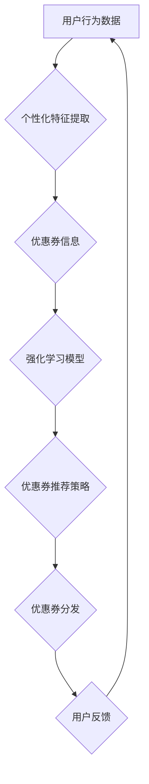

                 

## 基于强化学习的个性化优惠券分发策略

> 关键词：强化学习、个性化推荐、优惠券分发、深度学习、马尔可夫决策过程

## 1. 背景介绍

在当今数据爆炸的时代，精准营销已成为企业获取用户和提升收益的关键策略。优惠券作为一种常见的营销工具，能够有效刺激消费，提升用户粘性。然而，传统的优惠券分发策略往往采用简单粗暴的方案，例如全员推送或基于用户历史购买行为的规则匹配，缺乏针对性和个性化，导致优惠券使用率低、营销效果不佳。

随着人工智能技术的快速发展，基于强化学习的个性化优惠券分发策略逐渐成为研究热点。强化学习能够通过学习用户行为模式，预测用户对不同优惠券的响应，从而实现更精准、更有效的优惠券分发。

## 2. 核心概念与联系

### 2.1 强化学习

强化学习是一种机器学习范式，其核心思想是通过试错学习，让智能体在环境中采取行动，并根据环境反馈的奖励信号不断调整策略，最终达到最大化累积奖励的目标。

强化学习的核心要素包括：

* **智能体 (Agent):** 决策者，例如优惠券分发系统。
* **环境 (Environment):** 智能体所处的外部世界，例如用户群体和优惠券信息。
* **状态 (State):** 环境的当前状态，例如用户的购买历史、优惠券信息等。
* **动作 (Action):** 智能体可以采取的行动，例如向用户推送特定优惠券。
* **奖励 (Reward):** 环境对智能体动作的反馈，例如用户点击优惠券、使用优惠券、购买商品等行为。
* **策略 (Policy):** 智能体根据当前状态选择动作的规则。

### 2.2 马尔可夫决策过程 (MDP)

马尔可夫决策过程是一种数学模型，用于描述强化学习问题。MDP 包含以下要素：

* **状态空间 (State Space):** 所有可能的系统状态。
* **动作空间 (Action Space):** 智能体可以采取的所有动作。
* **转移概率 (Transition Probability):** 从一个状态到另一个状态的概率，取决于智能体采取的动作。
* **奖励函数 (Reward Function):** 给定状态和动作，返回相应的奖励值。

### 2.3 个性化推荐

个性化推荐是指根据用户的兴趣、偏好、行为等信息，推荐个性化的商品、服务或内容。

在优惠券分发场景中，个性化推荐是指根据用户的特征和行为，推荐最有可能被用户接受和使用的优惠券。

**核心架构流程图**



## 3. 核心算法原理 & 具体操作步骤

### 3.1 算法原理概述

基于强化学习的个性化优惠券分发策略通常采用深度强化学习算法，例如深度Q网络 (DQN) 或策略梯度算法 (PG)。这些算法能够学习用户行为模式，并根据用户特征和优惠券信息，预测用户对不同优惠券的响应。

**深度Q网络 (DQN)**

DQN 是一种基于 Q 值函数的强化学习算法，它学习一个 Q 函数，该函数能够估计在给定状态下采取特定动作的期望累积奖励。DQN 使用深度神经网络来逼近 Q 函数，并通过经验回放和目标网络来稳定训练过程。

**策略梯度算法 (PG)**

PG 是一种直接优化策略的强化学习算法，它通过计算策略梯度来更新策略参数，从而最大化累积奖励。PG 通常使用策略网络来表示策略，并通过 REINFORCE 算法来计算策略梯度。

### 3.2 算法步骤详解

**基于 DQN 的个性化优惠券分发策略**

1. **数据收集:** 收集用户行为数据，例如用户浏览历史、购买记录、优惠券点击记录等。
2. **特征提取:** 从用户行为数据中提取个性化特征，例如用户年龄、性别、购买频率、偏好商品类别等。
3. **优惠券信息编码:** 将优惠券信息编码为向量，例如优惠券面额、折扣类型、有效期等。
4. **构建 DQN 模型:** 使用深度神经网络构建 DQN 模型，输入用户特征和优惠券信息，输出每个优惠券的 Q 值。
5. **训练 DQN 模型:** 使用经验回放和目标网络来训练 DQN 模型，使其能够学习用户行为模式和优惠券价值。
6. **优惠券推荐:** 根据用户特征和优惠券信息，使用训练好的 DQN 模型预测每个优惠券的 Q 值，选择 Q 值最高的优惠券进行推荐。

**基于 PG 的个性化优惠券分发策略**

1. **数据收集:** 收集用户行为数据，例如用户浏览历史、购买记录、优惠券点击记录等。
2. **特征提取:** 从用户行为数据中提取个性化特征，例如用户年龄、性别、购买频率、偏好商品类别等。
3. **优惠券信息编码:** 将优惠券信息编码为向量，例如优惠券面额、折扣类型、有效期等。
4. **构建策略网络:** 使用深度神经网络构建策略网络，输入用户特征和优惠券信息，输出每个优惠券的概率分布。
5. **训练策略网络:** 使用 REINFORCE 算法来训练策略网络，使其能够最大化累积奖励。
6. **优惠券推荐:** 根据用户特征和优惠券信息，使用训练好的策略网络采样一个优惠券，并将其推荐给用户。

### 3.3 算法优缺点

**DQN**

* **优点:** 能够学习复杂的决策策略，并具有较好的稳定性。
* **缺点:** 训练过程相对复杂，需要大量的训练数据。

**PG**

* **优点:** 训练过程相对简单，能够直接优化策略。
* **缺点:** 训练过程可能不稳定，容易出现震荡。

### 3.4 算法应用领域

基于强化学习的个性化优惠券分发策略能够应用于各种电商平台、营销平台、金融平台等场景，例如：

* **电商平台:** 为用户推荐个性化的优惠券，提高用户转化率和复购率。
* **营销平台:** 为商家提供个性化优惠券营销方案，提升营销效果。
* **金融平台:** 为用户推荐个性化的金融产品，提高用户体验。

## 4. 数学模型和公式 & 详细讲解 & 举例说明

### 4.1 数学模型构建

在强化学习中，我们通常使用马尔可夫决策过程 (MDP) 来建模优惠券分发问题。

MDP 包含以下要素：

* **状态空间 (S):** 所有可能的系统状态，例如用户的购买历史、优惠券信息等。
* **动作空间 (A):** 智能体可以采取的所有动作，例如向用户推送特定优惠券。
* **转移概率 (P(s'|s,a)):** 从状态 s 到状态 s' 的概率，取决于智能体采取的动作 a。
* **奖励函数 (R(s,a)):** 给定状态 s 和动作 a，返回相应的奖励值。

### 4.2 公式推导过程

**Q 函数:**

Q 函数估计在给定状态 s 下采取动作 a 的期望累积奖励。

$$Q(s,a) = E[\sum_{t=0}^{\infty} \gamma^t r(s_t,a_t) | s_0 = s, a_0 = a]$$

其中:

* $r(s_t,a_t)$ 是在状态 $s_t$ 下采取动作 $a_t$ 得到的奖励。
* $\gamma$ 是折扣因子，控制未来奖励的权重。

**Bellman 方程:**

Bellman 方程描述了 Q 函数的更新规则。

$$Q(s,a) = r(s,a) + \gamma \max_{a'} Q(s',a')$$

其中:

* $s'$ 是采取动作 $a$ 后到达的状态。

**DQN 算法:**

DQN 算法使用深度神经网络来逼近 Q 函数，并通过经验回放和目标网络来稳定训练过程。

### 4.3 案例分析与讲解

假设一个电商平台要为用户推荐优惠券，用户的状态可以包含用户的购买历史、性别、年龄等信息，动作可以包含向用户推荐不同面额的优惠券。

我们可以使用 DQN 算法来学习用户对不同优惠券的响应，并根据用户的特征和优惠券信息，推荐最有可能被用户接受的优惠券。

## 5. 项目实践：代码实例和详细解释说明

### 5.1 开发环境搭建

* Python 3.6+
* TensorFlow 或 PyTorch
* Jupyter Notebook

### 5.2 源代码详细实现

```python
# 导入必要的库
import tensorflow as tf

# 定义 DQN 模型
class DQN(tf.keras.Model):
    def __init__(self, state_size, action_size):
        super(DQN, self).__init__()
        self.dense1 = tf.keras.layers.Dense(64, activation='relu')
        self.dense2 = tf.keras.layers.Dense(32, activation='relu')
        self.output = tf.keras.layers.Dense(action_size)

    def call(self, state):
        x = self.dense1(state)
        x = self.dense2(x)
        return self.output(x)

# 定义训练函数
def train(model, experience_replay_buffer, batch_size):
    # 从经验回放缓冲区中采样数据
    batch = experience_replay_buffer.sample(batch_size)

    # 计算损失
    with tf.GradientTape() as tape:
        states = tf.convert_to_tensor(batch['state'])
        actions = tf.convert_to_tensor(batch['action'])
        rewards = tf.convert_to_tensor(batch['reward'])
        next_states = tf.convert_to_tensor(batch['next_state'])
        target_q_values = tf.convert_to_tensor(batch['target_q_value'])
        q_values = model(states)
        loss = tf.keras.losses.mean_squared_error(target_q_values, q_values)

    # 更新模型参数
    gradients = tape.gradient(loss, model.trainable_variables)
    optimizer.apply_gradients(zip(gradients, model.trainable_variables))

# ... 其他代码 ...
```

### 5.3 代码解读与分析

* **DQN 模型:** 定义了一个深度神经网络模型，用于逼近 Q 函数。
* **训练函数:** 定义了一个训练函数，用于更新 DQN 模型的参数。
* **经验回放缓冲区:** 用于存储用户行为数据，并从中采样数据进行训练。

### 5.4 运行结果展示

* 训练完成后，可以评估 DQN 模型的性能，例如使用测试数据计算 Q 值的平均绝对误差 (MAE)。
* 可以将训练好的 DQN 模型部署到线上环境，用于推荐优惠券。

## 6. 实际应用场景

### 6.1 优惠券分发策略优化

基于强化学习的个性化优惠券分发策略能够帮助电商平台优化优惠券分发策略，提高优惠券使用率和营销效果。

### 6.2 用户体验提升

通过个性化推荐优惠券，可以提升用户的购物体验，增强用户粘性。

### 6.3 商家营销收益提升

商家可以通过个性化优惠券营销方案，精准触达目标用户，提升营销收益。

### 6.4 未来应用展望

* **多智能体强化学习:** 可以使用多智能体强化学习算法，让多个智能体协同学习，实现更精准的优惠券分发策略。
* **联邦学习:** 可以使用联邦学习技术，在保护用户隐私的前提下，实现跨平台的优惠券分发策略学习。

## 7. 工具和资源推荐

### 7.1 学习资源推荐

* **强化学习书籍:**
    * Reinforcement Learning: An Introduction by Richard S. Sutton and Andrew G. Barto
    * Deep Reinforcement Learning Hands-On by Maxim Lapan
* **在线课程:**
    * Deep Reinforcement Learning Specialization by DeepLearning.AI
    * Reinforcement Learning by David Silver (University of DeepMind)

### 7.2 开发工具推荐

* **TensorFlow:** https://www.tensorflow.org/
* **PyTorch:** https://pytorch.org/
* **OpenAI Gym:** https://gym.openai.com/

### 7.3 相关论文推荐

* Deep Q-Network (DQN)
* Proximal Policy Optimization (PPO)
* Asynchronous Advantage Actor-Critic (A3C)

## 8. 总结：未来发展趋势与挑战

### 8.1 研究成果总结

基于强化学习的个性化优惠券分发策略取得了显著的成果，能够有效提高优惠券使用率和营销效果，提升用户体验和商家收益。

### 8.2 未来发展趋势

* **更复杂的模型:** 使用更复杂的深度学习模型，例如 Transformer，来学习更复杂的决策策略。
* **多模态数据融合:** 将用户行为数据、文本数据、图像数据等多模态数据融合，实现更精准的个性化推荐。
* **可解释性增强:** 研究强化学习模型的决策过程，提高模型的可解释性。

### 8.3 面临的挑战

* **数据稀疏性:** 优惠券分发场景的数据往往稀疏，难以训练有效的强化学习模型。
* **长期的奖励信号:** 优惠券分发的效果往往需要长时间才能体现，难以获得有效的长期奖励信号。
* **公平性与伦理:** 强化学习模型可能会产生偏差，导致不公平的优惠券分发结果，需要关注公平性与伦理问题。

### 8.4 研究展望

未来，基于强化学习的个性化优惠券分发策略将朝着更智能、更精准、更公平的方向发展，为电商平台、营销平台、金融平台等场景提供更有效的解决方案。

## 9. 附录：常见问题与解答

* **Q: 如何处理数据稀疏性问题？**

A: 可以使用数据增强技术，例如合成数据、迁移学习等，来增加训练数据量。

* **Q: 如何解决长期奖励信号的问题？**

A: 可以使用折扣因子来控制未来奖励的权重，或者使用强化学习算法的变体，例如优先回放算法，来解决这个问题。

* **Q: 如何保证模型的公平性？**

A: 可以使用公平性约束条件来训练强化学习模型，或者使用公平性评估指标来评估模型的公平性。


作者：禅与计算机程序设计艺术 / Zen and the Art of Computer Programming<end_of_turn>

