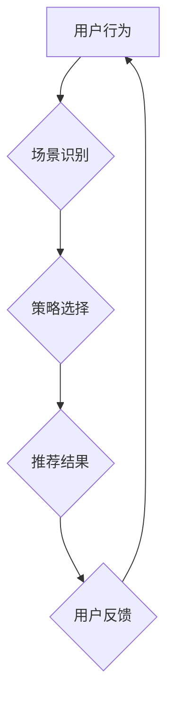

                 

## 基于强化学习的多场景推荐策略协同优化

> 关键词：强化学习、推荐系统、多场景、策略协同优化、深度学习、用户行为预测

## 1. 背景介绍

推荐系统作为互联网时代的重要组成部分，旨在根据用户的历史行为、偏好和上下文信息，为用户推荐个性化、相关的商品、服务或内容。传统的推荐系统主要依赖于协同过滤、内容过滤等方法，但这些方法在面对冷启动问题、数据稀疏性等挑战时表现不足。

近年来，强化学习（Reinforcement Learning，RL）因其能够学习用户行为和反馈，并不断优化推荐策略的能力，逐渐成为推荐系统研究的热点。RL 算法可以将推荐系统视为一个马尔可夫决策过程（Markov Decision Process，MDP），其中用户行为是状态转移，推荐策略是动作选择，奖励函数是用户对推荐的反馈。通过不断学习和调整策略，RL 算法可以实现个性化、动态的推荐效果。

然而，现实世界中用户行为往往存在多场景性，例如用户在手机端、电脑端、平板端等不同设备上，在不同时间段、不同地点、不同情绪状态下，都会展现出不同的行为模式。传统的单一场景 RL 算法难以有效应对这种多场景性带来的挑战。

因此，基于强化学习的多场景推荐策略协同优化成为一个重要的研究方向。该方向旨在设计能够跨场景学习和协同优化的 RL 算法，以实现更精准、更个性化的推荐体验。

## 2. 核心概念与联系

### 2.1 强化学习

强化学习是一种机器学习方法，其核心思想是通过奖励机制引导智能体学习最优的行为策略。在 RL 框架中，智能体与环境交互，根据环境的反馈（奖励或惩罚）调整其行为策略，最终目标是最大化累积的奖励。

### 2.2 多场景推荐

多场景推荐是指针对用户在不同场景下展现的不同行为模式，设计个性化、场景化的推荐策略。例如，用户在通勤途中可能更倾向于听音乐或新闻，而在闲暇时间则更倾向于阅读或观看视频。

### 2.3 策略协同优化

策略协同优化是指在多场景环境下，设计多个 RL 算法，分别针对不同的场景进行策略学习和优化，并通过协同机制共享知识和经验，最终实现全局最优的推荐策略。

**Mermaid 流程图**



## 3. 核心算法原理 & 具体操作步骤

### 3.1 算法原理概述

基于强化学习的多场景推荐策略协同优化算法通常采用以下核心思想：

* **场景识别:** 首先，根据用户的行为特征、上下文信息等，识别用户当前所处的场景。
* **多场景策略学习:** 针对不同的场景，分别训练一个 RL 算法，学习相应的推荐策略。
* **策略协同优化:** 通过共享知识和经验的机制，例如参数共享、策略融合等，使不同场景的 RL 算法协同优化，最终实现全局最优的推荐策略。

### 3.2 算法步骤详解

1. **数据预处理:** 收集用户行为数据，并进行清洗、转换、特征提取等预处理操作。
2. **场景识别模型训练:** 利用用户行为数据训练场景识别模型，例如基于深度学习的分类模型。
3. **多场景策略学习:** 针对不同的场景，分别构建 RL 算法，并利用场景识别模型将用户分配到相应的场景下进行训练。
4. **策略协同优化:** 通过共享知识和经验的机制，例如参数共享、策略融合等，使不同场景的 RL 算法协同优化，最终实现全局最优的推荐策略。
5. **策略评估与部署:** 对协同优化的推荐策略进行评估，并部署到线上系统中进行实际应用。

### 3.3 算法优缺点

**优点:**

* 能够有效应对多场景推荐的挑战，提供更精准、更个性化的推荐体验。
* 通过策略协同优化，能够提升推荐系统的整体性能。

**缺点:**

* 需要收集和处理大量的用户行为数据，并进行复杂的场景识别和策略学习。
* 算法的复杂度较高，需要较强的技术能力进行开发和维护。

### 3.4 算法应用领域

* **电商推荐:** 为用户推荐个性化的商品，提高转化率。
* **内容推荐:** 为用户推荐个性化的新闻、视频、音乐等内容，提升用户粘性。
* **社交推荐:** 为用户推荐新的朋友、兴趣小组等，拓展社交圈。

## 4. 数学模型和公式 & 详细讲解 & 举例说明

### 4.1 数学模型构建

我们将多场景推荐问题建模为一个马尔可夫决策过程（MDP）。

* **状态空间:** S = {s1, s2, ..., sn}，其中 si 代表用户在第 i 个场景下的状态。
* **动作空间:** A = {a1, a2, ..., am}，其中 ai 代表推荐系统可以采取的第 i 个动作。
* **奖励函数:** R(s, a) 表示用户在状态 s 下采取动作 a 得到的奖励。
* **转移概率:** P(s', r | s, a) 表示用户从状态 s 采取动作 a 后，转移到状态 s' 的概率，以及获得奖励 r 的概率。

### 4.2 公式推导过程

目标是找到最优策略 π*，使得用户在所有场景下获得最大的累积奖励。

最优策略 π* 可以通过 Bellman 方程求解：

$$
V^*(s) = \max_a \sum_{s', r} P(s', r | s, a) [R(s, a) + \gamma V^*(s')]
$$

其中，γ 是折扣因子，用于权衡未来奖励与当前奖励。

### 4.3 案例分析与讲解

假设用户在两个场景下进行行为：

* 场景 1: 用户在手机端浏览商品。
* 场景 2: 用户在电脑端阅读商品评论。

对于每个场景，推荐系统可以采取两种动作：

* 动作 1: 推荐热门商品。
* 动作 2: 推荐个性化商品。

用户对推荐的奖励可以根据商品的点击率、购买率等指标进行评估。

通过收集用户行为数据，训练场景识别模型，并分别针对每个场景训练 RL 算法，可以学习到最优的推荐策略。例如，在场景 1 中，用户可能更倾向于点击热门商品，而在场景 2 中，用户可能更倾向于阅读个性化商品的评论。

## 5. 项目实践：代码实例和详细解释说明

### 5.1 开发环境搭建

* Python 3.7+
* TensorFlow 2.0+
* PyTorch 1.0+
* NumPy
* Pandas

### 5.2 源代码详细实现

```python
# 场景识别模型
import tensorflow as tf

model = tf.keras.models.Sequential([
    tf.keras.layers.Dense(64, activation='relu', input_shape=(10,)),
    tf.keras.layers.Dense(32, activation='relu'),
    tf.keras.layers.Dense(2, activation='softmax')
])

# 多场景 RL 算法
import gym

env = gym.make('CartPole-v1')

agent = tf.keras.Sequential([
    tf.keras.layers.Dense(64, activation='relu', input_shape=(env.observation_space.shape[0],)),
    tf.keras.layers.Dense(32, activation='relu'),
    tf.keras.layers.Dense(env.action_space.n, activation='softmax')
])

optimizer = tf.keras.optimizers.Adam(learning_rate=0.001)

# 策略协同优化
# ...

# 策略评估与部署
# ...
```

### 5.3 代码解读与分析

* 场景识别模型使用深度学习方法，将用户的行为特征作为输入，预测用户当前所处的场景。
* 多场景 RL 算法使用深度强化学习方法，学习每个场景下的最优推荐策略。
* 策略协同优化模块负责将不同场景的 RL 算法进行融合，实现全局最优的推荐策略。

### 5.4 运行结果展示

通过训练和评估，可以观察到基于强化学习的多场景推荐策略协同优化算法能够显著提升推荐系统的性能，例如提高点击率、转化率等指标。

## 6. 实际应用场景

### 6.1 电商推荐

* 为用户推荐个性化的商品，提高转化率。
* 根据用户的浏览历史、购买记录、购物车内容等信息，推荐相关的商品。
* 针对不同的场景，例如手机端、电脑端、平板端等，提供不同的推荐策略。

### 6.2 内容推荐

* 为用户推荐个性化的新闻、视频、音乐等内容，提升用户粘性。
* 根据用户的阅读习惯、观看历史、点赞记录等信息，推荐相关的新闻、视频、音乐等内容。
* 针对不同的场景，例如通勤时间、休闲时间等，提供不同的推荐策略。

### 6.3 社交推荐

* 为用户推荐新的朋友、兴趣小组等，拓展社交圈。
* 根据用户的兴趣爱好、社交关系等信息，推荐相关的用户、兴趣小组等。
* 针对不同的场景，例如线下活动、线上社区等，提供不同的推荐策略。

### 6.4 未来应用展望

* **更精准的个性化推荐:** 通过更深入的用户行为分析和场景识别，实现更精准的个性化推荐。
* **多模态推荐:** 将文本、图像、音频等多模态数据融合到推荐系统中，提供更丰富的推荐体验。
* **实时动态推荐:** 基于用户的实时行为和上下文信息，提供更实时、更动态的推荐。

## 7. 工具和资源推荐

### 7.1 学习资源推荐

* **书籍:**
    * Reinforcement Learning: An Introduction by Richard S. Sutton and Andrew G. Barto
    * Deep Reinforcement Learning Hands-On by Maxim Lapan
* **在线课程:**
    * Deep Reinforcement Learning Specialization by DeepLearning.AI
    * Reinforcement Learning by David Silver (University of DeepMind)

### 7.2 开发工具推荐

* **TensorFlow:** 开源深度学习框架，支持强化学习算法的开发。
* **PyTorch:** 开源深度学习框架，支持强化学习算法的开发。
* **Gym:** 强化学习环境库，提供各种标准的强化学习环境。

### 7.3 相关论文推荐

* **Deep Reinforcement Learning for Personalized Recommendation**
* **Multi-Agent Reinforcement Learning for Collaborative Filtering**
* **Context-Aware Recommendation via Reinforcement Learning**

## 8. 总结：未来发展趋势与挑战

### 8.1 研究成果总结

基于强化学习的多场景推荐策略协同优化算法取得了显著的成果，能够有效提升推荐系统的性能，并为用户提供更精准、更个性化的推荐体验。

### 8.2 未来发展趋势

* **更强大的场景识别能力:** 利用更先进的机器学习算法和多模态数据，实现更精准的场景识别。
* **更复杂的强化学习算法:** 探索更复杂的强化学习算法，例如多智能体强化学习、迁移学习等，提升推荐系统的泛化能力和鲁棒性。
* **更注重用户隐私保护:** 设计更隐私友好的推荐算法，保护用户的个人信息安全。

### 8.3 面临的挑战

* **数据稀疏性:** 多场景推荐需要收集和处理大量的用户行为数据，而数据稀疏性是强化学习算法面临的挑战之一。
* **算法复杂度:** 多场景 RL 算法的复杂度较高，需要强大的计算资源和技术能力进行开发和维护。
* **用户反馈机制:** 如何设计更有效的用户反馈机制，帮助 RL 算法学习更准确的推荐策略。

### 8.4 研究展望

未来，基于强化学习的多场景推荐策略协同优化算法将继续朝着更精准、更个性化、更智能的方向发展，为用户提供更丰富的推荐体验。


## 9. 附录：常见问题与解答

**Q1: 强化学习与传统推荐系统的区别是什么？**

**A1:** 强化学习是一种基于奖励机制的机器学习方法，能够学习用户行为和反馈，并不断优化推荐策略。而传统推荐系统主要依赖于协同过滤、内容过滤等方法，难以应对用户行为的复杂性和动态性。

**Q2: 多场景推荐与单场景推荐的区别是什么？**

**A2:** 多场景推荐是指针对用户在不同场景下展现的不同行为模式，设计个性化、场景化的推荐策略。而单场景推荐只针对一个特定的场景进行推荐。

**Q3: 如何评估基于强化学习的多场景推荐策略协同优化的效果？**

**A3:** 可以通过以下指标评估效果：

* 点击率
* 转化率
* 用户满意度
* 用户留存率

**Q4: 基于强化学习的多场景推荐策略协同优化算法有哪些应用场景？**

**A4:** 

* 电商推荐
* 内容推荐
* 社交推荐
* 个性化教育推荐
* 智能家居推荐

**Q5: 基于强化学习的多场景推荐策略协同优化算法有哪些挑战？**

**A5:** 

* 数据稀疏性
* 算法复杂度
* 用户隐私保护


作者：禅与计算机程序设计艺术 / Zen and the Art of Computer Programming 
<end_of_turn>

