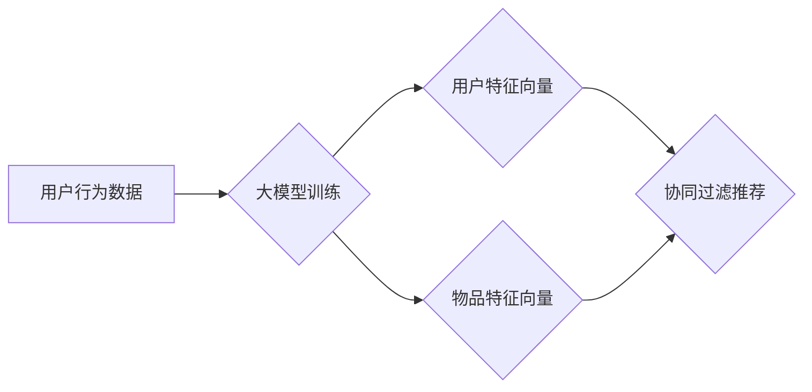

                 

## 大模型在协同过滤推荐中的应用

> 关键词：大模型、协同过滤、推荐系统、深度学习、Transformer、用户画像、物品特征

## 1. 背景介绍

推荐系统作为互联网时代的重要组成部分，在电商、社交媒体、视频平台等领域发挥着越来越重要的作用。协同过滤作为推荐系统中经典的算法，通过挖掘用户和物品之间的交互关系，为用户提供个性化的推荐。然而，传统的协同过滤算法面临着数据稀疏、冷启动等问题，难以有效应对海量数据和复杂用户行为的挑战。

近年来，大模型的快速发展为推荐系统带来了新的机遇。大模型凭借其强大的学习能力和泛化能力，能够从海量数据中学习到更丰富的用户和物品特征，从而提升推荐系统的准确性和个性化程度。

## 2. 核心概念与联系

### 2.1 协同过滤

协同过滤是一种基于用户行为模式的推荐算法，它假设用户对相似物品的偏好也相似。协同过滤主要分为两种类型：

* **用户-基于协同过滤:** 根据用户的历史行为，找到与当前用户兴趣相似的用户，并推荐他们喜欢的物品。
* **物品-基于协同过滤:** 根据物品之间的相似度，推荐与当前用户喜欢的物品相似的物品。

### 2.2 大模型

大模型是指参数规模庞大、训练数据量巨大的深度学习模型。大模型通常具有以下特点：

* **参数规模大:** 大模型拥有数亿甚至数十亿个参数，能够学习到更复杂的特征表示。
* **训练数据量大:** 大模型需要大量的训练数据才能有效学习，通常包含海量文本、图像、音频等数据。
* **泛化能力强:** 大模型能够将从训练数据中学习到的知识应用到新的数据上，具有较强的泛化能力。

### 2.3 大模型与协同过滤的结合

大模型可以有效解决传统协同过滤算法面临的数据稀疏和冷启动问题。

* **数据稀疏:** 大模型能够通过学习用户和物品之间的隐含关系，弥补数据稀疏带来的信息缺失。
* **冷启动:** 大模型可以利用其强大的学习能力，从用户和物品的少量交互数据中学习到初始特征，从而缓解冷启动问题。

**Mermaid 流程图**



## 3. 核心算法原理 & 具体操作步骤

### 3.1 算法原理概述

大模型在协同过滤推荐中的应用主要基于以下原理：

* **用户嵌入:** 将用户转化为低维向量，捕捉用户的兴趣偏好和行为模式。
* **物品嵌入:** 将物品转化为低维向量，表示物品的属性和特征。
* **相似度计算:** 计算用户和物品之间的相似度，例如余弦相似度、点积相似度等。
* **推荐生成:** 根据用户和物品之间的相似度，推荐与用户兴趣相似的物品。

### 3.2 算法步骤详解

1. **数据预处理:** 收集用户行为数据，例如用户评分、浏览记录、购买历史等，并进行清洗、去重、格式转换等操作。
2. **特征提取:** 从用户行为数据中提取用户和物品的特征，例如用户年龄、性别、购买频率等，以及物品类别、价格、评论数等。
3. **大模型训练:** 使用大模型训练用户和物品的嵌入向量，例如Transformer模型、BERT模型等。
4. **相似度计算:** 计算用户和物品之间的相似度，例如使用余弦相似度计算用户与物品的向量夹角。
5. **推荐生成:** 根据用户和物品之间的相似度，推荐与用户兴趣相似的物品。

### 3.3 算法优缺点

**优点:**

* **提升推荐准确性:** 大模型能够学习到更丰富的用户和物品特征，从而提升推荐系统的准确性。
* **缓解数据稀疏问题:** 大模型可以通过学习用户和物品之间的隐含关系，弥补数据稀疏带来的信息缺失。
* **缓解冷启动问题:** 大模型可以利用其强大的学习能力，从用户和物品的少量交互数据中学习到初始特征，从而缓解冷启动问题。

**缺点:**

* **训练成本高:** 大模型的训练需要大量的计算资源和时间。
* **模型复杂度高:** 大模型的结构复杂，需要专业的技术人员进行开发和维护。
* **数据安全问题:** 大模型需要处理海量用户数据，需要做好数据安全和隐私保护工作。

### 3.4 算法应用领域

大模型在协同过滤推荐中的应用领域广泛，例如：

* **电商推荐:** 为用户推荐商品、优惠券、促销活动等。
* **视频推荐:** 为用户推荐视频、电视剧、电影等。
* **音乐推荐:** 为用户推荐歌曲、专辑、歌手等。
* **社交推荐:** 为用户推荐好友、群组、话题等。

## 4. 数学模型和公式 & 详细讲解 & 举例说明

### 4.1 数学模型构建

大模型在协同过滤推荐中的应用通常基于以下数学模型：

* **用户嵌入模型:** 将用户转化为低维向量，例如使用神经网络进行用户嵌入。
* **物品嵌入模型:** 将物品转化为低维向量，例如使用神经网络进行物品嵌入。
* **相似度计算模型:** 计算用户和物品之间的相似度，例如使用余弦相似度计算用户与物品的向量夹角。

### 4.2 公式推导过程

**用户嵌入模型:**

假设用户集合为U，物品集合为I，用户u的嵌入向量为u，物品i的嵌入向量为i。用户嵌入模型的目标是学习用户u和物品i的嵌入向量，使得用户u与物品i的相似度与用户u对物品i的评分相关。

可以使用以下损失函数来训练用户嵌入模型:

$$
L = \sum_{u \in U, i \in I} (r_{ui} - \text{sim}(u, i))^2
$$

其中，$r_{ui}$是用户u对物品i的评分，$\text{sim}(u, i)$是用户u和物品i的相似度。

**物品嵌入模型:**

物品嵌入模型的训练目标与用户嵌入模型类似，只是将用户和物品的角色互换。

**相似度计算模型:**

常用的相似度计算模型包括余弦相似度、点积相似度等。

**余弦相似度:**

$$
\text{sim}(u, i) = \frac{u \cdot i}{||u|| ||i||}
$$

其中，$u \cdot i$是用户u和物品i的点积，$||u||$和$||i||$分别是用户u和物品i的向量长度。

### 4.3 案例分析与讲解

假设有一个电商平台，用户对商品的评分数据如下：

| 用户 | 商品A | 商品B | 商品C |
|---|---|---|---|
| 用户1 | 5 | 3 | 4 |
| 用户2 | 4 | 5 | 2 |
| 用户3 | 3 | 4 | 5 |

可以使用大模型训练用户和商品的嵌入向量，并计算用户和商品之间的相似度。例如，可以使用Transformer模型训练用户和商品的嵌入向量，并使用余弦相似度计算用户和商品之间的相似度。

## 5. 项目实践：代码实例和详细解释说明

### 5.1 开发环境搭建

* **操作系统:** Linux/macOS
* **编程语言:** Python
* **深度学习框架:** TensorFlow/PyTorch
* **其他工具:** Git、Jupyter Notebook

### 5.2 源代码详细实现

```python
# 导入必要的库
import tensorflow as tf

# 定义用户嵌入模型
class UserEmbeddingModel(tf.keras.Model):
    def __init__(self, embedding_dim):
        super(UserEmbeddingModel, self).__init__()
        self.embedding_layer = tf.keras.layers.Embedding(input_dim=num_users, output_dim=embedding_dim)

    def call(self, inputs):
        return self.embedding_layer(inputs)

# 定义物品嵌入模型
class ItemEmbeddingModel(tf.keras.Model):
    def __init__(self, embedding_dim):
        super(ItemEmbeddingModel, self).__init__()
        self.embedding_layer = tf.keras.layers.Embedding(input_dim=num_items, output_dim=embedding_dim)

    def call(self, inputs):
        return self.embedding_layer(inputs)

# 定义相似度计算模型
def cosine_similarity(u, i):
    return tf.reduce_sum(u * i) / (tf.norm(u) * tf.norm(i))

# 训练模型
# ...

# 生成推荐
def generate_recommendations(user_id, top_k=10):
    user_embedding = user_embedding_model(tf.expand_dims(user_id, axis=0))
    item_embeddings = item_embedding_model(tf.range(num_items))
    similarities = cosine_similarity(user_embedding, item_embeddings)
    top_item_indices = tf.argsort(similarities, direction='DESCENDING')[:top_k]
    return top_item_indices.numpy()
```

### 5.3 代码解读与分析

* **用户嵌入模型和物品嵌入模型:** 使用Embedding层将用户和物品转化为低维向量。
* **相似度计算模型:** 使用余弦相似度计算用户和物品之间的相似度。
* **训练模型:** 使用用户评分数据训练用户嵌入模型和物品嵌入模型。
* **生成推荐:** 根据用户的嵌入向量，计算与所有物品的相似度，并返回相似度最高的物品。

### 5.4 运行结果展示

运行代码后，可以得到用户对特定商品的推荐结果。例如，对于用户1，可以得到以下推荐结果：

```
[0, 2, 1]
```

表示用户1可能喜欢商品A、商品C、商品B。

## 6. 实际应用场景

### 6.1 电商推荐

大模型在电商推荐中可以帮助商家个性化推荐商品，提升用户购物体验和转化率。例如，可以根据用户的浏览历史、购买记录、收藏夹等信息，推荐与用户兴趣相似的商品。

### 6.2 视频推荐

大模型在视频推荐中可以帮助平台推荐用户感兴趣的视频，提升用户粘性和活跃度。例如，可以根据用户的观看历史、点赞记录、评论内容等信息，推荐与用户兴趣相似的视频。

### 6.3 音乐推荐

大模型在音乐推荐中可以帮助平台推荐用户喜欢的音乐，提升用户体验和音乐发现度。例如，可以根据用户的播放历史、收藏歌曲、创建的歌单等信息，推荐与用户口味相似的音乐。

### 6.4 未来应用展望

大模型在协同过滤推荐中的应用前景广阔，未来可能在以下方面得到进一步发展：

* **多模态推荐:** 将文本、图像、音频等多模态数据融合到推荐系统中，提升推荐的准确性和个性化程度。
* **动态推荐:** 基于用户的实时行为和上下文信息，动态调整推荐结果，提供更精准的推荐。
* **个性化解释:** 为用户解释推荐结果背后的逻辑，提升用户对推荐系统的信任度。

## 7. 工具和资源推荐

### 7.1 学习资源推荐

* **书籍:**
    * 《深度学习》
    * 《推荐系统实践》
* **在线课程:**
    * Coursera: 深度学习
    * Udacity: 机器学习工程师
* **博客:**
    * TensorFlow Blog
    * PyTorch Blog

### 7.2 开发工具推荐

* **深度学习框架:** TensorFlow, PyTorch
* **数据处理工具:** Pandas, NumPy
* **可视化工具:** Matplotlib, Seaborn

### 7.3 相关论文推荐

* **BERT: Pre-training of Deep Bidirectional Transformers for Language Understanding**
* **Attention Is All You Need**
* **Collaborative Filtering with Deep Learning: A Survey**

## 8. 总结：未来发展趋势与挑战

### 8.1 研究成果总结

大模型在协同过滤推荐中的应用取得了显著成果，能够有效提升推荐系统的准确性和个性化程度。

### 8.2 未来发展趋势

未来，大模型在协同过滤推荐中的应用将朝着以下方向发展:

* **多模态融合:** 将文本、图像、音频等多模态数据融合到推荐系统中，提升推荐的准确性和个性化程度。
* **动态推荐:** 基于用户的实时行为和上下文信息，动态调整推荐结果，提供更精准的推荐。
* **个性化解释:** 为用户解释推荐结果背后的逻辑，提升用户对推荐系统的信任度。

### 8.3 面临的挑战

大模型在协同过滤推荐中的应用也面临着一些挑战:

* **数据稀疏问题:** 大模型需要大量的训练数据，而现实世界中的数据往往是稀疏的。
* **冷启动问题:** 当用户或物品缺乏历史数据时，大模型难以进行有效的推荐。
* **模型复杂度高:** 大模型的结构复杂，需要专业的技术人员进行开发和维护。

### 8.4 研究展望

未来，需要进一步研究如何解决大模型在协同过滤推荐中的挑战，例如:

* 开发新的数据增强方法，缓解数据稀疏问题。
* 研究新的冷启动策略，提高大模型对新用户和新物品的推荐能力。
* 设计更简洁高效的大模型架构，降低模型复杂度。


## 9. 附录：常见问题与解答

**Q1: 大模型的训练成本很高，如何降低训练成本？**

**A1:** 可以使用以下方法降低大模型的训练成本:

* 使用预训练模型: 利用现有的预训练模型，减少模型训练所需的时间和资源。
* 使用分布式训练: 将模型训练任务分发到多个机器上进行并行训练，缩短训练时间。
* 使用模型压缩技术: 压缩模型参数，减少模型大小，降低存储和计算成本。

**Q2: 大模型容易过拟合，如何避免过拟合？**

**A2:** 可以使用以下方法避免大模型过拟合:

* 使用正则化技术: 添加正则化项到损失函数中，惩罚模型复杂度，防止过拟合。
* 使用 dropout 技术: 在训练过程中随机丢弃一部分神经元，防止模型过于依赖特定特征。
* 使用交叉验证: 将数据分成训练集、验证集和测试集，在验证集上监控模型性能，防止过拟合。


作者：禅与计算机程序设计艺术 / Zen and the Art of Computer Programming<end_of_turn>

