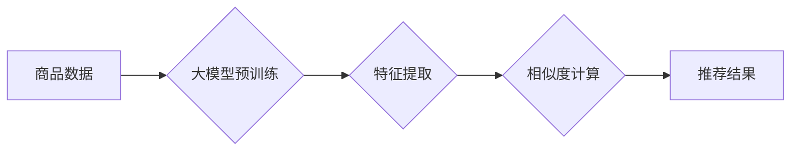

                 

## 大模型在商品相似度计算中的应用

> 关键词：大模型、商品相似度、推荐系统、自然语言处理、深度学习、Transformer、BERT

## 1. 背景介绍

在电子商务时代，商品相似度计算作为推荐系统的重要组成部分，在个性化推荐、商品搜索、跨界关联等方面发挥着至关重要的作用。传统的商品相似度计算方法主要依赖于商品的特征信息，例如类别、属性、描述等，但这些方法往往难以捕捉商品之间的语义关联和用户偏好。

近年来，大模型技术的发展为商品相似度计算带来了新的机遇。大模型，例如BERT、GPT等，拥有强大的语义理解能力和文本生成能力，能够更好地捕捉商品之间的语义相似度，从而提升商品推荐的精准度和用户体验。

## 2. 核心概念与联系

### 2.1 商品相似度计算

商品相似度计算是指根据商品之间的特征或属性，量化其相似程度的度量。相似度计算结果通常是一个数值，数值越大表示商品越相似。

### 2.2 大模型

大模型是指参数规模庞大、训练数据海量的人工智能模型。大模型通常基于深度学习技术，例如Transformer架构，能够学习到复杂的语义关系和模式。

### 2.3 自然语言处理

自然语言处理（NLP）是人工智能领域的一个重要分支，旨在使计算机能够理解、处理和生成人类语言。大模型在NLP领域取得了突破性进展，例如在文本分类、机器翻译、问答系统等任务上表现出色。

**大模型与商品相似度计算的联系**

大模型能够通过学习海量文本数据，理解商品的语义特征，从而实现更精准的商品相似度计算。

**Mermaid 流程图**



## 3. 核心算法原理 & 具体操作步骤

### 3.1 算法原理概述

大模型在商品相似度计算中的应用主要基于以下原理：

* **语义嵌入:** 大模型能够将商品的文本描述转换为向量表示，称为语义嵌入。语义嵌入能够捕捉商品之间的语义相似度。
* **相似度度量:** 使用余弦相似度、欧氏距离等方法计算商品语义嵌入之间的相似度。

### 3.2 算法步骤详解

1. **数据预处理:** 对商品数据进行清洗、去停用词、分词等预处理操作。
2. **语义嵌入生成:** 使用预训练好的大模型，例如BERT，对商品描述进行编码，生成商品语义嵌入。
3. **相似度计算:** 使用余弦相似度、欧氏距离等方法计算商品语义嵌入之间的相似度。
4. **结果排序:** 根据商品相似度进行排序，输出相似商品列表。

### 3.3 算法优缺点

**优点:**

* 能够捕捉商品之间的语义关联，提升相似度计算的精准度。
* 能够处理海量商品数据，并快速计算相似度。

**缺点:**

* 需要大量的训练数据和计算资源。
* 对数据质量要求较高，数据噪声会影响模型性能。

### 3.4 算法应用领域

* **电商推荐:** 推荐用户可能感兴趣的商品。
* **商品搜索:** 根据用户搜索关键词，返回相关商品。
* **跨界关联:** 发现不同类别商品之间的关联关系。

## 4. 数学模型和公式 & 详细讲解 & 举例说明

### 4.1 数学模型构建

假设我们有N个商品，每个商品都有一个对应的语义嵌入向量，记为$x_i \in R^d$，其中d为嵌入向量的维度。

商品之间的相似度可以使用余弦相似度来度量，余弦相似度定义为两个向量夹角的余弦值。

### 4.2 公式推导过程

**余弦相似度公式:**

$$
\text{Sim}(x_i, x_j) = \frac{x_i \cdot x_j}{||x_i|| ||x_j||}
$$

其中:

* $x_i \cdot x_j$ 为两个向量$x_i$和$x_j$的点积。
* $||x_i||$ 和 $||x_j||$ 分别为向量$x_i$和$x_j$的L2范数。

### 4.3 案例分析与讲解

假设有两个商品的语义嵌入向量如下:

* $x_1 = [0.2, 0.3, 0.4, 0.5]$
* $x_2 = [0.4, 0.5, 0.6, 0.7]$

计算这两个商品之间的余弦相似度:

$$
\text{Sim}(x_1, x_2) = \frac{0.2 \cdot 0.4 + 0.3 \cdot 0.5 + 0.4 \cdot 0.6 + 0.5 \cdot 0.7}{\sqrt{0.2^2 + 0.3^2 + 0.4^2 + 0.5^2} \sqrt{0.4^2 + 0.5^2 + 0.6^2 + 0.7^2}}
$$

经过计算，得到这两个商品之间的余弦相似度为0.95，表示这两个商品非常相似。

## 5. 项目实践：代码实例和详细解释说明

### 5.1 开发环境搭建

* Python 3.7+
* TensorFlow 2.0+
* PyTorch 1.0+
* NLTK
* SpaCy

### 5.2 源代码详细实现

```python
from transformers import BertModel, BertTokenizer

# 加载预训练模型和词典
model_name = "bert-base-uncased"
tokenizer = BertTokenizer.from_pretrained(model_name)
model = BertModel.from_pretrained(model_name)

# 商品描述数据
product_descriptions = [
    "这是一件舒适的T恤",
    "这是一件时尚的牛仔裤",
    "这是一件温暖的毛衣",
]

# 生成商品语义嵌入
embeddings = []
for description in product_descriptions:
    inputs = tokenizer(description, return_tensors="pt")
    outputs = model(**inputs)
    embedding = outputs.last_hidden_state[:, 0, :]  # 取第一个token的嵌入向量
    embeddings.append(embedding.detach().numpy())

# 计算商品相似度
from sklearn.metrics.pairwise import cosine_similarity

similarity_matrix = cosine_similarity(embeddings)

# 打印相似度矩阵
print(similarity_matrix)
```

### 5.3 代码解读与分析

1. 加载预训练的BERT模型和词典。
2. 对商品描述数据进行预处理，并使用BERT模型生成商品语义嵌入。
3. 使用余弦相似度计算商品之间的相似度，并存储在相似度矩阵中。
4. 打印相似度矩阵，展示商品之间的相似关系。

### 5.4 运行结果展示

运行代码后，会输出一个相似度矩阵，矩阵中的每个元素代表两个商品之间的相似度。相似度值越大，表示两个商品越相似。

## 6. 实际应用场景

### 6.1 电商推荐

大模型在商品相似度计算中的应用可以用于个性化商品推荐。例如，当用户购买了一件T恤后，系统可以根据T恤的语义特征，推荐其他与T恤相似的商品，例如衬衫、Polo衫等。

### 6.2 商品搜索

大模型可以提升商品搜索的精准度。当用户输入搜索关键词时，系统可以根据关键词的语义特征，找到与关键词语义相似的商品，并返回给用户。

### 6.3 跨界关联

大模型可以发现不同类别商品之间的关联关系。例如，系统可以发现T恤和牛仔裤之间的关联关系，并推荐用户购买T恤和牛仔裤搭配。

### 6.4 未来应用展望

随着大模型技术的不断发展，其在商品相似度计算中的应用将更加广泛和深入。例如，未来可以利用大模型实现更精准的商品推荐、更智能的商品搜索、更丰富的跨界关联等功能。

## 7. 工具和资源推荐

### 7.1 学习资源推荐

* **BERT论文:** https://arxiv.org/abs/1810.04805
* **Hugging Face Transformers库:** https://huggingface.co/docs/transformers/index

### 7.2 开发工具推荐

* **TensorFlow:** https://www.tensorflow.org/
* **PyTorch:** https://pytorch.org/

### 7.3 相关论文推荐

* **商品相似度计算综述:** https://arxiv.org/abs/1906.06315
* **基于大模型的商品推荐系统:** https://arxiv.org/abs/2103.06547

## 8. 总结：未来发展趋势与挑战

### 8.1 研究成果总结

大模型在商品相似度计算中的应用取得了显著的成果，能够提升商品推荐的精准度和用户体验。

### 8.2 未来发展趋势

* **模型规模和性能的提升:** 未来将会有更大规模、更强大的大模型出现，能够更好地捕捉商品之间的语义关联。
* **多模态商品相似度计算:** 将结合图像、视频等多模态数据，实现更全面的商品相似度计算。
* **个性化商品推荐:** 利用用户行为数据和偏好信息，实现更个性化的商品推荐。

### 8.3 面临的挑战

* **数据质量和标注问题:** 大模型需要海量高质量的数据进行训练，数据质量和标注问题是制约大模型应用的关键因素。
* **模型解释性和可解释性:** 大模型的决策过程往往难以解释，缺乏可解释性会影响用户信任和接受度。
* **计算资源和成本:** 训练和部署大模型需要大量的计算资源和成本，这对中小企业来说是一个挑战。

### 8.4 研究展望

未来研究将重点关注以下几个方面:

* 开发更有效的训练方法和数据标注策略，提升大模型的性能和鲁棒性。
* 研究大模型的解释性和可解释性，使其决策过程更加透明和可信。
* 探索大模型在其他电商场景中的应用，例如商品分类、价格预测等。


## 9. 附录：常见问题与解答

**Q1: 大模型的训练需要多少数据？**

A1: 大模型的训练数据量通常在数十亿甚至上百亿级别。

**Q2: 如何评估大模型的性能？**

A2: 大模型的性能可以通过多种指标来评估，例如准确率、召回率、F1-score等。

**Q3: 如何部署大模型？**

A3: 大模型可以部署在云服务器、边缘设备等平台上。

**Q4: 大模型的成本高吗？**

A4: 训练和部署大模型需要大量的计算资源和成本，但随着技术的进步，成本也在逐渐降低。


作者：禅与计算机程序设计艺术 / Zen and the Art of Computer Programming 
<end_of_turn>

