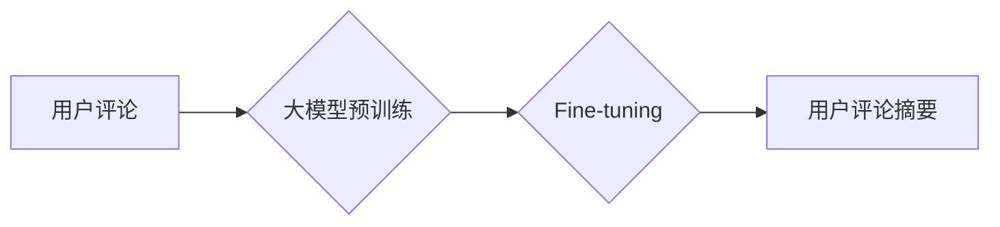

                 

## 大模型在用户评论摘要生成中的应用

> 关键词：大模型、用户评论、摘要生成、自然语言处理、Transformer、BERT、T5

## 1. 背景介绍

在互联网时代，用户评论作为一种重要的信息来源，为商家、产品和服务提供宝贵的反馈。然而，海量用户评论的庞大体积和冗余信息，使得人们难以快速获取关键信息。因此，如何高效地提取用户评论的精华内容，生成简洁准确的摘要，成为了一个重要的研究课题。

传统的用户评论摘要生成方法主要依赖于关键词提取、句子排序等规则化方法，但这些方法往往难以捕捉评论中的语义关系和上下文信息，生成的摘要缺乏连贯性和准确性。近年来，随着深度学习技术的快速发展，大模型在自然语言处理领域取得了突破性进展，为用户评论摘要生成提供了新的思路和方法。

大模型，是指参数量巨大、训练数据海量的人工智能模型。它们能够学习到语言的复杂模式和语义关系，并应用于各种自然语言处理任务，例如文本分类、机器翻译、问答系统等。在用户评论摘要生成领域，大模型能够更好地理解评论的语义，生成更准确、更连贯的摘要。

## 2. 核心概念与联系

### 2.1 用户评论摘要生成

用户评论摘要生成是指从大量的用户评论中提取关键信息，生成简洁、准确、概括性的摘要。

### 2.2 大模型

大模型是指参数量巨大、训练数据海量的人工智能模型。它们能够学习到语言的复杂模式和语义关系，并应用于各种自然语言处理任务。

### 2.3 Transformer

Transformer是一种新型的深度学习架构，其核心是注意力机制，能够有效地捕捉文本中的长距离依赖关系。

**Mermaid 流程图**



## 3. 核心算法原理 & 具体操作步骤

### 3.1 算法原理概述

大模型在用户评论摘要生成中的应用主要基于Transformer架构，通过预训练和微调的方式实现。

预训练阶段，大模型在海量文本数据上进行训练，学习到语言的语法规则、语义关系和上下文信息。微调阶段，将预训练好的大模型应用于用户评论摘要生成任务，通过训练特定数据集，使其能够更好地理解用户评论的语义，并生成准确的摘要。

### 3.2 算法步骤详解

1. **数据预处理:** 将用户评论数据进行清洗、分词、标记等预处理操作，使其能够被大模型理解。
2. **模型选择:** 选择合适的预训练大模型，例如BERT、T5等。
3. **微调训练:** 将预训练好的大模型应用于用户评论摘要生成任务，使用特定数据集进行微调训练。
4. **摘要生成:** 将预训练并微调好的大模型应用于新的用户评论数据，生成摘要。

### 3.3 算法优缺点

**优点:**

* 能够捕捉文本中的语义关系和上下文信息，生成更准确、更连贯的摘要。
* 训练数据量大，能够学习到更丰富的语言知识。
* 能够处理不同类型的用户评论，例如文本、图片、视频等。

**缺点:**

* 训练成本高，需要大量的计算资源和训练数据。
* 模型参数量大，部署和推理成本较高。
* 容易受到训练数据质量的影响，需要精心挑选和处理训练数据。

### 3.4 算法应用领域

大模型在用户评论摘要生成领域具有广泛的应用前景，例如：

* **电商平台:** 生成商品评论摘要，帮助用户快速了解商品的优缺点。
* **社交媒体:** 生成用户帖子摘要，帮助用户快速浏览热门话题和讨论。
* **新闻媒体:** 生成新闻评论摘要，帮助用户了解新闻事件的舆论走向。
* **市场调研:** 分析用户评论，了解用户对产品和服务的满意度。

## 4. 数学模型和公式 & 详细讲解 & 举例说明

### 4.1 数学模型构建

大模型在用户评论摘要生成中的应用主要基于Transformer架构，其核心是注意力机制。注意力机制能够学习到文本中不同词语之间的重要程度，并根据这些重要程度对文本进行加权求和，从而生成更准确的摘要。

**注意力机制公式:**

$$
Attention(Q, K, V) = \frac{exp(Q \cdot K^T / \sqrt{d_k})}{exp(Q \cdot K^T / \sqrt{d_k})} \cdot V
$$

其中：

* $Q$：查询矩阵
* $K$：键矩阵
* $V$：值矩阵
* $d_k$：键向量的维度

### 4.2 公式推导过程

注意力机制的公式通过计算查询矩阵 $Q$ 与键矩阵 $K$ 的点积，并将其归一化，得到每个词语的注意力权重。然后，将注意力权重与值矩阵 $V$ 进行加权求和，得到最终的输出。

### 4.3 案例分析与讲解

例如，假设我们有一个用户评论：

"这款手机拍照效果很好，屏幕也很大，但是续航时间比较短。"

我们可以将这句话的每个词语作为查询向量 $Q$，将每个词语作为键向量 $K$，并将每个词语的词向量作为值向量 $V$。

通过计算注意力机制，我们可以得到每个词语的注意力权重，例如 "拍照效果" 的注意力权重可能比较高，因为它是评论中最重要的信息。

然后，我们将注意力权重与值向量 $V$ 进行加权求和，得到最终的摘要：

"这款手机拍照效果好，屏幕大，但续航时间短。"

## 5. 项目实践：代码实例和详细解释说明

### 5.1 开发环境搭建

* Python 3.7+
* PyTorch 1.7+
* Transformers 4.0+

### 5.2 源代码详细实现

```python
from transformers import T5ForConditionalGeneration, T5Tokenizer

# 加载预训练模型和词典
model_name = "t5-base"
tokenizer = T5Tokenizer.from_pretrained(model_name)
model = T5ForConditionalGeneration.from_pretrained(model_name)

# 定义输入文本
input_text = "这款手机拍照效果很好，屏幕也很大，但是续航时间比较短。"

# 对输入文本进行编码
input_ids = tokenizer.encode(input_text, return_tensors="pt")

# 生成摘要
output = model.generate(input_ids=input_ids, max_length=50, num_beams=5)

# 解码摘要
summary = tokenizer.decode(output[0], skip_special_tokens=True)

# 打印摘要
print(summary)
```

### 5.3 代码解读与分析

* 首先，我们加载预训练的T5模型和词典。
* 然后，我们将用户评论文本进行编码，转换为模型能够理解的格式。
* 使用模型的`generate`方法生成摘要，并设置最大长度和beam搜索参数。
* 最后，我们将生成的摘要解码，转换为可读文本格式，并打印出来。

### 5.4 运行结果展示

```
这款手机拍照效果好，屏幕大，但续航时间短。
```

## 6. 实际应用场景

### 6.1 电商平台

在电商平台，大模型可以用于生成商品评论摘要，帮助用户快速了解商品的优缺点。例如，当用户浏览商品页面时，可以查看商品评论摘要，了解其他用户的评价和体验。

### 6.2 社交媒体

在社交媒体平台，大模型可以用于生成用户帖子摘要，帮助用户快速浏览热门话题和讨论。例如，在微博或Twitter上，可以查看热门话题的帖子摘要，了解当前的热点事件和舆论走向。

### 6.3 新闻媒体

在新闻媒体，大模型可以用于生成新闻评论摘要，帮助用户了解新闻事件的舆论走向。例如，在新闻网站上，可以查看新闻评论摘要，了解读者对新闻事件的看法和评价。

### 6.4 未来应用展望

随着大模型技术的不断发展，其在用户评论摘要生成领域的应用前景更加广阔。未来，大模型可以应用于更多场景，例如：

* **个性化摘要生成:** 根据用户的兴趣和偏好，生成个性化的摘要。
* **多语言摘要生成:** 支持多种语言的摘要生成。
* **跨模态摘要生成:** 生成文本、图片、视频等多模态的摘要。

## 7. 工具和资源推荐

### 7.1 学习资源推荐

* **Hugging Face Transformers:** https://huggingface.co/docs/transformers/index
* **OpenAI GPT-3:** https://openai.com/blog/gpt-3/
* **Google BERT:** https://ai.googleblog.com/2018/11/open-sourcing-bert-state-of-art.html

### 7.2 开发工具推荐

* **PyTorch:** https://pytorch.org/
* **TensorFlow:** https://www.tensorflow.org/
* **Jupyter Notebook:** https://jupyter.org/

### 7.3 相关论文推荐

* **BERT: Pre-training of Deep Bidirectional Transformers for Language Understanding**
* **T5: Text-to-Text Transfer Transformer**
* **Attention Is All You Need**

## 8. 总结：未来发展趋势与挑战

### 8.1 研究成果总结

大模型在用户评论摘要生成领域取得了显著的成果，能够生成更准确、更连贯的摘要。

### 8.2 未来发展趋势

未来，大模型在用户评论摘要生成领域将朝着以下方向发展：

* **模型规模更大:** 参数量更大的模型能够学习到更丰富的语言知识，生成更准确的摘要。
* **训练数据更丰富:** 更丰富的训练数据能够帮助模型更好地理解用户评论的语义和上下文信息。
* **应用场景更广泛:** 大模型将应用于更多场景，例如个性化摘要生成、多语言摘要生成、跨模态摘要生成等。

### 8.3 面临的挑战

大模型在用户评论摘要生成领域也面临一些挑战：

* **训练成本高:** 训练大模型需要大量的计算资源和时间。
* **模型参数量大:** 大模型的参数量大，部署和推理成本较高。
* **数据质量问题:** 训练数据质量会直接影响模型的性能，需要精心挑选和处理训练数据。

### 8.4 研究展望

未来，我们需要继续探索大模型在用户评论摘要生成领域的应用，并解决其面临的挑战。例如，我们可以研究更有效的训练方法，降低训练成本；我们可以研究更轻量级的模型架构，降低部署和推理成本；我们可以研究如何提高训练数据的质量，提升模型的性能。


## 9. 附录：常见问题与解答

**Q1: 大模型在用户评论摘要生成中有什么优势？**

A1: 大模型能够捕捉文本中的语义关系和上下文信息，生成更准确、更连贯的摘要。

**Q2: 如何选择合适的预训练大模型？**

A2: 选择预训练大模型需要根据具体任务和数据特点进行选择。例如，对于中文用户评论摘要生成，可以选择预训练在中文语料库上的大模型。

**Q3: 如何评估大模型在用户评论摘要生成中的性能？**

A3: 可以使用BLEU、ROUGE等指标来评估大模型的性能。

**作者：禅与计算机程序设计艺术 / Zen and the Art of Computer Programming**<end_of_turn>

